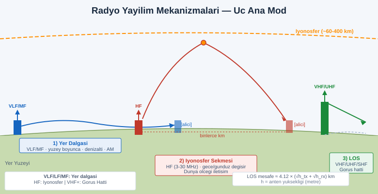
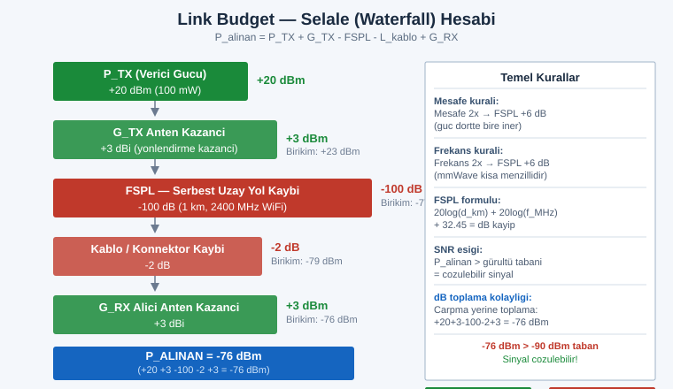
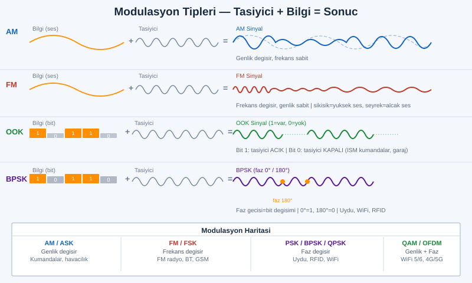

# SIGINT EL KİTABI — BÖLÜM 1: RF FİZİĞİ, SPEKTRUM VE MODÜLASYON
## Sinyalin Anatomisi — Sıfırdan Kahramana (Zero-to-Hero)

> **Amaç:** Bir sinyali "duymadan önce" onu **anlamak**. Bir SDR (Software Defined Radio) cihazına dokunmadan önce, havadaki o görünmez dalganın *nasıl doğduğunu, nasıl bilgi taşıdığını, nasıl zayıfladığını ve neden bazı sinyallerin dünyanın öbür ucundan, bazılarının ise yandaki odadan bile zor geldiğini* kavramak. Bu bölüm tüm serinin **fizik ve matematik temelidir** — burayı atlarsan ileride "neden işe yaramadı?" sorusuna asla cevap veremezsin. Yeni başlayan için her kavram sıfırdan; ileri seviye için formüller, sınır durumları ve "kitaplarda kolay bulamayacağın" sezgiler.

> **YASAL ÇERÇEVE — ÖNCE BUNU OKU (atlama!):** Bu el kitabı **eğitim, savunma, spektrum okuryazarlığı ve kendi cihazlarını/ağını anlama** amacıyla yazılmıştır. Genel kural çoğu ülkede şudur: **dinlemek (pasif alım)** geniş ölçüde serbesttir (radyo, hava bandı dinleme, spektrum izleme), **ama** (a) belirli bandları (askeri, polis dijital şifreli, hücresel içerik) dinlemek, (b) dinlediğini *kaydetmek/yaymak/üçüncü kişiye aktarmak*, (c) **iletim yapmak (TX)**, (d) **jamming / karıştırma** ÇOĞU YERDE **suçtur ve ağır cezalıdır**. Türkiye'de bu alan **BTK** ve ilgili mevzuatla düzenlenir; ABD'de FCC + ECPA; AB'de ülke-bazlı. **Kendi sürümünden/ülkenden mutlaka teyit et.** Bu kitapta operatörlük değil **anlama** hedeflenir: alıştırmalar ev içi, kendi cihazların ve yasal yayın bandlarıyla sınırlıdır. *Yetkisiz dinleme/yayın/jamming, hiçbir koşulda bu kitabın amacı değildir.*

---

## İÇİNDEKİLER

1. [SIGINT Nedir? (COMINT / ELINT / FISINT) ve Bu Kitabın Yeri](#1)
2. [Sinyalin Yolculuğu — Kaynaktan Bilgiye Uçtan Uca](#2)
3. [Elektromanyetik Dalga — Frekans, Dalga Boyu, Periyot, Faz, Genlik](#3)
4. [Temel Formül: f = c / λ (Bol Örnekle)](#4)
5. [ITU Frekans Bandları ve Yayılım Karakteristiği](#5)
6. [Desibel Matematiği — dB, dBm, dBi/dBd, dBc (Sağlam Temel)](#6)
7. [Link Budget, FSPL ve Friis İletim Denklemi](#7)
8. [Gürültü, SNR, Gürültü Figürü ve Shannon-Hartley Kapasitesi](#8)
9. [Modülasyon Temelleri — Bilgi Dalgaya Nasıl Biner](#9)
10. [Analog Modülasyon: AM, FM, PM](#10)
11. [Sayısal Modülasyon: ASK, FSK, PSK, QAM, OFDM](#11)
12. [Yayılı Spektrum: FHSS ve DSSS](#12)
13. [IQ Örnekleme — Bir SDR Dünyayı Nasıl Görür](#13)
14. [Örnekleme Teoremi: Nyquist, Bant Genişliği, Aliasing](#14)
15. [Bir Sinyali "Tanıma" — Waterfall / Spektrogram Okuma](#15)
16. [ Alıştırmalar (Yasal, Ev İçi)](#16)
17. [Hızlı Referans Kartı & Sonraki Bölümler](#17)

---

<a id="1"></a>
## 1.  SIGINT Nedir? ve Bu Kitabın Yeri

**SIGINT (Signals Intelligence — Sinyal İstihbaratı)**, elektronik sinyallerden bilgi toplama disiplinidir. Geniş şemsiyesi altında üç ana dal vardır:

| Dal | Açılım | Neyi hedefler? | Örnek |
|---|---|---|---|
| **COMINT** | *Communications Intelligence* | İnsanlar/sistemler arası **iletişim içeriği** | Telsiz konuşması, mesaj trafiği, çağrı meta verisi |
| **ELINT** | *Electronic Intelligence* | İletişim **olmayan** elektronik yayınlar | Radar darbeleri, telemetri taşıyıcıları, parazit imzaları |
| **FISINT** | *Foreign Instrumentation Signals Intelligence* | Cihaz/araç **telemetri ve komut** sinyalleri | Roket telemetrisi, uydu kontrol bağı |

> **Sade ayrım:** COMINT "**ne konuşuluyor**" ile, ELINT "**orada ne tür bir verici/cihaz var**" ile ilgilenir. Bir radarın *frekansını, darbe tekrar oranını, anten dönüş hızını* çıkarmak ELINT'tir; o radarın *yanındaki telsiz görüşmesini* dinlemek COMINT'tir.

**Bu kitabın yeri:** Bu seri seni bir "operatör" değil, **spektrumu okuyabilen, sinyali tanıyabilen, neyin neden olduğunu anlayan** bir teknik analist seviyesine taşımayı amaçlar. Savunma tarafında (kendi yayınlarını anlama, TEMPEST/sızıntı farkındalığı, kendi RF yüzeyini bilme) ve **spektrum okuryazarlığı** açısından bu bilgi paha biçilmezdir. Saldırı/yetkisiz dinleme değil; **anlama ve farkındalık** hedeflenir.

Sıralama şöyledir: **Bölüm 1 (bu)** fizik+matematik temeli verir → **Bölüm 2** seni gerçek SDR donanımına götürür → sonraki bölümler protokol kod çözme, anten/kapsama, sayısal demodülasyon ve savunmaya iner (sonda çapraz referans var).

---

<a id="2"></a>
## 2.  Sinyalin Yolculuğu — Uçtan Uca

Havadaki her sinyal, aynı zinciri izler. Bu zinciri ezberle; kitabın geri kalanı bu halkaların *her birini* derinleştirir:

```
 KAYNAK         MODÜLASYON        VERİCİ            ORTAM (KANAL)
 (bilgi)         (bilgiyi          ANTENİ           hava / boşluk / kablo
  ses,           taşıyıcıya  ───►  (elektrik  ───►  • yol kaybı (zayıflama)
  veri,          bindir:           sinyalini         • gürültü eklenir
  metin)         AM/FM/PSK...)     EM dalgaya         • çok-yol (yansıma)
    │                              çevirir)           • Doppler (hareket)
    │                                                        │
    ▼                                                        ▼
 GERİ            DEMODÜLASYON      ALICI            ALICI ANTENİ
 BİLGİ    ◄───   (taşıyıcıdan ◄─── (zayıf RF'i ◄─── (EM dalgayı yeniden
 (çözülmüş)      bilgiyi ayıkla)   yükselt, IQ'ya    elektrik sinyaline
                                   çevir, sayısallaştır) çevirir)
```

Her aşamada bir şeyler olur ve **her aşama bir hata/zayıflık/iz kaynağıdır**:

- **Kaynak:** Analog (ses) ya da sayısal (bit) bilgi.
- **Modülasyon:** Bilgi, yüksek frekanslı bir **taşıyıcıya (carrier)** bindirilir. Neden? Çünkü düşük frekanslı bilgi (ör. 3 kHz ses) doğrudan anten edilemez — anten boyutu dalga boyuyla orantılıdır (Bölüm 3-4) ve binlerce kilometrelik anten gerekirdi.
- **Verici Anteni:** Elektriksel salınımı **elektromanyetik dalgaya** çevirir (transdüktör).
- **Ortam/Kanal:** Sinyalin en acımasız düşmanı. Mesafeyle zayıflar (**FSPL**), termal **gürültü** eklenir, yüzeylerden yansır (**çok-yol/multipath**), hareket varsa frekans kayar (**Doppler**).
- **Alıcı Anteni:** Zayıflamış dalgayı tekrar elektriğe çevirir.
- **Alıcı (Receiver):** Mikrovolt seviyesindeki sinyali yükseltir (LNA), karıştırıcı ile temel banda indirir, **IQ örnekleri** üretir (Bölüm 13), sayısallaştırır.
- **Demodülasyon:** Taşıyıcıdan bilgiyi geri ayıklar.
- **Geri Bilgi:** Ses/veri/metin yeniden elde edilir.

> **Ana sezgi:** SIGINT'in tüm zorluğu, **gürültü tabanının altına gömülmüş, zayıflamış, bozulmuş** bir sinyali bu zincirin sonunda yeniden anlamlı kılmaktır. "Ne kadar zayıf sinyali çözebilirim?" sorusunun cevabı tek bir orana bağlıdır: **SNR** (Bölüm 8).

---

<a id="3"></a>
## 3.  Elektromanyetik Dalga — Temel Büyüklükler

Radyo sinyali, bir **elektromanyetik (EM) dalgadır**: birbirine dik salınan elektrik (E) ve manyetik (B) alanların boşlukta ışık hızıyla yayılmasıdır. Onu tanımlayan dört temel büyüklük:

```
 Genlik
   ▲
 A │      ╱‾‾╲              ╱‾‾╲              ╱‾‾╲
   │     ╱    ╲            ╱    ╲            ╱    ╲
 0 │────╱──────╲──────────╱──────╲──────────╱──────╲────►  zaman (t)
   │           ╲        ╱          ╲       ╱
-A │            ╲__╱              ╲__╱
   │   |◄────── T ──────►|
   │   (bir tam periyot)
```

| Büyüklük | Sembol | Birim | Anlamı |
|---|---|---|---|
| **Frekans** | f | Hertz (Hz) | Saniyedeki tam salınım (dalga) sayısı |
| **Periyot** | T | saniye (s) | Bir tam salınımın süresi → **T = 1 / f** |
| **Dalga boyu** | λ (lambda) | metre (m) | İki ardışık tepe arası mesafe |
| **Genlik** | A | volt / amper (alan için V/m) | Dalganın "yüksekliği" → güçle ilişkili |
| **Faz** | φ (phi) | derece / radyan | Dalganın bir referansa göre zaman kayması |

**Frekans birimleri (sık karışır):**
- 1 kHz = 1.000 Hz (10³)
- 1 MHz = 1.000.000 Hz (10⁶)
- 1 GHz = 1.000.000.000 Hz (10⁹)

**Faz neden önemli?** Faz, dalganın "nerede başladığıdır". İki dalga aynı frekans ve genlikte olup **180° fazda kayık** ise birbirini söndürür (yıkıcı girişim). Faz, sayısal modülasyonun (PSK/QAM, Bölüm 11) bilgi taşıma yöntemidir — bilgiyi **fazın içine** gömeriz.

> **Sezgi:** Genlik = "ne kadar yüksek sesle", Frekans = "ne kadar tiz", Faz = "ne zaman başladı". Üçünü ayrı ayrı değiştirebilirsin → bu yüzden bilgiyi üçünden herhangi birine (ya da kombinasyonuna) bindirebilirsin. Modülasyonun tüm sırrı budur.

---

<a id="4"></a>
## 4.  Temel Formül: f = c / λ

Tüm RF'in en temel denklemi. Frekans, dalga boyu ve ışık hızını birbirine bağlar:

$$ f = \frac{c}{\lambda} \quad\Longleftrightarrow\quad \lambda = \frac{c}{f} \quad\Longleftrightarrow\quad c = f \times \lambda $$

Burada **c = ışık hızı ≈ 299.792.458 m/s** (pratikte **3 × 10⁸ m/s** alınır).

### Pratik kısayol (ezberle!)

Frekansı **MHz** cinsinden verirsen dalga boyu **metre** cinsinden çok kolay çıkar:

$$ \lambda \text{ (metre)} = \frac{300}{f \text{ (MHz)}} $$

### Örnek hesaplar

| Frekans | Hesap | Dalga boyu | Bant / kullanım |
|---|---|---|---|
| **100 MHz** (FM radyo) | 300 / 100 | **3 m** | VHF — FM yayın |
| **27 MHz** (CB telsiz) | 300 / 27 | **≈ 11,1 m** | HF üst sınırı |
| **433 MHz** (uzaktan kumanda) | 300 / 433 | **≈ 0,69 m** | UHF ISM |
| **915 MHz** (LoRa/ISM) | 300 / 915 | **≈ 0,33 m** | UHF |
| **2.400 MHz** (WiFi/BT) | 300 / 2400 | **≈ 0,125 m (12,5 cm)** | SHF (2.4 GHz) |
| **5.800 MHz** (WiFi 5 GHz) | 300 / 5800 | **≈ 0,052 m (5,2 cm)** | SHF |

> **Neden hayati?** **Anten boyutu, dalga boyuna bağlıdır.** Verimli bir anten genelde λ/2 ya da λ/4 uzunluğundadır. 100 MHz için λ/4 ≈ 75 cm (bir araç anteni boyu — mantıklı). 2,4 GHz WiFi için λ/4 ≈ 3,1 cm (o minik PCB anteni — mantıklı). 3 kHz sesi *doğrudan* yaymak isteseydin λ = 100 km olurdu → 25 km'lik anten gerekirdi! **İşte modülasyonun varlık sebebi:** düşük frekanslı bilgiyi, yüksek frekanslı (kısa dalga boylu, küçük antenli) bir taşıyıcıya bindirmek.

> **İncelik (teyit et):** Anten *fiziksel* boyutu, içinden geçtiği malzemenin **kısalma faktörü (velocity factor)** nedeniyle teorik λ/4'ten biraz kısadır (genelde ×0,95). Bakır telde λ/4 anten ≈ teorik değerin %95'i. Hassas anten tasarımında bu düzeltmeyi uygula.

---

<a id="5"></a>
## 5.  ITU Frekans Bandları ve Yayılım

ITU (Uluslararası Telekomünikasyon Birliği) spektrumu standart bandlara böler. **Her bandın yayılım davranışı farklıdır** — bu, "hangi sinyali nereden duyarım" sorusunun kalbidir.

| Band | Adı | Frekans | Dalga boyu | Yayılım karakteri | Tipik kullanım |
|---|---|---|---|---|---|
| **VLF** | Çok Alçak | 3–30 kHz | 100–10 km | Yer dalgası, su altına işler | Denizaltı iletişimi, navigasyon |
| **LF** | Alçak | 30–300 kHz | 10–1 km | Yer dalgası, çok kararlı | Uzun dalga AM, zaman sinyali (DCF77) |
| **MF** | Orta | 300 kHz–3 MHz | 1 km–100 m | Gündüz yer, gece iyonosfer | **AM yayın bandı**, deniz |
| **HF** | Yüksek | 3–30 MHz | 100–10 m | **İyonosfer sekmesi → dünya ölçeği** | Kısa dalga, amatör DX, havacılık (okyanus) |
| **VHF** | Çok Yüksek | 30–300 MHz | 10–1 m | **Görüş hattı (LOS)** + biraz kırınım | **FM radyo**, hava bandı, TV, deniz VHF |
| **UHF** | Ultra Yüksek | 300 MHz–3 GHz | 1 m–10 cm | Görüş hattı, binaya iyi nüfuz | **GSM/4G/5G**, WiFi 2.4G, TV, GPS, kumandalar |
| **SHF** | Süper Yüksek | 3–30 GHz | 10–1 cm | Dar hüzme, yağmurdan etkilenir | WiFi 5G, radar, uydu, mikrodalga link |
| **EHF** | Aşırı Yüksek | 30–300 GHz | 10–1 mm | Çok dar hüzme, atmosfer yutar | mmWave 5G, otomotiv radar (77 GHz), bilim |

### Yayılım fiziği — üç ana mekanizma

```
 1) YER DALGASI (VLF–MF)          2) İYONOSFER SEKMESİ (HF)         3) GÖRÜŞ HATTI (VHF+)
    Yeryüzünü takip eder              İyonosferden yansır               Düz çizgi; ufkun
    ┌──────────────────┐              ╱‾‾iyonosfer‾‾╲                  ötesini "göremez"
   ((●))~~~~~~~~~~~~►                ╱       ╲                         ((●))────►   ufuk
    ▔▔▔▔▔▔▔▔▔▔▔▔▔▔▔▔     ((●))──►───╱─────────╲───►──● çok uzak       ▔▔▔▔▔▔╲▔▔▔▔▔▔▔
    yüzeyi kucaklar       verici   ▔▔▔▔▔▔▔▔▔▔▔▔▔▔▔▔ alıcı                      kıvrımı kaçar
```



> **SIGINT için kritik sezgi:**
> - **HF (kısa dalga)** iyonosferden seker → **bir verici binlerce km öteden duyulabilir** (ve gece/gündüz, güneş aktivitesiyle dramatik değişir). Bu yüzden uzun mesafe istihbaratı tarihsel olarak HF'tedir.
> - **VHF/UHF görüş hattıdır** → kabaca ufuk çizgisine kadar duyarsın. Daha uzağı için yüksek anten ya da tekrarlayıcı (repeater) gerekir. Mesafe ≈ **4,12 × (√h_verici + √h_alıcı)** km (h = metre cinsi anten yüksekliği — radyo ufku, optik ufuktan biraz uzaktır, teyit et).
> - **SHF/EHF** dar hüzmeli ve atmosfere/yağmura duyarlıdır → çok kısa menzil ama çok yüksek bant genişliği (mmWave).

---

<a id="6"></a>
## 6.  Desibel Matematiği — RF'in Dili

RF'te güçler **devasa aralıkta** değişir: verici 100 watt (10² W) verirken alıcıya 0,000000000001 watt (10⁻¹² W) ulaşabilir. Bunları doğrusal yazmak imkânsızdır → **logaritma** (desibel) kullanırız. Bu bölümü **gerçekten** öğren; tüm link hesabı buna dayanır.

### Desibel (dB) — bir ORAN

dB bir **oranın** logaritmik ifadesidir (birimsiz, **göreceli**):

$$ \text{Güç oranı (dB)} = 10 \cdot \log_{10}\!\left(\frac{P_2}{P_1}\right) $$

> **Güç için 10·log, gerilim/alan için 20·log.** Çünkü güç ∝ gerilim². Karıştırma: anten/sinyal *gücü* konuşurken her zaman **10·log**.

### Ezberlenecek altın değerler

| Oran (×) | dB | Sezgi |
|---|---|---|
| **2×** | **+3 dB** | Gücü ikiye katlamak = +3 dB |
| **½×** | **−3 dB** | Gücü yarıya bölmek = −3 dB |
| **4×** | +6 dB | (3+3) |
| **10×** | **+10 dB** | Gücü 10'a katlamak = +10 dB |
| **100×** | +20 dB | (10+10) |
| **1000×** | +30 dB | (10+10+10) |
| **1×** | 0 dB | Değişim yok |

> **Neden bu kadar pratik:** Logaritma sayesinde **çarpma → toplama** olur. Bir zincirde 100× kazanç, sonra 4× kayıp, sonra 2× kazanç varsa: doğrusalda 100×0,25×2 = 50× hesaplarsın; dB'de **+20 − 6 + 3 = +17 dB** (≈ 50×) → çok daha kolay. RF zincirleri bu yüzden hep dB ile yazılır.

### Kombinasyon örneği
+3 dB ve +10 dB istersen: bir sinyali hem 2× hem 10× = 20× = **+13 dB**. Tersten: 8× kazanç kaç dB? 8 = 2×2×2 = 3+3+3 = **+9 dB**.

### dBm — MUTLAK güç (referansı 1 mW)

dB göreceli; **dBm** ise mutlak güçtür: referans **1 milliwatt**.

$$ P_{\text{dBm}} = 10 \cdot \log_{10}\!\left(\frac{P_{\text{mW}}}{1\,\text{mW}}\right) \quad\Longleftrightarrow\quad P_{\text{mW}} = 10^{\,P_{\text{dBm}}/10} $$

| Güç | dBm | Nerede görülür |
|---|---|---|
| 1 mW | **0 dBm** | Referans |
| 2 mW | +3 dBm | |
| 10 mW | +10 dBm | Bluetooth Class 2 |
| 100 mW | +20 dBm | WiFi tipik |
| 1 W (1000 mW) | **+30 dBm** | Telsiz |
| 100 W | +50 dBm | FM yayın (küçük) |
| 0,001 mW (1 µW) | −30 dBm | |
| 1 pW (10⁻⁹ mW) | **−90 dBm** | Zayıf ama çözülebilir alım |
| ~10⁻¹² mW | **−120 dBm** | Hassas alıcı tabanı |

> **Pratik dönüşüm pekiştirme:**
> - −70 dBm kaç mW? → 10^(−70/10) = 10⁻⁷ mW = **0,0000001 mW** (çok zayıf, ama tipik iyi WiFi sinyali).
> - +23 dBm kaç mW? → 10^(2,3) ≈ **200 mW** (tipik telefon TX gücü).
> - **Kural:** her +10 dBm = ×10 güç, her +3 dBm ≈ ×2 güç. −73 dBm = "S9" (amatör radyo sinyal kuvveti referansı, teyit et).

### dBi ve dBd — anten kazancı

Antenler güç *üretmez*; gücü **yönlendirir** (bir yönde yoğunlaştırır). Bu yoğunlaştırma "kazanç"tır:

- **dBi:** İzotropik (her yöne eşit yayan teorik nokta) antene göre kazanç.
- **dBd:** Yarım-dalga **dipol** antene göre kazanç.
- **İlişki:** **0 dBd = 2,15 dBi** (dipolün kendisi izotropa göre 2,15 dBi kazançlıdır).

| Anten | Tipik kazanç | Hüzme |
|---|---|---|
| İzotropik (teorik) | 0 dBi | Her yöne eşit |
| Yarım-dalga dipol | 2,15 dBi (= 0 dBd) | Donut şekli |
| Yagi (yönlü) | 7–20 dBi | Dar, ileri |
| Parabolik çanak | 20–45 dBi | Çok dar hüzme |

> **Sezgi:** Yüksek kazançlı anten = "el feneri", düşük kazançlı = "ampul". El feneri uzağı aydınlatır ama yalnızca **doğrulttuğun yönü**. SIGINT'te yönlü anten zayıf/uzak sinyali yakalamak ve **yön bulma (DF)** için kullanılır.

### dBc — taşıyıcıya göre

**dBc** ("dB relative to carrier"), bir bileşenin (yan bant, harmonik, parazit, faz gürültüsü) **ana taşıyıcıya göre** seviyesidir. Ör. "harmonik −60 dBc" → harmonik, taşıyıcıdan 1.000.000 kat (60 dB) zayıf. Verici temizliğini ve spektral saflığı ölçerken kullanılır.

---

<a id="7"></a>
## 7.  Link Budget, FSPL ve Friis Denklemi



**Link budget (bağlantı bütçesi)**, sinyalin vericiden alıcıya ulaşırken tüm kazanç ve kayıpların **toplamıdır**. dB sayesinde basit bir toplama/çıkarma:

$$ P_{\text{alınan (dBm)}} = P_{\text{TX}} + G_{\text{TX anten}} - L_{\text{yol}} - L_{\text{kablo/diğer}} + G_{\text{RX anten}} $$

- P_TX = verici çıkış gücü (dBm)
- G = anten kazançları (dBi)
- L = kayıplar (dB) — en büyüğü **yol kaybı**

### Serbest Uzay Yol Kaybı (FSPL)

Hiçbir engel olmadan, sinyal *yalnızca yayılarak* (küre yüzeyine dağılarak) zayıflar. Bu kaçınılmaz kayıp **FSPL**'dir:

$$ \text{FSPL (dB)} = 20\log_{10}(d) + 20\log_{10}(f) + 32{,}45 $$

(d = **kilometre**, f = **MHz** cinsinden; sabit **32,45** bu birimler içindir — başka birimlerde sabit değişir, teyit et.)

### FSPL örneği
Bir 2.400 MHz (WiFi) sinyali, açık alanda **1 km** gitsin:

$$ \text{FSPL} = 20\log_{10}(1) + 20\log_{10}(2400) + 32{,}45 = 0 + 67{,}6 + 32{,}45 \approx \mathbf{100\ dB} $$

Yani 1 km'de güç **10 milyar kat** (100 dB) düşer. Şimdi tam link:

| Kalem | Değer |
|---|---|
| Verici gücü P_TX | +20 dBm (100 mW) |
| Verici anten kazancı | +3 dBi |
| Yol kaybı (FSPL) | **− 100 dB** |
| Alıcı anten kazancı | +3 dBi |
| **Alınan güç** | **+20 +3 −100 +3 = −74 dBm** |

−74 dBm hâlâ çözülebilir bir WiFi seviyesidir (taban ≈ −90 dBm). **Ama** mesafeyi 10 km yaparsan FSPL +20 dB artar (her ×10 mesafe = +20 dB) → −94 dBm → tabanın altına düşer, çözülmez.

> **İki temel kural (ezberle):**
> - **Mesafe 2× → FSPL +6 dB** (her ikiye katlamada güç dörde bölünür).
> - **Frekans 2× → FSPL +6 dB** (yüksek frekans daha çok zayıflar — bu yüzden mmWave kısa menzilli).

### Friis İletim Denklemi

FSPL'in "ham" hali; alınan gücü **doğrusal** (oran) olarak verir:

$$ P_{\text{RX}} = P_{\text{TX}} \cdot G_{\text{TX}} \cdot G_{\text{RX}} \cdot \left(\frac{\lambda}{4\pi d}\right)^{2} $$

Buradaki **(λ / 4πd)²** terimi tam olarak serbest uzay zayıflamasıdır. Dikkat: **λ pay'da** → düşük frekans (büyük λ) **daha az** kayıp. Bu, yukarıdaki "frekans arttıkça FSPL artar" kuralıyla tutarlıdır (f = c/λ olduğundan). dB'ye log alırsan FSPL formülü çıkar.

> **Sezgi:** Friis "**neden** zayıflıyor"u (küresel yayılma + anten yakalama alanı), FSPL ise "**ne kadar** dB" sorusunu pratik cevaplar. İkisi aynı fiziğin iki yüzüdür.

---

<a id="8"></a>
## 8.  Gürültü, SNR ve Shannon-Hartley

Sinyal ne kadar zayıflarsa zayıflasın, gerçek sınır **gürültüdür**. Sinyali gürültü tabanının yeterince üstünde tutamazsan çözemezsin.

### Termal gürültü tabanı

Her direnç/alıcı, sıcaklığı nedeniyle bir taban gürültü üretir. Oda sıcaklığında (290 K) gürültü gücü:

$$ P_{\text{gürültü (dBm)}} = -174 + 10\log_{10}(B) $$

(B = bant genişliği, **Hz** cinsi. **−174 dBm/Hz** oda sıcaklığı termal taban — *kBT*'den gelir, teyit et: k = Boltzmann sabiti, T = 290 K.)

| Bant genişliği | Gürültü tabanı | Örnek |
|---|---|---|
| 1 Hz | −174 dBm | Teorik taban |
| 1 kHz (10³) | −174 + 30 = **−144 dBm** | Dar telsiz |
| 200 kHz | −174 + 53 = **−121 dBm** | FM kanalı |
| 20 MHz (10⁷) | −174 + 73 = **−101 dBm** | WiFi kanalı |

> **Çok önemli sonuç:** **Geniş bant = yüksek gürültü tabanı.** 20 MHz dinlemek, 1 kHz dinlemekten 100.000 kat (50 dB) daha gürültülüdür. Bu yüzden zayıf sinyal avlarken **bandı daraltırsın** (gürültüyü düşürür). "Dar filtre = daha derin duyma" sezgisi buradan gelir.

### SNR — Sinyal/Gürültü Oranı

$$ \text{SNR (dB)} = P_{\text{sinyal (dBm)}} - P_{\text{gürültü (dBm)}} $$

Örnek: sinyal −80 dBm, taban −100 dBm → **SNR = 20 dB**. Pozitif ve yeterince büyük SNR = çözülebilir sinyal. Her modülasyonun bir **minimum SNR eşiği** vardır (FM ses ~10 dB, karmaşık QAM ~25+ dB).

### Gürültü Figürü (NF)

Alıcının **kendi eklediği** gürültü. İdeal alıcı NF = 0 dB; gerçekte LNA ve devreler 1–10 dB ekler. Düşük NF'li ön kuvvetlendirici (LNA), zayıf sinyal avının anahtarıdır. **Alıcı hassasiyeti** ≈ gürültü tabanı + NF + gerekli SNR.

### Shannon-Hartley — teorik kapasite sınırı

Bir kanaldan hatasız taşınabilecek **maksimum bit hızı**:

$$ C = B \cdot \log_{2}(1 + \text{SNR}_{\text{doğrusal}}) $$

(C = kapasite bit/s; B = bant genişliği Hz; SNR **doğrusal oran** — dB değil! dB'den çevir: SNR_doğrusal = 10^(SNR_dB/10).)

### Shannon örneği
20 MHz bant, SNR = 30 dB (= 1000× doğrusal):

$$ C = 20\,000\,000 \cdot \log_2(1+1000) = 20{,}000{,}000 \cdot 9{,}97 \approx \mathbf{199\ Mbit/s} $$

> **Ne anlatır:** Shannon der ki "fizik bir tavandır". Hızı artırmanın iki yolu var: **(1) bant genişliğini artır** (doğrusal etki — bu yüzden 5G geniş kanallar/mmWave ister) ya da **(2) SNR'ı artır** (logaritmik etki — azalan getiri; SNR'ı 1000×'ten 10000×'e çıkarmak kapasiteyi yalnızca ~%33 artırır). Bu yüzden modern sistemler **bant genişliğine** ve **çok antenli (MIMO) uzamsal kanallara** yönelir. Bir SIGINT analisti için Shannon, "bu dar sinyalden en fazla şu kadar veri akabilir" üst sınırını verir.

---

<a id="9"></a>
## 9. 〰 Modülasyon Temelleri — Bilgi Dalgaya Nasıl Biner

**Taşıyıcı (carrier)**, tek başına bilgi taşımaz — sadece düz bir sinüstür. Bilgi taşımak için taşıyıcının üç özelliğinden **en az birini** bilgiye göre değiştiririz (modüle ederiz):

```
 Taşıyıcının üç "kolu":
   ① GENLİK  (yükseklik)  → değiştir → Genlik Modülasyonu (AM / ASK)
   ② FREKANS (sıklık)     → değiştir → Frekans Modülasyonu (FM / FSK)
   ③ FAZ     (kayma)      → değiştir → Faz Modülasyonu  (PM / PSK)
                          ① + ③ birlikte → QAM (genlik VE faz)
```

**Analog modülasyon** taşıyıcıyı *sürekli* bir bilgiyle (ses dalgası) değiştirir. **Sayısal (dijital) modülasyon** ise bilgiyi *ayrık sembollere* (bit grupları) çevirip taşıyıcıyı bu sembollere göre **basamaklar** halinde değiştirir. SIGINT'te sinyali tanımanın ilk adımı, "bu hangi modülasyon?" sorusudur — çünkü modülasyon türü cihazı/sistemi ele verir.



---

<a id="10"></a>
## 10.  Analog Modülasyon: AM, FM, PM

### AM — Genlik Modülasyonu
Bilgi (ses), taşıyıcının **zarfına (genliğine)** biner. Taşıyıcı sabit frekansta kalır; tepe yüksekliği sese göre inip çıkar.

```
 Bilgi:    ╱╲      ╱╲
          ╱  ╲    ╱  ╲          (alçak frekanslı ses zarfı)
 ────────╱────╲──╱────╲────────

 AM:      ┃┃╮ ╭┃┃╮  ╭┃┃         (taşıyıcı genliği zarfı izler)
         ┃┃┃┃┃┃┃┃┃┃┃┃┃┃┃
 ────────┃┃┃┃┃┃┃┃┃┃┃┃┃┃┃────────
         ┃┃╯ ╰┃┃╯  ╰┃┃
```

- **Artısı:** Basit alıcı (zarf detektörü). **Eksisi:** Gürültüye/parazite çok duyarlı (gürültü de genliği bozar), güç verimsiz.
- **Kullanım:** AM yayın bandı (MF), **havacılık VHF telsizi** (AM — kasıtlı, çünkü iki istasyon aynı anda konuşursa ikisi de duyulur), CB telsiz.

### FM — Frekans Modülasyonu
Bilgi, taşıyıcının **anlık frekansına** biner. Genlik sabit; ses yükseldikçe frekans daha çok sapar.

```
 Bilgi yüksek → frekans sıkışır     Bilgi alçak → frekans gevşer
 FM: ║║║║║║║║║║║║       ║ ║ ║ ║ ║ ║ ║       ║║║║║║║║║║║║
     (sık dalgalar)     (seyrek dalgalar)   (sık tekrar)
```

- **Artısı:** **Gürültüye dayanıklı** (gürültü genliği bozar, FM genliğe bakmaz → "capture effect" ile güçlü sinyal zayıfı bastırır), yüksek ses kalitesi.
- **Eksisi:** Daha geniş bant gerektirir (FM yayın ≈ 200 kHz/kanal).
- **Kullanım:** **FM radyo yayını** (88–108 MHz), analog telsizler, eski analog TV ses.

### PM — Faz Modülasyonu
Bilgi, taşıyıcının **fazına** biner. FM ile yakın akrabadır (frekans, fazın türevidir → biri değişince diğeri de). Saf analog PM nadir kullanılır; asıl önemi, **sayısal PSK'nin temeli** olmasıdır (Bölüm 11).

> **AM vs FM tek cümle:** AM bilgiyi **"ne kadar yüksek"** (genlik) ile, FM **"ne kadar tiz"** (frekans) ile taşır. FM gürültüde daha sağlamdır çünkü doğadaki gürültü çoğunlukla genliği etkiler.

---

<a id="11"></a>
## 11.  Sayısal Modülasyon: ASK, FSK, PSK, QAM, OFDM

Sayısal modülasyonda bilgi **bit**lerdir. Bitleri (ya da bit gruplarını = **sembol**) taşıyıcının bir özelliğine eşleriz. Her sembolün taşıdığı bit sayısı = log₂(sembol sayısı).

### ASK — Amplitude Shift Keying (genlik anahtarlama)
En basiti: taşıyıcı **var = 1, yok = 0** (OOK — On-Off Keying en yaygın hali).

```
 Bit:   1   0   1   1   0   0   1
 ASK:  ███     ███ ███         ███     (taşıyıcı açık/kapalı)
       ───  ─  ───────  ──  ──────
```
- **Kullanım:** 433 MHz uzaktan kumandalar, garaj kapıları, basit IoT, eski telgraf (CW/Mors aslında OOK'dur).

### FSK — Frequency Shift Keying (frekans anahtarlama)
Bit'e göre **iki (ya da daha çok) frekans** arası geçiş. 0 → f₀, 1 → f₁.

```
 Bit:    0      1      1      0
 FSK:  ∿∿∿  ╱╲╱╲╱╲  ╱╲╱╲╱╲  ∿∿∿     (düşük/yüksek ton)
```
- **Kullanım:** Eski modemler, **POCSAG/FLEX çağrı cihazları**, Bluetooth (GFSK — yumuşatılmış FSK), bazı IoT, AIS (gemi).
- **GMSK** (Gaussian Minimum Shift Keying): FSK'nin spektral verimli, sürekli-fazlı türevi → **GSM'in modülasyonudur**.

### PSK — Phase Shift Keying (faz anahtarlama)
Bit'e göre taşıyıcının **fazı** değişir. Genlik/frekans sabit.

- **BPSK** (Binary PSK): 2 faz (0° ve 180°) → 1 bit/sembol. En dayanıklı (gürültüye en açık aralık).
- **QPSK** (Quadrature PSK): 4 faz (45°, 135°, 225°, 315°) → **2 bit/sembol** → aynı bantta 2× hız.

```
 BPSK takımyıldızı (2 nokta)       QPSK takımyıldızı (4 nokta)
        Q                                  Q
        │                              ●   │   ●
   ●────┼────●                          \  │  /
   180° │  0°                            \ │ /
        │                          ──────┼──────  I
        I                            01  / │ \  00
                                       /  │  \
   1 bit/sembol                     ●     │     ●
                                       11 │ 10
                                  2 bit/sembol
```
- **Kullanım:** Uydu (DVB-S), WiFi düşük hızları, RFID, çok sayıda sayısal sistem.

### QAM — Quadrature Amplitude Modulation
**Genlik VE fazı birlikte** kullanır → çok daha fazla sembol. Sembol sayısı arttıkça bit/sembol artar ama gürültüye dayanım azalır (noktalar sıklaşır).

| Şema | Sembol | Bit/sembol | Tipik gereken SNR | Kullanım |
|---|---|---|---|---|
| **16-QAM** | 16 | 4 | ~17 dB | WiFi orta, LTE |
| **64-QAM** | 64 | 6 | ~24 dB | WiFi, LTE, DVB-T |
| **256-QAM** | 256 | 8 | ~30 dB | WiFi 5/6, kablo, iyi koşul |

```
 16-QAM takımyıldızı (4×4 = 16 nokta):    İyi SNR'da ayrık,
   Q                                       kötü SNR'da noktalar
   ●  ●  ●  ●                              "bulutlaşır" ve karışır
   ●  ●  ●  ●                              → bit hatası
   ●──●──●──●── I
   ●  ●  ●  ●
   Her nokta 4 bit kodlar
```


*Sol: yuksek SNR'da 16 sembol net ayrik. Sag: dusuk SNR'da gurultu bulutlari buyur, karar bolgeleri ortusur ve bit hatasi artar.*

### OFDM — Orthogonal Frequency Division Multiplexing
Tek geniş kanal yerine, veriyi **yüzlerce/binlerce dar alt-taşıyıcıya** paralel böler; her alt-taşıyıcı kendi (genelde QAM) modülasyonunu taşır. Alt-taşıyıcılar **ortogonaldir** (birbirine girişmez).

```
 Tek taşıyıcı (eski):     ▐█████████▌   (geniş, çok-yola hassas)

 OFDM:  ▐█▌▐█▌▐█▌▐█▌▐█▌▐█▌▐█▌▐█▌  (çok sayıda dar alt-taşıyıcı, paralel)
        f1  f2  f3  f4 ...
```
- **Neden harika:** Çok-yol (multipath) yansımalarına dayanıklı, spektral verimli, alt-taşıyıcı başına farklı modülasyon (uyarlamalı).
- **Kullanım:** **WiFi (802.11a/g/n/ac/ax)**, **4G LTE / 5G NR**, DVB-T2 sayısal TV, ADSL.

> **Tek cümlelik harita:** ASK=genlik (kumandalar), FSK=frekans (çağrı/BT/GSM-GMSK), PSK=faz (uydu/RFID), QAM=genlik+faz (yüksek hız WiFi/LTE), OFDM=binlerce paralel taşıyıcı (modern WiFi/5G). Bir analist takımyıldız/spektrum şeklinden bunları ayırt eder.

---

<a id="12"></a>
## 12.  Yayılı Spektrum: FHSS ve DSSS

Bazı sistemler sinyali kasıtlı olarak **geniş bir banda yayar** — girişime/jamming'e dayanıklılık, gizlilik (düşük tespit) ve çoklu erişim için.

### FHSS — Frequency Hopping Spread Spectrum (frekans atlamalı)
Verici, önceden bilinen **sözde-rastgele bir sırayla** frekanstan frekansa **hızla atlar**. Alıcı aynı sırayı bilir, senkron atlar.

```
 Frekans
   ▲   ██          ██
   │      ██  ██        ██
   │  ██      ██   ██  ██   ██     (zaman içinde frekans zıplar)
   └──────────────────────────► zaman
```
- **Kullanım:** **Bluetooth** (1600 atlama/s, 79 kanal), eski askeri telsizler, bazı telsiz telefonlar.
- **SIGINT zorluğu:** Atlama sırasını bilmeden sinyal "her yerde kısa kısa belirir" → izlemek zordur (zaten amacı budur).

### DSSS — Direct Sequence Spread Spectrum (doğrudan dizi)
Her veri biti, çok daha hızlı bir **"chip" dizisiyle** çarpılarak bandı genişletir. Alıcı aynı diziyle çarparak (de-spread) sinyali geri toplar; gürültü/girişim yayılıp zayıflar.

```
 Veri biti (yavaş):  ▔▔▔▔▔▔▔▔▔▔▔▔  (1 bit)
 Chip dizisi (hızlı):▔_▔_▔▔__▔_▔_  (çok hızlı kod)
 Sonuç: geniş banda yayılmış, gürültü gibi görünen sinyal
```
- **Kullanım:** **GPS** (askeri/sivil C/A kodu), **eski WiFi 802.11b**, CDMA hücresel (eski 3G).
- **İşlem kazancı:** De-spread, istenen sinyali yükseltirken girişimi bastırır → gürültü altındaki sinyali bile çıkarabilir (GPS sinyali aslında **gürültü tabanının altındadır**, bu yüzden çalışır).

> **Sezgi:** Yayılı spektrum, "tek dar bir hedefe vurulamaz" mantığıdır. FHSS = "sürekli yer değiştir", DSSS = "kalabalığın içine karış". İkisi de zayıf, geniş, gürültü-benzeri görünür → spektrumda tanımak ileri seviye iştir.

---

<a id="13"></a>
## 13.  IQ Örnekleme — Bir SDR Dünyayı Nasıl Görür

Bu, modern SDR'ın **kalbidir**. İyi kavra; tüm sayısal demodülasyon buna dayanır.

### Sorun: tek değer yetmez
Bir noktada sinyalin sadece **genliğini** ölçersen, fazını bilemezsin. Faz olmadan PSK/QAM çözemezsin, hatta sinyalin merkez frekansın altında mı üstünde mi olduğunu (negatif vs pozitif frekans) ayıramazsın. Çözüm: sinyali **iki bileşene** ayır.

### IQ nedir?
Her örnekte sinyali iki sayıyla temsil ederiz:
- **I (In-phase):** referans taşıyıcıyla **aynı fazlı** bileşen (cos).
- **Q (Quadrature):** 90° kaymış bileşen (sin).

Bu ikisi birlikte bir **karmaşık sayı** oluşturur:

$$ \text{örnek} = I + jQ \qquad (j = \sqrt{-1}) $$

Karmaşık düzlemde bu bir **vektördür**:
- **Genlik** = √(I² + Q²) → vektörün uzunluğu
- **Faz** = arctan(Q / I) → vektörün açısı

```
        Q (Quadrature)
        ▲
        │        ● örnek = I + jQ
        │      ╱:
        │    ╱  : Q
   genlik  ╱θ   :
        │ ╱(faz):
   ─────┼───────┼──────► I (In-phase)
        │   I
        │
```

Yani **tek bir IQ örneği, sinyalin o andaki hem genliğini hem fazını taşır.** SDR saniyede milyonlarca IQ örneği üretir → sinyalin tüm hikâyesi.

### Takımyıldız (constellation) = IQ noktalarının haritası
Sayısal sinyalin sembollerini IQ düzlemine basarsan **takımyıldız** çıkar. İdeal koşulda noktalar keskin; gürültü/girişim arttıkça **bulutlaşır**:

```
  TEMİZ QPSK (yüksek SNR)        GÜRÜLTÜLÜ QPSK (düşük SNR)
        Q                              Q
    ●   │   ●                      ⠿⠿  │  ⠿⠿
        │                          ⠿⠿  │  ⠿⠿     (noktalar dağıldı,
   ─────┼─────  I                ──────┼──────  I  karar sınırları
        │                          ⠿⠿  │  ⠿⠿     aşılırsa bit hatası)
    ●   │   ●                      ⠿⠿  │  ⠿⠿
```

> **Bir SDR'ın dünya görüşü:** SDR, anten girişindeki RF'i bir **karıştırıcıyla (mixer)** temel banda indirir, I ve Q kollarına ayırır, ADC ile sayısallaştırır → sana ham bir **IQ akışı** verir (ör. `[0.12-0.04j, 0.09+0.21j, ...]`). Bütün demodülasyon, kaydetme, filtreleme, görselleştirme **yazılımda** bu IQ akışı üzerinde yapılır. "Software Defined" tam olarak budur: donanım yalnızca IQ üretir, *anlam* yazılımdadır.

> **Neden "negatif frekans" çözülür:** Sadece I (gerçek) örnekleme, +f ile −f'i ayırt edemez (ayna belirsizliği). I **ve** Q (karmaşık) örnekleme, dönüş yönünü (saat yönü/tersi) verir → merkez frekansın iki yanını ayırır. Bu yüzden SDR, merkez frekansın **hem altını hem üstünü** aynı anda görebilir.

---

<a id="14"></a>
## 14.  Örnekleme Teoremi: Nyquist ve Aliasing

Analog sinyali sayısala çevirmek için **örnekleriz** (saniyede N kez ölçeriz). Peki ne kadar sık?

### Nyquist-Shannon teoremi
Bir sinyali kayıpsız temsil etmek için, örnekleme hızı, sinyaldeki **en yüksek frekansın en az iki katı** olmalıdır:

$$ f_{\text{örnekleme}} \geq 2 \cdot f_{\text{maks}} $$

- Örnek: 20 kHz'e kadar ses → en az 40 kHz örnekleme (CD'nin 44,1 kHz olması bu yüzden).

### SDR'da IQ farkı (önemli!)
**Karmaşık (IQ) örneklemede**, gözlemleyebildiğin bant genişliği doğrudan örnekleme hızına eşittir:

$$ \text{Bant genişliği (IQ)} = f_{\text{örnekleme}} $$

Yani SDR 2 Msps (mega-örnek/s) IQ örneklerse, merkez frekans etrafında **2 MHz**'lik bir pencereyi aynı anda görür (gerçek örneklemede bu yarısı olurdu — IQ'nun avantajı). Daha geniş pencere istersen daha yüksek örnekleme hızı (ve daha çok USB/CPU yükü) gerekir.

### Aliasing (kıvrılma) — sinsi tuzak
Nyquist'i ihlal edersen (çok yavaş örneklersen), yüksek frekanslı bir sinyal **yanlış (düşük) bir frekansta** "hayalet" olarak görünür:

```
 Gerçek hızlı sinyal:   ╱╲╱╲╱╲╱╲╱╲╱╲   (yüksek f)
 Yetersiz örnekleme:    •      •      •   (seyrek noktalar)
 Algılanan (alias):     ╲_____╱‾‾‾‾‾╲    (yanlış düşük f — HAYALET!)
```

Klasik analoji: filmde **araba tekerleğinin geri dönüyormuş gibi** görünmesi (kamera kare hızı, tekerlek dönüşünü yetersiz örnekler). Radyoda alias, var olmayan sinyaller/parazitler olarak görünür → yanlış teşhise yol açar.

> **Korunma:** ADC öncesinde **anti-aliasing (alçak geçiren) filtre** ile Nyquist üstü bileşenler kesilir. SDR'da çok geniş örneklersen ya da yanlış filtrelersen, bant kenarlarında ayna/alias artefaktları görürsün → "bu sinyal gerçek mi alias mı?" sorusunu daima sor. Genelde merkeze yakın ve örnekleme hızıyla mantıklı sinyaller gerçektir; bant kenarındaki simetrik ikizler şüphelidir.

---

<a id="15"></a>
## 15.  Bir Sinyali "Tanıma" — Waterfall / Spektrogram

SDR yazılımı IQ akışını **FFT** ile spektruma çevirir ve zaman ekseninde üst üste dizerek **waterfall (şelale)** görüntüsü üretir: yatay = frekans, dikey = zaman (aşağı akar), parlaklık/renk = güç.

```
 frekans →
 88.0   90.0   92.0   94.0   96.0  98.0  100.0 MHz
 ┌───────────────────────────────────────────────┐
 │   ░░    ▓▓▓▓     ░    ▓▓▓▓▓▓▓     ░░   ▓▓▓▓     │ ▲ en yeni (üst)
 │   ░░    ▓▓▓▓     ░    ▓▓▓▓▓▓▓     ░░   ▓▓▓▓     │ │
 │   ░░    ▓▓▓▓    ▒▒    ▓▓▓▓▓▓▓     ░░   ▓▓▓▓     │ │ zaman
 │   ░░    ▓▓▓▓     ░    ▓▓▓▓▓▓▓    ▒▒▒   ▓▓▓▓     │ │ akar
 │   ░░    ▓▓▓▓     ░    ▓▓▓▓▓▓▓     ░░   ▓▓▓▓     │ ▼ en eski (alt)
 └───────────────────────────────────────────────┘
        ↑dar          ↑geniş (FM,         ↑gürültü
       (taşıyıcı)     ~180 kHz bant)       tabanı (░)
```

### Waterfall'dan ne okunur?
1. **Merkez frekans:** Sinyalin yatayda nerede oturduğu (ör. 96,1 MHz).
2. **Bant genişliği:** Sinyalin yatay genişliği. Dar dikey çizgi = dar bant (telsiz/taşıyıcı); geniş blok = geniş bant (FM yayın ~180 kHz, WiFi ~20 MHz). Bant genişliği **modülasyon ve veri hızı** hakkında ipucu verir.
3. **Şekil/desen:**
   - Tek keskin dikey çizgi → saf taşıyıcı (CW/beacon).
   - Ortada boşluk, iki yanda simetrik bloklar → **FM/PM** tipik (taşıyıcı bastırılmış, yan bantlar).
   - Düz "tuğla" blok, üstü tırtıklı → OFDM/sayısal (WiFi/LTE).
   - Yatay kayan/zıplayan izler → FHSS (Bluetooth gibi atlamalar).
4. **Sembol hızı tahmini:** Sayısal sinyalde bant genişliği ≈ sembol hızı (Baud) mertebesindedir (filtreye göre). Spektrumdaki tekrarlayan "boşluk" aralıklarından (null spacing) sembol hızı kestirilebilir → modülasyonu daraltır.

> **Analist refleksi:** Yeni bir sinyalde sırayla sor: **(1) merkez frekans nerede? (2) ne kadar geniş? (3) zamanla nasıl davranıyor (sürekli/darbeli/atlamalı)? (4) şekli hangi modülasyonu andırıyor?** Bu dört soru, "bu ne sinyali?" yolculuğunun haritasıdır. Cevaplar seni cihaz/protokol tahminine götürür (Bölüm 3+ kod çözmeye iner).

---

<a id="16"></a>
## 16.  ALIŞTIRMALAR (Yasal, Ev İçi)

> Bu alıştırmalar **yalnızca hesap, gözlem ve kendi cihazların** içindir. **TX/jamming yok**; alım yapacaksan yalnızca yasal serbest bandları (FM yayın gibi) dinle ve **kaydetme/yayma**. Şüphedeysen yapma.

**A) Dalga boyu hesabı (kâğıt-kalem).**
1. Sevdiğin FM radyo istasyonunun frekansını bul (ör. 96,1 MHz). Dalga boyunu hesapla: λ = 300 / 96,1 ≈ **3,12 m**. λ/4 anten ≈ **78 cm**. (Araç anteni boyuyla karşılaştır — tutuyor mu?)
2. WiFi 2,4 GHz için: λ = 300 / 2400 = **0,125 m**, λ/4 ≈ **3,1 cm** (router PCB anteni boyu).
3. Bluetooth da 2,4 GHz → aynı dalga boyu. *Telefonundaki BT anteni neden bu kadar küçük olabiliyor?* (Cevap: λ kısa.)

**B) dBm ↔ mW dönüşümü (zihinden + hesap makinesi).**
Aşağıdakileri mW'a çevir. İpucu: her +10 dBm = ×10, her +3 dBm ≈ ×2.

| dBm | Cevap (mW) | Yöntem |
|---|---|---|
| 0 dBm | **1 mW** | referans |
| +20 dBm | **100 mW** | +10 +10 → ×10 ×10 |
| +23 dBm | **≈ 200 mW** | 100 × 2 (+3 dB) |
| −30 dBm | **0,001 mW** | 10⁻³ |
| −70 dBm | **10⁻⁷ mW** | tipik iyi WiFi |
| +13 dBm | **≈ 20 mW** | 10 × 2 |

**C) Link budget mini-senaryo.**
Verici +20 dBm, anten +3 dBi, FSPL −95 dB, alıcı anteni +5 dBi. Alınan güç?
→ 20 + 3 − 95 + 5 = **−67 dBm**. Taban −95 dBm ise SNR = −67 − (−95) = **28 dB** → bol bol çözülür. Şimdi mesafeyi ikiye katla (FSPL +6 dB → −101 dB): alınan **−73 dBm**, SNR **22 dB** → hâlâ iyi. Dört katına çıkar (+12 dB): SNR 16 dB → sınıra yaklaşır.

**D) Waterfall okuma (ASCII üzerinden).**
Aşağıdaki şelaleyi yorumla:
```
 frekans →   433.0      433.92 MHz       434.5
 ┌────────────────────────────────────────────┐
 │ ░░░░░░░░░░  ▓▓  ░░░░░░░░░░░░░░░░  ░░░░░░░░░ │ üst (yeni)
 │ ░░░░░░░░░░  ▓▓  ░░░░░░░░░░░░░░░░  ░░░░░░░░░ │
 │ ░░░░░░░░░░      ░░░░░░░░░░░░░░░░  ░░░░░░░░░ │  ← burada sustu
 │ ░░░░░░░░░░  ▓▓  ░░░░░░░░░░░░░░░░  ░░░░░░░░░ │
 │ ░░░░░░░░░░  ▓▓  ░░░░░░░░░░░░░░░░  ░░░░░░░░░ │ alt (eski)
 └────────────────────────────────────────────┘
```
*Sorular:* (1) Merkez frekans? → **~433,92 MHz** (ISM bandı). (2) Bant genişliği? → çok dar (tek çizgi) → dar bant. (3) Zaman davranışı? → **darbeli** (arada kesiliyor) → muhtemelen bir kumanda/sensör paketleri (OOK/ASK). (4) Tahmin: **433 MHz ISM uzaktan kumanda / kapı sensörü**. (Bu senin garaj kumandan ya da hava istasyonu sensörün olabilir — kendi cihazın.)

**E) Kendi RF yüzeyini düşün (savunma refleksi).**
Evinde kaç tane verici var? Listele: WiFi router (2,4 + 5 GHz), telefonlar (GSM/LTE/5G + WiFi + BT), Bluetooth kulaklık, akıllı saat, TV kumandası (genelde IR — RF değil), garaj/araç kumandası (433/868 MHz), akıllı ev sensörleri (Zigbee 2,4 GHz). *Her biri hangi banda düşer? Hangisi sürekli, hangisi darbeli yayar?* Bu egzersiz, "kendi sinyal ayak izini tanıma" — savunmanın ilk adımıdır.

---

<a id="17"></a>
## 17.  Hızlı Referans Kartı & Sonraki Bölümler

### Formül kartı (kopar-cebe koy)
| Konu | Formül |
|---|---|
| Dalga boyu | **λ(m) = 300 / f(MHz)** |
| Periyot | T = 1 / f |
| dB (güç oranı) | 10·log₁₀(P₂/P₁) |
| dBm → mW | mW = 10^(dBm/10) |
| FSPL | 20log(d_km) + 20log(f_MHz) + 32,45 |
| Friis | P_RX = P_TX·G_TX·G_RX·(λ/4πd)² |
| Gürültü tabanı | −174 dBm + 10log(B_Hz) |
| SNR | P_sinyal − P_gürültü (dBm) |
| Shannon | C = B·log₂(1+SNR_doğrusal) |
| Nyquist | f_örnekleme ≥ 2·f_maks (IQ'da BW = f_örnekleme) |
| IQ | örnek = I + jQ; genlik=√(I²+Q²), faz=arctan(Q/I) |

### Ezber sezgiler
- Her **+3 dB** = ×2 güç; her **+10 dB** = ×10 güç.
- Mesafe ya da frekans **2×** → FSPL **+6 dB**.
- **Geniş bant = yüksek gürültü tabanı** → zayıf sinyal için bandı daralt.
- **HF** dünyayı dolaşır (iyonosfer), **VHF/UHF** görüş hattı, **SHF+** dar/kısa menzil.
- Modülasyon haritası: ASK=genlik, FSK=frekans, PSK=faz, QAM=genlik+faz, OFDM=binlerce paralel.
- SDR dünyayı **IQ akışı** olarak görür; anlam yazılımdadır.

### Ve daima: yasal sınır
Pasif **dinleme** çoğu yerde serbest olsa da **kayıt/yayma**, **iletim** ve **jamming** ayrı ve genelde yasaktır. Bandını, ülkeni, sürümünü teyit et. Bu kitap **anlama ve savunma** içindir.

---

> **Kapanış:** Sinyal görünmez ama **rastgele değildir** — fizik onu yönetir. f = c/λ ile başlayıp Shannon ile biten bu zincir, havadaki her dalganın gramerini verir. Bunu içselleştirdiğinde, bir waterfall'a baktığında artık "renkli gürültü" değil, **anatomisini tanıdığın sinyaller** görürsün. Sonraki adım onları gerçek bir cihazla duymak — **Bölüm 2'de SDR donanımına geçiyoruz.**

---

Bu bölüm, Kanije Kalesi SIGINT El Kitabı'nın parçasıdır. Tüm bölümler ve önerilen okuma sırası için indekse bakın: [SIGINT_00 — Başlangıç ve İndeks](SIGINT_00_BASLANGIC_INDEX_VE_YASAL.md).

Doğrudan ilgili bölümler:
- [SIGINT_02 — SDR Cihazları Derinlemesine](SIGINT_02_SDR_CIHAZLARI_DERINLEMESINE.md): teoriyi gerçek cihaza dökmek, ilk waterfall.
- [SIGINT_03 — Antenler, Donanım ve Devre Tasarımı](SIGINT_03_ANTEN_DONANIM_VE_DEVRE_TASARIMI.md): dalga boyu-anten ilişkisinin donanım uygulaması.
- [SIGINT_05 — Protokoller ve Sinyal Çözümleme](SIGINT_05_PROTOKOLLER_VE_SINYAL_COZUMLEME.md): modülasyon tanındıktan sonra sinyali çözmek.
- [SIGINT_18 — Sayısal Sinyal İşleme ve SDR İç Mimarisi](SIGINT_18_DSP_VE_SDR_IC_MIMARI.md): IQ, Nyquist ve demodülasyon matematiğinin derinliği.
