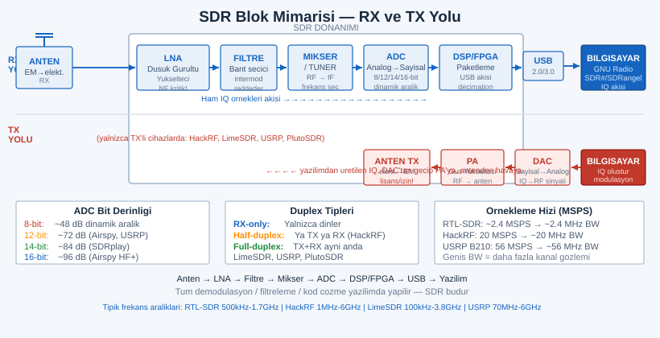
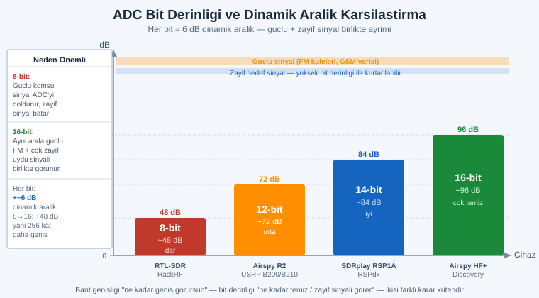
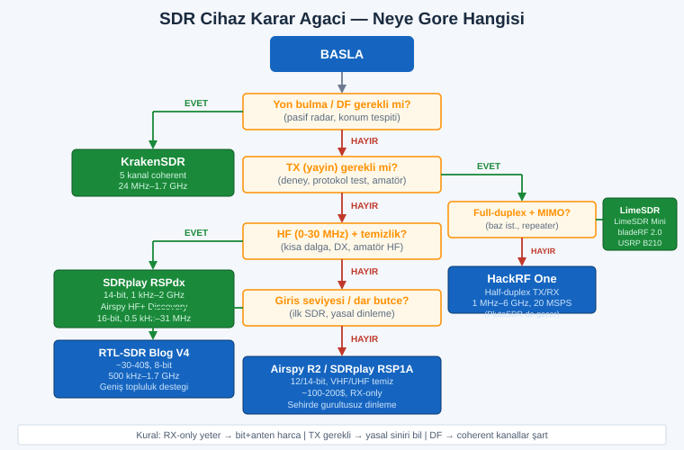

# SIGINT EL KİTABI — BÖLÜM 2: SDR CİHAZLARI DERİNLEMESİNE
## Nedir, Hangisi, Neye Göre — RTL-SDR'dan KrakenSDR'a, Flipper Zero'ya Kadar

> **Amaç:** "Bir SDR almak istiyorum ama hangisi?" sorusunu kökünden çözmek. Bu bölüm, SDR'ın *ne olduğunu*, bir cihazı belirleyen **parametreleri** (frekans, bant genişliği, ADC bit derinliği, TX, faz tutarlılığı), ve piyasadaki başlıca cihazları **tek tek, dürüstçe** anlatır — güçlü/zayıf yönleri, gerçek fiyat aralıkları, ve **hangi operasyon tipine** uyduklarıyla. Sonunda "senaryona göre hangisini al" karar rehberi ve alıştırmalar var. Zero-to-hero: hiç radyo bilmeyen de, ileri seviye de buradan beslenir.

> **ÖNCE BUNU OKU — YASAL SINIR (atlamadan):** SDR cihazlarının **çoğu salt-alıcıdır (RX-only)** — yani yalnızca *dinlerler*, yayın yapmazlar. **Dinleme/alma**, dünyanın birçok yerinde (kişisel kullanım, açık yayınlar için) **serbesttir** ama ülkeden ülkeye değişir; bazı yargı bölgelerinde belirli bantları (telsiz telefon, polis sayısallaştırılmış telsizi, şifreli askeri/kurumsal) dinlemek/çözmek **yasaktır.** Buna karşılık **TX yeteneği olan cihazlarla (HackRF, LimeSDR, USRP, bladeRF, PlutoSDR, Flipper Zero)** *yetkisiz YAYIN yapmak, sinyal taklit etmek (replay), jamming (karıştırma), GPS/GNSS spoofing* neredeyse **her yerde suçtur**, lisans ve/veya özel yetki gerektirir ve ciddi cezası vardır. **Kendi ülkenin telekomünikasyon/radyo regülatörünün (ör. TR'de BTK/ICTA) kurallarını teyit etmeden TX yapma.** Bu rehber **eğitim, savunma (defansif SIGINT), spektrum farkındalığı ve meşru araştırma** içindir.

---

## İÇİNDEKİLER

1. [SDR Nedir, Ne DEĞİLDİR?](#1)
2. [SDR Mimarisi — Sinyalin Yolculuğu (Blok Diyagram)](#2)
3. [Bir SDR'ı Belirleyen Parametreler](#3)
4. [ Cihaz Cihaz Derinlemesine](#4)
   - 4.1 [RTL-SDR Blog V3 vs V4](#4-1)
   - 4.2 [HackRF One](#4-2)
   - 4.3 [Airspy (R2 / Mini / HF+ Discovery)](#4-3)
   - 4.4 [SDRplay (RSP1A / RSPdx)](#4-4)
   - 4.5 [LimeSDR / LimeSDR Mini](#4-5)
   - 4.6 [Ettus USRP (B200 / B210)](#4-6)
   - 4.7 [ADALM-PLUTO (PlutoSDR)](#4-7)
   - 4.8 [bladeRF](#4-8)
   - 4.9 [KrakenSDR / KerberosSDR — Yön Bulma](#4-9)
   - 4.10 [Flipper Zero — SDR DEĞİL ama RF Çakı](#4-10)
5. [ Karşılaştırma Matrisi (Büyük Tablo)](#5)
6. [ "Neye Göre Hangisi" — Karar Rehberi](#6)
7. [Manuel / Özel Yapım — Coherent Dizi & Açık Donanım](#7)
8. [ Alıştırmalar](#8)
9. [Çapraz Referans & Sonraki Bölümler](#9)

---

<a id="1"></a>
## 1.  SDR Nedir, Ne DEĞİLDİR?

**SDR = Software Defined Radio (Yazılımla Tanımlı Radyo).**

Geleneksel bir radyoda — örneğin eski bir FM alıcısında ya da bir telsizde — sinyali işleyen işlevlerin neredeyse tamamı **fiziksel donanımdadır**: belirli bir frekansa ayarlı kristal, sabit bant filtresi, analog demodülatör (FM detektörü), sabit bir kanal aralığı. O cihaz **tek bir işi** yapar; "FM radyo" FM radyodur, onunla ADS-B uçak sinyali ya da hava durumu uydusu çözemezsin. İşlevi **lehimle sabitlenmiştir.**

SDR'da ise felsefe terstir: donanım **mümkün olduğunca "aptal" ve genel amaçlı** tutulur. Donanımın görevi yalnızca **geniş bir frekans bandını "olduğu gibi" sayısallaştırıp** (ham I/Q örnekleri) bilgisayara akıtmaktır. Demodülasyon, filtreleme, kod çözme, kanal seçimi — bütün "akıl" **yazılımda** (bilgisayarında, GNU Radio / SDR# / SDRangel gibi programlarda) yapılır.

> **Tek cümlelik tanım:** SDR, "radyo fonksiyonlarının donanımda sabit lehimlenmek yerine **yazılımda tanımlandığı**" radyodur. Aynı fiziksel kutu, bugün ADS-B alıcısı, yarın hava durumu uydusu çözücüsü, öbür gün geniş spektrum tarayıcısı olur — **tek değişen yazılımdır.**

### "Yazılımda tanımlı" ne demek — somut fark

| Soru | Geleneksel donanım radyo | SDR |
|---|---|---|
| Frekansı kim seçer? | Sabit kristal / kısıtlı tuner | Yazılım (geniş aralıkta serbest) |
| Demodülasyonu kim yapar? | Analog devre (FM detektörü vb.) | Yazılımdaki DSP (FM/AM/SSB/PSK… hepsi) |
| Yeni bir mod eklemek | Yeni donanım gerekir | Yeni **yazılım/eklenti** yeter |
| Aynı anda kaç kanal? | Genelde 1 | Bant genişliği elverdiğince **çok** |
| Yeni protokol çıktı | Cihaz eskidi | Topluluk yazılımı çıkarır, cihaz aynı |

### SDR NE DEĞİLDİR (yaygın yanlış anlamalar)

-  **"Her şeyi dinleyen sihirli kutu" değildir.** Cihazın frekans aralığı ve bant genişliği fiziksel sınırdır. Bir RTL-SDR 6 GHz'i göremez; bir Flipper Zero 2.4 GHz WiFi'yi sub-GHz radyosuyla çözemez.
-  **Şifreyi kıran araç değildir.** SDR sinyali *yakalar*. Sinyal şifreliyse (TETRA/P25 şifreli, askeri link), SDR sana yalnızca **şifreli bit akışını** verir; kriptoyu çözmek bambaşka bir iş (ve genelde yasadışı/imkânsızdır).
-  **Anten gerektirmeyen cihaz değildir.** Antensiz SDR neredeyse sağırdır. Çoğu zaman *cihazdan çok anten* sonucu belirler (bu, Bölüm 3'ün ve sonraki bölümlerin konusu).
-  **Otomatik olarak TX yapan cihaz değildir.** Çoğu ucuz SDR **yalnızca alıcıdır.** TX bambaşka, regüle ve riskli bir yetenektir.

---

<a id="2"></a>
## 2.  SDR Mimarisi — Sinyalin Yolculuğu

Bir SDR'ı "anlamak", sinyalin **antenden bilgisayara** nasıl aktığını anlamaktır. Cihazları karşılaştırırken (Bölüm 3-4) bu zincirin **her halkasının kalitesi** belirleyici olur.

```
                          ┌──────────────── SDR DONANIMI ────────────────┐
                          │                                              │
   ┌────────┐   ┌─────────┴──────────┐   ┌─────────┐   ┌──────┐   ┌──────┴───────┐   ┌────────────┐
   │ ANTEN  │──▶│  RF ÖN-UÇ          │──▶│ MİKSER  │──▶│ ADC  │──▶│ DSP / FPGA / │──▶│ BİLGİSAYAR │
   │ (RX)   │   │  • LNA (yükselteç) │   │ /TUNER  │   │(örn. │   │ USB denetim. │   │ (yazılım:  │
   │        │   │  • Bant filtresi   │   │ (frekans│   │ 8/12/│   │ (paketler →  │   │ GNU Radio, │
   │        │   │  • (bazılarında    │   │  kaydır.│   │ 14/16│   │  USB akışı)  │   │ SDR#,      │
   │        │   │   ön-seçici)       │   │  IF/BB) │   │ bit) │   │              │   │ SDRangel)  │
   └────────┘   └────────────────────┘   └─────────┘   └──────┘   └──────────────┘   └─────┬──────┘
        ▲                                                                                   │
        │                                                                                   ▼
        │   ◀──────────────── TX YOLU (yalnızca TX'li cihazlarda) ───────────────────  DAC + PA
        │        ANTEN(TX) ◀── PA (güç yük.) ◀── DAC (dijital→analog) ◀── yazılımdan üretilen I/Q
        └───────────────────────────────────────────────────────────────────────────────────
```



### Halka halka ne yapar

1. **Anten:** Havadaki elektromanyetik dalgayı elektrik sinyaline (ve TX'te tersi) çevirir. **Frekansa uygun anten = her şey.** Yanlış antenle en pahalı SDR bile sağırdır.
2. **RF ön-uç (front-end):**
   - **LNA (Low Noise Amplifier):** Zayıf sinyali, gürültüyü en az artırarak yükseltir. Kalitesi cihazın **gürültü figürünü** (NF) belirler.
   - **Filtre:** İstenmeyen güçlü sinyallerin (yakındaki FM vericisi, GSM kulesi) alıcıyı "boğmasını" (overload) engeller. Ucuz SDR'larda filtre zayıftır → **görüntü/hayalet sinyal** (image, intermod) sorunu.
3. **Mikser / Tuner:** İlgilendiğin yüksek frekansı, ADC'nin sindirebileceği **daha düşük bir ara frekansa (IF)** ya da **taban banda (baseband, I/Q)** kaydırır. "Frekansa ayarlamak" fiziksel olarak burada olur.
4. **ADC (Analog-to-Digital Converter):** Analog dalgayı **sayılara** çevirir. İki kritik özelliği:
   - **Örnekleme hızı (sample rate):** Saniyede kaç örnek → **anlık bant genişliğini** belirler (bkz. Bölüm 3).
   - **Bit derinliği:** Her örneğin kaç bitle temsil edildiği → **dinamik aralığı** belirler (8-bit ucuz/dar, 12/14/16-bit pahalı/geniş).
5. **DSP / FPGA / USB denetleyici:** Örnek akışını paketler, bazı cihazlarda **FPGA** üzerinde ön-işleme (filtre, decimation) yapar ve **USB** üzerinden bilgisayara gönderir.
6. **Bilgisayar + yazılım:** Asıl "radyo" burada. Demodülasyon, kod çözme, kaydetme, görselleştirme (waterfall/şelale).

### RX-only vs TX/RX, half-duplex vs full-duplex

- **RX-only (salt-alıcı):** Yalnızca dinler. RTL-SDR, Airspy, SDRplay. **En güvenli, en yasal, en ucuz.** Çoğu SIGINT/dinleme işi için yeterlidir.
- **TX/RX:** Hem dinler hem yayın yapar. İki alt tip:
  - **Half-duplex:** Aynı anda **ya** TX **ya** RX — ikisini birden yapamaz (telsiz gibi: konuşurken duyamazsın). **HackRF One** böyledir.
  - **Full-duplex:** TX ve RX **aynı anda** çalışır (telefon gibi). **LimeSDR, bladeRF, USRP B210, PlutoSDR** böyledir. Repeater, gerçek-zamanlı protokol, MIMO için şart.

> **Pratik çıkarım:** "Sadece dinleyeceğim" diyorsan TX/duplex tartışması seni ilgilendirmez — RX-only al, paranı **ADC bitine ve antene** harca. "Sinyal üreteceğim / repeater / 2 yönlü protokol" diyorsan full-duplex şart.

---

<a id="3"></a>
## 3.  Bir SDR'ı Belirleyen Parametreler

Bir cihazı "iyi/kötü" yapan tek bir sayı yoktur; **kullanımına göre** önem sırası değişen birkaç parametre vardır. Cihaz seçerken (Bölüm 6) bunları tartman gerekir.

### 3.1 Frekans Aralığı (Tuning Range)
Cihazın *ayarlanabildiği* en düşük–en yüksek frekans. RTL-SDR ~500 kHz–1.7 GHz görür; HackRF 1 MHz–6 GHz; KrakenSDR ~24 MHz–1.7 GHz.
- **Neden önemli:** İlgilendiğin sinyal aralık dışındaysa cihaz **işe yaramaz.** ADS-B 1090 MHz, hava durumu uydusu (NOAA APT) ~137 MHz, GSM 900/1800 MHz, ISM 433/868/915 MHz, WiFi 2.4/5 GHz, GPS L1 1575 MHz.
- **HF özel durumu:** 0–30 MHz (kısa dalga, amatör HF) çoğu ucuz tuner'ın doğal aralığının *altındadır*. Bunu görmek için ya **direct sampling** (RTL-SDR V4'ün geliştirdiği), ya **upconverter**, ya doğal HF kapsayan cihaz (SDRplay, Airspy HF+) gerekir.

### 3.2 Anlık Bant Genişliği (Instantaneous Bandwidth) = Örnekleme Hızı
Cihazın **tek seferde, aynı anda** görebildiği spektrum genişliği. Örnekleme hızıyla (sample rate, MSPS = milyon örnek/sn) doğrudan ilişkilidir (kabaca: kullanılabilir BW ≈ örnekleme hızı).
- RTL-SDR: teoride 3.2 MSPS, **kararlı ~2.4 MSPS** (≈2.4 MHz pencere).
- HackRF: 20 MSPS (≈20 MHz).
- USRP B210: 56 MHz'e kadar.
- **Neden önemli:** Geniş BW = aynı anda daha çok kanal/daha geniş spektrumu izleme. Trunking (frekans atlamalı) sistemleri, geniş tarama, çok kanallı analiz için kritik. **Dar BW** tek kanalı temiz dinlemeye yeter ama "geniş bakış" veremez.

> **İncelik:** "Görmek" ile "kaydetmek" farklıdır. 56 MHz BW'yi gerçek zamanlı **kaydetmek** terabaytları ve hızlı disk/USB3 ister. Çoğu işte 2-20 MHz fazlasıyla yeter.

### 3.3 ADC Bit Derinliği (Dinamik Aralık)
Her örneğin kaç bitle sayısallaştırıldığı. **Dinamik aralığı** — yani *aynı anda* çok zayıf ve çok güçlü sinyalleri birlikte ayırt edebilme yeteneğini — belirler. Kabaca her bit ~6 dB dinamik aralık ekler.



| Bit | Yaklaşık dinamik aralık | Tipik cihaz | Anlamı |
|---|---|---|---|
| **8-bit** | ~48 dB | RTL-SDR, HackRF | Ucuz, geniş bant; ama yanında güçlü sinyal varsa zayıfı "boğar" |
| **12-bit** | ~72 dB | Airspy, USRP B2xx, bladeRF, Pluto | Belirgin temizlik, daha az hayalet |
| **14-bit** | ~84 dB | SDRplay RSP serisi | Geniş + temiz; HF/VHF zorlu ortamda iyi |
| **16-bit** | ~96 dB | Airspy HF+ Discovery (HF), üst-segment | Çok temiz, dar bant; HF/zayıf sinyal avı |

- **Neden önemli:** Şehirde, güçlü FM/GSM/yayın vericilerinin *yanında* zayıf bir sinyali avlıyorsan, **bit derinliği antenden bile önemli** olabilir. 8-bit'te güçlü komşu sinyal, ADC'yi doldurup zayıf sinyali ezer (overload, hayalet sinyaller).

> **Altın kural:** **Bant genişliği "ne kadar geniş görürsün"; bit derinliği "ne kadar temiz görürsün."** Ucuz cihazlar genişliği ucuza verir, temizliği değil.

### 3.4 TX Yeteneği ve Gücü
Cihaz yayın yapabiliyor mu, yapabiliyorsa **kaç dBm / mW** güçle?
- Çoğu TX'li hobi SDR'ı **çok düşük güçlüdür** (HackRF ~ -10 dBm civarı, frekansa göre değişir; mW altı–birkaç mW). Yani "telsiz gibi kilometrelerce" değil; **lab/kısa mesafe deney** seviyesidir. Ciddi menzil için harici **PA (güç yükselteci)** gerekir — ki bu hem teknik hem **yasal** olarak çok daha riskli bir alandır.
- **Neden önemli (ve tehlikeli):** TX, replay/spoofing/jamming gibi **yasadışı** kullanımların kapısıdır. Meşru tarafta: anten kalibrasyonu, kendi alıcını test etme, amatör radyo (lisansla), araştırma. **Yetkisiz TX = suç** (bkz. baştaki yasal not).

### 3.5 Faz Tutarlılığı (Coherent / Phase Coherence)
Birden çok alıcı kanalın **aynı saat/osilatöre** kilitli, faz ilişkisi korunarak çalışması.
- **Neden önemli:** **Yön bulma (direction finding, DF)**, **beamforming**, **pasif radar** ve **MIMO** *yalnızca* faz tutarlı çok kanalla mümkündür. Tek kanal SDR "sinyal var mı, ne diyor?" sorusuna cevap verir; **coherent dizi** "**nereden geliyor?**" sorusuna cevap verir.
- **KrakenSDR** (5 coherent kanal) ve **USRP** (MIMO) bu yeteneği sunar. Tek RTL-SDR sunmaz (ama birden çok RTL-SDR'ı dış saatle senkronlayıp coherent dizi *kurmak* mümkündür — Bölüm 7).

### 3.6 Arayüz (USB 2.0 vs USB 3.0)
Veriyi bilgisayara taşıyan kanal.
- **USB 2.0** (~480 Mbps pratik ~280-320 Mbps): RTL-SDR, HackRF, Airspy Mini için yeter. **Yüksek örnekleme hızını sınırlar.**
- **USB 3.0** (~5 Gbps): LimeSDR, USRP B210, bladeRF 2.0 — geniş BW'yi (40-56 MHz) gerçek zamanlı taşımak için **şart.** USB2 portuna takarsan bu cihazlar BW'lerini kısmak zorunda kalır.

### 3.7 Gürültü Figürü (Noise Figure, NF)
Alıcının sinyale *kendi* eklediği gürültü; düşük NF = zayıf sinyalleri daha iyi duyma.
- **Neden önemli:** Zayıf/uzak sinyal avında (uydu, uzak HF, zayıf telemetri) düşük NF ve iyi LNA fark yaratır. Çoğu zaman **harici, antene yakın bir LNA** takmak (özellikle kayıplı kablo varsa) NF'yi cihaz seçiminden daha çok iyileştirir.

> **Özet — parametre öncelik sırası kullanıma göre değişir:**
> - **Geniş tarama / trunking:** Bant genişliği + frekans aralığı önce.
> - **Şehirde zayıf sinyal:** ADC bit + NF/LNA önce.
> - **HF / kısa dalga:** Frekansın HF'i kapsaması (direct sampling/native HF) + bit derinliği.
> - **Yön bulma:** Faz tutarlılığı (coherent) **olmazsa olmaz.**
> - **TX/deney:** TX gücü + duplex tipi.

---

<a id="4"></a>
## 4.  Cihaz Cihaz Derinlemesine

> **Spec uyarısı:** Aşağıdaki frekans/bit/MSPS/fiyat değerleri **yaklaşıktır** ve donanım revizyonu, firmware, ülke ve döviz kuruna göre değişir. **Kritik bir karar vermeden önce ilgili spec'i üreticinin güncel datasheet'inden / ürün sayfasından teyit et.** Fiyatlar 2020'lerin ortası için kaba ABD$ aralıklarıdır; vergi/kargo hariç.

<a id="4-1"></a>
### 4.1  RTL-SDR Blog V3 vs V4 — "Herkesin İlk SDR'ı"

Aslen DVB-T (sayısal TV) USB çubuğu olan RTL2832U yongasının, alma frekansının yazılımla zorlanabildiğinin keşfiyle doğan efsane. **rtl-sdr.com (RTL-SDR Blog)** sürümleri, jenerik çubuklara göre TCXO (kararlı osilatör), daha iyi koruma, SMA anten ve yazılım uyumu sunar — **referans budur.**

| Özellik | RTL-SDR Blog **V3** | RTL-SDR Blog **V4** |
|---|---|---|
| Tuner | Rafael Micro **R820T2** | Rafael Micro **R828D** |
| Frekans aralığı | ~500 kHz (direct samp.) – ~1.7 GHz | ~500 kHz (geliştirilmiş HF) – ~1.7 GHz |
| HF (0-30 MHz) yöntemi | Direct sampling (Q-branch, biraz zahmetli) | **Geliştirilmiş direct sampling** + daha iyi ön-uç → **daha temiz HF** |
| ADC | 8-bit | 8-bit |
| Kullanılabilir BW | ~2.4 MSPS kararlı (3.2 teorik) | ~2.4 MSPS kararlı |
| TX |  Yok (RX-only) |  Yok (RX-only) |
| Öne çıkan | TCXO, bias-tee, direct samp., olgun | **Daha iyi görüntü/hayalet reddi**, geliştirilmiş HF, daha az intermod |
| Fiyat | ~25-35 $ | ~30-40 $ |

**V4'ün V3'ten net farkları:**
- **R828D tuner + üçlü ön-seçici filtre** → şehirde **görüntü (image) ve intermod hayalet sinyalleri çok daha az.** V3'te güçlü FM/yayın bandı zayıf sinyallerin üstüne "hayalet" düşürürdü; V4 bunu belirgin azaltır.
- **HF (kısa dalga) çok daha kullanışlı** — V3'te HF için ayrı direct-sampling moduna geçip uğraşırdın; V4 bunu daha temiz ve doğrudan verir.
- **Önemli uyarı:** V4, çalışmak için **güncel/yamalı RTL-SDR Blog sürücülerini** ister. Eski SDR# / driver ile V4 düzgün çalışmaz ("çalışmıyor" sanılır) → **doğru driver'ı kur.**

- **TX var/yok + güç:** **Yok.** Tamamen RX-only. (Bu, çoğu meşru dinleme işi için *avantajdır* — yasal sürtünme yok.)
- **Güçlü yönleri:** Çok ucuz, devasa topluluk/yazılım desteği, başlamak için ideal, düşük güç tüketimi, taşınabilir.
- **Zayıf yönleri:** 8-bit (dar dinamik aralık), ~2.4 MHz dar BW, üst sınır ~1.7 GHz (WiFi 2.4 GHz, 5 GHz, 6 GHz **yok**), zayıf ön-uç (V4 iyileştirir ama 14-bit cihaz değil).
- **Ne tip operasyonlar / kullanımlar:**
  - **ADS-B (1090 MHz):** Uçak takibi — klasik "ilk proje". (`dump1090`)
  - **Hava durumu uydusu (NOAA APT ~137 MHz, Meteor-M LRPT):** Gökyüzünden canlı uydu görüntüsü indirme.
  - **`rtl_433`:** Kablosuz sensörler (433/868/915 MHz hava istasyonu, lastik basıncı/TPMS, kapı zili, ev otomasyonu) çözme.
  - **Geniş tarama / spektrum gözlemi, amatör radyo dinleme, AIS (gemi takibi 162 MHz), POCSAG/FLEX çağrı cihazı, ACARS (uçak metin).**
  - **Trunking dinleme:** Tek RTL-SDR ile (kontrol kanalı + ses) ya da iki RTL-SDR ile dijital trunk (P25 vb. — *şifresiz* sistemlerde, yasalsa) — Trunk Recorder / SDRTrunk.
- **Somut örnek 1:** Evden, V4 + uygun anten + `dump1090` ile çevredeki uçakların canlı haritasını çıkarmak.
- **Somut örnek 2:** `rtl_433` ile mahalledeki kablosuz hava istasyonlarının/araç TPMS sensörlerinin yayınlarını pasifçe loglamak (spektrum farkındalığı / IoT güvenlik dersi).

> **Püf:** İki ucuz RTL-SDR (her biri ~30$), bir dijital trunk sistemini (kontrol + ses kanalı) aynı anda izlemen için, tek pahalı geniş-BW cihazdan **daha pratik** olabilir. Ucuzluk = "çoğalt" stratejisi.

<a id="4-2"></a>
### 4.2  HackRF One — "TX'e İlk Adım, Deney Tahtası"

Great Scott Gadgets (Michael Ossmann) tarafından, **açık donanım** olarak tasarlanmış efsane. RX-only dünyasından çıkıp **yayın/deney** dünyasına açılan en yaygın giriş cihazı.

- **Frekans aralığı:** **1 MHz – 6 GHz** (çok geniş — sub-GHz'den WiFi/5.8 GHz'e kadar tek cihazda).
- **Anlık bant genişliği:** **20 MSPS** (≈20 MHz — RTL-SDR'ın ~8 katı).
- **ADC bit:** **8-bit** (HackRF'in en büyük *zayıflığı*; geniş ama dar dinamik aralık).
- **TX var/yok + güç:**  **TX VAR**, **half-duplex** (aynı anda ya TX ya RX). Güç **düşüktür** ve frekansa göre değişir (kabaca -10 dBm ile birkaç mW arası; üst frekanslarda düşer) → **lab/kısa mesafe deney** seviyesi; ciddi menzil için harici PA gerekir.
- **Arayüz:** USB 2.0.
- **Fiyat:** ~150-350 $ (orijinal vs klon; **klonların kalibrasyonu/kalitesi değişir**, orijinali tercih sebebi).
- **Güçlü yönleri:** Devasa frekans aralığı, **TX yeteneği**, açık donanım/firmware, büyük topluluk, GNU Radio/Portapack ile mükemmel uyum, **Portapack** eklentisiyle taşınabilir bağımsız cihaza dönüşür.
- **Zayıf yönleri:** **8-bit** (Airspy/SDRplay'in temizliği yok), **half-duplex** (full-duplex protokoller, repeater yapamaz), düşük TX gücü, USB2.
- **Ne tip operasyonlar / kullanımlar:**
  - **RF protokol araştırması / tersine mühendislik:** Bir kumandanın/sensörün sinyalini yakala, analiz et, (yasal/kendi cihazında) yeniden üret.
  - **Replay deneyleri (KENDİ cihazında, yasal sınırda):** Kendi garaj kumandanı/oyuncağını yakalayıp tekrar oynatma — güvenlik eğitimi. (Başkasının sistemine = suç.)
  - **Geniş spektrum keşfi:** 6 GHz'e kadar "burada ne var?" taraması (`hackrf_sweep`).
  - **GPS/GNSS sinyal *simülasyonu* (yalnızca kapalı/ekranlı lab, kabloyla):** Alıcı testi — **havadan TX yasadışıdır.**
  - **Eğitim/CTF:** RF tabanlı bayrak yakalama, kablosuz güvenlik dersleri.
- **Somut örnek 1:** `hackrf_sweep` ile 1 MHz–6 GHz spektrumun "ısı haritasını" çıkarıp ortamdaki tüm aktif bantları görmek.
- **Somut örnek 2:** Portapack + HackRF ile bilgisayarsız, taşınabilir bir spektrum analizörü/sinyal kaydedici kurmak (saha keşfi).

> **Sınır:** HackRF "her şeyi yapan" diye anılır ama **8-bit + half-duplex + düşük güç** üçlüsü onu *temiz alıcı* ya da *ciddi verici* yapmaz; o bir **çok yönlü deney/öğrenme platformudur.** Temiz dinleme istiyorsan Airspy/SDRplay, full-duplex istiyorsan LimeSDR/bladeRF/USRP daha doğru.

<a id="4-3"></a>
### 4.3  Airspy (R2 / Mini / HF+ Discovery) — "Dar Ama Tertemiz"

Airspy ailesi, **RX-only** ama **12-bit (ve HF+'da efektif 16-bit sınıfı)** ADC ile **temizlik/dinamik aralık** odaklı bir markadır. "Az ama öz": geniş BW yerine **kaliteli, düşük gürültülü** alım.

| Model | Frekans | BW (örnekleme) | ADC | Öne çıkan |
|---|---|---|---|---|
| **Airspy R2** | ~24 MHz – 1.8 GHz | 10 MSPS (ve 2.5) | 12-bit | VHF/UHF için temiz, iyi dinamik aralık |
| **Airspy Mini** | ~24 MHz – 1.8 GHz | 6 MSPS (ve 3) | 12-bit | R2'nin daha küçük/ucuz, USB-stick formu |
| **Airspy HF+ Discovery** | **0.5 kHz–31 MHz (HF) + 60-260 MHz (VHF)** | dar (~768 kHz) | 16-bit sınıfı, çok yüksek dinamik aralık | **HF/MW/kısa dalga avcısı**, olağanüstü temiz |

- **TX var/yok:**  Yok (hepsi RX-only).
- **Fiyat:** R2 ~170-200 $, Mini ~100-120 $, HF+ Discovery ~170-200 $ (yaklaşık).
- **Güçlü yönleri:** **Çok temiz** (12/16-bit), mükemmel dinamik aralık (özellikle HF+ Discovery HF'te efsane), düşük gürültü, kaliteli SDR# uyumu (aynı geliştirici).
- **Zayıf yönleri:** **Dar BW** (HackRF/USRP gibi 20+ MHz yok), TX yok, R2/Mini HF'i doğal kapsamaz (HF için HF+ Discovery gerekir), üst sınır ~1.8 GHz.
- **Ne tip operasyonlar:**
  - **HF+ Discovery:** Kısa dalga yayını, amatör HF/SSB, orta dalga (MW), zayıf/uzak HF sinyali avı — **gürültülü şehirde bile temiz** HF dinleme.
  - **R2/Mini:** VHF/UHF'te temiz amatör radyo, hava bandı (airband AM), zayıf sinyal, ADS-B (temiz), narrowband dijital ses.
- **Somut örnek 1:** HF+ Discovery + iyi HF anteniyle, gece okyanus aşırı (DX) kısa dalga istasyonlarını ucuz çubuğun göremeyeceği temizlikte almak.
- **Somut örnek 2:** R2 ile gürültülü bir ortamda, FM bandının hemen yanındaki zayıf bir VHF sinyalini hayalet/overload olmadan dinlemek.

> **Konum:** Airspy = "**dinleme kalitesi**" seçimi. Geniş bant ya da TX istiyorsan yanlış adres; **en temiz sesi/sinyali** istiyorsan (özellikle HF'te) en güçlü adaylardan.

<a id="4-4"></a>
### 4.4  SDRplay (RSP1A / RSPdx) — "Geniş + 14-bit Hepsi-Bir-Arada"

SDRplay (Mirics yongası tabanlı), **14-bit** ADC ile **geniş frekans (HF dahil) + temizlik** dengesini RX-only'de sunar. SDRuno (kendi yazılımı) ve SDR++/SDRangel ile çalışır.

| Model | Frekans | BW | ADC | Öne çıkan |
|---|---|---|---|---|
| **RSP1A** | ~1 kHz – 2 GHz | ~10 MHz'e kadar | 14-bit | **Tek cihazda HF+VHF+UHF**, çok yönlü, uygun fiyat |
| **RSPdx** | ~1 kHz – 2 GHz | ~10 MHz | 14-bit | Gelişmiş ön-uç/filtreler, HF için **HDR modu**, daha iyi seçicilik |

- **TX var/yok:**  Yok (RX-only).
- **Fiyat:** RSP1A ~110-130 $, RSPdx ~200-230 $ (yaklaşık).
- **Güçlü yönleri:** **14-bit** (8-bit cihazlara göre çok daha geniş dinamik aralık), **HF'i doğal kapsar** (upconverter gerekmez), tek cihazda 1 kHz–2 GHz, iyi filtre/ön-uç (özellikle RSPdx), uygun fiyat/yetenek oranı.
- **Zayıf yönleri:** TX yok, üst sınır ~2 GHz (WiFi 2.4 GHz'in alt kenarı; 5/6 GHz yok), yongası kapalı (Mirics), bazı işlevler kendi yazılımına bağlı.
- **Ne tip operasyonlar:**
  - **"Tek cihazla her bandı dinleyeceğim" senaryosu:** HF kısa dalgadan VHF/UHF amatör, hava bandı, çağrı cihazı, AIS, geniş genel dinleme — hepsi tek kutuda, temiz.
  - **HF DX + VHF/UHF izleme** aynı oturumda, 14-bit temizlikle.
  - **Spektrum gözlem/eğitim:** 10 MHz'lik geniş pencere + iyi dinamik aralık ile öğretici.
- **Somut örnek 1:** RSP1A ile sabah HF amatör bandını, öğleden sonra 137 MHz NOAA uydusunu, akşam UHF amatör tekrarlayıcıyı **tek cihazla** takip etmek.
- **Somut örnek 2:** RSPdx'in HDR modunda, güçlü MW yayın istasyonlarının yanındaki zayıf HF sinyalini overload olmadan ayıklamak.

> **RTL-SDR V4 vs SDRplay RSP1A:** İkisi de "her bandı dinle" der ama RSP1A **14-bit + daha geniş BW + doğal HF** ile belirgin üstündür — bedeli ~3-4 kat fiyat. "Hobi başlangıç" → V4; "ciddi tek-cihaz RX istasyonu" → RSP1A/RSPdx.

<a id="4-5"></a>
### 4.5  LimeSDR / LimeSDR Mini — "Full-Duplex, MIMO, Açık"

Lime Microsystems'in LMS7002M yongası tabanlı, **full-duplex TX/RX** ve (büyük modelde) **2×2 MIMO** sunan açık platform. Yazılım tanımlı baz istasyonu, repeater, protokol geliştirme için.

| Model | Frekans | BW | TX/RX | MIMO |
|---|---|---|---|---|
| **LimeSDR (USB)** | ~100 kHz – 3.8 GHz | ~61.44 MHz'e kadar | Full-duplex | **2×2 MIMO** |
| **LimeSDR Mini** | ~10 MHz – 3.5 GHz | ~30.72 MHz | Full-duplex | 1×1 |

- **ADC bit:** 12-bit.
- **TX gücü:** Düşük-orta (frekansa göre; deney/lab seviyesi, harici PA ile artırılır).
- **Arayüz:** LimeSDR USB 3.0; Mini USB 3.0.
- **Fiyat:** Mini ~150-200 $, tam LimeSDR ~250-350+ $ (tedarik/üretim partisine göre çok değişti; **güncel teyit et**).
- **Güçlü yönleri:** **Full-duplex** (aynı anda TX+RX → repeater, gerçek-zamanlı 2-yön protokol), **MIMO** (tam modelde), geniş frekans, açık (LimeSuite, GNU Radio, SoapySDR), GSM/LTE/IoT baz istasyonu deneyleri (srsRAN/Osmocom ile).
- **Zayıf yönleri:** USRP kadar olgun/kararlı değil (tedarik ve sürücü dönemsel sorunlar yaşadı), 12-bit, kalibrasyon/ısı yönetimi dikkat ister, başlangıç için fazla karmaşık.
- **Ne tip operasyonlar:**
  - **Özel/deneysel baz istasyonu:** Kendi (kapalı, ekranlı, yasal) GSM/LTE/IoT test ağı — protokol/güvenlik araştırması.
  - **Full-duplex protokol geliştirme, repeater, gerçek-zamanlı sinyal işleme.**
  - **MIMO deneyleri** (tam model).
- **Somut örnek 1:** LimeSDR + srsRAN ile **kapalı ortamda** kendi 4G test hücreni kurup el cihazı protokol davranışını incelemek (araştırma; havadan TX **yasal yetki ister**).
- **Somut örnek 2:** Full-duplex sayesinde bir frekansta dinlerken başka frekansta eşzamanlı yayınla bir tekrarlayıcı (repeater) prototipi (lisanslı/yasal bantta).

<a id="4-6"></a>
### 4.6  Ettus USRP (B200 / B210) — "Profesyonel / Araştırma Standardı"

Ettus Research (NI/National Instruments) USRP serisi, akademi/savunma/araştırmada **fiili standart.** Sağlamlık, sürücü olgunluğu (UHD), GNU Radio entegrasyonu ve performansla pahalı ama güvenilir.

| Model | Frekans | BW | TX/RX | Kanal |
|---|---|---|---|---|
| **USRP B200** | ~70 MHz – 6 GHz | ~56 MHz'e kadar | Full-duplex | 1×1 |
| **USRP B210** | ~70 MHz – 6 GHz | ~56 MHz (30.72 MIMO'da) | Full-duplex | **2×2 MIMO (coherent)** |

- **ADC bit:** 12-bit.
- **Arayüz:** USB 3.0.
- **Fiyat:** ~1.000-1.500+ $ (B200/B210). **Hobi değil, kurumsal/araştırma bütçesi.**
- **Güçlü yönleri:** **Olgun UHD sürücüsü** (kararlılık), geniş frekans, **full-duplex + B210'da faz-tutarlı 2 kanal (MIMO/coherent)**, GNU Radio/MATLAB/Simulink ekosistemi, araştırma yayınlarında *referans donanım*, yüksek güvenilirlik.
- **Zayıf yönleri:** **Pahalı**, 12-bit (bit derinliğinde Airspy/SDRplay'i geçmez — gücü olgunluk ve esneklikte), hobi için aşırı.
- **Ne tip operasyonlar:**
  - **Akademik/savunma araştırması:** Yeni dalga biçimi, protokol prototipi, MIMO/beamforming, kanal ölçümü.
  - **Coherent 2 kanal** ile yön bulma/beamforming temel deneyleri (B210).
  - **Hücresel (4G/5G) araştırma** (srsRAN/Open5GS ile, yasal/kapalı ortam).
- **Somut örnek 1:** B210'un iki coherent kanalıyla bir **2-elemanlı dizi** kurup geliş açısı (AoA) tahmini araştırması yapmak.
- **Somut örnek 2:** Üniversite laboratuvarında GNU Radio + B200 ile yeni bir modülasyon şemasını uçtan uca (TX→kanal→RX) doğrulamak.

> **USRP felsefesi:** "En çok bit" ya da "en ucuz" değil; **"deneyim tekrarlanabilir, sürücü güvenilir, yayın-kalitesinde sonuç"** istiyorsan USRP. Bedeli fiyat.

<a id="4-7"></a>
### 4.7  ADALM-PLUTO (PlutoSDR) — "Analog Devices'ın Hacklenebilir Eğitim Kutusu"

Analog Devices'in **eğitim/öğrenci** amaçlı, AD9363 transceiver tabanlı, ucuz full-duplex SDR'ı. MATLAB/Simulink ve GNU Radio ile sıkı entegre; ünlü bir **"frekans aralığını yazılımla genişletme" hilesiyle** popüler.

- **Frekans aralığı:** Resmî **325 MHz – 3.8 GHz**; ama **yongası aslında ~70 MHz – 6 GHz yetenekli** ve topluluk, bir yazılım ayarıyla bu aralığı **"açar"** (resmî desteklenmez/kalibre değildir ama çalışır — eğitim/deney için meşhur hile).
- **Anlık bant genişliği:** ~20 MHz (yongaya göre 56 MHz'e kadar zorlanabilir; resmî ~20).
- **ADC bit:** 12-bit.
- **TX var/yok:**  **TX VAR**, **full-duplex** (AD9363 transceiver).
- **TX gücü:** Düşük (deney seviyesi).
- **Arayüz:** USB 2.0.
- **Fiyat:** ~150-230 $ (eğitim indirimi/sürüme göre).
- **Güçlü yönleri:** **Full-duplex + TX, ucuz**, MATLAB/Simulink/GNU Radio entegrasyonu mükemmel (DSP/iletişim dersleri için ideal), **frekans aralığı hilesiyle** çok yönlü, küçük/taşınabilir.
- **Zayıf yönleri:** USB2 (BW pratikte sınırlı), tek kanal, kalibrasyon eğitim sınıfı (lab-grade değil), "açılmış" frekanslar resmî desteklenmez.
- **Ne tip operasyonlar:**
  - **İletişim sistemleri eğitimi:** Modülasyon/demodülasyon, QAM/OFDM deneyleri, uçtan uca link (TX↔RX) öğrenme.
  - **Full-duplex protokol/algoritma prototipleme** (ucuz USRP alternatifi, eğitim için).
  - **Genişletilmiş aralıkla** ADS-B, çeşitli ISM bandı deneyleri.
- **Somut örnek 1:** MATLAB ile Pluto'da kendi QPSK vericini ve alıcını yazıp aynı cihazda (full-duplex) loopback testi yapmak.
- **Somut örnek 2:** Frekans hilesini açıp 1090 MHz ADS-B'yi almak ya da 70 MHz–6 GHz aralığında deney yapmak (eğitim/lab).

<a id="4-8"></a>
### 4.8  bladeRF (2.0 micro) — "Full-Duplex, FPGA, Sağlam"

Nuand'ın bladeRF serisi, **full-duplex**, güçlü **FPGA** (kullanıcı tarafından programlanabilir) ve iyi sürücü desteğiyle USRP ile HackRF arası bir konumda. 2.0 micro modelleri yaygın.

- **Frekans aralığı:** bladeRF 2.0 micro **~47 MHz – 6 GHz** (orijinal bladeRF ~300 MHz–3.8 GHz, XB-200 ile HF'e iner).
- **Anlık bant genişliği:** ~56 MHz'e kadar.
- **ADC bit:** 12-bit.
- **TX var/yok:**  **TX VAR**, **full-duplex**, 2.0 micro'da **2×2 MIMO** (xA9 modeli).
- **Arayüz:** USB 3.0.
- **Fiyat:** ~480-720 $ (model/FPGA boyutuna göre; xA4 daha ucuz, xA9 pahalı).
- **Güçlü yönleri:** **Full-duplex + MIMO**, **programlanabilir FPGA** (cihaz üstünde DSP — düşük gecikme, gerçek-zamanlı işleme), geniş frekans, sağlam yapı, GNU Radio/SoapySDR uyumu, USRP'den ucuz.
- **Zayıf yönleri:** HackRF'ten pahalı, 12-bit, FPGA programlama öğrenme eğrisi, hobi için fazla.
- **Ne tip operasyonlar:**
  - **FPGA-hızlandırmalı gerçek-zamanlı sinyal işleme** (düşük gecikme gereken protokoller).
  - **Full-duplex + MIMO** araştırma/repeater/baz istasyonu deneyleri.
  - **GSM/LTE deneyleri** (Osmocom/srsRAN, yasal/kapalı).
- **Somut örnek 1:** bladeRF'in FPGA'sına özel bir filtre/decimation yükleyip, bilgisayara düşmeden cihaz üstünde ön-işlemeyle düşük gecikmeli bir alıcı kurmak.
- **Somut örnek 2:** Full-duplex + MIMO ile 2 kanallı bir araştırma deneyi (USRP'ye uygun fiyatlı alternatif).

<a id="4-9"></a>
### 4.9  KrakenSDR / KerberosSDR — "5 Kanal Coherent: YÖN BULMA"

Bu kategori diğerlerinden **farklı** bir soruyu yanıtlar: "Sinyal **nereden geliyor?**" **KerberosSDR** (4 kanal, öncül) ve onun olgunlaşmış halefi **KrakenSDR** (5 kanal), faz-tutarlı (coherent) çoklu RTL-SDR alıcılarını tek kutuda birleştirir → **yön bulma (direction finding, DF)** ve **pasif radar** mümkün olur.

- **Mimari:** **5 adet faz-tutarlı (coherent) RTL-SDR tabanlı kanal**, ortak saat (clock) ve dahili kalibrasyon/gürültü kaynağıyla senkronize.
- **Frekans aralığı:** ~24 MHz – ~1.7 GHz (RTL-SDR tabanlı olduğundan).
- **ADC bit:** 8-bit (kanal başına RTL-SDR sınıfı) — **ama** gücü bit derinliğinde değil, **faz tutarlılığında.**
- **TX var/yok:**  Yok (saf alıcı/DF cihazı).
- **Arayüz:** USB.
- **Fiyat:** KrakenSDR ~500-600 $ (yaklaşık; 5 kanal + kalibrasyon donanımı).
- **Güçlü yönleri:** **Faz-tutarlı 5 kanal** → gerçek **yön bulma / geliş açısı (AoA)**, **pasif radar**, beamforming; hazır yazılım (Kraken DoA / DF stack), araç üstü mobil DF (hareket ederken konumu üçgenleme), açık ekosistem.
- **Zayıf yönleri:** 8-bit, ~1.7 GHz üst sınır, **çok elemanlı anten dizisi gerektirir** (anten yerleşimi/geometrisi sonucu belirler — kurulum bilgisi şart), tek-kanal genel dinleme için fazla/özelleşmiş.
- **Ne tip operasyonlar:**
  - **Yön bulma (DF):** Bir vericinin **yönünü** bulma; araç üstü mobil DF ile, hareket ederek **konumunu üçgenleme** (transmitter hunting / "fox hunting", girişim/parazit kaynağı avı, yetkisiz verici tespiti).
  - **Pasif radar:** Mevcut yayınları (FM/DVB-T) "aydınlatıcı" kullanarak, yansımalardan hareketli hedef (uçak vb.) tespiti.
  - **Spektrum güvenliği/savunma:** "Bu kaçak/parazit sinyal **nereden** geliyor?" sorusunu sahada yanıtlama.
- **Somut örnek 1:** KrakenSDR + 5 elemanlı dairesel anten dizisini araca kurup, şehirde dolaşırken bir test vericisinin yönünü gerçek zamanlı haritada izleyip kesişimlerden konumunu bulmak (amatör DF / fox hunting).
- **Somut örnek 2:** Bir tesiste sürekli parazit yapan bilinmeyen bir kaynağın yönünü saptayıp fiziksel konumuna yürümek (spektrum hijyeni).

> **Kritik fark:** Tek SDR "**ne**" sorusunu (sinyal var mı, ne diyor) yanıtlar; KrakenSDR "**nerede**" sorusunu yanıtlar. Bu, SIGINT'te bambaşka bir yetenek katmanıdır (geolocation/DF). Detay: bkz. Bölüm 7 (coherent dizi mantığı) ve sonraki SIGINT bölümleri.

<a id="4-10"></a>
### 4.10  Flipper Zero — "SDR DEĞİL, Ama Cebe Sığan RF Çakısı"

**Önemli:** Flipper Zero bir **SDR DEĞİLDİR.** Buraya, sürekli SDR ile karıştırıldığı için ve gerçek sınırlarını netleştirmek için kondu. Flipper, geniş bantlı I/Q sayısallaştırma yapmaz; **sabit-fonksiyonlu, dar bantlı bir RF/donanım çok-aracıdır** (multi-tool). "Tamagotchi görünümlü hacker oyuncağı" popülaritesiyle ünlüdür.

**İçindeki radyolar ve sınırları:**
- **Sub-GHz (CC1101 yongası):** ~300–348 / 387–464 / 779–928 MHz **belirli ISM bantlarında** çalışır (sürekli geniş aralık değil, **bantlı**). **Dar bantlı**, **OOK/ASK/(G)FSK gibi basit modülasyonlar** için. **Bir RTL-SDR'ın gördüğü geniş spektrumu GÖREMEZ**; waterfall/şelale analizi yapamaz; karmaşık/dijital protokolleri çözemez.
- **NFC / RFID:** 13.56 MHz (NFC) ve 125 kHz (düşük frekans RFID kart/etiket) okuma/öykünme.
- **IR (kızılötesi):** TV/klima kumandası öğrenme/gönderme.
- **iButton (1-Wire), GPIO, BadUSB (USB HID öykünme), Bluetooth LE** (uygulama/arayüz için).
- **WiFi:** **Yok** (ana kartta) — ayrı **WiFi DevBoard** eklentisi gerekir.

**Ne YAPAR:**
- Basit sub-GHz cihazları (bazı eski garaj/bariyer kumandaları, sabit-kod uzaktan kumandalar, kapı zilleri, bazı ISM sensörleri) **yakala-tekrar oynat (capture-replay)** — *yalnızca zayıf/sabit kodlu, korumasız sistemlerde ve yasalsa.*
- NFC/RFID kart **okuma/öykünme** (kendi kartların; erişim kartı kopyalama yasal/etik sınıra tabidir).
- IR kumanda birleştirme, BadUSB betikleri, donanım hattı (GPIO) ile prototipleme.

**Ne YAPAMAZ (sınırları):**
-  **Geniş spektrum tarama / waterfall** (SDR değil; göremez).
-  **Rolling-code (atlamalı kod) sistemleri kırma** (modern araba anahtarları, KeeLoq vb. — yakala-oynat işe yaramaz; "araba çalan cihaz" söylentileri abartı/yanlıştır).
-  **WiFi/Bluetooth saldırı** (ana cihazda WiFi yok; BLE sınırlı).
-  **Şifre çözme, GHz-üstü, geniş bant, dijital ses (P25/DMR) çözme.**
-  **2.4/5 GHz, ADS-B (1090 MHz CC1101 aralığı dışı), uydu** — bunların hiçbiri.

**Genişletme modülleri:**
- **WiFi DevBoard (ESP32):** WiFi izleme/saldırı betikleri (Marauder vb.), Flipper'a kablosuz arayüz/firmware flaşlama.
- **Harici sub-GHz / CC1101 modülleri & anten:** Menzil/bant iyileştirme.
- **Çeşitli GPIO eklenti kartları** (NFC, IR güçlendirme, sensör).

- **Fiyat:** ~150-200 $ (resmî; bölgeye göre değişir, bazı ülkelerde ithalat/satış kısıtı var).
- **Güçlü yönleri:** **Taşınabilir/cep boyutu**, bilgisayarsız bağımsız çalışır, çok protokollü (sub-GHz+NFC+IR+RFID+BadUSB) tek cihazda, harika kullanıcı arayüzü/topluluk, **fiziksel güvenlik denetimi / pentest sahası** için pratik bir İsviçre çakısı.
- **Zayıf yönleri:** **SDR değil** (dar bant, geniş spektrum/waterfall yok), karmaşık/dijital/şifreli protokol çözemez, abartılı beklentiler (popüler kültür Flipper'ı olduğundan çok daha "her şeyi kıran" sanıyor).
- **Ne tip operasyonlar:**
  - **Fiziksel güvenlik / red-team saha aracı:** Erişim kartı/RFID değerlendirme (yetkili pentest), zayıf sub-GHz kumanda testi, IR/BadUSB demoları.
  - **Eğitim/farkındalık:** "Sabit-kod kumanda neden güvensiz?" göstermek.
- **Somut örnek 1:** Yetkili bir fiziksel pentest'te, bir tesisin 125 kHz RFID erişim kartının kopyalanabilirliğini (zayıf/korumasızsa) gösterip rapora eklemek.
- **Somut örnek 2:** Kendi eski sabit-kodlu garaj kumandanı yakalayıp tekrar oynatarak "neden rolling-code'a geçmeli" dersini somutlaştırmak.

> **Yasal/etik:** Flipper popülerdir ama **başkasının** erişim kartını kopyalamak, **başkasının** kumandasını/cihazını yakala-oynat ile açmak, kart/ödeme öykünmesi **suçtur.** Bazı ülkeler/kuruluşlar Flipper'ı kısıtlamıştır. Yalnızca **kendi cihazların** ve **yazılı yetkili** testlerde kullan.

> **Flipper vs SDR — net ayrım:** Bir sinyali **incelemek/analiz etmek/geniş bakmak** istiyorsan → **SDR** (RTL-SDR/HackRF...). Sahada **belirli, basit, bilinen** bir RF/NFC/IR işini cep cihazıyla **hızlı yapmak** istiyorsan → **Flipper.** İkisi rakip değil, farklı işler; ciddi RF analizi için Flipper yetmez, SDR şart.

---

<a id="5"></a>
## 5.  Karşılaştırma Matrisi

> Değerler **yaklaşıktır** — revizyon/firmware/ülkeye göre değişir; karar öncesi **datasheet'ten teyit et.** Fiyatlar kaba ABD$ aralığı.

| Cihaz | Frekans Aralığı | Anlık BW (≈örnekleme) | ADC Bit | TX? | Duplex | Arayüz | Fiyat (≈$) | Öne Çıkan Kullanım |
|---|---|---|---|---|---|---|---|---|
| **RTL-SDR V3** | ~0.5 MHz*–1.7 GHz | ~2.4 MHz | 8 |  | RX-only | USB2 | 25-35 | Ucuz RX başlangıç, ADS-B, `rtl_433` |
| **RTL-SDR V4** | ~0.5 MHz–1.7 GHz | ~2.4 MHz | 8 |  | RX-only | USB2 | 30-40 | V3 + daha temiz HF & az hayalet |
| **HackRF One** | 1 MHz–6 GHz | ~20 MHz | 8 |  | Half-duplex | USB2 | 150-350 | Geniş + **TX deney**, replay/araştırma |
| **Airspy R2** | ~24 MHz–1.8 GHz | ~10 MHz | 12 |  | RX-only | USB2 | 170-200 | Temiz VHF/UHF |
| **Airspy Mini** | ~24 MHz–1.8 GHz | ~6 MHz | 12 |  | RX-only | USB2 | 100-120 | Temiz, ucuz çubuk form |
| **Airspy HF+ Discovery** | ~0.5 kHz–31 MHz + 60-260 MHz | ~0.77 MHz | 16 sınıfı |  | RX-only | USB2 | 170-200 | **HF/MW avcısı, en temiz** |
| **SDRplay RSP1A** | ~1 kHz–2 GHz | ~10 MHz | 14 |  | RX-only | USB2 | 110-130 | **Tek cihaz HF+VHF+UHF, 14-bit** |
| **SDRplay RSPdx** | ~1 kHz–2 GHz | ~10 MHz | 14 |  | RX-only | USB2 | 200-230 | RSP1A + gelişmiş ön-uç/HDR |
| **LimeSDR Mini** | ~10 MHz–3.5 GHz | ~30 MHz | 12 |  | **Full-duplex** | USB3 | 150-200 | Full-duplex deney, baz istasyonu |
| **LimeSDR (USB)** | ~0.1 MHz–3.8 GHz | ~61 MHz | 12 |  | **Full-duplex** | USB3 | 250-350+ | Full-duplex **+ 2×2 MIMO** |
| **USRP B200** | ~70 MHz–6 GHz | ~56 MHz | 12 |  | **Full-duplex** | USB3 | 1000-1300 | Araştırma standardı |
| **USRP B210** | ~70 MHz–6 GHz | ~56 MHz | 12 |  | **Full-duplex** | USB3 | 1200-1500 | **Coherent 2 kanal/MIMO**, araştırma |
| **ADALM-PLUTO** | 325 MHz–3.8 GHz (hile: ~70 MHz–6 GHz) | ~20 MHz | 12 |  | **Full-duplex** | USB2 | 150-230 | Eğitim, ucuz full-duplex+TX |
| **bladeRF 2.0 micro** | ~47 MHz–6 GHz | ~56 MHz | 12 |  | **Full-duplex** | USB3 | 480-720 | FPGA, full-duplex+MIMO |
| **KrakenSDR** | ~24 MHz–1.7 GHz | ~2.4 MHz/kanal | 8 (×5) |  | RX-only | USB | 500-600 | **5 kanal coherent → YÖN BULMA** |
| **Flipper Zero** *SDR değil* | sub-GHz bantlar (300-928 ISM) + NFC/RFID/IR | dar bant | — |  (dar, sınırlı) | — | USB/BLE | 150-200 | Cep RF/NFC çok-aracı (geniş bant **yok**) |

\* RTL-SDR'ın HF'i (≈0.5–24 MHz) **direct sampling** ile alınır; V4 bunu iyileştirir ama doğal/temizlik açısından SDRplay/Airspy HF+ gerisindedir.

---

<a id="6"></a>
## 6.  "Neye Göre Hangisi" — Karar Rehberi



Tek "en iyi SDR" yoktur; **işine göre** en iyi vardır. Senaryondan cihaza:

| İhtiyacın / Senaryon | Önerilen Cihaz(lar) | Neden |
|---|---|---|
| **Sadece dinleyeceğim, ucuz başlamak istiyorum** | **RTL-SDR Blog V4** | ~35$, devasa destek, ADS-B/`rtl_433`/uydu; öğrenmenin en ucuz yolu |
| **Tek cihazla HF dahil her bandı temiz dinlemek** | **SDRplay RSP1A / RSPdx** | 14-bit, doğal HF, 1 kHz–2 GHz tek kutuda |
| **En temiz HF / kısa dalga / zayıf sinyal avı** | **Airspy HF+ Discovery** | 16-bit sınıfı dinamik aralık, HF'te rakipsiz temizlik |
| **Temiz VHF/UHF (amatör, airband)** | **Airspy R2 / Mini** | 12-bit, düşük gürültü |
| **TX deneyi / RF protokol araştırması / geniş spektrum (6 GHz)** | **HackRF One** | 1 MHz–6 GHz, TX, açık donanım, Portapack |
| **Full-duplex / repeater / 2-yön protokol / baz istasyonu** | **LimeSDR / bladeRF / USRP B210 / Pluto** | Full-duplex (aynı anda TX+RX); bütçeye göre seç |
| **Ucuz full-duplex + eğitim (MATLAB/DSP)** | **ADALM-PLUTO** | Ucuz, full-duplex, mükemmel eğitim entegrasyonu |
| **FPGA ile düşük-gecikme gerçek-zamanlı işleme** | **bladeRF** | Programlanabilir FPGA, full-duplex+MIMO |
| **Akademik/profesyonel, tekrarlanabilir, güvenilir** | **Ettus USRP B200/B210** | Olgun UHD, referans donanım, MIMO/coherent |
| **YÖN BULMA / "sinyal nereden geliyor?" / pasif radar** | **KrakenSDR** | 5 kanal coherent — DF için tek pratik hazır cihaz |
| **Cebe sığan saha RF/NFC/IR çakısı (geniş bant DEĞİL)** | **Flipper Zero** | Taşınabilir, çok protokollü; ama SDR analizi yapamaz |
| **MIMO / coherent dizi araştırması** | **USRP B210 / LimeSDR / bladeRF (MIMO)** | Faz-tutarlı çok kanal |

### Hızlı karar akışı (sözel)
1. **Yön mü buluyorsun?** → KrakenSDR. Başka hiçbiri (tek kutuda) bunu vermez.
2. **TX/yayın/full-duplex gerekiyor mu?**
   - Hayır → **RX-only tarafına geç** (3. adım).
   - Evet, ucuz/eğitim → **Pluto**; geniş+basit deney → **HackRF** (half-duplex yeterse); full-duplex ciddi → **LimeSDR/bladeRF**; profesyonel → **USRP**.
3. **(RX-only) HF önemli mi / temizlik öncelik mi?**
   - HF + her bant → **SDRplay RSP1A/RSPdx**.
   - En temiz HF → **Airspy HF+ Discovery**.
   - Temiz VHF/UHF → **Airspy R2/Mini**.
   - Sadece ucuz başlangıç / geniş hobi → **RTL-SDR V4**.
4. **Cep/saha, hızlı belirli iş (geniş analiz değil)?** → **Flipper Zero** (ayrı kategori; SDR'a ek, alternatif değil).

> **Akıllı başlangıç stratejisi:** Çoğu insan için doğru ilk adım **RTL-SDR V4** (~35$). Önce onunla öğren; hangi yöne (HF temizliği? TX? DF?) ilgi/ihtiyaç duyduğunu *anladıktan sonra* pahalı cihaza yatırım yap. **İlk cihazda pahalıya kaçma.**

---

<a id="7"></a>
## 7.  Manuel / Özel Yapım — Coherent Dizi & Açık Donanım

Piyasada hazır satılmayan yetenekler, çoğu zaman **açık donanım + FPGA + senkronizasyon** ile *kendin* kurulabilir. Bunun mantığını bilmek, "neden bazı cihazlar yok ve nasıl yapılır"ı açar.

### 7.1 Coherent (faz-tutarlı) dizi — kendin kur
KrakenSDR pahalıysa ya da daha çok kanal istiyorsan: birden çok **ucuz RTL-SDR**, **ortak bir saat (clock)** ve **ortak gürültü/kalibrasyon kaynağıyla** faz-tutarlı hale getirilebilir.
- **Neden gerekli:** Yön bulma/beamforming, kanalların **faz ilişkisinin korunmasını** ister. Bağımsız osilatörlü iki RTL-SDR coherent **değildir** (faz rastgele kayar). Ortak saat + kalibrasyon bunu çözer.
- **Nasıl (kavramsal):** RTL-SDR'ların osilatörünü tek bir referansa kilitle (donanım modu), açılışta bilinen bir kalibrasyon sinyaliyle kanal fazlarını eşitle, sonra DSP'de geliş açısını hesapla. (KerberosSDR/KrakenSDR tam olarak bunun "ürünleştirilmiş" halidir; açık projeler ve DIY rehberleri mevcuttur.)

### 7.2 Kendi RF ön-ucun
Hazır SDR'ın ön-ucu (LNA/filtre) ihtiyacına yetmiyorsa:
- **Antene yakın harici LNA** (NF'i düşürür, kablo kaybını telafi eder) — en yüksek getirili "DIY" iyileştirme.
- **Bant-geçiren / çentik (notch) filtre** — güçlü yayıncıları (FM, GSM) baskılayıp 8-bit ADC'yi overload'dan korur (ucuz SDR'da hayalet sinyali ciddi azaltır).
- **Upconverter** — HF'i, VHF tuner'ın gördüğü aralığa taşır (doğal HF'i olmayan cihazlarda).
- **Bias-tee** — antendeki LNA'yı koaks üzerinden besle.

### 7.3 "Satışı olmayan" özel cihazların mantığı
Çok özel ihtiyaçlar (belirli bir bant için ultra-temiz alıcı, çok-kanallı coherent dizi, özel TX dalga biçimi) için hazır ürün olmayabilir. Mantık:
- **Açık donanım (open hardware):** HackRF, LimeSDR, bladeRF, USRP gibi tasarımlar açık/yarı-açıktır → şematiği temel alıp **özelleştirilebilir.**
- **FPGA tabanlı esneklik:** bladeRF/USRP/LimeSDR'ın FPGA'sı, cihaz üstünde özel DSP/filtre/zamanlama yüklemeye izin verir → "lehimden değil, **yazılım/gateware'den** tanımlı" derinleşir.
- **Modülerlik:** SoapySDR/UHD/GNU Radio gibi soyutlama katmanları, farklı donanımı aynı yazılım zincirinde birleştirmeyi sağlar → kendi "cihazını" yazılımda kurmak.

> **Felsefe:** SDR'ın özü zaten "donanım genel, akıl yazılımda"dır. **Özel cihaz yapmak**, bu felsefeyi donanım katmanına taşımaktır: açık şematik + FPGA gateware + ortak saat. Bu yüzden ileri SIGINT'te "satın al" kadar "kur/birleştir" de bir seçenektir.

---

<a id="8"></a>
## 8.  Alıştırmalar

> Amaç: cihaz seçimini **kendi ihtiyacına göre** muhakeme etmeyi pekiştirmek. Önce kendin karar ver, sonra çözüme bak.

### Alıştırma 1 — Senaryodan cihaza (3 senaryo)
Aşağıdaki üç kişi için **en uygun cihazı** (ve neden) seç:

**A)** *"100$ bütçem var. Evde hobi olarak uçak takibi (ADS-B), hava durumu uydusu ve kablosuz sensörlerle (`rtl_433`) uğraşmak istiyorum. TX gerekmez."*

**B)** *"Bir tesiste bilinmeyen bir kaynak sürekli parazit yapıyor. Sahada dolaşarak bu vericinin **fiziksel konumunu** bulmam gerekiyor."*

**C)** *"Üniversite lab'ında, kapalı/ekranlı ortamda kendi 4G/LTE test hücremi kurup el cihazı protokolünü inceleyeceğim. Full-duplex ve güvenilir sürücü şart, bütçe esnek."*

<details><summary><b>Çözüm</b></summary>

- **A) → RTL-SDR Blog V4 (~35$).** Üç iş de (ADS-B 1090 MHz, NOAA ~137 MHz, `rtl_433` 433/868/915 MHz) RTL-SDR'ın frekans aralığında; TX gerekmiyor; bütçe bol bol yeter ve devasa yazılım desteği var. (RSP1A daha temiz olurdu ama bütçeyi zorlar ve bu işler için fazlası.)
- **B) → KrakenSDR.** "Fiziksel konum bulma" = **yön bulma (DF)** = **faz-tutarlı çok kanal** gerektirir; tek SDR bunu yapamaz. KrakenSDR + anten dizisi + mobil DF ile yön bulup üçgenleme yapılır. (Parazit kaynağı sub-1.7 GHz ise; üstündeyse farklı çözüm gerekir.)
- **C) → Ettus USRP B210** (ya da bütçe darsa LimeSDR/bladeRF). Full-duplex + olgun/güvenilir UHD sürücüsü + srsRAN/Open5GS uyumu + coherent 2 kanal. "Güvenilir sürücü + bütçe esnek" ifadesi USRP'yi işaret eder. **Not:** Havadan LTE TX yetki/lisans ister; kapalı-ekranlı ortam şart.
</details>

### Alıştırma 2 — RTL-SDR V4 spec'ini bir kullanım için değerlendir
Bir arkadaşın diyor ki: *"RTL-SDR V4 aldım, onunla **şehir merkezinde, güçlü FM vericisinin yanında, zayıf bir VHF amatör sinyalini** temiz dinlemek istiyorum. Ayrıca **2.4 GHz WiFi** trafiğini de izlemek istiyorum."* V4'ün spec'lerine bakarak bu iki isteği değerlendir.

<details><summary><b>Çözüm</b></summary>

- **Zayıf VHF sinyali güçlü FM yanında:** V4'ün **8-bit ADC'si** burada zorlanır — güçlü FM, dar dinamik aralığı doldurup zayıf sinyali "boğabilir" (overload/hayalet). V4, R828D + üçlü ön-seçici filtresiyle V3'e göre **çok daha iyidir** (hayalet sinyali azaltır) ama yine de **14-bit bir SDRplay/Airspy'ın temizliğini veremez.** İyileştirme: antene yakın **FM çentik (notch) filtresi** takmak çok yardımcı olur. **Sonuç:** Mümkün ama sınırlı; ciddi temizlik istiyorsa Airspy R2 / SDRplay yönü doğru.
- **2.4 GHz WiFi:** **İMKÂNSIZ.** V4'ün üst frekansı **~1.7 GHz**; 2.4 GHz **aralığın tamamen dışında.** Bu iş için en az HackRF (6 GHz'e kadar) ya da WiFi'ye özel bir araç (hatta SDR yerine WiFi adaptörü/monitor mode) gerekir. **Sonuç:** Bu istek V4 ile yapılamaz — frekans aralığı fiziksel sınırdır.

**Ders:** Önce **frekans aralığı** (yapılabilir mi?), sonra **bit derinliği** (temiz yapılabilir mi?). V4 birinci istekte "evet ama sınırlı", ikincide "kesin hayır".
</details>

### Alıştırma 3 — Parametre önceliklendirme
*"Gürültülü bir şehirde, gece okyanus-aşırı (DX) kısa dalga (HF) istasyonlarını mümkün olan en temiz şekilde dinlemek"* için **hangi iki parametre** en kritiktir ve **hangi cihaz** öne çıkar?

<details><summary><b>Çözüm</b></summary>

- **En kritik iki parametre:** (1) **Frekansın HF'i doğal/temiz kapsaması** (0.5–30 MHz), (2) **ADC bit derinliği / dinamik aralık** (gürültülü ortamda zayıf DX sinyalini güçlü yayıncılardan ayırmak için). İkincil: düşük NF + iyi HF anteni.
- **Öne çıkan cihaz:** **Airspy HF+ Discovery** (16-bit sınıfı, HF'te olağanüstü dinamik aralık/temizlik). Alternatif: **SDRplay RSPdx** (14-bit + HDR modu) — HF + diğer bantları da istiyorsa. **RTL-SDR V4** burada en zayıf seçenek (8-bit, direct-sampling HF).
</details>

---

<a id="9"></a>
## 9.  Çapraz Referans & Sonraki Bölümler

Bu bölüm **SIGINT El Kitabı**'nın cihaz seçimine odaklanan parçasıdır. Sinyali *yakaladıktan sonra* ne yapacağın (anten, demodülasyon, kod çözme, analiz, yön bulma, yasal çerçeve) diğer bölümlerde işlenir.

> **Kapanış:** "En iyi SDR" diye bir şey yoktur — **işine en uygun** SDR vardır. Yön mü buluyorsun, TX mi deniyorsun, HF mi temizliyorsun, yoksa cebinde bir RF çakısı mı istiyorsun? Önce **soruyu** netleştir; cihaz kendini gösterir. Ve unutma: **çoğu zaman cihazdan çok anten ve operasyonel disiplin sonucu belirler.** Salt-alıcı dinleme çoğu yerde serbesttir; **TX'e elini atmadan önce kendi ülkenin kurallarını teyit et** — matematik suç değildir ama yetkisiz yayın suçtur.

---

Bu bölüm, Kanije Kalesi SIGINT El Kitabı'nın parçasıdır. Tüm bölümler ve önerilen okuma sırası için indekse bakın: [SIGINT_00 — Başlangıç ve İndeks](SIGINT_00_BASLANGIC_INDEX_VE_YASAL.md).

Doğrudan ilgili bölümler:
- [SIGINT_01 — RF Fiziği ve Modülasyon](SIGINT_01_TEMELLER_RF_VE_MODULASYON.md): cihaz almadan önceki kavramsal temel.
- [SIGINT_03 — Antenler, Donanım ve Devre Tasarımı](SIGINT_03_ANTEN_DONANIM_VE_DEVRE_TASARIMI.md): cihazdan çok anten belirler; RF ön-uç.
- [SIGINT_04 — Yazılım, İşletim Sistemi ve Kurulum](SIGINT_04_YAZILIM_OS_VE_KURULUM.md): GNU Radio, SDR#, GQRX, sürücüler.
- [SIGINT_12 — DragonOS ve Araç Ekosistemi](SIGINT_12_DRAGONOS_VE_ARAC_EKOSISTEMI.md): hangi donanımın hangi aracı beslediği.
- [SIGINT_09 — Yer Tespiti, Yön Bulma ve Takip](SIGINT_09_YER_TESPITI_YON_BULMA_VE_TAKIP.md): KrakenSDR ve faz-tutarlı çoklu-alıcı kullanımı.
