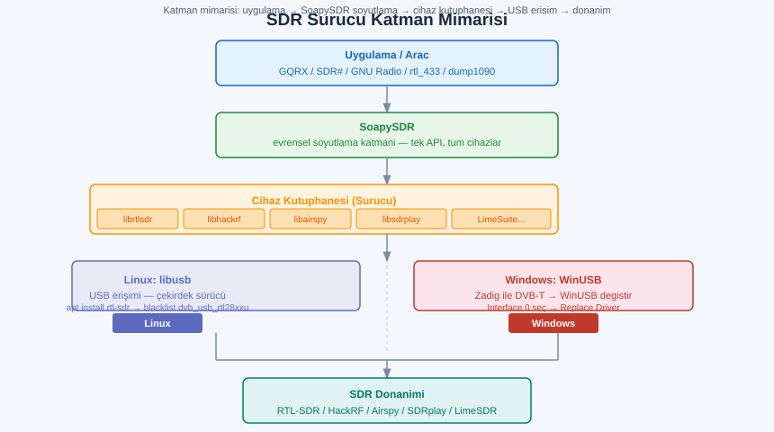
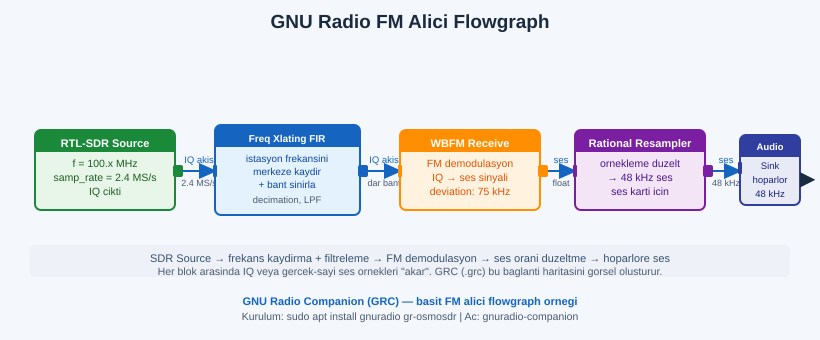
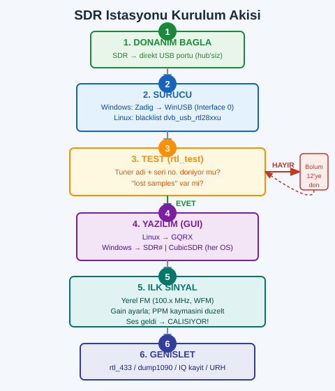

# SIGINT EL KİTABI — BÖLÜM 4: İŞLETİM SİSTEMİ, YAZILIM VE KURULUM
## SDR'ı Çalışır Hale Getirmek — "Donanım Geldi, Şimdi Ne Kuracağım?" (Sıfırdan Ustalığa)

> **Amaç:** Elinde bir SDR (RTL-SDR, HackRF, Airspy…) var ama "hangi işletim sistemi, ne yüklenir, neden çalışmıyor?" duvarına çarptın. Bu bölüm, donanımı **ilk sinyali duyana kadar** götüren yazılım/OS/sürücü katmanını uçtan uca anlatır. Yalnızca *ne kurulur*'u değil, **neden o OS**, **sürücü katmanı tam olarak nasıl çalışır** ve **karşılaşacağın her tipik hatanın kökü ve çözümü**'nü içerir. Forum cevaplarında dağınık duran "Zadig", "DVB-T blacklist", "usb_claim_interface -6", "sample drop", "PPM kayması" gibi konuların tamamı burada, **bir mantık zincirinde** toplanmıştır.

> **Önce bunu oku — YASAL ÇERÇEVE:** SDR ile **dinleme (RX) araçları geniştir** ve neredeyse her frekansı yakalayabilir. Ancak **yakaladığın bazı içeriklerin kaydı, çözümü veya paylaşımı** bulunduğun ülkede **suç** olabilir — özellikle **özel haberleşme** (telsiz telefon, çağrı cihazı/pager mesajı, şifresiz telsiz görüşmesi), **cep telefonu trafiği** ve **şifreli/lisanslı servisler**. Bu bölümdeki tüm alıştırmalar **yasal olarak açık yayınlar** (FM radyo, ADS-B uçak telemetrisi, kendi evindeki kendi IoT sensörlerin) üzerine kuruludur. "Teknik olarak yakalayabiliyor olmak" yasal olduğu anlamına gelmez. Detaylı hukuki sınır için bu el kitabının **hukuk/sınır bölümüne** bak.

> **İkinci uyarı — yanlış beklenti:** "Dongle'ı taktım, neden hiçbir şey duymuyorum?" sorununun **%90'ı yazılım/sürücü/yakalama-noktası** kaynaklıdır, donanım arızası değil. Aşağıdaki **kurulum akışını sırayla** izle; adım atlama. Özellikle **Windows'ta Zadig/DVB-T** ve **Linux'ta blacklist** adımlarını atlarsan donanım "yokmuş gibi" davranır ve saatlerce yanlış yerde ararsın.

---

## İÇİNDEKİLER

1. [Neden İşletim Sistemi Seçimi Her Şeyi Belirler](#1)
2. [İşletim Sistemi Karşılaştırması — Linux / Windows / Pi / macOS](#2)
3. [ DragonOS — "Her Şey Kurulu Gelen" SDR Dağıtımı (Yeni Başlayana İdeal)](#3)
4. [Sanal Makine mi, Bare-Metal mi? (USB Geçişi Tuzağı)](#4)
5. [ Sürücü Katmanı — librtlsdr, Zadig, DVB-T Sorunu, SoapySDR](#5)
6. [Diğer Cihaz Sürücüleri — HackRF / Airspy / SDRplay](#6)
7. [ GUI Yazılımlar — Ne İşe Yarar, Kime Uygun](#7)
8. [GNU Radio — "RF'in Programlama Dili" (Flowgraph Mantığı)](#8)
9. [Sinyal Tersine Mühendislik — URH & Inspectrum](#9)
10. [Hazır Çözücüler — rtl_433, dump1090, multimon-ng, WSJT-X](#10)
11. [ Komut Satırı Araçları — rtl_test / rtl_sdr / rtl_fm / rtl_power](#11)
12. [ Kurulum Adımları + Yaygın Sorunlar (Sorun→Çözüm)](#12)
13. [Sıfırdan Bir SDR İstasyonu Kurma Akışı](#13)
14. [ Alıştırmalar (Yasal, Ev Ortamı)](#14)
15. [Hızlı Referans & Kontrol Listesi](#15)
16. [Çapraz Referans](#16)

---

<a id="1"></a>
## 1.  Neden İşletim Sistemi Seçimi Her Şeyi Belirler

SDR donanımı, kendi başına "aptal" bir analog-dijital dönüştürücüdür: antenden gelen radyo dalgalarını **IQ örneklerine** (ham sayı akışı) çevirir ve USB'den bilgisayara akıtır. **Tüm zekâ yazılımdadır** — demodülasyon, çözümleme, görselleştirme, kayıt. Dolayısıyla SDR'da "işletim sistemi seçimi", aslında **"hangi araç ekosistemine erişeceğim"** seçimidir.

```
        ANTEN              SDR DONANIMI            BİLGİSAYAR (YAZILIM = ZEKÂ)
     ┌─────────┐         ┌──────────────┐        ┌────────────────────────────┐
     │ RF dalga│ ──RF──► │ Tuner + ADC  │ ─USB─► │ Sürücü → SoapySDR/librtlsdr│
     │ (analog)│         │ (IQ örneği)  │ (IQ)   │   → GQRX/GNU Radio/rtl_433  │
     └─────────┘         └──────────────┘        │   → demod / çözüm / görsel  │
                                                 └────────────────────────────┘
        Donanım sadece "örnek üretir".   Sinyali ANLAMLI kılan her şey burada.
```

> **Kritik gerçek — Linux neden RF dünyasında baskın:** SDR/RF araç ekosisteminin **ezici çoğunluğu önce Linux için yazılır** (genelde açık kaynak, C/C++/Python). GNU Radio, gr-* eklentileri, rtl_433, dump1090, multimon-ng, SoapySDR sürücüleri, URH, Inspectrum, kismet — hepsi Linux'ta **birinci sınıf vatandaştır**; bir kısmı Windows'a hiç gelmez ya da geç/eksik gelir. Sürücü kurulumu da Linux'ta genelde **tek paket** (`apt install rtl-sdr`) iken, Windows'ta **Zadig ile manuel WinUSB değişimi** gerektirir. Sonuç: **ciddi SDR işi yapacaksan Linux öğren** — Windows "SDR# ile dinleme" için iyidir, ama araç çeşitliliği ve otomasyon Linux'tadır.

> **Yeni başlayana yol haritası:** (1) Eğer "hiç uğraşmadan hemen çalışsın" istiyorsan → **DragonOS** (Bölüm 3, her şey kurulu). (2) Eğer Windows'ta kalıp önce kulak dolgunluğu istiyorsan → **SDR# + Zadig** (Bölüm 7, Bölüm 5). (3) Ciddi öğrenme için → **Ubuntu/Debian bare-metal** üzerine kendi elinle kur (en çok öğretir).

---

<a id="2"></a>
## 2.  İşletim Sistemi Karşılaştırması

| OS | Güçlü yanı | Zayıf yanı | Kime / ne zaman |
|---|---|---|---|
| **DragonOS** (Ubuntu tabanlı, SDR-hazır) | Yüzlerce SDR aracı **önceden kurulu**, sürücüler hazır | İndirme büyük (~birkaç GB), genel-amaç değil | **Yeni başlayan**, "hemen çalışsın", demo/öğrenme |
| **Ubuntu / Debian** | En geniş paket deposu, kararlı, en çok belge | Sürücüleri/araçları **sen kurarsın** (öğretici) | Ciddi öğrenme, üretim istasyonu, otomasyon |
| **Kali Linux** | Güvenlik/pentest araçlarıyla bütünleşik, RF araçları var | Günlük-sürücü OS değil, ağır | RF + güvenlik testi birlikte yapan |
| **Windows 10/11** | **SDR#/SDR Console** mükemmel, eklenti zengini, kolay | Bazı araçlar yok (rtl_433/GNU Radio sancılı), **Zadig** zorunlu | Sadece dinleme, masaüstü konfor, başlangıç |
| **Raspberry Pi** (Pi OS, DragonOS Pi) | **Taşınabilir/headless istasyon**, düşük güç, 7/24 | Sınırlı CPU (geniş bant/GNU Radio zorlanır), USB bant darlığı | **ADS-B besleme**, uzak/kalıcı sensör, alan istasyonu |
| **macOS** | GQRX/CubicSDR çalışır, Homebrew ile bazı araçlar | Ekosistem **dar**, çoğu araç yok/sancılı, sürücü sınırları | Mac'i olan, hafif kullanım; ciddi iş için önerilmez |

### Linux dağıtımı kıyası (RF perspektifi)
- **Ubuntu/Debian** SDR belgelerinin **fiili standardıdır** — bir komut bulduğunda neredeyse her zaman `apt`/Debian temelli yazılmıştır. Yeni başlayan için **en az sürprizli** Linux budur.
- **Kali**, Debian üzerine kuruludur; RF araçları (`rtl-sdr`, `gnuradio`, `hackrf`, `kalibrate`) depolarında vardır. Ama Kali'yi **günlük masaüstü** gibi değil, **araç kutusu** gibi düşün.
- **Arch/Fedora** da çalışır ama belge/komut çoğunluğu Debian odaklı olduğundan yeni başlayana **ekstra çeviri yükü** getirir.

### Raspberry Pi — taşınabilir/headless istasyon
Pi, SDR dünyasının **"kur-unut"** cihazıdır. Tipik kullanım: bir RTL-SDR dongle + ADS-B anteni + Pi → çatıya/pencereye koy, **headless** (monitörsüz, SSH ile yönet) çalıştır, **dump1090/readsb** ile üzerinden geçen uçakları 7/24 besle (FlightAware/ADS-B Exchange gibi ağlara). Avantaj: düşük güç, sessiz, kalıcı. Sınır: **CPU zayıftır** — geniş bant tarama (`rtl_power` çok geniş aralık), GNU Radio ağır flowgraph'lar veya çoklu cihaz Pi'yi zorlar; ayrıca **USB bus** paylaşımı örnek düşmesine yol açabilir (Bölüm 12).

> **Pi notu:** ADS-B/IoT gibi **dar-bant, tek-amaç** işler için Pi mükemmel. GNU Radio ile **geniş-bant DSP** ya da HackRF ile **20 MHz** akış için masaüstü/dizüstü daha uygun. Pi 4/5, Pi 3'e göre USB ve CPU'da belirgin daha iyidir.

### macOS sınırları
GQRX ve CubicSDR macOS'ta çalışır (Homebrew: `brew install gqrx`, `brew install --cask cubicsdr`); `rtl-sdr` araçları da Homebrew'de var. Ama **GNU Radio kurulumu sancılı**, birçok `gr-*` eklenti ve hazır çözücü (multimon-ng vb.) ya yok ya da güçlükle derlenir. Sonuç: macOS'ta **dinle/keşfet** yapabilirsin ama **ciddi tersine mühendislik/otomasyon** için Linux'a geç.

> **Püf — ikili yaklaşım:** Çoğu kişi **Windows'ta SDR# ile başlar** (kolay, görsel), sonra ciddi iş için **Linux'a (genelde DragonOS ya da Ubuntu) geçer**. İkisini birlikte tutmak (dual-boot ya da Linux'u VM/ayrı diskte) en pratik öğrenme yoludur.

---

<a id="3"></a>
## 3.  DragonOS — "Her Şey Kurulu Gelen" SDR Dağıtımı

**DragonOS**, Ubuntu (Lubuntu/genelde LXQt masaüstü) tabanlı, **SDR ve sinyal analiz araçlarının yüzlercesi önceden kurulu** gelen bir Linux dağıtımıdır (geliştirici: "Aaron"/cemaxecuter; sürümler "DragonOS Focal", "DragonOS FocalX" gibi adlanır — *güncel sürüm adını indirme sayfasından teyit et*). Yeni başlayan için **en az sürtünmeli** başlangıçtır: sürücüler hazır, GNU Radio + gr-eklentileri, GQRX, SDRangel, URH, Inspectrum, rtl_433, dump1090, kismet ve daha fazlası **kutudan çıkar çıkmaz** çalışır.

### Neden yeni başlayana ideal
- **Sürücü/derleme cehennemini atlar:** RTL-SDR/HackRF/Airspy/SDRplay sürücüleri ve onlarca aracın bağımlılık zinciri **çözülmüş gelir.** Kendi başına kurarken saatler harcanan bağımlılık hataları (özellikle GNU Radio + UHD + gr-osmosdr) burada yoktur.
- **"Çalışıyor mu?" değil "ne yapayım?" sorusuna geçersin:** Donanımla değil, **sinyalle** uğraşmaya başlarsın.
- **Canlı USB ile denenebilir:** ISO'yu USB'ye yazıp (bkz. aşağı) bilgisayara hiç kurmadan **canlı** çalıştırabilirsin.

### Nasıl başlanır (kavramsal akış)
```
1. DragonOS ISO indir (resmi/teyitli kaynaktan)
2. USB'ye yaz:
   - Linux:   sudo dd if=DragonOS.iso of=/dev/sdX bs=4M status=progress   (sdX'i DOĞRU seç!)
   - Windows: balenaEtcher ya da Rufus ile yaz
3. USB'den boot et (BIOS/UEFI boot menüsü)
4. "Try" (canlı) ya da "Install" seç
5. SDR'ı tak → bir terminal aç → `rtl_test` ya da doğrudan GQRX'i aç
```

> **`dd` uyarısı:** `of=/dev/sdX` hedefini **yanlış girersen yanlış diski silersin** (geri dönüşü yok). `lsblk` ile USB'nin doğru aygıt adını teyit et. Bölüm değil, **disk** ver (`/dev/sdb`, `/dev/sdb1` değil).

> **Püf — DragonOS = "öğrenmeyi hızlandıran tekerlekli bisiklet":** Avantajı (her şey hazır) aynı zamanda dezavantajıdır: **sürücü/araç kurmayı öğrenmezsin.** İyi bir yol: önce DragonOS ile **hızla sinyal duymanın hazzını yaşa ve araçları keşfet**, sonra bir **Ubuntu** üzerinde **aynı araçları kendi elinle kurarak** kaputun altını öğren. İkisi birbirini tamamlar.

> **Alternatifler:** "Skywave Linux" da SDR-hazır bir başka dağıtımdır (özellikle web-SDR/kısa dalga odaklı). Ama topluluk/araç genişliği bakımından **DragonOS** SDR'da en yaygın "hepsi-kurulu" tercihtir.

---

<a id="4"></a>
## 4.  Sanal Makine mi, Bare-Metal mi? — USB Geçişi Tuzağı

"Linux'u VM'de (VirtualBox/VMware) çalıştırıp SDR'ı oradan kullanayım" cazip görünür ama **en sık takılınan noktadır.**

### Sorun: USB geçişi (passthrough)
SDR, USB üzerinden **yüksek hızlı, sürekli** veri akıtır. VM'in bu cihazı görmesi için, host işletim sistemi USB aygıtını **VM'e devretmeli** (passthrough). Sorunlar:
- **Cihaz host'a "yapışır":** Windows host, RTL-SDR'ı görür görmez **DVB-T sürücüsünü** yükleyebilir ve cihazı VM'e vermeyi reddeder/çakışır.
- **USB sürüm/hız uyumsuzluğu:** VirtualBox'ta cihazı **USB 3.0 (xHCI)** denetleyiciye atamazsan (ve Extension Pack kurmazsan), bant genişliği yetmez → **örnek düşmesi (drop)** sürekli olur.
- **Gecikme/kesinti:** VM'in USB stack'i ek gecikme katar; yüksek örnekleme hızında (HackRF 20 MS/s) akış **kopar**.

### Pratik kurallar
| Senaryo | Öneri |
|---|---|
| RTL-SDR, düşük örnekleme (≤2.4 MS/s), dinleme | VM **çalışabilir** ama bare-metal/DragonOS canlı USB daha sağlam |
| HackRF/Airspy, yüksek örnekleme, GNU Radio | **Bare-metal Linux** (VM'de drop kaçınılmaz olur) |
| "Hemen denemek istiyorum" | **DragonOS canlı USB** (bare-metal hızında, kuruluma gerek yok) |
| Windows'tasın, Linux araçları lazım | **Dual-boot** ya da **ayrı bir Linux diski** (VM yerine) |

> **Püf — VM yerine canlı USB:** Bare-metal'e geçmeden Linux denemek istiyorsan **VM kurma**, bunun yerine **DragonOS/Ubuntu canlı USB**'sinden boot et. Canlı USB **gerçek donanıma** doğrudan erişir (USB passthrough sorunu yoktur), bare-metal performansı verir ve diske hiçbir şey yazmaz. SDR + VM kombinasyonu, yeni başlayanın "neden sürekli kopuyor?" diye saatlerce dövüşmesinin baş sebebidir.

> **WSL2 notu:** Windows üzerindeki WSL2 de bir VM'dir ve **doğrudan USB erişimi yoktur**; `usbipd-win` ile USB cihazı WSL'e bağlamak mümkündür ama RTL-SDR yüksek-hız akışında kırılgandır. Öğrenme için güvenilir değil; **gerçek Linux** tercih et.

---

<a id="5"></a>
## 5.  Sürücü Katmanı — librtlsdr, Zadig, DVB-T Sorunu, SoapySDR

Burası, "donanım tanınmıyor" sorunlarının **kaynak kodudur.** Katmanları anlamadan sorun çözemezsin.

### Katman mimarisi
```
   UYGULAMA (GQRX, GNU Radio, rtl_433, SDR#)
        │
        ▼
   SOAPYSDR  ← (opsiyonel) EVRENSEL SOYUTLAMA: "hangi cihaz olursa olsun aynı arayüz"
        │
        ▼
   CİHAZ SÜRÜCÜ KÜTÜPHANESİ: librtlsdr / libhackrf / libairspy / libsdrplay
        │
        ▼
   USB ERİŞİM: libusb (Linux/Mac)  |  WinUSB (Windows — Zadig ile atanır)
        │
        ▼
   ÇEKİRDEK / İŞLETİM SİSTEMİ → SDR donanımı
```



### 5.1 RTL-SDR & librtlsdr
RTL-SDR, aslında **ucuz bir DVB-T (dijital TV) USB alıcısının** "kötüye kullanımıdır": Realtek RTL2832U çipi, ham IQ örneklerini USB'den verebildiği keşfedilince genel-amaçlı SDR'a dönüştü. Yazılım katmanı **`librtlsdr`** (Osmocom projesi) kütüphanesidir; `rtl_test`, `rtl_sdr`, `rtl_fm`, `rtl_power` bu kütüphanenin komut satırı araçlarıdır.

**Linux kurulum:**
```bash
# Debian/Ubuntu/Kali/DragonOS
sudo apt update
sudo apt install rtl-sdr librtlsdr-dev

# (Gerekirse) son sürümü kaynaktan:
# git clone https://gitea.osmocom.org/sdr/rtl-sdr   (kaynağı teyit et)
# cmake → make → sudo make install → sudo ldconfig
```

### 5.2  DVB-T sürücüsü sorunu (Linux) — "cihaz görünüyor ama rtl_test açamıyor"
Linux çekirdeği, RTL2832U'yu **bir DVB-T TV kartı sanıp** `dvb_usb_rtl28xxu` modülünü otomatik yükler ve cihazı **kapar** → SDR araçların erişemez. **Çözüm: bu modülü kara listeye al (blacklist).**

```bash
# /etc/modprobe.d/blacklist-rtlsdr.conf dosyasına şunları ekle:
blacklist dvb_usb_rtl28xxu
blacklist rtl2832
blacklist rtl2830
# (bazı çekirdeklerde ek modüller: rtl2832_sdr, e4000, fc0012, fc0013)

# Sonra modülü hemen kaldır (yeniden başlatmadan):
sudo rmmod dvb_usb_rtl28xxu

# Kalıcı olması için yeniden başlat ya da:
sudo depmod -a
```
DragonOS gibi SDR-hazır dağıtımlarda bu **zaten yapılmıştır**.

### 5.3  Zadig (Windows) — DVB-T'yi WinUSB'ye değiştirmek
Windows'ta RTL-SDR takınca, Windows **DVB-T (Realtek) sürücüsünü** yükler. SDR yazılımının cihaza erişmesi için bu sürücüyü **WinUSB** (genel USB erişimi) ile değiştirmen gerekir — bunu **Zadig** yapar.

```
ZADIG ADIMLARI (Windows):
1. SDR'ı tak. (TV/DVB uygulaması çalışıyorsa kapat.)
2. Zadig'i indir (zadig.akeo.ie) ve YÖNETİCİ olarak çalıştır.
3. Options → "List All Devices" işaretle.
4. Açılır listeden cihazı seç:
     - "Bulk-In, Interface (Interface 0)"  ← tipik RTL-SDR
     - ya da "RTL2838UHIDIR" benzeri bir ad
   (İKİ arayüzlü görünürse Interface 0'ı seç.)
5. Sağdaki hedef sürücü "WinUSB" olsun.
6. "Replace Driver" / "Install Driver" tıkla.
7. SDR# / GQRX'i aç → cihaz artık görünür.
```

> **Zadig'de en sık 2 ölümcül hata:**
> 1. **Yanlış cihaza WinUSB atamak:** Listede klavye/fare/ses kartı da görünür. **Yanlışına atarsan o aygıtın sürücüsünü bozarsın.** Cihaz adını (`Bulk-In Interface 0`, `RTL2838`) dikkatle teyit et; emin değilsen SDR'ı çıkar-tak, listede **kaybolup geri gelen** satır odur.
> 2. **Geri alma:** Yanlış sürücü atadıysan → **Device Manager**'dan o aygıta sağ tık → "Uninstall device" → "Delete driver" → çıkar-tak (Windows orijinal sürücüyü tekrar yükler).

> **Püf — Zadig "tek seferlik" değildir:** Aynı dongle'ı **farklı bir USB portuna** takarsan Windows onu "yeni cihaz" sayıp **yeniden DVB-T sürücüsü** yükleyebilir → Zadig'i o port için tekrar çalıştırman gerekir. Çözüm: **hep aynı USB portunu** kullan, ya da her portu bir kez Zadig'le "eğit". SDR# bazı sürümlerde kendi `zadig` adımını içerir.

### 5.4  SoapySDR — evrensel soyutlama katmanı (neden var?)
**SoapySDR**, farklı SDR donanımlarını (RTL-SDR, HackRF, Airspy, SDRplay, LimeSDR, USRP…) **tek ortak API** arkasında toplayan bir **soyutlama katmanıdır.** Her cihaz için ayrı bir "Soapy modülü" (`SoapyRTLSDR`, `SoapyHackRF`…) vardır.

- **Neden işine yarar:** Bir yazılım (örn. CubicSDR, SDRangel, GNU Radio'nun `Soapy Source` bloğu) SoapySDR'a konuşursa, **donanımı değiştirdiğinde kodu/akışı değiştirmen gerekmez** — bugün RTL-SDR, yarın HackRF, aynı arayüz. "Donanım-bağımsız" SDR yazılımının temelidir.
- **Kurulum (Linux):**
  ```bash
  sudo apt install soapysdr-tools soapysdr-module-rtlsdr soapysdr-module-hackrf soapysdr-module-airspy
  # Bağlı/desteklenen cihazları listele:
  SoapySDRUtil --find
  # Bir cihazı sorgula:
  SoapySDRUtil --probe="driver=rtlsdr"
  ```
- **Ne zaman önemli:** Birden çok cihazın varsa ya da `gr-soapy`/`Soapy Source` kullanan flowgraph/yazılım çalıştırıyorsan. Tek RTL-SDR ile basit dinleme için doğrudan `librtlsdr` da yeter; ama **ileri seviye için SoapySDR öğrenmeye değer.**

---

<a id="6"></a>
## 6.  Diğer Cihaz Sürücüleri — HackRF / Airspy / SDRplay

| Cihaz | Kütüphane / araç | Linux kurulum | Not |
|---|---|---|---|
| **HackRF One** (TX+RX, 1 MHz–6 GHz, 8-bit) | `libhackrf`, `hackrf` araçları | `sudo apt install hackrf libhackrf-dev` | Test: `hackrf_info`. Geniş bant + **verici** (TX) — yasal dikkat! |
| **Airspy** (R2/Mini/HF+) | `libairspy`, `airspy-tools` | `sudo apt install airspy` | Yüksek dinamik aralık, RX-only; HF+ kısa dalga için mükemmel |
| **SDRplay** (RSP1A/RSPdx…) | **kapalı kaynak `API/driver`** + SoapySDRPlay | SDRplay sitesinden **resmi API** kur, sonra `SoapySDRPlay3` | Sürücüsü **resmi siteden** gelir (apt'te tam olmayabilir) — *teyit et* |
| **LimeSDR** | `LimeSuite`, SoapyLMS | `sudo apt install limesuite soapysdr-module-lms7` | TX+RX, geniş bant; kurulum daha ağır |
| **RTL-SDR Blog V3/V4** | `librtlsdr` (V4 için **güncel** sürüm şart) | apt (V4 için kaynaktan güncel rtl-sdr-blog forku) | **V4, eski librtlsdr ile çalışmaz** — güncel sürücü gerekir (teyit et) |

> **HackRF / LimeSDR = VERİCİ:** Bu cihazlar **yayın yapabilir (TX)**. **Lisanssız/yetkisiz yayın yapmak yasaktır ve tehlikelidir** (acil servis/havacılık frekanslarını karıştırabilir). Bu el kitabının alıştırmaları **yalnızca RX (dinleme)** içindir. TX'i yalnızca lisanslı, izole (kablolu/dummy-load) ve yasal koşullarda kullan.

> **Püf — `hackrf_info` / `airspy_info` ilk test:** Yeni bir cihaz taktığında, GUI açmadan önce **cihazın kendi `_info` aracını** çalıştır. Seri numarası + firmware sürümü dönüyorsa donanım+sürücü sağlamdır; sorun yazılımdadır. Dönmüyorsa sorun **sürücü/USB/güç** katmanındadır (Bölüm 12).

---

<a id="7"></a>
## 7.  GUI Yazılımlar — Ne İşe Yarar, Kime Uygun

Bunlar "spektrumu gör + bir kanalı dinle/demodüle et" işini görsel yapan ana alıcı programlarıdır.

| Yazılım | Platform | Güçlü yanı | Kime uygun |
|---|---|---|---|
| **GQRX** | Linux, macOS | Sade, hızlı, GNU Radio tabanlı genel-amaç alıcı; SoapySDR destekli | Linux/Mac'te **yeni başlayan**, "hızlı dinle" |
| **SDR# (SDRSharp)** | Windows | **Eklenti zengini** (binlerce plugin), olgun, hassas | **Windows başlangıç** + ileri (plugin) |
| **CubicSDR** | Win/Linux/Mac | Çapraz-platform, SoapySDR ile her cihaz, görsel waterfall | Çapraz-platform isteyen |
| **SDRangel** | Win/Linux/Mac | **Çok-modlu/çok-kanallı**, dekoderler (ADS-B, AIS, DMR…) gömülü, gelişmiş | İleri kullanıcı, "tek araçta çok şey" |
| **SDR Console** | Windows | Güçlü, çoklu-VFO, uzak SDR (network) desteği | Windows ileri/istasyon kullanıcısı |

### Hangisiyle başlamalı?
- **Windows'tasın:** **SDR#** ile başla (kolay, görsel, devasa plugin ekosistemi — frekans tarayıcı, decoder, gürültü azaltma).
- **Linux'tasın:** **GQRX** ile başla (sade, hızlı). Sonra çok-modlu iş için **SDRangel**'e geç.
- **Çapraz-platform / çok cihaz:** **CubicSDR** (SoapySDR sayesinde donanım-bağımsız).

### Tipik kullanım örnekleri
- **GQRX:** Yerel FM radyo dinle (WFM modu), bir amatör telsiz bandını (NFM) tara, IQ kaydet (`File → Record`), spektrumda anormal taşıyıcı ara.
- **SDR#:** Bir plugin'le **frekans tarayıcı** (scanner) kur, "Frequency Manager" ile ilgi frekanslarını kaydet, **gürültü bastırma** (NR/NB) eklentisiyle zayıf sinyali netleştir.
- **SDRangel:** Aynı anda **ADS-B + bir NFM kanalı** çöz; gömülü **AIS** ile gemi, **DMR** (yasal/açık olanlar) ile dijital ses dene.

> **Ortak kavramlar (hepsinde aynı):** **Merkez frekans** (cihazın baktığı orta nokta), **örnekleme/bant genişliği** (aynı anda görebildiğin pencere genişliği), **mod** (WFM/NFM/AM/USB/LSB/CW), **squelch** (gürültü eşiği), **gain** (kazanç — Bölüm 12), **waterfall** (zaman-frekans şelalesi). Bir yazılımı öğrenince diğerine geçiş kolaydır.

---

<a id="8"></a>
## 8.  GNU Radio — "RF'in Programlama Dili"

GUI alıcılar "hazır mutfak"sa, **GNU Radio** "kendi yemeğini pişirdiğin laboratuvardır." Açık kaynak, **blok-tabanlı bir DSP (sayısal sinyal işleme) çerçevesidir.** Hazır bir araçta olmayan bir demodülatör/çözücü/işlemi **kendin kurarsın.** **GNU Radio Companion (GRC)**, bunu sürükle-bırak görsel akış şeması (**flowgraph**) ile yapmanı sağlar.

### Temel kavramlar
- **Flowgraph (akış şeması):** Sinyalin geçtiği işlem zinciri. Bloklar birbirine bağlanır; veri (örnek akışı) bir bloktan diğerine "akar".
- **Source (kaynak):** Veriyi üreten/getiren blok. Örn. `RTL-SDR Source` / `Soapy Source` (donanımdan IQ), `File Source` (kaydedilmiş IQ).
- **Sink (havuz):** Veriyi tüketen/çıkaran blok. Örn. `Audio Sink` (hoparlöre ses), `QT GUI Sink` (ekrana spektrum/waterfall), `File Sink` (diske yaz).
- **İşlem blokları (arası):** Filtre (`Low Pass Filter`), frekans kaydırma (`Frequency Xlating`), örnekleme oranı değiştirme (`Rational Resampler`), demodülatör (`WBFM Receive`, `NBFM Receive`, `AM Demod`), vb.
- **Akış (stream) vs mesaj:** Bloklar arası ya sürekli **örnek akışı** ya da olay-bazlı **mesaj** geçer.

### Kavramsal örnek — basit bir FM radyo alıcısı (flowgraph)
```
┌──────────────┐   IQ    ┌────────────────────┐   ┌──────────────┐   ┌────────────┐
│ RTL-SDR /    │ ──────► │ Frequency Xlating  │ ─►│ WBFM Receive │ ─►│ Rational   │
│ Soapy Source │ 2.4MS/s │ FIR (kanala kaydır │   │ (FM demod)   │   │ Resampler  │
│ f=100.x MHz  │         │  + bant sınırla)   │   │              │   │ →48 kHz ses│
└──────────────┘         └────────────────────┘   └──────────────┘   └─────┬──────┘
                                                                            │
                                                                       ┌────▼─────┐
                                                                       │ Audio    │
                                                                       │ Sink     │ ► hoparlör
                                                                       └──────────┘
```
**Mantık:** Source 2.4 MS/s ham IQ verir → `Frequency Xlating FIR` ilgilendiğin FM istasyonunu merkeze kaydırıp gereksiz bandı süzer → `WBFM Receive` FM'i sese çözer → `Rational Resampler` ses kartının istediği 48 kHz'e indirir → `Audio Sink` hoparlöre basar. **GUI alıcının içinde olan bu zinciri, GNU Radio'da sen kurmuş olursun** — ve istediğin yere müdahale edebilirsin (kendi filtren, kendi çözücün, kaydın).



### Kime uygun / ne zaman
- **GUI'de olmayan bir şeyi çözmek** istediğinde (özel/bilinmeyen modülasyon, özel bir cihazın protokolü).
- **Otomasyon/araştırma:** Bir kez kurduğun flowgraph'ı Python kodu olarak dışa aktarıp (GRC `.py` üretir) script gibi çalıştırabilirsin.
- **Öğrenme:** RF/DSP'yi gerçekten anlamak istiyorsan GNU Radio "kaputun altını" gösterir.

**Kurulum (Linux):**
```bash
sudo apt install gnuradio gr-osmosdr
# (gr-osmosdr: RTL-SDR/HackRF/Airspy'ı GNU Radio'ya bağlayan blok seti.
# Modern kurulumlarda 'Soapy Source' bloğu da SoapySDR üzerinden cihaz verir.)
gnuradio-companion   # GRC görsel editörünü açar
```

> **Püf — GNU Radio sürüm uyumu kâbusu:** İnternette bulduğun bir `.grc` dosyası, **farklı bir GNU Radio sürümünde** (3.7 vs 3.8 vs 3.10) yazıldıysa **açılmaz/çalışmaz** (blok adları/API değişti). Bir flowgraph hata veriyorsa **ilk kontrol: GNU Radio sürümü** (`gnuradio-config-info --version`). Bu yüzden **DragonOS** gibi sürümleri uyumlu paketlenmiş bir dağıtım yeni başlayanı çok dertten kurtarır.

> **`gr-osmosdr` vs `Soapy`:** Eski belgeler `osmocom Source` bloğu kullanır; modern GNU Radio'da **`Soapy Source`** (SoapySDR üzerinden) yaygındır. İkisi de RTL-SDR/HackRF'i GNU Radio'ya bağlar — belgenin yaşına göre hangisinin mevcut olduğunu kontrol et.

---

<a id="9"></a>
## 9.  Sinyal Tersine Mühendislik — URH & Inspectrum

Bilinmeyen bir sinyali (örn. bir kablosuz priz, garaj kumandası, kendi IoT cihazın) **çözmek/anlamak** istediğinde bu araçlar devreye girer.

### Universal Radio Hacker (URH)
**URH**, sinyal **yakalama → demodülasyon → protokol tersine mühendisliği**ni tek arayüzde toplayan açık kaynak araçtır. Özellikle **OOK/ASK/FSK** gibi basit dijital modülasyonlu (IoT/uzaktan kumanda) sinyaller için güçlüdür.

- **Akış:** Cihazdan (ya da kaydedilmiş IQ'dan) sinyali al → URH **otomatik** modülasyon/bit oranı tahmin etmeye çalışır → ham sinyali **bitlere** çevirir → tekrarlayan paketleri hizalar → alanları (adres, komut, sağlama/CRC) **etiketler** → protokolü "deşifre" edersin.
- **Örnek kullanım:** Kendi kablosuz kapı zilini/garaj kumandanı bas, URH ile yakala, "her basışta hangi bitler değişiyor?" diye bak → komut yapısını çöz. (**Yalnızca kendi cihazların** — başkasının sistemini kurcalamak yasa dışıdır ve URH'nin replay/TX yeteneği bu sınırı net yapar.)

**Kurulum (Linux):**
```bash
sudo apt install urh    # ya da: pip install urh
```

### Inspectrum
**Inspectrum**, **kaydedilmiş bir IQ dosyasını** (örn. `rtl_sdr` ile alınmış `.cu8`/`.cfile`) görsel olarak inceleyip **elle ölçüm** yapmanı sağlar: yüksek çözünürlüklü spektrogram, sinyalin **sembol süresini**, frekans kaymasını, paket aralığını **fareyle ölçme** (cursor). URH'ye veri/parametre hazırlamak için idealdir.

- **Örnek:** `rtl_sdr` ile kaydettiğin bir IoT sinyalini Inspectrum'da aç → bir bit'in (sembolün) süresini cursor'la ölç → bit oranını (baud) hesapla → bu değeri URH'de "biliyorum" diye gir, otomatik tahmine güvenme. **Inspectrum ölçer, URH çözer.**

**Kurulum (Linux):**
```bash
sudo apt install inspectrum
```

> **İş bölümü:** **rtl_sdr** kaydeder → **Inspectrum** görsel ölçer (sembol süresi/frekans) → **URH** bitlere çevirip protokolü etiketler. Üçü birlikte, "bu bilinmeyen sinyal ne diyor?" sorusunun standart tersine-mühendislik hattıdır.

---

<a id="10"></a>
## 10.  Hazır Çözücüler — rtl_433, dump1090, multimon-ng, WSJT-X

Bazı sinyalleri sıfırdan çözmene gerek yok — topluluk **hazır çözücüler** yazmıştır.

### rtl_433 — ev IoT / sensör (433/868/915 MHz)
**rtl_433**, 433.92 MHz (ve 868/915 MHz) bandındaki **yüzlerce kablosuz cihazı** (hava istasyonu sensörleri, termometre/higrometre, lastik basınç sensörü TPMS, kablosuz priz, kapı sensörü, bazı zil/alarm) otomatik tanıyıp **JSON/okunabilir** çıktı verir.

```bash
sudo apt install rtl-433     # ya da kaynaktan derle (en güncel cihaz desteği için)
rtl_433                       # varsayılan 433.92 MHz dinle, tanıdığı her şeyi yazdır
rtl_433 -f 868M               # 868 MHz bandı
rtl_433 -F json               # JSON çıktı (loglamak/işlemek için)
rtl_433 -R 0                  # tüm protokol denemelerini kapat (sonra -R ile seç)
```
> **Örnek:** Terminalde `rtl_433` çalıştır, evindeki kablosuz dış-mekân termometresi ya da kablosuz priz uzaktan kumandasına bas → cihaz/marka, sıcaklık, ID, batarya durumu **anında** dökülür. (Bkz. Alıştırma 14.3 — **yalnızca kendi cihazların.**)

### dump1090 / readsb — ADS-B uçak (1090 MHz)
Uçaklar **ADS-B** ile konum/hız/irtifa/çağrı kodunu **1090 MHz**'te **açıkça** yayınlar (sivil havacılıkta açık/yasal veri). **dump1090** (ve modern çatalı **readsb**) bunu çözer ve harita üstünde gösterir.

```bash
# dump1090 (Mutability/FlightAware çatalları yaygın) — kurulum çatala göre değişir
dump1090 --interactive                 # terminalde canlı uçak listesi
dump1090 --net                         # web arayüzü + harita (tarayıcıda :8080)
```
> **Örnek:** 1090 MHz için kısa bir anten (hatta varsayılan) yeterli olabilir; `dump1090 --net` çalıştır, tarayıcıda haritayı aç → **üzerinden geçen uçakları** çağrı koduyla canlı gör. ADS-B **dinlemesi açık/yasaldır** ve mükemmel bir başlangıç projesidir.

### multimon-ng — POCSAG/pager & dijital modlar
**multimon-ng**, `rtl_fm`'in ürettiği ses akışını alıp **POCSAG (çağrı cihazı/pager), FLEX, AFSK, DTMF, FSK** gibi dijital modları **çözer.** Genelde `rtl_fm | multimon-ng` borusu olarak kullanılır.

```bash
sudo apt install multimon-ng
# Örnek boru (POCSAG çözme) — frekans örnektir:
rtl_fm -f 153.350M -s 22050 -g 42 - | multimon-ng -t raw -a POCSAG1200 -
```
> **HUKUK — pager içeriği:** Pager/POCSAG mesajları **özel haberleşmedir.** Çözmek teknik olarak kolay olsa da **başkasının çağrı mesajını okumak/kaydetmek/paylaşmak çoğu ülkede SUÇTUR.** Bunu yalnızca **modu öğrenmek** ve **kendi/izinli test sinyalin** için kullan; içerik avına çıkma.

### WSJT-X & fldigi — zayıf sinyal amatör / dijital
- **WSJT-X:** **FT8/FT4/JT65** gibi **çok zayıf sinyal** dijital modlarının amatör telsiz programı. Gürültü tabanının **altındaki** sinyalleri bile çözer; dünya çapında binlerce istasyonu dinleyebilirsin (HF anteni + uygun cihaz, örn. Airspy HF+ ya da yukarı-dönüştürücülü RTL-SDR gerekir).
- **fldigi:** **RTTY, PSK31, CW** ve çok sayıda amatör dijital modun genel çözücüsü/terminali.

> **Not:** Bu ikisi **amatör telsiz** dünyasındandır; HF (kısa dalga) dinlemek için RTL-SDR'a **upconverter** (ör. Ham It Up) ya da doğrudan-örnekleme modu, ya da **Airspy HF+/SDRplay** gibi HF-yetenekli cihaz gerekir. FT8 dinlemek (RX) genelde yasaldır; **yayın (TX) amatör lisansı ister.**

---

<a id="11"></a>
## 11.  Komut Satırı Araçları — rtl_test / rtl_sdr / rtl_fm / rtl_power

GUI olmadan, doğrudan **librtlsdr** araçları. SDR ustalığının temelini bunlar oluşturur; sorun gidermenin de ilk adımıdır.

### rtl_test — "donanım çalışıyor mu?" ilk teşhis
```bash
rtl_test                 # cihazı bulur, örnekleme hızı dener, kayıp (drop) raporlar
rtl_test -t              # tuner tipini ve frekans aralığını gösterir
rtl_test -s 2400000      # belirli örnekleme hızını test et (drop var mı?)
```
> **İlk yapılacak her zaman `rtl_test`.** Cihaz adı + tuner tipi (örn. "R820T2") dönüyorsa donanım+sürücü tamam. "No supported devices found" → sürücü/Zadig/blacklist sorunu (Bölüm 12). `rtl_test` "lost samples" basıp duruyorsa → USB bant/güç sorunu (Bölüm 12).

### rtl_sdr — ham IQ kaydı
```bash
# 100.6 MHz'te, 2.048 MS/s, 10 sn'lik ham IQ'yu dosyaya yaz (cu8 formatı):
rtl_sdr -f 100600000 -s 2048000 -g 30 -n 20480000 kayit.cu8
# -f frekans  -s örnekleme  -g gain (dB)  -n örnek sayısı (=süre×örnekleme)
```
> Bu `.cu8` dosyasını sonra **Inspectrum**'da aç, **URH**'ye ver, ya da GNU Radio `File Source`'a koy. **IQ kaydı = sinyalin fotoğrafı**; çevrimdışı analizin temelidir.

### rtl_fm — FM/NFM demodülasyon borusu
```bash
# Yerel FM radyo (WFM), sesi hoparlöre (Linux'ta play/aplay ile):
rtl_fm -f 100.6M -M wbfm -s 200000 -r 48000 - | aplay -r 48000 -f S16_LE

# Dar-bant FM (telsiz), squelch ile:
rtl_fm -f 446.00625M -M fm -s 12500 -g 40 -l 50 - | aplay -r 24000 -f S16_LE
# -M mod (fm/wbfm/am/usb/lsb)  -l squelch  -r ses oranı
```
> **Püf — `rtl_fm` bir "boru" aracıdır:** Ekranda pencere açmaz; sesi **stdout'a** basar. Onu `aplay`/`play`'e (dinlemek) ya da `multimon-ng`'ye (çözmek) **pipe** edersin. "Çıktı yok" sanma — borunun ikinci ucunu bağlamayı unutmuşsundur.

### rtl_power — geniş bant tarama / heatmap
```bash
# 88–108 MHz FM bandını 25 kHz adımla, 30 sn boyunca tara → CSV:
rtl_power -f 88M:108M:25k -i 30 -g 20 -1 fm_tarama.csv
# -f başlangıç:bitiş:adım  -i entegrasyon süresi  -1 tek geçiş (tek-shot)

# Geniş keşif: 400–500 MHz, 100 kHz adım, sürekli, 1 dk dilimler:
rtl_power -f 400M:500M:100k -i 60 genis_tarama.csv
```
Çıkan CSV'yi **heatmap** (zaman×frekans şelalesi) görüntüsüne çevirmek için topluluk script'i **`heatmap.py`** (rtl_power deposunda) kullanılır:
```bash
python heatmap.py fm_tarama.csv fm_heatmap.png
```
> **rtl_power'ın gücü:** Tek seferde **dinleyemeyeceğin kadar geniş** bir bandı (cihazın anlık bant genişliğinden çok daha geniş) **adım adım** tarayıp "nerede enerji/taşıyıcı var?" haritası çıkarır. Bilinmeyen bir bantta **"sinyal nerede?"** sorusunun cevabı. (Bkz. Alıştırma 14.2.)

### HackRF komut satırı
```bash
hackrf_info                                   # cihaz + firmware teşhisi
# Ham RX kaydı (örnek; -r dosyaya, -f frekans Hz, -s örnekleme):
hackrf_transfer -r kayit.iq -f 433920000 -s 8000000 -n 8000000
```
> `hackrf_transfer` **-t** ile **TX** (verici) yapar — **yetkisiz yayın yasaktır.** Yalnızca `-r` (RX/kayıt) ile, yasal/izleme amaçlı kullan.

---

<a id="12"></a>
## 12.  Kurulum Adımları + Yaygın Sorunlar (Sorun → Çözüm)

Bu tablo, sahada zaman kaybettiren **hemen her tipik arızanın** kökü ve çözümüdür. Donanım çalışmıyorsa **buraya bak.**

| Belirti | Olası kök neden | Çözüm |
|---|---|---|
| **"No supported devices found" / cihaz hiç görünmüyor** (Windows) | Zadig ile WinUSB atanmamış, hâlâ DVB-T sürücüsünde | **Zadig** ile cihaza (Interface 0) **WinUSB** ata (Bölüm 5.3) |
| Aynı sorun (Linux) | Çekirdek `dvb_usb_rtl28xxu` modülünü tutuyor | Modülü **blacklist** et + `sudo rmmod dvb_usb_rtl28xxu` (Bölüm 5.2) |
| **`usb_claim_interface error -6`** | Cihazı **başka bir süreç** zaten tutuyor (açık GQRX/SDR#/rtl_fm) ya da DVB modülü | Cihazı tutan **diğer uygulamayı kapat**; Linux'ta DVB modülünü kaldır; aynı dongle'a iki program aynı anda erişemez |
| **"lost samples" / sürekli örnek düşmesi (drop)** | USB2 bant genişliği yetmiyor, **zayıf güç**, USB hub, yüksek örnekleme | Örnekleme hızını düşür (`-s 2048000`), **doğrudan anakart USB portu** (hub'sız), kaliteli kablo, mümkünse USB2 portu (bazı USB3 portları RTL'de daha kötü) |
| **VM'de sürekli kopma/drop** | USB passthrough + VM gecikmesi | **Bare-metal** ya da **canlı USB** kullan (Bölüm 4); VirtualBox'ta USB3 (xHCI) + Extension Pack |
| **RFI / her yerde gürültü, sahte sinyaller** | **USB3 portu/kablo** ve bilgisayar gürültüsü 1090/1.5 GHz civarını boğar; kötü ekranlama | SDR'ı **uzatma kablosuyla** bilgisayardan uzaklaştır, **ferrit boncuk** tak, USB3 yerine USB2 dene, anteni gövdeden ayır |
| **Görüntüde her yerde aynalar/sahte taşıyıcılar** | **Aşırı gain** (overload), güçlü yakın verici (FM/baz istasyonu) doyuruyor | **Gain'i düşür** (otomatik yerine manuel, düşükten artır), gerekirse **FM bandı stop filtresi**/attenuator |
| **Frekans 10–50 kHz kaymış (istasyon yanda)** | Ucuz osilatör **PPM hatası**; sıcaklıkla kayar | Yazılımda **PPM düzeltmesi** gir (GQRX/SDR#'ta "ppm"); değeri **`kalibrate`/`rtl_test -p`** ya da bilinen bir istasyona göre bul; **TCXO'lu** dongle kayma yapmaz |
| **Açılışta doğru, ısındıkça frekans kayıyor** | **Termal sürüklenme** (ucuz kristal) | Cihazı **ısınması için 5-10 dk beklet** sonra PPM ayarla; ciddi iş için **TCXO**'lu (V3/V4, Airspy) cihaz al |
| **Cihaz çok ısınıyor / bir süre sonra düşüyor** | Yoğun kullanımda RTL ısınır; zayıf USB gücü | Havalandır/soğut, kaliteli **powered hub**, uzun kayıtta termal dengeyi bekle |
| **Anten takılıyor ama bağlanmıyor / sinyal zayıf** | **Konnektör uyumsuzluğu**: RTL-SDR genelde **SMA** (bazıları MCX), HackRF **SMA** | Doğru **adaptör** kullan (MCX↔SMA), konnektörü zorlama; empedans 50Ω, anten banda uygun olsun |
| **HF (kısa dalga) hiç gelmiyor** | RTL-SDR varsayılan ~24 MHz altını **görmez** | **Upconverter** (Ham It Up) ya da **doğrudan örnekleme (direct sampling Q)** modu; ya da Airspy HF+/SDRplay |
| **GNU Radio `.grc` açılmıyor/blok yok** | **Sürüm uyumsuzluğu** (3.7/3.8/3.10) ya da `gr-osmosdr` eksik | `gnuradio-config-info --version` kontrol; eksik blok için ilgili `gr-*` paketini kur; flowgraph'ı sürümüne uyarla |
| **`rtl_433` cihazımı tanımıyor** | Eski sürüm / cihaz protokolü yeni eklenmiş | **Kaynaktan en güncel rtl_433** derle (apt'teki eski olabilir) |
| **RTL-SDR Blog V4 çalışmıyor** | V4 **güncel librtlsdr** gerektirir | rtl-sdr-blog'un **güncel forkunu** kur (eski librtlsdr V4'ü tanımaz — teyit et) |

> **Püf — sorun giderme sırası (yukarıdan aşağı):** (1) `rtl_test` çalışıyor mu? → hayır ise **sürücü/Zadig/blacklist**. (2) Çalışıyor ama drop var → **USB/güç/örnekleme hızı**. (3) Sinyal var ama yerinde değil → **PPM/gain**. (4) Her yer gürültü → **RFI/USB3/ferrit**. **Her zaman en alttaki katmandan (donanım tanınıyor mu?) başla**, GUI'yi suçlamadan önce komut satırıyla teşhis et.

> **Püf — güç en çok ihmal edilen değişken:** RTL-SDR drop/ısınma sorunlarının çoğu **yetersiz USB gücüdür** (özellikle dizüstü, hub, uzun kablo). **Kaliteli kısa kablo + powered USB2 hub** çoğu "neden sürekli kopuyor?" sorununu çözer. Önce yazılımı değil, **gücü ve kabloyu** kontrol et.

---

<a id="13"></a>
## 13.  Sıfırdan Bir SDR İstasyonu Kurma Akışı

Donanımı eline aldın. Sıfırdan ilk sinyale giden **doğru sıra** budur — adım atlama.

```
┌─────────────────────────────────────────────────────────────────────┐
│  SDR İSTASYONU KURULUM AKIŞI (donanım → ilk sinyal)                  │
│                                                                     │
│  1. DONANIM BAĞLA                                                    │
│     • SDR'ı kaliteli kısa kabloyla (mümkünse uzatma + ferrit)        │
│       doğrudan anakart USB portuna (hub'sız)                         │
│     • Banda uygun anteni tak (FM için telsel, ADS-B için 1090 anten) │
│                            │                                         │
│                            ▼                                         │
│  2. SÜRÜCÜ                                                           │
│     • Windows → Zadig: cihaza WinUSB ata (Interface 0)               │
│     • Linux → dvb_usb_rtl28xxu blacklist + rmmod                     │
│     • (DragonOS ise bu adım HAZIR — atla)                           │
│                            │                                         │
│                            ▼                                         │
│  3. TEST (komut satırı — GUI'den ÖNCE)                              │
│     • rtl_test  → cihaz + tuner adı dönüyor mu? drop var mı?         │
│     • (HackRF: hackrf_info)                                          │
│     • Sorun varsa → Bölüm 12'ye dön, GUI'ye geçme                    │
│                            │                                         │
│                            ▼                                         │
│  4. YAZILIM (GUI)                                                    │
│     • Linux → GQRX  |  Windows → SDR#  |  çapraz → CubicSDR          │
│     • Cihazı seç, örnekleme hızını ayarla                            │
│                            │                                         │
│                            ▼                                         │
│  5. İLK SİNYAL                                                       │
│     • Bilinen güçlü bir yayına git: YEREL FM (örn. 100.x MHz, WFM)  │
│     • Gain'i ayarla (düşükten artır, overload'a dikkat)             │
│     • PPM kaymasını düzelt (istasyon tam ortaya otursun)            │
│     • Ses geldi → istasyon ÇALIŞIYOR. Tebrikler.                     │
│                            │                                         │
│                            ▼                                         │
│  6. GENİŞLE                                                          │
│     • rtl_power ile bir bant tara (nerede sinyal var?)              │
│     • rtl_433 / dump1090 ile hazır çözücüleri dene                  │
│     • IQ kaydet → Inspectrum/URH ile analiz                         │
└─────────────────────────────────────────────────────────────────────┘
```



> **Altın kural — "önce FM":** İlk testte **mutlaka yerel, güçlü, bilinen bir FM istasyonuna** git. FM her şehirde güçlüdür, WFM demodülasyonu basittir, ses gelir-gelmez **tüm zincirin (anten→donanım→sürücü→yazılım) çalıştığını** kanıtlamış olursun. Egzotik/zayıf bir frekansla başlarsan, "duymuyorum"un sebebi donanım mı yoksa "orada zaten sinyal yok mu" ayırt edemezsin. **Bilinen-iyi referansla doğrula, sonra keşfet.**

---

<a id="14"></a>
## 14.  Alıştırmalar (Yasal, Ev Ortamı)

> Bu alıştırmaların tamamı **yasal olarak açık yayınlar** ya da **senin kendi cihazların** üzerinedir. Başkasının haberleşmesini hedef alma.

### 14.1 — İlk sinyal: yerel FM istasyonu dinle
1. SDR'ı kur (Bölüm 13 akışı). **GQRX** (Linux) ya da **SDR#** (Windows) aç.
2. Cihazı seç, örnekleme **~2.4 MS/s**, mod **WFM**.
3. Yerel bir FM istasyonunun frekansına git (örn. 100.x MHz).
4. **Gain'i** düşükten artırarak en temiz sesi bul; **PPM**'i istasyon tam ortaya oturacak şekilde ayarla.
5. **Başarı kriteri:** Net ses + waterfall'da istasyonun bandı tam merkezde.
- **Komut satırı alternatifi:** `rtl_fm -f 100.6M -M wbfm -s 200000 -r 48000 - | aplay -r 48000 -f S16_LE`

### 14.2 — `rtl_power` ile bant tara + heatmap çıkar
1. FM bandını tara: `rtl_power -f 88M:108M:25k -i 30 -1 fm.csv`
2. Heatmap üret: `python heatmap.py fm.csv fm.png` (heatmap.py rtl_power deposundan).
3. Görüntüde **dikey çizgiler** = istasyon taşıyıcıları. En parlak olanlar en güçlü istasyonlar.
4. **Başarı kriteri:** Şehrindeki FM istasyonlarının frekanslarını heatmap'ten okuyabilmek.
- **Genişlet:** 400–470 MHz tarayıp "nerede sinyal var?" haritası çıkar (dinlemeden, sadece enerji haritası).

### 14.3 — `rtl_433` ile EVİNDEKİ kendi sensörlerini gör
1. `rtl_433` çalıştır (varsayılan 433.92 MHz).
2. Evindeki **kendi** kablosuz cihazını tetikle: dış-mekân termometresi/higrometresi, kablosuz priz kumandası, kapı/hareket sensörü, araç anahtarı (TPMS lastik sensörü araç hareket edince).
3. Terminale **cihaz/marka, ID, ölçüm değerleri** (sıcaklık, nem, batarya) dökülecek.
4. **Başarı kriteri:** Kendi termometrenin yayınladığı sıcaklığı SDR ile yakalamak.
> **Sınır:** Yalnızca **kendi cihazların.** Komşunun sensörünü izlemek/loglamak mahremiyet ihlalidir.

### 14.4 — `dump1090` ile üzerinden geçen uçakları izle (ADS-B, açık/yasal)
1. **dump1090** kur (FlightAware/Mutability çatalı).
2. Çalıştır: `dump1090 --interactive` (terminal listesi) ya da `dump1090 --net` → tarayıcıda `http://localhost:8080` harita.
3. 1090 MHz anten (kısa dikey iyi olur) ile birkaç dakika bekle.
4. **Başarı kriteri:** En az bir uçağı **çağrı kodu + irtifa + konum** ile haritada görmek.
> ADS-B **açık ve dinlemesi yasaldır**; bu yüzden mükemmel, sürdürülebilir bir başlangıç projesidir (hatta Pi ile 7/24 besleme istasyonuna dönüştürülebilir).

> **İleri (opsiyonel):** Alıştırma 14.3'teki bir IoT sinyalini `rtl_sdr -f 433920000 -s 2048000 -n 20480000 iot.cu8` ile **kaydet**, **Inspectrum**'da aç, sembol süresini ölç, **URH**'ye verip bit yapısını çöz. Bu, **sinyal tersine mühendisliğinin** ilk gerçek adımıdır — yine **yalnızca kendi cihazın** üzerinde.

---

<a id="15"></a>
## 15.  Hızlı Referans & Kontrol Listesi

### OS / kurulum seçimi (özet)
| Durum | Seç |
|---|---|
| "Hemen çalışsın, hiç uğraşmayayım" | **DragonOS** (canlı USB) |
| Ciddi öğrenme / üretim istasyonu | **Ubuntu/Debian** bare-metal |
| Sadece Windows'ta dinleme | **Windows + SDR# + Zadig** |
| Taşınabilir/headless 7/24 (ADS-B) | **Raspberry Pi** |
| Mac'in var, hafif kullanım | **macOS + GQRX/CubicSDR** (sınırlı) |
| Linux'u denemek istiyorum (host Windows) | **VM DEĞİL → canlı USB / dual-boot** |

### Kurulum kontrol listesi
- [ ] Donanım **doğrudan anakart USB**'ye (hub yok, kaliteli kısa kablo)
- [ ] Banda uygun **anten** takılı, konnektör (SMA/MCX) uyumlu
- [ ] **Windows:** Zadig ile **WinUSB** atandı (Interface 0)
- [ ] **Linux:** `dvb_usb_rtl28xxu` **blacklist** + `rmmod`
- [ ] **`rtl_test`** cihaz + tuner adı döndürüyor, **drop yok**
- [ ] GUI yazılım kuruldu (GQRX / SDR# / CubicSDR)
- [ ] İlk test **yerel FM** ile yapıldı (ses geldi)
- [ ] **PPM** düzeltildi, **gain** overload'suz ayarlandı

### Komut hızlı referansı
| Amaç | Komut |
|---|---|
| Donanım testi | `rtl_test -t` |
| HackRF testi | `hackrf_info` |
| SoapySDR cihaz listele | `SoapySDRUtil --find` |
| Ham IQ kaydı | `rtl_sdr -f 100600000 -s 2048000 -g 30 -n N kayit.cu8` |
| FM dinle (boru) | `rtl_fm -f 100.6M -M wbfm -s 200000 -r 48000 - \| aplay -r 48000 -f S16_LE` |
| Bant tara | `rtl_power -f 88M:108M:25k -i 30 -1 tarama.csv` |
| IoT sensör | `rtl_433 -F json` |
| ADS-B uçak | `dump1090 --interactive` |
| GNU Radio sürümü | `gnuradio-config-info --version` |

### Sorun → ilk bakılacak
| Belirti | İlk bak |
|---|---|
| Cihaz hiç yok | Zadig (Win) / blacklist (Linux) |
| `usb_claim_interface -6` | Cihazı tutan başka süreç var → kapat |
| Sürekli drop | USB güç/hub/kablo + örnekleme hızı düşür |
| Frekans kaymış | PPM düzeltmesi (TCXO yoksa) |
| Her yer gürültü | USB3/ferrit/uzatma kablosu (RFI) |
| Aynalar/sahte taşıyıcı | Gain'i düşür (overload) |

---

<a id="16"></a>
## 16.  Çapraz Referans

> **Kapanış:** SDR'da donanım yalnızca **örnek üreten bir musluktur**; suyu içilebilir kılan tüm zekâ **yazılım katmanındadır.** Doğru OS seçimi (Linux'un araç ekosistemi vs Windows'un konforu), sürücü katmanını gerçekten anlamak (Zadig/blacklist/SoapySDR), ve "neden çalışmıyor?" duvarını **katman katman** (donanım tanınıyor mu → drop → PPM/gain → RFI) yıkabilmek — ustalık budur. **Önce `rtl_test`, önce FM, önce komut satırı**: bilinen-iyi bir referansla zincirin çalıştığını kanıtla, sonra bilinmeyene aç. Bir yazılım butonu değil, bir **mühendislik disiplini** öğreniyorsun; ve her "duymuyorum"un arkasında çoğu zaman bir blacklist satırı, bir gain ayarı ya da bir USB portu vardır.

---

Bu bölüm, Kanije Kalesi SIGINT El Kitabı'nın parçasıdır. Tüm bölümler ve önerilen okuma sırası için indekse bakın: [SIGINT_00 — Başlangıç ve İndeks](SIGINT_00_BASLANGIC_INDEX_VE_YASAL.md).

Doğrudan ilgili bölümler:
- [SIGINT_02 — SDR Cihazları Derinlemesine](SIGINT_02_SDR_CIHAZLARI_DERINLEMESINE.md): kuracağın yazılımı besleyen donanım seçimi.
- [SIGINT_05 — Protokoller ve Sinyal Çözümleme](SIGINT_05_PROTOKOLLER_VE_SINYAL_COZUMLEME.md): kurulan araçlarla ADS-B/AIS/POCSAG çözümleme.
- [SIGINT_12 — DragonOS ve Araç Ekosistemi](SIGINT_12_DRAGONOS_VE_ARAC_EKOSISTEMI.md): hazır dağıtım ve araç komut/iş akışı katmanı.
- [SIGINT_25 — Açık Kaynak Araç ve Kaynak Dizini](SIGINT_25_ACIK_KAYNAK_ARAC_DIZINI_GITHUB.md): bağımlılık, derleme ve depo dizini.
