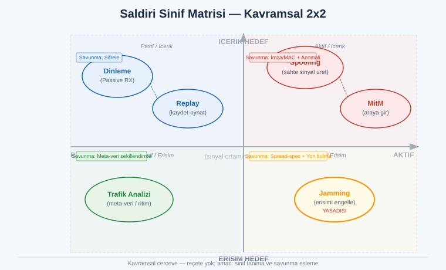
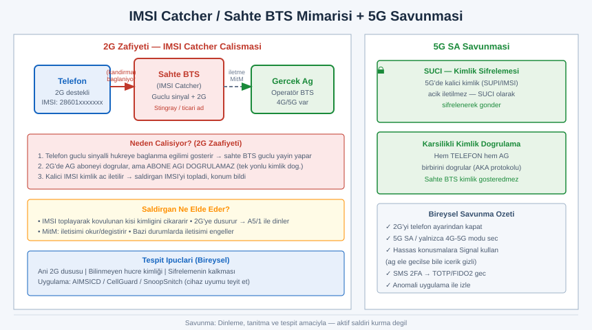
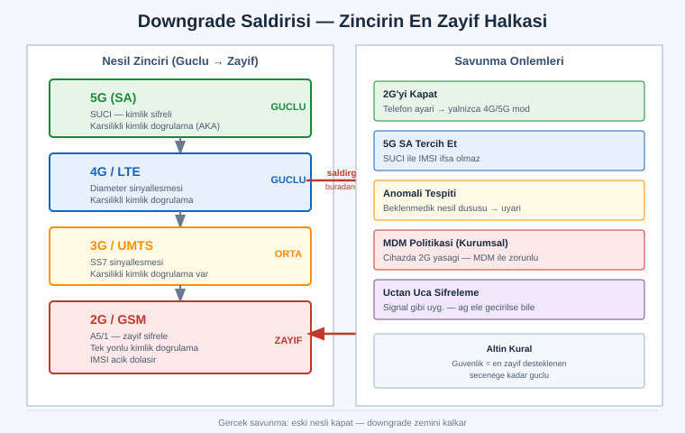

# SIGINT — BÖLÜM 6: SİNYAL GÜVENLİĞİ, AÇIKLAR VE SAVUNMA
## Manipülasyon, Zafiyetler ve Korunma — Zero-to-Hero

> **Amaç:** SIGINT El Kitabı'nın bu **güvenlik ve savunma bölümü**, önceki bölümlerde "dinleme/çözümleme" gözüyle öğrendiğin sinyalleri bu kez **güvenlik gözüyle** ele alır: *Hangi sinyal manipüle edilebilir, hangisi edilemez? Neden? Ve en önemlisi — NASIL tespit eder, NASIL korunursun?* Bu bölüm bir **savunma ve farkındalık** kılavuzudur; her açığı "nasıl çalışır + neden savunmasız + nasıl tespit/korunulur" çerçevesinde anlatır.

> **ÖNCE BUNU OKU — EN GÜÇLÜ YASAL UYARI:** Bu bölümdeki konuların **aktif uygulaması büyük ölçüde SUÇTUR ve tehlikelidir.** **Jamming (sinyal bastırma/karıştırma)** neredeyse her ülkede ağır cezalı bir telekomünikasyon suçudur, can güvenliğini (112/acil çağrı, havacılık, GPS) doğrudan tehlikeye atar ve insan öldürebilir. **Yetkisiz dinleme (interception)**, **spoofing (sahte sinyal üretme)**, **sahte baz istasyonu kurma** ve **başkasının haberleşmesine müdahale** suçtur (TR'de TCK 132–140 haberleşmenin gizliliği; ABD'de FCC/CALEA; AB'de ePrivacy). Bu bölüm sana **adım-adım saldırı reçetesi VERMEZ** — bilinçli olarak **prensip + savunma** düzeyinde kalır. Amaç: bu açıkların *var olduğunu bilerek* **kendini ve kurumunu savunman.** "Nasıl yapılır" değil, **"nasıl korunulur"** öğrenirsin.

> **Teyit notu:** Aşağıdaki **yıllar, CVE'ler, kırılma tarihleri, protokol sürümleri (A5/1, SS7, Diameter, 5G SA/NSA), araç adları ve araştırmacı isimleri** zamanla güncellenir veya hafızadan yanlış hatırlanabilir. Tarihsel olaylar ve "ilk demo" iddiaları **yaklaşıktır.** Kritik kararlar için **CVE/NVD, GSMA, 3GPP SA3, üreticinin advisory'si ve akademik kaynaktan teyit et.** Emin olmadığım yerleri "**teyit et**" notuyla işaretledim. Perspektif tamamen **savunma**dır.

---

## İÇİNDEKİLER

1. [Tehdit Modeli — Sinyal Katmanında Saldırı Yüzeyi](#1)
2. [ SİNYAL MANİPÜLASYONU — Edilebilir mi, Edilemez mi? (Tablo)](#2)
3. [Manipülasyonun Mantığı — Replay'i ve Spoofing'i Ne Engeller](#3)
4. [ SALDIRI SINIFLARI — Prensip + Savunma (Reçete Değil)](#4)
5. [ HÜCRESEL & TELEKOM AÇIKLARI — A5/1, IMSI Catcher, SS7, Diameter](#5)
6. [Downgrade Saldırıları — Zincirin En Zayıf Halkasına İtme](#6)
7. [ YILLARA GÖRE KRONOLOJİ — SIGINT/Telekom Güvenlik Zaman Çizelgesi](#7)
8. [ GÜNCEL AÇIKLARI TAKİP — MEŞRU KAYNAKLAR (Underground'a YÖNLENDİRMEZ)](#8)
9. [ SAVUNMA ÖZETİ — Bireysel / Kurumsal / Operasyonel](#9)
10. [ ALIŞTIRMALAR — Yasal, Kendi Cihazında](#10)
11. [ Yaygın Hatalar & Yanılgılar](#11)
12. [ Kanije Kalesi ile — Sinyal Farkındalığı](#12)
13. [ SIGINT Etik Manifestosu + Çapraz Referans](#13)

---

<a id="1"></a>
## 1.  Tehdit Modeli — Sinyal Katmanında Saldırı Yüzeyi

Önceki bölümlerde sinyali **dinleyen/çözen** taraftaydık. Güvenlik için tarafı çevirip soralım: *Bir sinyale kötü niyetli biri ne yapabilir?* Saldırı yüzeyi dört temel eyleme indirgenir — ve her birinin bir savunma karşılığı vardır:

```
   ┌──────────────────────────────────────────────────────────────────────┐
   │  SALDIRGAN NE YAPMAK İSTER?           │  SAVUNMA NE SAĞLAR?           │
   ├──────────────────────────────────────────────────────────────────────┤
   │  DİNLE   (Confidentiality'yi kır)     │  Şifreleme (içerik gizli)     │
   │  DEĞİŞTİR (Integrity'yi kır)          │  MAC / imza (kurcalama belli) │
   │  TAKLİT  (Authenticity'yi kır)        │  Kimlik doğrulama (sahte ele) │
   │  ENGELLE (Availability'yi kır=jamming)│  Spread spectrum + yön bulma  │
   └──────────────────────────────────────────────────────────────────────┘
```

Bu, klasik güvenlik üçgeninin (CIA: Confidentiality, Integrity, Availability) **artı Authenticity** ile telsiz dünyasına uyarlanmış halidir. Bir sinyalin "güçlü" mü "zayıf" mı olduğunu belirleyen tek şey vardır: **bu dört eylemden hangilerine karşı koruması var?**

> **Altın kural:** Telsiz, kablonun aksine **paylaşımlı ve halka açık** bir ortamdır — havadaki sinyali *herkes* alabilir. Bu yüzden telsiz güvenliği "kimse duymasın" üzerine değil, **"duysa bile anlamasın (şifreleme), taklit edemesin (kimlik doğrulama), değiştiremesin (bütünlük)"** üzerine kurulur. Fiziksel erişimi engellemek imkânsızdır; **kriptografik garanti** tek gerçek savunmadır.

### Pasif vs Aktif — yasal uçurum

| Eylem türü | Ne yapar | Yasal durum (genel) |
|---|---|---|
| **Pasif** (dinleme/RF gözlem) | Yalnızca alır, ortama müdahale etmez | Bazı sinyaller (amatör/yayın) yasal; **özel haberleşme dinlemek SUÇ** |
| **Aktif** (jamming/spoofing/sahte BTS) | Ortama sinyal **enjekte eder**, başkasını etkiler | **Neredeyse her zaman SUÇ + tehlikeli** |

Bu bölümün geri kalanı bu ayrımı korur: pasif **tespit/gözlem** ile **savunmayı** anlatır; aktif saldırının yalnızca **prensibini** açıklar ki ona karşı savunabilesin.

---

<a id="2"></a>
## 2.  SİNYAL MANİPÜLASYONU — Edilebilir mi, Edilemez mi?

Kullanıcının özel sorusu buydu: **hangi sinyaller manipüle edilebilir, hangileri edilemez?** Cevap tek bir prensibe dayanır: **bir sinyal, ancak içine "tazelik" (freshness) ve "kimlik" (authenticity) konmamışsa manipüle edilebilir.** Aşağıdaki tablo bu mantığı somutlaştırır.

### Zayıf / Manipüle Edilebilir Sinyaller

| Sinyal / Teknoloji | Neden zayıf? | Hangi saldırıya açık? | Savunma / Modern karşılığı |
|---|---|---|---|
| **Sabit-kod (fixed-code) OOK kumandalar** (eski garaj kapısı, eski araç, bazı kapı zilleri) | Her basışta **aynı** sabit kodu yollar, tazelik yok | **Replay** (kaydet → tekrar oynat) | Rolling code'a geç (KeeLoq vb.) |
| **Kimlik doğrulamasız telemetri** (eski sensörler, bazı IoT, TPMS lastik sensörü) | Veriyi imzasız/şifresiz yollar | Sahte veri enjeksiyonu, **gizlilik takibi** | İmzalı/şifreli telemetri |
| **Şifrelenmemiş yayın** (analog telsiz, eski baby monitor, POCSAG çağrı/pager) | İçerik açık, dinleyene karşı koruma yok | **Pasif dinleme**, içerik ifşası | Sayısal + şifreli (DMR şifreli, TETRA) |
| **GPS sivil L1 C/A** | Sinyal **imzasız**, çok zayıf (uydudan ~ -125 dBm), kimlik doğrulama yok | **Spoofing & meaconing** | Çok-bantlı/çok-konstelasyonlu alıcı, anomali tespiti, Galileo OSNMA |
| **ADS-B (uçak konum yayını)** | Tasarımda **kimlik doğrulama yok**, açık yayın | Sahte uçak izi enjeksiyonu (kavram) | Çoklu-alıcı (MLAT) çapraz doğrulama |
| **2G/GSM (A5/1, A5/2)** | Zayıf/kırık şifre, tek-yönlü kimlik doğrulama (ağ aboneyi doğrular, abone ağı doğrulamaz) | **Sahte BTS (IMSI catcher)**, downgrade | 2G'yi kapat; 4G/5G karşılıklı kimlik doğrulama |

### Dirençli / Güçlü Sinyaller

| Sinyal / Teknoloji | Neden güçlü? | Hangi saldırıya direnir? |
|---|---|---|
| **Rolling code** (KeeLoq, modern araç anahtarı, modern garaj) | Her basışta **sayaç + kriptografi** ile değişen kod; eski kod geçersiz | Basit **replay**'e dirençli (ileri saldırılar Bölüm 4'te) |
| **AES ile şifreli + kimlik doğrulamalı** (modern Wi-Fi WPA3, TETRA, şifreli DMR) | İçerik şifreli **ve** mesaj bütünlüğü (MAC) garantili | Dinleme + kurcalama + sahtecilik |
| **Frequency Hopping (FHSS)** (Bluetooth, askeri telsiz, bazı endüstriyel) | Frekans saniyede yüzlerce kez **gizli desende** atlar | Dar-bant jamming + dinleme zorlaşır |
| **Spread Spectrum / DSSS** (GPS askeri M-kodu, bazı uydu) | Sinyal geniş banda **yayılır**, gürültü altına gömülür | Jamming + tespit + dinleme |
| **Karşılıklı kimlik doğrulama (4G/5G)** | Ağ **ve** abone birbirini doğrular (AKA protokolü); kalıcı kimlik (SUPI) 5G'de şifrelenir (SUCI) | **Sahte baz istasyonu**, IMSI yakalama (5G'de büyük ölçüde) |

> **Püf — "Manipüle edilebilir mi?" testini sen yap:** Bir sinyale bakıp üç soru sor: **(1)** Aynı eylem her seferinde *aynı* sinyali mi üretiyor? (Evet → replay'e açık.) **(2)** Sinyalin içinde *kim gönderdi* bilgisi kriptografik olarak var mı? (Yok → spoofing'e açık.) **(3)** İçerik açık mı? (Evet → dinlemeye açık.) Üçü de "kötü" cevap veriyorsa, o sinyal **kavramsal olarak zayıftır** — ama bu, *senin* ona saldırman gerektiği anlamına gelmez; **kendi cihazının zayıf olup olmadığını anlaman** için bir teşhis aracıdır.

---

<a id="3"></a>
## 3.  Manipülasyonun Mantığı — Replay'i ve Spoofing'i Ne Engeller

İki temel saldırı vardır ve her birini **tek bir kriptografik kavram** engeller. Bunu anlarsan, herhangi bir sinyalin neden güçlü/zayıf olduğunu kendi başına çözersin.

### Replay'i ne engeller? → **TAZELİK (Freshness)**

Replay saldırısı, geçerli bir sinyali kaydedip **sonra tekrar oynatmaktır.** Bunu engellemenin tek yolu, her mesaja **"bu mesaj tazedir, daha önce kullanılmadı"** kanıtı koymaktır:

```
   TAZELİK SAĞLAYAN MEKANİZMALAR
   ─────────────────────────────────────────────────────────
   NONCE        → tek kullanımlık rastgele sayı (number-used-once)
   SAYAÇ        → her mesajda artan sayaç (rolling code'un kalbi)
   ZAMAN DAMGASI→ mesaja gönderim zamanı eklenir (saat senkronu gerekir)
   CHALLENGE    → alıcı rastgele bir soru sorar, gönderen imzalar
   ─────────────────────────────────────────────────────────
   Ortak fikir: "Dün kaydettiğin sinyal, bugün geçersizdir."
```

Sabit-kod kumanda bunların **hiçbirini** içermez → dünkü kayıt bugün de çalışır → replay'e açık. Rolling code **sayaç** kullanır → kaydedilen eski kod, sayaç ilerlediği için reddedilir.

### Spoofing'i ne engeller? → **KİMLİK DOĞRULAMA (Authentication)**

Spoofing, **sahte bir kaynaktan** geçerli görünen sinyal üretmektir. Bunu engellemenin yolu, mesaja **"bunu gerçekten ben gönderdim"** kriptografik kanıtı (imza/MAC) koymaktır:

```
   KİMLİK DOĞRULAMA SAĞLAYAN MEKANİZMALAR
   ─────────────────────────────────────────────────────────
   DİJİTAL İMZA → asimetrik anahtarla imzala (alıcı public key ile doğrular)
   MAC / HMAC   → paylaşılan gizli anahtarla mesaj etiketi
   KARŞILIKLI   → iki taraf da birbirini doğrular (4G/5G AKA)
   ─────────────────────────────────────────────────────────
   Ortak fikir: "Anahtarı bilmeyen, geçerli mesaj üretemez."
```

GPS sivil sinyali imzasızdır → sahte sinyal üretmek (prensip olarak) mümkündür çünkü "bunu gerçek uydu gönderdi" kanıtı yoktur. Galileo'nun **OSNMA**'sı (Open Service Navigation Message Authentication) tam bu boşluğu kapatmak için navigasyon mesajına imza ekler (**teyit et** — yaygınlaşma durumu evrilmektedir).

> **Altın kural:** Bir sinyal **replay**'e karşı *tazelikle*, **spoofing**'e karşı *kimlik doğrulamayla*, **dinlemeye** karşı *şifrelemeyle*, **jamming**'e karşı *spread spectrum + yön bulmayla* korunur. Dört saldırı, dört ayrı savunma. Bir sinyalin "ne kadar güvenli" olduğunu sormak yerine **"bu dördünden hangisine karşı korunmuş?"** diye sor — gerçek cevap budur.

---

<a id="4"></a>
## 4.  SALDIRI SINIFLARI — Prensip + Savunma (Reçete Değil)



Aşağıda her saldırı sınıfı **kavramsal** olarak anlatılır: *nasıl çalışır (prensip), neden işe yarar (zafiyet), nasıl tespit/savunulur.* **Adım-adım uygulama yoktur** — bilinçli olarak. Çünkü çoğu suçtur; amacımız onları **tanımak ve durdurmaktır.**

### 4.1 Replay (Tekrar Oynatma)

**Prensip:** Geçerli bir sinyal kaydedilir, daha sonra olduğu gibi tekrar yayılır. Hedef, "geçerli" sandığı için kabul eder.
**Zafiyet kaynağı:** Tazelik yokluğu (sabit kod). Sabit-kod garaj kumandası bunun **klasik kavramsal örneğidir** — her basışta aynı kodu yollar, dolayısıyla kayıt = geçerli komut.
**Savunma:**
- **Rolling code / nonce / sayaç** kullan (modern kumandalar zaten kullanır).
- **Zaman pencereli** kabul (eski timestamp'i reddet).
- Kritik komutlarda **karşılıklı challenge-response.**
- *Tespit:* Aynı kodun kısa sürede tekrarı → anomali (kurumsal RF izlemede).

### 4.2 Spoofing (Sahte Sinyal)

**Prensip:** Saldırgan, meşru kaynağı **taklit eden** sinyal üretir. İki önemli kavramsal örnek:

**a) GPS Spoofing.** Sivil GPS sinyali zayıf ve imzasız olduğu için, daha güçlü bir sahte sinyal alıcıyı yanlış konum/zamana "ikna edebilir." Gemi/dron yönlendirme, zaman senkronu bozma gibi etkileri vardır.
- **Savunma:** Çok-konstelasyonlu (GPS+Galileo+GLONASS) alıcı, **INS/atalet** ile çapraz kontrol, ani konum sıçraması/zaman tutarsızlığı **anomali tespiti**, sinyal gücü anormalliği (gerçek uydu çok zayıftır — aşırı güçlü sinyal şüphelidir), Galileo **OSNMA** kimlik doğrulaması.

**b) Sahte Baz İstasyonu / IMSI Catcher (kavram, detay Bölüm 5).** Sahte bir hücre, telefonları kendine bağlanmaya kandırır.
- **Savunma:** 4G/5G karşılıklı kimlik doğrulama, 2G'yi kapatma, IMSI-catcher tespit uygulamaları (aşağıda).

**Genel spoofing savunması:** Mesaja **kriptografik kimlik** (imza/MAC) + alıcı tarafında **anomali/tutarlılık** kontrolü.

### 4.3 Jamming (Bastırma) —  YASADIŞI ve TEHLİKELİ

> **NET UYARI:** Jamming **her yerde suçtur**, acil çağrıyı/GPS'i/havacılığı bozarak **can alabilir.** Burada **yalnızca kavramı** veriyoruz ki ona karşı *savunabilesin* — asla denenmemelidir, jammer satın almak/bulundurmak bile çoğu ülkede suçtur.

**Prensip:** Hedef frekansa güçlü gürültü/sinyal basarak meşru iletişimi **boğmak** (availability saldırısı). Kavramsal türleri: sürekli dalga, gürültü, "protokol-bilinçli" (yalnızca kontrol kanalını hedefleyen) — hepsi **kavramsal**, reçete değil.
**Savunma:**
- **Spread spectrum / frequency hopping** (jam edilen banttan kaçar).
- **Yön bulma (DF) ile kaynak tespiti:** Jammer bir konumdan yayar; yönlü anten/TDOA ile kaynağı **bulmak** savunmanın anahtarıdır (regülatör/yetkililerin işi).
- **Tespit + raporlama:** Ani gürültü tabanı yükselişi → jamming şüphesi → yetkiliye bildir.
- Kritik altyapıda **yedekli/çoklu-bant** haberleşme.

### 4.4 Meaconing

**Prensip:** Spoofing'in akrabası — meşru sinyali **alıp gecikmeyle yeniden yayınlamak** (özellikle GPS'te). Alıcı, sinyali gerçek sanır ama konum/zaman kaymıştır. Spoofing "sahte üretir", meaconing "gerçeği geciktirip yeniden yayar."
**Savunma:** GPS spoofing savunmalarıyla aynı — anomali tespiti, çoklu kaynak, atalet çapraz kontrolü.

### 4.5 Man-in-the-Middle (MitM)

**Prensip:** Saldırgan iki taraf arasına girer; her ikisine de "karşı taraf" gibi görünür, trafiği aktarırken okur/değiştirir. Telsizde **sahte BTS** (telefon ↔ sahte hücre ↔ gerçek ağ) klasik örnektir.
**Savunma:** **Karşılıklı kimlik doğrulama** (her iki taraf birbirini kriptografik doğrularsa, araya giren taraf geçerli kimlik üretemez), uçtan uca şifreleme (Signal vb. — araya giren içeriği göremez), sertifika/anahtar sabitleme.

```
   SALDIRI → SAVUNMA HARİTASI (özet)
   ┌──────────────┬──────────────────────────────────────────────┐
   │ Replay       │ Tazelik (nonce/sayaç/zaman)                   │
   │ Spoofing     │ Kimlik doğrulama (imza/MAC) + anomali tespiti │
   │ Jamming     │ Spread spectrum + yön bulma (kaynağı bul)     │
   │ Meaconing    │ Çoklu kaynak + atalet çapraz kontrol          │
   │ MitM         │ Karşılıklı kimlik doğrulama + uçtan uca şifre  │
   └──────────────┴──────────────────────────────────────────────┘
```

---

<a id="5"></a>
## 5.  HÜCRESEL & TELEKOM AÇIKLARI

Telefon ağları SIGINT'in en hassas alanıdır — milyarlarca insanı etkiler. Burada **prensip + savunma** veriyoruz; hiçbiri "nasıl saldırılır" değil, **"neden savunmasız ve nasıl korunulur"** çerçevesindedir.

### 5.1 2G / GSM Şifrelemesinin Zayıflığı (A5/1)

GSM'in ses şifrelemesi **A5/1** (ve daha da zayıf, ihracat sürümü **A5/2**) algoritmasını kullanır. Tasarımı 1980'lerdir; bilgisayar gücü arttıkça kırılabilir hale geldi.
- **Tarihsel kırılma:** 2009 civarı, araştırmacılar (Karsten Nohl ekibi) **rainbow table** (önceden hesaplanmış tablolar) ile A5/1'i pratik sürede kırılabilir gösterdi (**teyit et** — tarih/detay yaklaşık). Bu, "askeri" sanılan GSM şifresinin sıradan donanımla çözülebileceğini kamuoyuna gösterdi.
- **2G'nin asıl riski — DOWNGRADE:** Modern telefon 4G/5G kullansa bile, 2G'ye **düşürülebilirse** (Bölüm 6), tüm o eski zafiyetler geri gelir. 2G hâlâ açık olduğu için bir saldırgan cihazı 2G'ye zorlayıp zayıf şifrelemeye/sahte BTS'e mahkûm edebilir.
- **Savunma:** Telefonunda **"yalnızca 4G/5G" / "2G'yi kapat"** seçeneğini etkinleştir (Android'de modern sürümlerde mevcut; iOS'ta "Lockdown Mode" 2G'yi devre dışı bırakır — **teyit et**). Operatörler 2G'yi kapattıkça (sunset) risk azalır.

### 5.2  IMSI Catcher / Stingray (Sahte Baz İstasyonu)



> "Stingray" bir ticari ürün markasıdır; jenerik adı **IMSI catcher** veya **sahte baz istasyonu**dur.

**Prensip (kavram):** Telefon, **en güçlü sinyalli** hücreye bağlanma eğilimindedir ve 2G'de ağ aboneyi doğrular ama **abone ağı doğrulamaz** (tek-yönlü kimlik doğrulama). Sahte bir baz istasyonu, çevredeki telefonları kendine çekip:
- **IMSI** (kalıcı abone kimliği) toplayabilir → konumda kimlerin olduğunu çıkarır,
- 2G'ye **downgrade** edip iletişimi izleyebilir/yönlendirebilir (MitM),
- bazı durumlarda iletişimi engelleyebilir.

**Neden işe yarar:** Eski nesil kimlik doğrulamanın **tek yönlü** olması + **kalıcı kimliğin (IMSI) açık** dolaşması.

**Modern azaltma:** **5G**, kalıcı kimliği (SUPI) artık açık yollamaz — **SUCI** olarak şifreler; ayrıca **karşılıklı kimlik doğrulama** vardır. Bu, IMSI yakalamayı ve sahte BTS'i ciddi şekilde zorlaştırır (downgrade hâlâ bir kaçış yolu olabilir).

**Tespit (bireysel — meşru, pasif uygulamalar):**
- **AIMSICD** (Android IMSI-Catcher Detector) — açık kaynak, hücre anomalilerini izler (proje aktiflik durumunu **teyit et**).
- **CellGuard** (iOS) — hücre davranış anomalisi (**teyit et**).
- **SnoopSnitch** (Android, rootlu/uyumlu modem) — Karsten Nohl/SRLabs ekibi; sahte BTS ve SS7 saldırı belirtilerini gösterebilir (**teyit et**).
- **Belirtiler:** Aniden 2G'ye düşme, bilinmeyen hücre kimliği, şifrelemenin kalkması, anormal sinyal gücü.

**Savunma:** 2G kapat, 5G SA tercih et, hassas konuşmayı **uygulama-tabanlı uçtan uca şifre** (Signal) üzerinden yap — böylece ağ ele geçirilse bile içerik korunur.

### 5.3  SS7 — Telekom Sinyalleşme Ağının Güven Zafiyeti

Kullanıcının özel olarak istediği konu. **Dikkat:** Aşağıdaki tamamen **kavramsaldır**; SS7 erişimi operatör/ara bağlantı seviyesindedir, sıradan kişinin erişimi yoktur ve kötüye kullanımı **ağır suçtur.**

**SS7 nedir?** **Signaling System No. 7**, telefon operatörlerinin **birbirleriyle** konuştuğu, 1970'lerden kalma küresel **sinyalleşme ağıdır** — çağrı kurma, dolaşım (roaming), SMS yönlendirme gibi "kontrol" işlerini yapar (ses/veri taşımaz, *sinyalleşmeyi* taşır).

**Neden savunmasız tasarlandı?** SS7, **kapalı ve güvenilir** bir operatör kulübü için tasarlandı — "ağa bağlanan herkes meşur bir operatördür" varsayımıyla. **Kimlik doğrulama ve yetkilendirme neredeyse yoktu.** Ağ küreselleşip yüzlerce operatör/aracı bağlanınca, bu **güven-temelli** model çöktü: ağa (yasal veya yasadışı) erişim sağlayan bir taraf, **başka bir operatörün abonesi adına** sorgu gönderebilir hale geldi.

**Nasıl kötüye kullanılabilir (KAVRAM — reçete değil):**
- **Konum sorgulama:** SS7 sorgularıyla bir abonenin bağlı olduğu hücre → yaklaşık **coğrafi konum** öğrenilebilir.
- **SMS yönlendirme / araya girme:** Aboneye gelen SMS'i başka yere yönlendirme → **SMS tabanlı 2FA kodlarının ele geçirilmesi** (banka/hesap ele geçirme senaryolarının kökü budur).
- **Çağrı yönlendirme / dinleme imkânı:** Çağrıların yönlendirilmesi.

**Kim sorumlu / kim savunur:**
- **Operatörler:** **SS7 firewall** kurmak, dışarıdan gelen anormal/yetkisiz sorguları (örn. yurtdışından kendi abonesi için "konum" sorgusu) **filtrelemek** zorundadır.
- **GSMA:** Koordinasyon, FS.11 gibi SS7 güvenlik kılavuzları, kategori bazlı filtreleme önerileri (**teyit et**).
- **Düzenleyiciler:** Operatörleri SS7 sıkılaştırmaya zorlar.

**Bireysel savunma (en kritik çıkarım):**
> **SMS tabanlı 2FA'dan uzaklaş.** SS7 ve sahte BTS, SMS'i güvenilmez kılar. **Uygulama-tabanlı 2FA (TOTP — Google Authenticator/Aegis)** veya **donanım anahtarı (FIDO2/WebAuthn — YubiKey)** kullan. Bunlar SS7'den **tamamen bağımsızdır** — koddan değil, cihazındaki gizli anahtardan üretilir. Banka/e-posta/kripto hesaplarında SMS 2FA'yı **mümkünse kapat.**

### 5.4 Diameter — 4G'nin SS7 Muadili (Benzer Riskler)

**Diameter**, 4G/LTE (ve IMS) dünyasında SS7'nin yerini alan sinyalleşme protokolüdür. Daha modern olsa da, **yanlış yapılandırılırsa benzer sınıf riskleri** taşır (konum/abone bilgisi sızdırma, yönlendirme kötüye kullanımı). "4G'ye geçtik, SS7 sorunu bitti" **yanılgıdır** — Diameter de **firewall + sıkı yapılandırma** ister. 5G ise **SBA + TLS/OAuth** tabanlı bir sinyalleşme mimarisi getirir (daha güçlü ama doğru yapılandırmaya bağlı — **teyit et**).

| Katman | Sinyalleşme protokolü | Temel zafiyet sınıfı | Savunma |
|---|---|---|---|
| 2G/3G | **SS7** | Güven-temelli, kimlik doğrulama yok | SS7 firewall, GSMA kılavuzları |
| 4G/LTE | **Diameter** | Yanlış yapılandırmada benzer riskler | Diameter firewall, sıkı config |
| 5G | **HTTP/2 + SBA** | Doğru TLS/OAuth'a bağımlı | TLS, OAuth, ağ dilimleme izolasyonu |

---

<a id="6"></a>
## 6.  Downgrade Saldırıları — Zincirin En Zayıf Halkasına İtme



**Prensip:** Modern güvenlik (5G/4G) güçlüdür; ama cihaz **geriye dönük uyumluluk** için eski/zayıf nesilleri (2G) hâlâ destekler. Bir saldırgan, cihazı **daha zayıf nesle "düşürmeye"** zorlayabilirse, o neslin tüm açıkları geri gelir. Klasik örnek: **4G/5G → 2G zorlama** (örn. 2G'yi taklit eden güçlü sahte hücre + üst nesli "kullanılamaz" gösterme) → zayıf A5/1 + tek-yönlü kimlik doğrulama + IMSI açık.

```
   GÜÇLÜ  5G (SUCI, karşılıklı auth)        ◄─ saldırgan buradan
          4G (Diameter, karşılıklı auth)        AŞAĞI itmek ister
          3G (karşılıklı auth)
   ZAYIF  2G (A5/1, tek-yönlü auth, IMSI açık) ◄─ hedef: en zayıf halka
```

**Bu neden "her zincirin" sorunu?** Aynı mantık her yerde geçerli: TLS'te eski sürüme düşürme, Wi-Fi'de zayıf şifreye düşürme... **Geriye uyumluluk = saldırı yüzeyi.**

**Savunma:**
- **Eski nesli kapat:** Telefonda **2G'yi devre dışı bırak** (downgrade'in zemini kalkar). Bu, downgrade'e karşı en etkili **bireysel** savunmadır.
- **5G SA** (Standalone) tercih et.
- Kurumsal: cihaz politikasıyla 2G yasağı (MDM).
- **Anomali tespiti:** Beklenmedik nesil düşüşü → uyarı.

> **Altın kural:** Güvenlik, **en zayıf desteklenen seçenek kadar** güçlüdür. "5G'm var" demek yetmez; cihazın **2G'ye düşebiliyorsa**, güvenliğin pratikte 2G seviyesine inebilir. Kullanmadığın eski nesilleri **kapatmak**, downgrade saldırılarına karşı en temiz savunmadır.

---

<a id="7"></a>
## 7.  YILLARA GÖRE KRONOLOJİ — SIGINT/Telekom Güvenlik Zaman Çizelgesi

> **Teyit notu:** Aşağıdaki yıllar **yaklaşıktır** ve hafızadan yazılmıştır; "ilk demo / ilk yayın" iddiaları tartışmalı olabilir. Önemli kararlar için **orijinal konferans bildirisi (CCC/DEF CON/USENIX), CVE ve akademik kaynaktan teyit et.** Tablo, alanın *gidişatını* göstermek içindir, kesin tarih otoritesi değil.

| Yıl (yaklaşık) | Olay / Açık | Ne oldu | Etki / Çıkarım |
|---|---|---|---|
| **1987–1991** | **A5/1 / GSM tasarımı** | GSM şifrelemesi (A5/1, zayıf A5/2) standartlaştı | Sonradan kırılacak zayıf temel atıldı |
| **1990'lar sonu** | **KeeLoq** yaygınlaşması | Rolling-code kumanda sistemi yaygınlaştı | Sabit-koda göre büyük ilerleme |
| **~2008** | **KeeLoq kriptanaliz** (akademik) | Araştırmacılar KeeLoq'a yönelik teorik/yan-kanal saldırılar yayımladı (**teyit et**) | "Rolling code = dokunulmaz" değil; uygulama önemli |
| **~2009** | **A5/1 rainbow table** (Nohl ekibi, CCC) | GSM şifresi sıradan donanımla pratik kırıldı | 2G'nin gizlilik vaadi çöktü; downgrade riski netleşti |
| **~2010** | **IMSI catcher açık demoları** (DEF CON, Chris Paget vb.) | Düşük maliyetli sahte BTS kamuya gösterildi (**teyit et**) | "Stingray sadece devlette" algısı kırıldı |
| **~2013** | **GPS spoofing gösterimi** (UT Austin, Humphreys ekibi) | Bir yat/araç sivil GPS spoofing ile yönlendirildi (**teyit et**) | Sivil GPS'in kimlik-doğrulamasızlığı somutlaştı |
| **~2014** | **SS7 konum/SMS demoları** (Tobias Engel & Karsten Nohl, CCC) | SS7 ile uzaktan konum + SMS/çağrı ele geçirme gösterildi | Telekom çekirdeğinin güven zafiyeti kamuoyuna patladı |
| **~2015** | **RollJam** (Samy Kamkar, DEF CON) | Bazı rolling-code sistemlerine karşı "yakala-engelle-sonra-kullan" tekniği gösterildi (**teyit et**) | Rolling code bile *uygulama hatasıyla* atlatılabiliyor |
| **~2016** | **TPMS gizlilik araştırmaları** | Lastik basınç sensörlerinin şifresiz ID yayını → araç takibi riski | Beklenmedik telemetri = gizlilik sızıntısı |
| **devam eden** | **ADS-B kimlik doğrulama eksikliği** | Uçak konum yayınının imzasızlığı akademik olarak tartışıldı | Havacılıkta sahte-iz/gizlilik endişesi; MLAT azaltma |
| **~2019–2020** | **4G/5G araştırma açıkları** (örn. "aLTEr", "5G AKA" çalışmaları, ToRPEDO) | LTE/5G katmanında izleme/yönlendirme/anomali çalışmaları (**teyit et**) | "5G mükemmel değil"; doğru yapılandırma + araştırma sürüyor |
| **~2022** | **"Rolling-PWN" iddiası** (bazı araç markaları) | Bazı araçların rolling-code uygulamasında zafiyet iddiası (**doğrula — tartışmalı/markaya özel**) | Üreticiye özel; genelleme yapma, **teyit et** |

> **Altın kural — kronolojinin dersi:** SIGINT güvenliğinde her açık **önce akademik/konferans ortamında, sorumlu açıklamayla** ortaya çıkar; sonra üretici/operatör yamalar. "Kırıldı" demek "herkes kırabilir" demek değildir — çoğu uzmanlık + erişim + (sıkça) yasadışılık gerektirir. Senin işin **bu olayları izleyip kendi cihazını güncel/güvenli tutmaktır**, kırmak değil.

---

<a id="8"></a>
## 8.  GÜNCEL AÇIKLARI TAKİP — MEŞRU KAYNAKLAR

Kullanıcı sordu: *"Hangi platformlardan takip edilir, kim yamalar, deep web forumları?"* Cevap nettir: **güncel ve doğru açık istihbaratı tamamen MEŞRU, açık kaynaklardan gelir.** Underground/deep web forumlarına **ihtiyaç yoktur ve oraya yönelmek zararlıdır** (nedeni aşağıda).

### Birincil — Açık & Koordinasyon Kaynakları

| Kaynak | Ne sağlar | Kapsam |
|---|---|---|
| **CVE / NVD** (nvd.nist.gov, cve.org) | Numaralandırılmış açık kayıtları + CVSS skoru | Tüm yazılım/protokol açıkları |
| **Üretici advisory'leri** | Cihaz/modem/telekom ekipmanı yamaları | Vendor'a özel (Qualcomm, Cisco, Ericsson…) |
| **GSMA** (gsma.com) | **Telekom koordineli açıklama (CVD)**, SS7/Diameter güvenlik kılavuzları, **GSMA CVD programı** | Hücresel ekosistem |
| **3GPP SA3** (3gpp.org) | 4G/5G **güvenlik standartları** ve çalışma grubu çıktıları | Hücresel standart güvenliği |
| **CERT'ler** (US-CERT/CISA, ulusal CERT, USOM-TR) | Uyarılar, ICS/telekom danışmaları | Ulusal/kritik altyapı |

### İkincil — Akademi, Konferans, Topluluk

| Kaynak | Ne sağlar |
|---|---|
| **Akademik** — USENIX Security, IEEE S&P ("Oakland"), NDSS, ACM CCS | Hakemli, derin teknik açık araştırmaları |
| **Konferanslar** — **CCC** (Chaos Communication Congress), **DEF CON**, **Black Hat**, **REcon** | İlk açıklamaların çoğu burada sunulur (kayıtlar genelde açık) |
| **Bloglar/topluluk** — **RTL-SDR.com**, **/r/RTLSDR**, **/r/amateurradio**, SRLabs blogu | SDR/telsiz pratiği, araç haberleri, savunma ipuçları |

### Underground / Deep Web Forumları — NEDEN GEREKSİZ ve RİSKLİ

> **Bu rehber underground forum/pazaryeri ADRESİ vermez ve oraya yönlendirmez.** Nedenleri:
- **Yasal risk:** Bu mecralara erişim, oradaki içeriği bulundurma/kullanma çoğu yerde **suç delili** olabilir; çoğu kolluk gözetimindedir.
- **Malware:** "Araç/exploit" diye paylaşılanların büyük kısmı **truva atı**dır — seni kurban yapar.
- **Dezenformasyon:** İçeriğin doğruluğu denetimsizdir; **dolandırıcılık ve yanlış bilgi** doludur.
- **Gereksiz:** **Meşru kaynaklar zaten daha hızlı, daha doğru ve daha kapsamlıdır.** Ciddi açıklar önce CVE/konferans/akademide çıkar; underground onları *kopyalar*, üretmez. Yani oraya giderek **eksik, zehirli ve riskli** bir kopya alırsın — kaynağı varken.

> **Altın kural:** Bir güvenlik profesyoneli, açıkları **savunmak için** takip eder ve bunu **CVE + vendor + GSMA + akademi + konferans** üçgeninden yapar. Bu kaynaklar **ücretsiz, açık, güncel ve yasaldır.** "Gizli yeraltı bilgisi" bir efsanedir — gerçek bilgi aydınlıkta, koordineli açıklamayla yayılır.

---

<a id="9"></a>
## 9.  SAVUNMA ÖZETİ — Bireysel / Kurumsal / Operasyonel

### 9.1 Bireysel (herkes bugün yapabilir)

- [ ] **SMS 2FA'yı bırak → TOTP (Aegis/Authenticator) veya FIDO2 (YubiKey).** (SS7/sahte-BTS bağışıklığı.)
- [ ] **Telefonda 2G'yi kapat** / "yalnızca 4G-5G" / iOS Lockdown Mode. (Downgrade + A5/1 savunması.)
- [ ] Hassas konuşma/mesaj → **uçtan uca şifreli uygulama** (Signal). (Ağ ele geçirilse bile içerik gizli.)
- [ ] **IMSI-catcher tespit uygulaması** dene (AIMSICD/CellGuard/SnoopSnitch — uyum **teyit et**).
- [ ] GPS'e körü körüne güvenme; kritik navigasyonda **mantık/harita çapraz kontrolü.**
- [ ] **Kendi** uzaktan kumandanı modern (rolling-code) tut; sabit-kod eski cihazları yenile.

### 9.2 Kurumsal / Operatör

- [ ] **SS7 firewall + Diameter firewall** (yetkisiz/yurtdışı anormal sorguları filtrele).
- [ ] **5G SA** + SUCI; eski nesilleri planlı kapat (sunset).
- [ ] **RF/sinyal izleme:** gürültü tabanı, sahte hücre, anormal sinyal gücü → SOC alarmı.
- [ ] Kritik haberleşmede **yedekli + spread-spectrum** kanal (jamming dayanımı).
- [ ] **GSMA CVD**'ye katıl, advisory'leri takip et, hızlı yama döngüsü.
- [ ] MDM ile cihaz politikası (2G yasağı, sadece güçlü nesil).

### 9.3 Operasyonel (saha / hassas görev)

- [ ] **Sinyal disiplini:** yayını minimize et (yayınladığın her şey istihbarattır — kendi OPSEC'in).
- [ ] Anomali yanında **çoklu kanal** (bir kanal şüpheliyse alternatife geç).
- [ ] Konum/zaman kritikse **bağımsız kaynak** (atalet, ağ-zamanı çapraz).
- [ ] Jamming/spoofing **şüphesini yetkiliye raporla** (kaynağı yön-bulma ile bulmak onların yetkisi).

---

<a id="10"></a>
## 10.  ALIŞTIRMALAR — Yasal, Kendi Cihazında

> Hepsi **kendi malın** ve **pasif/yapılandırma** düzeyindedir. Hiçbiri başkasının sinyaline müdahale içermez. Jamming/spoofing/başkasını dinleme **YOK.**

1. **Kendi kumandanı sınıflandır (sabit-kod mu, rolling mi?).** *Sinyal yayınlamadan*, kavramsal teşhis: Kumandan **eski/ucuz garaj/araç** mı (muhtemelen sabit-kod riski) yoksa **modern marka** mı? Üreticinin dokümanında "rolling code / KeeLoq / hopping" geçiyor mu? (Eğer bir SDR ile *yalnızca alıp* kendi sinyaline bakacaksan: aynı tuşa iki basışta yayın **aynı mı** kalıyor? Aynıysa sabit-kod işaretidir. **Yalnızca dinle, asla tekrar yayma** — kendi cihazın olsa bile tekrar-yayın test etmek riskli ve bazı bağlamlarda yasal sorun.)
2. **Telefonunda IMSI-catcher tespit uygulaması dene.** Uyumlu bir uygulamayı (AIMSICD/CellGuard/SnoopSnitch — cihaz uyumu **teyit et**) kur, normal günlük hücre davranışını **temel çizgi (baseline)** olarak gözle. Amacı "yakalamak" değil, **ne göründüğünü öğrenmek.**
3. **Kendi GPS'inin sağlığını/anomalisini gözle.** Bir GNSS uygulamasıyla (örn. "GPSTest") **görünen uydu sayısı, sinyal gücü (C/N0), sabitlenme (fix)** değerlerine bak. Aşırı/anormal güçlü sinyal, imkânsız konum sıçraması, zaman tutarsızlığı → spoofing'in nasıl *görüneceğine* dair sezgi kazanırsın.
4. **2G'yi kapat ve etkisini düşün.** Telefon ayarından 2G'yi devre dışı bırak (varsa). Kapsamanın değişip değişmediğini gözle; **neden** bunun downgrade + A5/1 + IMSI riskini kestiğini kendi kelimelerinle açıkla. (Şebeke çok zayıfsa 2G'ye ihtiyaç olabileceğini de değerlendir — savunma her zaman bir denge.)
5. **2FA göçü yap.** En kritik bir hesabında (e-posta) SMS 2FA'yı **TOTP veya donanım anahtarına** taşı. Bu, SS7/sahte-BTS riskini *senin için* fiilen bitiren en somut adımdır.

---

<a id="11"></a>
## 11.  Yaygın Hatalar & Yanılgılar

1. **"5G'm var, güvendeyim."** Cihaz 2G'ye düşebiliyorsa downgrade ile A5/1 seviyesine inebilirsin. **2G'yi kapat.**
2. **SMS 2FA'ya güvenmek.** SS7/sahte-BTS ile ele geçirilebilir. **TOTP/FIDO2'ye geç.**
3. **"Rolling code kırılamaz" sanmak.** Doğru tasarımda güçlüdür ama *uygulama hatası* (RollJam sınıfı) varyantları olabilir; üreticiye/modele bağlıdır.
4. **GPS'e körü körüne güvenmek.** Sivil GPS imzasızdır; kritik kararda **çapraz doğrula.**
5. **Şifreli sanıp olmayanı kullanmak** (analog telsiz, eski baby monitor, bazı IoT). İçerik açık yayılır.
6. **Jamming'i "zararsız oyuncak" sanmak.** **Suç + can tehlikesi.** Jammer bulundurmak bile çoğu yerde yasadışı.
7. **Underground forumlarda "gerçek bilgi" aramak.** Yasal risk + malware + dezenformasyon; meşru kaynaklar zaten üstün.
8. **Pasif ile aktifi karıştırmak.** Dinlemek bile özel haberleşmede suç olabilir; **enjeksiyon (spoof/jam)** neredeyse her zaman suçtur.
9. **"Bende önemli bir şey yok" demek.** Telemetri (TPMS, IoT) bile **konum/alışkanlık** sızdırır; gizlilik herkesi ilgilendirir.
10. **Tek kaynağa güvenmek.** Açık takibinde CVE+vendor+GSMA+akademi+konferansı **birlikte** izle.

---

<a id="12"></a>
## 12.  Kanije Kalesi ile — Sinyal Farkındalığı

Kanije Kalesi (bu repo) **fiziksel/cihaz tehdidini** yöneten bir muhafızdır; SIGINT savunması ise **haberleşme/sinyal** katmanındadır. İkisi farklı katmanları kapsar ama **felsefeleri örtüşür: tehdit yüzeyini daralt, anomaliyi tespit et, kanıtı koru.**

| Senaryo | SIGINT savunması | Kanije Kalesi rolü |
|---|---|---|
| Cihaz ele geçirme şüphesi (fiziksel) | — | `/koruma` dead-man / USB tetikleyici → kilit + alarm + foto |
| Hassas haberleşme | Signal (uçtan uca) + 2G kapalı + TOTP | — (Kanije içeriği değil, cihazı korur) |
| Acil durum | Sinyal disiplini, çoklu kanal | `/panik`, `/kilit tam` lockdown |
| Kanıt/forensik | Anomali raporlama | `/defender`, `/erisim` ile cihaz forensiği |
| İz bırakmama | OPSEC, yayını minimize et | RAM-only mod, iz temizleme |

> **Felsefe örtüşmesi:** SIGINT savunması "**duysalar bile anlamasınlar, taklit edemesinler**" der (kriptografik garanti). Kanije "**sen yokken kapıyı ben kilitlerim**" der (fiziksel muhafız). İkisi de **"en zayıf halkayı kapat"** ilkesinde buluşur: SIGINT'te en zayıf halka çoğu zaman **2G/SMS-2FA**'dır; Kanije'de **gözetimsiz açık cihaz**dır. Her iki kaleyi de bu halkalardan sağlamlaştır.

---

<a id="13"></a>
## 13.  SIGINT ETİK MANİFESTOSU + ÇAPRAZ REFERANS

### SIGINT Etik Manifestosu

```
   ┌────────────────────────────────────────────────────────────────────┐
   │  1. DİNLE ama YALNIZCA dinlemeye hakkın olanı (kendi/açık/amatör).  │
   │  2. ÇÖZÜMLE ama başkasının özelini İFŞA ETME.                       │
   │  3. ASLA ENJEKTE ETME — jam/spoof/sahte-BTS SUÇTUR ve CAN ALIR.     │
   │  4. ÖĞREN ki SAVUNASIN — bilgi, saldırı için değil, kalkan içindir. │
   │  5. AÇIĞI bulursan SORUMLU AÇIKLA (CVD), satma/silahlandırma.       │
   │  6. ŞÜPHEYİ RAPORLA — kaynağı bulmak yetkilinin işi, senin değil.   │
   │  7. KENDİ malında, KENDİ ağında, YASANIN içinde kal.               │
   └────────────────────────────────────────────────────────────────────┘
```

> **Kapanış:** SIGINT, bir "dinleme sanatı" değil, **sinyallerin nasıl güven kazandığını (ya da kaybettiğini) anlama disiplinidir.** Bu bölümün özü tek cümlede: **bir sinyal, ancak tazelik + kimlik doğrulama + şifreleme taşıdığı ölçüde güvenlidir; taşımadığında manipülasyona açıktır — ve senin işin onu kırmak değil, hangi cihazının açık olduğunu bilip kapatmaktır.** Jamming, spoofing ve yetkisiz dinleme **suçtur ve tehlikelidir**; bu kitap onları *tanıman ve savunman* için vardır. Gerçek ustalık, gücü **kullanmamayı bilmektir.**

### SIGINT El Kitabı — Bölümlere Erişim

Bu bölüm, Kanije Kalesi SIGINT El Kitabı'nın parçasıdır. Tüm bölümler ve önerilen okuma sırası için indekse bakın: [SIGINT_00 — Başlangıç ve İndeks](SIGINT_00_BASLANGIC_INDEX_VE_YASAL.md).

Doğrudan ilgili bölümler:
- [SIGINT_05 — Protokoller ve Sinyal Çözümleme](SIGINT_05_PROTOKOLLER_VE_SINYAL_COZUMLEME.md): "nasıl çalışır" tarafı; bu bölüm onu savunmaya taşır.
- [SIGINT_13 — RF Tehdit Manzarası ve Karşı-Önlemler](SIGINT_13_RF_TEHDIT_VE_KARSI_ONLEMLER.md): aktif RF tehdit, jamming/spoofing savunması.
- [SIGINT_17 — TEMPEST, Emanasyon ve Yan-Kanal](SIGINT_17_TEMPEST_EMANASYON_VE_YAN_KANAL.md): fiziksel sızıntı ve emisyon güvenliği derinliği.
- [SIGINT_20 — İleri Hücresel: 4G/5G Güvenlik](SIGINT_20_ILERI_HUCRESEL_4G_5G_GUVENLIK.md): sahte BTS, SS7/Diameter, SUCI mimari derinliği.
- [SIGINT_24 — Güncel Zafiyet Manzarası](SIGINT_24_GUNCEL_ZAFIYET_MANZARASI.md): CVE'ler, prensip, savunma ve kronoloji.

### İlgili Kanije Kalesi Ustalık Rehberleri

- **`WIRESHARK_AG_ANALIZ_USTALIK_REHBERI.md`** — Sinyal yerine paket: ağ trafiği çözümleme (aynı "dinle-anla-savun" mantığı, kablolu/IP dünyasında).
- **`OSINT_ARAC_SETI_USTALIK_REHBERI.md`** — Açık kaynak istihbarat; SIGINT'in "açık" tarafıyla tamamlayıcı.
- **`VERACRYPT_USTALIK_REHBERI.md`** — Durağan veri şifreleme (data-at-rest); SIGINT data-in-transit'i korur.
- **`GNUPG_GPG_USTALIK_REHBERI.md`** — İmza & şifreleme temeli (kimlik doğrulama/bütünlük prensiplerinin pratiği).
- **`TTP_AVCILIGI_USTALIK_REHBERI.md`** & **`MITRE_ATTACK_USTALIK_REHBERI.md`** — Davranışsal tespit; sinyal anomalisini "av" gözüyle düşünmek için.
- **`LINUX_HARDENING_KALE.md`**, **`WINDOWS11_HARDENING_KALE.md`** — Uç nokta sertleştirme; sinyali çözen makineyi de koru.

---

> *Bu doküman, Kanije Kalesi güvenlik rehberleri koleksiyonunun ve **SIGINT El Kitabı'nın güvenlik/savunma bölümünün** parçasıdır. SIGINT'i öğrenmenin amacı **gücü kötüye kullanmak değil, onun var olduğunu bilerek kendini ve başkalarını savunmaktır.** Sinyaller yalan söyleyebilir — sen onları doğrulamayı öğren.*
