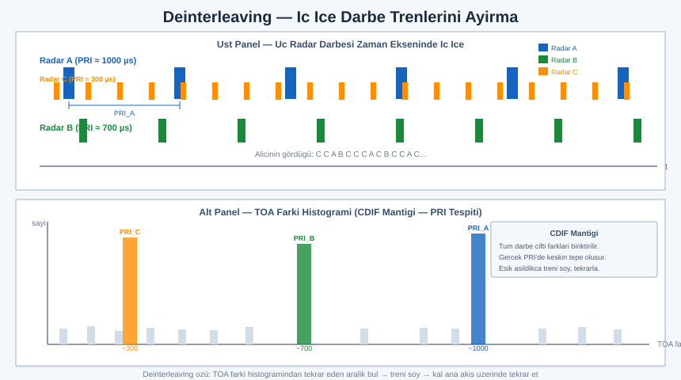
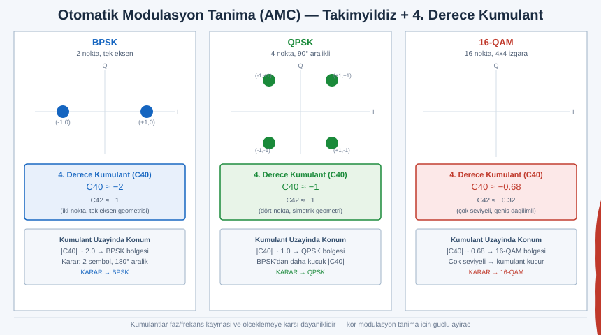
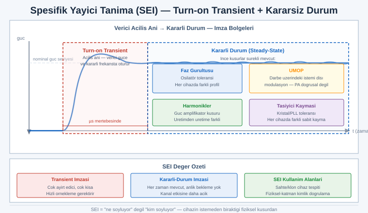

# SIGINT EL KİTABI — BÖLÜM 7: DİSİPLİNLER VE SİNYAL AYIKLAMA

## Yoğun Spektrumda Yayıcıyı Ayırmak — COMINT, ELINT, FISINT ve Otomatik Sınıflandırma

> Amaç: Önceki bölümler sinyalin fiziğini (Bölüm 1), donanımı (Bölüm 2), anteni (Bölüm 3), demodülasyonu (Bölüm 4) ve savunmayı (Bölüm 6) verdi. Bu bölüm, üzerlerine binen daha üst bir soruyu ele alır: kalabalık, üst üste binmiş, yüzlerce yayıcının aynı anda konuştuğu bir spektrumda, mühendis hangi sinyalin hangi cihaza ait olduğunu, ne tür bir sistem olduğunu ve aralarındaki ilişkiyi nasıl çözer? Bu, ham örnekten istihbarata giden zincirin en zor halkasıdır: ayıklama (sorting), ayırma (separation), sınıflandırma (classification) ve atıf (attribution). Hedefimiz operatör reçetesi değil, mühendislik sezgisi kazandırmaktır; bir analiz yazılımının ekranındaki kümeleri gördüğünde arkasındaki algoritmayı zihninde canlandırabilmen.

> Yasal çerçeve: Bu bölüm de serinin geri kalanı gibi anlama, savunma ve spektrum okuryazarlığı amaçlıdır. Anlatılan ayıklama/sınıflandırma teknikleri tasarım gereği pasif analiz yöntemleridir; hiçbir iletim, karıştırma veya yetkisiz içerik çözme önermez. Trafik analizi başlığı bilinçli olarak kendi telegram trafiğinin nasıl göründüğü üzerinden işlenir. Alıştırmalar yalnızca kendi cihazların ve yasal/açık sinyallerle sınırlıdır. Belirli bandların dinlenmesi, kaydı veya yayılması çoğu ülkede suçtur; kendi ülkenin ve sürümünün mevzuatını teyit et.

---

## İÇİNDEKİLER

1. [SIGINT'in Alt Disiplinleri: COMINT, ELINT, FISINT, MASINT İlişkisi](#1)
2. [İstihbarat Üretim Zinciri: TCPED (Ham Sinyalden İstihbarata)](#2)
3. [Sinyal Ayıklama Problemi: Yoğun Spektrumda Yayıcı Ayırma](#3)
4. [Parametre Uzayında Kümeleme: PDW ve Öznitelik Vektörü](#4)
5. [Radar/Darbeli Sinyal Analizi: PRI, PW, Tepe Gücü, Tarama](#5)
6. [PRI Türleri: Sabit, Stagger, Jitter, Dwell-Switch](#6)
7. [Deinterleaving: Üst Üste Binmiş Darbe Trenlerini Ayırma (CDIF/SDIF)](#7)
8. [Otomatik Modülasyon Tanıma (AMC): Öznitelik ve İstatistik Tabanlı](#8)
9. [Spesifik Yayıcı Tanıma (SEI) ve RF Parmak İzi](#9)
10. [Sinyal Veritabanları ve ELINT Parametre Kütüphaneleri](#10)
11. [Trafik Analizi: İçeriği Çözmeden Meta-Veriden İstihbarat](#11)
12. [LPI/LPD Sinyaller: Neden Ayıklaması Zordur](#12)
13. [Alıştırmalar (Yasal, Kendi Cihazların)](#13)
14. [Hızlı Referans ve Diğer Bölümler](#14)

---

<a id="1"></a>
## 1. SIGINT'in Alt Disiplinleri: COMINT, ELINT, FISINT, MASINT İlişkisi

Bölüm 1'de üç ana dalı kısaca tanıttık. Burada her birinin hedefini, yöntemini ve tipik sinyallerini mühendislik ayrıntısıyla açıyoruz; çünkü hangi disiplinde çalıştığını bilmek, kullanacağın ayıklama tekniğini belirler. COMINT'te hedef içerik ve trafik düzeniyken, ELINT'te hedef yayıcının kendisidir ve içerik çoğu zaman ya yoktur ya da ilgisizdir.

SIGINT (Signals Intelligence), elektromanyetik yayınlardan toplanan istihbaratın şemsiye terimidir. Altındaki ayrım, sinyalin amacına ve taşıdığı bilginin türüne göre yapılır.

| Disiplin | Açılım | Hedef | Tipik sinyaller | Çıkarılan istihbarat |
|---|---|---|---|---|
| COMINT | Communications Intelligence | İnsan veya sistemler arası haberleşme | Telsiz ses, mesaj trafiği, çağrı meta verisi, dijital ses (DMR/P25), uydu telefon | İçerik, kim-kiminle, ağ topolojisi, niyet |
| ELINT | Electronic Intelligence | Haberleşme olmayan elektronik yayınlar | Radar darbeleri, seyrüsefer işaretçileri (beacon), yükseklikölçer, IFF sorgulayıcı | Yayıcı tipi/modeli, yetenek, konuş, tehdit kütüphanesi |
| FISINT | Foreign Instrumentation Signals Intelligence | Yabancı araç/cihaz telemetri ve komut sinyalleşmesi | Roket/füze telemetrisi, uydu kontrol bağı (TT&C), test menzili veri bağları | Performans parametreleri, sistem davranışı, test sonuçları |

ELINT genellikle ikiye bölünür: TechELINT (sinyalin teknik parametrelerini çıkarma; sinyal kütüphanesi inşası) ve OpELINT (yayıcıların konuş, hareket ve faaliyet örüntüsünü izleme; durumsal farkındalık). Bu ayrım, aynı ham veriden iki farklı ürün üretildiğini gösterir: biri cihazı tanımlar, diğeri cihazın ne yaptığını izler.

```
                         SIGINT (şemsiye)
                               │
        ┌──────────────────────┼──────────────────────┐
        │                      │                      │
     COMINT                  ELINT                  FISINT
   (haberleşme)        (haberleşme-dışı)        (araç telemetri)
        │                      │                      │
   içerik + meta         yayıcı parametre        performans verisi
   ses/veri/mesaj        radar/beacon/IFF        TT&C / test bağı
        │                ┌─────┴─────┐                 │
        │            TechELINT    OpELINT              │
        │          (kütüphane)   (izleme)              │
        └──────────────────────┬──────────────────────┘
                               │
                        (üst düzey füzyon)
```

### SIGINT'in MASINT ile ilişkisi

MASINT (Measurement and Signature Intelligence — Ölçüm ve İmza İstihbaratı), SIGINT'ten ayrı bir disiplindir ama sınırda örtüşür. SIGINT, sinyalin taşıdığı bilgiyi (içerik veya parametre) çıkarmaya odaklanır; MASINT ise yayının fiziksel imzasını, yani ayırt edici ölçülebilir özelliklerini inceler. Aradaki çizgi her zaman keskin değildir.

Örneklemek gerekirse: bir radarın darbe tekrar aralığını ve frekansını çıkarıp "şu model radar" demek ELINT'tir. Aynı radarın yayınındaki kasıtsız modülasyonu (unintentional modulation on pulse, UMOP) ölçüp tek tek bireysel cihazı parmak iziyle ayırt etmek, ELINT ile MASINT'in örtüştüğü bölgedir. RF-MASINT alt başlığı tam olarak bu istem dışı, ince fiziksel imzaları (faz gürültüsü, harmonik yapı, anahtarlama geçişleri) konu alır. Mühendislik açısından sezgi şudur: ELINT "sinyal ne diyor ve hangi sistemden" sorusuyla, MASINT "bu yayıcı fiziksel olarak hangi parmak izini taşıyor" sorusuyla ilgilenir. Bölüm 9'daki spesifik yayıcı tanıma bu kesişimde durur.

Not: Disiplin sınırları kurumdan kuruma ve doktrinden doktrine farklı çizilir; yukarıdaki ayrım yaygın bir çerçevedir ancak resmî sınıflandırma için kaynaktan teyit edilmeli.

---

<a id="2"></a>
## 2. İstihbarat Üretim Zinciri: TCPED (Ham Sinyalden İstihbarata)

Bir sinyali yakalamak, istihbarat üretmenin yalnızca ortasındaki adımdır. Ham örnekten karar vericiye ulaşan raporlanmış bilgiye giden yol, standart bir döngüyle ifade edilir: TCPED. Bu kısaltma Tasking, Collection, Processing, Exploitation, Dissemination adımlarını birleştirir. Bazı doktrinlerde PED (Processing, Exploitation, Dissemination) ayrı bir alt küme olarak anılır; ön tarafa planlama ve yönlendirme eklenince TCPED elde edilir.

```
  ┌──────────┐   ┌────────────┐   ┌────────────┐   ┌──────────────┐   ┌────────────────┐
  │ TASKING  │──▶│ COLLECTION │──▶│ PROCESSING │──▶│ EXPLOITATION │──▶│ DISSEMINATION  │
  │ görev    │   │ toplama    │   │ işleme     │   │ değerlendirme│   │ dağıtım        │
  │ ihtiyaç  │   │ alıcı/anten│   │ demod/     │   │ analiz/      │   │ rapor/         │
  │ önceliği │   │ IQ kaydı   │   │ ayıklama   │   │ atıf/füzyon  │   │ uyarı          │
  └──────────┘   └────────────┘   └────────────┘   └──────────────┘   └────────────────┘
       ▲                                                                      │
       │                  geri besleme (yeni görevlendirme)                   │
       └──────────────────────────────────────────────────────────────────────┘
```

Sinyal bağlamında her adımın somut karşılığı:

| Adım | Sinyal karşılığı | Bu bölümle ilişkisi |
|---|---|---|
| Tasking | "Şu bandı, şu coğrafyayı, şu yayıcı tipini izle" — kaynak ve önceliğin tahsisi | Hangi parametre uzayına bakacağını belirler |
| Collection | Anten + alıcı ile RF'i yakalama, IQ akışı/kaydı üretme | Bölüm 2-3; ham veri burada doğar |
| Processing | Demodülasyon, darbe tanımlama, PDW üretimi, deinterleaving, modülasyon tanıma | Bu bölümün çekirdeği (3-8) |
| Exploitation | Yayıcı atfı, kütüphane eşleştirme, trafik analizi, füzyon, anlamlandırma | Bölüm 9-11 |
| Dissemination | Sınıflandırılmış rapor, tehdit uyarısı, durumsal resim güncellemesi | İstihbarat ürünü |

Mühendislik için kritik nokta şudur: ayıklama ve sınıflandırma (bu bölümün konusu) Processing ile Exploitation arasındaki köprüdür. Collection ne kadar iyi olursa olsun, üst üste binmiş bir spektrumu ayıklayamazsan Exploitation aşamasına temiz bir girdi veremezsin; tersine, ayıklama hatası tüm zinciri zehirler. "Çöp girer, çöp çıkar" ilkesi burada acımasız işler: yanlış ilişkilendirilmiş bir darbe treni, var olmayan bir yayıcı uydurabilir.

Pratikte zincir doğrusal değil döngüseldir. Exploitation'da fark edilen yeni bir yayıcı, geri besleme ile Tasking'i değiştirir (o yayıcıya odaklanılır). Bu yüzden okun ucundaki geri besleme bağı, kutuların kendisi kadar önemlidir.

---

<a id="3"></a>
## 3. Sinyal Ayıklama Problemi: Yoğun Spektrumda Yayıcı Ayırma

Gerçek bir RF ortamı sessiz ve düzenli değildir. Tipik bir yoğun spektrumda onlarca, bazen yüzlerce yayıcı aynı anda, üst üste binen frekanslarda ve zamanlarda yayın yapar. Alıcının gördüğü tek bir karışık akıştır; bu akışın içinden ayrı yayıcıları geri çıkarma problemine sinyal ayıklama (signal sorting) veya yayıcı ayırma (emitter separation) denir.

Problemi somutlaştırmak için darbeli (radar) dünyayı düşünelim, çünkü ayıklama literatürünün çoğu buradan doğmuştur. Üç farklı radar aynı anda yayın yapıyor olsun; alıcı bunların darbelerini zaman ekseninde geliş sırasına göre kaydeder. Sonuç, üç ayrı darbe treninin tek bir zaman çizgisinde iç içe geçmiş halidir:

```
 Radar A (PRI=1000 µs):  A           A           A           A
 Radar B (PRI= 700 µs):     B      B      B      B      B
 Radar C (PRI= 300 µs):  C  C  C  C  C  C  C  C  C  C  C  C  C

 Alıcının gördüğü (iç içe, zaman →):
 │A C  C B C  C A C B C  C C A B C  C C A ...
 └──────────────────────────────────────────► t
   (hangi darbe hangi yayıcıya ait? — ayıklama sorusu budur)
```

Alıcı, bu darbelerin geldiği anları görür ama üzerlerinde "ben A radarıyım" etiketi yoktur. Ayıklama, bu etiketsiz akışı tekrar üç tutarlı trene bölme işidir. İki tamamlayıcı yaklaşım vardır:

Birincisi, parametre uzayında ayrışma. Her darbe yalnızca bir zaman damgası değildir; aynı zamanda bir frekansı, bir darbe genişliği, bir geliş açısı ve bir genliği vardır. Farklı yayıcılar bu parametrelerde farklı değerlerde otururlar. Eğer A radarı 9,2 GHz'de, B 9,5 GHz'de, C 3,1 GHz'de yayıyorsa, sadece frekansa bakarak büyük ölçüde ayırırsın. Bu, Bölüm 4'teki kümelemenin işidir.

İkincisi, zaman örüntüsünden ayrışma. Bazen iki yayıcı parametre uzayında çok yakındır (aynı frekans bandı, benzer darbe genişliği). O zaman onları ayıran tek ipucu darbelerin zamansal ritmidir; her radarın kendine özgü bir tekrar aralığı (PRI) vardır. Üst üste binmiş trenleri yalnızca zamanlama düzeninden ayırma işine deinterleaving denir ve Bölüm 7'de ele alınır.

> Mühendislik sezgisi: Ayıklama, çok boyutlu bir kümeleme problemidir. Her sinyal (darbe ya da haberleşme yayını) çok boyutlu bir uzayda bir noktadır; aynı yayıcıya ait noktalar bu uzayda birbirine yakın yoğunlaşır, farklı yayıcılar ayrı bulutlar oluşturur. Ayıklama, bu bulutları bulmaktır. Zorluk üç yerden gelir: boyutların gürültülü olması (ölçüm hatası bulutları yayar), yayıcıların kasten parametre değiştirmesi (PRI jitter, frekans atlama — tek bir bulutu çok parçaya böler) ve bulutların örtüşmesi (iki yayıcı gerçekten aynı bölgede oturabilir).

Haberleşme (COMINT) tarafında problem biçim değiştirir ama özünde aynıdır: bir bandda onlarca kanal, frekans-zaman düzleminde ayrı ayrı belirir; her birini tespit etmek, merkez frekansını ve bant genişliğini kestirmek, başlangıç/bitiş zamanını işaretlemek ayıklamanın haberleşme karşılığıdır. Spektrumdaki her enerji adasını ayrı bir olay olarak yakalayıp parametrelendirmeye genel olarak energy detection ve ardından parameter estimation denir.

---

<a id="4"></a>
## 4. Parametre Uzayında Kümeleme: PDW ve Öznitelik Vektörü

Ayıklamanın temel veri yapısı, her sinyal olayını bir öznitelik vektörüne indirgemektir. Darbeli dünyada bu vektör neredeyse standartlaşmıştır ve adı PDW'dir: Pulse Descriptor Word (Darbe Tanımlayıcı Sözcük). Alıcının darbe tanımlama devresi (ya da yazılımı) her algıladığı darbe için bir PDW üretir.

| PDW alanı | Açılım | Ne anlatır | Yayıcı ayrımına katkısı |
|---|---|---|---|
| TOA | Time of Arrival | Darbenin geliş anı (zaman damgası) | PRI'yi buradan çıkarırız; deinterleaving'in hammaddesi |
| RF | Radio Frequency | Darbenin taşıyıcı frekansı | Farklı bandlardaki yayıcıları ayırır |
| PW | Pulse Width | Darbe süresi | Yayıcı tipini daraltır (kısa darbe ≠ uzun darbe sistemi) |
| PA | Pulse Amplitude | Darbe genliği/gücü | Mesafe/güç ipucu; aynı yayıcı içinde tutarlılık |
| AOA / DOA | Angle/Direction of Arrival | Geliş açısı | En güçlü ayraçlardan biri (uzamsal ayrım) |

Geliş açısı (AOA), ayıklamanın en değerli boyutudur, çünkü bir yayıcı parametrelerini değiştirebilir (frekans atlar, PRI titretir) ama coğrafi konumunu bir darbeden diğerine ışık hızıyla değiştiremez. Dolayısıyla AOA, kasten değişen parametrelerin aksine kararlı bir ayraçtır. AOA ölçümü Bölüm 3'teki yön bulma (DF) tekniklerine dayanır; çok antenli dizilerde faz farkından açı çıkarılır.

Haberleşme tarafında öznitelik vektörü farklı alanlar içerir ama mantık aynıdır: merkez frekans, bant genişliği, sembol hızı, modülasyon tipi, yayın süresi, çevrimsel öznitelikler. Her iki dünyada da fikir, sürekli RF akışını ayrık, etiketlenebilir, kümelenebilir olaylara çevirmektir.

### Kümeleme: noktaları bulutlara ayırmak

Elimizde her biri bir öznitelik vektörü olan bir nokta yığını var. Aynı yayıcıya ait noktalar parametre uzayında bir bulut oluşturur. İki boyutlu (RF ve PW) basit bir örnekle sezgiyi kuralım:

```
 PW (darbe genişliği, µs)
  ▲
 5│                                  ┌───────┐
  │                                  │ ● ● ● │  Yayıcı Z
 4│                                  │ ● ● ● │  (RF~9.5GHz, PW~4µs)
  │                                  └───────┘
 3│         ┌───────┐
  │         │ ▲ ▲ ▲ │  Yayıcı Y
 2│         │ ▲ ▲▲▲ │  (RF~9.2GHz, PW~2µs)
  │         └───────┘
 1│  ┌─────┐
  │  │■ ■ ■│  Yayıcı X
 0│  │■ ■■ │  (RF~3.1GHz, PW~1µs)
  └──┴─────┴──────────┴───────────────┴────────► RF (GHz)
     3.1       9.2          9.5
```

Bu basit örnekte üç ayrı yayıcı, parametre uzayında üç ayrı bulut olarak kendiliğinden ayrışır; gözle bile çizebilirsin. Gerçekte boyut sayısı beştir (RF, PW, PA, AOA ve dolaylı olarak PRI) ve gözle göremezsin; algoritma kümeler. Kullanılan kümeleme yaklaşımları:

Yoğunluk tabanlı kümeleme (örneğin DBSCAN mantığı), bulutları yoğun bölgeler olarak bulur ve aralarındaki seyrek bölgeleri sınır kabul eder. Bunun avantajı, küme sayısını önceden bilmek gerektirmemesi ve gürültü darbelerini (yoğun hiçbir buluta düşmeyen tekil noktaları) doğal olarak ayıklamasıdır. Yayıcı sayısının önceden bilinmediği ELINT senaryosunda bu önemlidir.

Histogram/ızgara tabanlı kümeleme, parametre eksenlerini hücrelere böler ve dolu hücreleri sayar; tepe noktaları yayıcı adaylarıdır. Hesaplaması ucuzdur, gerçek zamanlı donanımda yaygındır.

> Pratikte: Önce ucuz ve kararlı boyutlardan (RF, AOA) kaba bir ön ayıklama yapılır; bu, akışı yönetilebilir alt-kümelere böler. Ardından her alt-küme içinde zaman örüntüsü (PRI) analizi ile ince ayrım (deinterleaving) yapılır. Bu iki aşamalı strateji, milyonlarca darbe/saniye gelen yoğun ortamda hesabı ayakta tutar; tek hamlede beş boyutlu kümeleme çoğu zaman ne gerekli ne de pratiktir.

---

<a id="5"></a>
## 5. Radar/Darbeli Sinyal Analizi: PRI, PW, Tepe Gücü, Tarama

ELINT'in kalbi darbeli sinyal analizidir. Bir radar, kısa enerji darbeleri yayar ve yankıları dinler; bizim açımızdan bu darbe treni, radarın parmak izini taşır. Darbe trenini tanımlayan temel büyüklükler şunlardır.

```
 Genlik
   ▲
   │  ┌──┐         ┌──┐         ┌──┐         ┌──┐
   │  │  │         │  │         │  │         │  │
   │  │  │         │  │         │  │         │  │
 0 ┼──┘  └─────────┘  └─────────┘  └─────────┘  └────────► t
      │PW│
      │◄─┤
      │◄──── PRI ────►│
      (bir darbeden sonrakine = darbe tekrar aralığı)
```

Darbe genişliği (PW, Pulse Width): Tek bir darbenin süresi. Radarın menzil çözünürlüğü ve enerji bütçesiyle ilişkilidir; kısa darbe ince çözünürlük, uzun darbe daha çok enerji (ve sıkıştırma gerekirse darbe sıkıştırma) demektir. Tipik değerler nanosaniyelerden onlarca mikrosaniyeye uzanır.

Darbe tekrar aralığı (PRI, Pulse Repetition Interval): Bir darbenin başlangıcından sonrakinin başlangıcına kadar geçen süre. Tersi, darbe tekrar frekansıdır (PRF = 1/PRI). PRI, radar tipini ayırt etmede en güçlü tek parametredir ve aşağıdaki bölümde göreceğimiz gibi kasten karmaşık desenler taşıyabilir.

| Büyüklük | Sembol | İlişki | Tipik aralık | Ne ele verir |
|---|---|---|---|---|
| Darbe genişliği | PW | süre | ns – onlarca µs | Menzil çözünürlüğü, sistem sınıfı |
| Darbe tekrar aralığı | PRI | T | onlarca µs – ms | Radar tipi, fonksiyon (arama/izleme) |
| Darbe tekrar frekansı | PRF | 1/PRI | yüzlerce Hz – yüzbinlerce Hz | Belirsiz menzil/hız tasarımı |
| Görev döngüsü | — | PW/PRI | binde birler | Ortalama güç, tespit kolaylığı |
| Tepe gücü | — | — | W – MW | Menzil, alıcıda görünürlük |

Tepe gücü (peak power), darbe anındaki ani güçtür ve radarın menzilini belirler; ortalama güç ise tepe gücü çarpı görev döngüsüdür (PW/PRI). Bir radar düşük ortalama güçle yüksek tepe gücü kullanarak hem menzile ulaşır hem de tespit edilebilirliğini bir ölçüde düşürür.

### Anten tarama tipi

Radarın anteni uzayı belirli bir desenle tarar; alıcıda bu, darbe genliğinin zamanla yükselip alçalması olarak görünür. Anten hüzmesi bizden geçerken sinyal güçlenir, uzaklaşırken zayıflar. Bu genlik zarfı, tarama tipinin imzasıdır.

```
 Dairesel tarama (anten sabit hızla döner):
 PA ▲      ╱╲              ╱╲              ╱╲
    │     ╱  ╲            ╱  ╲            ╱  ╲      (hüzme her geçişte
    │    ╱    ╲          ╱    ╲          ╱    ╲      tepe yapar; tepeler
  0 ┼───╱──────╲────────╱──────╲────────╱──────╲──►  arası = tarama periyodu)
    │  geçiş 1            geçiş 2          geçiş 3

 Sektör/raster tarama: ileri-geri süpürme, tepe deseni asimetrik/düzensiz
 Konik tarama (izleme): hedef etrafında küçük dairesel modülasyon (eski izleyiciler)
 Elektronik tarama (faz dizisi): hüzme atlamalı, mekanik dönüş yok → düzensiz/çevik
```

Tarama periyodunu (iki tepe arası süre) ölçmek, radarın işlevini daraltır: yavaş dairesel tarama tipik bir gözetleme/arama radarı, hızlı konik veya kilit deseni bir izleme/atış kontrol radarı önerir. Modern faz dizili radarlarda mekanik dönüş olmadığından genlik deseni çok daha düzensizdir; bu düzensizliğin kendisi de bir ipucudur.

> Mühendislik sezgisi: Bir darbeli sinyalden çıkardığın parametre demeti (RF, PW, PRI, tarama periyodu, polarizasyon) birlikte bir parmak izi oluşturur ve ELINT kütüphanesinde (Bölüm 10) bir kayıtla eşleştirilir. Hiçbiri tek başına kesin değildir; ayırt edici güç, parametrelerin birlikte oluşturduğu örüntüdedir. İki radar aynı frekansta yayabilir ama PRI deseni ve tarama hızı farklıysa, ayrı kayıtlardır.

---

<a id="6"></a>
## 6. PRI Türleri: Sabit, Stagger, Jitter, Dwell-Switch

PRI'nin sabit olduğunu varsaymak yeni başlayanın tuzağıdır. Modern radarlar, menzil/hız belirsizliğini çözmek, karıştırmaya direnmek ve tespiti zorlaştırmak için PRI'yi kasten değiştirir. Deinterleaving algoritmaları (Bölüm 7) tam olarak bu çeşitliliği hesaba katmak zorunda olduğundan, PRI türlerini ayırt etmek şarttır.

| PRI türü | Davranış | Amaç | Deinterleaving etkisi |
|---|---|---|---|
| Sabit (stable/constant) | PRI sabittir | Basit, eski sistemler | En kolay; tek bir tekrar aralığı |
| Stagger | Birkaç sabit değer döngüsel sırayla | Kör menzil/hız boşluklarını doldurma | Çok-değerli ama deterministik desen |
| Jitter | PRI bir ortalama etrafında rastgele dalgalanır | Karıştırmaya direnç, tahmin önleme | Histogram bulanıklaşır; en zoru |
| Dwell-switch | Belirli süre bir PRI, sonra başka bir PRI bloğu | Çok-mod çalışma (ara/izle geçişi) | Blok sınırlarını yakalamak gerekir |
| Sliding/wobble | PRI sürekli yavaşça artar/azalar (tarama) | Belirli tarama fonksiyonları | Kayan desen; özel modelleme |

```
 Sabit PRI:      |    |    |    |    |    |        (eşit aralık)
                 ◄─T─►

 Stagger (3'lü): |  |    |      |  |    |      |   (T1,T2,T3,T1,T2,T3,...)
                 ◄T1►◄─T2─►◄─T3──►

 Jitter:         |   |  |     | |   |    | |       (T rastgele dalgalı)
                 ◄T±Δ rastgele►

 Dwell-switch:   | | | | |        |      |      |  (bir blok sık, sonra seyrek)
                 ◄ mod A (kısa T) ►◄ mod B (uzun T) ►
```

Stagger ile jitter arasındaki ayrım kritiktir ve sıkça karıştırılır. Stagger deterministiktir: PRI birkaç sabit değer arasında belirli bir sırayla döner; desen tekrar eder, dolayısıyla histogramda birden çok keskin tepe verir ve çözülebilir. Jitter rastgeledir: PRI bir ortalama etrafında öngörülemez biçimde dalgalanır; histogramda keskin tepe yerine bir yayılma (dağılım) görürsün. Jitter, tam olarak deinterleaving'i zorlaştırmak için tasarlandığından, ayıklama algoritmalarının en çok terlediği yerdir.

Pratik bir ölçüm refleksi: Bir darbe treninin ardışık TOA farklarını (delta-TOA) alıp histogramını çıkardığında, sabit PRI tek keskin tepe, stagger birkaç keskin tepe, jitter geniş bir tümsek verir. Bu histogramın şekli, hangi PRI türüyle uğraştığını daha analiz başlamadan söyler.

---

<a id="7"></a>
## 7. Deinterleaving: Üst Üste Binmiş Darbe Trenlerini Ayırma (CDIF/SDIF)



Deinterleaving, iç içe geçmiş darbe trenlerini yalnızca zamanlama bilgisinden ayırma işidir. Bölüm 4'teki parametre kümelemesi akışı kaba alt-kümelere böldükten sonra, her alt-küme içinde hâlâ birden çok yayıcı olabilir (aynı frekans/açıda iki radar). Onları ayıran tek şey zamansal ritimleridir; deinterleaving bu ritimleri bulur.

### Temel fikir: PRI'yi histogramdan bulmak

Bir tek yayıcının darbeleri düzenli aralıklarla gelir. Eğer akıştaki her darbe çiftinin geliş zamanı farkını (TOA farkı) hesaplayıp bir histogram yaparsak, gerçek PRI değerinde belirgin bir tepe oluşur, çünkü o aralık tekrar tekrar görünür. Birden çok yayıcı varsa, her birinin PRI'sinde ayrı tepeler beliririr. Sorun, yanlış (rastgele) farkların da histogramı kirletmesidir; algoritmaların farkı bu kiri ayıklama biçimindedir.

```
 TOA farkı histogramı (tek yayıcı, sabit PRI):

 sayım ▲
       │                    ████  ← gerçek PRI (keskin tepe)
       │                    ████
       │   ░░  ░░  ░░  ░░    ████   ░░  ░░     (rastgele/yanlış farklar = taban)
       └───┴───┴───┴───┴────┴──┴───┴───┴──► TOA farkı (µs)
                            PRI
```

### CDIF — Cumulative Difference (Kümülatif Fark) mantığı

CDIF yaklaşımı, yalnızca ardışık darbeler arası farkları değil, belirli bir gecikme katına kadar tüm darbe çiftlerinin farklarını biriktirir. Fikir şudur: gerçek bir PRI sadece T'de değil, 2T, 3T gibi katlarında da tepe verir (her ikinci, her üçüncü darbe de düzenli aralıklıdır). CDIF bu harmonik tepeleri biriktirerek gerçek PRI'yi gürültüden ayırır; tek katlı (yalnızca ardışık) fark almaya göre daha gürbüzdür, çünkü kayıp darbeler (alıcının kaçırdığı darbeler) tek katı bozsa bile üst katlar hayatta kalır.

CDIF, aday bir PRI değerinde tepe bulduğunda, o PRI ile tutarlı darbeleri akıştan çıkarır (bir tren oluşturup ayırır), kalan akış üzerinde işlemi tekrarlar. Bu ardışık çıkarma, yayıcıları teker teker soyar.

### SDIF — Sequential Difference (Ardışık Fark) mantığı

SDIF, CDIF'in bir iyileştirmesi olarak gelişmiştir. Tüm gecikme katlarını birden biriktirmek yerine, SDIF gecikme seviyelerini sıralı işler: önce birinci dereceden farklar (ardışık darbeler), tepe yeterince belirginse o seviyede karar verir; değilse ikinci dereceye geçer, ve böyle devam eder. Her seviyede uyarlanabilir bir eşik (detection threshold) kullanır; tepe bu eşiği aşıyorsa gerçek PRI ilan edilir. Bu sıralı strateji, CDIF'e göre genelde daha az hesapla ve daha az yanlış PRI ilanıyla sonuca varır.

```
 SDIF akışı (kavramsal):

 [TOA dizisi]
      │
      ▼
 1. seviye fark histogramı ──► eşik aşıldı mı? ──evet──► PRI bulundu, treni ayır
      │ hayır                                              │
      ▼                                                    ▼
 2. seviye fark histogramı ──► eşik aşıldı mı? ──evet──► kalan akışta tekrarla
      │ hayır                                              │
      ▼                                                    │
 ... seviyeyi artır ...                                    │
      └──────────────────── tüm yayıcılar ayrılana dek ◄───┘
```

Her iki yöntemin de ortak iskeleti: (1) TOA farklarından bir histogram kur, (2) gerçek PRI tepelerini eşikle ayıkla, (3) bulunan PRI ile tutarlı darbeleri sıralama-deinterleave ederek ayır (sequence search; bulunan PRI'yle başlayıp tutarlı darbeleri zincirle), (4) kalan akış üzerinde tekrarla. Jitter ve eksik darbeler bu iskeleti zorlar; bu yüzden modern sistemler histogram yöntemini örüntü tabanlı ve istatistiksel yaklaşımlarla, giderek de öğrenme tabanlı yöntemlerle destekler.

> Uyarı: CDIF ve SDIF'in tam algoritmik ayrıntıları (eşik fonksiyonları, sequence search ölçütleri) literatürde belirli makalelere dayanır ve uygulamadan uygulamaya değişir; buradaki anlatım kavramsal mantığı verir, kesin uygulama parametreleri için kaynaktan teyit edilmeli. Sezgi düzeyinde akılda kalması gereken: deinterleaving = TOA farklarının histogramından tekrar eden aralıkları bulup teker teker soymak.

---

<a id="8"></a>
## 8. Otomatik Modülasyon Tanıma (AMC): Öznitelik ve İstatistik Tabanlı



Haberleşme (COMINT) ayıklamasında, bir sinyali yakaladıktan sonraki ilk soru "bu hangi modülasyon?" sorusudur. Bölüm 1 ve 4 modülasyon türlerini tanıttı; burada bir makinenin etiket olmadan, kör biçimde modülasyonu nasıl çıkardığına bakıyoruz. Buna Otomatik Modülasyon Tanıma (AMC, Automatic Modulation Classification) denir. İki büyük aile vardır.

Karar-teorik (likelihood-based) yaklaşım, her olası modülasyon için bir olasılık modeli kurar ve gözlenen IQ örneklerinin hangi modeli en olası kıldığını hesaplar. Teorik olarak optimaldir (en düşük hata) ama kanal parametrelerini (faz, frekans kayması, gürültü gücü) bilmeyi ya da kestirmeyi gerektirir ve hesabı ağırdır. Pratikte daha çok öznitelik tabanlı yaklaşım kullanılır.

Öznitelik-tabanlı (feature-based) yaklaşım, IQ akışından modülasyonu ayırt eden istatistiksel öznitelikler çıkarır ve bir sınıflandırıcıyla karar verir. Bu yaklaşım kanal bilgisi gerektirmeden çalışabilir ve gerçek sistemlerin çoğu buna dayanır. Başlıca öznitelik aileleri:

### Yüksek dereceli istatistikler: kümülantlar

Bir sinyalin yalnızca ortalama ve varyansı (ikinci derece) modülasyonu ayırt etmeye yetmez. Yüksek dereceli kümülantlar (dördüncü, altıncı derece) takımyıldızın şeklini sayısal olarak yakalar. Örneğin BPSK, QPSK ve QAM ailelerinin dördüncü derece kümülantları belirgin biçimde farklıdır; çünkü takımyıldız geometrileri farklıdır. Kümülantların güzelliği, faz/frekans kaymasına ve ölçeklemeye karşı (uygun normalizasyonla) görece dayanıklı olmalarıdır, dolayısıyla kör tanımada güçlü ayraçtırlar.

```
 Takımyıldız geometrisi → kümülant imzası

 BPSK (2 nokta, tek eksen)     →  C40, C42 değerleri bir bölgede
   ●───────●
                                  QPSK (4 nokta, simetrik)    →  başka bölge
 QPSK            16-QAM (4×4)      16-QAM (çok seviye)        →  başka bölge
   ●   ●         ● ● ● ●
                 ● ● ● ●           Karar: kümülant uzayında hangi
   ●   ●         ● ● ● ●           bölgeye düştüğüne bakılır
                 ● ● ● ●
```

### Spektral öznitelikler

Sinyalin frekans alanı yapısı modülasyon hakkında çok şey söyler. Anlık genlik, anlık faz ve anlık frekansın istatistikleri (örneğin anlık genliğin normalize edilmiş merkezi mutlak momentleri) klasik öznitelikleri oluşturur. Sezgisel örnek: FSK'de anlık frekans iki (veya daha çok) ayrık seviye arasında gezer; OOK/ASK'de anlık genlik açık/kapalı arasında sıçrar; PSK'de genlik sabitken faz basamaklanır. Bu "neyin sabit, neyin değişken" olduğu, modülasyon ailesini doğrudan daraltır.

### Çevrimsel durağanlık (cyclostationarity)

Modüle edilmiş sinyaller saf gürültüden farklı olarak gizli periyodiklikler taşır: sembol hızı, taşıyıcı frekansı ve bunların katları, sinyalin istatistiklerinde periyodik bir yapı yaratır. Bu yapıyı ortaya çıkaran araç spektral korelasyon fonksiyonu (SCF) ve onun görseli spektral korelasyon yoğunluğudur; çevrim frekansı (cyclic frequency) ekseninde, sinyalin sembol hızına ve taşıyıcısına karşılık gelen yerlerde tepeler belirir. Gürültü çevrimsel durağan değildir (bu tepeleri vermez), dolayısıyla çevrimsel öznitelikler düşük SNR'da bile sinyali gürültüden ve farklı modülasyonları birbirinden ayırmada güçlüdür. Bedeli yüksek hesaptır.

> Mühendislik sezgisi: Çevrimsel durağanlık, "sinyalin saklı ritmini" dinlemektir. İçerik rastgele görünse bile, modülasyonun kendisi (sembollerin saat tıkırtısı, taşıyıcının dönüşü) silinmez bir periyodik imza bırakır. Bu imza hem modülasyonu tanır hem sembol hızını verir hem de iki üst üste binmiş sinyali farklı çevrim frekanslarından ayırabilir.

### Makine öğrenmesi yaklaşımı

Son dönemde AMC, elle tasarlanmış özniteliklerden öğrenilen özniteliklere kaymıştır. İki çatı vardır. Birincisi, yukarıdaki klasik öznitelikleri (kümülantlar, spektral momentler, çevrimsel öznitelikler) bir öznitelik vektörüne koyup geleneksel bir sınıflandırıcı (karar ağacı, destek vektör makinesi, rastgele orman) ile eğitmektir; yorumlanabilir ve veri-az rejimde sağlamdır. İkincisi, ham IQ örneklerini (ya da onların zaman-frekans görüntüsünü/spektrogramını) doğrudan bir derin sinir ağına (örneğin evrişimli ağlar) vermek ve ağın özniteliği kendi öğrenmesidir; bol etiketli veri varsa güçlüdür ama veri kalitesine ve dağılım kaymasına duyarlıdır.

| Yaklaşım | Girdi | Güçlü yanı | Zayıf yanı |
|---|---|---|---|
| Likelihood-based | IQ + kanal modeli | Teorik optimum | Kanal bilgisi gerektirir, ağır |
| Öznitelik + klasik ML | Kümülant/spektral/çevrimsel | Yorumlanabilir, veri-az | Öznitelik tasarımı uzmanlık ister |
| Derin öğrenme (IQ/spektrogram) | Ham IQ ya da görüntü | Öznitelik öğrenir, yüksek doğruluk | Bol veri, dağılım kaymasına hassas |

Pratik bir uyarı: yayınlanmış AMC doğrulukları çoğunlukla belirli bir veri kümesi ve SNR aralığı için geçerlidir; gerçek dünyadaki kanal etkileri (çok-yol, donanım kusurları, görülmemiş modülasyonlar) performansı düşürür. Sayısal doğruluk iddiaları için ilgili veri kümesi ve koşullar kaynaktan teyit edilmeli.

---

<a id="9"></a>
## 9. Spesifik Yayıcı Tanıma (SEI) ve RF Parmak İzi



Şimdiye kadar yayıcı tipini (hangi model radar, hangi modülasyon) çıkarmaya odaklandık. Bir adım daha ileri gidip aynı modelin iki ayrı fiziksel cihazını birbirinden ayırmak, Spesifik Yayıcı Tanıma'dır (SEI, Specific Emitter Identification). Halk dilindeki karşılığı RF parmak izi (RF fingerprinting). Bu, Bölüm 1'de değindiğimiz ELINT-MASINT kesişiminde durur.

### Neden mümkün? Üretim kusurları

İki cihaz aynı tasarımdan, aynı fabrikadan çıksa bile, analog bileşenleri (osilatör, güç yükselteci, karıştırıcı, filtreler) üretim toleransları nedeniyle birbirinin tıpatıp aynısı değildir. Bu minik farklar, cihazın yaydığı sinyale silinmez ve istem dışı izler bırakır: taşıyıcı frekansında küçük bir kayma, faz gürültüsü profilinde fark, güç yükseltecinin doğrusalsızlık imzası, harmoniklerin tam seviyesi. Tasarımcı bu farkları istemez (kusurdur) ama tam da bu istenmeyen kusurlar, bireysel cihazı ele verir.

| Öznitelik kaynağı | İmza | Neden cihaza özgü |
|---|---|---|
| Osilatör | Taşıyıcı kayması, faz gürültüsü | Kristal/PLL toleransı her parçada farklı |
| Güç yükselteci (PA) | Doğrusalsızlık, harmonik/intermodülasyon | Yarı iletken karakteristiği tam eşlenmez |
| Anahtarlama/yükselme | Turn-on transient şekli | Devre zamanlaması ve geçici tepki farkı |
| Filtre/devre | Spektral şekil sapmaları | Bileşen değerleri toleransı |

### İki öznitelik sınıfı: geçici ve kararlı-durum

Geçici (transient) öznitelikler, vericinin açıldığı ilk anlarda (turn-on transient) ortaya çıkar. Verici tam güce ve kararlı frekansa otururken geçen kısa süre, devrenin geçici tepkisiyle şekillenir ve cihaza çok özgüdür; adeta cihazın "imza atışıdır". Avantajı yüksek ayırt ediciliktir; dezavantajı çok kısa sürmesi (yakalamak için hızlı, yüksek örnekleme ve iyi tetikleme gerekir) ve sinyalin başlangıcını kaçırırsan elde edilememesidir.

Kararlı-durum (steady-state) öznitelikleri, verici yerleştikten sonra sürekli yayında bulunan ince kusurlardan çıkarılır: faz gürültüsü spektrumu, harmonik yapı, doğrusalsızlık ürünleri, darbe üzerindeki kasıtsız modülasyon (UMOP). Avantajı her zaman mevcut olmalarıdır (geçici anı beklemek gerekmez); dezavantajı geçicilere göre genelde daha az ayırt edici ve kanal etkilerine daha açık olmalarıdır.

```
 Verici açılışı:
 güç ▲        ┌──── kararlı durum ────────────────────
     │       ╱  ← turn-on transient (kısa, çok ayırt edici)
     │      ╱      faz/frekans oturana dek geçici tepki
     │     ╱
   0 ┼────╱─────────────────────────────────────────► t
     │ kapalı│ geçici │        sürekli yayın
              ◄ µs ►   ◄────── ms ve ötesi ──────►
              SEI burada           SEI burada da
              (transient)          (steady-state: faz gürültüsü,
                                    harmonik, UMOP)
```

### Savunma ve atıf değeri

SEI'nin savunma perspektifindeki değeri iki yönlüdür. Birincisi atıf: bir yayını belirli bir fiziksel cihaza bağlamak, "bu sinyal daha önce gördüğümüz X cihazıyla aynı" demeyi sağlar; cihaz yerini ya da kimliğini değiştirse bile RF parmak izi onu izleyebilir. İkincisi sahtecilik tespiti: bir saldırgan meşru bir cihazın kimliğini taklit etmeye çalışsa (örneğin aynı protokol kimliğini yayınlasa) bile, donanım parmak izini taklit etmek çok daha zordur; SEI, protokol-katmanı kimlik doğrulamanın altında fiziksel-katman bir doğrulama sağlar. IoT ve kablosuz güvenlikte RF parmak izi, klonlanmış/sahte cihazları yakalamak için araştırılan bir savunma katmanıdır.

> Uyarı: SEI güvenilirliği donanıma, sıcaklığa, yaşlanmaya ve kanala bağlı olarak değişir; aynı cihazın parmak izi zamanla ve koşulla kayabilir (öznitelik kararlılığı sorunu). Operasyonel güvenilirlik iddiaları ortama özgüdür ve kaynaktan teyit edilmeli. Mühendislik sezgisi olarak akılda tutulması gereken: SEI, "ne söylüyor" değil "kim söylüyor"u, hem de cihazın istemeden bıraktığı fiziksel kusurdan çıkarır.

---

<a id="10"></a>
## 10. Sinyal Veritabanları ve ELINT Parametre Kütüphaneleri

Ayıklama ve sınıflandırma, boşlukta yapılmaz; çıkardığın parametreleri bir referansla karşılaştırırsın. Bu referanslar iki düzeyde bulunur: açık topluluk veritabanları ve kurumsal ELINT parametre kütüphaneleri.

### Açık referanslar

Spektrumu öğrenen herkesin yararlandığı açık kaynaklar vardır. En bilineni sigidwiki (Signal Identification Wiki) gibi topluluk tabanlı sinyal kimlik veritabanlarıdır; bir sinyalin sesini, waterfall görüntüsünü, frekans bandını ve bilinen modülasyon/protokol bilgisini eşleştirmeye yarar. Bir analist bilinmeyen bir sinyalin waterfall şeklini ve sesini bu tür bir referansla karşılaştırarak hızlı bir ön tanı koyabilir. Bu kaynaklar eğitim ve açık spektrum okuryazarlığı için paha biçilmezdir; içerikleri topluluk katkısıyla oluştuğundan doğruluğu kayıttan kayda değişebilir, kritik kullanımda teyit gerekir.

Bunun yanında frekans tahsis tabloları (ulusal/uluslararası spektrum planları) bir frekansın hangi servise ayrıldığını söyler; bir sinyali "bu bandda ne bulunması beklenir" bağlamına oturtur. Bölüm 1'deki ITU band tablosu bu mantığın kaba halidir.

### ELINT parametre kütüphaneleri kavramı

Kurumsal tarafta, TechELINT'in ürünü bir ELINT parametre kütüphanesidir (kavramsal olarak): her bilinen yayıcı için bir kayıt tutulur ve kayıt, o yayıcının ölçülmüş parametre aralıklarını içerir.

| Kütüphane alanı | İçerik | Ayırt edici rol |
|---|---|---|
| RF aralığı | Yayıcının çalıştığı frekans bandı | Kaba ön filtre |
| PRI tipi ve değerleri | Sabit/stagger/jitter ve aralıkları | Güçlü ayraç |
| PW aralığı | Darbe genişliği aralığı | Sistem sınıfı |
| Tarama tipi/periyodu | Anten tarama imzası | Fonksiyon (arama/izleme) |
| Modülasyon/içsel yapı | Darbe içi modülasyon, polarizasyon | İnce ayrım |
| Platform/ilişkilendirme | Hangi sistem/platformla anılır | İstihbarat bağlamı |

Eşleştirme mantığı şudur: bir yayıcıdan ölçülen parametre demeti, kütüphanedeki kayıtların parametre aralıklarıyla karşılaştırılır; tüm boyutlarda uyumlu kayıt(lar) aday tip olarak işaretlenir. Tek bir parametre nadiren yeter; ayırt edici güç, parametrelerin birlikte oluşturduğu kalıbın bir kayıtla örtüşmesindedir. Hiçbir kayda uymayan bir parametre demeti, yeni/bilinmeyen bir yayıcı işaretler ve kütüphaneye yeni kayıt önerisi doğurur (geri besleme; Bölüm 2'deki döngü).

> Not: Operasyonel ELINT kütüphanelerinin somut içeriği ve formatı sınıflandırılmıştır; buradaki anlatım kamuya açık kavramsal çerçevedir. Mühendislik sezgisi düzeyinde mesele şudur: sınıflandırma = ölçülen parametre vektörünü referans bir veritabanındaki kayıtlarla eşleştirmek; eşleşme yoksa yeni kayıt.

---

<a id="11"></a>
## 11. Trafik Analizi: İçeriği Çözmeden Meta-Veriden İstihbarat

COMINT'in en güçlü ve en az sezgisel yanı, içeriği hiç çözmeden yalnızca meta-veriden istihbarat üretebilmesidir. Buna trafik analizi denir. İçerik şifreli ve okunamaz olsa bile, kimin kiminle, ne zaman, ne sıklıkla ve ne kadar haberleştiği başlı başına bilgidir. Tarihsel olarak trafik analizi, içerik kırılamayan dönemlerde dahi yüksek değerli istihbarat üretmiştir.

### Meta-veriden çıkarılan boyutlar

| Meta-veri | Sorduğu soru | Çıkarılan istihbarat |
|---|---|---|
| Kim → kim | Hangi düğümler haberleşiyor | Ağ topolojisi, ilişki haritası |
| Ne zaman | Yayın anları/saatleri | Faaliyet ritmi, operasyon tempo |
| Ne kadar | Mesaj/oturum süresi, hacim | Olayın büyüklüğü, önem |
| Ne sıklıkla | Çağrı/yayın düzeni | Rutin vs anormallik tespiti |
| Hacim değişimi | Trafiğin ani artış/sessizliği | Yaklaşan olay göstergesi |

Üç klasik çıkarım tekniği özellikle güçlüdür. Birincisi ağ topolojisi çıkarımı: kim-kiminle bağlantısından bir graf kurulur; merkezi düğümler (çok bağlantılı) komuta noktalarını, yaprak düğümler uç birimleri önerir. İkincisi çağrı düzeni analizi: düzenli, saat başı bir yoklama trafiği bir rutini; bu rutinin aniden bozulması ya da yoğunlaşması bir olayı işaret eder. Üçüncüsü trafik hacmi göstergesi: içerik okunmadan, yalnızca trafiğin ani yükselmesi yaklaşan bir faaliyetin habercisi olabilir; tam tersine ani bir radyo sessizliği de (kasıtlı sessizlik) bir hazırlık işareti olabilir.

```
 Ağ topolojisi çıkarımı (kim-kiminle grafı):

           ┌────────────── D
           │               │
    A ──────┤               │
           │      MERKEZ    │      A,B,C → MERKEZ'e bağlı (uç birimler)
    B ──────┼──── (E) ──────┤      D → MERKEZ'e bağlı
           │       │       │      E = en çok bağlantılı = komuta düğümü
    C ──────┘       │       └────── F   (içerik okunmadan, sadece
                    └─────────────── G    kim-kiminle'den çıkarıldı)
```

### Kanije'nin telegram trafiğine kısa bir bakış

Bu kavramı yabancı bir hedef üzerinden değil, kendi sistemin üzerinden düşünmek öğreticidir. Kanije Kalesi, komut/bildirim için Telegram bot trafiği kullanır (uzun-poll long-polling, periyodik bildirimler, komut yanıtları). İçerik TLS ile şifreli olsa bile, bir trafik analisti yalnızca meta-veriden şunları görebilir: cihazın belirli bir bot uç noktasıyla düzenli aralıklarla konuştuğu (long-poll'un kendi ritmi bir imzadır), bir olay anında (örneğin bir uyarı tetiklendiğinde) trafiğin ani yükseldiği, ve cihazın çevrimiçi/çevrimdışı olduğu zaman pencereleri. Yani şifreleme içeriği korur ama varlık, ritim ve olay-korelasyonu meta-veriden sızar.

Savunma sezgisi: Bu, kendi sisteminin OPSEC yüzeyini anlamak için somut bir derstir. Şifreleme gerekli ama yeterli değildir; trafiğin zamanlama deseni ve hacim profili de bir imzadır. Bunu azaltmanın yolları (sabit aralıklı sahte trafik/padding, jitter ekleme, toplu gönderim) Bölüm 6'daki OPSEC ve TEMPEST mantığının haberleşme-meta-veri karşılığıdır. Burada amaç bir reçete vermek değil; "kendi trafiğin bir analiste nasıl görünür?" refleksini kazandırmaktır. Bölüm 6 fiziksel sızıntıyı (RF emisyonu) ele alıyordu; bu başlık onun meta-veri düzeyindeki kardeşidir.

---

<a id="12"></a>
## 12. LPI/LPD Sinyaller: Neden Ayıklaması Zordur

Bazı sistemler bilinçli olarak tespit ve ayıklamayı zorlaştırmak için tasarlanır. Bunlara düşük tespit olasılıklı (LPD, Low Probability of Detection) ve düşük yakalama/kesişme olasılıklı (LPI, Low Probability of Intercept) sinyaller denir. Bölüm 12'deki yayılı spektrum (FHSS/DSSS) bu felsefenin temel araçlarıdır; burada onları ayıklama gözüyle ele alıyoruz.

LPI/LPD'nin üç temel kaldıracı vardır.

Birincisi, enerjiyi geniş banda yayma. Aynı toplam gücü dar bir bant yerine çok geniş bir banda yayarsan, herhangi bir dar frekans diliminde görünen güç yoğunluğu çok düşer; sinyal gürültü tabanının içine gömülür ve enerji dedektörü onu fark edemez. DSSS tam olarak bunu yapar; GPS sinyalinin gürültü tabanının altında olması (Bölüm 12) bunun kanonik örneğidir.

İkincisi, zamanda/frekansta kaçışkanlık. FHSS, sinyali her an başka bir frekansta kısa süreliğine yayar; sabit bir frekansı izleyen alıcı yalnızca anlık, kopuk parçalar görür. Atlama sırasını bilmeden, bu parçaları tek bir yayıcıya bağlamak (ayıklamak) çok zordur; tam da tasarım amacı budur.

Üçüncüsü, çok düşük güç ve dar hüzme. Yalnızca alıcının bulunduğu yöne, gereken en düşük güçle yaymak (yönlü anten, güç kontrolü), yanlardan dinleyen birinin alacağı enerjiyi en aza indirir.

| LPI/LPD kaldıracı | Mekanizma | Ayıklamayı neden zorlaştırır |
|---|---|---|
| Bant yayma (DSSS) | Güç çok geniş banda dağılır | Dar dilimde güç gürültü altında; enerji dedektörü kör |
| Frekans atlama (FHSS) | Sürekli frekans değiştirme | Sinyal kopuk parçalar; tren kurmak zor |
| Düşük güç + dar hüzme | Sadece hedefe, minimum güçle | Yan dinleyici çok az enerji alır |
| Darbe içi modülasyon | Karmaşık dahili yapı | Basit parametre çıkarımı yetersiz kalır |

```
 Geniş banda yayılmış LPI sinyali (waterfall):

 frekans →
 ┌──────────────────────────────────────────────┐
 │░░░░░░░░░░░░░░░░░░░░░░░░░░░░░░░░░░░░░░░░░░░░░░░░│  taban ile neredeyse
 │░░░░░░░▒▒░░░░▒░░░▒▒░░░░░▒░░▒▒░░░░▒░░░░▒▒░░░░░░░│  aynı seviye — sinyal
 │░░░░▒░░░░▒▒░░░░░▒░░░▒░░░░░▒░░░░▒▒░░░▒░░░░▒░░░░░│  gürültüye gömülü
 └──────────────────────────────────────────────┘
   (dar bir taşıyıcı tepe YOK; enerji her yere ince yayılmış)
```

Ayıklama tarafında LPI/LPD'ye karşı koyma fikirleri, çevrimsel durağanlık (Bölüm 8) gibi yapı-arayan yöntemlere dayanır: sinyal güç olarak gürültüye gömülü olsa bile, modülasyonun saklı periyodik imzası (sembol hızı, chip hızı) gürültüde bulunmaz; bu imzayı arayan dedektörler, enerji dedektörünün kör kaldığı yerde sinyali yakalayabilir. Yine de bu, hesap-yoğun ve örüntüye bağlıdır; tasarım gereği LPI/LPD ayıklaması ileri seviye bir iştir ve çoğu zaman tam çözüm yerine "var/yok" tespiti hedeflenir.

> Mühendislik sezgisi: Yayılı spektrum, ayıklamanın iki dayanağını (yeterli güç + kararlı parametre) bilerek kırar. Güç gürültüye gömülür, parametre (frekans) sürekli kaçar. Geriye kalan tek tutamak çoğu zaman sinyalin saklı periyodik yapısıdır. Bu yüzden modern ayıklama, enerjiden çok yapıya (cyclostationarity, korelasyon) yaslanır.

---

<a id="13"></a>
## 13. Alıştırmalar (Yasal, Kendi Cihazların)

> Bu alıştırmalar yalnızca kendi cihazların, açık/yasal sinyaller ve gözlem/hesap içindir. İletim, karıştırma ve yetkisiz içerik çözme yoktur. Alım yapacaksan yalnızca yasal serbest bandları dinle ve kaydetme/yayma. Şüphedeysen yapma. Aşağıdaki ölçümlerin hiçbiri yayın gerektirmez; hepsi pasif gözlem ve kâğıt-kalemdir.

### A) Waterfall kaydından yayıcı sınıflandırma (parametre uzayı refleksi)

Elindeki bir SDR yazılımında (Bölüm 2) kısa bir waterfall kaydı al; örneğin 433 MHz ISM bandını birkaç dakika izle (kendi kapı sensörün, hava istasyonun, kumandaların burada yayar). Gördüğün her ayrı enerji adası için bir öznitelik satırı doldur:

| Olay | Merkez frekans | Bant genişliği (dar/geniş) | Zaman davranışı (sürekli/darbeli/atlamalı) | Tahmini tip |
|---|---|---|---|---|
| 1 | ? | ? | ? | ? |
| 2 | ? | ? | ? | ? |

Amaç: Aynı frekansta ama farklı zaman deseninde yayan iki cihazı (örneğin düzenli yayan bir sensör ile yalnızca buton bastığında yayan bir kumanda) ayırabilmek. Bu, Bölüm 4'teki parametre-uzayı kümelemesinin elle yapılan halidir: frekans onları ayırmıyorsa, zaman deseni ayırır.

### B) Kendi cihazının periyodik/darbeli desenini ölçmek (PRI sezgisi)

Düzenli yayan bir cihaz seç (örneğin belirli aralıklarla paket gönderen bir hava istasyonu sensörü ya da bir Bluetooth advertising yayını). Waterfall'da aynı cihazın ardışık yayınları arasındaki süreyi (zaman ekseninden) kabaca ölç ve birkaç ardışık aralığı not et:

```
 Yayın anları (waterfall'dan okunan, sn):  t1   t2   t3   t4   t5
 Aralıklar (delta):                          t2-t1  t3-t2  t4-t3  t5-t4
```

Sonra bu aralıkların ne kadar tutarlı olduğuna bak. Hepsi neredeyse eşitse sabit "PRI" (Bölüm 6) gözlemledin demektir; belirgin biçimde dalgalanıyorsa cihaz bir tür jitter ya da güç tasarrufu zamanlaması kullanıyor olabilir. Bu, radarın PRI analizinin (Bölüm 5-7) tamamen yasal, kendi cihazınla yapılan minyatür halidir. İleri adım: aralıkların basit bir histogramını kâğıda çiz; tek tepe mi, birkaç tepe mi, yayılma mı görüyorsun?

### C) Modülasyon tanıma mantığını basit FSK/OOK üzerinde uygulamak (AMC sezgisi)

433 MHz kumanda/sensör yayınlarının çoğu OOK (taşıyıcı aç/kapa) ya da basit FSK (iki frekans) kullanır; ikisini ayırt etmek AMC'nin en sade halidir. Bir yakalama üzerinde Bölüm 8'in "neyin sabit, neyin değişken" refleksini uygula:

| Gözlem | OOK ise | FSK ise |
|---|---|---|
| Anlık genlik (zarf) | Açık/kapalı arası sıçrar (taşıyıcı var/yok) | Görece sabit (taşıyıcı hep var) |
| Anlık frekans | Tek frekans (sadece var/yok) | İki ayrı frekans arası gezer |
| Waterfall görünümü | Tek dikey çizgi, zamanda kesik kesik | İki yakın çizgi (iki ton) arası geçiş |

Bir yayını yakala, waterfall ve (varsa) anlık frekans/genlik görselinde bu üç satırı kontrol et ve "bu OOK mu FSK mı?" kararını gerekçesiyle yaz. Doğrulama için sigidwiki türü bir açık referansla (Bölüm 10) sinyalin görünümünü karşılaştır.

### D) Kendi telegram trafiğinin trafik-analizi profilini düşünmek (meta-veri refleksi)

İletim/yakalama yapmadan, yalnızca kavramsal bir egzersiz: Kanije'nin (ya da herhangi bir bot/uygulama) ağ trafiğini bir trafik analistinin gözüyle tarif et. Şu soruları kâğıda cevapla:

1. Trafiğin zamanlama imzası nedir (düzenli long-poll mü, olay-tetiklemeli ani yükselişler mi)?
2. İçerik şifreliyken bile bir gözlemci hangi olayları çıkarabilir (çevrimiçi/çevrimdışı pencereleri, uyarı anındaki hacim sıçraması)?
3. Bu imzayı zayıflatmanın kavramsal yolları neler (sabit aralıklı padding, jitter, toplu gönderim)?

Amaç: Bölüm 11'deki "şifreleme içeriği korur ama ritim/varlık sızar" dersini kendi sistemine uygulamak; savunmanın yalnızca içerik şifreleme değil, meta-veri şekillendirme de gerektirdiğini içselleştirmek.

### E) Geliş açısının neden en sağlam ayraç olduğunu kanıtlamak (düşünce deneyi)

Kâğıt üzerinde: İki yayıcı düşün, ikisi de aynı frekansta, aynı darbe genişliğinde, hatta aynı PRI'de yaysın (parametre uzayında tamamen örtüşsünler). Onları ayırabilecek tek boyut hangisidir? Cevap: geliş açısı (AOA), çünkü iki cihaz fiziksel olarak farklı yerlerdedir ve konumlarını bir darbeden diğerine değiştiremezler. Bu, Bölüm 4'te AOA'yı neden "en kararlı ayraç" diye nitelediğimizi somutlaştırır ve seni Bölüm 3'teki yön bulmanın (DF) ayıklama için neden bu kadar değerli olduğuna bağlar.

---

<a id="14"></a>
## 14. Hızlı Referans ve Diğer Bölümler

### Kavram kartı

| Kavram | Bir cümlelik öz |
|---|---|
| COMINT / ELINT / FISINT | İçerik / yayıcı-parametre / araç-telemetri istihbaratı |
| MASINT ilişkisi | SIGINT içeriği/parametreyi, MASINT fiziksel imzayı çıkarır; SEI kesişimde |
| TCPED | Tasking → Collection → Processing → Exploitation → Dissemination (döngüsel) |
| Sinyal ayıklama | Üst üste binmiş yayıcıları parametre uzayında ve zaman deseninde ayırma |
| PDW | TOA, RF, PW, PA, AOA alanlı darbe tanımlayıcı sözcük |
| AOA | En kararlı ayraç (yayıcı konumunu darbeden darbeye değiştiremez) |
| PRI türleri | Sabit / stagger (deterministik) / jitter (rastgele) / dwell-switch |
| Deinterleaving | TOA farkı histogramından PRI bulup trenleri soyma (CDIF/SDIF) |
| AMC | Kümülant + spektral + çevrimsel öznitelik ya da derin öğrenme ile modülasyon tanıma |
| Cyclostationarity | Sinyalin saklı periyodik imzası; düşük SNR'da ve LPI'de güçlü |
| SEI / RF parmak izi | Üretim kusurlarından bireysel cihazı ayırt etme (geçici + kararlı-durum) |
| ELINT kütüphanesi | Ölçülen parametre vektörünü referans kayıtlarla eşleştirme |
| Trafik analizi | İçeriği çözmeden meta-veriden topoloji/ritim/olay çıkarımı |
| LPI/LPD | Yayma + atlama + düşük güç ile tespiti/ayıklamayı kasten zorlaştırma |

### Ezber sezgiler

- Ayıklama, çok boyutlu bir kümeleme problemidir; aynı yayıcı bir bulut, farklı yayıcılar ayrı bulutlardır.
- Parametre uzayında ayıramazsan, zaman deseninden (PRI) ayır; ikisi tamamlayıcıdır.
- Geliş açısı (AOA) en sağlam ayraçtır, çünkü konum kasten değiştirilemez.
- Stagger deterministik (keskin tepeler), jitter rastgeledir (yayılma) — deinterleaving farkını bilmek zorundadır.
- Deinterleaving özü: TOA farklarının histogramından tekrar eden aralıkları bul, teker teker soy.
- Modülasyonu "neyin sabit, neyin değişken" sorusu daraltır; saklı periyodik imza (cyclostationarity) gürültüde bile kalır.
- SEI "kim söylüyor"u, cihazın istemeden bıraktığı fiziksel kusurdan çıkarır.
- Şifreleme içeriği korur; ritim, varlık ve hacim meta-veriden sızar.
- LPI/LPD, ayıklamanın iki dayanağını (güç + kararlı parametre) bilerek kırar; geriye yapı kalır.

### Ve daima: yasal sınır ve perspektif

Bu bölümdeki tüm teknikler tasarım gereği pasif analiz yöntemleridir; hiçbiri iletim, karıştırma ya da yetkisiz içerik çözme önermez. Hedef operatörlük değil, mühendislik sezgisidir: bir analiz ekranındaki kümeleri, histogramları ve etiketleri gördüğünde arkasındaki fiziği ve algoritmayı tanımak. Bandını, ülkeni ve sürümünü teyit et; bu kitap anlama ve savunma içindir.

---

> Kapanış: Yoğun bir spektrum ilk bakışta çözülemez bir gürültü denizidir; ama her yayıcı, parametre uzayında bir bulut, zamanda bir ritim ve donanımında silinmez bir kusur bırakır. Ayıklama bu izleri ayırmak, sınıflandırma onları bir kimliğe bağlamak, atıf ise tek tek cihaza inmektir. Bu zinciri kavradığında bir analiz ekranındaki kümeler artık soyut renkler değil, fiziği ve algoritması tanıdığın yayıcılar olur. Bir sonraki adım, bu sezgiyi kendi cihazlarının yasal sinyalleri üzerinde sınamaktır.

---

Bu bölüm, Kanije Kalesi SIGINT El Kitabı'nın parçasıdır. Tüm bölümler ve önerilen okuma sırası için indekse bakın: [SIGINT_00 — Başlangıç ve İndeks](SIGINT_00_BASLANGIC_INDEX_VE_YASAL.md).

Doğrudan ilgili bölümler:
- [SIGINT_01 — RF Fiziği ve Modülasyon](SIGINT_01_TEMELLER_RF_VE_MODULASYON.md): PW/PRI/SNR ve modülasyon ailelerinin fiziksel temeli.
- [SIGINT_05 — Protokoller ve Sinyal Çözümleme](SIGINT_05_PROTOKOLLER_VE_SINYAL_COZUMLEME.md): modülasyon tanındıktan sonraki kod çözme adımı.
- [SIGINT_09 — Yer Tespiti, Yön Bulma ve Takip](SIGINT_09_YER_TESPITI_YON_BULMA_VE_TAKIP.md): AOA, ayıklanan yayıcıyı haritaya oturtma.
- [SIGINT_18 — Sayısal Sinyal İşleme ve SDR İç Mimarisi](SIGINT_18_DSP_VE_SDR_IC_MIMARI.md): deinterleaving, korelasyon ve kümelemenin DSP tabanı.
- [SIGINT_19 — Yapay Zeka ve ML ile SIGINT](SIGINT_19_YAPAY_ZEKA_VE_ML_SIGINT.md): AMC ve RF parmak izinin öğrenen yöntemleri.
