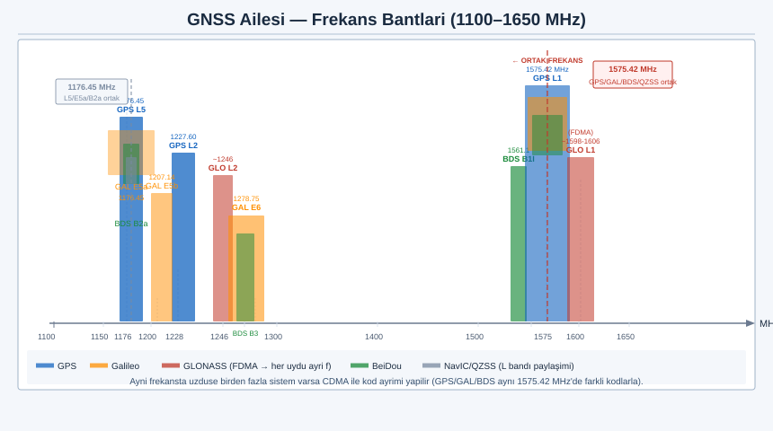
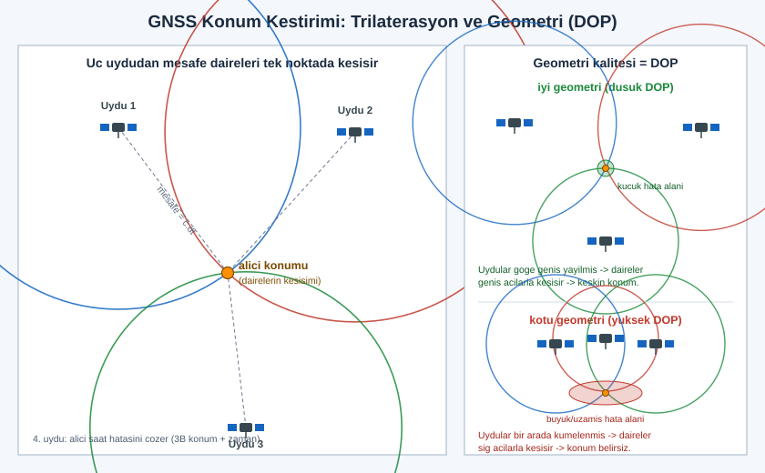
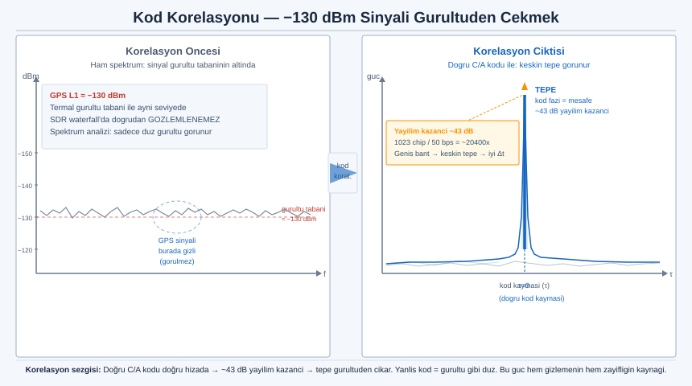
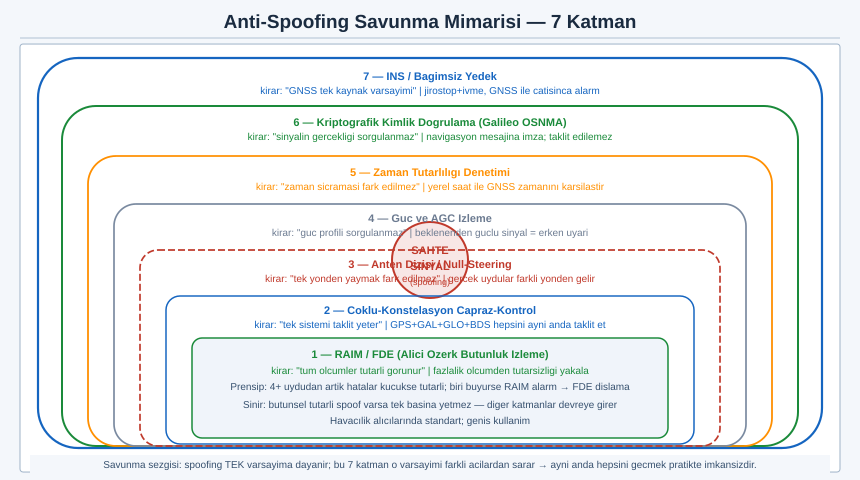

# SIGINT El Kitabı — Bölüm 10: GNSS / GPS Sistemleri

## Konum ve Zaman Nasıl Çıkar, Sahte Sinyal Cihazı Neden Yanıltır, Nasıl Savunulur

> Amaç: Bu bölüm, modern yaşamın görünmez altyapısı olan uydu seyrüsefer sistemlerini (GNSS) mühendislik düzeyinde açar. Üç soruyu cevaplar. Birincisi, uzaydaki bir uydu ile cebimizdeki alıcı arasında konum ve zaman bilgisi fiziksel olarak nasıl üretilir. İkincisi, bu sistemlerin sinyali neden olağanüstü zayıftır ve bu zayıflık onları hangi açıdan kırılgan kılar; "sahte konum sinyaliyle cihaz yanıltma" (spoofing) kavramı hangi mekanizmaya dayanır. Üçüncüsü, bir alıcı bu tür bozulmalara karşı kendini nasıl savunur. Bu bölüm bilinçli olarak prensip ve savunma düzeyinde kalır: jamming ya da spoofing için adım adım yapım/operasyon reçetesi vermez. Hedef, bir GNSS alıcısının ekranındaki konum sıçramasını ya da bir AGC göstergesindeki anormalliği gördüğünde arkasındaki fiziği zihninde canlandırabilmen ve hangi savunmanın neden işe yaradığını bilmendir.

> Yasal çerçeve: GNSS sinyallerini almak — yani bir alıcıyla kendi konumunu/zamanını çözmek — dünyanın hemen her yerinde tamamen serbesttir; bu pasif bir faaliyettir. Buna karşılık GNSS bandında yayın yapmak, sahte sinyal üretmek (spoofing) ya da karıştırmak (jamming) neredeyse istisnasız her ülkede ağır suçtur ve doğrudan can güvenliği tehlikesidir: aynı sinyale uçaklar, gemiler, ambulanslar, enerji şebekeleri ve finans sistemleri bağımlıdır. Bu bölümdeki spoofing/jamming anlatımı tasarım gereği yalnızca mekanizma ("neden işe yarıyor") ve savunma odaklıdır; hiçbir yerde verici kurulumu, güç ayarı, pull-off zamanlaması ya da yayın parametresi reçetesi yoktur ve olmayacaktır. Test/simülasyon araçlarına yapılan değiniler yalnızca yayın yapmayan, kablolu ve ekranlanmış (Faraday) laboratuvar koşulları içindir. Kendi ülkenin ve sürümünün mevzuatını teyit et.

---

## İçindekiler

1. [GNSS Ailesi: GPS, GLONASS, Galileo, BeiDou, QZSS, NavIC](#1)
2. [GPS Mimarisi: Uzay, Kontrol ve Kullanıcı Segmenti](#2)
3. [Konum Nasıl Çıkar: Pseudorange ve Dört Bilinmeyen](#3)
4. [Trilaterasyon ve Çok-Küre Kesişimi Matematiği](#4)
5. [Sinyal Yapısı: CDMA, Gold/C-A Kodu ve Yayılım Kazancı](#5)
6. [Korelasyon: -130 dBm Sinyali Gürültüden Çekmek](#6)
7. [Navigasyon Mesajı: Efemeris, Almanak, Saat](#7)
8. [Askeri ve Modern Sinyaller: P(Y), L2C, L5, M-Kodu](#8)
9. [Zamanlama Boyutu: GNSS Bir Saat Dağıtım Sistemidir](#9)
10. [Jamming: Zayıf Sinyalin Bastırılabilirliği (Prensip)](#10)
11. [Spoofing: Sahte Sinyalle Yanıltma Mekanizması (Prensip + Savunma)](#11)
12. [Anti-Spoofing ve Savunma Mimarisi](#12)
13. [Alıştırmalar (Yasal, Kendi Cihazların ve Pasif)](#13)
14. [Hızlı Referans ve Diğer Bölümler](#14)

---

<a id="1"></a>
## 1. GNSS Ailesi: GPS, GLONASS, Galileo, BeiDou, QZSS, NavIC

GNSS (Global Navigation Satellite System — Küresel Seyrüsefer Uydu Sistemi), Dünya yörüngesindeki uydu takımları aracılığıyla yeryüzündeki bir alıcıya konum, hız ve zaman (kısaca PNT: Positioning, Navigation, Timing) bilgisi sağlayan sistemlerin şemsiye adıdır. Tek bir sistem değildir; bugün birbirinden bağımsız işletilen, ama aynı fiziksel prensibi paylaşan birkaç küresel ve bölgesel takım bir arada bulunur. Modern bir akıllı telefon çoğu zaman bunların ikisini ya da üçünü aynı anda kullanır.

Sistemleri ayırt etmek mühendislik açısından önemlidir, çünkü her birinin frekansı, kodlama düzeni ve erişim yöntemi (CDMA ya da FDMA) farklıdır; ama hepsi aynı L bandı (kabaca 1–2 GHz) komşuluğunda, hepsi çok zayıf güçte ve hepsi tek yönlü yayın (uydudan alıcıya, alıcı hiç konuşmaz) mantığıyla çalışır.

| Sistem | İşleten | Erişim | Tipik açık frekanslar | Durum |
|---|---|---|---|---|
| GPS | ABD | CDMA | L1 1575.42, L2 1227.60, L5 1176.45 MHz | Tam küresel |
| GLONASS | Rusya | Çoğunlukla FDMA (yeni sinyallerde CDMA) | L1OF ~1598–1606 (1602 nominal), L2 ~1246 MHz | Tam küresel |
| Galileo | Avrupa (AB) | CDMA | E1 1575.42, E5a 1176.45, E5b 1207.14, E6 1278.75 MHz | Küresel |
| BeiDou (BDS) | Çin | CDMA | B1I ~1561.098, B1C 1575.42, B2a 1176.45, B3 ~1268.52 MHz | Küresel |
| QZSS | Japonya | CDMA (GPS uyumlu) | L1 1575.42, L5 1176.45 MHz | Bölgesel (Asya-Pasifik, Japonya üstü) |
| NavIC (IRNSS) | Hindistan | CDMA | L5 1176.45 MHz ve S bandı ~2492.028 MHz | Bölgesel (Hindistan ve çevresi) |

Tabloda göze çarpan kritik nokta: 1575.42 MHz ve 1176.45 MHz birden çok sistem tarafından **paylaşılır.** GPS L1, Galileo E1, BeiDou B1C ve QZSS L1 aynı merkez frekansta yan yana yaşar; bunu mümkün kılan, sinyallerin CDMA ile (her uyduya farklı kod) ayrılmasıdır; bunu Bölüm 5'te açıyoruz. Bu ortak frekans, çoklu-konstelasyon alıcılarının tek bir RF ön ucu ile birden çok sistemi dinleyebilmesinin de temelidir.

GLONASS bu tablonun istisnasıdır: tarihsel olarak CDMA yerine FDMA kullanır, yani her uydu **farklı bir frekansta** yayın yapar (frekans-bölmeli). Bu, GLONASS alıcısının RF tasarımını ve girişim davranışını GPS'ten ayırır; aynı zamanda, bir bozucu için "tek frekansı bozmak tüm takımı bozmaz" gibi farklı bir bağışıklık profili demektir. (GLONASS'ın yeni nesil CDMA sinyalleri bu ayrımı zamanla yumuşatmaktadır; kesin sinyal durumu işleticiden teyit edilmeli.)

Erişim yönteminin sezgisi şudur:

```
  CDMA (GPS/Galileo/BeiDou):        FDMA (klasik GLONASS):
  hepsi AYNI frekansta              her uydu FARKLI frekansta
  farklı KOD ile ayrılır            kod aynı, frekans kaydırmalı

   f0 ┤ ███ ███ ███ ███   (SV1..SV4   f0 ┤ ███
      │  hepsi üst üste,    aynı f)   f1 ┤      ███
      │  kodla çözülür               f2 ┤           ███
      └────────────► t               f3 ┤                ███
                                        └────────────► f
```

Not: Frekans ve sinyal adlandırmaları (özellikle BeiDou B1I/B1C ve GLONASS CDMA geçişi) sürümle değişir; üretim/tasarım kararı için resmî arayüz kontrol dokümanından (ICD) teyit edilmeli.



---

<a id="2"></a>
## 2. GPS Mimarisi: Uzay, Kontrol ve Kullanıcı Segmenti

Tüm GNSS'ler aynı üç parçalı mimariyi paylaşır; GPS üzerinden anlatmak en somutudur, çünkü en eski ve en iyi belgelenmiş olanıdır. Sistem üç segmente ayrılır: uzay, kontrol ve kullanıcı. Mühendislik açısından kritik olan, bu üç segment arasında bilginin hangi yönde aktığını görmektir; çünkü saldırı ve savunma tartışmasının tamamı bu akış yönüne dayanır.

```
   ┌──────────────────────── UZAY SEGMENTİ ────────────────────────┐
   │   ~20.200 km MEO yörüngede uydu takımı (GPS: nominal 31 aktif) │
   │   Her uydu: atom saati + kod üreteci + L-bandı verici          │
   └───────────────▲───────────────────────────────┬───────────────┘
                   │ yükleme bağı (komut/efemeris)  │ tek yönlü yayın
                   │ (yalnız kontrol→uzay)          │ (uydu→herkes)
   ┌───────────────┴────────────┐         ┌─────────▼───────────────┐
   │     KONTROL SEGMENTİ        │         │   KULLANICI SEGMENTİ    │
   │  ana kontrol + izleme       │         │  alıcılar: telefon,     │
   │  istasyonları, anten ağı    │         │  araç, uçak, gemi, saat │
   │  saat/yörünge düzeltme       │         │  YALNIZCA DİNLER (RX)   │
   └────────────────────────────┘         └─────────────────────────┘
```

**Uzay segmenti.** GPS uyduları yaklaşık 20.200 km yükseklikte, orta Dünya yörüngesinde (MEO) dolanır; yörünge düzeni, yeryüzünün herhangi bir noktasından her an en az dört uydunun görülebilmesini hedefler (geometri gereği genelde daha fazlası görünür). Her uydunun kalbinde son derece kararlı atom saatleri (rubidyum/sezyum) bulunur; bu saatler sistemin tüm doğruluğunun temelidir, çünkü göreceğimiz gibi GNSS özünde bir zaman ölçme sistemidir. Her uydu, kendi atom saatine kilitli olarak sürekli bir yayılmış-spektrum sinyali yayınlar.

**Kontrol segmenti.** Yeryüzüne dağılmış izleme istasyonları uyduları sürekli gözler, yörünge ve saat sapmalarını ölçer; ana kontrol istasyonu bu düzeltmeleri hesaplayıp yükleme antenleri aracılığıyla uydulara geri yükler. Yani uyduların yayınladığı "ben şu konumdayım, saatim şu" bilgisi, yerden periyodik olarak tazelenir. Kritik nokta: bu yükleme bağı tek yönlüdür ve yalnızca yetkili kontrol segmentinden uyduya gider.

**Kullanıcı segmenti.** Alıcılar — telefon, araç navigasyonu, uçak, gemi, zaman sunucusu, akıllı saat — yalnızca **dinler.** GNSS alıcısı hiçbir zaman uyduya bir şey göndermez; sistem tamamen tek yönlü ve pasif alımdır. Bu, GNSS'in en büyük gücü (sınırsız sayıda kullanıcı, anonim alım) ama aynı zamanda en büyük yapısal zaafıdır: alıcı, aldığı sinyalin gerçekten yörüngedeki uydudan mı geldiğini doğrulayacak bir geri kanala ya da (klasik sivil sinyalde) bir kimlik doğrulama mekanizmasına sahip değildir. Spoofing tartışmasının kökü tam olarak buradadır; bunu Bölüm 11'de açıyoruz.

Not: Aktif uydu sayısı, yörünge parametreleri ve takım büyüklüğü zamanla değişir; güncel rakam için işleticinin yayımladığı durum sayfasından teyit edilmeli.

---

<a id="3"></a>
## 3. Konum Nasıl Çıkar: Pseudorange ve Dört Bilinmeyen

GNSS'in temel fikri şaşırtıcı derecede basittir ve tamamen zaman ölçmeye dayanır: eğer bir sinyalin uydudan alıcıya ulaşması ne kadar sürdüğünü bilirsen, o sürede ışık hızıyla katedilen mesafeyi bilirsin; yeterli sayıda uydudan mesafeyi bilirsen, uzaydaki konumunu çözebilirsin. Tüm karmaşıklık, "uçuş süresini nasıl ölçeriz" ve "alıcının kendi saati neden bir bilinmeyen ekler" sorularında yatar.

### Mesafe = uçuş süresi × ışık hızı

Her uydu, sinyalin tam olarak hangi uydu zaman anında yayınlandığını bilgisine gömer (kod fazı ve navigasyon mesajı üzerinden). Alıcı sinyali aldığı anı kendi saatine göre işaretler. İki zaman damgasının farkı, sinyalin uçuş süresidir (Δt). Mesafe:

```
   ρ = c · Δt
   c ≈ 299.792.458 m/s   (ışık hızı)
```

Sezgi için ölçek: GPS uydusu ~20.200 km yükseklikte olduğundan, tepedeki bir uydudan sinyalin gelmesi kabaca 67 ms sürer; ufuktaki bir uydu için bu daha uzundur. Burada acımasız bir hassasiyet gereksinimi doğar: ışık 1 nanosaniyede yaklaşık 30 cm yol alır. Yani uçuş süresini 30 cm doğrulukla bilmek istiyorsan, zamanı 1 ns mertebesinde bilmen gerekir. Bu yüzden uydularda atom saati vardır ve bu yüzden GNSS bir zaman sistemidir.

### Alıcı saat hatası: dördüncü bilinmeyen

İşin püf noktası şudur: uydularda atom saati vardır ama alıcıda (telefonunda) yoktur — orada ucuz bir kuvars osilatör bulunur. Alıcının saati, sistem zamanından bilinmeyen bir miktar (b) kadar kaymıştır. Dolayısıyla alıcının ölçtüğü "mesafe" gerçek geometrik mesafe değildir; içinde alıcı saat hatasının katkısı vardır. Bu ölçüme bu yüzden **pseudorange** (sözde-mesafe) denir:

```
   ρ_i = || X_uydu_i − X_alıcı ||  +  c · b  +  (hata terimleri)

   ρ_i      : i. uyduya ölçülen sözde-mesafe
   X_alıcı  : alıcının (x, y, z) konumu        → 3 bilinmeyen
   c · b    : alıcı saat hatasının mesafe karşılığı → 1 bilinmeyen
   X_uydu_i : i. uydunun konumu (efemeristen bilinir, bilinmeyen değil)
```

Toplam dört bilinmeyen vardır: konumun üç bileşeni (x, y, z) ve alıcı saat hatası (b). Dört bilinmeyeni çözmek için en az dört bağımsız denklem, yani **en az dört uydu** gerekir. "Konum için üç uydu yeter" sezgisi bu yüzden yanlıştır: üçüncü boyut için değil, alıcının saatini düzeltmek için dördüncü uydu şarttır.

Bunun zarif bir yan ürünü vardır: dört uyduyla çözüm yaptığında, konumla birlikte alıcının saat hatasını da çözmüş olursun. Yani GNSS alıcısı, çözümün doğal bir parçası olarak kendi saatini atom saati doğruluğuna yakın bir seviyeye düzeltir. Bölüm 9'da göreceğimiz "GNSS aynı zamanda bir zaman dağıtım sistemidir" gerçeği matematiksel olarak buradan, dördüncü bilinmeyenin çözümünden doğar.

### Hata terimleri (neden 4 uydu "tam" değil, "asgari"dir)

Yukarıdaki (hata terimleri) kısmı önemlidir, çünkü gerçek doğruluğu belirler:

| Hata kaynağı | Doğa | Tipik mertebe (kavramsal) |
|---|---|---|
| İyonosfer gecikmesi | Yüklü tabaka sinyali yavaşlatır; frekansa bağlı | metre mertebesi; çift frekansla büyük ölçüde giderilir |
| Troposfer gecikmesi | Alt atmosfer (nem/basınç) | metre-altı/metre |
| Uydu saat/yörünge artığı | Kontrol segmenti düzeltmesinin kalıntısı | metre-altı |
| Çok-yol (multipath) | Sinyalin bina/zeminden yansıyıp gelmesi | ortama göre değişken |
| Alıcı gürültüsü | Termal/işleme gürültüsü | kod/ortama bağlı |

Bu hataları azaltmak için ek uydular (fazlalık ölçüm), çift frekans (iyonosferi ölçer), ve düzeltme servisleri (SBAS gibi) kullanılır. Pratikte tipik bir sivil tek-frekanslı çözüm birkaç metre, çift frekans + düzeltme ile metre-altı, taşıyıcı-faz teknikleriyle (RTK/PPP) santimetre mertebesine iner. Önemli sezgi: dört uydu **asgari** koşuldur; fazlalık ölçümler hem doğruluğu artırır hem de — Bölüm 12'de göreceğimiz gibi — tutarsız bir ölçümü yakalamanın (RAIM) temelini kurar.

---

<a id="4"></a>
## 4. Trilaterasyon ve Çok-Küre Kesişimi Matematiği

Pseudorange denklemlerinin geometrik anlamı, konumlandırmanın neden işe yaradığını sezgisel olarak gösterir. Tek bir uydudan ρ mesafesini bilmek, alıcının o uydu merkezli ρ yarıçaplı bir **küre** üzerinde olduğunu söyler — ama kürenin neresinde olduğunu söylemez. Bu yüzden buna trilaterasyon (üç-mesafeyle konumlama) denir; üçgenleme/triangülasyon (açıyla konumlama) ile karıştırılmamalıdır. GNSS açı değil, mesafe ölçer.

```
   1 uydu:   bir KÜRE yüzeyi (konum belirsiz)
   2 uydu:   iki kürenin kesişimi → bir ÇEMBER
   3 uydu:   üç kürenin kesişimi → iki NOKTA (biri Dünya dışı, elenir)
   4 uydu:   saat hatasını da çözer → tek tutarlı NOKTA

         küre A        küre B
           ╱───╲      ╱───╲
          (  ·  )    (  ·  )       kesişim çemberi
           ╲───╳────╳───╱             │
               ╲────╱  ← iki kürenin ortak çemberi
                  +  küre C ile kesişince → 2 nokta
                  +  küre D / saat çözümü → 1 nokta
```

İki boyutta sezgi daha kolaydır: iki çemberin kesişimi en çok iki noktadır; üçüncü bir çember bu ikisinden birini seçer. Üç boyutta küreler kullanılır ve mantık aynıdır. Üç küre teorik olarak iki noktada kesişir; bu iki noktadan biri neredeyse her zaman Dünya yüzeyinden çok uzakta (uzayda) olduğu için fiziksel olarak elenir ve geriye tek anlamlı çözüm kalır.

Dördüncü uydunun rolünü geometrik olarak şöyle düşün: eğer alıcı saati kusursuz olsaydı, üç küre çözümü verirdi. Ama alıcı saati b kadar kaymış olduğundan, her kürenin yarıçapı aynı miktarda yanlıştır (hepsi c·b kadar büyük ya da küçük). Bu, tüm kürelerin tutarlı biçimde "şişmiş" ya da "büzülmüş" olması demektir. Dördüncü küre eklendiğinde, dört kürenin tek bir noktada kesişmesini sağlayan b değeri tek olarak belirlenir — yani sistem, "hangi saat hatası tüm ölçümleri uyumlu kılar" sorusunu çözer.

### Pratik çözüm: doğrusallaştırma ve en küçük kareler

Denklemler konuma göre doğrusal değildir (karekök/norm içerir). Pratikte alıcı, bir başlangıç konumu tahmini etrafında denklemleri doğrusallaştırır (Taylor açılımı) ve düzeltmeyi yinelemeli en küçük kareler ile çözer; genellikle birkaç iterasyonda yakınsar. Fazlalık uydu olduğunda (dörtten çok), sistem aşırı-belirtilidir ve en küçük kareler en uyumlu çözümü bulurken, bir uydunun ölçümü diğerleriyle çelişiyorsa bu, artık hatalarda (residual) iz bırakır. Bu "çelişki izi", anti-spoofing/bütünlük denetiminin (RAIM, Bölüm 12) çalışma prensibidir: tutarsızlığı, fazlalıktan yakalamak.

### Geometrinin kalitesi: DOP

Sadece uydu sayısı değil, uyduların gökyüzündeki **dağılımı** da doğruluğu belirler. Uydular gökte birbirine yakın kümelenmişse, küreler birbirini sığ açılarla keser ve küçük bir ölçüm hatası büyük bir konum hatasına dönüşür. Bu duyarlılık DOP (Dilution of Precision — Hassasiyet Seyrelmesi) ile ölçülür; düşük DOP iyi (uydular göğe iyi yayılmış), yüksek DOP kötüdür (uydular kümelenmiş). Telefonların GNSS durum ekranlarında uyduların gökyüzü haritası (skyplot) tam olarak bu geometriyi gösterir; alıştırmalarda buna bakacağız.



*Sol: her uydudan olculen mesafe bir daire (3B'de kure) cizer; dairelerin kesisimi alıcı konumudur. Sag: uydular goge genis yayilinca daireler genis acilarla kesisir (dusuk DOP, keskin konum); kumelendiklerinde sig acilarla kesisir (yuksek DOP, belirsiz/uzamis hata alani).*

---

<a id="5"></a>
## 5. Sinyal Yapısı: CDMA, Gold/C-A Kodu ve Yayılım Kazancı

Buraya kadar "alıcı uydudan mesafe ölçer" dedik ama mesafeyi mümkün kılan sinyalin yapısına bakmadık. GPS sivil sinyalinin (L1 C/A) yapısı, hem konum ölçümünün hem de zayıf-sinyal alımının hem de — dürüst olmak gerekirse — spoofing'in neden mümkün olduğunun anahtarıdır. Bu yüzden bu bölüm bölümün kalbidir.

### Üç katmanlı çarpım

GPS L1 C/A sinyali, taşıyıcı dalganın üç şeyle çarpımıdır:

```
   s(t) = [ navigasyon verisi  ⊕  C/A kodu ] · cos(2π f_L1 t)
          └── 50 bit/s ────────┘  └ 1.023 Mchip/s ┘   └ 1575.42 MHz ┘
                  (veri)              (yayma kodu)        (taşıyıcı)
```

1. **Taşıyıcı:** 1575.42 MHz sinüs dalgası (L1).
2. **Yayma kodu (C/A):** Her uyduya özgü, 1023 chip uzunluğunda, 1.023 Mchip/s hızında bir sözde-rastgele (PRN) ikili dizidir. Tam 1 milisaniyede bir tekrar eder (1023 chip ÷ 1.023 Mchip/s = 1 ms). Bu kod, dar bantlı veriyi geniş banda **yayar** (spread spectrum) ve aynı zamanda mesafe ölçümünün "cetveli"dir.
3. **Navigasyon verisi:** 50 bit/s hızında, uydunun konumunu (efemeris), saatini ve sistem durumunu taşıyan yavaş veri akışı (Bölüm 7).

### CDMA: hepsi aynı frekansta, kodla ayrılır

Tüm GPS uyduları **aynı** 1575.42 MHz frekansında yayın yapar. Birbirlerine karışmamalarının sebebi, her birinin farklı bir C/A koduna sahip olmasıdır. Bu kodlar Gold kodları ailesinden seçilir; Gold kodlarının kritik özelliği, birbirleriyle **çok düşük çapraz-korelasyona** ve kendileriyle keskin **oto-korelasyona** sahip olmalarıdır. Pratik anlamı: alıcı SV-14'ün kodunu üretip gelen karışık sinyalle çarpıp toplarsa (korelasyon), yalnızca SV-14'ün sinyali güçlü bir tepe verir; diğer tüm uydular ve gürültü, bu işlemde silinip gürültü seviyesinde kalır. Bu, CDMA'nın özüdür: kod, hem adres hem de cetveldir.

```
   Oto-korelasyon (doğru kod, doğru hizada):     keskin tepe
        R(τ) ┤            █
             │            █
             │      ▁▁▁▁▁ █ ▁▁▁▁▁     ← yan loblar çok küçük
             └──────────────────────► τ (kod kayması)
                       τ=0

   Çapraz-korelasyon (başka uydunun kodu):  düz, tepe yok
        R(τ) ┤  ▁ ▁▁ ▁ ▁▁ ▁ ▁▁ ▁ ▁     ← gürültü gibi
             └──────────────────────► τ
```

### Yayılım kazancı: zayıflığın panzehiri

Yayma kodunun ikinci hediyesi, **işleme/yayılım kazancıdır** (processing gain). Veri 50 bit/s, kod 1.023 Mchip/s olduğundan, sinyal yaklaşık 20.000 kat (≈ 43 dB) daha geniş banda yayılmıştır. Alıcı doğru kodla korelasyon yaptığında (de-spreading), istenen sinyali dar banda geri toplarken, kodla ilişkisiz gürültü ve girişimi geniş banda yayılı bırakır. Sonuç: korelasyon, sinyal-gürültü oranını yayılım kazancı kadar yükseltir. Bu yüzden gürültü tabanının çok altındaki bir sinyal bile çözülebilir — bir sonraki bölümün konusu budur.

Önemli sezgi (spoofing'e köprü): C/A kodları sivil sinyalde **açık ve bilinendir** (ICD'de yayımlıdır). Yani herhangi bir alıcı, herhangi bir uydunun kodunu üretebilir — bu, alımı herkese açan tasarımın gereğidir. Ama aynı açıklık, sivil sinyalin yapısının taklit edilebilir olması anlamına gelir; sahte bir sinyal, gerçek kod yapısını birebir üretebilir. Sivil L1 C/A'nın kimlik doğrulaması yoktur. Bu yapısal gerçek, Bölüm 11'de spoofing mekanizmasının ve Bölüm 12'de Galileo OSNMA gibi kimlik doğrulama savunmalarının dayanağıdır.

---

<a id="6"></a>
## 6. Korelasyon: -130 dBm Sinyali Gürültüden Çekmek

GNSS'in en sezgiye aykırı yanı, çalıştığı güç seviyesidir. Yeryüzünde bir GPS L1 sinyalinin tipik gücü yaklaşık -130 dBm mertebesindedir (kaynaklarda sıkça -125 ila -130 dBm aralığında anılır; tam değer uydu, anten ve yükseklik açısına bağlıdır, teyit edilmeli). Bu, termal gürültü tabanının **altında** bir seviyedir. Yani bir spektrum analizöründe ya da SDR waterfall'ında GPS sinyalini doğrudan bir tepe olarak göremezsin; gürültü denizinde tamamen gömülüdür. Buna rağmen telefonun saniyeler içinde konum çözer. Bunu mümkün kılan tek şey korelasyondur.

### Neden gözle görünmez, korelasyonla görünür

Korelasyonun yaptığı, Bölüm 5'teki yayılım kazancını uygulamaktır. Alıcı, aradığı uydunun bilinen C/A kodunun bir kopyasını yerel olarak üretir ve gelen (gürültüye gömülü) sinyalle hizalayıp çarparak toplar. Doğru kod, doğru zaman kaymasında ve doğru frekansta hizalandığında, sinyal enerjisi tutarlı biçimde birikir (coherent integration) ve gürültü tabanından bir tepe olarak sıyrılır. Yanlış kod ya da yanlış hizada hiçbir tepe oluşmaz.

```
   Alımdan önce (zaman alanı): sinyal gürültüye gömülü, görünmez
      genlik ┤▒▒▓▒▒▒▓▒▒▒▒▓▒▒▒▒▒▓▒▒▒   (hangisi GPS? ayırt edilemez)
             └────────────────────────► t

   Korelasyon çıktısı (kod kayması × frekans araması):
      güç   ┤                █  ← tek keskin tepe = uydu burada
            │                █     (kod fazı → mesafe,
            │   ▁▁▁▁▁▁▁▁▁▁▁▁ █ ▁▁▁    Doppler → hız)
            └───────────────────────► kod kayması (τ)
```

### İki boyutlu arama: kod fazı × Doppler

Alıcı baştan ne sinyalin kod fazını (uydu ne kadar uzakta) ne de tam frekansını (uydu Dünya'ya göre hareket ettiğinden Doppler kayması var) bilir. Bu yüzden "elde alma" (acquisition) aşaması iki boyutlu bir aramadır: olası kod kaymaları × olası Doppler frekansları ızgarasında tepe aranır. Tepe bulunduğunda iki bilgi birden gelir: tepenin kod-kayması ekseni mesafeyi (pseudorange), Doppler ekseni bağıl hızı verir. Tepe yakalandıktan sonra alıcı onu "izleme" (tracking) döngüleriyle (kod için DLL, taşıyıcı için PLL/FLL) sürekli kilitli tutar.

Bu mekanizma, hem GNSS'in gücünü hem de zaafını aynı anda gösterir. Gücü: olağanüstü zayıf bir sinyal, bilinen kod sayesinde güvenle çözülür. Zaafı: alıcı, korelasyon tepesini nereden alırsa oradan alır — tepe gerçek uydudan da gelebilir, aynı kodu üreten başka bir kaynaktan da. Eğer sahte bir kaynak, doğru kodu doğru civarda ama biraz daha güçlü üretirse, alıcının izleme döngüsü doğal olarak daha güçlü ve tutarlı tepeyi tercih etmeye meyleder. Bu, Bölüm 11'deki pull-off kavramının fiziksel çekirdeğidir — ama oraya geçmeden önce sinyalin taşıdığı veriyi tamamlayalım.



---

<a id="7"></a>
## 7. Navigasyon Mesajı: Efemeris, Almanak, Saat

Korelasyonla uyduyu yakalayıp mesafeyi ölçmek tek başına yetmez; alıcının, o uydunun gökyüzünde **tam olarak nerede** olduğunu (X_uydu) da bilmesi gerekir — yoksa küre çözümünün merkezini bilemez. Bu bilgi, sinyale gömülü yavaş veri akışıyla, navigasyon mesajıyla gelir.

GPS L1 C/A navigasyon mesajı 50 bit/s hızında akar ve şu temel bileşenleri taşır:

| Bileşen | İçerik | Rolü | Tazelik |
|---|---|---|---|
| Efemeris | Yayınlayan uydunun kendi hassas yörünge parametreleri | X_uydu'yu yüksek doğrulukla verir | Saatler ölçeğinde geçerli; sık tazelenir |
| Saat düzeltmesi | Uydu atom saatinin sistem zamanına göre sapma katsayıları | Pseudorange'deki uydu saat hatasını düzeltir | Efemerisle birlikte |
| Almanak | Tüm takımın kabaca yörünge bilgisi | Hangi uyduların görünür olduğunu kestirip aramayı hızlandırır | Günler/haftalar ölçeğinde geçerli |
| Sağlık/durum | Uydunun kullanılabilir olup olmadığı bayrakları | Arızalı uyduyu çözümden çıkarmak | Anlık |
| İyonosfer/UTC | Tek-frekans iyonosfer modeli, UTC-GPS farkı | Tek frekanslı düzeltme ve zaman dönüşümü | Periyodik |

Sezgi için kritik ayrım: **efemeris** yayınlayan uydunun kendi hassas konumudur (o uyduya özel, çok doğru, çabuk eskir); **almanak** ise tüm takımın kaba haritasıdır (genel, daha az doğru, uzun ömürlü). Soğuk başlatmada (cold start) alıcının elinde hiçbir şey yoksa, önce almanak/efemeris toplaması gerekir ve bu yüzden ilk konum sabitlemesi (first fix) uzun sürer. Telefonların "A-GPS" özelliği tam da bunu kısaltmak için efemeris/almanağı uydu yerine hücresel/internet üzerinden indirir — böylece ilk fix saniyelere iner.

Veri hızının yavaşlığı (50 bit/s) önemli bir gerçeği dayatır: tam bir efemeris çerçevesini almak saniyeler alır (klasik GPS'te bir alt-çerçeve 6 s, tam çerçeve 30 s). Bu, hem ilk fix gecikmesini hem de — Bölüm 12'de göreceğimiz — Galileo OSNMA gibi kimlik doğrulama verisinin neden zaman aldığını açıklar: kimlik doğrulama bitleri de aynı yavaş kanaldan akmak zorundadır.

Mühendislik notu: Efemeris/almanak yapısı sistemden sisteme (GPS LNAV/CNAV, Galileo I/NAV/F/NAV) değişir; ayrıntı için ilgili ICD'den teyit edilmeli.

---

<a id="8"></a>
## 8. Askeri ve Modern Sinyaller: P(Y), L2C, L5, M-Kodu

GPS L1 C/A, sistemin en eski ve en açık sinyalidir; ama tek sinyali değildir. Yıllar içinde hem askeri hem sivil tarafta, farklı amaçlarla ek sinyaller eklenmiştir. Bunları tanımak, hem doğruluk hem dayanıklılık hem de güvenlik tartışması için gereklidir; çünkü modern sinyallerin bir kısmı doğrudan jamming/spoofing dayanıklılığı için tasarlanmıştır.

| Sinyal | Frekans | Erişim | Amaç / özellik |
|---|---|---|---|
| L1 C/A | 1575.42 MHz | Sivil, açık | Temel sivil sinyal; kod açık, kimlik doğrulama yok |
| L2C | 1227.60 MHz | Sivil, açık | İkinci sivil sinyal; iyonosfer için çift frekans, daha iyi alım |
| L5 | 1176.45 MHz | Sivil, açık | Güvenlik-kritik (havacılık ARNS bandı), yüksek güç/bant, sağlam |
| P(Y) | L1 ve L2 | Askeri, şifreli | Şifreli askeri kod; daha uzun/gizli kod, anti-spoof özellikli |
| M-kodu | L1 ve L2 | Askeri, modern | Yeni askeri sinyal; ayrık spektrum, daha güçlü, dayanıklı, kimlik doğrulamalı |

Mühendislik açısından üç eksen önemlidir.

**Çift/çok frekans (L2C, L5).** İyonosfer gecikmesi frekansa bağlı olduğundan, iki ayrı frekansta (örneğin L1 + L5) yapılan ölçümler iyonosfer etkisini doğrudan **ölçüp** çıkarabilir. Bu yüzden çok frekanslı alıcılar tek frekanslıdan kesinlikle daha doğrudur. L5 ayrıca havacılık için ayrılmış korumalı bir seyrüsefer (ARNS) bandında ve daha yüksek güç/bant ile tasarlandığından, hem doğruluk hem girişime dayanıklılık açısından üstündür. Çok frekanslı olmak aynı zamanda bir savunma boyutudur: bir bozucunun tüm frekansları aynı anda etkilemesi tek frekansı etkilemesinden zordur.

**Şifreli kod (P(Y)).** Askeri sivil L1 C/A'nın aksine, P(Y) kodu şifrelidir ve yalnızca yetkili (kripto anahtarına sahip) alıcılar tarafından çözülebilir. Şifreli kodun anti-spoofing değeri doğrudandır: bir saldırgan, üretemediği/bilemediği bir kodu taklit edemez. Bu yüzden şifreli/kimlik-doğrulamalı kod, spoofing'e karşı en temel yapısal savunmadır; sivil tarafın eksiği tam olarak budur.

**Modern askeri kod (M-kodu).** M-kodu, hem ayrı bir spektral yerleşimle (sivil sinyalden ayrılabilir), hem daha yüksek güçle, hem de gelişmiş kimlik doğrulama ve jamming dayanıklılığı hedefiyle tasarlanmıştır; "spot beam" gibi noktasal yüksek-güç yetenekleriyle ilişkilendirilir. Ayrıntılar büyük ölçüde açık değildir ve tasarım gereği gizlidir; burada yalnızca kavramsal düzeyde anılır ve resmî kaynaklardan teyit edilmelidir.

Sivil tarafın güvenlik açığını özetleyen tek cümle şudur: temel sivil sinyaller (L1 C/A, L2C, L5) **açık ve kimlik doğrulaması olmayan** sinyallerdir; güçleri okunabilirlik ve evrensel erişim, zayıflıkları ise taklit edilebilirliktir. Sivil dünyanın bu açığı kapatma yanıtı kriptografik kimlik doğrulamadır (Galileo OSNMA, Bölüm 12).

---

<a id="9"></a>
## 9. Zamanlama Boyutu: GNSS Bir Saat Dağıtım Sistemidir

Çoğu kullanıcı GNSS'i bir "harita üzerinde nokta" teknolojisi sanır; oysa GNSS'in modern altyapı için belki daha kritik olan işlevi, son derece hassas ve eşzamanlı **zaman** dağıtmasıdır. Bölüm 3'te gördük: dört uyduyla çözüm yaparken alıcı, konumla birlikte kendi saat hatasını da çözer ve böylece saatini atom saati doğruluğuna yakın bir seviyeye senkronlar. Bu, GNSS'i dünyanın her yerinde ücretsiz erişilebilen ortak bir zaman referansı yapar.

Bunun pratik sonucu, çok sayıda kritik sistemin sessizce GNSS zamanına bağımlı olmasıdır:

| Sektör | GNSS zamanına bağımlılık | Kesinti olursa etki (kavramsal) |
|---|---|---|
| Telekom (mobil ağ) | Baz istasyonu senkronizasyonu, hücre devir-teslimi | Senkron kaybı, kapasite/çağrı düşüşü |
| Enerji şebekesi | Faz ölçüm üniteleri (PMU), olay zaman damgası | Geniş alan izleme/koruma bozulması |
| Finans | İşlem zaman damgalama (mevzuat gereği milisaniye/mikrosaniye) | Uyum/denetim sorunları, sıralama belirsizliği |
| Yayın/veri merkezi | Ağ senkronizasyonu, log korelasyonu | Zaman tutarsızlığı, ağ sorunları |
| Ulaşım | Demiryolu/havacılık/denizcilik zaman ve konum | Operasyonel kesinti |

Mühendislik açısından kritik içgörü şudur: GNSS'e yönelik bir bozulma (jamming ya da spoofing) yalnızca "konum kayboldu/yanlış" sorununu değil, çoğu zaman görünmeyen bir "zaman bozuldu" sorununu da doğurur. Spoofing bağlamında bu özellikle sinsidir: konum bilgisine aldırmayan ama GNSS'i yalnızca **zaman kaynağı** olarak kullanan bir sistem (örneğin bir zaman sunucusu), sahte sinyalin enjekte ettiği yanlış zamanı sessizce kabul edip ağ genelinde yanlış zaman yayabilir. Bu yüzden modern savunma, sadece "konumum doğru mu" değil, "zamanım tutarlı mı" sorusunu da içerir (Bölüm 12'deki zaman tutarlılığı denetimi).

Bu bağımlılık, GNSS'in neden "kritik altyapı" sayıldığını ve neden tek bir sistemin (yalnız GPS) tek-nokta-arıza riski oluşturduğunu açıklar. Dayanıklılık stratejilerinin (çok-konstelasyon, yerel atom saati yedeği, eLoran gibi tamamlayıcı sistemler) temel gerekçesi budur.

---

<a id="10"></a>
## 10. Jamming: Zayıf Sinyalin Bastırılabilirliği (Prensip)

> Uyarı: Bu başlık yalnızca **neden** bir GNSS sinyalinin bozulabileceğini fizik düzeyinde açıklar. Hiçbir cihaz, güç, anten ya da yöntem reçetesi içermez. GNSS bandında karıştırma yapmak neredeyse her ülkede ağır suçtur ve doğrudan can güvenliği tehlikesidir.

Bölüm 6'da gördüğümüz tek gerçek — yeryüzündeki GNSS sinyalinin yaklaşık -130 dBm ile gürültü tabanının altında olması — jamming'in neden kavramsal olarak "kolay" olduğunu da açıklar. Sinyal zaten son derece zayıf olduğundan, alıcının çalıştığı banda yeterince enerjili bir gürültü düştüğünde, korelasyonun sinyali gürültüden ayırma yeteneği boğulur; uydu tepesi gürültüye gömülür ve alıcı kilidini kaybeder. Bu, "fiziksel olarak zor" bir saldırı değil, sistemin doğasından gelen bir kırılganlıktır: alıcı, kaybolan zayıf sinyalle, çok daha güçlü bir karışıklığa karşı yarışamaz.

Burada üç kavramsal nokta önemlidir.

**Yayılım kazancı bir tampondur ama sınırlıdır.** Bölüm 5'teki ~43 dB işleme kazancı, alıcıya gürültüye karşı bir miktar dayanıklılık verir; bu yüzden GNSS, kazancı olmayan dar bant bir sisteme göre daha dayanıklıdır. Ama bu tampon sonsuz değildir; karışıklık enerjisi bu kazancı aşacak kadar yükseldiğinde alıcı yine de boğulur.

**Etki yarıçapı asimetriktir.** Karıştırıcı sinyali alıcıya, uydudan çok daha yakın bir mesafeden ulaştığı için, mesafeyle güç düşüşü (FSPL, Bölüm 1) saldırganın lehine, savunmanın aleyhine çalışır. Yani çok düşük güçlü bir karışıklık bile, yakın çevredeki alıcılar için orantısız büyük bir etki alanı oluşturabilir. Bu asimetri, GNSS jamming'in neden bu kadar etkili olabildiğinin kavramsal özüdür.

**Etkiler katmanlıdır.** Bir GNSS kesintisi yalnızca "navigasyon yok" demek değildir; Bölüm 9'daki zincire göre zamanlama da çöker. Gerçek dünyada GNSS karışıklığı/kesintisi olaylarının (havalimanı çevrelerinde seyrüsefer aksaklıkları, deniz trafiğinde konum kaybı, geniş bölgesel etkiler) kamuya yansıyan örnekleri vardır; bunlar GNSS'in tek-nokta-bağımlılığının pratik kanıtıdır. Bu olayların teknik ayrıntısı ve atfı çoğu zaman tartışmalıdır ve burada yalnızca kavram olarak anılır; belirli olay iddiaları bağımsız kaynaklardan teyit edilmeli.

Savunma tarafı (Bölüm 12'de açılır) jamming'e karşı şu mantıkla yanıt verir: bozulmayı **tespit et** (AGC ve gürültü tabanı izleme bir karışıklığı erkenden ele verir), **etkisini azalt** (yönlü anten/null-steering, karışıklığın geldiği yönü bastırır), ve **yedeğe geç** (INS/atom saati ile kesinti süresince köprü kur). Buradaki kilit fikir: zayıf sinyal bastırılabilir olduğu için savunma sinyali "daha güçlü almaya" değil, bozulmayı **fark edip** alternatif kaynağa geçmeye dayanır.

---

<a id="11"></a>
## 11. Spoofing: Sahte Sinyalle Yanıltma Mekanizması (Prensip + Savunma)

> Uyarı: Bu başlık spoofing'in **neden işe yaradığını** ve nasıl **savunulacağını** açıklar. Bilinçli olarak hiçbir operasyonel reçete içermez: verici kurulumu, güç/zamanlama ayarı, pull-off prosedürü ya da yayın parametresi YOKTUR. Açık havaya GNSS sinyali yaymak ağır suç ve doğrudan can güvenliği tehlikesidir. Bu metin, savunma kurabilmen için mekanizmayı anlamana yöneliktir.

### Jamming ile farkı: bastırmak değil, kandırmak

Jamming sinyali yok eder (alıcı kilidini kaybeder, "konum yok" der). Spoofing daha sinsidir: alıcıyı kilidini kaybettirmeden, sahte ama **geçerli görünen** sinyallere kilitleyerek yanlış bir konuma ya da yanlış bir zamana **ikna eder.** Alıcı bu durumda hata vermez; emin bir şekilde yanlış bir cevap üretir. Tehlikenin kaynağı budur — sessiz ve fark edilmesi zor olması.

### Mekanizmanın kökü: kimlik doğrulamasız, açık, zayıf sivil sinyal

Spoofing'i mümkün kılan üç yapısal gerçeği önceki bölümlerden topluyoruz:

1. **Sivil sinyal açıktır (Bölüm 5):** C/A kodları yayımlıdır; herhangi bir kaynak, gerçek uydununkiyle aynı yapıda bir sinyal üretebilir.
2. **Kimlik doğrulaması yoktur (Bölüm 8):** Klasik sivil sinyal "bu sinyali gerçekten yetkili uydu mu üretti" sorusunu soracak kriptografik bir imza taşımaz. Alıcı, doğru kod yapısını gördüğünde onu gerçek kabul eder.
3. **Sinyal çok zayıftır (Bölüm 6):** Gerçek sinyal -130 dBm civarında olduğundan, ona göre biraz daha güçlü ve daha tutarlı bir korelasyon tepesi sunan bir kaynak, alıcının izleme döngüsünün doğal olarak tercih edeceği "daha iyi" bir tepe oluşturur.

Bu üçü birleştiğinde sonuç şudur: alıcının korelasyon/izleme mekanizması, en güçlü ve en tutarlı geçerli-görünen tepeyi takip etmek üzere tasarlanmıştır; bu tasarım, sinyalin kaynağının gerçekliğini sorgulamaz. Spoofing, tam olarak bu sorgusuzluğu istismar eder.

### Pull-off kavramı (yalnızca prensip)

Spoofing literatüründe en çok anılan kavram "pull-off"tur. Fikir kavramsal olarak şudur: alıcının izleme döngüsü, takip ettiği korelasyon tepesini sürekli "en iyi" tepeye kilitli tutmaya çalışır. Eğer alıcı, gerçek sinyalle örtüşen ama yavaşça kayan, baskın bir tepeyle karşılaşırsa, izleme döngüsü kendi doğası gereği bu baskın tepeyi izlemeye devam eder ve farkında olmadan gerçek tepeden uzağa "çekilir". Sonuçta hesaplanan kod fazı (yani pseudorange, yani mesafe), dolayısıyla konum/zaman, kontrollü biçimde kaydırılmış olur.

```
   Başlangıç: alıcı GERÇEK tepeye kilitli
      güç ┤        █(gerçek)
          │  ▁▁▁▁▁ █ ▁▁▁▁▁
          └──────────────────► kod fazı

   Yanıltma: örtüşen, baskın bir tepe belirir, sonra YAVAŞÇA kayar
      güç ┤        █▓ ──►  (baskın tepe sağa kayıyor)
          │  ▁▁▁▁▁ ██ ▁▁▁▁
          └──────────────────► kod fazı
              izleme döngüsü baskın tepeyi izler → mesafe ölçümü kayar

   Sonuç: alıcı KİLİDİNİ KAYBETMEDEN yanlış kod fazını "doğru" sanar
          → yanlış pseudorange → yanlış konum/zaman, hata bayrağı YOK
```

Burada bilinçli olarak hiçbir nicel detay (kayma hızı, güç farkı, zamanlama) verilmemektedir; verilen yalnızca "izleme döngüsü neden baskın tepeyi takip eder" sezgisidir. Bu sezgi, savunmanın neden işe yaradığını anlamak için yeterli ve gereklidir.

### Gerçek dünya ve etki sınıfları (kavramsal)

GNSS spoofing'in gerçek dünyada gözlemlendiğine dair kamuya yansıyan örnekler vardır: deniz trafiğinde gemilerin GNSS konumlarının olduklarından farklı yerlerde (örneğin kıyıdan uzakta ya da bir havalimanı içinde toplu olarak) görünmesi; belirli bölgelerde yoğun konum tutarsızlıkları. Bu olayların teknik ayrıntısı, kapsamı ve atfı genellikle tartışmalıdır ve burada yalnızca "bu olgu gerçektir ve gözlemlenmiştir" düzeyinde, kavram olarak anılır; belirli iddialar bağımsız ve güncel kaynaklardan teyit edilmelidir.

Etki sınıfları kabaca üçe ayrılır: (a) konumu yanıltma (cihaz yanlış yerde olduğunu sanır), (b) zamanı yanıltma (Bölüm 9; cihaz yanlış zamanı kabul eder, telekom/enerji/finans için sinsi), (c) coğrafi-çit (geofence) atlatma/yanıltma. Üçü de aynı temel mekanizmaya — kimlik doğrulamasız sinyalin tercih edilen tepe olarak kabul edilmesi — dayanır.

### Test/araştırma sınırı (kritik yasal not)

GNSS sinyal üretimi/araştırması için açık araçlar (örneğin `gps-sdr-sim` gibi sinyal jeneratörleri) ve SDR vericileri vardır. Bunların **meşru ve tek kabul edilebilir** kullanımı, yayın yapmadan, tamamen kapalı bir ortamda gerçekleşir:

- Verici çıkışı, **kablo** ile doğrudan ve **zayıflatıcı (attenuator)** üzerinden kendi alıcına bağlanır; antene değil.
- Ya da tüm düzenek bir **Faraday kafesi / ekranlı oda** içinde, dışarı hiç enerji sızmayacak biçimde tutulur.
- Yalnızca **kendi alıcın** üzerinde, yalnızca davranışı gözlemlemek/savunma test etmek için kullanılır.
- Havaya (antenle, açık ortamda) GNSS yayını yapmak **her koşulda** ağır suç ve can güvenliği tehlikesidir; uçak/gemi/ambulans/şebeke etkilenir.

Bu metin, bu araçların açık-hava kullanımına dair hiçbir parametre, yapılandırma ya da adım vermez ve vermeyecektir. Amaç, savunma araştırmacısının kendi alıcısının spoofing'e karşı nasıl davrandığını **kapalı ortamda** anlayabilmesidir; bunun ötesi yasa dışıdır.

---

<a id="12"></a>
## 12. Anti-Spoofing ve Savunma Mimarisi

Spoofing ve jamming'in mekanizmasını anladıktan sonra savunma, doğal olarak bu mekanizmaların dayandığı varsayımları kırmaya yönelir. İyi bir GNSS savunması tek bir sihirli çözüm değil, **katmanlı** bir mimaridir; her katman saldırının farklı bir varsayımını hedefler. Aşağıdaki katmanlar birlikte, "tek bir sahte sinyal kümesinin her testten aynı anda geçmesi" işini giderek imkânsızlaştırır.

### Katman 1 — Tutarlılık denetimi: RAIM

RAIM (Receiver Autonomous Integrity Monitoring — Alıcı Özerk Bütünlük İzleme), Bölüm 4'teki **fazlalık** fikrine dayanır. Dörtten fazla uydu görünürken, sistem aşırı-belirtilidir; tüm ölçümler tutarlıysa, çözüm artıkları (residual) küçük kalır. Eğer bir (ya da birkaç) ölçüm diğerleriyle çelişiyorsa — örneğin bir spoofer bazı uyduları taklit edip bazılarını edemiyorsa — bu çelişki artıklarda büyür ve RAIM bir bütünlük uyarısı verir, hatta hatalı ölçümü dışlayabilir (FDE: Fault Detection and Exclusion). RAIM'in özü: "fazlalık sayesinde, içinden bir tanesi yalan söyleyen bir ölçüm kümesini yakalayabilirsin." Sınırı: eğer tüm sinyaller tutarlı biçimde sahteyse (bütünsel, kendi içinde uyumlu bir spoof), RAIM tek başına yetmeyebilir; bu yüzden diğer katmanlar gerekir.

### Katman 2 — Çoklu-konstelasyon çapraz-kontrol

Bağımsız sistemlerden (GPS + Galileo + GLONASS + BeiDou) gelen çözümleri karşılaştırmak güçlü bir savunmadır. Bir saldırganın tek bir sistemi tutarlı biçimde taklit etmesi bir şeyse, **dört bağımsız sistemi aynı anda, birbiriyle de tutarlı biçimde** taklit etmesi katbekat zordur. Konstelasyonlar arası konum/zaman uyuşmazlığı güçlü bir spoofing göstergesidir. Bu, Bölüm 1'deki çoklu-sistem gerçeğinin doğrudan savunma değeridir.

### Katman 3 — Uzamsal savunma: anten dizisi ve null-steering

Gerçek GNSS sinyalleri gökyüzünün **farklı yönlerinden** (farklı uydulardan) gelir; tipik bir spoofer ise sinyallerini **tek bir yönden** (tek antenden) yayar. Çok elemanlı anten dizileri bu farkı görür: gelen sinyallerin geliş açılarını (Bölüm 3'teki DF/AOA mantığı) analiz ederek, hepsi aynı yönden gelen bir sinyal kümesini şüpheli sayabilir ve hatta o yönü bastırabilir (null-steering: belirli yöne "sıfır" duyarlılık). Bu, hem jamming (karışıklık yönünü bastır) hem spoofing (tek-kaynak yönünü ele ver) için etkilidir. Maliyeti yüksektir; genelde kritik/askeri sistemlerde bulunur.

### Katman 4 — Güç ve AGC izleme

Alıcının otomatik kazanç kontrolü (AGC), gelen toplam RF gücüne göre kendini ayarlar. Hem jamming (ani güç artışı) hem spoofing (gerçek sinyalden güçlü sahte sinyal) RF güç profilinde anomali bırakır. AGC seviyesini ve gürültü tabanını izlemek, ucuz ama etkili bir erken-uyarı katmanıdır: "sinyal beklenenden güçlü/profil tuhaf" demek, bir saldırının ilk işareti olabilir. Korelasyon tepesinin biçimi (deforme/çift tepe) de pull-off sırasında ipucu verir.

### Katman 5 — Zaman tutarlılığı

Bölüm 9'daki içgörünün savunma karşılığı: alıcının çözdüğü zaman, bağımsız bir yerel saatle (kararlı osilatör ya da atom saati) karşılaştırılır. Spoofing zamanı kaydırmaya çalışırsa, GNSS-türevli zaman ile yerel saat arasında beklenmeyen bir sıçrama/kayma belirir. Özellikle GNSS'i yalnız zaman kaynağı olarak kullanan sistemler için bu denetim kritiktir; ani zaman atlamasını reddedip yerel saate köprü kurmak, sahte zamanın yayılmasını önler.

### Katman 6 — Kriptografik kimlik doğrulama: Galileo OSNMA

En temelden çözüm, sivil sinyalin "kimlik doğrulaması yok" zaafını (Bölüm 8) doğrudan kapatmaktır. Galileo OSNMA (Open Service Navigation Message Authentication), navigasyon mesajına kriptografik kimlik doğrulama verisi ekler; alıcı, aldığı navigasyon mesajının gerçekten Galileo tarafından üretildiğini (yetkisiz bir kaynağın uyduramayacağı bir imzayla) doğrulayabilir. Bu, mesaj-seviyesi spoofing'i (sahte efemeris/zaman enjeksiyonu) yapısal olarak çok zorlaştırır. Sınırları vardır (yavaş veri kanalı nedeniyle doğrulama gecikmesi, Bölüm 7; ve kod-seviyesi/ sinyal-seviyesi her saldırıyı tek başına çözmez), ama sivil dünyanın spoofing'e en doğrudan yapısal yanıtıdır. GPS tarafında benzer kimlik doğrulama yaklaşımları (örneğin Chimera gibi öneriler) tartışılmaktadır; güncel durum resmî kaynaktan teyit edilmeli.

### Katman 7 — Bağımsız yedek: INS ve diğer kaynaklar

En sağlam mimari, GNSS'i tek doğruluk kaynağı yapmamaktır. Atalet seyrüsefer sistemi (INS — jiroskop + ivmeölçer), GNSS'ten **bağımsız** olarak konum/yönelim üretir; GNSS ile birleştirildiğinde (genellikle Kalman filtresiyle füzyon), GNSS kesildiğinde ya da yalan söylediğinde INS köprü kurar ve daha da önemlisi, GNSS çözümü INS ile çeliştiğinde bu çelişki bir spoofing/jamming işaretidir. Benzer mantık başka bağımsız kaynaklar için de geçerlidir: odometri, görsel seyrüsefer, harita eşleme, eLoran gibi karasal sistemler ya da yerel atom saati. Savunma ilkesi nettir: bağımsız, çapraz-doğrulanabilir kaynaklar ekledikçe, tek bir sahte sinyal kümesinin tüm kaynakları aynı anda kandırması imkânsızlaşır.

### Savunma katmanları özeti

| Katman | Saldırının hangi varsayımını kırar | Tipik kullanım |
|---|---|---|
| RAIM / FDE | "Tüm ölçümler tutarlı görünür" | Havacılık alıcıları, geniş kullanım |
| Çoklu-konstelasyon | "Tek sistemi taklit yeter" | Modern çok-sistem alıcılar |
| Anten dizisi / null-steering | "Tek yönden yaymak fark edilmez" | Kritik/askeri |
| AGC / güç izleme | "Güç profili sorgulanmaz" | Ucuz, yaygınlaştırılabilir |
| Zaman tutarlılığı | "Zaman sıçraması fark edilmez" | Zaman sunucuları, altyapı |
| OSNMA (kimlik doğrulama) | "Sinyalin gerçekliği sorgulanmaz" | Galileo destekli sivil alıcı |
| INS / bağımsız yedek | "GNSS tek doğruluk kaynağıdır" | Havacılık, denizcilik, otonom |

Kapanış sezgisi: spoofing tek bir varsayıma (kimlik doğrulamasız, en güçlü tutarlı tepe = gerçek) dayanır; savunma bu varsayımı yedi farklı açıdan kuşatır. Hiçbiri tek başına kusursuz değildir, ama birlikte, sahte bir sinyal kümesinin **aynı anda** RAIM'den, konstelasyon çaprazından, geliş açısından, güç profilinden, zaman tutarlılığından, kriptografik imzadan ve bağımsız yedekten geçmesini pratikte imkânsızlaştırırlar.



---

<a id="13"></a>
## 13. Alıştırmalar (Yasal, Kendi Cihazların ve Pasif)

> Tüm alıştırmalar pasiftir (yalnız alım/gözlem) ve yalnızca kendi cihazlarınla sınırlıdır. Hiçbiri GNSS bandında yayın içermez. Yayın içeren her şey (spoofing/jamming) yasa dışıdır ve bu listede bilinçle yoktur.

### A) RTL-SDR ile L1 bandını gözlemlemek (yalnız RX, kavramsal beklenti)

Bir RTL-SDR'ı (Bölüm 2) ve uygun bir L1 anteni (etkin GPS anteni, çünkü sinyal çok zayıf) ile 1575.42 MHz merkezini izle. Beklentin kritik: bir waterfall'da GPS sinyalini bir tepe olarak **göremeyeceksin** — çünkü -130 dBm ile gürültü tabanının altındadır (Bölüm 6). Amaç tam da bunu gözlemlemek: "neden çıplak gözle görünmüyor ama alıcı çözüyor" sorusunu somutlaştırmak. İleri seviye ve isteğe bağlı olarak, açık kaynak bir GNSS yazılım alıcısı (örneğin GNSS-SDR) ile aynı IQ'dan korelasyonla uydu yakalamayı deneyebilir ve "korelasyon tepeyi gürültüden nasıl çıkarıyor"u kendi gözünle görebilirsin. Bu adım tamamen alımdır; hiçbir verici çalıştırmaz.

### B) Kendi telefonunun GNSS durumunu incelemek (en öğretici ve en güvenli)

Bir GNSS durum uygulaması (örneğin açık kaynak GnssLogger benzeri ya da "GPS test" türü araçlar) ile telefonunun:

1. **Hangi konstelasyonları** gördüğünü (GPS/Galileo/GLONASS/BeiDou aynı anda mı?) — Bölüm 1'i somutlaştırır.
2. **Skyplot** (uyduların gökyüzü dağılımı) ve buradan **DOP geometrisi** sezgisi — Bölüm 4.
3. Her uydunun **C/N0 (taşıyıcı-gürültü oranı, SNR benzeri)** değerlerini — yüksek olanlar açık gökyüzünde, düşük olanlar engelli/yansımalı.
4. Kullanılan **frekansları** (çift frekanslı telefonsa L1+L5) — Bölüm 8.

İncele ve şu soruları yanıtla: Bina içine girince C/N0 nasıl düşüyor? Pencere kenarında skyplot nasıl tek tarafa kümeleniyor (DOP kötüleşiyor)? Kaç uydu sabitlemeye katılıyor (en az 4, Bölüm 3)? Bu alıştırma hem tamamen yasal hem de bölümün matematiğini doğrudan elinde gösterir.

### C) Spoofing/jamming **tespit göstergelerini** tanımak (gözlemsel, savunma refleksi)

Saldırı yapmadan, savunucu gözüyle "neye dikkat ederdim" listesini kendi cihazında düşünce-gözlem olarak çalış. Bir spoofing/jamming'in alıcı tarafında bırakacağı tipik izler:

| Gösterge | Ne anlama gelir | Hangi bölümle bağlı |
|---|---|---|
| Ani konum sıçraması | Konum bir anda makul olmayan mesafeye atlıyor | Pull-off / spoofing, Bölüm 11 |
| Anormal C/N0 / AGC | Sinyal beklenmedik güçlü ya da güç profili tuhaf | Güç izleme, Bölüm 12 |
| Konstelasyonlar çelişiyor | GPS bir yer, Galileo başka yer diyor | Çapraz-kontrol, Bölüm 12 |
| Zaman sıçraması | Cihaz saati GNSS'ten ani/anlamsız zıpladı | Zaman tutarlılığı, Bölüm 9/12 |
| Tüm uydular tek yönden | Skyplot'ta gerçekçi olmayan tek-yön kümelenmesi | Uzamsal savunma, Bölüm 12 |
| Ani toplu sinyal kaybı | Tüm uydular birden düştü | Jamming, Bölüm 10 |

Amaç: bu göstergeleri bir alıcı/uygulama ekranında tanıyacak refleksi kazanmak. Bunları kendi normal kullanımındaki C/N0 ve skyplot davranışınla karşılaştırarak "normal nasıl görünür"ü öğren; çünkü anomaliyi ancak normali bilirsen yakalarsın.

### D) Test/simülasyon araçlarının yalnızca kapalı-ortam mantığını kavramak (yapma, anla)

`gps-sdr-sim` gibi araçların ve SDR vericilerinin var olduğunu biliyorsun. Bu alıştırma **kavramsaldır ve yayın içermez**: bu araçların neden yalnızca (i) kablolu + zayıflatıcılı doğrudan bağlantıyla ya da (ii) Faraday kafesi içinde, (iii) yalnız kendi alıcında kullanılabileceğini, ve açık-havaya yayının neden her koşulda suç + tehlike olduğunu kendi cümlelerinle yaz (Bölüm 11 test sınırı). Eğer ileride savunma araştırması için kapalı bir test ortamı kurarsan, kuralın tek cümlelik özeti şudur: **dışarı tek foton sızmamalı.** Bu bölüm bilinçle bundan öteye (parametre/adım) gitmez.

### E) Düşünce deneyi: neden 3 değil 4 uydu (ve saatin rolü)

Kâğıt üzerinde: Alıcı saatinin kusursuz olduğunu varsay — kaç uydu yeterdi? (Üç.) Şimdi gerçekçi ol, alıcıda ucuz kuvars var — neden dördüncü uydu şart? Çünkü dördüncü denklem, saat hatasını (b) çözmek içindir (Bölüm 3). Bunu trilaterasyon küreleriyle (Bölüm 4) eşleştir: saat hatası tüm kürelerin yarıçapını aynı yönde kaydırır; dördüncü küre, bu kaymayı tek bir tutarlı değere sabitler. Bu deney, GNSS'in neden aynı anda hem konum hem zaman sistemi olduğunu (Bölüm 9) tek bir içgörüde birleştirir.

---

<a id="14"></a>
## 14. Hızlı Referans ve Diğer Bölümler

### Kavram kartı

| Kavram | Bir cümlelik öz |
|---|---|
| GNSS ailesi | GPS/GLONASS/Galileo/BeiDou küresel + QZSS/NavIC bölgesel; çoğu CDMA, klasik GLONASS FDMA |
| Üç segment | Uzay (uydu+atom saati), kontrol (yer düzeltme), kullanıcı (yalnız dinler) |
| Pseudorange | ρ = c·Δt + c·b; içinde alıcı saat hatası gömülü "sözde-mesafe" |
| Dört bilinmeyen | x, y, z + alıcı saat hatası → en az 4 uydu |
| Trilaterasyon | Mesafe küreleri kesişimi (açı değil); 3 küre 2 nokta, 4. saat+tekleştirir |
| C/A kodu | 1023 chip, 1.023 Mchip/s, 1 ms periyot; uyduya özel Gold kodu |
| CDMA | Hepsi 1575.42 MHz'de; farklı kodla ve düşük çapraz-korelasyonla ayrılır |
| Yayılım kazancı | ~43 dB işleme kazancı; zayıf sinyali gürültüden korelasyonla çeker |
| Sinyal gücü | ~-130 dBm, gürültü tabanı altında; çıplak gözle görünmez (teyit edilmeli) |
| Navigasyon mesajı | Efemeris (uyduya özel, çabuk eskir) + almanak (kaba, uzun ömür) + saat |
| Modern/askeri | L2C/L5 (çift frekans, sağlam), P(Y)/M-kodu (şifreli/kimlik doğrulamalı) |
| Zaman boyutu | GNSS hassas zaman dağıtır; telekom/enerji/finans bağımlı |
| Jamming (prensip) | Sinyal zayıf → enerjili gürültü boğar; asimetrik, tespit+yedekle savunulur |
| Spoofing (prensip) | Açık+kimlik-doğrulamasız+zayıf sinyal → baskın sahte tepe izlenir (pull-off) |
| RAIM | Fazlalık ölçümden tutarsız uyduyu yakalama/dışlama |
| OSNMA | Galileo'nun navigasyon mesajı kriptografik kimlik doğrulaması |

### Ezber sezgiler

- GNSS özünde zaman ölçer; konum, dört uydudan ölçülen sürelerin geometrik çözümüdür.
- "Üç uydu yeter" yanlıştır: dördüncü uydu üçüncü boyut için değil, alıcı saatini çözmek içindir.
- Trilaterasyon mesafeyle (küre kesişimi) çalışır, üçgenleme açıyla; GNSS açı değil mesafe ölçer.
- Kod hem adres (CDMA, uyduyu ayırır) hem cetveldir (kod fazı = mesafe).
- Sinyal gürültü tabanının altındadır; korelasyon (yayılım kazancı) onu görünür kılar — bu hem gücün hem zaafın kaynağıdır.
- Jamming bastırır (konum yok), spoofing kandırır (yanlış konum/zaman, hata bayrağı yok) — ikincisi daha sinsidir.
- Spoofing tek varsayıma dayanır: kimlik doğrulamasız en güçlü tutarlı tepe = gerçek; savunma bu varsayımı çok katmanlı kuşatır.
- Sivil sinyalin zaafı açıklık + kimlik doğrulamasızlıktır; yapısal panzehir kriptografik kimlik doğrulamadır (OSNMA).
- En sağlam savunma GNSS'i tek doğruluk kaynağı yapmamaktır (INS/çoklu-konstelasyon/zaman çaprazı).
- Anomaliyi ancak normali bilirsen yakalarsın: kendi C/N0 ve skyplot davranışını tanı.

### Ve daima: yasal sınır ve perspektif

Bu bölümdeki her teknik pasif alım ve savunma içindir. GNSS sinyallerini almak serbesttir; bu bantta yayın yapmak, sahte sinyal üretmek ya da karıştırmak neredeyse her ülkede ağır suç ve doğrudan can güvenliği tehlikesidir — aynı sinyale uçaklar, gemiler, ambulanslar, enerji şebekeleri ve finans sistemleri bağımlıdır. Spoofing/jamming başlıkları bilinçle yalnızca mekanizma ve savunma düzeyinde tutulmuş, hiçbir operasyonel reçete verilmemiştir. Test/simülasyon yalnızca yayın yapmayan, kablolu/ekranlı (Faraday) ortamda meşrudur. Frekans, kod ve güç değerleri yaygın referans seviyesindedir; üretim/tasarım kararı için ilgili ICD'den ve güncel kaynaktan teyit edilmelidir. Bandını, ülkeni ve sürümünü teyit et; bu kitap anlama ve savunma içindir.

---

> Kapanış: GNSS, görünmez ve neredeyse duyulamaz bir sinyalle çalışan olağanüstü bir mühendislik eseridir: gürültü tabanının altındaki bir fısıltıyı, bilinen bir kodla korelasyona sokarak metre ve nanosaniye doğruluğunda konum ve zaman üretir. Aynı tasarım tercihleri — açıklık, evrensel erişim, kimlik doğrulamasız sivil sinyal, aşırı düşük güç — onu hem her yerde kullanılabilir hem de yapısal olarak yanıltmaya açık kılar. Bu bölümün amacı saldırı reçetesi vermek değil, bu çift yüzü anlamandı: sinyal neden çalışır, neden kandırılabilir ve en önemlisi, katmanlı bir savunmanın bu kandırmayı neden ve nasıl imkânsızlaştırdığı. Bir GNSS alıcısının ekranındaki konum sıçramasını ya da AGC anomalisini gördüğünde, artık arkasındaki fiziği ve onu yakalayan savunmayı tanıyorsun.

---

Bu bölüm, Kanije Kalesi SIGINT El Kitabı'nın parçasıdır. Tüm bölümler ve önerilen okuma sırası için indekse bakın: [SIGINT_00 — Başlangıç ve İndeks](SIGINT_00_BASLANGIC_INDEX_VE_YASAL.md).

Doğrudan ilgili bölümler:
- [SIGINT_01 — RF Fiziği ve Modülasyon](SIGINT_01_TEMELLER_RF_VE_MODULASYON.md): pseudorange'deki c, FSPL ve DSSS yayılım kazancının temeli.
- [SIGINT_08 — Frekans Tahsisi ve Bant Planı](SIGINT_08_FREKANS_TAHSISI_VE_BANT_PLANI.md): GNSS L bandı tahsislerinin (GPS/GLONASS/Galileo/BeiDou) bağlamı.
- [SIGINT_09 — Yer Tespiti, Yön Bulma ve Takip](SIGINT_09_YER_TESPITI_YON_BULMA_VE_TAKIP.md): geliş açısı ve null-steering savunmasının ölçüm temeli.
- [SIGINT_13 — RF Tehdit Manzarası ve Karşı-Önlemler](SIGINT_13_RF_TEHDIT_VE_KARSI_ONLEMLER.md): jamming/spoofing tehdidi ve dayanıklılık savunması.
- [SIGINT_06 — Güvenlik, Açıklar ve Savunma](SIGINT_06_GUVENLIK_ACIKLAR_VE_SAVUNMA.md): Faraday/ekranlama mantığı ve "dışarı sızmamalı" test ilkesi.
