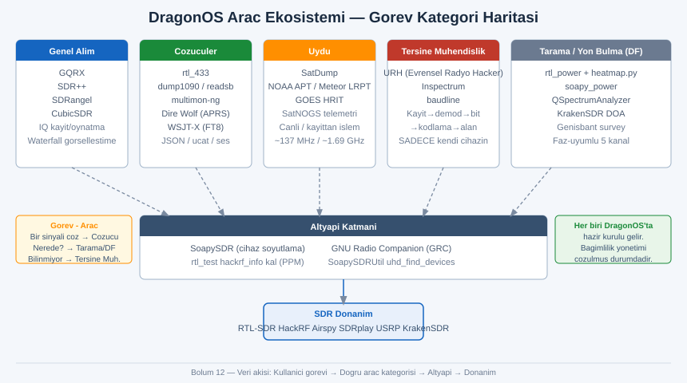
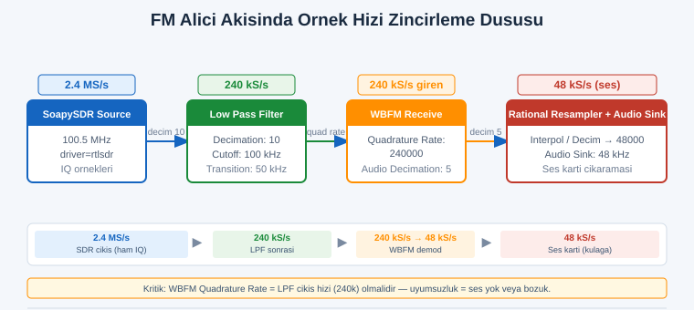
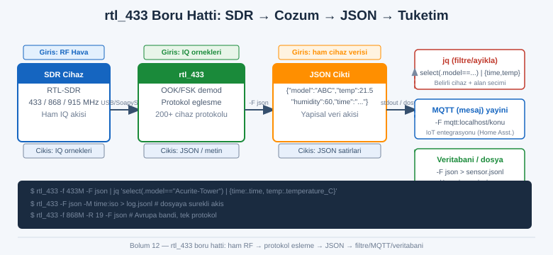

# SIGINT EL KİTABI — BÖLÜM 12: DRAGONOS VE SDR ARAÇ EKOSİSTEMİ

## Fiili Kullanım — Her Aracın Ne İşe Yaradığı, Temel İş Akışı, Örnek Komut ve Tipik Tuzaklar

> Amaç: Önceki bölümler RF fiziğini, donanımı, anteni, demodülasyonu ve sinyal ayıklamayı kavramsal olarak verdi. Bu bölüm ekrandan komut satırına iner: SDR ekosistemindeki araçların her birini fiilen nasıl çalıştırırsın, hangi iş akışına oturur, tipik komut neye benzer ve hangi tuzak seni saatlerce yanlış yerde arattırır. Bu bir reçete değil mühendislik haritasıdır; ama haritanın üstünde gerçek komutlar, gerçek bayraklar (flag) ve gerçek akış grafikleri vardır. Hedef, bir aracı ilk kez açtığında "bu pencere ne, hangi düğme ne yapar, neden ses gelmiyor" duvarına çarpmaman.

> Yasal çerçeve: Bu bölümdeki her komut ve iş akışı, serinin geri kalanıyla aynı çizgiye tabidir. Alıcı (RX) araçları geniştir; ama yakaladığın içeriğin kaydı, çözümü veya paylaşımı ülkene göre suç olabilir. Tüm örnekler bilinçli olarak yasal/açık sinyaller (ADS-B, AIS, NOAA/Meteor uydu, FM radyo, kendi IoT sensörlerin, kendi uzaktan kumandan) ve kendi cihazların üzerine kuruludur. Hücresel ve GNSS başlıklarında sınır özellikle nettir: yayın yok, yalnızca kendi test ortamın (kablolu/Faraday) veya pasif gözlem. "Teknik olarak çalıştırabiliyor olmak" yasal olduğu anlamına gelmez. Kendi ülkenin mevzuatını teyit et; bu kitap hukuki danışmanlık değildir.

---

## İÇİNDEKİLER

1. [DragonOS Nedir: Felsefe, Sürümler, Kurulum, Ne Hazır Gelir](#1)
2. [Sistem ve Yardımcı Katman: SoapySDR, Cihaz Testleri, Saat Düzeltme](#2)
3. [Genel Alıcılar: GQRX, SDR++, SDRangel, CubicSDR](#3)
4. [GNU Radio Companion: Blok-Akış Paradigması ve Gerçek Bir FM Akışı](#4)
5. [Çözümleme Araçları: rtl_433, dump1090/readsb, multimon-ng](#5)
6. [Uydu: SatDump ile NOAA/Meteor/GOES Uçtan Uca](#6)
7. [Zayıf Sinyal ve Sayısal Ses: WSJT-X (FT8), Dire Wolf (APRS)](#7)
8. [Tersine Mühendislik: URH, Inspectrum, baudline (Kendi Cihazınla)](#8)
9. [Hücresel Araştırma Çerçevesi: gr-gsm, srsRAN, IMSI-Catcher Tespiti](#9)
10. [Spektrum Tarama: rtl_power + heatmap, soapy_power, QSpectrumAnalyzer](#10)
11. [Yön Bulma: KrakenSDR DOA İş Akışı](#11)
12. [GNSS Test: gps-sdr-sim ve GNSS-SDR (Sınır Net)](#12)
13. [Otomasyon: IQ Kayıt/Oynatma ve Toplu İşleme](#13)
14. [Görev → Araç Seçim Matrisi](#14)
15. [Alıştırmalar (Yasal)](#15)
16. [Hızlı Referans ve Diğer Bölümler](#16)

---

<a id="1"></a>
## 1. DragonOS Nedir: Felsefe, Sürümler, Kurulum, Ne Hazır Gelir



Bölüm 4'te DragonOS'u "her şey kurulu gelen SDR dağıtımı" olarak kısaca tanıttık. Burada onu bir araç olarak ele alıyoruz: ne için var, hangi sorunu çözüyor, nasıl kurulur ve sınırları nelerdir.

### Felsefe: bağımlılık cehennemini hediye paketi yapmak

SDR ekosisteminin acı gerçeği, araçların kendisi değil onları kurmaktır. GNU Radio'nun belirli bir sürümüyle derlenmiş bir `gr-*` eklentisi, `libvolk`, `SoapySDR` modülleri, `librtlsdr` sürümü, Python sanal ortamı, UHD firmware imajları — bunların hepsi birbirine sürüm-bağımlıdır. Tek bir aracı kaynaktan derlemek bir akşamı yiyebilir; on aracı uyumlu kurmak çoğu yeni başlayanın havlu attığı yerdir.

DragonOS'un felsefesi tam bu noktada doğar: deneyimli bir derleyici (Aaron, "cemaxecuter") tüm bu araçları önceden derler, sürüm uyumunu çözer ve çalışan bir Ubuntu imajı olarak paketler. Sen indirir, USB'ye yazar, açar ve `gnuradio-companion` yazıp doğrudan akış kurmaya başlarsın. Felsefe "kurulumu öğrenme, sinyali öğren" diye özetlenebilir.

Not: Bu aynı zamanda DragonOS'un *sınırıdır*. Hazır gelen sürümler imajın çıktığı andaki sürümlerdir; aylar sonra bir aracın yeni özelliğini istiyorsan ya imajı güncellersin ya da o aracı elle güncellersin. Üretim istasyonu için çoğu mühendis sonunda kendi Ubuntu/Debian kurulumuna geçer (Bölüm 4'teki yol haritası). DragonOS öğrenme ve hızlı saha denemesi için idealdir; "tek doğru OS" değildir.

### Sürümler

DragonOS'un birden çok dağıtım hattı vardır; isimler ve sürümler zamanla değişir, bu yüzden somut sürüm numarası yerine *hatları* bilmek daha kalıcıdır:

| Hat | Tabanı / hedefi | Tipik kullanım |
|---|---|---|
| DragonOS FocalX | Ubuntu masaüstü (X11/masaüstü ortamı), x86-64 | Dizüstü/masaüstü, canlı USB, VM; en yaygın başlangıç |
| DragonOS (Pi / ARM hattı) | Raspberry Pi / ARM SBC | Taşınabilir/gömülü istasyon, alan dağıtımı |
| Daha yeni LTS tabanlı hatlar | Güncel Ubuntu LTS | Daha yeni çekirdek/sürücü isteyen donanım |

Pratikte: Hangi sürümü indireceğine donanımına göre karar ver. x86-64 dizüstün varsa masaüstü hattı; Pi tabanlı taşınabilir kutu kuruyorsan ARM hattı. Tam sürüm adı ve indirme bağlantısı zamanla değiştiği için resmî dağıtım sayfasından teyit edilmeli.

### Ne hazır gelir

İmajın değeri, içinden çıkanların listesinde görülür. Tipik bir DragonOS imajında şunlar önceden kurulu ve çalışır gelir (sürüme göre değişir, teyit edilmeli):

- Çekirdek altyapı: SoapySDR ve cihaz modülleri (rtlsdr, hackrf, airspy, uhd, limesuite, sdrplay), GNU Radio + GNU Radio Companion, `gr-*` eklentileri (gr-osmocom, gr-gsm, gr-satellites vb.)
- Genel alıcılar: GQRX, SDR++, SDRangel, CubicSDR
- Çözücüler: rtl_433, dump1090/dump978/readsb, multimon-ng, Dire Wolf, WSJT-X, SatDump
- Tersine mühendislik: URH (Universal Radio Hacker), Inspectrum
- Tarama/DF: rtl_power, soapy_power, QSpectrumAnalyzer, KrakenSDR DOA yazılımı
- Komut araçları: rtl_test, rtl_sdr, rtl_fm, rtl_power, hackrf_info, hackrf_transfer, SoapySDRUtil, uhd_find_devices

Yani Bölüm 4-7 ve bu bölümün anlattığı araçların neredeyse tamamı, DragonOS'ta "indir-aç-çalıştır" mesafesindedir. Bu bölümdeki komutların büyük kısmı DragonOS'ta hiçbir kurulum yapmadan denenebilir.

### Kurulum / canlı USB

DragonOS bir `.iso` imajı olarak dağıtılır ve standart bir Linux canlı USB gibi davranır:

```
# 1) İmajı indir (resmî kaynak / SourceForge — adres teyit edilmeli)
#    dosya: DragonOS_FocalX_*.iso  (örnek isim; sürüme göre değişir)

# 2) USB'ye yaz (en az 16 GB önerilir; imaj büyük)
#    Linux'ta (HEDEF DİSKİ DOĞRULA — yanlış disk = veri kaybı):
lsblk                                  # USB'nin doğru adını bul (örn /dev/sdb)
sudo dd if=DragonOS_FocalX.iso of=/dev/sdX bs=4M status=progress conv=fsync
sync

#    Daha güvenli/çapraz-platform alternatif: balenaEtcher veya Rufus (Windows) ile yaz.

# 3) BIOS/UEFI'den USB'den boot et → "Try" (canlı) veya "Install" seç.
```

> Uyarı: `dd` komutunda `of=` hedefini yanlış vermek, çalışan diskini geri dönülmez biçimde silebilir. Yazmadan önce `lsblk` çıktısında USB'nin boyutundan ve adından kesin emin ol. Kararsızsan grafik araç (Etcher/Rufus) kullan; bu araçlar hedef diski daha görünür yapar.

Not: Canlı USB modunda yaptığın çalışma, kalıcı (persistence) bölüm ayarlamadıysan yeniden başlatınca kaybolur. Sürekli kullanacaksan ya kalıcılık ayarla ya da bare-metal/VM kur.

### Donanım uyumu

DragonOS Linux çekirdeği üzerinde çalıştığı için donanım uyumu büyük ölçüde "Linux SDR sürücüleri var mı" sorusudur ve cevap genelde evettir: RTL-SDR (V3/V4), HackRF, Airspy (Mini/R2/HF+), SDRplay (RSP serisi), LimeSDR, USRP (UHD), PlutoSDR, KrakenSDR. RTL-SDR V4 gibi daha yeni donanımlar için imajın yeterince güncel `librtlsdr` içermesi gerekir; eski imajda V4 görünmeyebilir, bu durumda `librtlsdr` güncellenir (Bölüm 4'teki V4 notuyla bağlantılı).

Pratikte: Yeni bir donanım takıp `SoapySDRUtil --find` çalıştırdığında cihaz listelenmiyorsa, sorun neredeyse her zaman ya USB geçişi (VM kullanıyorsan) ya da sürücü sürümüdür; donanım arızası en son ihtimaldir (Bölüm 4, sorun→çözüm mantığı).

### VM mi, bare-metal USB mi?

Bu, Bölüm 4'te ayrıntılı işlenen "USB geçişi tuzağı"nın DragonOS özelindeki halidir:

| Yaklaşım | Artı | Eksi / tuzak |
|---|---|---|
| VM (VirtualBox/VMware) içinde DragonOS | Ana OS'unu (Windows) bozmadan dene; snapshot al | USB geçişi kurmak gerekir; yüksek örnek hızında USB throughput'u düşebilir → örnek düşmesi (sample drop) |
| Canlı USB (bare-metal) | USB tam hız, donanıma doğrudan erişim | Ana diskine dokunmaz ama her açılışta sıfırdan (kalıcılık yoksa) |
| Bare-metal kurulum | En yüksek performans, kalıcı | Diske kurulum; ayrı makine/bölüm gerekir |

> Pratikte: Yalnızca RTL-SDR ile düşük örnek hızında (≤2.4 MS/s) deneme yapıyorsan VM yeter. HackRF/USRP ile 10-20 MS/s gibi yüksek hızlarda çalışacaksan, VM'in USB katmanı tıkanır ve "O" (overflow) harfleri akmaya başlar; bare-metal canlı USB veya kurulum şart. KrakenSDR gibi çok-kanallı cihazlarda da bare-metal tercih edilir.

Çapraz referans: OS seçimi, sürücü katmanı, Zadig/blacklist ve VM-USB geçişi tuzakları Bölüm 4'te uçtan uca işlenir. Bu bölüm "OS kuruldu, araçlar var" noktasından sonrasına, yani araçların fiili kullanımına odaklanır.

---

<a id="2"></a>
## 2. Sistem ve Yardımcı Katman: SoapySDR, Cihaz Testleri, Saat Düzeltme

Herhangi bir alıcıyı veya akışı açmadan önce iki şeyi doğrulamak, sonraki tüm saatleri kurtarır: (1) işletim sistemi cihazı gerçekten görüyor mu, (2) cihazın saati (frekans doğruluğu) ne kadar kaymış. Bu yardımcı katman görünüşte sıkıcıdır ama atlanırsa üstteki her araç "çalışmıyor gibi" davranır.

### SoapySDR: cihaz soyutlama katmanı

SoapySDR, farklı SDR donanımlarını tek bir ortak arayüz altında toplayan bir soyutlama katmanıdır (Bölüm 4'te tanıtıldı). Bunun fiili faydası: GQRX, SDRangel, SatDump gibi araçlara "şu cihazı kullan" demek yerine "SoapySDR üzerinden ne varsa" dersin ve araç donanımı otomatik bulur. İlk komutun her zaman cihaz keşfi olmalı:

```
# Bağlı tüm SDR cihazlarını listele (hangi donanım, hangi sürücü)
SoapySDRUtil --find

# Tipik çıktı (örnek):
# Found device 0
#   driver = rtlsdr
#   label  = Generic RTL2832U OEM :: 00000001
#   serial = 00000001
```

Cihaz listelendikten sonra yeteneklerini sorgula:

```
# Belirli cihazın detaylı yeteneklerini (kazanç aralığı, örnek hızları, antenler) göster
SoapySDRUtil --probe="driver=rtlsdr"

# Çıktıda göreceklerin: desteklenen sample rate listesi, gain elemanları (LNA/VGA),
# frekans aralığı, anten portları, saat kaynakları.
```

> Pratikte: `--find` cihazı gösteriyor ama `--probe` hata veriyorsa, cihaz başka bir uygulama tarafından "kapılmış" (claimed) olabilir — çoğu SDR aynı anda tek istemciye açılır. Açık GQRX/SDR++ pencerelerini kapat, sonra tekrar dene. `usb_claim_interface -6` benzeri hatalar genelde bu çakışmadan veya eksik izinden (udev kuralı) gelir; bu hatanın kökü Bölüm 4'te.

### Cihaz testleri: rtl_test, hackrf_info

Donanımın canlı ve sağlam olduğunu doğrulamak için cihaza özel test araçları vardır:

```
# RTL-SDR: cihazı aç, örnek akışını test et, düşen örnekleri (sample loss) raporla
rtl_test

# Daha agresif: belirli örnek hızında stres testi (örn 2.4 MS/s)
rtl_test -s 2400000

# Tipik anlamı: "lost at least N bytes" satırları çok sıksa → USB yolu/güç/hub sorunu.
```

`rtl_test` ayrıca tuner tipini ve desteklenen kazanç değerlerini basar; bu, hangi tuner'a (R820T2, R828D vb.) sahip olduğunu öğrenmenin en hızlı yoludur. HackRF için karşılığı:

```
# HackRF: cihazı bul, firmware ve seri numarasını göster
hackrf_info

# Çıktıda: Serial number, firmware version, part ID.
# 'hackrf_info' cihazı bulamıyorsa → USB/güç/firmware sorunu; donanım en son ihtimal.
```

Diğer donanımlar için eşdeğerleri: Airspy `airspy_info`, SDRplay için API servisi + `SoapySDRUtil --probe`, USRP için `uhd_find_devices` ve `uhd_usrp_probe`, LimeSDR için `LimeUtil --find`.

### PPM / saat düzeltme: neden ve nasıl

Her SDR'ın içinde bir kristal osilatör vardır ve hiçbiri tam değildir. Ucuz RTL-SDR'larda saat birkaç ila birkaç on ppm (milyonda bir) kayabilir. Bunun pratik sonucu: 100 MHz'e ayarladığın alıcı aslında 100 MHz ± birkaç kHz dinler. ADS-B gibi geniş sinyallerde bu önemsizdir; ama dar bir sinyali (örneğin bir narrowband FM telsiz veya FT8 penceresi) tam ortalamak istediğinde, bu kayma sinyali pencereden kaydırır.

Saat kaymasını ölçmenin pratik yolu, frekansı *bilinen* bir referansa kilitlemektir. En yaygın referanslar: GSM downlink taşıyıcısı (gr-gsm'in `kalibrate` aracı, aşağıda) veya bilinen bir yayın/işaretçi.

```
# kalibrate-rtl (kal): GSM bandını tarayıp güçlü downlink taşıyıcılarını bul
kal -s GSM900            # GSM900 bandındaki kanalları tara (bölgene göre band değişir)

# Bulunan bir kanalı kullanarak PPM ofsetini ölç:
kal -c <kanal_no>        # çıktı: "average absolute error: X ppm"
```

Ölçtüğün ppm değerini sonra her araçta düzeltme olarak girersin:

```
# rtl_fm / rtl_power / rtl_sdr: -p ile ppm düzeltmesi
rtl_fm -f 100.5M -p 42 -M wfm -s 200k -r 48k - | ...
#                  ^^^^ ölçülen ppm

# GQRX, SDR++, SDRangel: cihaz ayarlarında "PPM correction / Freq. correction" alanı.
```

> Not: GSM tabanlı kalibrasyon yalnızca downlink taşıyıcısının *frekansını* referans alır; içerik çözmez, yayın yapmaz. Bu pasif bir ölçümdür. Yine de bölgende GSM900 yerine başka band kullanılıyor olabilir (örneğin GSM1800); bandı teyit et. TCXO'lu (sıcaklık dengelemeli) SDR'larda (RTL-SDR Blog V3/V4, Airspy) kayma çok küçüktür ve çoğu iş için ppm düzeltmesi gerekmeyebilir.

Pratikte minimal başlangıç akışı şudur: `SoapySDRUtil --find` (görüyor mu?) → `rtl_test` (sağlam mı?) → gerekiyorsa `kal` ile ppm ölç → üstteki aracı aç. Bu üç adım, "neden çalışmıyor" sorularının çoğunu daha başlamadan eler.

---

<a id="3"></a>
## 3. Genel Alıcılar: GQRX, SDR++, SDRangel, CubicSDR

Genel alıcılar (general-purpose receivers), spektrumu görsel olarak gezip bir sinyali demodüle edip dinlemeni sağlayan "radyo ön yüzleridir". Hepsi temelde aynı işi yapar — waterfall göster, frekans seç, demodülatör seç, dinle/kaydet — ama felsefeleri farklıdır. Hangisini seçeceğin işine bağlıdır.

### Ortak zihinsel model

Hangi alıcıyı açarsan aç, dört ayar her zaman vardır ve bunları anlamak araçtan bağımsızdır:

```
   ┌─────────────────────────────────────────────────────────────┐
   │  1) Merkez frekans (center freq)  → SDR'ın baktığı orta nokta │
   │  2) Örnek hızı / bant genişliği   → ne kadar geniş görüyorsun │
   │  3) Demodülatör (AM/FM/SSB/...)   → sinyali nasıl çözüyorsun  │
   │  4) Kazanç (gain)                 → ne kadar yükseltiyorsun   │
   └─────────────────────────────────────────────────────────────┘
   Waterfall (zaman-frekans) + spektrum (anlık) bu ayarların sonucudur.
```

Kazanç tuzağı evrenseldir: çok düşük gain → sinyal gürültüye gömülür; çok yüksek gain → ön-uç doyar (overload), her yerde hayalet sinyaller (intermod) belirir. Doğru gain, ilgi sinyalini gürültüden ayıran ama spektrumu "yakmayan" orta noktadır (Bölüm 2-3, dinamik aralık).

### GQRX — "ilk radyom" alıcısı

GQRX, Linux/macOS'ta en yaygın başlangıç alıcısıdır; GNU Radio ve SoapySDR üzerine kuruludur, sade ve kararlıdır. Tek bir kanalı dinlemek, bir sinyali bulup demodüle etmek ve IQ kaydı almak için idealdir.

Tipik iş akışı:

```
1) GQRX'i aç → "Configure I/O devices"
   - Device: SoapySDR üzerinden cihazını seç (veya rtlsdr=... string'i)
   - Input rate: 2.4 MS/s (RTL-SDR için tipik)
2) Merkez frekansı yaz (örn 100.500 MHz, FM radyo).
3) Demod modunu seç: WFM (geniş bant FM, yayın radyosu) / NFM / AM / LSB / USB.
4) "Play" (▶) bas → waterfall akmaya başlar.
5) Sinyalin üstüne tıkla → ses gelir.
6) Kayıt: ses için "Rec audio"; ham IQ için "Rec baseband" (sonra analiz/oynatma).
```

GQRX'in güçlü tarafı: bookmark (yer imi) sistemi, AGC/squelch ayarları, ve ham IQ kaydını dosyaya alıp sonra başka araçla işleyebilmen. Zayıf tarafı: tek-kanallıdır (aynı anda tek demodülatör), çoklu-kanal/çoklu-cihaz işleri için yetersiz.

> Pratikte: GQRX'te "ses yok" sorununun en sık üç nedeni: (a) squelch eşiği sinyalden yüksek (squelch'i kıs), (b) yanlış demod modu (FM yayını AM modunda dinleniyor), (c) ses çıkış aygıtı yanlış seçili. Önce demod modunu ve squelch'i kontrol et.

### SDR++ — modern, çapraz platform, modüler

SDR++, daha yeni nesil bir alıcıdır; Windows/Linux/macOS/Android'de çalışır, modüler (eklenti) mimariye sahiptir ve performansı yüksektir. GQRX'e kıyasla daha akıcı bir arayüz ve daha esnek band planı/etiketleme sunar. Çok sayıda VFO (aynı görünümde birden çok dinleme noktası) destekler.

Tipik iş akışı GQRX'e benzer: source modülünden cihazı seç, frekansı ve örnek hızını ayarla, demodülatör modülünü seç, dinle. Ek olarak band plan üst şeridi, hangi frekansın hangi servise ayrıldığını gösterir (Bölüm 8 ile bağlantılı: frekans tahsisi/band planı).

Pratikte: Tek cihazla genel dinleme ve "neyi nereye bakacağım" için SDR++ çok rahat bir başlangıçtır; band plan şeridi yeni başlayan için Bölüm 8'i ekranda canlı kılar.

### SDRangel — "İsviçre çakısı": çoklu-cihaz, çoklu-kanal, demod fabrikası

SDRangel, bu dördü içinde en güçlü ve en karmaşık olanıdır. Felsefesi: aynı anda birden çok cihazı, her cihazda birden çok kanalı, her kanalda farklı bir eklenti (demodülatör/analizör) çalıştırabilmek. Yani tek RTL-SDR'ın 2.4 MHz'lik penceresinde aynı anda bir ADS-B çözücü, bir NFM demodülatör ve bir spektrum analizörü birlikte koşabilir.

Zihinsel model "cihaz → kanal → eklenti" zinciridir:

```
   [Cihaz 0: RTL-SDR @ 1090 MHz, 2.4 MS/s]
        ├─ Kanal A → ADS-B Demod eklentisi      → uçak listesi
        ├─ Kanal B → AM Demod                    → ses
        └─ Kanal C → Channel Analyzer            → ölçüm

   [Cihaz 1: HackRF @ 433 MHz]   (aynı anda, ayrı pencere)
        └─ Kanal A → ... 
```

SDRangel'in fiilen parladığı yerler: uydu (kendi içinde uydu izleyici ve demodülatörler var), birden çok sinyali eşzamanlı izleme, ve geniş eklenti yelpazesi (DAB, DVB-S, APT, çeşitli sayısal ses). Karşılığında öğrenme eğrisi diktir; ilk açılışta arayüz bunaltıcı gelir.

> Pratikte: SDRangel'e "tek bir FM istasyonu dinleyeyim" diye yaklaşırsan fazla karmaşık gelir — o iş için GQRX/SDR++ daha hızlı. SDRangel'i, *aynı anda birden çok şeyi* izlemen veya çok-cihazlı bir kurulum gerektiğinde aç. Doğru araç-görev eşleşmesi (Bölüm 14 matrisi) burada belirgin.

### CubicSDR — sade, görsel, çapraz platform

CubicSDR, SoapySDR üzerine kurulu, görsel olarak temiz, çapraz platform bir alıcıdır. GQRX ile SDR++ arasında bir yerde durur: tek-kanal odaklı, kolay, waterfall görselleştirmesi güçlü. Hızlı bir spektrum gezintisi ve demodülasyon için iyidir; ileri çoklu-kanal işleri için değildir.

### Hangisini ne zaman

| Alıcı | En iyi olduğu iş | Kaçın |
|---|---|---|
| GQRX | İlk radyo, tek kanal dinleme, IQ kaydı, kararlılık | Çoklu-kanal/çoklu-cihaz |
| SDR++ | Modern tek-cihaz dinleme, band plan, çapraz platform | Çok karmaşık çok-cihaz kurulum |
| SDRangel | Eşzamanlı çoklu-kanal/cihaz, uydu, demod çeşitliliği | "Sadece bir istasyon dinleyeceğim" |
| CubicSDR | Sade görsel gezinme, hızlı demod | İleri otomasyon/çoklu-kanal |

Hepsi DragonOS'ta kuruludur; ilk gün dördünü de aç ve arayüzlerine bak — hangisinin zihnine oturduğu kişiseldir.

---

<a id="4"></a>
## 4. GNU Radio Companion: Blok-Akış Paradigması ve Gerçek Bir FM Akışı



Genel alıcılar hazır radyolardır; GNU Radio ise radyo *yapma dili*dir. Bölüm 4'te "RF'in programlama dili" olarak tanıtıldı. Burada paradigmasını ve fiilen bir akış kurmayı adım adım işliyoruz, çünkü bir kez kendi FM alıcını bloklardan kurduğunda tüm SDR araçlarının altında ne döndüğünü anlarsın.

### Paradigma: akış grafiği (flowgraph)

GNU Radio'da program yazmazsın, *sinyal akışı* çizersin. Veri (örnek akışı) bloklardan boru gibi geçer: bir **kaynak** (source) örnek üretir, ara **işlem blokları** (filtre, çarpıcı, demodülatör) örnekleri dönüştürür, bir **sink** örnekleri tüketir (sese çevirir, ekrana çizer, dosyaya yazar). GNU Radio Companion (GRC), bu grafiği fareyle çizdiğin grafik editörüdür ve grafiği çalıştırılabilir Python'a derler.

Üç blok türü:

```
   KAYNAK (source)            AKIŞ BLOĞU (processing)         SINK (tüketici)
   ─────────────────          ───────────────────────         ──────────────
   örnek ÜRETİR               örneği DÖNÜŞTÜRÜR                örneği TÜKETİR
   - SoapySDR Source          - Low Pass Filter               - Audio Sink
   - osmocom Source           - Rational Resampler            - QT GUI Freq Sink
   - File Source (IQ oku)     - Multiply / Frequency Xlating  - File Sink (IQ yaz)
   - Signal Source            - WBFM/NBFM Receive             - QT GUI Waterfall
```

Akış grafiğindeki en kritik kavram **örnek hızı uyumu**dur. Her bağlantıda üst bloğun ürettiği örnek hızı ile alt bloğun beklediği hız uyumlu olmalı; uyumsuzluk ya sessizlik ya da "aliasing/cızırtı" üretir. Hız değişimi için yeniden örnekleyici (resampler) blokları konur. İkinci kritik kavram **throttle**: eğer akışta gerçek bir donanım yoksa (örneğin File Source veya Signal Source ile simülasyon), CPU akışı sonsuz hızda işlemeye çalışır ve çekirdeği kilitler; Throttle bloğu akışı gerçek-zamana yavaşlatır. Donanım kaynağı (SoapySDR/osmocom) zaten gerçek-zaman dayattığı için Throttle gerekmez — hatta gereksizdir.

> Not: "Donanım varsa Throttle KOYMA, simülasyonda Throttle KOY" kuralı yeni başlayanın en sık takıldığı yerdir. Donanım kaynağıyla birlikte Throttle koyarsan iki ayrı "saat" çakışır ve örnek düşmesi/tampon sorunları görürsün.

### Gerçek bir akış: SDR'dan FM radyo alıcısı (adım adım)

Aşağıda fiilen kuracağın, çalışan bir geniş-bant FM (WFM, yayın radyosu) alıcısının blok grafiği. Yasal: FM yayın radyosu açık yayındır.

```
 ┌──────────────┐   ┌───────────────┐   ┌──────────────┐   ┌───────────┐   ┌────────────┐
 │ SoapySDR     │   │ Low Pass      │   │ WBFM Receive │   │ Rational  │   │ Audio Sink │
 │ Source       │──▶│ Filter        │──▶│ (demod)      │──▶│ Resampler │──▶│ (48 kHz)   │
 │ 100.5 MHz    │   │ cutoff ~100k  │   │ quad rate    │   │ →48 kHz   │   │            │
 │ 2.4 MS/s     │   │ decim ~10     │   │ in           │   │           │   │            │
 └──────┬───────┘   └───────────────┘   └──────────────┘   └───────────┘   └────────────┘
        │
        └──────────────────────────────────────────────────▶ ┌──────────────────┐
                                                              │ QT GUI Freq Sink │  (spektrumu gör)
                                                              └──────────────────┘
```

Adım adım kurulum (GRC içinde):

```
1) Options bloğu: "Generate Options" = QT GUI (arayüzlü çalışsın).
   Bir 'samp_rate' değişkeni (Variable bloğu) tanımla = 2400000.

2) SoapySDR Source ekle:
   - Device arguments: driver=rtlsdr
   - Sample Rate: samp_rate (2.4 MS/s)
   - Center Freq: 100500000  (100.5 MHz — bölgendeki güçlü bir FM istasyonu)
   - Gain: önce ~30 dB; doyma görürsen düşür.

3) Low Pass Filter ekle:
   - Decimation: 10   (2.4 MS/s / 10 = 240 kS/s → FM kanal genişliğine yaklaş)
   - Cutoff Freq: 100000   (~100 kHz; WFM kanalı ~200 kHz geniştir)
   - Transition Width: 50000

4) WBFM Receive ekle:
   - Quadrature Rate: 240000   (LPF çıkışıyla AYNI — örnek hızı uyumu!)
   - Audio Decimation: 5       (240k / 5 = 48k ses)

5) Rational Resampler (gerekirse) ekle:
   - WBFM çıkışını ses kartı hızına (48 kHz) tam oturt.
   - Interpolation/Decimation değerlerini 48000'e ulaşacak şekilde seç.

6) Audio Sink ekle:
   - Sample Rate: 48000

7) (Görsel) QT GUI Frequency Sink ekle, SoapySDR Source çıkışına bağla → spektrumu gör.

8) "Execute the flow graph" (▶) → ses gelir, spektrum akar.
```

Akışın çalışmasındaki anahtar, her aşamadaki örnek hızının zincir boyunca tutarlı düşmesidir: 2.4 MS/s → (decim 10) → 240 kS/s → (WBFM audio decim 5) → 48 kS/s → ses kartı. Bu zincir tutarsızsa (örneğin WBFM'in quadrature rate'i LPF çıkışıyla uyuşmazsa) ya ses gelmez ya da bozulur.

> Pratikte tipik tuzaklar:
> - WBFM'in "Quadrature Rate"i, kendisine giren akışın hızıyla aynı olmalı. En sık hata bu uyumsuzluktur.
> - Audio Sink'in sample rate'i ses kartının desteklediği bir değer olmalı (48000 güvenli).
> - Donanım kaynağı (SoapySDR Source) varken Throttle ekleme — gerek yok ve zarar verir.
> - Hiç ses yoksa: gain'i artır, doğru ve güçlü bir istasyona ayarla, QT GUI Freq Sink'te sinyalin gerçekten merkez frekansta olduğunu doğrula.

### Flowgraph → Python derleme

GRC'nin altında çalıştırdığın her grafik, bir `.grc` (XML/YAML tanımı) dosyasıdır ve GRC bunu çalıştırılabilir bir `.py` dosyasına derler. "Generate" (⚙) bastığında `top_block.py` (veya verdiğin isim) üretilir. Bunun fiili faydası:

```
# GRC'de tasarla → Generate → çalıştırılabilir Python çıkar:
python3 my_fm_receiver.py

# Bu .py dosyasını elle düzenleyebilir, başka Python kodu/otomasyonla birleştirebilir,
# komut satırı argümanı ekleyebilir, başsız (headless, GUI'siz) çalıştırabilirsin.
```

Yani GRC bir prototipleme aracıdır: grafik olarak tasarlar, Python olarak üretir, sonra istersen koda iner ve otomasyona bağlarsın (Bölüm 13). Bu, "GUI ile çiz, kod olarak dağıt" zincirinin tam kalbidir ve GNU Radio'yu diğer hazır alıcılardan ayıran şeydir.

---

<a id="5"></a>
## 5. Çözümleme Araçları: rtl_433, dump1090/readsb, multimon-ng

Genel alıcılar sinyali *dinletir*; çözücüler sinyali *anlamlı veriye* çevirir. Bu araçlar belirli protokolleri tanır ve ham RF'ten yapısal çıktı (JSON, uçak listesi, mesaj metni) üretir. Hepsi DragonOS'ta kuruludur ve büyük kısmı komut satırından doğrudan çalışır.

### rtl_433 — ISM bandı IoT/sensör çözücüsü



rtl_433, 433/868/915 MHz ISM bantlarındaki yüzlerce cihaz protokolünü (kablosuz hava istasyonu, sıcaklık/nem sensörü, lastik basınç sensörü TPMS, kapı zili, bazı uzaktan kumandalar) tanıyan bir çözücüdür. Adı 433 MHz'den gelir ama başka bantları da destekler. Yasal kullanım: kendi sensörlerini okumak.

```
# Varsayılan: 433.92 MHz'i dinle, tanıdığı tüm cihazları konsola yaz
rtl_433

# JSON çıktı (otomasyon/loglama için) — boru hattının temeli:
rtl_433 -F json

# JSON'u dosyaya akıt (sürekli loglama):
rtl_433 -F json -M time:iso > sensorler.jsonl

# Belirli frekans (örn 868 MHz Avrupa sensörleri):
rtl_433 -f 868M -F json

# Sadece belirli cihaz protokollerini etkinleştir (gürültüyü azalt): -R <numara>
rtl_433 -R 19 -F json     # (protokol numaralarını 'rtl_433 -R help' listeler)
```

JSON çıktısı, rtl_433'ü bir boru hattının başına oturtur: çıktıyı `jq` ile süzebilir, bir MQTT konusuna basabilir, bir veritabanına yazabilirsin.

```
# Örnek boru: yalnızca belirli sensörün sıcaklığını ayıkla
rtl_433 -F json | jq 'select(.model=="...") | {time, temperature_C}'
```

> Pratikte tuzaklar:
> - "Hiçbir şey görünmüyor": yanlış frekans (bölgen 868 mi 915 mi?), zayıf anten, veya cihazın o an yayın yapmaması (çoğu sensör periyodik yayınlar; bekle). rtl_433 -F json -M level ile sinyal seviyelerini görebilirsin.
> - PPM kayması dar sinyalleri kaçırtabilir; gerekirse -p ile düzelt.
> - Çok sayıda "yanlış pozitif" cihaz görüyorsan, -R ile yalnızca beklediğin protokolleri aç.

### dump1090 / readsb — ADS-B (uçak telemetrisi)

dump1090 (ve daha modern çatalı readsb), 1090 MHz'teki ADS-B sinyallerini çözer: uçakların kendi yayınladığı konum, irtifa, hız, kuyruk numarası. Açık yayındır ve klasik "ilk vay be anı" sinyalidir (Bölüm 5).

```
# dump1090 (fa = FlightAware çatalı yaygın): RTL-SDR ile, web arayüzüyle
dump1090-fa --interactive            # terminalde canlı uçak tablosu

# Web haritası + ham veri akışı için ağ portlarını aç:
dump1090-fa --net                    # SBS/BaseStation (30003), Beast (30005) portları

# readsb (modern alternatif) benzer mantıkla, --net ile besleme portları açar.
```

Çıktı tipik olarak iki katmanlıdır: (1) terminalde/`--net` portlarında ham mesaj ve uçak durumu, (2) bir web sunucusu üzerinden harita arayüzü (genelde `http://localhost:8080`). Web arayüzü uçakları gerçek zamanlı haritada gösterir.

```
# Web haritası (kurulum web bileşeniyle birlikte geldiyse):
#   tarayıcıda → http://localhost:8080
# Ham mesaj akışını başka araca beslemek için:
#   nc localhost 30003     # SBS (CSV) akışını oku
```

dump978 ise 978 MHz UAT (ABD'ye özgü ADS-B alt sistemi) içindir; bölgesel olduğunu unutma.

> Pratikte: ADS-B için anten ve konum kritiktir — 1090 MHz yüksek frekanstır, görüş hattı (line of sight) gerekir. Pencere kenarı/çatı büyük fark yaratır. Çok az uçak görüyorsan sorun genelde anten/konum, yazılım değil (Bölüm 3, anten).

### multimon-ng — sayısal mod çözücü borusu (POCSAG vb.)

multimon-ng, demodüle edilmiş bir ses akışını alıp içindeki sayısal modları (POCSAG çağrı cihazı, FLEX, çeşitli AFSK, DTMF, vb.) çözen bir araçtır. Tek başına RF okumaz; girişine bir demodülatör (genelde `rtl_fm`) borusuyla ses besler. Bu "iki aracı boru ile birleştirme" deseni, komut satırı SDR'ının kalbidir.

```
# rtl_fm ile NFM demodüle et → ham ses → multimon-ng'e boru ile ver
rtl_fm -f <frekans> -M fm -s 22050 - | multimon-ng -t raw -a POCSAG1200 -

#  -f <frekans>  : ilgilenilen kanal
#  -M fm         : dar bant FM demod
#  -s 22050      : multimon-ng'in beklediği örnek hızı
#  -t raw        : girdi ham örnek akışı
#  -a POCSAG1200 : etkinleştirilecek çözücü (1200 bps POCSAG)
```

> Yasal uyarı: POCSAG/çağrı cihazı mesaj *içeriği* özel haberleşmedir ve çoğu ülkede çözmek/kaydetmek suçtur (Bölüm 0/6). Buradaki örnek, boru-hattı mekaniğini (rtl_fm → multimon-ng) göstermek içindir; içerik çözme amaçlı değildir. multimon-ng'i yasal olarak kendi ürettiğin bir AFSK/DTMF test sinyalini çözmek için kullanabilirsin.

Bu üç araç (rtl_433, dump1090/readsb, multimon-ng) birlikte komut-satırı SDR'ının üç temel desenini öğretir: doğrudan-çözücü (rtl_433), kendi-ön-yüzlü-servis (dump1090 web) ve boru-hattı-çözücü (rtl_fm | multimon-ng).

---

<a id="6"></a>
## 6. Uydu: SatDump ile NOAA/Meteor/GOES Uçtan Uca

Uydu görüntüleme, SDR'ın en tatmin edici yasal uygulamalarından biridir: alçak yörüngeli hava uydularından (NOAA APT, Meteor LRPT) veya jeostatik uydulardan (GOES HRIT) doğrudan kendi anteninle görüntü almak. SatDump, bu işin modern, hepsi-bir-arada aracıdır ve hem canlı hem kayıttan işleme yapar. Yasal: bu uydular açık, şifresiz yayın yapar.

### SatDump'ın iki kullanım kipi

```
   KİP 1: Canlı (live)         KİP 2: Kayıttan (offline)
   ──────────────────         ─────────────────────────
   SDR'dan doğrudan al        Önce IQ kaydet (.wav/.cf32),
   ve aynı anda işle          sonra SatDump'a dosyayı ver
        │                            │
   geçiş anında çalışır       geçişi kaçırma riski yok;
   (uydu üstten geçerken)     tekrar tekrar işleyebilirsin
```

Yeni başlayan için önerilen yol Kip 2'dir: önce geçiş sırasında ham IQ'yu kaydet, sonra rahatça işle. Çünkü canlı işlemede bir parametre yanlışsa geçiş biter ve görüntü kaçar; kayıttan işlemede aynı kaydı istediğin kadar farklı ayarla deneyebilirsin.

### NOAA APT uçtan uca (kayıttan işleme)

NOAA-15/18/19 (sürüm/aktiflik teyit edilmeli) ~137 MHz'te APT (Automatic Picture Transmission) yayını yapar; geniş-bant FM benzeri bir sinyaldir.

```
ADIM 1 — Geçiş zamanını bul:
   Bir uydu geçiş takip aracı/sitesi ile NOAA'nın senin konumundan
   ne zaman geçeceğini (yükseliş açısı yüksek geçişler daha iyi) öğren.

ADIM 2 — Geçiş sırasında IQ kaydet (~137 MHz, uygun band genişliği):
   # rtl_sdr ile ham IQ dosyaya (örnek hızı APT için düşük yeter):
   rtl_sdr -f 137100000 -s 250000 -g 45 noaa_pass.iq
   # (frekansı ilgili NOAA uydusunun APT frekansına ayarla; -p ile ppm düzelt)

ADIM 3 — SatDump ile işle:
   - SatDump GUI'yi aç → "Offline processing"
   - Input: noaa_pass.iq, sample format ve sample rate'i kayıtla aynı gir
   - Pipeline: "NOAA APT" seç
   - Start → SatDump demodüle eder, senkronize eder, görüntüyü üretir.

ADIM 4 — Çıktılar:
   - Ham APT görüntüsü (iki kanal: görünür + kızılötesi)
   - SatDump ek işlemler sunar: yağmur/sıcaklık paletleri, coğrafi referanslama.
```

> Pratikte: APT'de görüntü kalitesini en çok belirleyen anten ve geçiş geometrisidir. ~137 MHz için dairesel polarize bir anten (turnike/QFH) önemli fark yaratır; basit dipolle de görüntü alınır ama gürültülü olur (Bölüm 3). Düşük yükseliş açılı geçişlerde (ufka yakın) sinyal zayıf ve parazitlidir; 40°+ geçişleri tercih et.

### Meteor LRPT (sayısal, daha keskin görüntü)

Meteor-M serisi (aktiflik/sürüm teyit edilmeli) APT yerine LRPT (sayısal QPSK) yayını yapar; bu daha keskin, renkli görüntü verir ama demodülasyon daha hassastır (QPSK, doğru sembol hızı ve senkron gerekir).

```
   Akış aynı: geçiş sırasında ~137 MHz civarı IQ kaydet → SatDump'ta "Meteor LRPT" pipeline.
   SatDump senkron ve hata düzeltmeyi (Viterbi/Reed-Solomon) kendi yapar.
```

LRPT'nin APT'ye göre tuzağı: sayısal olduğu için "ya tutar ya tutmaz" eşiği daha keskindir; sinyal yeterince güçlü değilse görüntü hiç çıkmaz (analog APT'de zayıf sinyal "karlı" da olsa bir şeyler verir). Bu, sayısal vs analog farkının (Bölüm 1, Bölüm 6) görsel kanıtıdır.

### GOES HRIT (jeostatik, sürekli, ileri seviye)

GOES (ve benzeri jeostatik hava uyduları) sabit bir noktada durur; bir kez yönlendirilmiş bir anten (tipik olarak yönlü/dish + LNA) ile sürekli görüntü akışı (full-disk Dünya görüntüleri) alabilirsin. Frekans ~1.69 GHz (L-band) civarıdır ve daha fazla donanım (LNA, uygun anten) ister.

```
   SatDump → "GOES HRIT" pipeline; girişe canlı SDR (Airspy gibi düşük gürültülü) veya kayıt.
   Jeostatik olduğu için anteni bir kez doğru azimut/elevasyona kilitlersin — geçiş beklemek yok.
```

> Not: GOES, NOAA/Meteor'a göre ciddi bir adımdır: doğru anten yönlendirmesi, L-band LNA ve kararlı bir kurulum gerektirir. Yeni başlayan için önerilen sıra NOAA APT → Meteor LRPT → GOES HRIT'tir. Hangi uydunun aktif/yayında olduğu zamanla değişir; teyit edilmeli.

SatDump'ın değeri, bu üç farklı uydu/format için tek bir araçta uçtan uca (demod → senkron → hata düzeltme → görüntü → coğrafi referans) zincir sunmasıdır. Eskiden bu iş birkaç ayrı araç (WXtoImg + ayrı demodülatörler) gerektirirken, SatDump tek pencerede toplar.

---

<a id="7"></a>
## 7. Zayıf Sinyal ve Sayısal Ses: WSJT-X (FT8), Dire Wolf (APRS)

Bu iki araç, amatör radyo dünyasının iki güçlü gösterimini sunar: gürültünün altındaki sinyali çözmek (WSJT-X/FT8) ve sayısal paket konumu çözmek (Dire Wolf/APRS). İkisi de yasal amatör/açık sinyallerle çalışır.

### WSJT-X — FT8 ve zayıf sinyal modları (RX)

WSJT-X, FT8/FT4/JT65 gibi *gürültünün altında* çalışmak için tasarlanmış sayısal modları çözer. FT8'in olağanüstü yanı: -20 dB SNR civarında, yani kulağın hiçbir şey duymadığı gürültü seviyesinin altında, dünyanın öbür ucundaki bir istasyonu çözebilmesidir. Bu, ileri hata düzeltme + dar bant + senkronizasyonun (Bölüm 1, Shannon limiti sezgisi) somut kanıtıdır.

Fiili kullanım (yalnızca RX/dinleme):

```
1) SDR'ı bir FT8 bandına ayarla (örn 20m bandı FT8 frekansı; band/frekans teyit edilmeli).
   - SDR alıcısının (GQRX/SDR++) ses çıkışını WSJT-X'in ses girişine yönlendir
     (sanal ses kablosu / VB-Cable / PulseAudio loopback).
   - VEYA SDR'ı USB modunda dinle, sesi WSJT-X'e ver.
2) WSJT-X'te:
   - Mode: FT8
   - Band/frekans seç; ses giriş aygıtını SDR'ın çıkışına ayarla.
   - Zaman senkronu KRİTİK: FT8 15 saniyelik pencerelerde çalışır;
     bilgisayar saatin NTP ile ~1 saniyeden iyi senkron olmalı (yoksa hiç çözmez).
3) WSJT-X her 15 saniyede bir "Band Activity" panelinde çözülen istasyonları listeler:
   çağrı işareti, grid kare, SNR.
```

> Pratikte en sık iki tuzak: (1) Zaman senkronu — saat birkaç saniye kaymışsa FT8 hiçbir şey çözmez; NTP'yi düzelt. (2) Ses yönlendirme — SDR'ın sesini WSJT-X'in girişine bağlamak (sanal ses kablosu) yeni başlayanı en çok uğraştıran adımdır. Doğru ses aygıtı seçilince akış başlar.

Not: Bu akış tamamen alıcıdır; FT8 ile *yayın* yapmak amatör radyo lisansı gerektirir (Bölüm 0). Burada anlatılan yalnızca dinleme/çözme tarafıdır.

### Dire Wolf — APRS / AX.25 paket (TNC yazılımı)

Dire Wolf, bir yazılım TNC'sidir (Terminal Node Controller): AX.25 paket radyosunu, özellikle APRS'i (Automatic Packet Reporting System — amatör konum/telemetri paketleri) çözer. APRS, amatörlerin konum, hava, kısa mesaj yayınladığı açık bir sistemdir (Bölüm 5).

Tipik boru hattı, multimon-ng deseninin kardeşidir: bir demodülatör (rtl_fm) APRS frekansını NFM olarak ses akışına çevirir, Dire Wolf bu sesi alıp paketleri çözer.

```
# rtl_fm ile APRS frekansını (bölgesel; örn 144.800 MHz Avrupa / 144.390 ABD) demod et
# → Dire Wolf'a ses borusu (Dire Wolf stdin'den ham ses okuyabilir)

rtl_fm -f 144.800M -M fm -s 24000 - | direwolf -c direwolf.conf -r 24000 -t 0 -

#  -c direwolf.conf : Dire Wolf yapılandırması (ses aygıtı/modem ayarı)
#  -r 24000         : ses örnek hızı (rtl_fm ile uyumlu)
#  -t 0             : terminal renklerini kapat (loglama için temiz çıktı)
```

Dire Wolf çözdüğü her paketi terminalde (kaynak çağrı işareti, konum, mesaj) gösterir; ayrıca bir KISS/AGW TCP portu açarak APRS istemcilerine (örn Xastir, YAAC) veri besleyebilir. Böylece çözülen konumlar bir haritada görünür.

> Pratikte: Dire Wolf'un en güçlü yanı sağlam demodülatörüdür; gürültülü sinyalleri donanım TNC'lerden daha iyi çözebilir. Tuzak yine örnek hızı uyumu (rtl_fm `-s` ile Dire Wolf `-r` aynı olmalı) ve doğru bölgesel APRS frekansını seçmektir.

İki aracın ortak dersi: zayıf-sinyal (FT8) ve paket (APRS) çözümünün her ikisinde de *zamanlama ve ses-yolu* doğruluğu, RF'in kendisi kadar önemlidir. FT8 saate, APRS örnek hızına hassastır.

---

<a id="8"></a>
## 8. Tersine Mühendislik: URH, Inspectrum, baudline (Kendi Cihazınla)

Şimdiye kadarki araçlar *bilinen* protokolleri çözdü. Tersine mühendislik araçları, *bilinmeyen* bir sinyali sıfırdan anlamak içindir: kaydet, görselleştir, modülasyonu ve sembol hızını çöz, bitlere indir, kodlamayı kır, alanları etiketle. Bu bölümün yasal çizgisi katıdır: bu işi **yalnızca kendi cihazınla** yap (kendi uzaktan kumandan, kendi 433 MHz kapı zilin, kendi IoT sensörün). Başkasının haberleşmesini çözmek değildir.

### URH (Universal Radio Hacker) — uçtan uca tersine mühendislik

URH, kayıt → demodülasyon → bit hizalama → kodlama çözme → alan etiketleme zincirinin tamamını tek pencerede yapan araçtır. Yeni başlayan için en bütünleşik tersine mühendislik aracıdır.

Uçtan uca iş akışı (kendi 433 MHz uzaktan kumandanla):

```
ADIM 1 — KAYDET (Record):
   URH → "Record signal"
   - Cihaz: SoapySDR/RTL-SDR
   - Frekans: 433.92 MHz (kumandanın bandı)
   - Örnek hızı: ~1-2 MS/s
   - Kumandanın düğmesine bas → kısa burst kaydedilir.

ADIM 2 — GÖRSELLEŞTİR & DEMODÜLE ET (Interpretation):
   - Kaydı aç; URH otomatik modülasyon tahmini yapar (ASK/OOK, FSK, PSK).
   - Çoğu ucuz kumanda OOK (on-off keying) kullanır → URH "ASK" seçer.
   - "Samples per Symbol" (sembol başına örnek) ayarını otomatik/elle düzelt:
     bu, ham dalgayı doğru bit dizisine çevirmenin anahtarıdır.

ADIM 3 — BİT HİZALAMA (Demodulated bits):
   - URH ham örnekleri 0/1 dizisine çevirir.
   - Aynı düğmeye birkaç kez basıp kaydettiysen, tekrar eden ortak biti
     (preamble + sabit kısım) görürsün — bu hizalamayı doğrular.

ADIM 4 — KODLAMA ÇÖZ (Decoding):
   - Ham bitler genelde bir hat kodlamasıyla taşınır (Manchester, ters çevirme vb.).
   - URH'nin "Decoding" sekmesinde Manchester/Differential gibi çözücüler dene;
     doğru çözücüyle bit deseni "düzleşir" ve anlamlı hale gelir.

ADIM 5 — ALAN ETİKETLEME (Analysis / Protocol):
   - Birden çok mesajı yan yana koy; değişen ve sabit alanları işaretle:
     preamble, senkron sözcüğü, adres/ID, komut, sağlama (CRC/checksum).
   - URH alanları renklendirir; böylece "hangi bitler ne anlama geliyor" çıkar.

(İLERİ — yalnızca kendi cihazın) ADIM 6 — ÜRETME (Generation):
   - URH çözdüğün çerçeveyi yeniden üretip KENDİ cihazına gönderebilir
     (TX yetenekli SDR ile). Bu YALNIZCA kendi cihazını test etmek içindir;
     başkasının sistemine göndermek yasa dışıdır (Bölüm 0/6).
```

> Yasal sınır (kritik): URH'nin üretme/gönderme (Generation/TX) yeteneği güçlüdür ve kötüye kullanıma açıktır. Bu kitabın çizgisi net: TX yalnızca *kendi cihazına, kendi laboratuvarında* uygulanır; başkasının garaj kapısına, arabasına, alarmına yönelik her kullanım suçtur ve etik dışıdır. Bölüm 6'daki replay/spoofing tartışması bu sınırı ayrıntılandırır.

URH'nin gücü, beş ayrı işi (kayıt/demod/bit/kod/alan) tek araçta birleştirmesidir; eskiden bu iş GNU Radio + ayrı bit araçları + elle hizalama gerektirirdi.

### Inspectrum — kayıt görselleştirme ve elle ölçüm

Inspectrum, bir IQ kaydını yüksek çözünürlüklü bir spektrogramda (zaman-frekans) gösteren ve üzerinde *elle ölçüm* yapmanı sağlayan bir araçtır. URH otomatik tahmin yaparken, Inspectrum sana sinyali "büyüteçle" inceleten ve sembolleri gözle saydıran araçtır.

```
# IQ kaydını aç (örn URH veya rtl_sdr ile alınmış .cf32 / .iq dosyası)
inspectrum kayit.cf32
#   --rate <samp_rate>  ile örnek hızını ver

# İçeride:
#  - Spektrogramda burst'ü bul, yakınlaş.
#  - "Power plot" ekle → sembol geçişlerini (OOK için açık/kapalı) gözle gör.
#  - Cursors (imleçler) ile bir sembolün süresini ölç → sembol hızını (baud) hesapla:
#       baud ≈ 1 / sembol_süresi
#  - Bu ölçtüğün sembol hızını URH'de "samples per symbol" ayarına geri besle.
```

> Pratikte: URH ve Inspectrum bir takımdır. Bilinmeyen bir sinyalde URH'nin otomatik sembol-hızı tahmini tutmuyorsa, Inspectrum'da bir sembolün süresini imleçle elle ölçer, baud'u hesaplar ve URH'ye doğru değeri verirsin. Görsel ölçüm, otomatik tahminin tıkandığı yerde kurtarır.

### baudline — sinyal analizörü ve gürültü görselleştirici

baudline, gerçek-zamanlı ve kayıttan çalışan bir sinyal/spektrum analizörüdür; özellikle ince spektral yapıyı, gürültü tabanını ve modülasyon detayını görselleştirmekte güçlüdür. Inspectrum'a göre daha çok "spektral mikroskop" karakterindedir; bir sinyalin spektral imzasını, yan bantlarını, modülasyon türünü gözle tanımaya yardım eder.

```
# baudline'a ham örnek akışı borusu (örn rtl_sdr çıktısını ver) veya dosya aç.
# Tipik kullanım: bir sinyalin spektrumunu/spektrogramını detaylı incele,
# modülasyon türünü (FSK'nin iki tonu, PSK'nin faz sıçramaları) gözle tanı.
```

Not: baudline sürüm/dağıtım açısından eski bir araçtır ve bazı dağıtımlarda elle kurulması gerekebilir; DragonOS'ta varlığı sürüme göre değişir, teyit edilmeli. İşlevsel olarak Inspectrum çoğu tersine mühendislik ihtiyacını karşılar; baudline daha çok derin spektral inceleme için bir tamamlayıcıdır.

Üçlünün rol dağılımı: URH = uçtan uca otomatik zincir; Inspectrum = elle sembol/zaman ölçümü; baudline = derin spektral inceleme. Bilinmeyen bir sinyalde tipik akış URH ile başlar, tıkanınca Inspectrum'da ölçer, spektral şüphe varsa baudline'da bakar.

---

<a id="9"></a>
## 9. Hücresel Araştırma Çerçevesi: gr-gsm, srsRAN, IMSI-Catcher Tespiti

Bu başlık, kitabın en hassas yasal çizgisini taşır ve bu yüzden önce sınırı, sonra araçları koyuyoruz. Hücresel (GSM/LTE/5G) sistemler, *kullanıcı içeriği* açısından çoğu ülkede dinlenmesi/çözülmesi kesin suç olan haberleşmelerdir (Bölüm 0, TCK 132-140; Bölüm 6). Burada hiçbir araç kullanıcı trafiği çözmek için anlatılmaz. Anlatılanlar: (a) yalnızca downlink kontrol/yayın kanallarının *prensip düzeyinde* gözlemi, (b) kendi izole test hücreni kurma çerçevesi, (c) savunma amaçlı IMSI-catcher tespiti.

### Yasal çerçeve (önce bu)

```
   ┌───────────────────────────────────────────────────────────────────────┐
   │  YASAL ÇİZGİ — HÜCRESEL                                                 │
   │                                                                         │
   │  ✓ İZİN VEREBİLEN (yine de yerel mevzuat teyit):                        │
   │    - Downlink YAYIN/kontrol kanalı varlığını gözlemlemek (içerik yok):  │
   │      hangi hücreler var, kanal numaraları, sistem bilgisi yayını.       │
   │    - KENDİ izole test hücreni (srsRAN) Faraday kafeste/kablolu kurmak.  │
   │    - Savunma: IMSI-catcher TESPİT araçları çalıştırmak.                 │
   │                                                                         │
   │  ✗ SUÇ (anlatılmaz, yapılmaz):                                          │
   │    - Kullanıcı SES/SMS/veri trafiğini yakalamak/çözmek.                 │
   │    - Şifre çözme, kimlik kırma, abone takibi.                           │
   │    - Sahte baz istasyonu (IMSI-catcher) KURMAK/yayın yapmak.            │
   │    - Başkasının cihazına/aboneliğine yönelik her işlem.                 │
   └───────────────────────────────────────────────────────────────────────┘
```

### gr-gsm — yalnızca downlink kontrol/yayın gözlemi (prensip)

gr-gsm, GSM downlink (baz→telefon) yönündeki *yayın ve kontrol* kanallarını gözlemlemek için bir GNU Radio eklenti setidir. Akademik/eğitim çerçevesinde fiili meşru kullanımı, bir hücrenin var olduğunu ve hangi kontrol kanallarını yayınladığını *prensip olarak* görmek ve kalibrasyon (ppm ölçümü) yapmaktır. Kullanıcı içeriği değildir.

```
# 1) GSM downlink taşıyıcılarını bul (kalibrasyon aracı — frekans referansı):
kal -s GSM900                 # bölgene göre GSM900/GSM1800/EGSM; band teyit edilmeli
kal -c <kanal>                # bir taşıyıcının ppm ofsetini ölç

# 2) gr-gsm canlı izleyici (downlink kontrol kanalı çerçeve başlıkları):
grgsm_livemon                 # GUI: bir downlink ARFCN'i seç, kontrol kanalı
                              # çerçevelerinin AKIŞINI (başlık/sistem bilgisi) gör
```

Burada kritik nokta: `grgsm_livemon` downlink *kontrol* kanalındaki sistem bilgisi yayınını ve çerçeve akışını gösterir — bu, telefon ile baz arasındaki *konuşma içeriği* değildir. İçerik kanalları şifrelidir ve onları çözmeye çalışmak (anlatılmayan) yasa dışı alandır. gr-gsm'in eğitimsel değeri, GSM çerçeve yapısının (Bölüm 5'te prensip olarak anlatılan) gerçekte nasıl aktığını *görmek* ve ppm kalibrasyonudur.

> Not: Bazı ülkelerde downlink kontrol kanalı gözlemi bile gri alandadır. Şüphedeysen yapma. Bu aracın bu kitaptaki rolü, GSM mimarisinin *varlığını* göstermek ve kalibrasyon sağlamaktır; içerik istihbaratı değildir.

### srsRAN — kendi izole test hücren (Faraday/kablolu)

srsRAN, açık kaynaklı bir LTE/5G yazılım yığınıdır: hem ağ tarafını (eNodeB/gNodeB + çekirdek) hem uç tarafını (UE) yazılımla kurabilirsin. Meşru kullanımı, *kendine ait* bir test hücresi kurup *kendi* test SIM'inle *kendi* test telefonunu (veya yazılım UE'yi) bağlamaktır — ağ protokollerini öğrenmek, savunma araştırması yapmak için.

```
   ┌──────────────────────────────────────────────────────────────┐
   │  KENDİ TEST HÜCREN — MUTLAK ŞART: RF SIZMAMALI                 │
   │                                                                │
   │   [srsRAN gNodeB/eNB] ── kablo ──▶ [zayıflatıcı] ──▶ [UE]      │
   │            └─ VEYA tüm kurulum bir Faraday kafes içinde ─┘     │
   │                                                                │
   │   Açık antenle yayın = canlı şebekeyle girişim + yasa dışı.   │
   │   Test SIM + test UE + RF izolasyon olmadan ÇALIŞTIRMA.        │
   └──────────────────────────────────────────────────────────────┘
```

> Yasal uyarı (mutlak): srsRAN ile bir baz istasyonu *yayını* başlatmak, açık antenle yapıldığında hem ruhsatlı operatör spektrumuna girişimdir hem de sahte baz istasyonu (IMSI-catcher) niteliğine girer — her ikisi de ağır suçtur. srsRAN yalnızca *kablolu bağlantı* veya *Faraday kafes* içinde, kendi test SIM/UE'nle çalıştırılır. Bu izolasyon olmadan bu yazılımı RF'e açma. Bölüm 6, IMSI-catcher'ın neden suç olduğunu ayrıntılandırır.

### IMSI-catcher tespiti — savunma tarafı (meşru ve önerilen)

Saldırı tarafının aksine, *savunma* tarafı tamamen meşrudur ve önerilir: sahte baz istasyonlarını (IMSI-catcher) *tespit* etmek. Bu araçlar pasif gözlemle, bir hücrenin sahte olabileceğine dair anormallikleri arar:

```
   IMSI-CATCHER TESPİT MANTIĞI (pasif, savunma):
   - Bilinmeyen/ani beliren hücre (komşu listesinde olmayan).
   - Şifrelemenin düşürülmesi (A5/0 — şifresiz) zorlaması.
   - Anormal yüksek sinyal gücü, tek hücreye zorlama.
   - Sistem bilgisi parametrelerinde tutarsızlık.
   - Sürekli yeniden kimlik (IMSI) isteme.
```

Bu tespit, savunma motorunun (Bölüm 6) RF tarafıdır: kendi çevreni izleyip "burada sahte baz istasyonu davranışı var mı?" sorusunu pasif olarak sorar. Yayın yapmaz, içerik çözmez; yalnızca downlink yayın kanallarının *davranışını* anormallik için izler. Bu yüzden hem yasal hem etiktir.

Bölümün özeti: hücresel araçlar bu kitapta *mimariyi anlamak* (gr-gsm gözlem), *kendi laboratuvarını kurmak* (srsRAN, izole) ve *kendini savunmak* (IMSI-catcher tespiti) için vardır. Kullanıcı içeriği, kimlik, takip — kapsam dışı ve suçtur.

---

<a id="10"></a>
## 10. Spektrum Tarama: rtl_power + heatmap, soapy_power, QSpectrumAnalyzer

Şimdiye kadarki araçlar belirli bir frekansa odaklandı. Spektrum tarama araçları ise tersini yapar: geniş bir bandı süpürüp "burada ne var?" sorusunu yanıtlar. Bu, bir bölgeyi keşfetmenin (survey) ilk adımıdır — neyin nerede olduğunu bilmeden tek frekansa odaklanmak körlemedir.

### rtl_power — geniş-bant güç tarayıcısı

rtl_power, RTL-SDR'ı verilen frekans aralığında adım adım gezdirip her frekans biniminin (bin) güç seviyesini zaman içinde kaydeder. Çıktı CSV'dir; tek başına görsel değildir ama bir heatmap (ısı haritası) betiğiyle görselleştirilir. Bu ikili, "24 saat boyunca bu bandı izle, neyin ne zaman aktif olduğunu gör" işinin standart çözümüdür.

```
# 24 MHz - 1.7 GHz arasını tara (RTL-SDR tüm menzili), 1 MHz binlerle, 10 sn'de bir,
# 1 saat boyunca CSV'ye yaz:
rtl_power -f 24M:1700M:1M -i 10 -e 1h scan.csv

#  -f baş:son:bin_genişliği   : taranacak aralık ve çözünürlük
#  -i 10                      : her satır 10 saniyelik ortalama (integration)
#  -e 1h                      : 1 saat sonra dur (exit timer)

# Tek bir dar bandı yüksek çözünürlükle, sürekli (24 saat) izle:
rtl_power -f 433M:435M:1k -i 30 -e 24h ism433.csv
```

CSV'yi ısı haritasına çevir (klasik `heatmap.py`, rtl_power ile birlikte gelen betik):

```
python3 heatmap.py scan.csv scan.png
#   yatay eksen = frekans, dikey eksen = zaman, renk = güç (dBm)
#   sonuç: hangi frekansların ne zaman "yandığını" tek bakışta gösteren resim.
```

> Pratikte: rtl_power geniş aralığı *adım adım* tarar (RTL-SDR aynı anda yalnızca ~2.4 MHz görür), yani 24 MHz-1.7 GHz taraması tek anlık görüntü değil, süpürme ortalamasıdır; çok kısa burst'ler kaçabilir. Sürekli aktiviteyi (bir telsiz kanalı, bir sensör) yakalamak için bu yeterli; mikrosaniyelik darbeleri yakalamak için değil (onun için Bölüm 7'deki darbe analizi mantığı gerekir).

### soapy_power — donanım-bağımsız tarayıcı

soapy_power, rtl_power'ın SoapySDR üzerinden çalışan, dolayısıyla RTL-SDR'la sınırlı olmayan halidir: aynı tarama işini HackRF, Airspy, SDRplay, USRP gibi SoapySDR destekli her cihazla yapar. Komut mantığı benzerdir ve QSpectrumAnalyzer'ın arka ucu olarak da kullanılır.

```
# soapy_power ile benzer geniş-bant tarama (cihaz SoapySDR üzerinden seçilir)
soapy_power -f 88M:108M -B 1M -O scan_fm.csv -d "driver=hackrf"
#  -d : SoapySDR cihaz string'i → RTL-SDR dışı donanımlar da çalışır
```

> Pratikte: Donanımın RTL-SDR değilse (HackRF/Airspy/SDRplay), rtl_power yerine soapy_power kullan; aynı iş akışı, daha geniş anlık bant genişliği (HackRF ~20 MHz görür, tarama daha hızlı biter).

### QSpectrumAnalyzer — taramanın grafik ön yüzü

QSpectrumAnalyzer, rtl_power/soapy_power'ı arka uç olarak kullanan grafik bir spektrum analizörüdür: tarama parametrelerini bir pencereden ayarlar, canlı spektrum ve waterfall görürsün. Komut satırı CSV/heatmap döngüsünü grafik hale getirir.

```
   QSpectrumAnalyzer iş akışı:
   1) Backend seç: rtl_power (RTL-SDR) veya soapy_power (diğer donanım).
   2) Start/Stop frekans, bin size, interval gir.
   3) "Start" → canlı geniş-bant spektrum + waterfall.
   4) İlgi çeken bir tepe gördüğünde frekansını oku, sonra GQRX/SDR++ ile o noktaya odaklan.
```

### Geniş-bant survey iş akışı (birleşik)

Üç aracın yerini oturtan tipik keşif zinciri:

```
   1) GENİŞ TARAMA   → QSpectrumAnalyzer veya rtl_power (tüm menzil) ile "neresi dolu?"
   2) UZUN İZLEME    → ilgi bandında rtl_power -e 24h + heatmap → "ne zaman aktif?"
   3) ODAK           → bulunan frekansa GQRX/SDR++/SDRangel ile git → "bu sinyal ne?"
   4) ÇÖZÜM          → uygun çözücü (rtl_433 / dump1090 / URH) ile anlamlandır.
```

Bu zincir, "körlemesine tek frekans dinleme" yerine sistematik keşfi öğretir: önce haritayı çıkar (tarama), sonra şüpheliyi izle (heatmap), sonra odaklan (alıcı), sonra çöz (çözücü). Bölüm 8 (band planı) bu haritayı *önceden* okumana yarar; tarama ise haritanın gerçekte nasıl dolduğunu gösterir.

---

<a id="11"></a>
## 11. Yön Bulma: KrakenSDR DOA İş Akışı

Şimdiye kadarki her şey "sinyal ne?" sorusunu yanıtladı. Yön bulma (Direction Finding, DF) farklı bir soru sorar: "sinyal *nereden* geliyor?". KrakenSDR, beş adet faz-uyumlu (coherent) RTL-SDR kanalını tek kart üzerinde birleştirip, bir antenin geliş açısını (Direction of Arrival, DOA) kestirebilen erişilebilir bir donanım/yazılım çözümüdür (Bölüm 2'de tanıtıldı).

### İlke: faz farkından açı

Birden çok antenin aynı sinyali *hafifçe farklı zamanlarda/fazlarda* alması, geliş açısını taşır. Anten dizisi geometrisi bilinince, kanallar arası faz farkından sinyalin geldiği yön hesaplanır (Bölüm 3'te anten/faz; teknik çekirdek MUSIC gibi açı kestirim algoritmalarıdır).

```
            sinyal kaynağı (uzakta)
                    │  (düzlem dalga, belirli açıyla gelir)
                    ▼
     ant0   ant1   ant2   ant3   ant4     ← faz-uyumlu 5 kanal (KrakenSDR)
      │      │      │      │      │
      └──────┴──────┴──────┴──────┘
         kanallar arası FAZ farkı → DOA (geliş açısı) kestirimi
```

### Fiili iş akışı

```
ADIM 1 — DONANIM & DİZİ:
   - KrakenSDR'a 5 anteni TANIMLI bir geometride bağla:
     doğrusal dizi (linear) VEYA dairesel dizi (UCA, uniform circular array).
   - Anten aralığı (genelde ~yarım dalga boyu) ve geometri, yazılıma DOĞRU girilmeli.

ADIM 2 — KALİBRASYON (kritik):
   - KrakenSDR DOA yazılımını (Kraken DOA / heimdall arka ucu) başlat.
   - Kanallar arası faz/genlik kalibrasyonunu çalıştır:
     beş kanalın faz-uyumlu olması için dahili kalibrasyon (noise source) kullanılır.
   - Kalibrasyon yapılmadan DOA çıktısı ANLAMSIZDIR.

ADIM 3 — HEDEF FREKANS:
   - İzlenecek frekansı gir (örn kendi ürettiğin bir test taşıyıcısı, yasal bir beacon).
   - Bant genişliği/örnek hızını sinyale göre ayarla.

ADIM 4 — DOA OKUMA:
   - Yazılım, sinyalin geliş açısını (azimut) gerçek zamanlı bir polar/çizgi grafikte gösterir.
   - Çıktı: derece cinsinden geliş açısı + güven/keskinlik göstergesi.

ADIM 5 — HARİTA / TRİANGÜLASYON:
   - Tek konumdan tek açı = bir doğru (kerteriz). Kaynağın yeri için:
     ya hareketli ölçüm (aracı gezdir, birden çok kerterizi haritada kesiştir)
     ya da birden çok sabit istasyonun kerterizini birleştir.
   - KrakenSDR yazılımı kerterizleri bir haritaya (örn web tabanlı) işleyebilir;
     kesişim noktası kaynağın tahmini konumudur.
```

> Pratikte tipik tuzaklar:
> - Kalibrasyon atlanırsa veya anten geometrisi yazılıma yanlış girilirse, DOA tamamen yanlış olur. Bu, KrakenSDR'da hata sayısı bir numara.
> - Çok-yollu yansıma (multipath) — şehir içinde binalardan yansıyan sinyaller — tek bir net açı yerine bulanık/kayan açı verir. Açık alan ve yüksek konum daha temiz DOA verir.
> - Anten kabloları eşit uzunlukta olmalı (faz-uyumu için); farklı kablo uzunlukları sabit faz hatası ekler.

> Yasal not: KrakenSDR DF, kaynağı bulmak için *pasif* bir tekniktir (yalnızca alır). Yasal kullanımı: kendi test vericini bulmak, parazit/girişim kaynağı arama (amatör radyo "fox hunting"), spektrum araştırması. Başkasının iletişimini bulup takip etmek için kullanımı, içerik dinleme kadar hassastır ve mahremiyet/hukuk sınırlarına tabidir. Kendi sinyalin ve yasal/açık kaynaklarla sınırla.

KrakenSDR'ın değeri, eskiden pahalı profesyonel DF ekipmanı gereken yön bulmayı, faz-uyumlu RTL-SDR dizisiyle erişilebilir kılmasıdır; ama "kalibrasyon + doğru geometri" disiplini olmadan sonuç güvenilmez.

---

<a id="12"></a>
## 12. GNSS Test: gps-sdr-sim ve GNSS-SDR (Sınır Net)

GNSS (GPS/GLONASS/Galileo) konusu, hücresel kadar hassas bir yasal çizgi taşır çünkü GPS *üretmek* (simülasyon yayını), navigasyon güvenliğini doğrudan tehdit eder ve hava trafiğinden cep telefonu konumuna kadar her şeyi etkiler. Bu yüzden önce sınır:

```
   ┌─────────────────────────────────────────────────────────────────────┐
   │  GNSS YASAL ÇİZGİSİ                                                   │
   │                                                                       │
   │  ✓ GNSS-SDR (yazılım GPS ALICI) — yalnızca RX, kendi konumunu çöz.   │
   │  ✓ gps-sdr-sim üretimi — YALNIZCA kablolu/Faraday, ASLA antenle yayın.│
   │                                                                       │
   │  ✗ gps-sdr-sim çıktısını ANTENLE YAYINLAMAK — sahte GPS = spoofing.  │
   │    Havacılık/denizcilik/acil servis navigasyonunu tehdit eder;       │
   │    her yerde AĞIR suç, can güvenliği riski. ASLA.                     │
   └─────────────────────────────────────────────────────────────────────┘
```

### GNSS-SDR — yazılım GPS alıcı (yalnızca RX, tamamen meşru)

GNSS-SDR, bir SDR'dan gelen ham IQ'yu işleyip *yazılımla* GPS pozisyon çözümü (PVT: position-velocity-time) üreten açık kaynaklı bir alıcıdır. Yani donanım GPS çipinin yaptığını yazılımda yapar. Tamamen pasif/RX'tir ve GPS'in nasıl çalıştığını öğrenmenin en derin yoludur.

```
# GNSS-SDR bir yapılandırma dosyasıyla (.conf) çalışır; akışı .conf tanımlar:
gnss-sdr --config_file=gps_l1_rtlsdr.conf

#  .conf içinde tanımlanır:
#   - SignalSource: RTL-SDR/HackRF/dosya (kayıttan da çalışır)
#   - SignalConditioner: örnek hızı, ara frekans
#   - Acquisition / Tracking: uyduları yakala ve izle (GPS L1 C/A)
#   - Observables / PVT: pseudorange → konum çözümü
```

GNSS-SDR'ın iş akışı, bir GPS alıcısının iç bloklarını (acquisition → tracking → navigation message decode → PVT) *açıkça* görünür kılar:

```
   ham IQ → [Acquisition: hangi uydular var?] → [Tracking: kod/taşıyıcı kilidi]
          → [Nav mesajı çöz: efemeris/zaman] → [PVT: pseudorange'lerden KONUM]
                                                          │
                                                   enlem/boylam/yükseklik + zaman
```

> Pratikte: GNSS-SDR'ı önce *kayıttan* (bir IQ örnek dosyasıyla) çalıştırmak en kolay başlangıçtır — canlı GPS L1 (~1575.42 MHz) için iyi bir anten (aktif GPS anteni + uygun kazanç) ve düşük gürültü gerekir; zayıf kurulumda hiç uydu kilitlenmez. GPS sinyali gürültü tabanının *altındadır* (yayılı spektrum), bu yüzden işleme kazancına güvenir; anten/kurulum zayıfsa çözüm gelmez.

### gps-sdr-sim — GPS sinyali ÜRETME (yalnızca kablolu/Faraday)

gps-sdr-sim, belirli bir konum ve zaman için GPS L1 sinyalini *sentezleyen* bir araçtır: çıktı, bir SDR'dan oynatılabilecek bir IQ dosyasıdır. Meşru kullanımı, bir GPS alıcısını/sistemini *kablolu bağlantı veya Faraday kafes içinde* test etmektir (örneğin bir cihazın belirli bir konumda nasıl davrandığını sınamak).

```
# gps-sdr-sim ile bir konum için GPS IQ üret (efemeris dosyası gerekir):
gps-sdr-sim -e brdc_efemeris_dosyasi -l 41.0,29.0,100 -o gps_sim.bin
#  -l enlem,boylam,yükseklik : SİMÜLE edilecek konum
#  -e : yayın efemerisi (broadcast ephemeris) dosyası
#  -o : üretilen IQ çıktı dosyası

# Üretilen IQ'yu oynatmak (örn HackRF) — ⚠ YALNIZCA KABLOLU/FARADAY, ANTEN YOK:
#   hackrf_transfer -t gps_sim.bin -f 1575420000 -s <hız> ...
```

> Mutlak yasal uyarı (tekrar, çünkü kritik): gps-sdr-sim çıktısını bir *antene* bağlayıp yayınlamak, etrafındaki tüm GPS alıcılarını (telefonlar, araçlar, uçaklar, acil servisler) kandırır — bu *GPS spoofing*'tir ve dünyanın her yerinde ağır suçtur; can güvenliğini doğrudan tehdit eder. Bu araç bu kitapta yalnızca *kavramsal bütünlük* ve *kablolu/Faraday test* çerçevesinde anılır. Çıktıyı asla açık antenle oynatma. Tek meşru fiziksel yol: SDR çıkışı → zayıflatıcı → doğrudan kablo → test edilen cihazın anten girişi, sızıntısız; veya tüm kurulum Faraday kafeste. Bölüm 6, GPS spoofing'in neden bu kadar tehlikeli olduğunu (sinyalin zayıflığı, kimlik doğrulama yokluğu) ayrıntılandırır.

GNSS bölümünün özeti: *alma* (GNSS-SDR) sonuna kadar meşru ve öğreticidir; *üretme* (gps-sdr-sim) yalnızca tümüyle izole (kablolu/Faraday) test içindir ve antenle yayını her koşulda yasaktır. Bu çizgi tartışmasızdır.

---

<a id="13"></a>
## 13. Otomasyon: IQ Kayıt/Oynatma ve Toplu İşleme

Şimdiye kadarki araçlar çoğunlukla canlı ve etkileşimliydi. Olgun bir SDR iş akışının kalbi ise *IQ kayıt/oynatma* ve *toplu işleme*dir: ham örnekleri dosyaya al, sonra tekrar tekrar, farklı araçlarla, otomatik işle. Bu, "sinyali kaçırmadan yakala, sonra rahatça çöz" felsefesinin temelidir ve bölümün birçok yerinde (SatDump, URH, GNSS-SDR) zaten dolaylı kullanıldı.

### IQ kayıt: ham örnekleri dosyaya alma

Ham IQ kaydı, sinyalin *donanımdan geldiği haliyle* (henüz demodüle edilmemiş) dosyaya yazılmasıdır. Bunun değeri: bir kez kaydedince, o anı istediğin kadar farklı parametreyle yeniden işleyebilirsin (geçişi/burst'ü tekrar yakalamak gerekmez).

```
# RTL-SDR ile ham IQ kaydı (8-bit IQ):
rtl_sdr -f 433920000 -s 2048000 -g 40 -n 20480000 kayit.iq
#  -f : merkez frekans
#  -s : örnek hızı
#  -g : kazanç
#  -n : kaç örnek (örnek_sayısı = süre × örnek_hızı); yoksa Ctrl-C'ye kadar
#  kayit.iq : 8-bit unsigned IQ ham dosya (u8)

# HackRF ile ham IQ kaydı (8-bit IQ):
hackrf_transfer -r kayit_hackrf.iq -f 433920000 -s 8000000 -l 16 -g 20
#  -r : receive (dosyaya kaydet)
#  -l / -g : LNA / VGA kazançları
```

> Not: IQ dosyalarının *formatı* araca göre değişir (rtl_sdr 8-bit u8; başka araçlar 16-bit veya 32-bit float `cf32`). Bir kaydı başka araca verirken (SatDump, URH, inspectrum) örnek hızını *ve* örnek formatını doğru bildirmek şarttır; yanlış format = anlamsız görüntü. Disk kullanımına dikkat: yüksek örnek hızı çok hızlı dosya büyütür (örn 8 MS/s × 2 bayt/örnek × kompleks ≈ 16-32 MB/s).

### IQ oynatma: kaydı geri besleme

Kaydedilen IQ'yu geri *oynatmak* iki amaca hizmet eder: (a) yazılım zincirine dosyadan besleme (donanım yokken çözücü/akış test etme), (b) — yalnızca izole/yasal çerçevede — bir test cihazına geri verme.

```
# IQ'yu bir akışa/araca dosyadan besleme (donanım yokken):
#   GNU Radio'da "File Source" bloğu + doğru örnek hızı + Throttle (donanım yok → Throttle GEREKLİ)
#   GQRX/SDR++: bazı sürümler dosyadan IQ oynatmayı destekler.

# Donanımla TX (⚠ yalnızca kendi cihazın/izole test — Bölüm 0/6/9/12):
hackrf_transfer -t kayit_hackrf.iq -f 433920000 -s 8000000 ...
#  -t : transmit (dosyadan oynat) — TX her zaman yasal sorumluluktur.
```

> Yasal uyarı: IQ *oynatma* TX'tir. Kaydedilmiş bir sinyali antenle geri yayınlamak (örneğin yakaladığın bir kumanda sinyalini tekrar göndermek = replay), kendi cihazın dışında her hedefte suçtur (Bölüm 6, replay saldırısı). Oynatma örnekleri yalnızca kendi laboratuvarında, kendi cihazına, izole ortamda geçerlidir.

### Toplu işleme: bir kez kaydet, çok kez çöz

IQ kayıt/oynatmanın asıl gücü, *toplu* (batch) işlemededir: birden çok kaydı veya tek bir uzun kaydı, otomatik olarak farklı araçlardan geçirmek. Bu, GNU Radio'nun "flowgraph → Python" derlemesiyle (Bölüm 4) birleşince güçlü bir otomasyon olur.

```
   TOPLU İŞLEME DESENİ:
   1) Yakala (cron/script ile zamanlanmış kayıt):
        # her gece belirli bir bandı kaydet
        rtl_sdr -f ... -s ... -n ... gece_$(date +%F).iq

   2) İşle (kayıtları döngüyle araçtan geçir):
        for f in *.iq; do
            # örn GNU Radio'dan üretilmiş başsız (headless) çözücü .py
            python3 cozucu.py --input "$f" --rate 2048000 --out "${f%.iq}.json"
        done

   3) Birleştir/raporla (JSON çıktılarını topla, jq ile süz, özetle).
```

> Pratikte: SatDump'ın "offline processing"i, URH'nin kayıttan analizi, GNSS-SDR'ın dosya-kaynağı, rtl_433'ün JSON çıktısı — hepsi bu "kaydet → toplu çöz → JSON/sonuç" zincirine takılır. Olgun bir istasyon, canlı dinlemekten çok *kaydedip toplu işler*; çünkü kayıt kaçmaz, canlı geçiş kaçar.

Otomasyonun özeti: IQ kayıt sinyali *zamanda dondurur*; oynatma onu geri besler (yasal sınırla); toplu işleme onu ölçeklenebilir kılar. GNU Radio'nun Python derlemesi (Bölüm 4) bu zinciri tam otomatikleştiren tutkaldır.

---

<a id="14"></a>
## 14. Görev → Araç Seçim Matrisi

Bu bölümün araçları, "elimde X var, hangi aracı açayım?" sorusuna göre düzenlendiğinde en yararlıdır. Aşağıdaki matris, yaygın görevleri araçlara ve iş akışına bağlar. Yasal sütunu, her görevin kitabın çizgisindeki yerini hatırlatır.

| Görev | Birincil araç | Alternatif / tamamlayıcı | Tipik iş akışı | Yasal not |
|---|---|---|---|---|
| İlk kez bir sinyal görmek/dinlemek | GQRX | SDR++, CubicSDR | cihaz seç → frekans → demod → dinle | RX serbest (açık yayın) |
| Aynı anda çok kanal/cihaz izlemek | SDRangel | — | cihaz→kanal→eklenti zinciri | RX serbest |
| Band planını ekranda görmek | SDR++ | SDRangel | band plan şeridi açık | RX serbest |
| Kendi radyonu bloklardan kurmak | GNU Radio Companion | — | source→filtre→demod→sink | RX serbest |
| Kendi IoT/sensörlerini okumak | rtl_433 (-F json) | — | rtl_433 → jq/log/MQTT | Kendi cihazın |
| Uçak takibi (ADS-B) | dump1090/readsb | SDRangel ADS-B | 1090 MHz → web harita | Açık yayın |
| Gemi takibi (AIS) | (AIS çözücü) | SDRangel | ~162 MHz → harita | Açık yayın (Bölüm 5) |
| Hava uydusu görüntüsü (NOAA/Meteor) | SatDump | — | geçişte IQ kaydet → offline işle | Açık yayın |
| Jeostatik uydu (GOES) | SatDump | — | yönlü anten+LNA → HRIT pipeline | Açık yayın |
| Zayıf-sinyal sayısal (FT8) RX | WSJT-X | — | ses-yolu + NTP senkron → çöz | RX serbest; TX=lisans |
| APRS/paket konum | Dire Wolf | — | rtl_fm \| direwolf | Açık amatör |
| Bilinmeyen sinyali tersine çözmek | URH | Inspectrum, baudline | kaydet→demod→bit→kod→alan | YALNIZCA kendi cihazın |
| Sembol hızını elle ölçmek | Inspectrum | baudline | spektrogram→imleç→baud | Kendi kaydın |
| Geniş bandı taramak (survey) | rtl_power+heatmap | soapy_power, QSpectrumAnalyzer | tara→heatmap→odaklan | Pasif gözlem |
| Donanım-bağımsız tarama | soapy_power | QSpectrumAnalyzer | SoapySDR cihazıyla tara | Pasif gözlem |
| Sinyalin yönünü bulmak (DF) | KrakenSDR DOA | — | kalibre→DOA→triangülasyon | Pasif; kendi/açık kaynak |
| GSM mimarisini gözlemlemek | gr-gsm (grgsm_livemon) | kal (ppm) | downlink kontrol kanalı akışı | YALNIZCA downlink kontrol; içerik yok |
| Kendi test hücresi kurmak | srsRAN | — | izole (kablo/Faraday) test hücre | YALNIZCA izole; antenle yayın YOK |
| Sahte baz istasyonu tespiti | IMSI-catcher tespit | — | pasif anormallik izleme | Savunma; meşru |
| Yazılım GPS alıcı (öğrenme) | GNSS-SDR | — | .conf → acq→track→PVT | RX; tamamen meşru |
| GPS cihazı test (izole) | gps-sdr-sim | — | IQ üret → kablolu/Faraday oynat | ANTENLE YAYIN YASAK |
| Cihaz görüyor mu/sağlam mı? | SoapySDRUtil, rtl_test | hackrf_info | --find → --probe → rtl_test | Tanılama |
| PPM/saat kalibrasyonu | kal (kalibrate) | — | GSM downlink referansı → ppm | Pasif ölçüm |
| Sinyali sonra çözmek için yakalamak | rtl_sdr / hackrf_transfer | — | IQ kaydet → toplu işle | Kayıt; RX serbest |

> Matrisin okunuşu: Soldan görevini bul, birincil aracı aç, iş akışı sütununu izle, yasal notu doğrula. Çoğu gerçek görev *zincir*dir: tarama (rtl_power) → odak (GQRX) → çözüm (rtl_433/URH). Tek araç değil, doğru *sıra* iş görür.

---

<a id="15"></a>
## 15. Alıştırmalar (Yasal)

Aşağıdaki dört alıştırma, bu bölümün araçlarını yasal/açık sinyaller ve kendi cihazlarınla pekiştirir. Hepsi RTL-SDR + basit anten ile yapılabilir (KrakenSDR/GOES alıştırmaları ek donanım ister, isteğe bağlı).

### Alıştırma 1 — GNU Radio Companion ile sıfırdan FM alıcı

```
HEDEF: Hazır bir alıcı kullanmadan, kendi WFM alıcını bloklardan kurmak.
ADIMLAR:
  1) GRC'yi aç, Bölüm 4'teki blok zincirini kur:
     SoapySDR Source → Low Pass Filter → WBFM Receive → Rational Resampler → Audio Sink.
  2) Güçlü bir yerel FM istasyonuna ayarla (örn 100.5 MHz).
  3) Örnek hızı zincirini tutarlı kur: 2.4 MS/s → decim 10 → 240 kS/s → audio decim 5 → 48 kHz.
  4) QT GUI Freq Sink ekle, sinyali spektrumda gör.
  5) ▶ → ses gelene kadar gain ve örnek-hızı uyumunu düzelt.
ÖĞRENME: Throttle neden GEREKMEZ (donanım var), örnek hızı uyumu neden ses/sessizlik belirler.
DOĞRULAMA: Net ses + spektrumda merkez frekansta tepe.
```

### Alıştırma 2 — SatDump ile NOAA uydu görüntüsü

```
HEDEF: Kendi anteninle bir hava uydusundan görüntü almak.
ADIMLAR:
  1) Bir geçiş takip aracıyla yüksek açılı (40°+) bir NOAA geçişi bul.
  2) Geçiş sırasında ~137 MHz'te IQ kaydet:
        rtl_sdr -f 137100000 -s 250000 -g 45 -p <ppm> noaa.iq
        (uydunun doğru APT frekansını ve ppm'i kullan)
  3) SatDump → Offline → input noaa.iq, "NOAA APT" pipeline → Start.
  4) Üretilen görüntüyü incele (görünür + IR kanal).
ÖĞRENME: Kayıttan işlemenin avantajı (geçiş kaçmaz), anten/geçiş açısının kaliteye etkisi.
DOĞRULAMA: Tanınır bir Dünya/bulut görüntüsü.
İPUCU: İlk denemede dipolle gürültülü çıkarsa normal; QFH/turnike anten büyük fark yapar.
```

### Alıştırma 3 — URH ile kendi uzaktan kumandanı çözmek

```
HEDEF: Kendi 433 MHz kumandanın (kapı zili, garaj, oyuncak) protokolünü çözmek.
ADIMLAR:
  1) URH → Record, 433.92 MHz, ~2 MS/s; kumanda düğmesine birkaç kez bas.
  2) Interpretation: modülasyonu (çoğunlukla ASK/OOK) ve samples-per-symbol'ü doğrula.
     Tıkanırsan Inspectrum'da bir sembol süresini imleçle ölç, baud hesapla, URH'ye gir.
  3) Demodulated bits: tekrar eden ortak biti (preamble + sabit kısım) gör.
  4) Decoding: Manchester/Differential dene; doğru çözücüyle bitler "düzleşir".
  5) Analysis: birden çok mesajı yan yana koy, değişen/sabit alanları etiketle
     (preamble, ID, komut, CRC).
ÖĞRENME: Ham dalga → bit → çerçeve alanları zinciri; URH+Inspectrum takım çalışması.
DOĞRULAMA: Farklı düğmelerin hangi bitleri değiştirdiğini gösterebilmek.
SINIR: YALNIZCA kendi cihazın. TX/üretme yapacaksan yalnızca kendi cihazına, izole.
```

### Alıştırma 4 — rtl_power ile 24 saat heatmap

```
HEDEF: Bir bandın gün boyu nasıl "nefes aldığını" tek resimde görmek.
ADIMLAR:
  1) İlgi bandını seç (örn 433-435 MHz ISM, veya 24-1700 MHz tüm menzil survey).
  2) Uzun tarama başlat:
        rtl_power -f 433M:435M:1k -i 30 -e 24h ism.csv     (dar/yüksek çözünürlük)
        rtl_power -f 24M:1700M:1M -i 10 -e 24h survey.csv   (geniş/kaba)
  3) Isı haritası üret:
        python3 heatmap.py ism.csv ism.png
  4) Resmi incele: hangi frekans ne zaman aktif? Periyodik mi (sensör), sürekli mi (yayın)?
ÖĞRENME: Tarama=adım adım süpürme (anlık değil), heatmap'te aktivite örüntüsü okuma,
         geniş-bant survey → odak zincirinin ilk adımı.
DOĞRULAMA: heatmap.png'de en az birkaç frekansta belirgin aktivite şeritleri.
İLERİ: Bulduğun aktif bir frekansa GQRX ile odaklan, sinyalin ne olduğunu çöz (Bölüm 5).
```

> Pedagoji: Dört alıştırma, bölümün dört farklı araç sınıfını kapsar — akış kurma (GRC), uçtan uca çözüm (SatDump), tersine mühendislik (URH/Inspectrum), tarama (rtl_power). Hepsi yasal, hepsi kendi donanımın/açık sinyallerle. Sırayla yaparsan ekosistemin omurgasını fiilen kullanmış olursun.

---

<a id="16"></a>
## 16. Hızlı Referans ve Diğer Bölümler

### Komut hızlı referansı (tanılama + temel)

```
SoapySDRUtil --find                         # bağlı cihazları listele
SoapySDRUtil --probe="driver=rtlsdr"        # cihaz yeteneklerini sorgula
rtl_test  /  rtl_test -s 2400000            # RTL-SDR sağlık/stres testi
hackrf_info  /  airspy_info  /  uhd_find_devices   # cihaz bilgisi
kal -s GSM900 ; kal -c <kanal>              # ppm kalibrasyonu (GSM downlink referans)

rtl_sdr -f <Hz> -s <hız> -n <örnek> kayit.iq         # ham IQ kaydı (RTL)
hackrf_transfer -r kayit.iq -f <Hz> -s <hız>         # ham IQ kaydı (HackRF)
rtl_fm -f <Hz> -M fm -s 24000 - | <çözücü>           # demod borusu (multimon/direwolf)

rtl_433 -F json                              # ISM sensör çözücü (kendi cihazların)
dump1090-fa --interactive --net             # ADS-B uçak + web
rtl_power -f baş:son:bin -i <sn> -e <süre> out.csv ; python3 heatmap.py out.csv out.png
```

### Araç → bölüm haritası

| Araç sınıfı | Bu bölümdeki kısım | İlgili diğer bölüm |
|---|---|---|
| DragonOS, OS, sürücü, VM/USB | §1 | Bölüm 4 (kurulum derinliği) |
| SoapySDR, cihaz testi, ppm | §2 | Bölüm 2 (donanım), Bölüm 4 (sürücü) |
| Genel alıcılar (GQRX/SDR++/SDRangel) | §3 | Bölüm 4 (GUI tanıtım) |
| GNU Radio Companion | §4 | Bölüm 1 (modülasyon), Bölüm 4 |
| rtl_433/dump1090/multimon-ng | §5 | Bölüm 5 (protokoller) |
| SatDump (NOAA/Meteor/GOES) | §6 | Bölüm 5 (uydu prensip), Bölüm 3 (anten) |
| WSJT-X/Dire Wolf | §7 | Bölüm 5 (FT8/APRS prensip) |
| URH/Inspectrum/baudline | §8 | Bölüm 5, Bölüm 6 (sinyal yapısı) |
| gr-gsm/srsRAN/IMSI tespit | §9 | Bölüm 6 (telekom güvenlik), Bölüm 0 (yasal) |
| rtl_power/soapy_power/QSpectrum | §10 | Bölüm 8 (band planı) |
| KrakenSDR DOA | §11 | Bölüm 2 (Kraken donanım), Bölüm 3 (anten/faz) |
| GNSS-SDR/gps-sdr-sim | §12 | Bölüm 6 (GPS spoofing), Bölüm 0 (yasal) |
| IQ kayıt/oynatma/toplu | §13 | Bölüm 4 (GRC→Python) |

> Kapanış: Bu bölüm araçların *fiili* katmanıydı — hangi komut, hangi akış, hangi tuzak. Ama araç yalnızca eldir; onu yönlendiren mühendislik sezgisi (sinyalin fiziği, ayıklama kuramı, yasal sınır) diğer bölümlerdedir. Bir aracı açtığında "bu pencere ne, neden çalışmıyor, bu çıktı ne anlama geliyor" sorularına bu bölüm; "bu sinyal fiziksel olarak ne, neden böyle, yasal mı" sorularına diğer bölümler yanıt verir. İkisi birlikte, ham örnekten anlama giden zinciri tamamlar.

> Son yasal hatırlatma: Bu bölümdeki her komut, kendi cihazların ve yasal/açık sinyaller içindir. RX araçları geniştir ama içerik çözme/kayıt/paylaşma ve her türlü TX (oynatma, üretme, test hücre yayını, GPS simülasyon yayını) ülkene göre suç olabilir ve bazıları (jamming, GPS spoofing, IMSI-catcher kurma) her yerde ağır suçtur. Şüphedeysen yapma; kendi ülkenin güncel mevzuatını teyit et. Bu kitap hukuki danışmanlık değildir.

---

Bu bölüm, Kanije Kalesi SIGINT El Kitabı'nın parçasıdır. Tüm bölümler ve önerilen okuma sırası için indekse bakın: [SIGINT_00 — Başlangıç ve İndeks](SIGINT_00_BASLANGIC_INDEX_VE_YASAL.md).

Doğrudan ilgili bölümler:
- [SIGINT_04 — Yazılım, İşletim Sistemi ve Kurulum](SIGINT_04_YAZILIM_OS_VE_KURULUM.md): DragonOS/sürücü/VM-USB; bu bölümün ön koşulu.
- [SIGINT_02 — SDR Cihazları Derinlemesine](SIGINT_02_SDR_CIHAZLARI_DERINLEMESINE.md): hangi donanımın hangi aracı beslediği.
- [SIGINT_25 — Açık Kaynak Araç ve Kaynak Dizini](SIGINT_25_ACIK_KAYNAK_ARAC_DIZINI_GITHUB.md): araçların depo/lisans/olgunluk dizini.
- [SIGINT_05 — Protokoller ve Sinyal Çözümleme](SIGINT_05_PROTOKOLLER_VE_SINYAL_COZUMLEME.md): rtl_433/ADS-B/AIS çözücülerinin protokol tarafı.
- [SIGINT_06 — Güvenlik, Açıklar ve Savunma](SIGINT_06_GUVENLIK_ACIKLAR_VE_SAVUNMA.md): IMSI-catcher/GPS spoofing araçlarının yasal-teknik sınırı.
