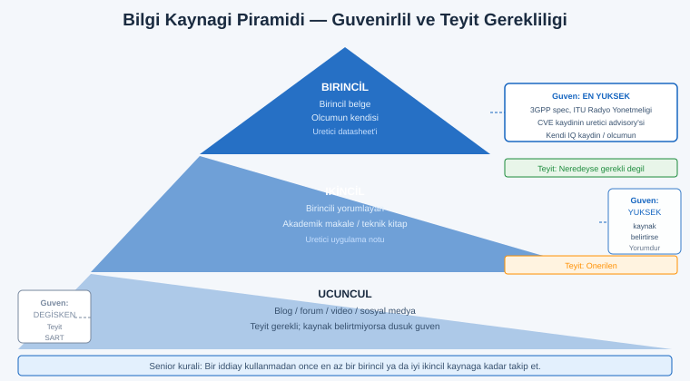
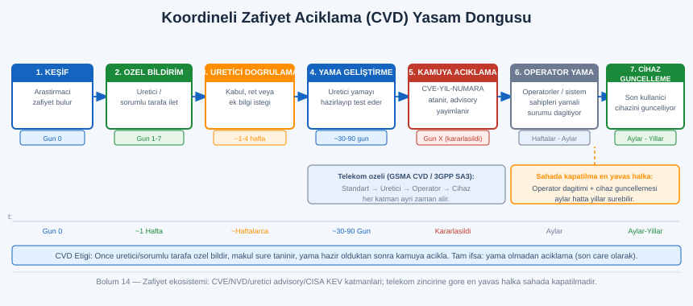
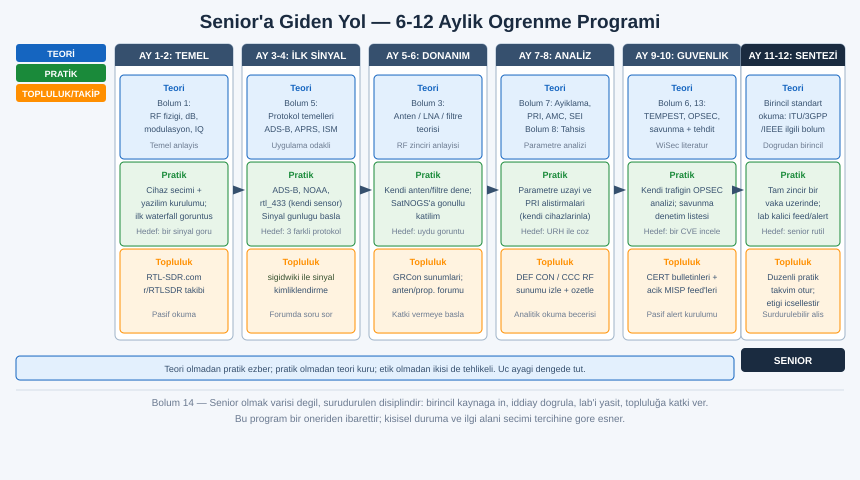

# SIGINT El Kitabı — Bölüm 14: İstihbarat Kaynakları, Topluluk ve Güncel Takip

## Nasıl Senior Olunur ve Senior Kalınır

Bu bölüm, serinin teknik içeriğini kapatan farklı bir konuyu ele alır: bilgiyi değil, bilgiye ulaşma ve güncel kalma yetisini. Önceki on üç bölüm sinyalin fiziğini, donanımı, anteni, demodülasyonu, protokolleri, savunmayı, ayıklamayı ve frekans tahsisini verdi. Ancak bu alan durağan değildir; standartlar revize edilir, yeni zafiyetler açıklanır, araçlar değişir, bantlar yeniden tahsis edilir. Bir mühendisi senior yapan, ezberlediği parametre tablosu değil, doğru kaynağı bulma, birincil belgeyi okuma, iddiayı doğrulama ve alanı sürekli izleme disiplinidir. Bu bölüm o disiplinin haritasıdır: hangi kaynak ne için, nasıl doğrulanır, topluluk nerede, akademik literatür nerede, zafiyet ekosistemi nasıl işler ve underground takibi konusunda dürüst/yasal çerçeve nedir.

Yasal çerçeve: Bu bölüm de serinin geri kalanı gibi anlama, savunma ve okuryazarlık amaçlıdır. Sıralanan kaynaklar açık, meşru ve büyük ölçüde ücretsizdir. Underground/dark web takibi başlığı bilinçli olarak yalnızca kavramsal çerçeve ile sınırlıdır; hiçbir erişim adresi, giriş yöntemi ya da operasyonel reçete verilmez ve bunun neden bireysel meraklı için önerilmediği açıkça anlatılır. Kendi ülkenin ve sürümünün mevzuatını teyit et; bu bölüm hukuki danışmanlık değildir.

---

## İçindekiler

1. [Bilgi Hijyeni: Birincil Kaynak, Doğrulama ve Güncel Kalma](#1)
   - 1.1 [Birincil ve İkincil Kaynak Ayrımı](#1-1)
   - 1.2 [Doğrulama Refleksi ve Yaygın Tuzaklar](#1-2)
   - 1.3 [Bilgi Akışını Yönetmek: Sinyal/Gürültü](#1-3)
2. [Clear Web Kaynakları (Kategorize)](#2)
   - 2.1 [Eğitim ve Donanım Merkezleri](#2-1)
   - 2.2 [Sinyal Kimlik ve Frekans Veritabanları](#2-2)
   - 2.3 [Canlı İzleme/Toplama Ağları (Crowdsourced)](#2-3)
   - 2.4 [Topluluklar: Forum, Reddit, Discord/Matrix](#2-4)
3. [Akademik Literatür: Konferans ve Arşivler](#3)
4. [Konferanslar ve Kayıtları Nereden İzlenir](#4)
5. [Zafiyet Ekosistemi: Kim Bulur, Kim Yayınlar, Kim Yamalar](#5)
   - 5.1 [CVE/NVD ve Üretici Advisory'leri](#5-1)
   - 5.2 [Koordineli Açıklama (CVD) ve Sorumlu Açıklama Etiği](#5-2)
   - 5.3 [Telekom Özelinde: GSMA CVD ve 3GPP SA3](#5-3)
6. [Standart Gövdeleri ve Standardı Okumanın Değeri](#6)
7. [Underground/Dark Web Takibi: Dürüst ve Yasal Çerçeve](#7)
   - 7.1 [Tehdit-İstihbaratında Underground Neden İzlenir](#7-1)
   - 7.2 [Bunun Neden Bireysel Meraklının İşi Olmadığı](#7-2)
   - 7.3 [Meşru Kanallar: Bu Bilgiyi Süzülmüş Almak](#7-3)
8. [Lab'ı Güncel Tutmak: Feed, Alert ve Sinyal Günlüğü](#8)
9. [Senior'a Giden Yol: 6-12 Aylık Öğrenme Programı](#9)
10. [Alıştırmalar](#10)
11. [Kapanış: Tüm SIGINT Serisinin Haritası ve Etik Manifesto](#11)

---

<a id="1"></a>
## 1. Bilgi Hijyeni: Birincil Kaynak, Doğrulama ve Güncel Kalma

Senior bir SIGINT/CTI uzmanını junior'dan ayıran ilk şey teknik bilgi miktarı değil, bilgiyle kurduğu ilişkidir. Junior bir parametreyi bir blog yazısında okur ve doğru kabul eder; senior aynı parametreyi okuduğunda refleks olarak "bu nereden geliyor, kim ölçtü, hangi sürüm/bölge için geçerli, birincil kaynağı ne" diye sorar. Bu refleksin adı bilgi hijyenidir: tıpkı laboratuvar hijyeni gibi, kirli (doğrulanmamış, ikinci/üçüncü elden, bağlamından kopmuş) bilginin analize bulaşmasını önleme disiplini.

<a id="1-1"></a>
### 1.1 Birincil ve İkincil Kaynak Ayrımı



Her bilginin bir kökeni vardır ve o kökenden uzaklaştıkça güvenilirlik düşer, hata birikir. Kaynakları köken mesafesine göre üç katmana ayırmak, hangi kaynağa ne kadar güveneceğini belirler.

| Katman | Tanım | SIGINT/CTI örneği | Güven düzeyi |
|---|---|---|---|
| Birincil | Bilginin doğduğu yer; resmî belge, ölçümün kendisi, üreticinin spesifikasyonu | 3GPP teknik spesifikasyonu, ITU Radyo Yönetmeliği, CVE kaydının üretici advisory'si, cihazın datasheet'i, kendi IQ kaydın | En yüksek |
| İkincil | Birincili yorumlayan, özetleyen, derleyen | Akademik makale (birincil ölçüme dayanır ama yorumdur), iyi bir teknik kitap, üretici uygulama notu | Yüksek (kaynağı belirtiyorsa) |
| Üçüncül | İkincilden türeyen, çoğu zaman kaynaksız | Blog yazısı, forum gönderisi, video özeti, sosyal medya iddiası | Değişken; teyit şart |

Not: Üçüncül kaynak "kötü" demek değildir; bir blog yazısı bir konuya hızlı giriş için mükemmel olabilir. Mesele güven değil, izlenebilirliktir. İyi bir üçüncül kaynak birincile bağlantı verir (standardın numarasını, CVE kimliğini, makalenin DOI'sini); seni kökene götürür. Kötü bir üçüncül kaynak iddiayı havada bırakır. Senior'un kuralı: bir iddiayı kullanmadan önce onu en az bir birincil ya da iyi ikincil kaynağa kadar takip et.

Pratikte: Bu serideki her "teyit edilmeli" notu tam olarak bu disiplinin ürünüdür. Frekans tahsisi (Bölüm 8) ülke/bölgeye göre değişir; bir blogda gördüğün "433 MHz şu güçle serbesttir" iddiası senin ülken için yanlış olabilir. Birincil kaynak (ulusal tahsis tablosu, Türkiye'de BTK Milli Frekans Planı) tek bağlayıcı referanstır. Aynı şekilde bir radarın PRI değeri (Bölüm 7), bir AMC doğruluk yüzdesi (Bölüm 7) ya da bir protokolün alan yapısı (Bölüm 5) hep birincil belgeden teyit edilir.

<a id="1-2"></a>
### 1.2 Doğrulama Refleksi ve Yaygın Tuzaklar

Doğrulama, bir iddiayı bağımsız bir kaynakla çapraz kontrol etmektir. CTI disiplininde bu o kadar merkezîdir ki kendi başına bir beceridir (OSINT rehberinin en uzun bölümlerinden biri doğrulamaya ayrılmıştır). SIGINT bağlamında en sık karşılaşılan doğrulama tuzakları şunlardır.

Tek-kaynak yanılgısı: Bir parametreyi yalnızca tek bir yerde gördün ve doğru kabul ettin. Çözüm: bağımsız ikinci bir kaynak ara; ikisi çelişiyorsa birincile in. Özellikle sosyal medyada hızla yayılan "şu sinyal şuymuş" iddialarında, ilk kaynağın da bir yerden kopyaladığı sıkça görülür (yankı odası).

Tarih/sürüm körlüğü: Doğru ama eski bilgi. Bir araç bir sürümde çalışan komutu sonraki sürümde değiştirmiş olabilir; bir standart revize edilmiş olabilir (LTE Release 8 ile Release 15 farklıdır); bir CVE yamalanmış olabilir. Çözüm: her teknik kaynağın tarihine ve hangi sürüme atıf yaptığına bak. "Bu blog 2014'te yazılmış" bilgisi, içeriğin yarısını bağlamlandırır.

Bağlamdan koparma: Doğru bir değer yanlış koşulda. Bir AMC makalesi "%98 doğruluk" diyebilir, ama bu belirli bir veri kümesi, belirli bir SNR aralığı ve belirli bir kanal modeli içindir (Bölüm 7'deki uyarı). Sayıyı bağlamından kopararak "AMC %98 doğru" demek yanlıştır. Çözüm: her sayısal iddiayı koşullarıyla birlikte oku ve aktar.

Otorite yanılgısı: "Ünlü biri söyledi, doğrudur." Alanında saygın bir isim bile bir konuda yanılabilir ya da basitleştirebilir. Çözüm: iddiayı kişiye değil kanıta bağla. İyi otorite zaten kanıtına bağlantı verir.

> Doğrulama sezgisi: Bir iddiayı üç soruyla sına. Birincisi köken: bu bilgi nereden doğdu, birincil kaynağı ne? İkincisi tazelik: ne zaman ve hangi sürüm/bölge için geçerli? Üçüncüsü bağımsız teyit: bunu söyleyen tek kaynak mı, yoksa bağımsız bir kaynak da doğruluyor mu? Üçü de tatmin ediciyse iddiayı kullan; biri eksikse "teyit edilmeli" etiketiyle işaretle ve öyle aktar.

<a id="1-3"></a>
### 1.3 Bilgi Akışını Yönetmek: Sinyal/Gürültü

Alanı takip etmenin paradoksu, bilginin az değil çok olmasıdır. Yüzlerce blog, onlarca forum, sayısız sosyal medya hesabı, sürekli akan CVE'ler. Hepsini takip etmek imkânsız ve gereksizdir; gürültüde boğulursun. Senior'un yaptığı, takip ettiği kaynak setini bilinçli olarak küratörlemektir: az sayıda yüksek sinyalli kaynağı düzenli izlemek, gerisini olay-bazlı (bir konu çıktığında) aramak.

Bu, telekomdaki sinyal/gürültü oranının (Bölüm 1) bilgi yönetimindeki karşılığıdır. Tıpkı bir alıcının gürültü tabanından sinyali ayırması gibi, sen de bilgi tabanından yüksek değerli kaynakları ayırırsın. Pratik bir yapı: birincil kaynakları (standart gövdeleri, üretici advisory'leri, ulusal regülatör) abonelik/feed ile pasif olarak izle; topluluk kaynaklarını (forum, Reddit) periyodik tara; akademik literatürü konu-bazlı ara. Her şeyi anlık takip etmeye çalışmak tükenmişlik ve gürültü üretir.

---

<a id="2"></a>
## 2. Clear Web Kaynakları (Kategorize)

Açık web, SIGINT öğrenen biri için olağanüstü zengindir ve neredeyse tamamı ücretsizdir. Aşağıda kaynakları işlevlerine göre kategorize ediyorum; her birinin ne için kullanıldığını ve sınırını belirtiyorum. Uyarı: Aşağıdaki site adları kamuya açık ve yaygın bilinen kaynaklardır; yine de erişim adresleri ve içerikleri zamanla değişebileceğinden, güncel adres ve kapsam kullanım anında teyit edilmelidir.

<a id="2-1"></a>
### 2.1 Eğitim ve Donanım Merkezleri

| Kaynak | Ne için | Not |
|---|---|---|
| RTL-SDR.com (blog) | Başlangıç rehberleri, donanım incelemeleri, proje haberleri, araç duyuruları | SDR hobisinin en bilinen haber/eğitim merkezlerinden; ürün-bağımsız okunmalı (ticari yönü var) |
| Üretici dokümantasyonu | Cihazın gerçek yetenekleri, datasheet, firmware notları (RTL-SDR Blog, Analog Devices/ADALM-Pluto, Ettus/USRP, Great Scott Gadgets/HackRF) | Donanım için birincil kaynak; foruma değil buraya bak |
| GNU Radio ve proje wiki'leri | Akış-grafı (flowgraph) mantığı, blok referansları, eğitim materyali | Açık kaynak; sürüm farklarına dikkat |
| Üniversite/açık ders materyalleri | DSP, haberleşme teorisi, anten temelleri | Teorik temel (Bölüm 1, 3, 4) için |

Pratikte: RTL-SDR.com gibi bir merkez "neyin mümkün olduğunu" ve "topluluğun neyle uğraştığını" görmek için iyidir; ancak bir cihazın kesin spesifikasyonu için her zaman üreticinin birincil dokümanına in. Blog bir başlangıç noktasıdır, bağlayıcı kaynak değil.

<a id="2-2"></a>
### 2.2 Sinyal Kimlik ve Frekans Veritabanları

Bu kategori, "duyduğum/gördüğüm bu sinyal ne" ve "bu frekans kime ait" sorularının açık referanslarıdır. Bölüm 7 (sinyal veritabanları) ve Bölüm 8 (tahsis veritabanları) bu kaynaklara zaten atıf yapar.

| Kaynak | Ne için | Sınır/teyit |
|---|---|---|
| Signal Identification Wiki (sigidwiki) | Bilinmeyen bir sinyali sesi, şelale (waterfall) görüntüsü, frekans bandı ve modülasyon/protokol bilgisiyle eşleştirme | Topluluk katkılı; doğruluk kayıttan kayda değişir, kritik kullanımda teyit |
| RadioReference | Frekans veritabanı, çağrı planları (ağırlıklı Kuzey Amerika), trunked sistem bilgisi | Kapsam coğrafyaya göre değişir; ülke dışı için ulusal tabloya in |
| Ulusal tahsis tabloları (BTK Milli Frekans Planı, FCC tabloları, ITU yayınları) | Bir bandın hangi hizmete tahsisli olduğu — birincil tahsis kaynağı | Bağlayıcı kaynak budur; bölge/ülke bağımlı her değer buradan teyit edilir |

Not: sigidwiki türü bir kaynak, bir sinyalin "ne olabileceğine" dair hızlı bir ön tanı için paha biçilmezdir (Bölüm 7'deki ayıklama refleksinin açık-kaynak destekçisi). Ancak topluluk-katkılı doğası nedeniyle bir kaydı kesin kabul etmeden önce, sinyalin gözlemlenen parametreleriyle (merkez frekans, bant genişliği, zaman davranışı) çapraz kontrol et.

<a id="2-3"></a>
### 2.3 Canlı İzleme/Toplama Ağları (Crowdsourced)

Bu kategori, dünyanın dört bir yanındaki gönüllü alıcıların verisini birleştiren açık platformlardır. Hepsi, Bölüm 5'te tanıtılan yasal/açık sinyallerin (ADS-B, AIS, uydu telemetrisi) toplu görselleştirmesidir. Bunlar hem öğrenme hem de kendi alımını doğrulama (ground truth) için değerlidir.

| Platform | İzlediği | SIGINT öğrenimine katkısı |
|---|---|---|
| ADS-B Exchange / FlightAware / OpenSky | Uçak ADS-B yayınları (1090 MHz) | Kendi ADS-B alımını dünya verisiyle karşılaştırma; kapsama/anten denemesi |
| MarineTraffic / AISHub | Gemi AIS yayınları | Kendi AIS alımını doğrulama; VHF deniz bandı pratiği |
| SatNOGS | Açık uydu yer istasyonu ağı; uydu geçişleri ve telemetri | Uydu takibi, Doppler, geçiş planlama; gönüllü istasyon işletme |
| gpsjam.org | GNSS girişim/karıştırma raporlarının haritası (uçak navigasyon bütünlük verisinden türetilir) | GNSS kırılganlığı (Bölüm 6) farkındalığı; girişim coğrafyasını görme |

Not: Bu platformların metodolojisi ve veri kaynağı zamanla değişebilir; örneğin bir karıştırma haritasının nasıl türetildiği (hangi göstergeden, hangi varsayımla) kendi dokümantasyonundan okunmalı. Haritayı "kesin gerçek" değil, "gösterge" olarak oku — tıpkı bir analiz ekranını okur gibi.

Pratikte: ADS-B Exchange ya da SatNOGS gibi bir ağa gönüllü istasyon olarak katılmak, hem topluluğa katkıdır hem de en hızlı öğrenme yollarından biridir; kendi alıcının/anteninin gerçek dünyada nasıl davrandığını sürekli ölçülen bir çerçevede görürsün. Bu, Bölüm 2-3'teki donanım sezgisini pratiğe bağlar.

<a id="2-4"></a>
### 2.4 Topluluklar: Forum, Reddit, Discord/Matrix

Alanda kalmanın en hızlı yolu, soru sorabileceğin ve başkalarının sorduklarını okuyabileceğin canlı topluluklardır. Burada üçüncül kaynak doğasını (Bölüm 1) akılda tut: forum bilgisi hızlı ve pratiktir ama doğrulanmamıştır; iyi forumlar kaynağa bağlantı verir.

| Topluluk türü | Örnekler | Karakter |
|---|---|---|
| Reddit | r/RTLSDR, r/amateurradio, r/RTL_SDR, r/signalidentification | Hızlı soru-cevap, donanım/araç tartışması, sinyal kimliklendirme yardımı |
| Amatör radyo forumları | Ulusal/bölgesel ham radyo forumları, QRZ toplulukları | Lisanslı operatör bilgisi, anten/propagasyon derinliği |
| Discord / Matrix sunucuları | SDR, GNU Radio, belirli cihaz toplulukları | Gerçek zamanlı yardım; arşivlenebilirliği zayıf |
| Proje takipçileri | GitHub issue/discussion (araç projeleri) | Bir aracın gerçek sınırlarını ve bilinen hatalarını görmek için en iyi yer |

Not: Topluluk adları ve platformları zamanla değişir; yukarıdakiler yaygın bilinen örneklerdir, güncel aktiflikleri teyit edilmeli. Discord/Matrix gibi gerçek-zamanlı kanallar hızlı yardım için iyidir ama bilgi orada arşivlenmez (arama zordur); kalıcı bilgi için forum/wiki tercih edilir.

> Topluluk hijyeni: Bir topluluğa katılırken iki yönlü ol. Sorularını net, kendi denediklerini ve donanımını belirterek sor (iyi soru, iyi cevap çeker). Aldığın cevabı kaynağına kadar takip et; "bende çalıştı" bir veri noktasıdır, kanıt değil. Ve yasal sınırı topluluk baskısıyla aşma: bir forumda birinin yaptığı bir şey yasal olduğu anlamına gelmez (Bölüm 0 manifestosu).

---

<a id="3"></a>
## 3. Akademik Literatür: Konferans ve Arşivler

SIGINT'in derin tarafı (ileri ayıklama, RF parmak izi, telekom güvenlik zafiyetleri, yeni demodülasyon yöntemleri) önce akademik literatürde belirir. Senior olmanın bir ayağı, bu literatürü okuyabilmektir. Burada ikincil kaynak (makale) ile gazete/blog özeti (üçüncül) arasındaki fark hayatidir: bir güvenlik haberinin aslı çoğu zaman bir konferans makalesidir ve makale, haberin atladığı koşulları/sınırları içerir.

| Mekan | Odak | SIGINT/telekom ilgisi |
|---|---|---|
| USENIX Security | Sistem ve ağ güvenliği, geniş kapsam | Hücresel/IoT zafiyetleri, kablosuz saldırı/savunma sıkça burada |
| IEEE Symposium on Security and Privacy (S&P / "Oakland") | Güvenliğin amiral konferansı | Temel kablosuz/donanım güvenlik çalışmaları |
| NDSS (Network and Distributed System Security) | Ağ/sistem güvenliği | Protokol ve kablosuz saldırı analizleri |
| ACM WiSec | Kablosuz ve mobil güvenliğe ADANMIŞ | SIGINT/telekom güvenliği için en odaklı mekan; RF parmak izi, jamming, spoofing, hücresel |
| GNU Radio Conference (GRCon) bildirileri | Uygulamalı SDR/DSP | Araç ve uygulama tarafı; akademiyle pratik arası köprü |
| arXiv (cs.CR, eess.SP) | Ön-baskı (preprint) arşivi | En güncel ama hakem-denetimi öncesi; dikkatli oku |

Not: arXiv bir ön-baskı arşividir; oradaki bir makale henüz hakem denetiminden (peer review) geçmemiş olabilir. Bu onu değersiz yapmaz (en güncel iş orada belirir) ama iddialarını daha temkinli karşıla; mümkünse yayımlanmış (konferans/dergi) sürümünü ara. WiSec, SIGINT/telekom güvenliği öğrenen biri için bu listede özel bir yer tutar çünkü doğrudan kablosuz güvenliğe adanmıştır.

Pratikte: Bir akademik makaleyi senior gibi okumak, baştan sona okumak değildir. Önce özet (abstract) ve sonuç (conclusion) ile "ne iddia ediyor"u al; sonra tehdit modeli/varsayımlar bölümüyle "hangi koşulda"yı al (çoğu abartılı haberin çöktüğü yer burasıdır); sonra deney bölümüyle "ne kadar gerçekçi"yi sına. Bir telekom saldırısı makalesi çoğu zaman "laboratuvar koşulunda, kontrollü bir baz istasyonu ile" der; bu, gerçek dünyada aynı sonucun alınacağı anlamına gelmez.

---

<a id="4"></a>
## 4. Konferanslar ve Kayıtları Nereden İzlenir

Akademik mekanların yanında, uygulamalı/güvenlik konferansları SIGINT için altın değerindedir; çünkü çalışan demolar, araç sürümleri ve pratik teknikler burada gösterilir. Çoğunun sunum kayıtları sonradan açık olarak yayımlanır; bu, bütçesi/imkânı olmayan biri için bile alana erişim sağlar.

| Konferans | İlgili kısımlar | Kayıt erişimi |
|---|---|---|
| DEF CON | RF Hackers Sanctuary (RFHS), Wireless/Radio Village; SDR/telsiz/RFID/kablosuz | Sunum kayıtları genelde sonradan açık yayımlanır (resmî DEF CON medya arşivi/kanalı) |
| Chaos Communication Congress (CCC) | GSM/telekom güvenlik tarihinin önemli sunumları; donanım/RF | CCC medya arşivi sunumları açık olarak barındırır (geniş, çok yıllı arşiv) |
| Black Hat | Profesyonel güvenlik; kablosuz/telekom/donanım brifingleri | Bazı materyaller (slayt/whitepaper) açık; kayıtların erişimi değişir |
| REcon | Tersine mühendislik odaklı (firmware, donanım, protokol) | Kayıt politikası yıla göre değişir |
| GNU Radio Conference (GRCon) | Uygulamalı SDR/DSP, akademiyle pratik köprüsü | Sunum/bildiri ve kayıtlar genelde açık |
| Hardwear.io | Donanım güvenliği, yan-kanal, RF/donanım saldırı-savunma | Materyal erişimi değişir |

Not: Hangi konferansın hangi yıl hangi kayıtları açık yayımladığı yıldan yıla değişir; yukarıdaki "açık yayımlanır" notları genel eğilimdir, somut bir sunum için ilgili konferansın resmî medya arşivinden teyit edilmeli. CCC ve DEF CON, kapsamlı ve çok-yıllı açık arşivleriyle bu listede öğrenme için özellikle değerlidir.

Pratikte: Bir konferans sunumunu öğrenme aracı olarak kullanırken, sunumun YILINA dikkat et. 2010 dolayındaki bir GSM güvenlik sunumu tarihsel olarak çığır açıcıdır ama anlattığı somut zafiyetlerin bir kısmı sonradan yamalanmış ya da ağ tarafında ele alınmış olabilir (Bölüm 5'teki telekom evrimi). Sunumu "o dönemin durumu" olarak oku; güncel durumu için sonraki yılların sunumlarına ve üretici/standart güncellemelerine bak. Bölüm 10'daki alıştırmalardan biri tam olarak bir RF sunumunu izleyip özetlemektir.

---

<a id="5"></a>
## 5. Zafiyet Ekosistemi: Kim Bulur, Kim Yayınlar, Kim Yamalar

Bir zafiyetin "keşiften yamaya" yolculuğunu anlamak, senior'luğun ayırt edici bilgilerindendir. Çünkü bir güvenlik haberini ("X sisteminde kritik açık") doğru okumak, bu zincirin hangi aşamasında olduğunu bilmeyi gerektirir: açık yeni mi bulundu, sorumlu biçimde mi açıklandı, yaması var mı, dağıtıldı mı? Bu zincir, MISP ve MITRE rehberlerindeki tehdit-istihbaratı yaşam döngüsünün SIGINT/telekom ucudur.

<a id="5-1"></a>
### 5.1 CVE/NVD ve Üretici Advisory'leri

Zafiyet ekosisteminin omurgası, zafiyetlere benzersiz kimlik veren ve onları kataloglayan açık sistemlerdir.

| Bileşen | Rol | SIGINT/telekom bağlamı |
|---|---|---|
| CVE (Common Vulnerabilities and Exposures) | Her bilinen zafiyete benzersiz kimlik (CVE-YIL-NUMARA) | Bir kablosuz/telekom/IoT zafiyetinin evrensel referansı; konuşmanın ortak dili |
| NVD (National Vulnerability Database) | CVE'leri zenginleştirir: önem skoru (CVSS), etkilenen sürümler, referanslar | Bir CVE'nin ciddiyetini ve kapsamını değerlendirme |
| Üretici advisory'si | Zafiyeti üreticinin kendi diliyle açıklayan, yamayı/azaltmayı veren BİRİNCİL kaynak | Bir CVE hakkındaki en doğru ve eyleme dönük bilgi; CVE'den buraya in |
| CISA KEV (Known Exploited Vulnerabilities) | Vahşi doğada AKTİF sömürülen zafiyetler listesi | Önceliklendirme: "bu sadece teorik mi, fiilen sömürülüyor mu" |

Not: CVE/NVD bir zafiyetin "varlığını" ve "skorunu" verir; ancak gerçek eyleme dönük bilgi (yama sürümü, geçici azaltma, kesin etki) çoğu zaman üreticinin advisory'sindedir. Senior'un refleksi: bir CVE numarası gördüğünde NVD'de skoruna ve kapsamına bak, sonra üreticinin advisory'sine inerek birincil bilgiyi al. CVSS skorunun tek başına bağlam vermediğini unutma; düşük skorlu bir zafiyet senin özel kullanımında kritik, yüksek skorlu biri ilgisiz olabilir.

<a id="5-2"></a>
### 5.2 Koordineli Açıklama (CVD) ve Sorumlu Açıklama Etiği



Bir araştırmacı bir zafiyet bulduğunda, onu nasıl açıklayacağı bir etik ve süreç sorusudur. Hâkim norm, koordineli zafiyet açıklamasıdır (CVD — Coordinated Vulnerability Disclosure): araştırmacı zafiyeti önce üreticiye/sorumlu tarafa bildirir, makul bir süre (yama geliştirme için) tanır ve ancak yama hazır olduktan (ya da süre dolduktan) sonra kamuya açıklar.

```
 Koordineli Açıklama (CVD) zaman çizgisi:

 [Keşif] ──► [Sorumlu tarafa özel bildirim] ──► [Doğrulama + yama geliştirme]
    │                                                      │
    │              (kararlaştırılan açıklama penceresi)     │
    ▼                                                      ▼
 araştırmacı                                          [Yama yayımı]
 zafiyeti bulur                                              │
                                                            ▼
                                              [Kamuya açıklama + CVE]
                                              (kullanıcılar yamalayabilir)
```

Bu modelin karşıtı iki uçtur. Tam ifşa (full disclosure), zafiyeti yama olmadan doğrudan kamuya açıklamaktır; bazen üretici yanıt vermediğinde baskı aracı olarak kullanılır ama kullanıcıları savunmasız bırakma riski taşır. Diğer uç, hiç açıklamama ya da zafiyeti kötüye kullanma/satmadır ki bu etik dışı ve çoğu yerde yasa dışıdır.

> Etik çerçeve: Bu serinin manifestosu (Bölüm 0) "alıcı serbesttir, verici sorumluluktur" der; zafiyet açıklamasının etiği bunun araştırma karşılığıdır. Bir zafiyet bulursan (örneğin kendi cihazında ya da yetkili bir testte), onu silah değil, düzeltilecek bir kusur olarak gör. Sorumlu yol: sorumlu tarafa özel bildir, makul süre tanı, koordineli açıkla. Yetkin olmadığın bir sisteme zafiyet aramak için sızmak ise testin değil, suçun konusudur. Bu, MITRE/MISP rehberlerindeki "yetki sınırı" ilkesinin SIGINT karşılığıdır.

<a id="5-3"></a>
### 5.3 Telekom Özelinde: GSMA CVD ve 3GPP SA3

Telekom (hücresel) zafiyetleri, genel yazılım zafiyetlerinden farklı bir ekosistemde ele alınır çünkü etkilenen taraf tek bir üretici değil, küresel bir operatör/üretici/standart ağıdır. Burada iki gövde merkezîdir.

| Gövde | Rol | Neden önemli |
|---|---|---|
| GSMA (mobil operatörler birliği) | Mobil ekosistem için koordineli açıklama programı işletir; sektör çapında güvenlik kılavuzları | Bir hücresel zafiyetin operatörler arası koordineli ele alınma adresi |
| 3GPP SA3 (Güvenlik çalışma grubu) | Hücresel standartların GÜVENLİK boyutunu tanımlar (kimlik doğrulama, şifreleme, gizlilik) | Bir zafiyetin STANDART düzeyinde düzeltilmesi burada olur (sonraki Release'te) |
| Operatör yama süreci | Standart/üretici düzeltmesini ağda hayata geçirme | En yavaş halka; bir düzeltmenin sahada etkinleşmesi yıllar alabilir |

Not: Hücresel zafiyetlerin (Bölüm 5'teki SS7, IMSI-catcher ailesi gibi) yaşam döngüsü uzundur ve katmanlıdır. Bir zafiyet standartta (3GPP SA3) ele alınsa bile, düzeltmenin yeni bir Release'e girmesi, üreticilerin uygulaması ve operatörlerin sahaya yayması ayrı ayrı zaman alır; eski cihaz/şebeke geriye-uyumluluk nedeniyle uzun süre savunmasız kalabilir. Bu yüzden "bu zafiyet düzeltildi" haberi, "her yerde düzeltildi" anlamına gelmez. Senior bu katmanları (standart → üretici → operatör → cihaz) ayrı ayrı sorgular.

Pratikte: Bir telekom güvenlik sunumunu (Bölüm 4, CCC örnekleri) izlerken, anlatılan zafiyetin bu zincirin neresinde olduğunu sor. 2014'te gösterilen bir SS7 zafiyeti, o tarihten beri GSMA tarafından filtreleme/izleme önerileriyle ve operatör tarafında kısmen ele alınmıştır; ama küresel ölçekte tam kapanış nadirdir. Güncel durumu için GSMA güvenlik kılavuzlarının ve 3GPP'nin sonraki Release güvenlik özelliklerinin son hâline bakmak gerekir.

---

<a id="6"></a>
## 6. Standart Gövdeleri ve Standardı Okumanın Değeri

Senior bir mühendisin junior'dan en görünür farkı, birincil standardı okuyabilmesidir. Blog ve kitap standardı yorumlar; standardın kendisi tek bağlayıcı gerçektir. SIGINT'te ilgili dört büyük gövde ve okudukları:

| Gövde | Alanı | SIGINT'te ne için okunur |
|---|---|---|
| ITU (Uluslararası Telekomünikasyon Birliği) | Küresel spektrum yönetimi, Radyo Yönetmeliği | Bant tahsisi (Bölüm 8), bölge (Region) ayrımı, uluslararası servis tanımları |
| 3GPP | Hücresel standartlar (GSM/UMTS/LTE/5G) | Hücresel mimari ve güvenlik (Bölüm 5); birincil teknik spesifikasyonlar |
| IETF (RFC'ler) | İnternet protokolleri | IP üstü taşınan veri, kriptografik protokoller; bazı IoT/ağ katmanları |
| IEEE 802 | LAN/MAN; 802.11 (WiFi), 802.15.4 (Zigbee tabanı) | WiFi/kablosuz katman ayrıntıları (Bölüm 5) |

Standardı okumak neden senior işidir? Çünkü standart, bir blogun atladığı tam tanımı, alan-bit yapısını, zamanlama gereksinimini ve istisnaları içerir. Bir protokolü tersine mühendislikle çözmeye çalışırken (Bölüm 5), ilgili standardı okumak çoğu zaman aylarca deneme-yanılmadan hızlıdır. Standart, "sinyalin nasıl görünmesi gerektiğinin" resmî tarifidir; ölçtüğün gerçek sinyali bu tarife karşı doğrularsın.

Not: Standartların erişim modeli değişir. ITU yayınlarının ve 3GPP spesifikasyonlarının önemli bir kısmı kamuya açıktır; IETF RFC'leri tamamen açıktır; bazı IEEE standartları ücretlidir ya da gecikmeli açılır. Hangi belgenin nasıl erişildiği güncel olarak teyit edilmeli. Pratik bir başlangıç: bir konuyu bir blogda öğren, sonra o bloğun atıf yaptığı standardın ilgili bölümüne inerek "gerçeği" kendi gözünle gör. Standardı baştan sona okumak gerekmez; ilgili bölümü hedefli okumak yeterlidir.

> Standart sezgisi: Bir teknik tartışmada anlaşmazlık çıktığında ("bu alan kaç bit, bu zamanlama ne") cevap forumda değil standarttadır. Standarda inme alışkanlığı, seni "duyduğunu tekrarlayan"dan "kaynağı bilen"e dönüştürür. Bu, bilgi hijyeninin (Bölüm 1) en üst hali: doğrudan birincil belgeden okumak.

---

<a id="7"></a>
## 7. Underground/Dark Web Takibi: Dürüst ve Yasal Çerçeve

Bu başlık doğrudan yaygın bir soruya cevap verir: "Senior bir uzman dark web / underground forumları takip eder mi, etmeli mi?" Cevap dürüst ve nettir, ama önce çerçeveyi doğru kurmak gerekir. Bu bölüm hiçbir adres, erişim yöntemi, forum adı ya da operasyonel reçete vermez; yalnızca bu işin profesyonel disiplinde NEDEN/NASIL ele alındığını ve bireysel meraklı için neden önerilmediğini anlatır.

<a id="7-1"></a>
### 7.1 Tehdit-İstihbaratında Underground Neden İzlenir

Kurumsal tehdit-istihbaratı (CTI) disiplininde, underground ekosistemin (kapalı forumlar, pazar yerleri, sızıntı kanalları) izlenmesinin meşru bir gerekçesi vardır: erken uyarı. Bir saldırı aracı, sızdırılmış bir veri kümesi ya da yeni bir sömürü tekniği, kamuya/üreticiye ulaşmadan önce bu çevrelerde belirebilir. Yetkili bir CTI ekibi bunu izleyerek korunması gereken kuruma erken uyarı verebilir: "sizin sektörünüze yönelik bir araç dolaşıyor", "sizin verinizin sızdırıldığına dair işaret var", "şu zafiyet için bir sömürü satışta".

SIGINT/telekom bağlamında bunun karşılığı: sızdırılmış bir SS7/Diameter erişimi reklamı, bir IMSI-catcher benzeri donanımın ticari/yarı-yasal satışı, ya da bir kablosuz sistemin zafiyetine dair erken söylenti. Bu sinyaller, savunma tarafındaki bir ekip için değerli erken-uyarı göstergeleridir (MISP/MITRE rehberlerindeki tehdit-aktörü ve TTP izleme mantığının en ham ucu).

Ancak buradaki kritik kelime "yetkili CTI ekibi"dir. Bu izleme, hukuki çerçeveye oturtulmuş, izole/ayrılmış altyapıyla, kurumsal yetki ve genellikle hukuk/uyum denetimi altında yapılan bir iştir. İzleyen taraf içeriği satın almaz, suça iştirak etmez, yalnızca savunma amaçlı gözlem yapar ve bunu sıkı OPSEC ile (OSINT rehberinin "duvar" ilkesi) izole eder.

<a id="7-2"></a>
### 7.2 Bunun Neden Bireysel Meraklının İşi Olmadığı

Aynı işin bireysel bir meraklı tarafından yapılması, profesyonel çerçevenin tüm koruyucu unsurlarından yoksun olduğu için ciddi biçimde önerilmez. Nedenleri somut ve ciddidir.

| Risk | Açıklama |
|---|---|
| Yasal risk | Bu ortamlarda yalnızca bulunmak bile bazı içeriklere maruz kalmaya, istemeden yasa dışı materyalle temasa ya da suç sayılan eylemlere sürüklenmeye yol açabilir; yetkisiz erişim, satın alma ya da iştirak suçtur |
| Kötü amaçlı yazılım | Bu çevreler kötü amaçlı yazılım, tuzaklı dosya ve sömürü için yüksek riskli alanlardır; ziyaretçinin kendisi hedeftir |
| Dolandırıcılık | İçeriğin büyük kısmı dolandırıcılık, sahte satış ve tuzaktır; "veri/araç" çoğu zaman ya sahtedir ya tuzaktır |
| Dezenformasyon | İçeriğin doğruluğu denetlenemez; abartı, yanlış atıf ve kasıtlı yanıltma yaygındır (bilgi hijyeninin tam tersi) |
| OPSEC çöküşü | Profesyonel izole altyapı olmadan, kişi kendi kimliğini/konumunu ele verir; deanonimleştirilme ve hedef olma riski yüksektir |

Not: Bireysel bir öğrenci ya da hobici için bu ortamlardan elde edilebilecek "bilgi", riskine değmez. Aynı tehdit-istihbaratı, aşağıdaki meşru kanallardan süzülmüş, doğrulanmış, yasal ve güncel biçimde elde edilebilir. Yani fayda zaten meşru kanallarda mevcuttur; risk ise yalnızca underground'a aittir. Bu nedenle bu bölüm hiçbir erişim bilgisi vermez ve bu yolu açıkça önermez.

> Sınır manifestosu: Bu serinin tutarlı çizgisi, "anlamak serbest, suç işlemek değil"dir (Bölüm 0). Underground'ı ANLAMAK (neden izlendiğini, ekosistemini, tehdit-intel değerini bilmek) meşrudur ve bu bölüm onu verir. Underground'a GİRMEK, bireysel olarak içeriğine erişmek ya da iştirak etmek ise bu serinin sınırının dışındadır; ne adres, ne yöntem, ne teşvik verilir. Tıpkı USB-içerik-kopyalama ya da kamera-LED-bypass gibi sınırın ötesindeki taleplerin reddedildiği gibi, underground erişim rehberi de verilmez.

<a id="7-3"></a>
### 7.3 Meşru Kanallar: Bu Bilgiyi Süzülmüş Almak

İyi haber şu: underground'da olup biten ve savunma için önemli olan her şeyin süzülmüş, doğrulanmış ve yasal hâli, meşru tehdit-istihbaratı sağlayıcıları aracılığıyla erişilebilir. Senior'un yaptığı, riske girmek değil, bu süzgeçlenmiş kanalları izlemektir.

| Meşru kanal | Ne sağlar | Karakter |
|---|---|---|
| Ticari CTI sağlayıcıları | Underground'ı yetkili/izole biçimde izleyip raporlayan profesyonel hizmetler | Süzülmüş, bağlamlandırılmış istihbarat; çoğu ücretli, kurumsal |
| ISAC / ISAO (sektörel paylaşım toplulukları) | Aynı sektördeki kurumlar arası tehdit paylaşımı (finans, enerji, telekom) | Sektöre özel, güvenilir, üyelik bazlı (MISP rehberi) |
| Ulusal/kurumsal CERT/CSIRT bültenleri | Doğrulanmış zafiyet ve tehdit uyarıları, kamuya açık bültenler | Yasal, güncel, çoğu ücretsiz; ilk durak |
| MISP toplulukları ve açık feed'ler | Yapılandırılmış, makine-okunur IOC ve tehdit verisi | Açık kaynak araç + topluluk feed'leri (MISP rehberi) |
| Üretici/CISA güvenlik uyarıları | Aktif sömürü ve yama bildirimleri | Birincil, eyleme dönük (Bölüm 5) |

Pratikte: Bir kişinin ya da küçük ekibin tehdit-istihbaratı ihtiyacının neredeyse tamamı, CERT bültenleri, açık MISP feed'leri ve (kurumsalsa) bir ISAC üyeliği ile karşılanır. Bunlar underground'ın değerli kısmını zaten süzülmüş, yasal ve güncel biçimde sunar. Bu yapı, MISP_THREAT_INTEL_USTALIK_REHBERI.md ve MITRE_ATTACK_USTALIK_REHBERI.md ile ayrıntılı işlenir; OSINT_ARAC_SETI_USTALIK_REHBERI.md ise araştırma yaparken kendini ele vermeme (OPSEC, "duvar") disiplinini verir. Bu üç rehber, bu bölümün tehdit-istihbaratı ve OPSEC çapraz referanslarıdır.

---

<a id="8"></a>
## 8. Lab'ı Güncel Tutmak: Feed, Alert ve Sinyal Günlüğü

Bilgiyi takip etmek pasif okuma değildir; kendi pratiğini sürekli besleyen bir sistemdir. Senior bir kişinin lab'ı (Bölüm 4'teki yazılım/OS kurulumu) yaşayan bir ortamdır: düzenli güncellenir, gözlemler kaydedilir, yeni kaynaklar denenir.

Feed/alert kurulumu: Birincil kaynakları pasif olarak sana getir. Bir besleme okuyucu (RSS/Atom) ile RTL-SDR.com, ulusal regülatör duyuruları ve seçtiğin güvenlik bültenlerini tek yerde topla. CVE/zafiyet tarafı için CISA KEV ve ilgili üretici advisory'lerini izle. Amaç her şeyi anlık takip değil (Bölüm 1.3, gürültü yönetimi); az sayıda yüksek-sinyalli kaynağı düzenli görmek.

Sinyal günlüğü (signal log): Gözlemlediğin her ilginç sinyali kaydet. Bu, ELINT kütüphanesi mantığının (Bölüm 7) kişisel, yasal halidir: tarih, frekans, bant genişliği, zaman davranışı (sürekli/darbeli/atlamalı), şelale görüntüsü ve varsa tahmini kimlik. Zamanla bu günlük senin kişisel referans veritabanın olur; yeni bir sinyalle karşılaştığında geçmiş kayıtlarınla karşılaştırırsın. Yalnızca kendi yasal gözlemlerini kaydet (Bölüm 0).

Düzenli pratik: Teori pratiğe dökülmezse körelir. Düzenli (örneğin haftalık) küçük bir pratik hedefi koy: bir ADS-B/NOAA alımı, bir 433 MHz ISM gözlemi, bir yeni aracın denenmesi, bir konferans sunumunun izlenmesi. SatNOGS gibi bir ağa gönüllü katılım (Bölüm 2.3), pratiği otomatik ve sürekli kılar.

| Lab güncel-tutma bileşeni | Ne yapar | İlgili bölüm |
|---|---|---|
| Feed okuyucu (RSS/Atom) | Birincil kaynakları pasif toplar | Bölüm 1.3, 2 |
| Zafiyet alert'i (CISA KEV, advisory) | Eyleme dönük güvenlik uyarısı | Bölüm 5 |
| Sinyal günlüğü | Kişisel yasal sinyal referansı (mini ELINT kütüphanesi) | Bölüm 7 |
| Düzenli pratik takvimi | Teoriyi pratiğe bağlar, körelmeyi önler | Bölüm 4, 5 |
| Topluluk katılımı (forum/Discord/SatNOGS) | Canlı bilgi ve geri besleme | Bölüm 2.3, 2.4 |

> Lab sezgisi: Güncel kalmak bir olay değil, bir alışkanlıktır (OSINT rehberindeki "OPSEC bir alışkanlıktır" ilkesinin öğrenme karşılığı). Ayda bir büyük çaba yerine, haftada birkaç küçük dokunuş (bir feed okuma, bir kayıt, bir pratik) çok daha kalıcıdır. Lab güncel kaldıkça sezgi keskin kalır.

---

<a id="9"></a>
## 9. Senior'a Giden Yol: 6-12 Aylık Öğrenme Programı



Senior olmak bir sertifika değil, üç ayağın birlikte olgunlaşmasıdır: teori (DSP/RF), pratik (lab) ve topluluk/etik. Aşağıda, bu serinin bölümlerini bir öğrenme takvimine bağlayan önerilen bir program var. Süreler kişiye göre esner; önemli olan sıra ve dengedir (her ay biraz teori + biraz pratik + biraz takip).

| Dönem | Teori odağı | Pratik odağı | Takip/topluluk |
|---|---|---|---|
| Ay 1-2: Temel | Bölüm 1 (RF fiziği, dB, modülasyon, IQ) | Bölüm 2 cihaz seçimi + Bölüm 4 yazılım kurulumu; ilk waterfall | RTL-SDR.com okuma; r/RTLSDR takibi |
| Ay 3-4: İlk sinyaller | Bölüm 5 protokol temelleri | ADS-B, NOAA, rtl_433 (kendi sensörlerin); sinyal günlüğü başlat | sigidwiki ile sinyal kimliklendirme; forumda soru sorma |
| Ay 5-6: Donanım derinliği | Bölüm 3 anten/LNA/filtre teorisi | Kendi anten/filtre denemen; SatNOGS'a gönüllü katılım | GRCon sunumları; anten/propagasyon forumları |
| Ay 7-8: Ayıklama ve analiz | Bölüm 7 (ayıklama, PRI, AMC, SEI), Bölüm 8 (tahsis) | Parametre-uzayı ve PRI alıştırmaları (kendi cihazlarınla) | Bir DEF CON/CCC RF sunumu izle+özetle |
| Ay 9-10: Güvenlik ve savunma | Bölüm 6 (TEMPEST, OPSEC, savunma), telekom güvenlik literatürü (WiSec) | Kendi trafiğinin OPSEC analizi (Telegram örneği, Bölüm 7 trafik analizi) | CERT bültenleri + açık MISP feed'leri; bir CVE'yi uçtan uca incele |
| Ay 11-12: Sentez ve süreklilik | Birincil standart okuma (ITU/3GPP/IEEE ilgili bölümler) | Tüm zincirin bir vaka üzerinde uygulanması; lab'ı kalıcı feed/alert ile kur | Düzenli pratik takvimi oturtma; etik çerçeveyi içselleştirme |

Not: Bu program bir öneridir, dogma değil. Bazı kişiler güvenlikle başlamak ister, bazıları yalnızca hobi/dinleme tarafında kalır; ikisi de geçerlidir. Değişmeyen ilke şudur: teori olmadan pratik ezber, pratik olmadan teori kuru, etik olmadan ikisi de tehlikeli olur. Üçünü dengede tut.

> Senior sezgisi: Senior olmak "her şeyi bilmek" değildir; bilmediğinde doğru kaynağa hızlı inebilmek, bir iddiayı doğrulayabilmek ve sınırını (yasal ve teknik) bilmektir. Bir junior cevabı ezberler; bir senior cevabın nereden geldiğini, ne zaman güncellendiğini ve ne zaman yanlış olabileceğini bilir. Bu bölümün tamamı, o farkı kapatmak içindir.

---

<a id="10"></a>
## 10. Alıştırmalar

> Bu alıştırmaların hepsi açık, yasal kaynaklarla ve kendi gözlemlerinle yapılır. Hiçbiri yayın (TX), yetkisiz erişim ya da underground'a giriş gerektirmez ve böyle bir şey önermez. Şüphedeysen yapma (Bölüm 0).

### A) Kişisel kaynak/feed listesi oluştur (bilgi hijyeni refleksi)

Bu serinin ve bu bölümün kaynaklarından kendine küratörlü bir liste çıkar. Bir tabloya doldur: kaynak adı, kategori (eğitim / sinyal-DB / canlı-izleme / topluluk / akademik / zafiyet / standart), birincil mi ikincil mi üçüncül mü, ne sıklıkla bakacağın (feed/pasif mi, olay-bazlı mı). Sonra bunların feed (RSS/Atom) destekleyenlerini bir besleme okuyucuya ekle.

| Kaynak | Kategori | Köken katmanı (1./2./3.) | Takip biçimi |
|---|---|---|---|
| ? | ? | ? | ? |

Amaç: Bölüm 1'deki birincil/ikincil/üçüncül ayrımını ve sinyal/gürültü yönetimini somut bir araca dönüştürmek. Listeni kısa tut (gürültü değil, sinyal); her ay gözden geçir.

### B) Bir DEF CON/CCC RF sunumu izle ve özetle (akademik/konferans okuryazarlığı)

Açık olarak yayımlanmış bir RF/kablosuz/telekom konferans sunumu seç (Bölüm 4). İzlerken üç soruyu cevapla: (1) Ne iddia ediyor (tek cümle)? (2) Hangi koşul/varsayım altında (tehdit modeli, laboratuvar mı saha mı)? (3) Sunumun YILI ne ve o tarihten bu yana durum değişmiş olabilir mi (yama, standart güncellemesi)? Yarım sayfalık bir özet yaz.

Amaç: Bir güvenlik iddiasını bağlamı ve tazeliğiyle (Bölüm 1.2, Bölüm 5.3) okuma refleksini kazanmak; "haber" ile "kaynak" arasındaki farkı görmek.

### C) Bir CVE'yi uçtan uca incele (zafiyet ekosistemi)

Kablosuz/IoT/telekom alanından bir CVE seç (tercihen artık yamalanmış, kamuya açık biri). Şu zinciri takip et: (1) CVE kaydı — özet ve kimlik; (2) NVD — CVSS skoru, etkilenen sürümler; (3) üretici advisory'si — gerçek etki ve yama; (4) varsa CISA KEV'de mi (aktif sömürülmüş mü); (5) açıklama biçimi koordineli (CVD) miydi? Bulgularını kısa bir not olarak yaz.

```
 İnceleme zinciri:
 CVE-YIL-NUMARA ──► NVD (skor/kapsam) ──► üretici advisory (etki/yama)
                                              │
                                              ▼
                                    CISA KEV? (aktif sömürü)
                                              │
                                              ▼
                                  açıklama biçimi: koordineli mi?
```

Amaç: Bölüm 5'teki "keşif → advisory → yama" yolculuğunu gerçek bir kayıt üzerinde görmek; CVE/NVD/advisory'nin köken katmanlarını (Bölüm 1) ayırt etmek.

### D) sigidwiki ile bilinmeyen bir sinyali kimliklendir (sinyal-DB pratiği)

Kendi yasal gözleminden (örneğin 433 MHz ISM bandı, Bölüm 7 alıştırmaları) bilmediğin bir sinyal yakala; şelale görüntüsünü ve (varsa) sesini not et. Sonra bir sinyal kimlik veritabanı (sigidwiki türü) üzerinde, gözlemlediğin parametrelerle (merkez frekans, bant genişliği, zaman deseni, modülasyon görünümü) eşleşen kayıtları ara. En olası adayı gerekçesiyle yaz ve "bu kayıt topluluk-katkılı, teyit gerekir" notunu düş.

Amaç: Bölüm 7'deki ayıklama/sınıflandırma refleksini açık bir referansla pratiğe dökmek; bir topluluk veritabanının değerini ve sınırını (doğrulama, Bölüm 1) birlikte yaşamak.

### E) Kendi öğrenme programını kişiselleştir (senior yol haritası)

Bölüm 9'daki 6-12 aylık programı kendi durumuna uyarla: hangi aydasın, hangi bölümleri bitirdin, hangi pratikleri yaptın, hangi kaynakları takip ediyorsun? Eksik ayağı (teori mi, pratik mi, topluluk/etik mi) tespit et ve önümüzdeki ay için üç somut hedef yaz (biri teori, biri pratik, biri takip).

Amaç: Öğrenmeyi olaydan alışkanlığa çevirmek; teori-pratik-etik dengesini (Bölüm 9) kendi yolunda kurmak.

---

<a id="11"></a>
## 11. Kapanış: Çapraz Referans ve Etik Manifesto

Bu bölüm, serinin istihbarat-kaynakları ve güncel-takip parçasıdır. Geriye, ilgili bölümlere bağlanmak ve baştan beri taşıdığımız etik çizgiyi yinelemek kalıyor.

### Çapraz referans (tüm seri ve CTI kütüphanesi)

Bu bölüm, serinin en "yatay" parçasıdır; hepsine bağlanır. Tüm bölümler ve önerilen okuma sırası için indekse bakın: [SIGINT_00 — Başlangıç ve İndeks](SIGINT_00_BASLANGIC_INDEX_VE_YASAL.md).

Doğrudan ilgili bölümler ve CTI kütüphanesi:

- [SIGINT_06 — Güvenlik, Açıklar ve Savunma](SIGINT_06_GUVENLIK_ACIKLAR_VE_SAVUNMA.md): zafiyet ekosistemi ve sorumlu açıklama etiğinin "kaynak ve etik" tamamlayıcısı.
- [SIGINT_07 — SIGINT Disiplinleri ve Sinyal Ayıklama](SIGINT_07_DISIPLINLER_VE_SINYAL_AYIKLAMA.md): sigidwiki ve sinyal-DB'leri, ELINT parametre kütüphanesinin açık referansı.
- [SIGINT_24 — Güncel Zafiyet Manzarası](SIGINT_24_GUNCEL_ZAFIYET_MANZARASI.md): CVE/KEV yaşam döngüsü ve atıflı zafiyet kataloğu.
- [SIGINT_25 — Açık Kaynak Araç ve Kaynak Dizini](SIGINT_25_ACIK_KAYNAK_ARAC_DIZINI_GITHUB.md): topluluk/depo kaynaklarının dizini.
- MISP_THREAT_INTEL_USTALIK_REHBERI.md — Meşru tehdit-istihbaratını süzülmüş/yapılandırılmış almanın (ISAC/ISAO, açık feed, CERT) ana referansı; underground'ın yasal alternatifi.
- MITRE_ATTACK_USTALIK_REHBERI.md / TTP_AVCILIGI_USTALIK_REHBERI.md — Tehdit-aktörü ve TTP izlemenin çerçevesi; zafiyet ekosisteminin tehdit-davranışı tarafı.
- OSINT_ARAC_SETI_USTALIK_REHBERI.md — Araştırırken kendini ele vermeme (OPSEC, "duvar", attribution kaçınma); underground/araştırma takibinin güvenlik disiplini bu rehberin OPSEC bölümüne çapraz referanstır.
- WIRESHARK_AG_ANALIZ_USTALIK_REHBERI.md — Trafik/meta-veri analizinin ağ-katmanı tarafı; sinyal günlüğünün IP-üstü kardeşi.

### Etik manifesto (son kez)

Bu serinin baştan sona değişmeyen çizgisi tek bir cümlede özetlenir: anlamak serbesttir, suç işlemek değildir. Seri boyunca elektromanyetik spektrumun fiziğini, donanımını, çözümlemesini, savunmasını ve takibini ele aldık; hiçbir yerde yetkisiz yayın, karıştırma, başkasının haberleşmesini çözme ya da yetkisiz erişim için reçete vermedik. Bu bölümde de underground'ı anlattık ama kapısını açmadık; çünkü altın kural değişmez: alıcı çoğu yerde serbesttir, verici her yerde sorumluluktur, ve sınırın ötesi bilgiyle değil yetkiyle aşılır.

Senior olmak, bu sınırı en iyi bilen kişidir; çünkü tekniği en iyi bilen, onun nerede biteceğini de en iyi bilir. Bir junior "yapabilir miyim" diye sorar; bir senior "yapmalı mıyım, yetkim var mı, kime zarar verir" diye sorar. Bu kitabın sana kazandırmak istediği son şey budur: gücü değil, gücü taşıma olgunluğunu. Spektrum görünmezdir ama her yerdedir; onu görünür kıldın, anlamayı öğrendin, şimdi sorumlu kullanmayı sürdür. Ülkeni, bandını ve sürümünü teyit et; ve daima sınırın doğru tarafında kal.

---

> Kapanış: Yoğun bir spektrum gibi, bilgi denizi de ilk bakışta gürültüdür; ama doğru kaynak, doğru doğrulama ve düzenli takip onu ayıklanabilir bir sinyale çevirir. Senior olmak bir varış değil, sürdürülen bir disiplindir: birincil kaynağa inmek, iddiayı doğrulamak, lab'ı yaşatmak, topluluğa katkı vermek ve sınırın doğru tarafında durmak. Öğrenme, tanımı gereği, hiç kapanmaz.
>
> Bu doküman Kanije Kalesi güvenlik/SIGINT rehberleri koleksiyonunun SIGINT serisinin istihbarat-kaynakları ve güncel-takip bölümüdür. Tüm bölümler için: [SIGINT_00 — Başlangıç ve İndeks](SIGINT_00_BASLANGIC_INDEX_VE_YASAL.md). İlgili: `MISP_THREAT_INTEL_USTALIK_REHBERI.md`, `MITRE_ATTACK_USTALIK_REHBERI.md`, `OSINT_ARAC_SETI_USTALIK_REHBERI.md`, `TTP_AVCILIGI_USTALIK_REHBERI.md`, `WIRESHARK_AG_ANALIZ_USTALIK_REHBERI.md`.
