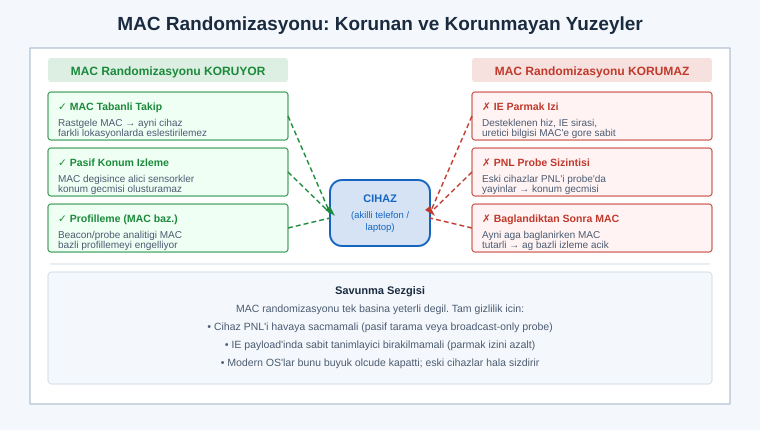
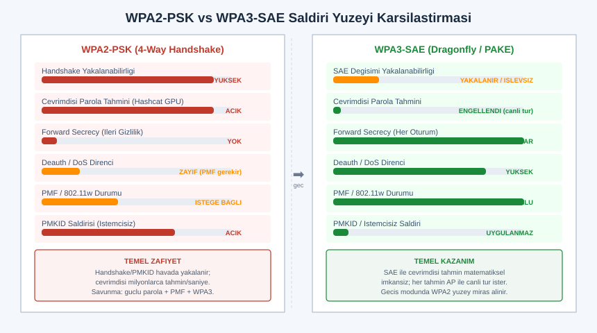
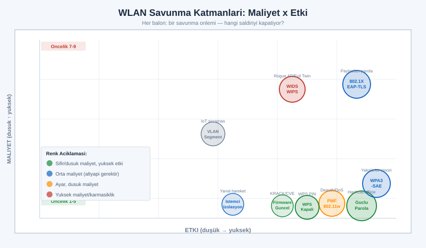

# SIGINT El Kitabı — Bölüm 15: WiFi/WLAN Güvenliği ve Saldırı Yüzeyi

## El-Sıkışmasından SAE'ye — 802.11'in Anatomisi, Yakalama Cihazları ve Kapsamlı Savunma

> Amaç: Bu bölüm, serinin RF temellerini (Bölüm 1), SDR donanımını (Bölüm 2) ve protokol çözümleme mantığını (Bölüm 5) 2,4/5/6 GHz'deki en yoğun saldırı yüzeyine, yani kablosuz yerel ağa (WLAN) uygular. Kullanıcının somut sorusu olan "el-sıkışmasını (handshake) yakalayan cihazlar" bu bölümün merkezindedir; ancak onu havada asılı bir hile olarak değil, 802.11'in kimlik doğrulama tasarımının doğal bir sonucu olarak ele alırız. Hedef, bir reçete listesi değil mühendislik sezgisidir: bir çerçevenin neden yakalanabildiğini, bir cihazın neyi yapıp neyi yapamadığını ve en önemlisi her saldırının karşısına hangi savunmanın konduğunu zihninde canlandırabilmen.

> Yasal çerçeve: Bu bölüm bir kablosuz güvenlik (WLAN pentest) eğitimi perspektifindedir. Anlatılan tekniklerin tamamı YALNIZCA kendine ait ağda veya yazılı izinli (kapsam belgeli) bir sızma testi kapsamında uygulanır. Başkasının kablosuz ağına izinsiz erişmek, trafiğini dinlemek veya hizmetini bozmak Türkiye'de TCK 243 (bilişim sistemine girme), TCK 244 (sistemi engelleme/bozma/verileri yok etme) ve haberleşmenin gizliliği başlıkları (TCK 132–140) kapsamında suçtur; deauthentication ile bir ağı bozmak ayrıca BTK telsiz mevzuatına aykırıdır. Bu metin "komşunun WiFi'ını kır" tarzı hedefli kötüye-kullanım talimatı değildir; her tekniği nasıl çalıştığı ve nasıl savunulduğu ekseninde verir. Alıştırmalar bilinçli olarak kendi erişim noktan ve kendi istemcilerin üzerine kuruludur. Şüphedeysen yapma, önce yazılı izin al.

---

## İÇİNDEKİLER

1. [802.11 Temelleri: Bantlar, Kanallar, Çerçeve Türleri](#1)
2. [Beacon, Probe ve SSID/BSSID: Ağın Kendini Nasıl İlan Ettiği](#2)
3. [Monitor Mode vs Managed Mode ve Kanal Hopping](#3)
4. [Pasif Keşif: İstemci Probe'larından Geçmiş Ağ İfşası ve MAC Randomizasyonu](#4)
5. [WPA/WPA2-Personal: 4-Way Handshake Nasıl Çalışır](#5)
6. [El-Sıkışması Yakalama: Deauth Prensibi, EAPOL ve PMKID](#6)
7. [Handshake Yakalayan Araçlar ve Ne Yaptıkları](#7)
8. [Adanmış Cihazlar: Pineapple, Pwnagotchi, ESP Deauth, Flipper](#8)
9. [Çevrimdışı Kırma: Hashcat/John, Maske/Sözlük ve Neden Güçlü Parola Kırılamaz](#9)
10. [WPA3 (SAE/Dragonfly): Yakala-Kır Neden Artık İşe Yaramıyor](#10)
11. [Kurumsal: WPA-Enterprise (802.1X/EAP/RADIUS) ve Evil Twin](#11)
12. [Diğer Saldırı Yüzeyi: Rogue AP, Karma, KRACK, WPS, Captive Portal](#12)
13. [Kapsamlı Savunma: PMF, WPA3, 802.1X, WIDS/WIPS, İstemci Yalıtımı](#13)
14. [Alıştırmalar (Yalnızca Kendi Ağında / Yetkili Test)](#14)
15. [Hızlı Referans ve Diğer Bölümler](#15)

---

<a id="1"></a>
## 1. 802.11 Temelleri: Bantlar, Kanallar, Çerçeve Türleri

WiFi'ı güvenlik açısından okuyabilmek için önce onun bir radyo protokolü olduğunu hatırlamak gerekir. Çoğu kişi WiFi'ı "kablosuz internet" diye düşünür; oysa IEEE 802.11, fiziksel katmanda OFDM modülasyonu (Bölüm 1) kullanan, ortamı paylaşımlı bir radyo erişim protokolüdür ve tüm zafiyetleri bu paylaşımlı, yayın tabanlı doğasından doğar. Havadaki her çerçeve, prensip olarak menzildeki her alıcı tarafından duyulabilir; şifreleme içeriği korur ama çerçevenin var olduğunu, kimden kime gittiğini ve ne tür bir çerçeve olduğunu gizleyemez. Bu temel gerçek, bölümün geri kalanının tamamını açıklar.

### Bantlar

802.11 üç ana lisanssız (ISM/U-NII) bantta çalışır. Her bandın güvenlik açısından kendi karakteri vardır.

| Bant | Tipik kanal genişliği | Menzil/duvar geçişi | Kalabalıklık | Güvenlik notu |
|---|---|---|---|---|
| 2,4 GHz | 20/40 MHz | En uzak, duvarı en iyi geçen | Çok kalabalık (3 örtüşmeyen kanal: 1/6/11) | En geniş saldırı yüzeyi; eski cihazlar burada, en çok dinlenir |
| 5 GHz | 20/40/80/160 MHz | Daha kısa, duvarda zayıflar | Daha çok kanal, daha ferah | DFS (radar paylaşımı) kanalları; daha az ama hâlâ açık |
| 6 GHz (WiFi 6E / 7) | 80/160/320 MHz | En kısa | Yeni, ferah | Yalnızca WPA3 zorunlu; eski/zayıf güvenlik yok (tasarım kararı) |

Güvenlik açısından kritik bir gözlem: 6 GHz bandı (WiFi 6E ve 7) standart gereği yalnızca WPA3 ve korumalı yönetim çerçeveleriyle (PMF, bkz. Bölüm 13) çalışır. Yani 6 GHz'e taşınan bir ağ, bu bölümde anlatılan klasik handshake-yakala-kır ve deauth saldırılarının çoğuna karşı tasarım gereği bağışık başlar. Bu, "yeni bant = yeni güvenlik temeli" anlayışının somut bir örneğidir.

### Kanallar

Her bant, kanallara bölünür. 2,4 GHz'de 1–13 numaralı kanallar (bölgeye göre) bulunur ama yalnızca 1, 6 ve 11 birbiriyle örtüşmez; geri kalanı komşusuyla girişim yapar. 5 GHz çok daha fazla örtüşmeyen kanal sunar, bir kısmı DFS (Dynamic Frequency Selection) kanalıdır ve hava radarıyla paylaşıldığından erişim noktası radar görürse kanal değiştirmek zorundadır. Güvenlik analistinin kanal bilmesi şart, çünkü bir alıcı (monitor mode) aynı anda yalnızca bir kanalı dinler; tüm bandı görmek için kanallar arasında dolaşmak (channel hopping, Bölüm 3) gerekir.

### Çerçeve türleri: yönetim, kontrol, veri

802.11'in en önemli güvenlik kavramı çerçeve türleridir. Üç sınıf vardır ve aralarındaki fark, neredeyse tüm WLAN saldırılarının dayandığı zemini oluşturur.

| Çerçeve sınıfı | İşlevi | Örnek alt türler | Tarihsel zafiyet |
|---|---|---|---|
| Yönetim (Management) | Ağı kurma, bağlanma, ayrılma | Beacon, Probe Request/Response, Authentication, Association, Deauthentication, Disassociation | Klasik olarak şifrelenmez ve doğrulanmaz → deauth/spoofing buradan gelir |
| Kontrol (Control) | Ortam erişimini düzenleme | RTS, CTS, ACK, Block-ACK | Sahte ACK/CTS ile ortam manipülasyonu (ileri düzey) |
| Veri (Data) | Asıl yükü taşıma | Şifreli veri çerçeveleri (WPA/WPA2/WPA3) | İçerik şifreli; meta-veri (boyut/zamanlama) sızar (Bölüm 7-trafik analizi) |

Burada altı çizilmesi gereken nokta şudur: WPA2'de bile veri çerçeveleri şifreliyken yönetim çerçeveleri klasik olarak korumasızdır. Bir saldırgan içeriği okuyamasa da, "ayrıl" (deauthentication) komutu taşıyan bir yönetim çerçevesini sahte BSSID ile üretip istemciyi ağdan düşürebilir. İşte 802.11w / PMF (Bölüm 13) tam olarak bu boşluğu kapatmak için yönetim çerçevelerine bütünlük koruması ekler. Bu cümleyi aklında tut; bölüm boyunca defalarca geri döneceğiz.

```
 802.11 çerçeve sınıfları ve şifreleme durumu (WPA2, PMF kapalı):

   ┌─────────────┬─────────────┬─────────────┐
   │  YÖNETİM    │   KONTROL   │    VERİ     │
   ├─────────────┼─────────────┼─────────────┤
   │ Beacon      │ RTS/CTS     │ şifreli yük │
   │ Probe Req/Rsp│ ACK        │ (WPA/WPA2)  │
   │ Auth/Assoc  │ Block-ACK   │             │
   │ Deauth ◄────┼─────────────┼── korumasız │
   │ Disassoc ◄──┤             │   ama içerik│
   │             │             │   şifreli   │
   │ KORUMASIZ   │  KORUMASIZ  │  ŞİFRELİ    │
   └─────────────┴─────────────┴─────────────┘
        ▲
        └── deauth saldırısı bu korumasız yönetim çerçevesini taklit eder
            (PMF/802.11w bunu imzalayıp engeller — Bölüm 13)
```

> Mühendislik sezgisi: WLAN güvenliğinin neredeyse tüm hikayesi tek bir gerilimde özetlenir — yönetim/kontrol çerçeveleri ağın "kendini yönetmesi" için açık ve hızlı olmak ister, ama açık olan her şey taklit edilebilir. WPA2 veriyi şifreledi, yönetimi açık bıraktı; WPA3 ve PMF bu son boşluğu kapatma çabasıdır. Bir saldırıyla karşılaştığında ilk soru şu olmalı: bu saldırı hangi korumasız çerçeveye dayanıyor ve onu hangi katman koruyor?

---

<a id="2"></a>
## 2. Beacon, Probe ve SSID/BSSID: Ağın Kendini Nasıl İlan Ettiği

Bir WiFi ağı sessiz değildir; sürekli kendini ilan eder. Bu ilan mekanizması hem ağın bulunabilirliğini sağlar hem de pasif keşfin (Bölüm 4) ham maddesidir.

### Beacon: ağın nabzı

Erişim noktası (AP), saniyede tipik olarak yaklaşık on kez (varsayılan ~102,4 ms aralıkla) bir beacon çerçevesi yayınlar. Bu çerçeve, ağ hakkında zengin bilgi taşır:

- SSID (ağ adı) — gizli (hidden) yapılmadıkça açık metin
- BSSID — AP'nin MAC adresi (ağın radyo kimliği)
- Desteklenen hızlar, kanal, bant genişliği
- Güvenlik bilgisi: RSN IE (Robust Security Network Information Element) — WPA2/WPA3 olup olmadığını, şifreleme paketini (CCMP/GCMP), kimlik doğrulama yöntemini (PSK/SAE/802.1X) ve PMF durumunu açık açık söyler

Not: RSN IE'nin açık metin olması, bir saldırgana hiç bağlanmadan ağın hangi güvenlik seviyesinde olduğunu söyler. Bir analist tek bir beacon yakalayarak "bu ağ WPA2-PSK, PMF kapalı" ya da "bu ağ WPA3-SAE, PMF zorunlu" sonucunu okur. Bu, PMKID saldırısının (Bölüm 6) neden mümkün olduğunu da açıklar.

### SSID ve BSSID ayrımı

| Terim | Nedir | Benzetme | Gizlenebilir mi |
|---|---|---|---|
| SSID | Ağın insan-okur adı ("EvAgi") | Mağazanın tabelası | Evet (hidden network) ama zayıf |
| BSSID | AP radyosunun MAC adresi | Mağazanın fiziksel adresi | Hayır (çerçeve başlığında zorunlu) |
| ESSID | Aynı SSID'yi paylaşan AP kümesi | Zincir mağaza markası | — |

BSSID, çerçevelerin gönderici/alıcı alanlarında zorunlu olduğundan gizlenemez. Bu yüzden "gizli SSID" zayıf bir önlemdir: SSID'yi beacon'dan çıkarabilirsin ama BSSID görünür kalır ve istemci ağa bağlanmaya çalıştığı anda SSID'yi probe çerçevesinde açık yayınlar (aşağıda).

### Probe Request / Response: istemcinin arayışı

İstemci bir ağ aramak için iki yol kullanır. Pasif tarama: kanalları dinleyip beacon bekler. Aktif tarama: Probe Request çerçevesi yayınlayıp "şu SSID burada mı?" diye sorar; menzildeki AP'ler Probe Response ile yanıtlar.

Aktif taramanın güvenlik açısından kritik yan etkisi şudur: bazı istemciler, daha önce bağlandıkları ağların adlarını probe request içinde tek tek sorabilir ("EvAgi orada mı? OfisWiFi orada mı? OtelXYZ orada mı?"). Bu, cihazın gittiği yerlerin (ev, iş, oteller, kafeler) bir listesini havaya saçar. Bu probe ifşası, Bölüm 4'te ele alacağımız gizlilik sızıntısının ve "evil twin"in (Bölüm 11-12) temelidir.

```
 Gizli SSID'nin neden zayıf olduğu:

   AP beacon:  [SSID: <boş/gizli>]  [BSSID: AA:BB:CC:11:22:33]  ← SSID gizli ama BSSID açık
        │
        ▼
   İstemci bağlanırken:
   İstemci → Probe Request [SSID: "GizliEvAgi"]  ← istemci SSID'yi açık yayınlar!
        │
        └── dinleyen biri gizli SSID'yi istemcinin probe'undan öğrenir
            (gizlilik sağlamaz; sadece sıradan kullanıcıyı yanıltır)
```

> Pratikte: Gizli SSID bir güvenlik önlemi sayılmaz; meşru kullanıcıyı bağlanma kolaylığından eder ama belirlenmiş bir analiste karşı saniyeler içinde çözülür. Gerçek güvenlik, ağ adının gizliliğinde değil, kimlik doğrulamanın gücündedir (WPA3 + güçlü parola + PMF). Ağ adını gizlemek yerine güçlü kimlik doğrulamaya yatırım yap.

---

<a id="3"></a>
## 3. Monitor Mode vs Managed Mode ve Kanal Hopping

WiFi adaptörü iki temel kipte çalışabilir ve bu ayrım, pasif keşfin mümkün olup olmamasını belirler.

### Managed mode (yönetilen kip)

Sıradan kullanım kipidir. Adaptör tek bir AP'ye bağlanır, yalnızca kendine adreslenmiş (ya da yayın/çok-noktaya) çerçeveleri üst katmana iletir, geri kalanını donanım düzeyinde eler. Bu kipte "havadaki tüm çerçeveleri" göremezsin; işletim sistemi sana yalnızca bağlı olduğun ağın sana ait trafiğini verir.

### Monitor mode (gözlem/monitör kip)

Adaptörü bir AP'ye bağlamadan, kanaldaki tüm 802.11 çerçevelerini (yönetim, kontrol ve menzildeki herkesin veri çerçeve başlıklarını) yakalayan kiptir. Bu, kablolu ağdaki "promiscuous mode"un kablosuz karşılığıdır ama daha güçlüdür: yalnızca bağlı olduğun ağı değil, menzildeki tüm ağları ve istemcileri görürsün. Handshake yakalama, beacon/probe analizi, deauth tespiti — hepsi monitor mode gerektirir.

Önemli donanım gerçeği: her WiFi yonga seti monitor mode'u (ve özellikle çerçeve enjeksiyonunu) desteklemez. Pentest dünyasında belirli yonga setleri (örneğin Atheros AR9271, Ralink/MediaTek RT3070/RT5370, Realtek RTL8812AU gibi) tercih edilir çünkü açık sürücülerle monitor mode ve paket enjeksiyonu güvenilir çalışır. Bir adaptörün enjeksiyon yeteneği, deauth gibi aktif tekniklerin (yalnızca kendi ağında/yetkili testte) çalışıp çalışmayacağını belirler. Hangi yonganın hangi sürümde enjeksiyonu desteklediği zamanla değiştiğinden güncel uyumluluk listesinden teyit edilmeli.

```
 Managed vs Monitor (kavramsal):

  MANAGED:                          MONITOR:
   havadaki çerçeveler                havadaki çerçeveler
        │                                  │
   ┌────┴────┐ donanım filtresi       ┌────┴────┐ filtre KAPALI
   │ sadece  │                        │ HEPSİ   │
   │ bana    │                        │ (tüm AP │
   │ ait     │ ──► OS ──► uygulama    │ +istemci│ ──► OS ──► capture
   └─────────┘                        └─────────┘     (airodump/kismet)
   (normal internet)                  (analiz/pentest — kanal kilitli)
```

### Kanal hopping

Monitor mode bir kerede yalnızca bir kanalı dinler. Bütün 2,4 ve 5 GHz spektrumunu taramak için araç, adaptörü kanaldan kanala hızla atlatır (channel hopping). Bu bir ödünleşmedir: ne kadar çok kanal tararsan, her kanalda o kadar az zaman geçirirsin ve belirli bir kanaldaki kısa süreli bir olayı (örneğin tek seferlik bir handshake) kaçırma riskin artar. Bu yüzden belirli bir hedefi (yalnızca kendi AP'ni) izlerken, araç o AP'nin kanalına kilitlenir; tüm spektrumu haritalarken ise hopping yapar. Bu, Bölüm 3'teki kanal hopping ve Bölüm 7'deki "tek alıcı bir anda bir yeri dinler" sezgisinin WiFi'a doğrudan uygulanışıdır.

---

<a id="4"></a>
## 4. Pasif Keşif: İstemci Probe'larından Geçmiş Ağ İfşası ve MAC Randomizasyonu

Pasif keşif, hiçbir çerçeve göndermeden yalnızca dinleyerek bilgi toplamaktır ve tamamen sessiz olduğundan tespit edilmesi zordur. WiFi'da pasif keşfin verimi şaşırtıcı derecede yüksektir, çünkü hem AP'ler hem istemciler sürekli konuşur.

### Ne görülür?

| Kaynak | Sızan bilgi | Saldırı/savunma değeri |
|---|---|---|
| AP beacon'ları | SSID, BSSID, güvenlik (RSN IE), kanal, üretici (OUI) | Hedef envanteri; zayıf güvenlik tespiti |
| İstemci probe request | Geçmiş ağ adları (PNL — Preferred Network List) | Konum geçmişi ifşası; evil twin için yem |
| İstemci ↔ AP association | Kim hangi ağa bağlı, istemci MAC'i | Ağ topolojisi (Bölüm 7-trafik analizi) |
| Veri çerçevesi meta-verisi | Paket boyutu, zamanlama, hacim | İçerik şifreliyken bile faaliyet çıkarımı |

Geçmiş ağ ifşası, gizlilik açısından en çarpıcı sızıntıdır. Eğer bir cihaz aktif tarama yaparken daha önce bağlandığı ağların adlarını sorarsa, bir dinleyici o cihazın "EvWiFi", "SirketAg", "AntalyaOtelXY", "BostonAirport" gibi listesini toparlayıp sahibinin nereye gittiğini profilleyebilir. Bu sadece teorik değil; tarihsel olarak konferanslarda toplanan probe listeleri, insanların yaşam örüntüsünü ifşa etmiştir.

### MAC randomizasyonu ve sınırları



Bu gizlilik sızıntısına karşı modern işletim sistemleri (iOS, Android, Windows, çoğu Linux masaüstü) MAC randomizasyonu uygular: cihaz tararken ve hatta ağlara bağlanırken gerçek donanım MAC'i yerine rastgele/cihaza-özel-ama-ağa-özel bir MAC kullanır. Amaç, aynı cihazın farklı yer ve zamanlarda izlenmesini (MAC tabanlı takibi) kırmaktır.

Ancak randomizasyonun sınırları vardır ve bir savunma analisti bunları bilmek zorundadır:

- Birçok cihaz, bir ağa fiilen bağlandıktan sonra o ağ için tutarlı (sabit, ağa-özel) bir MAC kullanır; yani aynı ağda cihaz yine izlenebilir.
- Randomizasyon yalnızca MAC'i değiştirir; çerçevedeki diğer parmak izleri (desteklenen hız kümeleri, IE sıralaması, üretici-özel bilgi elemanları) bir cihazı MAC'ten bağımsız olarak benzersizleştirebilir. Bu, Bölüm 7'deki "spesifik yayıcı tanıma / RF parmak izi" mantığının protokol-katmanı kuzenidir: donanım/yazılım istemeden ayırt edici bir imza bırakır.
- Probe içeriği (sorulan SSID listesi) randomizasyonla gizlenmez; modern OS'ler bu yüzden artık çoğunlukla yalnızca yönlendirilmiş (broadcast) probe kullanıp PNL'i havaya saçmamaya yönelmiştir, ama eski cihazlar hâlâ sızdırır.

> Savunma sezgisi: MAC randomizasyonu gerekli ama tek başına yeterli değildir. Tam gizlilik için cihazın PNL'i ifşa etmemesi (yalnızca pasif tarama ya da yönlendirilmiş probe), IE parmak izinin tektipleştirilmesi ve ağ-özel sabit MAC'in mümkünse rastgeleleştirilmesi gerekir. Kendi cihazlarının ne sızdırdığını görmek için Bölüm 14'teki alıştırmayı kendi telefonunla yap.

---

<a id="5"></a>
## 5. WPA/WPA2-Personal: 4-Way Handshake Nasıl Çalışır

Kullanıcının sorusunun kalbine geldik. "Handshake yakalama" denen şeyin ne olduğunu anlamak için önce 4-way handshake'in WPA2-Personal'da (PSK — Pre-Shared Key, paylaşılan parola) nasıl çalıştığını anlamak gerekir. Bu, bölümün en teknik ama en aydınlatıcı kısmıdır.

### Sırlar hiyerarşisi: PSK → PMK → PTK

WPA2-PSK'de güvenlik, herkesin bildiği ağ parolasından türetilen anahtarlar zinciriyle kurulur.

1. PSK / PMK: Ağ parolası (passphrase) ve SSID, PBKDF2 adlı bir anahtar türetme fonksiyonundan geçirilerek 256 bitlik PMK (Pairwise Master Key — İkili Ana Anahtar) üretilir. PBKDF2 kasten yavaştır (4096 yineleme) — bu yavaşlık, çevrimdışı kırmayı (Bölüm 9) zorlaştırmak için tasarlanmıştır. WPA2-Personal'da PMK, esasen parolanın bir fonksiyonudur; herkes aynı parolayı bildiği için herkesin PMK'sı aynıdır.

2. PTK: PMK doğrudan trafiği şifrelemekte kullanılmaz. Her oturum için, AP ve istemci, 4-way handshake sırasında bir PTK (Pairwise Transient Key — İkili Geçici Anahtar) türetir. PTK; PMK, her iki tarafın MAC adresleri ve iki rastgele sayıdan (nonce) üretilir:

```
   PTK = PRF( PMK,  ANonce ‖ SNonce ‖ AP_MAC ‖ İstemci_MAC )
                │       │        │
                │       │        └── istemcinin ürettiği rastgele (SNonce)
                │       └── AP'nin ürettiği rastgele (ANonce)
                └── parola+SSID'den türeyen ana anahtar
```

Buradaki incelik şudur: PTK'yı hesaplamak için gereken her şeyin (ANonce, SNonce, iki MAC) handshake sırasında açık metin yayınlanması — tek istisna PMK'dır. PMK'yı bilmeyen biri PTK'yı türetemez. İşte tüm WPA2-PSK güvenliği bu tek noktaya dayanır: PMK (yani parola) gizli kaldığı sürece sistem sağlamdır.

### Dört adım ve MIC

4-way handshake, AP ve istemcinin "ikimiz de aynı PMK'yı biliyoruz" olduğunu, PMK'yı havada hiç göndermeden kanıtlamasıdır. Mesajlar EAPOL (Extensible Authentication Protocol over LAN) çerçeveleri olarak taşınır.

```
 WPA2-PSK 4-Way Handshake (açık metin yayınlanan alanlar):

  İSTEMCİ (supplicant)                          ERİŞİM NOKTASI (authenticator)
  (ikisi de PMK'yı zaten biliyor: parola+SSID'den)
        │                                              │
        │   ◄────── M1: ANonce ──────────────────────  │  (1) AP rastgele ANonce yollar
        │                                              │
   SNonce üret;                                        │
   PTK'yı hesapla                                      │
   (PMK, ANonce, SNonce, MAC'ler)                      │
        │                                              │
        │   ─────── M2: SNonce + MIC ──────────────►   │  (2) istemci SNonce + bütünlük (MIC)
        │                                              │      AP de artık PTK'yı hesaplar
        │                                              │      ve MIC'i doğrular
        │   ◄────── M3: GTK + MIC ───────────────────  │  (3) AP grup anahtarı (GTK) + MIC
        │                                              │
        │   ─────── M4: ACK + MIC ─────────────────►   │  (4) istemci onay + MIC
        │                                              │
        ▼                                              ▼
   ŞİFRELİ VERİ AKIŞI (PTK ile, CCMP/AES)        bağlantı kuruldu
```

Kritik kavram MIC'tir (Message Integrity Code — Mesaj Bütünlük Kodu). M2'deki MIC, istemcinin hesapladığı PTK kullanılarak üretilir. AP, kendi hesapladığı PTK ile aynı MIC'i üretip karşılaştırır; eşleşiyorsa istemcinin doğru PMK'ya (doğru parolaya) sahip olduğu kanıtlanmış olur — çünkü yanlış parola yanlış PMK, yanlış PTK ve yanlış MIC üretirdi. Parola havada hiç gitmez; yalnızca onu bildiğinin matematiksel kanıtı (MIC) gider.

### Neden handshake yakalanabilir ve neden bu tehlikeli?

İşte kullanıcının asıl sorusunun cevabı buradan doğar. Handshake'in M1–M4 mesajları, yönetim/EAPOL çerçeveleri olarak açık metin yayınlanır (içlerindeki ANonce, SNonce, MAC'ler ve MIC görünür). Monitor mode'daki bir alıcı, bir istemci bir ağa bağlanırken bu dört çerçeveyi yakalayabilir. Yakalanan handshake tek başına parolayı vermez — ama parolayı çevrimdışı tahmin etmek için gereken her şeyi verir:

Saldırgan bir parola tahmini yapar → ondan PMK türetir (PBKDF2) → yakaladığı ANonce/SNonce/MAC'lerle PTK hesaplar → o PTK ile bir MIC üretir → yakaladığı gerçek MIC ile karşılaştırır. Eşleşirse tahmin doğrudur. Bu, çevrimdışı sözlük/maske saldırısıdır (Bölüm 9) ve ağa hiç dokunmadan, milyonlarca tahmin/saniye hızında, tamamen sessizce yapılabilir.

> Mühendislik sezgisi: Handshake yakalama, "parolayı çalmak" değildir; parolayı çevrimdışı sınamak için gereken doğrulama materyalini ele geçirmektir. Bu yüzden WPA2-PSK'nin tüm güvenliği parolanın entropisine indirgenir: matematiği sağlamdır (AES, PBKDF2 kusurlu değil), ama zayıf parola yakalanan handshake'le saatler içinde kırılır, güçlü parola pratikte hiç kırılmaz (Bölüm 9). WPA3 (Bölüm 10) tam olarak bu "yakala-ve-çevrimdışı-dene" zincirini kırmak için tasarlanmıştır.

---

<a id="6"></a>
## 6. El-Sıkışması Yakalama: Deauth Prensibi, EAPOL ve PMKID

Handshake'i yakalamak için bir istemcinin ağa bağlanması anını görmek gerekir. Bir saldırgan bu anı pasifçe bekleyebilir (sabırlı yöntem) ya da onu zorlayabilir. İkincisinin klasik aracı deauthentication çerçevesidir.

### Deauthentication: istemciyi yeniden bağlanmaya zorlamak

Bölüm 1'de yönetim çerçevelerinin (PMF kapalıyken) korumasız olduğunu söylemiştik. Deauthentication çerçevesi tam olarak bu boşluğu kullanır. Standart, deauth'u "ağı düzgün terk et" amacıyla tanımlar; ama PMF yoksa bu çerçeve doğrulanmaz, yani bir saldırgan AP'nin BSSID'sini kaynak adres olarak taklit edip istemciye "AP seni düşürdü, ayrıl" diyen sahte bir deauth gönderebilir. İstemci bunu gerçek sanır, bağlantıyı keser ve otomatik olarak yeniden bağlanmaya çalışır — bu yeniden bağlanma sırasında 4-way handshake yeni baştan yapılır ve saldırgan onu yakalar.

```
 Deauth ile handshake yakalamaya zorlama (yalnızca kendi ağında/yetkili test):

   [Saldırgan/analist]                [İstemci]            [AP]
   (monitor + enjeksiyon)                │                  │
        │                                │ ◄── bağlı ───►   │  (handshake çoktan olmuş, kaçırıldı)
        │                                │                  │
        │── sahte Deauth (src=AP BSSID) ─►│                 │  (1) istemci AP'den koptu sanır
        │                                │                  │
        │                                │── yeniden bağlan ─►  (2) 4-way handshake TEKRAR
        │                                │ ◄── M1/M2/M3/M4 ─►   │
        │                                │                  │
        │◄═══ handshake yakalandı ═══════╪══════════════════╪  (3) analist M1-M4'ü kaydeder
        │     (monitor mode dinliyor)    │                  │
        ▼
   çevrimdışı kırmaya hazır (Bölüm 9) — ama güçlü parola kırılamaz
```

Not: Deauth saldırısı aynı zamanda bir hizmet kesme (DoS) aracıdır; istemciyi tekrar tekrar düşürerek ağı kullanılmaz hale getirir. Bu yüzden deauth, başkasının ağında yalnızca handshake yakalamaktan da öte, doğrudan TCK 244 kapsamında "sistemi engelleme" suçudur. Kendi ağında ise PMF'in deauth'u nasıl etkisizleştirdiğini gözlemlemek (Bölüm 14 alıştırması) son derece öğreticidir.

### PMKID saldırısı: istemcisiz (clientless) yöntem

2018'de duyurulan PMKID saldırısı, handshake yakalamanın can sıkıcı bir bağımlılığını ortadan kaldırdı: artık bir istemcinin bağlanmasını beklemeye veya deauth ile zorlamaya gerek yoktur. Bazı AP'ler (özellikle dolaşım/roaming özelliği olanlar), ilk association sırasında, RSN IE içinde bir PMKID alanı gönderir. PMKID şöyle hesaplanır:

```
   PMKID = HMAC-SHA1( PMK,  "PMK Name" ‖ AP_MAC ‖ İstemci_MAC )
                       │
                       └── yine PMK'ya (parolaya) bağlı!
```

Saldırgan AP'ye tek bir association denemesi yaparak bu PMKID'yi tek bir çerçeveden elde edebilir — istemci hiç gerekmez (clientless). PMKID de PMK'nın (parolanın) bir fonksiyonu olduğundan, tıpkı handshake gibi çevrimdışı parola tahminine sokulabilir: tahmin → PMK → hesaplanan PMKID → yakalanan PMKID ile karşılaştır. Sonuç yine aynı: zayıf parola düşer, güçlü parola düşmez.

| Yöntem | İstemci gerekir mi | Deauth gerekir mi | Ne yakalanır | Ortak sonuç |
|---|---|---|---|---|
| 4-way handshake yakalama | Evet (bağlanan biri) | Hayır (beklersen) / Evet (zorlarsan) | M1-M4, MIC | Çevrimdışı parola tahmini |
| PMKID saldırısı | Hayır (clientless) | Hayır | RSN IE'deki PMKID | Çevrimdışı parola tahmini |

Önemli bir savunma notu: Tüm AP'ler PMKID'yi göndermez; gönderenlerde de güçlü parola hâlâ koruma sağlar. PMKID, "ne yakalayacağını" kolaylaştırır ama "parolayı kırma" zorluğunu değiştirmez. Yani PMKID, zayıf-parola riskini büyütür, güçlü-parolayı tehdit etmez.

> Mühendislik sezgisi: Hem handshake hem PMKID, aynı zincirin (PMK = f(parola)) farklı yerlerinden bir doğrulama parçası koparır. Saldırı yüzeyi "parolayı çevrimdışı sınama materyali"dir; ortak panzehir tek bir şeydir — uzun, rastgele, yüksek-entropili parola (ve nihayetinde WPA3'e geçiş). Bir savunmacı olarak "handshake'i yakalattırmamaya" çalışmak (mümkün değil, havada herkes dinleyebilir) yerine, "yakalansa bile kırılamaması"na yatırım yaparsın.

---

<a id="7"></a>
## 7. Handshake Yakalayan Araçlar ve Ne Yaptıkları

Kullanıcı özellikle "handshake yakalayan cihaz/araçları" sordu. Önce yazılım araç zincirini, sonra (Bölüm 8) adanmış donanımları ele alalım. Her aracı "ne yapar ve sınırı nedir" ekseninde veriyorum; amaç komut reçetesi değil, hangi aracın zincirin hangi halkasında durduğunu anlamaktır.

### aircrack-ng paketi

WLAN güvenliğinin tarihsel referans araç takımıdır; tek bir program değil, bir paket araçtır:

| Araç | İşlevi | Zincirdeki yeri |
|---|---|---|
| airmon-ng | Adaptörü monitor mode'a alır | Hazırlık |
| airodump-ng | Kanalları tarar, AP/istemci listeler, handshake'i diske yazar (.cap/.pcap) | Yakalama |
| aireplay-ng | Çerçeve enjekte eder (deauth dahil) | Zorlama (yalnızca kendi/yetkili) |
| aircrack-ng | Yakalanan handshake'i sözlükle dener (CPU) | Çevrimdışı kırma (Bölüm 9) |
| airbase-ng | Sahte AP kurar (rogue AP/evil twin deneyleri) | Bölüm 11-12 |

Tipik akış (kendi ağında): airmon ile monitor → airodump ile kendi AP'inin kanalına kilitlen ve handshake yakala → (gerekirse) kendi istemcine aireplay ile deauth → yakalanan .cap'i hashcat/aircrack ile kendi güçlü parolanın kırılamadığını göster. Sınırı: aircrack-ng'nin kendi kırma motoru CPU tabanlıdır ve yavaştır; ciddi kırma için handshake hashcat'e (GPU) aktarılır.

### hcxdumptool / hcxtools

Modern PMKID ve handshake toplama için tasarlanmış pakettir ve aircrack-ng'ye göre bazı işleri daha verimli yapar:

- hcxdumptool: Havadan PMKID ve EAPOL handshake'leri toplar; clientless PMKID için optimize edilmiştir. Çerçeve enjeksiyon yeteneklerini de barındırır (yalnızca kendi/yetkili ortamda kullanılmalı; aracın gücü kötüye-kullanım sorumluluğunu artırır).
- hcxtools (örn. hcxpcapngtool): Yakalanan ham veriyi hashcat'in anladığı hash formatına (mod 22000 — hem PMKID hem EAPOL'ü kapsar) dönüştürür.

Sınırı: hcxdumptool agresif bir araçtır; yanlış elde bir ağ ortamını rahatsız edebilir. Belgeleri bile "yalnızca kendi ağında" uyarısını öne çıkarır. Çıktısı yalnızca bir "hash"tir; parolayı yine çevrimdışı kırıcı (hashcat) bulur ve güçlü parolada başarısız olur.

### Bettercap

Modüler bir ağ saldırı/izleme çerçevesidir; WiFi modülü ile AP/istemci keşfi, handshake yakalama, deauth ve (kablolu tarafta) MITM yapabilir. Tek bir konsoldan birçok yeteneği birleştirmesi onu pentest'te popüler kılar. Sınırı: bir İsviçre çakısıdır, derin WiFi-özel optimizasyonlarda (örneğin en agresif PMKID toplama) özel araçların gerisinde kalabilir; gücü genişliğinde, derinliğinde değil.

### Kismet

Diğerlerinden farklı bir felsefededir: Kismet öncelikle pasif bir kablosuz keşif, IDS ve algılama platformudur, bir kırma aracı değil. Monitor mode'da AP'leri, istemcileri, gizli SSID'leri, probe'ları, kanal kullanımını sürekli kaydeder; deauth fırtınası ya da rogue AP gibi anomalileri tespit eder. Bu yüzden Kismet hem keşif (saldırı tarafı) hem de WIDS (savunma tarafı, Bölüm 13) aracı olarak okunmalıdır. Sınırı: aktif olarak parola kırmaz, deauth atmaz; görevi "havada ne olduğunu görmek ve loglamak"tır — ki bu savunma için tam da istenen şeydir.

```
 Yakalama zincirinde araçların yeri:

   [monitor mode]
        │
        ▼
   ┌──────────────┐   handshake/PMKID    ┌──────────────┐   hash (22000)   ┌──────────┐
   │ airodump-ng  │ ───── yakala ──────► │ hcxpcapngtool│ ──── dönüştür ──► │ hashcat  │
   │ hcxdumptool  │                      │ (hcxtools)   │                   │ (GPU)    │
   │ bettercap    │                      └──────────────┘                   └────┬─────┘
   └──────────────┘                                                              │
        ▲                                                              güçlü parola?
   ┌────┴─────┐                                                        ── EVET → kırılamaz
   │ Kismet   │  ← savunma/keşif: havadaki her şeyi loglar, anomali (deauth/rogue) tespiti
   └──────────┘     (kırmaz; WIDS rolü — Bölüm 13)
```

> Pratikte: Bu araçların hiçbiri sihirli değildir; hepsi aynı fiziği kullanır (monitor mode + açık çerçeveler) ve hepsinin çıktısı aynı duvara çarpar — güçlü parola ya WPA3. Araçları "ne kadar tehlikeli" diye değil, "zincirin hangi halkasını otomatikleştiriyor" diye sınıflandır: keşif (Kismet), yakalama (airodump/hcxdumptool/bettercap), dönüştürme (hcxtools), kırma (hashcat). Savunmacı olarak senin asıl ilgilenmen gereken son halka değil, ilk halkadır: yakalanan materyalin işe yaramaması.

---

<a id="8"></a>
## 8. Adanmış Cihazlar: Pineapple, Pwnagotchi, ESP Deauth, Flipper

Yazılım zinciri bir dizüstü ve uyumlu bir adaptörle çalışır. Ama kullanıcının sorusundaki "cihazlar" çoğu zaman bu işi tek başına, taşınabilir ve otomatik yapan adanmış donanımları kasteder. Her birini yeteneği ve sınırıyla ele alalım; ve hepsinin başına aynı uyarıyı koyalım: bunlar yalnızca kendi ağında veya yazılı izinli testte meşrudur, başkasının ağına yöneltmek suçtur.

### WiFi Pineapple (rogue AP / keşif platformu)

WiFi Pineapple, asıl olarak bir handshake-yakalayıcı değil, bir rogue AP ve keşif/MITM platformudur. Güçlü yanı, evil twin ve "karma" benzeri saldırıları (Bölüm 11-12) tıklayarak yapılabilir hale getiren bir arayüz ve çift radyo sunmasıdır: istemcilerin probe ettiği ağları taklit edip onları kendi sahte AP'sine çekme etrafında tasarlanmıştır. Handshake/PMKID toplama da yapabilir ama asıl kimliği "ortadaki adam için sahte AP altyapısı"dır.

- Yeteneği: çift bant rogue AP, otomatik evil twin, istemci yönlendirme, captive portal, modüler eklentiler, sahadan yönetim.
- Sınırı: bir reklam panosu kadar gürültülüdür (kendi beacon'larını yayar), dolayısıyla bir WIDS (Bölüm 13) tarafından kolayca tespit edilir; pasif değildir. Güçlü kimlik doğrulama (WPA3, sertifika doğrulamalı 802.1X) karşısında "istemciyi kandırma" hamlesi büyük ölçüde etkisizleşir.

### Pwnagotchi (otomatik handshake toplayıcı, A2C/AI)

Pwnagotchi, kullanıcının sorusuna en doğrudan uyan cihazdır: küçük bir kart bilgisayar (tipik olarak Raspberry Pi Zero) üzerinde çalışan, tek amacı havadan WPA/WPA2 handshake ve PMKID toplamak olan otonom bir ajandır. İlginç yanı, bu işi pekiştirmeli öğrenme (A2C — Advantage Actor-Critic) ile "öğrenerek" yapması ve topladıkça mutlu olan bir tamagotchi yüzü göstermesidir. Pratikte yaptığı, bettercap'i bir politika ağıyla sürerek kanal seçimi ve deauth zamanlamasını ortamına göre uyarlamaktır.

- Yeteneği: tamamen otonom, taşınabilir, pilden çalışır; gezerken handshake/PMKID biriktirir; topladıklarını çevrimdışı kırma için saklar; isteğe bağlı olarak diğer pwnagotchi'lerle "selamlaşır".
- Sınırı: yalnızca toplar; parolayı kendi kırmaz (kırma yine hashcat/GPU işi). Topladığı materyalin değeri yine hedef parolaların gücüne bağlıdır — güçlü parolalı bir ortamda gün boyu handshake toplasa bile hiçbirini açamaz. Deauth atması onu WIDS'e ve PMF'e karşı görünür/etkisiz kılar.

Not: Pwnagotchi'nin "AI ile WiFi kırıyor" algısı yanıltıcıdır. Yapay öğrenme yalnızca toplama verimini (hangi kanalda ne zaman deauth atılacağını) optimize eder; kriptografiyi kırmaz. Parola güçlüyse, dünyanın en iyi politika ağı bile yakalanan handshake'i çözemez. Bu, "araç pazarlaması" ile "kriptografik gerçeklik" arasındaki farkın güzel bir dersidir.

### ESP32 / ESP8266 deauth tahtaları

ESP8266 ve ESP32, birkaç dolarlık WiFi mikrodenetleyicilerdir. Üzerlerinde çalışan açık kaynak firmware'ler (deauth amaçlı projeler) onları minik bir deauth/beacon-spam cihazına çevirebilir.

- Yeteneği: çok ucuz ve küçük; deauth çerçeveleri ve sahte beacon (beacon spam) üretebilir; bazı türevleri sınırlı probe/PMKID denemesi yapar.
- Sınırı: 2,4 GHz ile sınırlıdır (5/6 GHz yok); radyosu ve enjeksiyon yeteneği zayıf/kararsızdır; ciddi handshake toplama veya kırma için uygun değildir. Asıl "yeteneği" deauth-DoS'tur ki bu da PMF açıkken çalışmaz. Eğitimsel değeri yüksek (çerçeve enjeksiyonunun ne kadar basit olduğunu gösterir), operasyonel değeri düşüktür.

### Flipper Zero (WiFi devboard ile)

Flipper Zero'nun kendi ana radyosu sub-GHz/NFC/RFID/IR'dir (Bölüm 2'de geçti) ve doğrudan WiFi yapmaz. Ancak ESP32-S2 tabanlı bir WiFi devboard (geliştirme kartı) eklendiğinde, Flipper bu kart üzerinden WiFi keşfi, deauth ve temel handshake/PMKID toplama (kart firmware'inin yeteneğine bağlı) yapabilir. Yani Flipper burada bir arayüz/taşıyıcıdır; asıl WiFi işini eklenen ESP32 yapar.

- Yeteneği: taşınabilir, çok-araçlı bir platforma WiFi keşif/deauth eklentisi; sahada hızlı triyaj.
- Sınırı: yine ESP32'nin sınırları geçerlidir (2,4 GHz, zayıf enjeksiyon); ciddi WLAN pentest için bir dizüstü + iyi adaptör (Bölüm 3) çok daha yeteneklidir. Flipper'ın gücü WiFi'da değil, çok-bantlı her-şeyi-yapan cep aracı olmasındadır.

| Cihaz | Asıl rolü | Handshake/PMKID | Deauth | Bant | En büyük sınırı |
|---|---|---|---|---|---|
| WiFi Pineapple | Rogue AP / evil twin / MITM | Yapabilir (ikincil) | Evet | 2,4 + 5 | Gürültülü, WIDS'e görünür; WPA3/802.1X'e karşı zayıf |
| Pwnagotchi | Otonom toplayıcı (A2C) | Asıl işi | Evet | 2,4 | Kırmaz; güçlü parola karşısında değersiz; PMF'e açık |
| ESP32/ESP8266 | Ucuz deauth/beacon-spam | Çok sınırlı | Evet (zayıf) | 2,4 | Zayıf radyo; ciddi iş yapamaz; PMF durdurur |
| Flipper + WiFi devboard | Çok-araç + WiFi eklenti | ESP32 kadar | Evet | 2,4 | ESP32 sınırları; dizüstüne göre kısıtlı |

> Mühendislik sezgisi: Bu cihazların tamamı, Bölüm 5-6'da anlattığımız aynı iki fiziksel olguyu (açık yönetim çerçeveleri + PMK'ya bağlı doğrulama materyali) paketler; hiçbiri yeni bir kriptografik kırılganlık icat etmez. Aralarındaki fark ergonomidir (taşınabilirlik, otomasyon, çift bant), kapasite değil. Ve hepsi aynı iki savunmaya çarpar: güçlü parola çevrimdışı kırmayı, PMF/WPA3 ise deauth'u ve yakala-kır zincirini etkisizleştirir. Bir savunmacı olarak bu cihazların listesini ezberlemen değil, ortak panzehiri (PMF + WPA3 + güçlü parola) kurman önemlidir.

---

<a id="9"></a>
## 9. Çevrimdışı Kırma: Hashcat/John, Maske/Sözlük ve Neden Güçlü Parola Kırılamaz

Handshake ya da PMKID yakalandı; şimdi parolayı bulma denemesi başlar. Bu adım tamamen çevrimdışıdır — ağa hiç dokunulmaz, hız yalnızca saldırganın donanımıyla sınırlıdır. Burada savunmanın matematiksel temelini görürüz.

### Araçlar: hashcat ve John the Ripper

| Araç | Güçlü yanı | Tipik kullanım |
|---|---|---|
| hashcat | GPU hızlandırmalı, WPA için en yaygın; mod 22000 (PMKID+EAPOL birleşik) | Yüksek hızlı sözlük/maske/kural saldırıları |
| John the Ripper | Esnek kural motoru, CPU+GPU; çok formatlı | Akıllı kural/melez saldırılar |

Yakalanan veri hcxtools ile mod 22000 hash'ine çevrilir ve hashcat'e verilir. Saldırı tipleri:

- Sözlük (wordlist) saldırısı: Bilinen/sızmış parola listeleri (örneğin büyük ihlal derlemeleri) tek tek denenir. İnsanların seçtiği zayıf, sözlükte olan, daha önce sızmış parolalar burada saniyeler-dakikalar içinde düşer.
- Kural (rule) tabanlı saldırı: Sözlük girdileri dönüştürülür ("parola" → "Parola1!", "p@ssw0rd"). İnsan parola alışkanlıklarını taklit eder; saf sözlüğün kaçırdığı "biraz değiştirilmiş zayıf parolaları" yakalar.
- Maske (mask) / kaba kuvvet saldırısı: Belirli bir karakter deseni ("8 büyük harf", "ad + 4 rakam") tüm olasılıklarıyla denenir. Parolanın yapısı tahmin edilebiliyorsa güçlüdür.

### Neden güçlü parola pratikte kırılamaz: entropi matematiği

İşte savunmanın çekirdeği. Çevrimdışı kırmanın hızı yüksektir (modern GPU'larla WPA2 için saniyede yüz binlerce ila milyonlarca tahmin mertebesinde; kesin rakam donanıma göre değişir, teyit edilmeli). Ama olası parola sayısı, parolanın uzunluğu ve karakter kümesiyle üstel büyür. Anahtar kavram entropi (bit cinsinden belirsizlik):

```
   Olası kombinasyon sayısı ≈ (karakter_kümesi_boyutu) ^ (uzunluk)

   Örnek (yalnızca büyüklük sırasını göstermek için, kesin süre donanıma bağlı):

   8 karakter, sadece küçük harf (26^8  ≈ 2×10^11)      → modern GPU ile makul sürede
   8 karakter, harf+rakam+sembol (95^8 ≈ 6×10^15)        → çok daha zor ama mümkün olabilir
   12 karakter, harf+rakam+sembol (95^12 ≈ 5×10^23)      → astronomik; pratikte erişilemez
   4 rastgele kelime (diceware, ~44+ bit)               → yine astronomik arama uzayı

   PBKDF2'nin 4096 yinelemesi her tahmini ayrıca yavaşlatır → kırıcının hızını düşürür.
```

Sezgi şudur: kırma hızı sabit kalsa bile, parolaya her eklenen rastgele karakter olası kombinasyon sayısını katlar; belirli bir uzunluk ve rastgelelikten sonra arama uzayı evrenin ömründen uzun süreler gerektirir. WPA2'nin altındaki kriptografi (AES-CCMP, PBKDF2-SHA1, HMAC) kırılmış değildir; saldırının tek yolu parolayı tahmindir ve tahmin, yeterince uzun ve rastgele bir parola karşısında üstel duvara çarpar.

| Parola seçimi | Tahmini direnç | Yorum |
|---|---|---|
| "12345678", "password", ağ adı + yıl | Anında–dakikalar | Sözlük/sızıntıda var; asla kullanma |
| "Yasin1985", "Ev_Wifi_2024" | Saatler–günler | Kural saldırısı yakalar; zayıf |
| Rastgele 12+ karakter (harf+rakam+sembol) | Pratikte erişilemez | Önerilen taban |
| 4-5 rastgele kelime (diceware) | Pratikte erişilemez | Hatırlanabilir + güçlü |

> Mühendislik sezgisi: WPA2-PSK'nin güvenliği bir kriptografi sorunu değil, bir parola entropisi sorunudur. "Handshake yakalandı" cümlesi, parolan güçlüyse alarm değildir — yakalanan materyal kırılamayan bir hash'ten ibarettir. Bu yüzden en ucuz, en etkili WLAN savunması tek bir karardır: uzun, rastgele, benzersiz bir parola (ve mümkünse WPA3). Pahalı WIDS'ten önce bu yapılır; çünkü bu, saldırının son halkasını matematiksel olarak kör eder.

---

<a id="10"></a>
## 10. WPA3 (SAE/Dragonfly): Yakala-Kır Neden Artık İşe Yaramıyor



Bölüm 5-9 boyunca anlatılan tüm saldırı zinciri tek bir tasarım kusuruna dayanıyordu: WPA2-PSK'de, parolaya bağlı doğrulama materyali (handshake/PMKID) havadan yakalanıp sınırsız sayıda çevrimdışı tahmine sokulabiliyordu. WPA3, tam olarak bu zinciri kırmak için tasarlandı.

### SAE / Dragonfly: çevrimdışı sözlük saldırısını imkânsızlaştırmak

WPA3-Personal, eski PSK handshake'i yerine SAE (Simultaneous Authentication of Equals — Eşitlerin Eşzamanlı Kimlik Doğrulaması), namıdiğer Dragonfly el-sıkışmasını kullanır. SAE, parola-doğrulamalı bir anahtar değişimidir (PAKE — Password Authenticated Key Exchange) ve eliptik eğri kriptografisine dayanır. Kritik özellikleri:

- Çevrimdışı sözlük direnci: SAE el-sıkışmasını yakalamak işe yaramaz. Yakalanan trafikten parola tahminini çevrimdışı sınamak matematiksel olarak mümkün değildir; çünkü her tahmin, AP ile aktif ve interaktif bir tur gerektirir. Yani saldırgan parolayı denemek için her seferinde AP ile gerçek zamanlı konuşmak zorundadır — bu da hızını AP'nin yanıt hızına ve hız sınırlamasına indirir; milyon-tahmin/saniye biter.
- Forward secrecy (ileri gizlilik): Her oturum bağımsız bir anahtar üretir. Parola günün birinde ele geçse bile, geçmişte kaydedilmiş şifreli trafik geriye dönük çözülemez. WPA2-PSK'de ise parolayı bulan, o parolayla kaydedilmiş tüm geçmiş oturumları çözebilirdi.
- Çevrimiçi tahmine de direnç: Yanlış tahminler hız-sınırlanabilir ve tespit edilir; deneme-yanılma havai fişek gibi görünür hale gelir.

```
 WPA2-PSK vs WPA3-SAE: çevrimdışı kırma yüzeyi

  WPA2-PSK:                                WPA3-SAE (Dragonfly):
   handshake/PMKID havada                   SAE değişimi havada
        │ yakala                                 │ yakala
        ▼                                        ▼
   ÇEVRİMDIŞI sınırsız tahmin            ÇEVRİMDIŞI tahmin İŞE YARAMAZ
   (milyon/saniye, sessiz)               her tahmin AP ile CANLI tur ister
        │                                        │
        ▼                                        ▼
   zayıf parola → düşer                    yalnızca çevrimiçi, hız-sınırlı,
   güçlü parola → direnç                   gürültülü deneme → pratikte kör
                                          + forward secrecy (geçmiş korunur)
```

Sonuç olarak, bu bölümün başından beri anlattığımız "handshake yakala → hashcat ile kır" iş akışı, WPA3-SAE'ye karşı temelden çöker. Pwnagotchi gün boyu SAE değişimi toplasa bile elinde çevrimdışı kırılabilir hiçbir şey olmaz. Bu, kullanıcının sorusuna en güçlü savunma cevabıdır: yakalama cihazları WPA3 karşısında "yakalayacak işe yarar materyal" bulamaz.

### Geçiş modu zafiyeti ve Dragonblood

WPA3 mükemmel değildir ve iki incelik bilinmelidir:

- Geçiş (transition) modu zafiyeti: Eski cihazlarla uyum için birçok ağ WPA2/WPA3 karışık (transition) modda çalışır. Bu modda, ağ aynı anda WPA2-PSK'yi de kabul ettiğinden, bir saldırgan istemciyi WPA2'ye düşürmeye (downgrade) zorlayıp eski yakala-kır zincirini geri getirebilir. Yani WPA3'ün koruması, ağ saf WPA3-only modda olduğunda tam kazanılır; karışık mod, WPA2'nin saldırı yüzeyini miras alır.
- Dragonblood (kavram): 2019'da SAE/Dragonfly'ın ilk uygulamalarında bir dizi zafiyet (yan-kanal sızıntıları, downgrade ve DoS vektörleri) açıklandı ve topluca "Dragonblood" olarak anıldı. Bunların bir kısmı SAE'nin tasarımından çok belirli uygulamalardaki kusurlardan kaynaklanıyordu ve yamalarla giderildi; kavramsal ders şudur: yeni bir kriptografik protokol bile ilk uygulamalarında olgunlaşma sorunları yaşar. Güncel cihaz/firmware kullanmak (Bölüm 13) bu yüzden savunmanın parçasıdır. Dragonblood'un hangi varyantının hangi sürümde kapatıldığı kaynaktan teyit edilmeli.

### Enhanced Open (OWE): şifresiz ağların şifrelenmesi

WPA3 ailesinin bir diğer parçası, açık (parolasız) ağlar içindir: Enhanced Open / OWE (Opportunistic Wireless Encryption). Klasik açık WiFi'da (kafe, otel) trafik tamamen şifresizdir; herkes herkesinkini okur. OWE, parola olmadan, kimlik doğrulamasız ama oturum başına Diffie-Hellman anahtar değişimiyle her istemciye ayrı şifreleme sağlar. Bu, "açık ama pasif dinlemeye kapalı" bir ağ demektir. Sınırı: OWE kimlik doğrulamaz (evil twin'i tek başına çözmez), yalnızca pasif dinlemeyi engeller; yine de açık ağlar için büyük bir iyileşmedir.

> Mühendislik sezgisi: WPA2'den WPA3'e geçiş, "daha uzun parola" gibi nicel bir iyileşme değil, saldırı modelini değiştiren nitel bir kırılmadır. WPA2'de savunma parolanın entropisine yaslanıyordu; WPA3-SAE'de çevrimdışı tahmin yolu kapandığı için savunma protokolün kendisine taşınır. Yine de geçiş modunda WPA2 yüzeyi geri sızar — bu yüzden gerçek kazanç, mümkün olduğunda WPA3-only çalışmaktır.

---

<a id="11"></a>
## 11. Kurumsal: WPA-Enterprise (802.1X/EAP/RADIUS) ve Evil Twin

Şimdiye kadar herkesin aynı parolayı paylaştığı Personal (PSK/SAE) modu anlattık. Kurumsal ağlar bambaşka bir modele geçer: WPA-Enterprise, yani 802.1X.

### 802.1X / EAP / RADIUS mimarisi

Personal'da tek bir ağ parolası vardı; Enterprise'da her kullanıcının kendi kimliği (kullanıcı adı/parola ya da sertifika) vardır ve kimlik doğrulama merkezi bir sunucuya devredilir.

```
 WPA-Enterprise (802.1X) üç taraflı model:

   [İstemci]            [AP / anahtar]            [RADIUS sunucusu]
   (supplicant)         (authenticator)           (authentication server)
        │                     │                          │
        │── EAP kimlik ──────►│── RADIUS ileti ─────────►│  (1) AP sadece aracı (port bekçisi)
        │                     │                          │
        │◄═══ EAP yöntemi (TLS tüneli) ════════════════►│  (2) gerçek doğrulama burada
        │                     │                          │      (sertifika/kullanıcı kimliği)
        │                     │◄── kabul/ret + anahtar ──│  (3) RADIUS kararı verir
        │◄── port açıldı ─────│                          │
        ▼
   her kullanıcı için ayrı anahtar (paylaşılan PSK yok)
```

Üç bileşen: supplicant (istemci), authenticator (AP/anahtar — yalnızca bir "port bekçisi", kararı kendi vermez), ve authentication server (RADIUS). Gerçek kimlik doğrulama, EAP (Extensible Authentication Protocol) yöntemleriyle yapılır; en yaygınları EAP-TLS (her iki taraf sertifika), PEAP ve EAP-TTLS (sunucu sertifikası + tünel içinde kullanıcı parolası).

Enterprise'ın güvenlik avantajları: paylaşılan parola yok (bir kullanıcı ayrılınca tüm ağın parolasını değiştirmek gerekmez, sadece o kullanıcı devre dışı bırakılır), kişi bazlı kimlik/iz, oturum başına anahtar, ve handshake-yakala-kır'ın PSK modeli burada geçerli değildir (kırılacak ortak parola yoktur).

### Evil twin / sahte RADIUS prensibi ve savunma

Enterprise'ın aşil topuğu, kimlik doğrulamanın yönü konusundaki bir ihmaldir. EAP-PEAP/TTLS'de istemci, parolasını (genellikle MSCHAPv2 ile) bir TLS tüneli içinde RADIUS sunucusuna yollar. Eğer istemci, bağlandığı RADIUS sunucusunun sertifikasını doğrulamazsa, bir saldırgan sahte bir AP + sahte bir RADIUS sunucusu kurup istemciyi kendine bağlanmaya kandırabilir; istemci kimlik bilgisini (MSCHAPv2 challenge/response) doğrudan saldırgana teslim eder ve bu çevrimdışı kırılabilir.

```
 Evil twin + sahte RADIUS (kavram):

   [İstemci]                    [SAHTE AP + SAHTE RADIUS]
   (sertifikayı doğrulamıyor!)        (saldırgan)
        │                                 │
        │── "SirketAg"e bağlanıyorum ────►│  (taklit SSID — istemci ayırt edemez)
        │── EAP kimlik + MSCHAPv2 ───────►│  (istemci kimliğini sahte sunucuya verir)
        │                                 │
        ▼                                 ▼
   kimlik bilgisi çalındı          çevrimdışı kırma (MSCHAPv2 zayıf)

   SAVUNMA: istemci RADIUS sertifikasını DOĞRULARSA →
   sahte sunucunun sertifikası güvenilmez → istemci bağlanmaz → saldırı çöker
```

Savunma nettir ve tek bir ilkeye dayanır: istemci tarafında sunucu sertifikası doğrulaması zorunlu kılınmalıdır. İstemci yapılandırması, yalnızca belirli bir kök CA tarafından imzalanmış ve belirli bir ada sahip RADIUS sunucusuna güvenecek şekilde kilitlenirse, sahte RADIUS'un sertifikası reddedilir ve evil twin çöker. En güçlü hali EAP-TLS'tir: parola yerine istemci sertifikası kullanıldığından, çalınacak bir parola yoktur. Kurumsal WLAN güvenliğinin en sık görülen gerçek zafiyeti, teknolojinin kendisi değil, istemcilerde sertifika doğrulamasının kapalı/yanlış yapılandırılmış olmasıdır.

> Mühendislik sezgisi: Enterprise, PSK'nin "ortak parola" zafiyetini çözer ama yeni bir güven sorusu açar — istemci, konuştuğu sunucunun gerçek olduğundan nasıl emin olur? Cevap sertifikadır. WPA-Enterprise'ın güvenliği, dağıtımdaki en zayıf istemcinin sertifika doğrulama ayarı kadardır. Bir saldırı yüzeyi olarak evil twin, kriptografiyi değil, doğrulama ihmalini hedefler; savunma da kriptografi değil, doğru istemci yapılandırmasıdır.

---

<a id="12"></a>
## 12. Diğer Saldırı Yüzeyi: Rogue AP, Karma, KRACK, WPS, Captive Portal

Handshake/PMKID dışında, WLAN saldırı yüzeyinin tamamlayıcı parçalarını kısa ama doğru biçimde geçelim. Bunların bir kısmı tarihseldir (yamalandı) ama kavram olarak öğreticidir.

### Rogue AP ve evil twin

Rogue AP, bir ağda yetkisiz kurulmuş herhangi bir erişim noktasıdır (kötü niyetli bir saldırgan kadar, "kolaylık olsun" diye masasının altına AP takan bir çalışan da olabilir). Evil twin, bunun hedefli halidir: meşru bir ağın SSID'sini (ve bazen BSSID'sini) taklit eden sahte AP. İstemci güçlü sinyalli ikize bağlanırsa, tüm trafiği saldırgandan geçer (MITM). Savunma: WIDS/WIPS ile rogue AP tespiti (Bölüm 13), istemcide sunucu doğrulaması (Enterprise) ve WPA3/PMF.

### Karma / probe yanıtı

Karma saldırısı, Bölüm 4'teki probe ifşasını silahlandırır: istemci "EvWiFi orada mı?" diye probe ettiğinde, sahte AP "evet, ben EvWiFi'yim" diye yanıtlar — istemci hangi ağı sorarsa sorsun ona "evet o benim" der. Açık (parolasız) ağlar için bu, istemciyi otomatik olarak sahte AP'ye çekebilir. Savunma: cihazların PNL'i yayınlamaması (modern OS'ler bunu kısıtladı), açık ağlara otomatik bağlanmama, ve şifreli (WPA2/3) ağlarda parolanın eşleşmesi gerektiğinden karma'nın işe yaramaması.

### KRACK (anahtar yeniden kullanımı — tarihsel)

KRACK (Key Reinstallation Attack, 2017), WPA2'nin 4-way handshake'inde kavramsal bir kusuru gösterdi: handshake'in belirli bir mesajı tekrar gönderilerek istemcinin aynı şifreleme anahtarını "yeniden kurması" (ve nonce sayaçlarını sıfırlaması) sağlanabiliyordu; bu da nonce yeniden kullanımı üzerinden bazı trafiğin çözülmesine/manipülasyonuna yol açıyordu. Önemi: KRACK, parolayı kırmıyordu — protokol uygulamasındaki bir durum-makinesi kusurunu hedefliyordu, dolayısıyla güçlü parola bile korumuyordu. Savunma yama oldu: işletim sistemleri ve sürücüler güncellendi (özellikle istemci tarafı). Bugün güncel bir sistemde KRACK kapalıdır; tarihsel dersi, "kriptografi sağlam olsa bile uygulama/durum-makinesi kusurları açar" ve "güncel yama savunmanın parçasıdır"dır.

### WPS PIN zayıflığı (tarihsel)

WPS (Wi-Fi Protected Setup), bağlanmayı kolaylaştırmak için 8 haneli bir PIN sunuyordu. Tasarım kusuru, PIN'in iki yarısının ayrı ayrı doğrulanması ve son hanenin sağlama olmasıydı; bu, etkin arama uzayını ~10^8'den ~11.000'e düşürerek PIN'in kaba kuvvetle (online) saatler içinde bulunmasını mümkün kıldı (Reaver/Pixie-Dust gibi yöntemler). PIN bulununca güçlü WPA2 parolası bile baypas ediliyordu — çünkü WPS, parolayı veriyordu. Savunma tek cümledir: WPS'i kapat. Bu, modern WLAN sertleştirmesinin en temel ve en sık ihmal edilen maddesidir.

### Captive portal

Captive portal, açık ağlarda (otel/kafe/havaalanı) ilk bağlantıda kullanıcıyı bir giriş/onay sayfasına yönlendiren mekanizmadır. Güvenlik açısından iki yönü vardır: birincisi, captive portal'ın kendisi şifreleme sağlamaz (HTTPS sitesine girene kadar trafik açıktır — OWE bunu iyileştirir); ikincisi, sahte bir captive portal, evil twin ile birleştiğinde kullanıcıdan kimlik/ödeme bilgisi toplamak için bir oltalama yüzeyidir (Pineapple'ın klasik senaryosu). Savunma: captive portal'a hassas bilgi girmeden önce HTTPS/sertifika kontrolü, mümkünse VPN, ve açık ağda asla otomatik güven.

| Saldırı | Hedef aldığı şey | Durumu | Birincil savunma |
|---|---|---|---|
| Rogue AP / Evil Twin | İstemci güveni / MITM | Güncel | WIDS/WIPS, sunucu doğrulama, WPA3 |
| Karma | Probe/PNL ifşası | Çoğu modern OS'te azaldı | PNL yaymama, açık ağa oto-bağlanmama |
| KRACK | 4-way handshake durum makinesi | Tarihsel (yamalı) | Güncel yama (istemci+AP) |
| WPS PIN | Kurulum kolaylık mekanizması | Tarihsel ama hâlâ açık cihazlar var | WPS'i kapat |
| Captive portal kötüye kullanımı | Kullanıcı kimliği/ödeme | Güncel (oltalama) | HTTPS/VPN, oto-güven yok |

> Mühendislik sezgisi: Bu listenin ortak teması, "kriptografiyi kırmak" değil "kriptografinin yanından dolaşmak"tır — açık yönetim çerçevesi (deauth), istemci güveni (evil twin/karma), durum makinesi (KRACK), kolaylık mekanizması (WPS), şifresiz ilk temas (captive portal). Sağlam bir savunma, tek tek bu yan kapıları kapatmaktan çok, savunmayı katmanlamaktır (Bölüm 13): WPA3 + PMF + güncel yama + WPS kapalı + sertifika doğrulama + WIDS birlikte, her bir yan kapıyı ayrı ayrı kör eder.

---

<a id="13"></a>
## 13. Kapsamlı Savunma: PMF, WPA3, 802.1X, WIDS/WIPS, İstemci Yalıtımı



Bölüm boyunca her saldırının yanına savunmasını koyduk; burada onları tek bir savunma mimarisinde topluyoruz. Sıralama önemlidir: en üstteki maddeler en ucuz ve en yüksek etkilidir.

### Savunma katmanları (öncelik sırasıyla)

| Öncelik | Önlem | Hangi saldırıyı kör eder | Maliyet |
|---|---|---|---|
| 1 | Uzun, rastgele, benzersiz parola (12+ veya diceware) | Çevrimdışı kırma (handshake/PMKID) | Sıfır |
| 2 | WPA3-SAE (mümkünse WPA3-only, transition değil) | Yakala-kır zincirini temelden | Düşük (cihaz desteği gerekir) |
| 3 | PMF / 802.11w (Protected Management Frames) | Deauth/disassoc DoS ve zorlama | Düşük (ayar) |
| 4 | WPS kapalı | WPS PIN kaba kuvveti | Sıfır (kapat) |
| 5 | Güncel firmware/sürücü (AP + istemci) | KRACK, Dragonblood, bilinen CVE'ler | Düşük (güncelle) |
| 6 | Misafir ağı + istemci yalıtımı (client isolation) | Yan-istemci pivot, IoT sıçraması | Düşük (ayar) |
| 7 | Kurumsalda 802.1X + sertifika doğrulama (tercihen EAP-TLS) | Paylaşılan parola + evil twin/sahte RADIUS | Orta (altyapı) |
| 8 | WIDS/WIPS (rogue AP, deauth, anomali tespiti) | Rogue AP, evil twin, deauth fırtınası | Orta-yüksek |
| 9 | Ağı VLAN/segment ile bölme, en az ayrıcalık | Yanal hareket sonrası etki | Orta |

### PMF / 802.11w: deauth'u öldüren ayar

PMF (Protected Management Frames), 802.11w'nin getirdiği, yönetim çerçevelerine (özellikle deauth ve disassoc) bütünlük koruması ve şifreleme ekleyen mekanizmadır. PMF açıkken, sahte bir deauth çerçevesi geçerli bir bütünlük koruması taşımadığından istemci tarafından reddedilir; yani Bölüm 6'daki "deauth ile handshake yakalamaya zorlama" ve genel deauth-DoS etkisizleşir. PMF üç modda olabilir: kapalı, kabul edilir (capable — destekleyen istemcilerle korur) ve zorunlu (required). WPA3 PMF'i zorunlu kılar; bu yüzden WPA3'e geçmek, deauth korumasını da beraberinde getirir. WPA2'de bile PMF'i açmak (capable/required) önemli bir sertleştirmedir.

```
 PMF açık/kapalı: deauth'un kaderi

  PMF KAPALI:                          PMF AÇIK (802.11w):
   sahte deauth (src=AP) ──► istemci    sahte deauth (bütünlük yok) ──► istemci
        │                                    │
        ▼                                    ▼
   "tamam, ayrılıyorum"               "bu çerçeve imzasız/sahte" → YOK SAY
   → koptu, handshake tekrar          → bağlı kalır, saldırı çöker
```

### WIDS / WIPS: havayı izleyen savunma

WIDS (Wireless Intrusion Detection System) havadaki anomalileri tespit eder; WIPS (Prevention) ek olarak müdahale eder (örneğin rogue AP'yi etkisizleştirme — bu müdahalenin kendisi yerel düzenlemeye tabi olabilir). Tespit ettikleri: yetkisiz/rogue AP'ler, bir meşru ağın SSID'sini taklit eden evil twin'ler, anormal deauth/disassoc hacmi (deauth saldırısı imzası), bilinmeyen istemci davranışları, kanal/güç anomalileri. Kismet (Bölüm 7) açık kaynak bir WIDS olarak bu rolü görür; kurumsal çözümler bunu merkezi yönetim ve otomatik müdahaleyle genişletir. Savunma değeri: bu bölümdeki saldırıların çoğu (deauth, rogue AP, evil twin) havada gürültü yapar; WIDS o gürültüyü görür ve alarma çevirir.

### İstemci yalıtımı ve segmentasyon

İstemci yalıtımı (client/AP isolation), aynı ağa bağlı istemcilerin birbirini görmesini engeller; misafir ağında ve IoT'de kritiktir, çünkü ele geçen bir cihazın diğerlerine sıçramasını (yanal hareket) sınırlar. Bunu VLAN/segmentasyonla birleştirmek — IoT'yi ayrı ağa, misafiri ayrı ağa, yönetim arayüzlerini kapalı segmente koymak — bir ağa giren saldırganın erişebileceği alanı daraltır. Bu, Bölüm 6 ve serinin genel "katmanlı savunma / en az ayrıcalık" felsefesinin WLAN'a uygulanışıdır.

> Savunma sezgisi: WLAN savunmasında en yaygın hata, pahalı çözümlere (WIDS) yatırım yapıp en ucuz ve en etkili katmanları (güçlü parola, WPA3, PMF, WPS kapalı, güncel firmware) atlamaktır. Doğru sıra terstir: önce sıfır-maliyetli matematiksel ve yapılandırma savunmaları (parola entropisi, WPA3, PMF, WPS), sonra altyapı (802.1X, segmentasyon), en sonra izleme (WIDS). İlk dört madde, bu bölümdeki saldırıların büyük çoğunluğunu tek başına etkisizleştirir.

---

<a id="14"></a>
## 14. Alıştırmalar (Yalnızca Kendi Ağında / Yetkili Test)

Aşağıdaki alıştırmaların tamamı yalnızca kendine ait erişim noktası ve kendi istemcilerin üzerinde yapılır. Başkasının ağına, istemcisine veya trafiğine yöneltilmesi suçtur (TCK 243/244). Deauth içeren adımlar kendi ağında bile yalnızca kendi cihazlarını hedeflemelidir; menzilindeki komşu ağları etkilememesi için mümkünse RF-yalıtımlı/düşük güçle ve kısa süreli çalış. Bir SDR/adaptör seçimi için Bölüm 2-3'e, monitor mode kurulumu için Bölüm 4'e bak.

Alıştırma 1 — Kendi ağını monitor mode'da gör.
Amaç: managed/monitor farkını ve pasif keşfi elle deneyimlemek.
Uyumlu bir adaptörü monitor mode'a al, kendi AP'inin kanalına kilitlen ve airodump-ng (ya da Kismet) ile kendi AP'ini, BSSID'ini, RSN IE'sini (WPA2 mi WPA3 mü, PMF durumu) ve bağlı kendi istemcilerini gözle. Beacon aralığını ve sızan SSID/BSSID bilgisini fark et. Çıktı: kendi ağının havada nasıl göründüğünün bir ekran kaydı/notu.

Alıştırma 2 — Kendi cihazının probe ifşasını ölç.
Amaç: Bölüm 4'teki PNL/gizlilik sızıntısını kendi telefonunda görmek.
Kendi telefonunun WiFi'ını aç/kapat, tarama yaptır ve monitor mode'da probe request'lerini izle: telefonun hangi geçmiş ağ adlarını (varsa) yayınladığını ve MAC randomizasyonunun açık olup olmadığını gözle. Çıktı: cihazının ne sızdırdığı; gerekiyorsa OS gizlilik ayarlarını sertleştir.

Alıştırma 3 — Kendi handshake'ini yakala ve güçlü parolanın kırılamadığını göster.
Amaç: Bölüm 5-9 zincirini uçtan uca, kendi malında deneyimlemek; savunmanın matematiğini elle doğrulamak.
(1) Kendi AP'inin kanalına kilitli airodump ile, kendi istemcini ağa yeniden bağlayarak (gerekirse yalnızca kendi istemcine kısa bir deauth ile) 4-way handshake'i yakala ve .cap olarak kaydet. (2) hcxtools ile mod 22000 hash'ine çevir. (3) hashcat ile önce küçük bir zayıf-parola sözlüğüyle dene (kendi ağına geçici olarak zayıf bir parola koyup düştüğünü gör), sonra ağı uzun-rastgele bir parolaya alıp aynı sözlük/maske ile pratikte kırılamadığını gözle. Çıktı: zayıf vs güçlü parolanın kırma sonucu farkı — savunmanın somut kanıtı.

Alıştırma 4 — PMF'i aç, deauth'un etkisizleştiğini gözle.
Amaç: Bölüm 6 ve 13'ü birleştirip 802.11w'nin deauth'u nasıl öldürdüğünü görmek.
Kendi AP'inde PMF kapalıyken kendi istemcine deauth göndererek koptuğunu/yeniden bağlandığını gözle. Sonra PMF'i (capable/required) aç, aynı deauth'u tekrarla ve istemcinin artık kopmadığını (sahte deauth'un yok sayıldığını) gözle. Çıktı: PMF öncesi/sonrası davranış farkı.

Alıştırma 5 — Kendi ağını WPA3'e taşı.
Amaç: Bölüm 10'u uygulamak; saldırı modelinin değiştiğini görmek.
AP'in ve istemcilerin destekliyorsa ağı WPA3-SAE'ye (tercihen WPA3-only, gerekiyorsa transition) al. Yeniden Alıştırma 3'ü dene: SAE el-sıkışmasını yakalamanın çevrimdışı kırma için işe yaramadığını (yakaladığın şeyle hashcat'e verecek bir mod-22000 materyali bulunmadığını) ve PMF'in artık zorunlu olduğunu gözle. Transition modda eski WPA2 yüzeyinin hâlâ var olduğunu, WPA3-only'de kaybolduğunu fark et. Çıktı: WPA2 ve WPA3 altında aynı saldırının sonuç farkı.

Alıştırma 6 — Kendi ağını sertleştir ve doğrula.
Amaç: Bölüm 13 savunma katmanlarını kendi ağına uygulamak.
Şu maddeleri kendi AP'inde uygula ve her birini doğrula: WPS'i kapat (kapalı olduğunu teyit et), firmware'i güncelle, misafir ağı + istemci yalıtımı kur, IoT cihazlarını ayrı seg/VLAN'a al, PMF'i zorunlu yap. Çıktı: önce/sonra bir sertleştirme kontrol listesi; her maddenin hangi saldırıyı kapattığını yaz.

> Pedagoji: Bu alıştırmaların değeri "saldırıyı yapabilmek" değil, savunmanın neden çalıştığını kendi gözünle doğrulamaktır. Alıştırma 3 zayıf-parolanın çöküşünü ve güçlü-parolanın direncini; Alıştırma 4 PMF'in deauth'u kestiğini; Alıştırma 5 WPA3'ün saldırı modelini değiştirdiğini elle gösterir. Bilgi okuyarak değil, kendi ağında deneyerek oturur — tıpkı serinin diğer bölümlerindeki gibi.

---

<a id="15"></a>
## 15. Hızlı Referans ve Diğer Bölümler

### Anahtar kavramlar (özet)

| Kavram | Tek cümlede | Bölüm içi yer |
|---|---|---|
| Çerçeve türleri | Yönetim/kontrol açık (PMF yoksa), veri şifreli → saldırılar açık çerçevelere dayanır | Bölüm 1 |
| 4-way handshake | Parolayı havada göndermeden "ikimiz de biliyoruz"u kanıtlar; MIC bunu yapar | Bölüm 5 |
| Handshake yakalama | Parolayı çalmaz; çevrimdışı tahmin için doğrulama materyali toplar | Bölüm 6 |
| PMKID | Clientless; tek association'dan PMK'ya bağlı materyal | Bölüm 6 |
| Deauth | Açık yönetim çerçevesini taklit edip istemciyi düşürür/yeniden bağlatır; PMF öldürür | Bölüm 6, 13 |
| Çevrimdışı kırma | Hız sabit; arama uzayı parola entropisiyle üstel → güçlü parola pratikte kırılamaz | Bölüm 9 |
| WPA3-SAE | Çevrimdışı sözlük saldırısını matematiksel olarak imkânsızlaştırır + forward secrecy | Bölüm 10 |
| PMF / 802.11w | Yönetim çerçevelerini korur; deauth-DoS ve zorlamayı keser | Bölüm 13 |
| Evil twin | Kriptografiyi değil istemci güvenini hedefler; savunma sertifika doğrulama | Bölüm 11-12 |

### En kısa savunma reçetesi

```
   1. Uzun + rastgele + benzersiz parola        (çevrimdışı kırmayı kör eder)
   2. WPA3-SAE, mümkünse WPA3-only              (yakala-kır zincirini kırar)
   3. PMF / 802.11w zorunlu                     (deauth-DoS'u öldürür)
   4. WPS kapalı                                (PIN kaba kuvvetini kapatır)
   5. Firmware güncel                           (KRACK/Dragonblood/CVE)
   6. Misafir ağı + istemci yalıtımı + IoT segmentasyonu
   7. Kurumsalda 802.1X + sertifika doğrulama (EAP-TLS)
   8. WIDS/WIPS ile rogue AP/deauth/evil twin tespiti
```

### Serinin diğer bölümleriyle bağ

Tüm bölümler ve önerilen okuma sırası için indekse bakın: [SIGINT_00 — Başlangıç ve İndeks](SIGINT_00_BASLANGIC_INDEX_VE_YASAL.md).

Doğrudan ilgili bölümler:
- [SIGINT_01 — RF Fiziği ve Modülasyon](SIGINT_01_TEMELLER_RF_VE_MODULASYON.md): OFDM, IQ, dB; WiFi fiziksel katmanının altyapısı.
- [SIGINT_04 — Yazılım, İşletim Sistemi ve Kurulum](SIGINT_04_YAZILIM_OS_VE_KURULUM.md): monitor mode, sürücüler, airodump/Kismet/bettercap ortamı.
- [SIGINT_06 — Güvenlik, Açıklar ve Savunma](SIGINT_06_GUVENLIK_ACIKLAR_VE_SAVUNMA.md): deauth (DoS/spoofing) ve trafik-meta-veri savunmasının kökü.
- [SIGINT_16 — Kısa Menzilli Kablosuz ve IoT](SIGINT_16_KISA_MENZIL_KABLOSUZ_VE_IOT.md): WiFi'ın komşusu BLE/RFID/Zigbee/LoRa güvenliği.
- [SIGINT_24 — Güncel Zafiyet Manzarası](SIGINT_24_GUNCEL_ZAFIYET_MANZARASI.md): KRACK/Kr00k/Dragonblood/FragAttacks/WPS güncel kataloğu.

İlgili Kanije CTI kütüphanesi: `WIRESHARK_AG_ANALIZ_USTALIK_REHBERI.md` (802.11 çerçeve analizi), `OSINT_ARAC_SETI_USTALIK_REHBERI.md` (SSID/BSSID OSINT), `MITRE_ATTACK_USTALIK_REHBERI.md` (kablosuz erişim teknikleri).

> Kapanış: WiFi güvenliği, kullanıcının sorduğu "handshake yakalayan cihazlar" merakının çok ötesinde, tek bir mühendislik dersine indirgenir. O cihazların hepsi (Pineapple, Pwnagotchi, ESP, Flipper) aynı iki fiziksel olguyu — açık yönetim çerçeveleri ve parolaya bağlı doğrulama materyali — paketler; hiçbiri yeni kriptografi kırmaz. Ve hepsi aynı üç savunmaya çarpar: güçlü/rastgele parola çevrimdışı kırmayı, PMF deauth'u, WPA3 ise yakala-kır zincirinin tamamını kör eder. Saldırıyı anlamak korkutucu değil eğitici olmalıdır; çünkü onu anladığında savunmanın ne kadar erişilebilir olduğunu görürsün. Asıl güç, izinsiz erişimde değil; kendi ağını kusursuz savunabilmek ve bunu yalnızca yetkili sınırlar içinde sınamaktadır.
