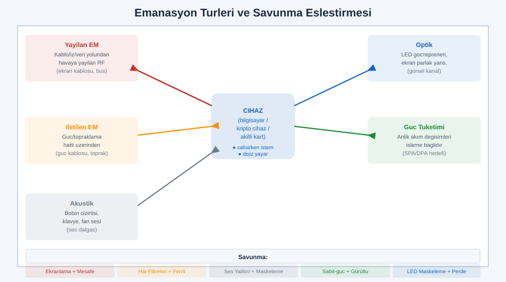
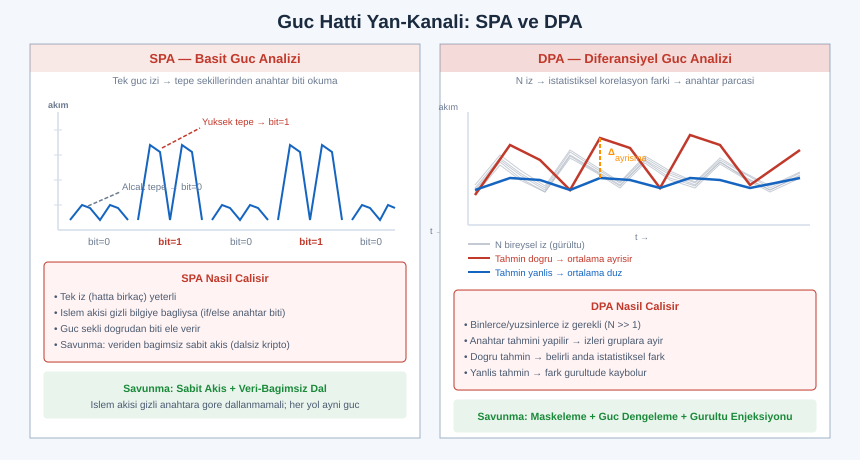
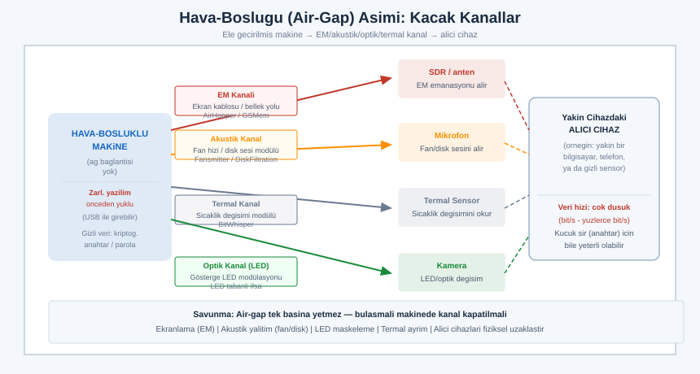

# SIGINT EL KİTABI — BÖLÜM 17: TEMPEST, KOMPROMİZE EDİCİ YAYILIM VE YAN-KANAL

## Bir Cihazın Sustuğu Yerde Bile Konuştuğu: İstem Dışı Emanasyon ve Ona Karşı Savunma

> Amaç: Önceki bölümler haberleşmenin kasıtlı yüzünü ele aldı — bir verici bilgi taşımak için yayın yapar, biz onu alır ve çözeriz. Bu bölüm bunun tersini, gölge yüzünü işler: hiçbir cihaz bilgi yaymak istemese bile, çalışırken istemeden elektromanyetik, akustik, güç ve optik izler bırakır. Bu istem dışı izler, doğru ekipmanla, cihazın işlediği bilginin bir kısmını uzaktan geri verebilir. Buna kompromize edici emanasyon (compromising emanation) denir ve onu inceleyen disiplinin tarihsel kod adı TEMPEST'tir. Hedefimiz bir saldırı reçetesi değil; bir cihazın fiziksel varlığının kendisinin bir bilgi sızıntısı yüzeyi olduğunu görmek ve buna karşı nasıl korunulacağını anlamaktır. Tam güvenlik yalnızca yazılım değildir; bakırın, ekranın ve fanın da bir sesi vardır.

> Yasal ve etik çerçeve: Bu bölüm tasarım gereği savunma, farkındalık ve mühendislik sezgisi amaçlıdır. Anlatılan her ölçüm tekniği yalnızca kişinin kendi cihazları, kendi ortamı ve pasif gözlem içindir. Başkasının cihazının emanasyonunu yakalayıp içeriğini geri oluşturmaya çalışmak, çoğu ülkede haberleşmenin gizliliğini ihlal kapsamına girer ve suçtur. Operasyonel TEMPEST parametreleri (sertifikasyon eşik değerleri, zon mesafeleri, ekipman özellikleri) çoğu ulusta sınıflandırılmıştır ve zaten açık değildir; bu bölüm yalnızca açık akademik literatürün ve kamuya açık standart adlarının kavramsal düzeyinde kalır. Emin olunmayan her teknik ayrıntı için "teyit edilmeli" notu düşülmüştür. Kendi ülkenin ve sürümünün mevzuatını teyit et; bu kitap hukuki danışmanlık değildir.

---

## İÇİNDEKİLER

1. [Kompromize Edici Emanasyon: Temel Kavram ve TEMPEST'in Anlamı](#1)
2. [Tarihçe ve Standartlar: NACSIM'den NATO SDIP-27'ye (Kavramsal)](#2)
3. [Emanasyon Türleri: EM, İletilen, Akustik, Güç, Optik](#3)
4. [Van Eck Phreaking: Ekran Görüntüsünün Uzaktan Yeniden Oluşturulması](#4)
5. [CRT'den Dijitale: HDMI/DVI Çağında Görüntü Emanasyonu](#5)
6. [Klavye, USB ve Kablo Emanasyonu](#6)
7. [Güç Hattı Yan-Kanalı: SPA ve DPA (Kavramsal)](#7)
8. [Elektromanyetik Yan-Kanal: Çip Üzerinde EM Probe](#8)
9. [Akustik Yan-Kanal: Tuş Sesi, Yazıcı, Fan, Bobin Cızırtısı](#9)
10. [Hava-Boşluğu (Air-Gap) Aşımı: Akademik Sızıntı Kanalları](#10)
11. [Ölçüm ve Tespit: Yakın-Alan Probe, Spektrum Analizör, Anten](#11)
12. [Savunma: Ekranlama, Zon, Filtreleme, Ayrım, Maskeleme](#12)
13. [Kanije Kalesi Bağlamı: Fiziksel Emanasyon Bir Sızıntı Yüzeyidir](#13)
14. [Alıştırmalar (Yasal, Kendi Cihazların)](#14)
15. [Hızlı Referans ve Diğer Bölümler](#15)

---

<a id="1"></a>
## 1. Kompromize Edici Emanasyon: Temel Kavram ve TEMPEST'in Anlamı

Her elektronik cihaz, çalışırken içinde akan değişken akımlar nedeniyle istemeden elektromanyetik enerji yayar. Bu fiziğin kaçınılmaz bir sonucudur: değişen akım, etrafında değişen bir manyetik alan; değişen gerilim, değişen bir elektrik alan üretir (Bölüm 1'deki temel elektromanyetik ilişkilerin doğrudan sonucu). Mühendislik bu istenmeyen yayını uzun zamandır tanır ve elektromanyetik uyumluluk (EMC, Electromagnetic Compatibility) başlığı altında düzenler; amaç bir cihazın diğerini bozmasını engellemektir. Ancak buradaki ilgi alanımız farklıdır.

Bir cihazın yaydığı istem dışı emisyon, eğer cihazın işlediği gizli bilgiyle ilişkili (correlated) ise, sıradan bir gürültü olmaktan çıkar ve bir sızıntı kanalına dönüşür. İşte bu özel alt küme kompromize edici emanasyon (compromising emanation) olarak adlandırılır. Aradaki ayrım inceliklidir ama kritiktir:

| Kavram | Tanım | İlgi alanı | Örnek |
|---|---|---|---|
| EMI / istenmeyen emisyon | Cihazın yaydığı her türlü istem dışı EM enerji | Uyumluluk (başka cihazı bozmasın) | Anahtarlamalı güç kaynağının genel gürültüsü |
| Kompromize edici emanasyon | İşlenen gizli bilgiyle ilişkili istem dışı yayın | Güvenlik (bilgi sızdırmasın) | Ekrandaki harfin biçimini taşıyan video emanasyonu |
| Yan-kanal (side-channel) | Bir sistemin işleyişinden istemeden sızan ölçülebilir nicelik | Kriptografi/donanım güvenliği | Şifreleme süresinin anahtara bağlı değişmesi |

TEMPEST, bu kompromize edici emanasyonları inceleyen, ölçen ve onlara karşı korunmayı konu alan disiplinin tarihsel kod adıdır. Yaygın inanışın aksine bir kısaltma olarak doğmamıştır; sonradan ona "Telecommunications Electronics Materials Protected from Emanating Spurious Transmissions" gibi geriye dönük açılımlar uydurulmuştur ancak bunlar resmî değildir ve kaynaktan teyit edilmelidir. Pratikte TEMPEST üç şeyi birden kapsar: (1) emanasyon tehdidinin kendisi, (2) onu yakalama/ölçme yöntemleri, (3) ona karşı koruma standartları ve ekipmanı. Yakın anlamlı terimler de vardır: emisyon güvenliği (EMSEC, Emission Security) genellikle TEMPEST'i de içeren daha geniş bir şemsiyedir.

Kompromize edici emanasyonu özel kılan üç özellik vardır. Birincisi istem dışılık: cihaz bu bilgiyi yaymayı hiç istemez, hatta yaydığının çoğu zaman farkında değildir; sızıntı tasarımın bir yan ürünüdür. İkincisi ilişkililik: yayın rastgele gürültü değil, işlenen veriyle istatistiksel olarak bağlıdır; bu bağ olmasaydı sızıntı olmazdı. Üçüncüsü pasiflik: bu kanalı dinlemek için saldırganın cihaza dokunması, ona bir şey göndermesi gerekmez; yalnızca yayılan enerjiyi almak yeter. Bu pasiflik, tespiti son derece zorlaştırır — dinleyen taraf hiçbir iz bırakmaz.

> Mühendislik sezgisi: Bir bilgisayarı bir radyo vericisi gibi düşün, ama bilinçsiz ve kontrolsüz bir verici. Ekran kartı, kablolar, bellek veri yolları, güç regülatörü — hepsi içlerinden geçen veriyle modüle olmuş zayıf yayınlar saçar. Bu yayınların çoğu anlamsız gürültüdür; ama bir kısmı, işlenen bilginin yapısını taşır. TEMPEST'in temel iddiası şudur: yeterince hassas bir alıcı ve yeterince yakın bir mesafeyle, bu istem dışı yayının içinden orijinal bilgiyi kısmen geri oluşturmak mümkündür. Savunmanın temel iddiası da bunun simetriğidir: yayını yeterince zayıflatır, gürültüyle örter veya mesafeyle boğarsan, geri oluşturma pratikte imkânsızlaşır.

---

<a id="2"></a>
## 2. Tarihçe ve Standartlar: NACSIM'den NATO SDIP-27'ye (Kavramsal)

Emanasyon tehdidinin keşfi yeni değildir; kökleri 20. yüzyılın ortasına, telgraf ve teleks çağına uzanır. Açık tarihsel anlatılara göre olgu, kriptografik ekipmanın işlediği düz metnin (şifrelenmemiş hali) cihazın elektriksel/manyetik yayınında istemeden belirdiğinin fark edilmesiyle ciddiye alınmıştır. Şifreleme matematiksel olarak sağlam olsa bile, şifreleyen makinenin kendisi düz metni fiziksel olarak sızdırıyorsa, tüm güvenlik çöker. Bu içgörü, emanasyon güvenliğini bağımsız bir disiplin hâline getirmiştir.

Soğuk Savaş boyunca bu alan büyük ölçüde gizli kalmış; ölçüm yöntemleri, eşik değerleri ve koruma teknikleri sınıflandırılmıştır. Olgunun kamuoyuna mal olması büyük ölçüde 1985'te akademik bir yayınla gerçekleşmiştir: Wim van Eck'in, bir bilgisayar ekranının (o dönemin CRT monitörü) görüntü sinyalinin nispeten basit ekipmanla uzaktan yeniden oluşturulabileceğini açık literatürde göstermesi, hem konunun adının ("Van Eck phreaking") yerleşmesini sağlamış hem de tehdidin yalnızca devlet sırrı olmadığını, sıradan ekipmana da uzandığını ortaya koymuştur.

Standartlar tarafında, kamuya açık düzeyde anılabilecek belge aileleri ve adları şunlardır; içeriklerinin önemli kısmı kısıtlı/sınıflandırılmış olduğundan burada yalnızca kavramsal çerçeve verilir.

| Belge/aile | Bağlam | Kavramsal işlevi | Erişilebilirlik |
|---|---|---|---|
| NACSIM 5100 serisi (tarihsel) | ABD ulusal kriptoloji kuruluşu | Erken emanasyon ölçüm/koruma kriterleri | Büyük ölçüde sınıflandırılmış; adı bilinir |
| NSTISSAM TEMPEST/1-92 vb. | ABD, TEMPEST ölçüm/test rehberleri | Test yöntemi ve sınır kavramları | Kısmen serbest bırakılmış, çoğu kısıtlı |
| NATO SDIP-27 | NATO emanasyon güvenliği standardı | Ekipmanı koruma seviyesine göre sınıflama | Standart adı açık; içerik kısıtlı |
| NATO SDIP-28 / zon kavramı | Tesis/zon değerlendirmesi | Ortamı emanasyon riskine göre bölgeleme | Kavram açık; eşikler kısıtlı |

NATO SDIP-27 bağlamında kamuya açık düzeyde bilinen şey, ekipmanın koruma gereksinimine göre seviyelere ayrıldığıdır; en yüksek seviye en katı emanasyon bastırma gereksinimini, daha düşük seviyeler ise belirli bir koruma zonu (fiziksel mesafe/ekranlama) varsayımıyla daha gevşek gereksinimleri ifade eder. Bu seviyelerin tam sayısal eşikleri açık değildir ve kaynaktan teyit edilmelidir. Önemli olan kavramsal mantıktır: bir ekipmanın ne kadar bastırılması gerektiği, içinde bulunacağı ortamın saldırgana ne kadar yakınlık izin verdiğine bağlıdır. Çok korunaklı bir tesiste (saldırganın yüzlerce metreden öteye yaklaşamadığı) daha gevşek ekipman yeterken, korumasız bir ortamda ekipmanın kendisinin çok daha sessiz olması gerekir.

> Not: Bu başlıktaki tüm standart adları kamuya açık referanslardır, ancak içeriklerinin operasyonel detayları (ölçüm bant genişlikleri, mesafe-eşik tabloları, antenne mesafeleri) çoğu ülkede sınıflandırılmıştır ve bu bölümde verilmez. Tarihsel anlatıların ayrıntıları kaynaklar arasında farklılık gösterir; kesin tarih ve atıflar için akademik/birincil kaynaktan teyit edilmeli.

---

<a id="3"></a>
## 3. Emanasyon Türleri: EM, İletilen, Akustik, Güç, Optik



Kompromize edici emanasyon yalnızca "havadan yayılan radyo dalgası" değildir. Bilgi, cihazdan birden çok fiziksel taşıyıcı üzerinden sızabilir. Bu taşıyıcıları sınıflamak, hem tehdidi anlamak hem de savunmayı doğru noktaya yöneltmek için temeldir. Beş ana aileyi mekanizması ve karşı savunmasıyla birlikte ele alalım.

| Emanasyon türü | Fiziksel mekanizma | Tipik kaynak | Birincil savunma |
|---|---|---|---|
| Yayılan EM (radiated) | Değişken akım/gerilimin antene benzeyen yapılardan havaya ışıması | Ekran kablosu, veri yolu, kart izleri | Ekranlama (kafes/oda), kablo ekranı, mesafe |
| İletilen EM (conducted) | Sinyalin güç/topraklama/sinyal hatları üzerinden iletilmesi | Güç kablosu, toprak hattı, arayüz kabloları | Hat filtreleri, izolasyon, ortak referans ayrımı |
| Akustik | Bileşenlerin titreşiminin sese dönüşmesi | Bobin, kapasitör, klavye, yazıcı, fan | Ses yalıtımı, maskeleme gürültüsü, sessiz bileşen |
| Güç tüketimi (power) | İşlemin anlık güç çekişini değiştirmesi | İşlemci, kripto devresi, bellek | Güç hattı gürültüleme, sabit-güç tasarım, izolasyon |
| Optik | İşlemle ilişkili ışık değişimi | LED göstergeler, ekran parıltısı yansıması | LED maskeleme/kaldırma, perdeleme, görüş engeli |

Bu beş aile birbirinden bağımsız değildir; çoğu zaman aynı bilgi birden çok kanaldan aynı anda sızar. Örneğin bir kriptografik işlem hem işlemcinin güç çekişini (güç kanalı), hem çevresindeki yakın-alan manyetik alanını (EM kanal), hem de — belirli koşullarda — bobin titreşiminin sesini (akustik kanal) değiştirebilir. Saldırı perspektifinden bu fazlalık bir avantajdır; savunma perspektifinden ise her kanalı ayrı ayrı kapatmak gerektiği anlamına gelir, çünkü tek bir açık kanal yeterlidir.

Önemli bir ayrım yayılan (radiated) ile iletilen (conducted) emanasyon arasındadır. Yayılan emanasyon havadan, anten benzeri yapılar üzerinden gider ve mesafeyle hızla zayıflar (Bölüm 1'deki serbest uzay yol kaybı, FSPL, mantığı; yakın alanda düşüş daha da diktir). İletilen emanasyon ise iletken bir yol üzerinden — güç kablosu, topraklama, ağ kablosu — gider ve bu yollar boyunca mesafeyle yayılandan çok daha az zayıflar; bir güç hattı, sızıntıyı binanın elektrik panosuna, hatta ötesine taşıyabilir. Bu yüzden ciddi koruma, yalnızca havayı (ekranlama) değil, aynı zamanda her iletken çıkışı (filtreleme) da ele almak zorundadır.

> Mühendislik sezgisi: Emanasyonu bir cihazdan çıkan "kaçak yollar" haritası gibi düşün. Hava bir yoldur (yayılan), bakır bir yoldur (iletilen), ses bir yoldur (akustik), ışık bir yoldur (optik), şebekeden çekilen güç bir yoldur (power). Bir bilgi parçası bu yolların herhangi birinden dışarı süzülebilir. Savunma "duvar örmek" değil, "tüm çıkışları saymak ve her birini ayrı kapatmaktır". Saldırgan en kolay açık kalmış yolu kullanır; savunan ise en zayıf halkadan sorumludur.

---

<a id="4"></a>
## 4. Van Eck Phreaking: Ekran Görüntüsünün Uzaktan Yeniden Oluşturulması

Kompromize edici emanasyonun en bilinen ve en sezgisel örneği, bir bilgisayar ekranının gösterdiği görüntünün uzaktan yeniden oluşturulmasıdır. Bu olgu, onu açık literatüre taşıyan araştırmacının adıyla "Van Eck phreaking" olarak anılır. Mekanizmayı anlamak için önce bir ekranın görüntüyü nasıl çizdiğini hatırlamak gerekir.

Klasik bir ekran (özellikle eski katot ışınlı tüp, CRT), görüntüyü piksel piksel, satır satır tarayarak oluşturur. Bir elektron demeti ekranı soldan sağa bir satır boyunca süpürür, satır biter, bir alt satıra geçer (yatay geri dönüş), tüm ekran bitince başa döner (dikey geri dönüş). Her pikselin parlaklığı, o an demete uygulanan video sinyalinin genliğiyle belirlenir. Bu video sinyali — parlaklığı taşıyan hızlı değişen gerilim — ekran devresinde ve kablosunda akarken istemeden bir EM yayın üretir. Kritik nokta şudur: bu yayın, ekranın o anda çizdiği görüntünün parlaklık desenini doğrudan taşır.

```
 Ekranın görüntü tarama yapısı (kavramsal):

  satır 1 →──────────────────────────────►┐ (yatay geri dönüş)
  satır 2 →──────────────────────────────►┤
  satır 3 →──────────────────────────────►┤   her satır: piksel parlaklıkları
   ...                                     │   = hızlı değişen video sinyali
  satır N →──────────────────────────────►┘
        └──────── (dikey geri dönüş: başa) ─────────┘

  Bu video sinyali kablodan/devreden istemeden yayılır →
  uzaktaki bir alıcı, parlaklık desenini yakalayabilir.
```

Van Eck phreaking'in özü, bu yayılan video sinyalini uzaktan bir alıcıyla yakalayıp, ekranın tarama zamanlamasını (satır frekansı ve çerçeve frekansı) yeniden üreterek görüntüyü tekrar bir ekrana çizmektir. Eğer alıcının tarama zamanlaması hedef ekranınkiyle senkronize edilirse, yakalanan parlaklık deseni anlamlı bir görüntüye — okunabilir metnin gölgesine — dönüşür. Senkronizasyon yanlışsa görüntü kayar veya yuvarlanır; doğru ayarlanınca sabitlenir ve okunur hale gelir.

Burada yakalanan şey rengin tam değeri değil, çoğunlukla parlaklık geçişleridir — yani keskin kenarlar, harflerin sınırları. Bu yüzden yeniden oluşturulan görüntü genellikle gri tonlu, kontrastı bozuk, ama metnin biçimini ele verecek kadar yapılıdır. Bir harfin dolu/boş deseni, parlaklığın hızlı değiştiği yerlerde güçlü emanasyon ürettiğinden, kenarlar olarak görünür.

Modern, kavramsal düzeyde anılan açık kaynak araştırma projeleri (örneğin "TempestSDR" gibi akademik/hobici çalışmalar) bu prensibi yazılım tanımlı radyoyla (SDR, Bölüm 2) birleştirir: SDR geniş bir bandı yakalar, yazılım hedef ekranın olası satır/çerçeve frekanslarını tarar, doğru zamanlama bulununca görüntüyü ekrana çizer. Bu projelerin varlığı, olgunun yalnızca özel devlet ekipmanı değil, genel amaçlı SDR ile de gösterilebilir bir gerçeklik olduğunu kanıtlar. Bu bölümde bu projeler yalnızca kavramsal olarak, savunma farkındalığı için anılır; başkasının ekranını yakalamak için kullanılmaları söz konusu değildir ve bağlama göre suçtur.

> Mühendislik sezgisi: Bir ekran, görüntüyü zaman içinde seri bir sinyale çevirir (piksel piksel, satır satır). Bu seri sinyalin kendisi istemeden yayılır. Görüntüyü geri oluşturmanın anahtarı içeriği "çözmek" değil, ekranın tarama saatini (satır + çerçeve frekansı) yeniden bulup yakalanan dalgayı doğru zaman ızgarasına oturtmaktır. Senkron doğruysa gürültü, okunabilir bir görüntüye katlanır. Savunma açısından çıkarım net: ekranın ürettiği yayını zayıflatmak (ekranlama, sessiz bileşen) ya da görüntünün kenar enerjisini azaltmak (örneğin emanasyonu zorlaştıran yazı tipi/filtre fikirleri, kavramsal) bu zinciri kırar.

---

<a id="5"></a>
## 5. CRT'den Dijitale: HDMI/DVI Çağında Görüntü Emanasyonu

Van Eck'in 1985'teki gösterimi analog CRT monitörler üzerineydi; "artık herkes düz panel kullanıyor, bu tehdit bitti" sanmak yaygın ama yanlış bir rahatlamadır. Görüntü emanasyonu, gösterim teknolojisi değiştikçe biçim değiştirdi ama yok olmadı. Modern dijital video arayüzleri (DVI, HDMI ve türevleri) görüntüyü piksel verisini yüksek hızlı seri dijital bağlantılar üzerinden ileterek taşır. Bu bağlantılar saniyede milyarlarca bit taşıyan, hızlı kenarlı (keskin geçişli) sinyallerdir — ve keskin kenarlar, geniş bantlı EM yayının başlıca kaynağıdır.

Açık akademik araştırma, dijital video bağlantılarının da kompromize edici emanasyon ürettiğini ve bu emanasyondan görüntünün kısmen yeniden oluşturulabileceğini göstermiştir. Mekanizma analog çağdakinden farklıdır ama akrabadır:

| Yön | CRT (analog) çağı | Dijital (DVI/HDMI) çağı |
|---|---|---|
| Taşınan sinyal | Sürekli analog parlaklık gerilimi | Yüksek hızlı seri dijital piksel akışı |
| Emanasyon kaynağı | Video amplifikatörü, demet sürücü | Seri bağlantının keskin bit geçişleri |
| Yakalanan içerik | Parlaklık zarfı (gri tonlu kenarlar) | Bit geçişlerinin görüntüyle ilişkili deseni |
| Yeniden oluşturma | Tarama senkronu + genlik | Piksel saatine kilitlenme + desen çıkarımı |
| Tipik sonuç | Gri, kenar-ağırlıklı metin gölgesi | Benzer biçimde metin/desen gölgesi |

Dijital bağlantılarda görüntü piksel başına birden çok bitle (renk bileşenleri) kodlanır ve bu bitlerin akışındaki geçişlerin yoğunluğu, gösterilen içeriğe bağlıdır. Belirli renk/parlaklık desenleri bağlantıda belirli geçiş örüntüleri üretir; bu örüntüler de emanasyonda iz bırakır. Saldırı tarafında bu emanasyonu yakalayıp piksel saatine senkronize ederek, ekranın içeriğinin yapısal bir kopyası — yine çoğunlukla kenar/desen ağırlıklı — geri elde edilebilir. Renk bilgisi büyük ölçüde kaybolur; ama metin gibi yüksek kontrastlı, kenar-yoğun içerik şaşırtıcı ölçüde okunabilir kalabilir.

Önemli bir nokta, modern sistemlerde emanasyonun frekansının çok daha yüksek olmasıdır (piksel saatleri yüzlerce MHz'e, GHz'e ulaşır). Bu, hem yakalama için daha geniş bantlı ve daha hızlı alıcı gerektirir, hem de farklı zayıflama davranışları doğurur. Ayrıca dijital sinyallerin doğası gereği, emanasyonun harmonikleri (Bölüm 1'deki harmonik kavramı) spektrumda geniş bir aralığa yayılır; saldırı bazen ana frekansı değil, daha temiz görünen bir harmoniği hedefler. Tam frekans/bant ayrıntıları cihaza ve kabloya özgüdür ve genelleştirilemez; kaynaktan teyit edilmeli.

> Mühendislik sezgisi: "Dijital olunca güvenli" yanılgısı, dijital sinyalin de fiziksel bir dalga olduğunu unutmaktan doğar. Bir HDMI kablosu, içinden geçen 1'ler ve 0'lar uğruna saniyede milyarlarca kez keskin gerilim geçişi yapar; her keskin geçiş, geniş bantlı bir RF darbesidir. Bu darbelerin deseni, ekrandaki içerikle ilişkilidir. Dolayısıyla tehdit teknolojiyle birlikte yukarı frekanslara taşındı ama ortadan kalkmadı. Savunma da aynı yere taşınır: yüksek frekansta etkili ekranlama, iyi kablo (ekranlı, ferrit boncuklu), ve mümkünse TEMPEST-değerlendirilmiş ekipman.

---

<a id="6"></a>
## 6. Klavye, USB ve Kablo Emanasyonu

Ekran tek sızıntı kaynağı değildir. Kullanıcının bilgiyi sisteme girdiği yer — klavye — de istem dışı emanasyon üretir ve açık akademik araştırmada bu kanal incelenmiştir. Mantık benzerdir: bir tuşa basıldığında, klavyenin matris tarama devresi ve denetleyicisi o tuşa karşılık gelen elektriksel etkinliği üretir; bu etkinlik, hangi tuşa basıldığıyla ilişkili istem dışı bir yayın çıkarabilir.

Klavye emanasyonu birkaç farklı fiziksel yoldan incelenmiştir (açık literatür düzeyinde, kavramsal):

| Klavye kanalı | Mekanizma | Sızabilen bilgi | Not |
|---|---|---|---|
| Matris tarama emanasyonu | Klavyenin tuş matrisini tarama sinyali | Hangi tuşun/satır-sütunun etkin olduğu | Kablolu klavyelerde incelenmiş |
| Veri hattı emanasyonu | Tuş kodunun seri iletimi (kablo/USB) | Tuş tarama kodları | Kablo bir anten gibi davranır |
| Güç dalgalanması | Tuş işleminin güç çekişine etkisi | İşlem zamanlaması, dolaylı tuş ipucu | İletilen kanal |
| Akustik (ayrı başlık) | Tuş vuruşunun sesi | Tuş zamanlaması, kısmen tuş kimliği | Bölüm 9'da işlenir |

Kablosuz klavyeler ayrı bir konudur: onlar zaten kasıtlı bir radyo vericisi içerir (tuş vuruşunu telsizle gönderir). Buradaki risk istem dışı emanasyon değil, doğrudan iletimin yeterince korunmamış olmasıdır — eski/zayıf kablosuz klavyelerde tuş trafiğinin şifrelemesinin zayıf olduğu açık güvenlik araştırmalarında gösterilmiştir (kaynaktan teyit edilmeli). Bu, TEMPEST'ten çok Bölüm 6'daki haberleşme güvenliği konusudur; ama emanasyon başlığıyla sıkça karıştırıldığı için ayrımı belirtmek gerekir: kablolu klavyede tehdit istem dışı sızıntı, kablosuz klavyede ise zayıf korunmuş kasıtlı yayındır.

USB ve genel olarak veri kabloları, emanasyon açısından özellikle önemlidir çünkü uzun bir iletken olarak istemeden anten görevi görürler. İçlerinden geçen yüksek hızlı sinyaller (USB veri çiftleri, ağ kabloları, ekran kabloları) hem havaya yayılan emanasyon üretir hem de iletilen emanasyonu kablo boyunca taşır. Bir cihazın gövdesi iyi ekranlı olsa bile, dışarı çıkan her kablo bu ekranı delen bir kaçış yolu olabilir — bu yüzden ciddi korumada kablolar ekranlı, filtreli ve mümkünse ferrit boğucularla donatılır (Bölüm 12).

Monitör kablosu, ekran emanasyonunun (Bölüm 4-5) baş aktörlerinden biridir: ekrana giden video sinyali bu kabloda akar ve kablo uzun bir yayıcı yapı oluşturur. Tarihsel olarak Van Eck türü yeniden oluşturmanın güçlü olmasının bir nedeni, ekran kablolarının iyi ekranlanmamış olmasıydı. Modern ekranlı dijital kablolar bunu azaltır ama tümüyle ortadan kaldırmaz; kablonun ekranının topraklaması, konnektör kalitesi ve büküm yapısı emanasyon seviyesini doğrudan etkiler.

> Mühendislik sezgisi: Bilgisayar güvenliğinde "girdi" ve "çıktı" katmanlarının ikisi de fiziksel olarak sızar. Ekran (çıktı) görüntüyü yayar; klavye (girdi) tuş vuruşunu yayabilir. Aradaki her kablo, bu sinyalleri taşıyan bir antendir. Bir saldırganın klavyenden çıkan bir bağlantıyı veya ekran kablonu uzaktan dinlemesi, parolanı hiçbir yazılım açığına ihtiyaç duymadan ele geçirmesi anlamına gelebilir — kavramsal olarak. Bu yüzden en hassas girişler (parola, anahtar) için fiziksel emanasyon yüzeyi de en az yazılım güvenliği kadar önemlidir.

---

<a id="7"></a>
## 7. Güç Hattı Yan-Kanalı: SPA ve DPA (Kavramsal)



Şimdiye kadarki kanallar büyük ölçüde "havaya yayılan" emanasyondu. Güç hattı yan-kanalı ise farklı ve donanım güvenliğinin merkezinde duran bir kanaldır: bir cihazın çektiği anlık güç, içinde yürüttüğü işlemle ilişkilidir. Bir işlemci farklı komutları çalıştırırken, farklı veriler üzerinde işlem yaparken, içindeki transistörler farklı sayıda ve biçimde anahtarlanır; bu da çekilen anlık akımı değiştirir. Eğer bu işlem bir kriptografik algoritmaysa ve gizli anahtar kullanıyorsa, güç çekişindeki desen anahtarla ilişkili olabilir. Bu, güç analizi (power analysis) saldırılarının temelidir ve iki klasik biçimi vardır.

```
 Güç çekişi izi (kavramsal, kriptografik işlem):

 akım ▲
      │   ╱╲    ╱╲      ╱╲╲     ╱╲    ╱╲        her tepe/vadi = bir işlem adımı
      │  ╱  ╲  ╱  ╲    ╱   ╲   ╱  ╲  ╱  ╲       adımların şekli/zamanlaması
      │ ╱    ╲╱    ╲  ╱     ╲ ╱    ╲╱    ╲      işlenen veriyle (anahtarla) ilişkili
    0 ┼──────────────────────────────────────► t
        ◄── tur 1 ──►◄── tur 2 ──►◄─ tur 3 ─►
```

Basit güç analizi (SPA, Simple Power Analysis): Güç izini doğrudan, gözle veya basit işlemle inceleyerek işlemin yapısını okumaktır. Bazı algoritmalarda işlem akışı gizli bilgiye bağlıdır — örneğin bir koşullu dal "anahtar biti 1 ise şu işlem, 0 ise bu işlem" biçimindeyse, güç izinin şekli doğrudan o biti ele verir. SPA, az sayıda izle (hatta tek izle) ve doğrudan gözlemle çalışır; savunması, işlem akışını gizli bilgiden bağımsız kılmaktır (veriden bağımsız, sabit akış).

Diferansiyel güç analizi (DPA, Differential Power Analysis): Çok daha güçlü ve inceliklidir. Tek bir izi okumak yerine, binlerce/yüzbinlerce işlem izini istatistiksel olarak toplar. Fikir şudur: anahtarın küçük bir parçası hakkında bir tahmin yapılır, bu tahmine göre izler iki gruba ayrılır, ve grupların ortalama güç farkına bakılır. Tahmin doğruysa belirli bir anda anlamlı bir istatistiksel fark belirir; yanlışsa fark gürültüde kaybolur. Böylece anahtar parça parça, istatistiksel korelasyonla çıkarılır. DPA'nın gücü, tek izde gürültüye gömülü olan minik veri-bağımlı farkı, çok sayıda iz üzerinden ortalama alarak gürültünün üstüne çıkarmasıdır.

| Saldırı | Veri ihtiyacı | Temel mantık | Birincil savunma |
|---|---|---|---|
| SPA | Az iz (1–birkaç) | İz şeklinden işlem akışını okuma | Veriden bağımsız sabit akış, dallanmasız kripto |
| DPA | Çok iz (binler+) | Anahtar tahminine göre izleri ayırıp istatistiksel fark | Maskeleme, gürültü, güç dengeleme, sabit-zaman |

Bu kanal, akıllı kartlar, donanım güvenlik modülleri ve gömülü kripto cihazları için tarihsel olarak ciddi bir tehdit olmuştur; çünkü saldırgan cihaza fiziksel olarak erişip güç hattına bir ölçüm direnci koyabildiğinde, izleri doğrudan ve düşük gürültüyle toplayabilir. Savunma tarafında geliştirilen teknikler arasında maskeleme (gizli değeri rastgele bir maskeyle karıştırıp işlemi maskeli yürütme), güç tüketimini dengeleme (her işlemde benzer güç çeken tasarım), ve gürültü enjeksiyonu (kasıtlı rastgele güç dalgalanmasıyla korelasyonu boğma) bulunur. Bu yöntemlerin etkinliği uygulamaya özgüdür ve sayısal güvence iddiaları kaynaktan teyit edilmelidir.

> Mühendislik sezgisi: Güç yan-kanalı, "cihazın ne kadar yorulduğunu izleyerek ne düşündüğünü tahmin etmektir". Şifreleme matematiği kusursuz olsa bile, o matematiği yürüten transistörler enerji harcar ve harcadıkları enerji işledikleri veriyle ilişkilidir. SPA bu ilişkiyi tek bakışta, DPA istatistikle yakalar. Bu, kriptografide "sabit-zaman ve sabit-güç" tasarımın neden zorunlu olduğunun fiziksel nedenidir: algoritmanın davranışı gizli veriye bağlı olmamalıdır, ne zamanlamada ne güçte.

---

<a id="8"></a>
## 8. Elektromanyetik Yan-Kanal: Çip Üzerinde EM Probe

Güç analizi cihazın güç hattına erişmeyi gerektirir; her zaman mümkün olmayabilir. Elektromanyetik yan-kanal, aynı bilgiyi temassız biçimde, çipin üzerine bir manyetik probe yaklaştırarak elde etmenin yoludur. Mantık güç analizinin akrabasıdır: çip içindeki transistörler anahtarlandıkça akım akar; akan akım, çevresinde küçük bir manyetik alan üretir (Bölüm 1, Ampère ilişkisi). Çipin yüzeyine çok yakın konumlandırılmış küçük bir bobin (yakın-alan manyetik probe), bu yerel manyetik alanın değişimini algılar. Böylece, güç hattına dokunmadan, işlemin EM imzası okunur.

Bu yöntemin güç analizine göre iki belirgin avantajı vardır. Birincisi temassızlık: cihazı açıp güç hattına direnç koymak gerekmez; probe yalnızca yakına tutulur. İkincisi uzamsal seçicilik: probe çok küçükse ve çip yüzeyinde gezdirilebiliyorsa, çipin yalnızca belirli bir bölgesinin (örneğin kripto motorunun bulunduğu alan) emanasyonu seçici olarak okunabilir; bu, ilgisiz devre gürültüsünü dışlayarak sinyal kalitesini artırır. EM yan-kanal saldırıları da SPA/DPA'nın EM karşılıkları olan SEMA (Simple EM Analysis) ve DEMA (Differential EM Analysis) biçimlerinde incelenir; mantık aynıdır, yalnızca ölçülen nicelik güç yerine yakın-alan EM'dir.

```
 Yakın-alan EM probe ile çip okuma (kavramsal kesit):

        ┌───────── küçük bobin (yakın-alan manyetik probe)
        │  ◯  → algılayıcı/yükselteç → SDR/osiloskop
        ▼
   ░░░░░░░░░░  ← çip yüzeyi (paket); altında anahtarlanan transistörler
   ███kripto███  bu bölgenin yerel manyetik alanı probe ile okunur
   ░░░░░░░░░░

   Probe ne kadar küçük ve yakınsa, o kadar yerel/seçici ölçüm.
```

Donanım güvenliği bağlamında bu kanal son derece önemlidir, çünkü gömülü kripto cihazlarına (akıllı kart, güvenli eleman, mikrodenetleyici) yönelik laboratuvar saldırılarının temelini oluşturur. Bir saldırgan cihazı fiziksel olarak ele geçirebiliyorsa, EM probe ile kripto işleminin imzasını toplayıp — tıpkı DPA gibi — istatistiksel olarak anahtarı çıkarmaya çalışabilir. Bu yüzden güvenli donanım tasarımı yalnızca güç kanalını değil, EM kanalını da hesaba katar: dahili ekranlama katmanları, gürültü üretimi, ve emanasyonu dağıtan/dengeleyen yerleşim teknikleri kullanılır.

Savunma açısından buradan iki ders çıkar. Birincisi, fiziksel erişim oyunu değiştirir: saldırgan cihaza dokunabiliyorsa, yazılım güvenliğinin altındaki fiziksel katman saldırı yüzeyi açılır; bu yüzden gizli anahtar barındıran cihazların fiziksel güvenliği (kasanın açılmaması, kurcalama tespiti) kritik hale gelir. İkincisi, sertifikalı güvenli donanım bu saldırılara karşı özel olarak değerlendirilir; kritik anahtarları gelişigüzel bir mikrodenetleyicide saklamak ile bunun için tasarlanmış bir güvenli elemanda saklamak arasında, yan-kanal direnci bakımından büyük fark vardır (kaynaktan teyit edilmeli).

> Mühendislik sezgisi: EM yan-kanal, güç analizinin "kabloyu kesmeden" yapılan halidir. Çipin üstündeki minik manyetik alan, içeride ne olup bittiğinin sızıntısıdır; küçük bir bobin bu sızıntıyı dinler. Önemli içgörü: bir sırrı yazılımda mükemmel saklayabilirsin, ama onu işleyen silikon o işlemi yaparken fiziksel olarak konuşur. Bu yüzden "anahtar nerede işleniyor ve o işlem fiziksel olarak ne kadar korunuyor" sorusu, "anahtar nasıl şifreleniyor" sorusu kadar gerçektir.

---

<a id="9"></a>
## 9. Akustik Yan-Kanal: Tuş Sesi, Yazıcı, Fan, Bobin Cızırtısı

Bilgi yalnızca elektromanyetik alanla değil, sesle de sızabilir. Akustik yan-kanal, cihazların ürettiği istem dışı seslerin işledikleri bilgiyle ilişkili olmasından yararlanır (saldırı perspektifi) veya buna karşı korunmayı (savunma perspektifi) konu alır. Akademik literatürde birkaç farklı akustik kanal incelenmiştir; hepsi savunma farkındalığı açısından öğreticidir.

| Akustik kaynak | Sızabilen bilgi | Mekanizma | Savunma |
|---|---|---|---|
| Klavye tuş sesi | Tuş zamanlaması, kısmen tuş kimliği | Farklı tuşlar/konumlar biraz farklı ses çıkarır | Sessiz klavye, maskeleme, gürültü |
| Nokta vuruşlu yazıcı | Basılan metin | İğne deseninin sesi karakterle ilişkili | Eski teknoloji; izolasyon |
| İşlemci/regülatör "bobin cızırtısı" | İşlem türü/yoğunluğu | Bobin/kapasitör titreşimi yüke bağlı değişir | Sessiz bileşen, kapsülleme, maskeleme |
| Fan/disk sesi | İş yükü ritmi, dolaylı faaliyet | Yük arttıkça ses değişir | Daha az bilgilendirici; düşük öncelik |

Klavye akustiği, en çok çalışılan akustik kanaldır. Bir klavyede farklı tuşlar fiziksel olarak farklı konumlarda ve hafifçe farklı mekanik özelliklerdedir; bu yüzden her tuşun çıkardığı "tık" sesi birbirinin tıpatıp aynısı değildir. Açık araştırmalar, yeterince iyi bir mikrofon kaydı ve sinyal işleme/öğrenme ile, yazılan metnin bir kısmının tuş seslerinden çıkarılabileceğini göstermiştir (doğruluk koşullara, klavyeye ve mikrofona çok bağlıdır; genel bir güvence verilemez, kaynaktan teyit edilmeli). Ek olarak, tuşlar arası zamanlama (iki tuş arasındaki süre) tek başına bile bilgi taşır; belirli harf çiftleri belirli zamanlama örüntüleri üretir.

Özellikle ilginç olanı akustik kriptanaliz kavramıdır: belirli koşullarda, bir bilgisayarın kriptografik işlem sırasında çıkardığı çok yüksek frekanslı, çok düşük seviyeli akustik gürültünün (genellikle güç regülatörü bileşenlerinin yüke bağlı titreşiminden kaynaklanan "bobin cızırtısı") işlenen veriyle ilişkili olabileceği akademik olarak incelenmiştir. Burada ses, doğrudan "tuş tıkırtısı" değil; işlemcinin/güç devresinin iş yüküne göre değişen ince mekanik titreşimidir ve bu titreşim, yürütülen kriptografik işlemin yapısıyla — dolayısıyla dolaylı olarak anahtarla — bağlantılı olabilir. Bu, fiziğin ne kadar ince kanallar açabildiğinin çarpıcı bir örneğidir; ancak pratik koşulları (çok yakın/iyi mikrofon, sessiz ortam, belirli donanım) zordur ve genelleştirilemez.

> Mühendislik sezgisi: "Bir bilgisayar sessizdir" sanmak yanlıştır; yalnızca çıkardığı sesin çoğu kulağımızın ilgilenmediği bir gürültüdür. Tuşların tıkırtısı, fanın uğultusu, bobinlerin duyulmaz cızırtısı — hepsi cihazın iç durumunun zayıf akustik yansımalarıdır. Saldırı perspektifinden bu, "dinleyerek tahmin etme"dir; savunma perspektifinden ise, en hassas işlemlerin (parola yazma, anahtar üretme) akustik olarak da maskelenebileceği/izole edilebileceği gerçeğidir. Akustik kanal genelde EM kanaldan daha zayıf ve koşula bağlıdır, ama "olmaz" demek için fazla iyi belgelenmiştir.

---

<a id="10"></a>
## 10. Hava-Boşluğu (Air-Gap) Aşımı: Akademik Sızıntı Kanalları

En yüksek güvenlik gereksinimine sahip sistemler bazen ağdan tümüyle koparılır: hiçbir kablolu/kablosuz ağ bağlantısı olmayan, fiziksel olarak yalıtılmış bir bilgisayar. Buna hava-boşluğu (air-gap) denir ve sezgisel olarak "ağa bağlı değilse veri sızamaz" varsayımına dayanır. Akademik araştırma, bu varsayımın mutlak olmadığını; eğer hedefe önceden bir zararlı yazılım bulaştırılabilmişse, bu yazılımın hava-boşluğunu kasıtlı emanasyon üreterek aşabileceğini göstermiştir. Bu, TEMPEST'in kasıtlı tarafıdır: cihazı, normalde istemeden yaptığı sızıntıyı, bilgi taşıyacak şekilde kasıtlı yapmaya zorlamak.

Burada kritik ayrım şudur: bu senaryolar zaten ele geçirilmiş (zararlı yazılım yüklenmiş) bir makineden veri kaçırmayı konu alır; emanasyon, ağ bağlantısının yerini tutan gizli bir çıkış kanalı (covert channel) olarak kullanılır. Yani saldırı önce klasik yolla (örneğin bulaşık bir USB) içeri girer, sonra topladığı veriyi dışarı taşımak için bu egzotik kanalları kullanır. Açık literatürde kavramsal olarak adlandırılan bazı araştırma aileleri:

| Araştırma adı (kavramsal) | Kullandığı kanal | Taşıyıcı fikir | Savunma yönü |
|---|---|---|---|
| AirHopper | EM (ekran kablosu yayını) | Ekranı FM bandına yakın yayın yapacak şekilde sürmek | Ekranlama, alıcı cihaz ayrımı |
| GSMem | EM (bellek veri yolu) | Bellek veri yolunu hücresel bantta yayacak şekilde kullanmak | Ekranlama, telefon ayrımı |
| Fansmitter | Akustik (fan sesi) | Fan hızını modüle ederek ses taşıyıcı üretmek | Akustik izolasyon, fan kontrolü |
| DiskFiltration | Akustik (disk sesi) | Hareketli disk başlığının sesini modüle etmek | Katı hal disk, ses yalıtımı |
| BitWhisper / termal | Termal | Sıcaklık değişimini bilgi taşıyacak şekilde modüle etmek | Termal ayrım, mesafe |
| LED tabanlı | Optik | Gösterge LED'lerini gözle fark edilmeden modüle etmek | LED maskeleme/kaldırma, görüş engeli |



Bu çalışmaların ortak iskeleti şudur: yazılımla kontrol edilebilen bir fiziksel büyüklüğü (ekran kartının yaydığı RF, bellek veri yolunun emanasyonu, fan/disk sesi, sıcaklık, LED parlaklığı) hızlıca değiştirerek bir taşıyıcı sinyal üretmek ve gizli veriyi bu taşıyıcıya bindirmek (modülasyon — Bölüm 1). Karşı taraftaki bir alıcı (yakındaki bir SDR, bir mikrofon, bir kamera, bir termal sensör) bu modüle sinyali yakalayıp veriyi geri çıkarır. Veri hızları genellikle çok düşüktür (saniyede bitler ila yüzlerce bit mertebesinde) ve menziller kısadır; ama küçük bir sırrı (örneğin bir şifreleme anahtarını) sızdırmak için düşük hız bile yeterli olabilir.

Bu araştırmaların değeri, savunma perspektifinden iki katmanlıdır. Birincisi, "air-gap mutlak güvenlik değildir" gerçeğini somutlaştırırlar: fiziksel yalıtım, yazılım bulaşmasını önlemenin güçlü bir yoludur ama bulaşma bir kez gerçekleştiyse, emanasyon kanalları bir kaçış yolu sunabilir. İkincisi, savunmanın nereye konacağını gösterirler: hassas air-gap sistemleri için çevresel önlemler (ekranlama, alıcı olabilecek cihazların — telefon, kamera, mikrofon — fiziksel uzaklaştırılması, görüş engelleri, akustik yalıtım) anlam kazanır. Bu önlemler tam olarak TEMPEST zon ve ekranlama mantığının (Bölüm 12) air-gap senaryosuna uygulanmış halidir.

> Mühendislik sezgisi: Air-gap, "kapı yok" demektir; ama bu araştırmalar "pencere, baca ve duvar çatlağı da bir yoldur" der. Ele geçirilmiş bir makine, ekranını bir radyo vericisine, fanını bir hoparlöre, LED'ini bir flaşöre çevirebilir — hepsi yazılımla, donanımı değiştirmeden. Bu yüzden gerçekten hassas yalıtık sistemlerde savunma yalnızca "ağ kablosunu çıkarmak" değil; çevredeki tüm olası alıcıları (telefon, kamera, mikrofon, başka bilgisayar) uzaklaştırmak, ortamı ekranlamak ve fiziksel erişimi kısıtlamaktır. Önce bulaşmayı önle (birincil savunma); sonra, bulaşırsa bile sızıntı kanallarını fiziksel olarak boğ (ikincil savunma).

---

<a id="11"></a>
## 11. Ölçüm ve Tespit: Yakın-Alan Probe, Spektrum Analizör, Anten

Emanasyonu anlamanın en somut yolu, kendi cihazının emanasyon imzasını ölçmektir. Bu, hem tehdidi gözle görmeyi sağlar hem de savunmanın işe yarayıp yaramadığını doğrulamanın tek yoludur. Ölçüm araç zinciri, ölçeğe göre üç düzeyde düşünülebilir; hepsi pasif (yalnızca dinleyen) ekipmandır.

| Ölçüm aracı | Ne ölçer | Tipik kullanım | Mesafe ölçeği |
|---|---|---|---|
| Yakın-alan probe seti | Cihaz yüzeyindeki yerel E/H alanı | Hangi bileşen/iz en çok yayıyor (kaynak bulma) | Milimetreler–santimetreler |
| Spektrum analizör / SDR | Frekansa göre yayın gücü | Emanasyonun spektral imzası, harmonikler | Cihaz yanı–oda içi |
| Anten + hassas alıcı (LNA'lı) | Uzaktan yayılan emanasyon | Belirli bir mesafeden tespit edilebilirlik | Oda–bina ölçeği |

Yakın-alan probe, ölçümün en öğretici aracıdır. İki tipi vardır: elektrik alan (E) probu (kısa bir uç/anten) ve manyetik alan (H) probu (küçük bir bobin/halka). Cihazın yüzeyinde gezdirildiğinde, hangi bölgenin en güçlü emanasyon ürettiğini gösterir — bir işlemci, bir regülatör, bir kablo konnektörü, bir veri yolu. Bu, emanasyonun "nereden çıktığını" haritalamanın yoludur; savunmada nereye ekran/filtre konacağını belirler. Yakın-alan ölçümü tasarımcıların EMC ve TEMPEST analizinde kullandığı temel tekniktir.

```
 Yakın-alan tarama ile emanasyon haritalama (kavramsal üstten görünüm):

   anakart yüzeyi:
   ┌───────────────────────────────────┐
   │  ▒▒              ░░░░░░            │   ▒▒ = güçlü emanasyon (regülatör)
   │  ▒▒    ████      ░░░░░░    ▒       │   ████ = işlemci (güçlü, geniş bant)
   │        ████                  ▒     │   ░░ = bellek veri yolu (orta)
   │   ───────────────[konnektör]══════╪═══► kablo (yayılan + iletilen!)
   └───────────────────────────────────┘
     probe'u yüzeyde gezdir → her noktada seviyeyi oku → sıcak noktaları işaretle
```

Spektrum analizör veya geniş bantlı bir SDR (Bölüm 2), emanasyonun frekans alanındaki imzasını gösterir. Bir cihaz açıkken ve kapalıyken (ya da boştayken ve yük altındayken) spektrumu karşılaştırmak, hangi tepelerin cihaza ait olduğunu ve hangilerinin işlemle birlikte ortaya çıktığını ortaya koyar. İşlemle birlikte beliren, içerikle ilişkili görünen tepeler kompromize edici emanasyon adaylarıdır. Bir cihazın saat frekansları ve onların harmonikleri (Bölüm 1) spektrumda düzenli aralıklı sivri tepeler olarak görünür; bunlar cihazın "EM parmak izinin" iskeletidir.

Anten ve hassas alıcı (gerekirse bir düşük gürültülü yükselteç, LNA, Bölüm 3) ile uzaktan ölçüm, "bu emanasyon ne kadar uzaktan tespit edilebilir?" sorusunu yanıtlar. Burada amaç içerik çözmek değil; tespit edilebilirlik mesafesini karakterize etmektir. Mesafe arttıkça emanasyon gücü hızla düşer (yakın alanda mesafenin yüksek kuvvetiyle, uzak alanda Bölüm 1'deki FSPL ile); belirli bir mesafeden sonra emanasyon ortam gürültü tabanının altına iner ve pratikte yakalanamaz hale gelir. Bu "kritik mesafe" kavramı, zon savunmasının (Bölüm 12) temelidir.

> Mühendislik sezgisi: Emanasyon ölçümü üç soruyu sırayla yanıtlar: (1) Nereden sızıyor? — yakın-alan probe ile kaynağı bul. (2) Hangi frekansta ve içerikle ilişkili mi? — spektrum analizör/SDR ile imzayı çıkar. (3) Ne kadar uzaktan görünür? — anten ile tespit mesafesini ölç. Bu üç ölçüm, savunmanın üç kararını besler: nereye ekran/filtre koyacağını (1'den), neyi bastıracağını (2'den), ve hangi zon mesafesinin güvenli olduğunu (3'ten). Ölçmeden yapılan savunma kör bir tahmindir; ölçüm, savunmayı doğrulanabilir kılar.

---

<a id="12"></a>
## 12. Savunma: Ekranlama, Zon, Filtreleme, Ayrım, Maskeleme

Emanasyon tehdidine karşı savunma, tek bir sihirli çözüm değil, katmanlı bir mühendislik disiplinidir. Temel mantık, kompromize edici emanasyonun alıcıya ulaşan gücünü, içerik geri oluşturulamayacak kadar düşürmek ya da gürültüyle örtmektir. Beş tamamlayıcı kol vardır.

| Savunma kolu | Hedef kanal | Mekanizma | Pratik örnek |
|---|---|---|---|
| Ekranlama (shielding) | Yayılan EM | İletken bir bariyerle alanı sönümleme | Faraday kafesi/odası, ekranlı kasa, ekranlı kablo |
| Zon / mesafe | Yayılan EM (+ tümü) | Saldırganın yaklaşabileceği mesafeyi sınırlama | Kontrollü çevre, tampon bölge, fiziksel güvenlik |
| Filtreleme | İletilen EM | Güç/sinyal hatlarındaki sızıntıyı süzme | Hat filtreleri, ferrit boğucular, izolasyon |
| Fiziksel ayrım | Tümü | Hassas ile hassas-olmayanı/alıcıyı ayırma | Kırmızı/siyah ayrımı, alıcı cihazları uzaklaştırma |
| Maskeleme / gürültü | EM, akustik, güç | Sızıntıyı kasıtlı gürültüyle örtme | Geniş bant gürültü, akustik maskeleme |

Ekranlama, en doğrudan savunmadır. İletken bir kabuk (Faraday kafesi), içindeki kaynağın ürettiği elektromanyetik alanı dışarıda büyük ölçüde sönümler; kabuk ne kadar bütünsel ve iletken olursa zayıflatma o kadar güçlüdür. Pratikte bu, cihaz düzeyinde ekranlı bir kasa, kablo düzeyinde ekranlı/zırhlı kablo, ve en üst düzeyde tüm bir ekranlanmış oda (RF-sızdırmaz oda) biçiminde uygulanır. Ekranlamanın can alıcı zayıflığı deliklerdir: havalandırma, kablo girişleri, kapı contaları. Bir Faraday kafesi ancak en büyük açıklığı kadar iyidir; bu yüzden ciddi ekranlamada her açıklık dalga kılavuzu havalandırma, iletken conta ve filtreli geçişlerle ele alınır.

```
 Ekranlama ve zon mantığı (kavramsal kesit):

   ┌──────────── KONTROLLÜ ÇEVRE (zon) ─────────────┐
   │                                                 │
   │    ┌──── ekranlanmış oda (Faraday) ────┐        │
   │    │   ┌── ekranlı kasa ──┐            │        │
   │    │   │   [cihaz]        │            │        │
   │    │   │  emanasyon ───►  │ ←ekran     │        │
   │    │   └──────────────────┘            │        │
   │    │   güç hattı ═══[FİLTRE]═══════════╪════►   │   ← iletilen kanal filtreli geçer
   │    └─────────────────────────────────-─┘        │
   │         saldırgan buraya yaklaşamaz  ◄──mesafe──┤
   └─────────────────────────────────────────────────┘
        ◄──── her katman emanasyonu bir kat daha zayıflatır ────►
```

Zon (zoning) kavramı, ekipman bastırması ile fiziksel mesafeyi birbirine bağlar. Emanasyon mesafeyle hızla zayıfladığından, saldırganın cihaza ne kadar yaklaşabileceği güvenliği doğrudan belirler. Eğer kontrollü bir çevre saldırganı belirli bir mesafenin ötesinde tutuyorsa, o mesafede emanasyon zaten gürültü tabanının altına inmiş olabilir; bu durumda ekipmanın kendisinin daha az bastırılması yeterli olur. Tersine, korumasız bir ortamda (saldırgan duvarın hemen ötesinde olabilir) ekipmanın kendisinin çok sessiz, yani yüksek seviye TEMPEST-değerlendirilmiş olması gerekir. NATO SDIP-27 seviyelerinin (Bölüm 2) arkasındaki mantık tam olarak budur: koruma seviyesi, varsayılan zon mesafesine göre belirlenir.

Filtreleme, iletilen (conducted) kanal için ekranlamanın karşılığıdır. Cihazdan çıkan her iletken hat — güç kablosu, topraklama, veri kablosu — sızıntıyı dışarı taşıyabileceğinden, bu hatlara emanasyon frekanslarını bloke eden filtreler ve ferrit boğucular yerleştirilir. Özellikle güç hattı kritiktir; filtrelenmemiş bir güç kablosu, sızıntıyı binanın elektrik tesisatına salabilir. Ekranlanmış bir oda bile, içinden geçen her kablo uygun filtreli geçişle (filtered penetration) donatılmadıkça ekranını delmiş olur.

Fiziksel ayrım, klasik emisyon güvenliğinde "kırmızı/siyah ayrımı" (red/black separation) olarak bilinen ilkeye dayanır: gizli (düz metin taşıyan, "kırmızı") sinyaller/ekipman ile şifreli veya hassas-olmayan ("siyah") sinyaller/ekipman fiziksel olarak ayrılır ki, kırmızı tarafın emanasyonu siyah tarafa (ve oradan dışarı) bulaşmasın. Air-gap senaryosunda (Bölüm 10) bunun karşılığı, olası alıcı cihazları (telefon, kamera, mikrofon, başka bilgisayar) hassas sistemden fiziksel olarak uzaklaştırmaktır.

Maskeleme ve gürültü, sızıntıyı azaltmak yerine örtmeye dayanır: kasıtlı geniş bantlı EM gürültü, akustik maskeleme sesi, veya güç hattı gürültülemesi, kompromize edici sinyalin üstüne çıkarak içerik geri oluşturmayı zorlaştırır. Bu, sinyal-gürültü oranını saldırgan aleyhine bozmaktır (Bölüm 1'deki SNR mantığı). Maskeleme tek başına yeterli kabul edilmez (yeterince akıllı işleme bazı gürültüyü ayıklayabilir) ama katmanlı savunmanın güçlü bir bileşenidir.

Pratik bireysel önlemler (ev/kişisel ölçek), kurumsal TEMPEST'in mütevazı ama gerçek karşılığıdır:

| Önlem | Hangi tehdide | Gerçekçi etki |
|---|---|---|
| Kaliteli ekranlı kablolar + ferrit | Yayılan/iletilen EM | Emanasyon seviyesini düşürür (tam çözüm değil) |
| En hassas işlemi (anahtar/parola) izole anda yapmak | Tümü | Sızıntı penceresini daraltır |
| Cihazları duvardan/komşudan uzak konumlandırmak | Yayılan EM | Mesafeyle hızlı zayıflama (zon mantığı) |
| Gereksiz LED/gösterge maskeleme | Optik | Optik kanalı kapatır |
| TEMPEST-değerlendirilmiş ekipman (gerekiyorsa) | Tümü | En güçlü ama maliyetli; çoğu birey için aşırı |
| Sabit-zaman/sabit-güç kripto kütüphaneleri | Güç/EM/zamanlama yan-kanalı | Algoritmik kanalı kapatır (yazılım tarafı) |

> Mühendislik sezgisi: Emanasyon savunması "üç boğma + iki örtme" olarak hatırlanabilir. Boğma: ekranla (havayı kes), filtrele (bakırı kes), ayır/uzaklaştır (mesafeyle ve düzenle kes). Örtme: gürültüyle maskele, sabit-zaman/güç tasarımla algoritmik izi sil. Hiçbiri tek başına yeterli değildir; güç, katmanların çarpımındadır. En önemli tek karar genellikle zondur: saldırgan ne kadar uzakta tutulabiliyorsa, fiziğin geri kalanı o kadar lehine çalışır. Çoğu birey için en yüksek getirili önlemler, mesafe + kaliteli kablolar + hassas işlemleri bilinçli yapmaktır; tam ekranlama ve sertifikalı ekipman ise kurumsal/yüksek-tehdit ölçeğinin işidir.

---

<a id="13"></a>
## 13. Kanije Kalesi Bağlamı: Fiziksel Emanasyon Bir Sızıntı Yüzeyidir

Kanije Kalesi gibi bir cihaz güvenlik yazılımının dünya görüşü, çoğu zaman "yazılım katmanı" ile sınırlıdır: şifreleme, erişim kontrolü, kilitleme, honeypot, secure-wipe. Bu bölümün cihaza eklediği perspektif, bu sınırın altında bir katman daha olduğudur — fiziksel emanasyon katmanı. Bir cihaz, en güçlü yazılım savunmasıyla bile çalışırken fiziksel dünyaya EM, akustik, güç ve optik izler saçar; ve bu izler, ilkesel olarak, bir bilgi sızıntısı yüzeyidir.

Bu, Kanije'nin önceki bölümlerde işlenen iki temasıyla doğrudan örtüşür. Birincisi, Bölüm 6 ve Bölüm 13'te TEMPEST/yan-kanal "RF tehdit manzarası bütünlüğü için" farkındalık düzeyinde anılmıştı; bu bölüm onun derin karşılığıdır. İkincisi, Bölüm 11'deki (Bölüm 7'nin trafik analizi başlığı) "şifreleme içeriği korur ama meta-veri sızar" dersi, burada fiziksel düzleme taşınır: şifreleme içeriği korur ama cihazın fiziksel emanasyonu — ekranında gösterdiği, klavyesinden girilen, işlemcisinde işlenen — ayrı bir kanaldan sızabilir. İkisi aynı OPSEC madalyonunun iki yüzüdür: biri meta-veri (zaman/hacim) düzeyinde, diğeri fizik (EM/akustik/güç) düzeyinde.

Kanije'nin somut işlevleri açısından çıkarımlar:

| Kanije işlevi | Fiziksel emanasyon ilgisi | Savunma refleksi |
|---|---|---|
| Şifreleme / anahtar işlemleri | Güç ve EM yan-kanal (Bölüm 7-8) | Sabit-zaman/güç kütüphaneler; anahtar işleme yüzeyini küçük tut |
| Parola/PIN girişi | Klavye ve akustik emanasyon (Bölüm 6, 9) | Hassas girişi bilinçli yap; girdi yüzeyini koru |
| Ekranda hassas gösterim | Video emanasyonu (Bölüm 4-5) | Mesafe, ekranlı kablo, gereksiz gösterimi azalt |
| Telegram bot trafiği | (Fiziksel değil) meta-veri kardeşi | Bölüm 11/7: ritim/hacim şekillendirme |
| Secure-wipe / lockdown | İşlem yoğun anlar EM/güç imzası bırakır | Kritik anları gürültü/mesafe ile boğma (kavramsal) |

Burada dürüst bir sınır çizmek gerekir: bireysel bir cihaz ve yazılım için tam TEMPEST koruması (ekranlanmış oda, sertifikalı ekipman) ne gerçekçi ne de gereklidir; bu, devlet/kurumsal yüksek-tehdit ölçeğinin işidir. Kanije bağlamında doğru ders bir paranoya değil, bir bütünlük görüşüdür: güvenliğin yalnızca yazılım olmadığını, cihazın fiziksel varlığının da bir saldırı yüzeyi taşıdığını bilmek. Bu bilgi, tehdit modelini dürüstleştirir — "yazılımım kusursuz, öyleyse güvendeyim" cümlesinin neden eksik olduğunu gösterir. Pratikte Kanije kullanıcısı için en anlamlı çıkarımlar mütevazıdır ve Bölüm 12'nin pratik önlemleriyle örtüşür: en hassas işlemleri bilinçli yapmak, mesafeyi lehine kullanmak, sabit-zaman kripto tercih etmek ve fiziksel erişimi (cihaza dokunulmasını) ciddiye almak — çünkü Bölüm 7-8'in gösterdiği gibi, fiziksel erişim yan-kanal oyununu değiştirir.

> Mühendislik sezgisi: Kanije'nin tehdit modeline bu bölümün eklediği tek cümle şudur: "Bir cihaz, hiçbir şey göndermek istemese bile, çalışırken konuşur." Yazılım güvenliği bu konuşmayı susturmaz; yalnızca fizik (ekranlama, mesafe, filtreleme, sabit-zaman tasarım) susturabilir. Tam güvenlik bir yazılım özelliği değil, yazılım + fizik + işletim disiplininin kesişimidir. Bu farkındalık, "kusursuz kale" iddiasını bir adım daha dürüst yapar.

---

<a id="14"></a>
## 14. Alıştırmalar (Yasal, Kendi Cihazların)

> Bu alıştırmalar yalnızca kendi cihazların, kendi ortamın ve pasif gözlem içindir. Hiçbiri yayın, başkasının emanasyonunu yakalama veya içerik geri oluşturma içermez. Amaç, emanasyonun gerçekliğini kendi donanımında görmek ve savunmanın etkisini ölçmektir. Başkasının cihazının emanasyonunu hedef almak bağlama göre suçtur; şüphedeysen yapma. Aşağıdakilerin hepsi kendi cihazının zaten yaydığı geniş bantlı gürültüyü gözlemekle sınırlıdır.

### A) Kendi bilgisayarının/ekranının EM gürültü tabanını gözlemek

Elindeki bir SDR ile (Bölüm 2) bilgisayarının yakınında geniş bir bandı tara ve waterfall'a bak. Bilgisayarı açıkken ve (mümkünse) kapalı/uzaktayken spektrumu karşılaştır. Açıkken beliren düzenli aralıklı sivri tepeler, cihazın saat frekanslarının harmonikleridir (Bölüm 1). Bir tablo doldur:

| Gözlem | Bilgisayar kapalı | Bilgisayar açık (boşta) | Açık (yük altında) |
|---|---|---|---|
| Genel gürültü tabanı | ? | ? | ? |
| Belirgin sivri tepeler (yaklaşık frekans) | ? | ? | ? |
| Yük değişince değişen tepe var mı? | — | ? | ? |

Amaç: Cihazının bir "EM imzası" olduğunu kendi gözünle görmek ve hangi tepelerin işlemle (yükle) birlikte değiştiğini fark etmek. Yükle değişen tepeler, ilkesel olarak içerikle ilişkili emanasyon adaylarıdır (yalnızca gözlem; içerik çözme yok).

### B) Bir USB cihazın çalışırken spektrumdaki izini aramak

Bir USB cihazı (örneğin bir USB 3.0 disk ya da bir USB kamera) tak ve veri aktarımı başlat. SDR ile özellikle USB'nin yoğun emanasyon ürettiği bilinen bandları tara; aktarım sırasında beliren, aktarım bitince kaybolan emanasyon izini ara. Aktarım yoğunluğunu değiştirince (büyük dosya kopyala vs boşta) iz nasıl değişiyor?

```
 Gözlem defteri:
  USB takılı, boşta:      tepe var mı? ___  seviye: ___
  USB büyük dosya aktarımı: tepe var mı? ___  seviye: ___
  USB çıkarıldı:          tepe var mı? ___  seviye: ___
```

Amaç: İletilen/yayılan emanasyonun bir veri yolu etkinliğiyle nasıl ilişkilendiğini somut görmek. Bu, USB/kablo emanasyonunun (Bölüm 6) yasal, kendi cihazınla yapılan minyatür gözlemidir.

### C) Ekranlamanın gürültü tabanına etkisini ölçmek

Basit, evde yapılabilir bir karşılaştırma: Bir küçük yayan kaynağın (örneğin kendi cihazının bilinen bir emanasyon tepesi, ya da yasal/zayıf bir test sinyali) seviyesini SDR ile ölç. Sonra kaynağı iletken bir engelle (örneğin metal bir kutu, alüminyum folyo sargı — kendi cihazına zarar vermeden) kısmen çevreleyip aynı ölçümü tekrarla. Tepe seviyesi düştü mü, ne kadar?

| Durum | Ölçülen tepe seviyesi (yaklaşık) |
|---|---|
| Ekransız (açık) | ? |
| Kısmi ekran (folyo/kutu) | ? |
| Fark (zayıflama) | ? |

Amaç: Ekranlamanın (Bölüm 12) gerçekten emanasyonu zayıflattığını ve ekranın bütünlüğünün (açık kalan delikler) etkiyi nasıl belirlediğini elle görmek. Not: Bu yalnızca kavramı göstermek içindir; gerçek Faraday kafesi/oda mühendislik işidir ve folyo yalnızca kabaca fikir verir.

### D) Yakın-alan ile "sıcak nokta" haritalama (kavram/düşünce + isteğe bağlı basit probe)

Eğer elinde basit bir yakın-alan probe (ya da küçük bir bobin + alıcı) varsa, kendi (açık ve güç verilmiş, ama güvenle erişilebilen) bir kartının yüzeyinde gezdir ve hangi bölgenin en güçlü emanasyon ürettiğini not et. Probe yoksa, bunu bir düşünce egzersizi olarak yap: bir tipik anakart şemasına bakıp hangi bileşenlerin (işlemci, regülatör, yüksek hızlı veri yolları, kablo konnektörleri) en çok yayacağını tahmin et ve Bölüm 11'deki haritayla karşılaştır.

Amaç: Emanasyonun cihaz içinde belirli "sıcak noktalardan" çıktığını ve savunmanın (ekran/filtre) neden bu noktalara yoğunlaştırıldığını kavramak.

### E) Kendi tehdit modeline emanasyon katmanını eklemek (OPSEC refleksi)

Kâğıt üzerinde, yayın/ölçüm yapmadan: Kendi en hassas işlemini düşün (örneğin bir disk şifreleme parolası girmek veya bir anahtar üretmek). Şu soruları yanıtla:

1. Bu işlem hangi fiziksel kanallardan iz bırakabilir (ekran, klavye, güç, EM, akustik)?
2. Saldırganın bu kanallardan birini kullanabilmesi için hangi koşullar gerekir (yakınlık, fiziksel erişim, bulaşık alıcı cihaz)?
3. Hangi mütevazı önlemler (mesafe, sabit-zaman kripto, gereksiz gösterimi azaltma, fiziksel erişimi kısıtlama) bu koşulları en çok zorlaştırır?

Amaç: Bölüm 13'teki dersi kendi pratiğine indirmek — emanasyonun gerçek ama bağlama bağlı bir tehdit olduğunu, ve savunmanın paranoyadan çok dürüst tehdit modellemesi olduğunu içselleştirmek.

---

<a id="15"></a>
## 15. Hızlı Referans ve Diğer Bölümler

### Kavram kartı

| Kavram | Bir cümlelik öz |
|---|---|
| Kompromize edici emanasyon | İşlenen gizli bilgiyle ilişkili istem dışı fiziksel yayın |
| TEMPEST | Emanasyon tehdidini, ölçümünü ve korunmasını konu alan disiplin (kod adı) |
| EMSEC | Emisyon güvenliği; TEMPEST'i de kapsayan daha geniş şemsiye |
| Yayılan vs iletilen | Havadan (mesafeyle hızlı düşer) vs bakırdan (kablo boyunca taşır) sızıntı |
| Van Eck phreaking | Ekran video emanasyonundan görüntüyü uzaktan yeniden oluşturma |
| Dijital görüntü emanasyonu | HDMI/DVI keskin geçişlerinden de görüntü sızar (tehdit yok olmadı) |
| Klavye/USB/kablo emanasyonu | Girdi ve kablolar da istemeden yayar; kablo bir antendir |
| SPA / DPA | Güç çekişinden kripto anahtarı çıkarma (basit / istatistiksel) |
| SEMA / DEMA | Aynı saldırının yakın-alan EM probe ile yapılan hali |
| Akustik yan-kanal | Tuş sesi/bobin cızırtısı/yazıcı sesinden bilgi sızması |
| Air-gap aşımı | Bulaşık makineden EM/akustik/optik/termal kanalla veri kaçırma (kavramsal) |
| Zon | Ekipman bastırmasını saldırgan mesafesine bağlayan savunma mantığı |
| Kırmızı/siyah ayrımı | Gizli ile şifreli/hassas-olmayan ekipmanı fiziksel ayırma |
| Maskeleme | Sızıntıyı kasıtlı gürültüyle örterek SNR'ı saldırgan aleyhine bozma |

### Ezber sezgiler

- Bir cihaz, hiçbir şey göndermek istemese bile çalışırken konuşur (EM, akustik, güç, optik).
- Kompromize edici emanasyon, gürültü değil; işlenen bilgiyle ilişkili olduğu için tehlikelidir.
- Yayılan emanasyon mesafeyle hızla ölür; iletilen emanasyon kablo boyunca uzağa taşır — ikisini ayrı kapat.
- "Dijital olunca güvenli" yanılgıdır; keskin bit geçişleri geniş bantlı RF üretir, görüntü hâlâ sızar.
- Güç/EM yan-kanalı, kusursuz kripto matematiğini yürüten silikonun fiziksel olarak konuşmasıdır; çözüm sabit-zaman/güç.
- Fiziksel erişim oyunu değiştirir: saldırgan cihaza dokunabiliyorsa yan-kanal yüzeyi açılır.
- Air-gap "kapı yok" demektir ama pencere/baca da yoldur; savunma çevredeki alıcıları da uzaklaştırmaktır.
- Savunma = üç boğma (ekranla, filtrele, uzaklaştır) + iki örtme (maskele, sabit-zaman tasarla).
- En güçlü tek kaldıraç genellikle zondur: saldırgan ne kadar uzaktaysa fizik o kadar lehine çalışır.
- Tam güvenlik yalnızca yazılım değildir; yazılım + fizik + işletim disiplininin kesişimidir.

### Ve daima: yasal sınır ve perspektif

Bu bölümdeki her teknik savunma, farkındalık ve mühendislik sezgisi içindir. Tüm ölçümler tasarım gereği pasiftir ve yalnızca kişinin kendi cihazları ve ortamıyla sınırlıdır; hiçbiri yayın, başkasının emanasyonunu yakalama veya içerik geri oluşturma önermez. Operasyonel TEMPEST parametreleri zaten açık değildir ve burada verilmemiştir; verilen her şey açık akademik/kavramsal düzeydedir. Emin olunmayan teknik ayrıntılar için "teyit edilmeli" notu düşülmüştür. Bandını, ülkeni ve sürümünü teyit et; bu kitap anlama ve savunma içindir, saldırı için değil.

---

> Kapanış: Bir bilgisayar açıldığı andan itibaren, hiç istemediği halde, etrafına zayıf bir radyo yayını, duyulmaz bir ses, dalgalanan bir güç çekişi ve titreşen bir ışık saçar. Bu sızıntıların çoğu anlamsız gürültüdür; ama bir kısmı, cihazın işlediği bilginin gölgesini taşır. TEMPEST'in dersi karamsarlık değil, dürüstlüktür: güvenlik yalnızca şifrelediğin veride değil, o veriyi işleyen fiziksel makinenin sustuğu yerde bile bıraktığı izde yatar. Ekranlama havayı, filtreleme bakırı, mesafe ve zon coğrafyayı, sabit-zaman tasarım algoritmayı susturur; ve bunların hiçbiri tek başına yetmez. Bir sonraki adım, bu sezgiyi kendi cihazının yaydığı gerçek gürültüyü kendi SDR'ınla, kendi ortamında, pasifçe gözleyerek sınamaktır — çünkü emanasyon soyut bir tehdit değil, ölçülebilir bir fiziktir.

---

Bu bölüm, Kanije Kalesi SIGINT El Kitabı'nın parçasıdır. Tüm bölümler ve önerilen okuma sırası için indekse bakın: [SIGINT_00 — Başlangıç ve İndeks](SIGINT_00_BASLANGIC_INDEX_VE_YASAL.md).

Doğrudan ilgili bölümler:
- [SIGINT_01 — RF Fiziği ve Modülasyon](SIGINT_01_TEMELLER_RF_VE_MODULASYON.md): emanasyonun neden var olduğunun ve mesafeyle neden zayıfladığının fiziği.
- [SIGINT_03 — Antenler, Donanım ve Devre Tasarımı](SIGINT_03_ANTEN_DONANIM_VE_DEVRE_TASARIMI.md): emanasyon ölçümünün anten/LNA ve yakın-alan tarafı.
- [SIGINT_06 — Güvenlik, Açıklar ve Savunma](SIGINT_06_GUVENLIK_ACIKLAR_VE_SAVUNMA.md): TEMPEST/yan-kanal farkındalığı, OPSEC, emisyon güvenliği.
- [SIGINT_07 — SIGINT Disiplinleri ve Sinyal Ayıklama](SIGINT_07_DISIPLINLER_VE_SINYAL_AYIKLAMA.md): "şifreleme içeriği korur, meta-veri sızar" dersinin kardeşi.
- [SIGINT_13 — RF Tehdit Manzarası ve Karşı-Önlemler](SIGINT_13_RF_TEHDIT_VE_KARSI_ONLEMLER.md): aktif RF tehdidi ve yan-kanal/TEMPEST manzarası.
