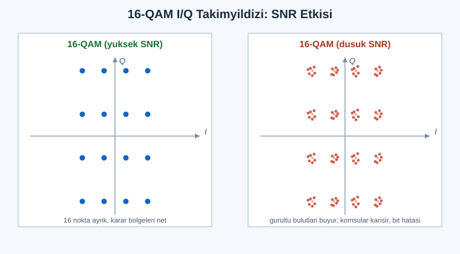

# SIGINT EL KİTABI — BÖLÜM 18: SAYISAL SİNYAL İŞLEME VE YAZILIM RADYONUN İÇ MİMARİSİ

## Motorun Kaputunu Açmak — IQ'dan Bite Giden Matematiksel Zincir

> Amaç: Bölüm 1 sinyalin fiziğini ve modülasyonunu, Bölüm 2 SDR donanımını verdi. Bu bölüm tam olarak ikisinin arasındaki katmanı, yani örnekler RAM'e düştükten sonra ekrandaki spektruma ve çözülmüş bite kadar olan her işlemi açar. Soru basit görünür ama cevabı kitabın en derin matematiğini gerektirir: bir SDR antenden gelen analog dalgayı karmaşık sayı çiftlerine çevirdikten sonra, o çiftlerle tam olarak hangi aritmetiği yapar da ekranda bir waterfall, kulağında bir ses, terminalde bir bit dizisi belirir? Bu bölüm reçete değil, sezgi ve türetme verir; bir GNU Radio akış grafiğine ya da bir demodülatör koduna baktığında her bloğun arkasındaki denklemi zihninde canlandırabilmen için yazıldı. Burası serinin "motor kaputunu açan" bölümüdür: tüm formüller, tüm türetmeler, tüm sınır durumları.

> Yasal çerçeve: Bu bölüm tamamen sinyal işleme matematiğine ve mimariye odaklanır; doğası gereği pasif analiz ve eğitim içeriğidir. Anlatılan tüm algoritmalar (filtreleme, FFT, demodülasyon, senkronizasyon) bir alıcının kendi RAM'indeki örnekler üzerinde çalışır; hiçbir iletim, karıştırma veya yetkisiz içerik çözme önermez. Alıştırmalar yalnızca kendi cihazların, kendi ürettiğin sinyaller ve yasal/açık yayın bandlarıyla sınırlıdır. Belirli bandların kaydı veya çözülmesi çoğu ülkede suçtur; kendi ülkenin ve sürümünün mevzuatını teyit et.

---

## İÇİNDEKİLER

1. [IQ Örneklemenin Matematiği: Karmaşık Taban-Bant ve Analitik Sinyal](#1)
2. [Hilbert Dönüşümü, Negatif Frekans ve I/Q Dengesizliği](#2)
3. [Örnekleme Teoremi, Bant-Geçiren Örnekleme (Undersampling)](#3)
4. [ADC: Kuantizasyon Gürültüsü, SNR=6.02N+1.76, Dinamik Aralık, Dither](#4)
5. [Frekans Çevirme: Sayısal Mikser, NCO ve CORDIC](#5)
6. [Örnekleme Hızı Dönüşümü: Decimation, Interpolation, Rational Resampling](#6)
7. [CIC Filtreler ve Yarım-Bant Filtreler (Donanım Verimliliği)](#7)
8. [Polyphase Filtre Bankaları](#8)
9. [Sayısal Filtreler: FIR vs IIR, Pencereleme, Grup Gecikmesi](#9)
10. [Filtre Tasarımı: Pencere, Frekans-Örnekleme, Parks-McClellan/Remez](#10)
11. [Eşleştirilmiş Filtre (Matched Filter) ve En İyi SNR](#11)
12. [Fourier: DFT, FFT (Radix-2, Kelebek), Neden O(N log N)](#12)
13. [Spektral Sızıntı, Pencereleme, RBW, STFT ve Spektrogram](#13)
14. [Demodülasyon Algoritmaları: AM, FM, I/Q'dan Faz/Genlik](#14)
15. [Taşıyıcı Geri Kazanım: PLL ve Costas Döngüsü](#15)
16. [Sembol Zamanlama Geri Kazanım: Gardner ve Mueller-Müller](#16)
17. [AGC, Eşitleme (Equalization) ve Karar Aygıtı](#17)
18. [Senkronizasyon: Çerçeve, Korelasyon, Preamble, CFO Tahmini](#18)
19. [Kanal Kodlama Temeli: Konvolüsyonel/Viterbi, Reed-Solomon, LDPC, Turbo](#19)
20. [Mimari: RF→ADC→DDC→DSP ve Gerçek-Zaman Akış İşleme](#20)
21. [GNU Radio'nun İç İşleyişi: Akış Grafiği, Zamanlayıcı, Throttle, Underrun](#21)
22. [FPGA vs CPU vs GPU: İşlemenin Nerede Yapıldığı](#22)
23. [🧪 Alıştırmalar (Yasal, Lab)](#23)
24. [Hızlı Referans ve Diğer Bölümler](#24)

---

<a id="1"></a>
## 1. IQ Örneklemenin Matematiği: Karmaşık Taban-Bant ve Analitik Sinyal

Bölüm 1, Kısım 13'te IQ örneklemeyi sezgisel olarak tanıttık: SDR dünyayı iki kanaldan, I (in-phase) ve Q (quadrature), görür. Bu bölüm o sezgiyi matematiksel temele oturtur, çünkü bu bölümdeki her şey — filtreleme, frekans çevirme, demodülasyon — karmaşık taban-bant temsili üzerinde çalışır. Eğer bu temsili tam kavramazsan, ileride "neden sinyal aynanın diğer tarafında belirdi?" ya da "neden negatif frekans var?" sorularına cevap veremezsin.

### Gerçek sinyalden karmaşık temsile

Antenden gelen fiziksel gerilim her zaman gerçek (reel) bir sinyaldir; tek bir tel üzerindeki tek bir gerilim değeridir. Dar-bantlı bir RF sinyali genel biçimde şöyle yazılır:

```
 x(t) = A(t) · cos( 2π f_c t + φ(t) )
```

Burada `f_c` taşıyıcı frekans, `A(t)` zarf (genlik modülasyonu), `φ(t)` faz (faz/frekans modülasyonu). Tüm bilgi `A(t)` ve `φ(t)` içindedir; `f_c` yalnızca taşıyıcıdır. Mühendislik hedefi, hızlı taşıyıcıdan kurtulup yavaş değişen `A(t)` ve `φ(t)`'yi taban-banda (0 Hz çevresine) indirmektir.

Trigonometrik açılım yaparsak:

```
 x(t) = A(t)cos(φ(t)) · cos(2π f_c t)  −  A(t)sin(φ(t)) · sin(2π f_c t)
```

Şimdi iki taban-bant bileşeni tanımlarız:

```
 I(t) = A(t) · cos( φ(t) )      (in-phase, sinfaz bileşen)
 Q(t) = A(t) · sin( φ(t) )      (quadrature, dik bileşen)
```

Böylece gerçek sinyal:

```
 x(t) = I(t)·cos(2π f_c t) − Q(t)·sin(2π f_c t)
```

Bu, IQ modülasyonun (ve onu tersine çeviren IQ demodülasyonun) çekirdek denklemidir. I ve Q, taşıyıcının 90° faz farklı iki kopyasına bindirilmiş iki bağımsız bilgi kanalıdır. İki dik (ortogonal) taşıyıcı, aynı `f_c` üzerinde iki bağımsız sinyal taşıyabilmemizi sağlar — kuadratür çoğullamanın özü budur.

### Karmaşık zarf (complex baseband)

I ve Q'yu tek bir karmaşık sayıda birleştiririz:

```
 z(t) = I(t) + j·Q(t) = A(t) · e^( j φ(t) )
```

`z(t)` sinyalin karmaşık zarfı (complex envelope) veya karmaşık taban-bant temsilidir. Bu, sinyali iki gerçek sayı yerine tek karmaşık sayı ile, üstelik taşıyıcısız (0 Hz merkezli) ifade etmenin yoludur. Bütün gücü buradadır: genlik bilgisi modülde, faz bilgisi argümandadır.

```
 A(t) = |z(t)| = sqrt( I² + Q² )          → anlık genlik (AM zarfı)
 φ(t) = ∠z(t) = atan2( Q , I )            → anlık faz (PM/FM kaynağı)
```

Gerçek RF sinyali ile karmaşık zarf arasındaki ilişki şöyle özetlenir:

```
 x(t) = Re{ z(t) · e^( j 2π f_c t ) }
      = Re{ (I + jQ)(cos 2π f_c t + j sin 2π f_c t) }
      = I cos(2π f_c t) − Q sin(2π f_c t)
```

Bu denklem, RF dünyası ile taban-bant dünyası arasındaki köprüdür. SDR donanımının yaptığı tam olarak budur: gelen `x(t)`'yi `e^(−j 2π f_c t)` ile çarpıp (frekansı aşağı kaydırıp) alçak-geçiren filtreden geçirerek `z(t)`'yi elde eder. Bu işleme I/Q downconversion (kuadratür alçaltma) denir.

### Donanımda I/Q üretimi: kuadratür demodülatör

Klasik analog I/Q alıcısı, gelen RF'i bir yerel osilatörün (LO) iki kopyasıyla çarpar: biri `cos(2π f_LO t)`, diğeri 90° kaydırılmış `−sin(2π f_LO t)`. Her çarpımdan sonra alçak-geçiren filtre, toplam frekanstaki bileşeni (2·f_LO civarı) atar, fark frekanstaki bileşeni (taban-bant) bırakır.

```
                ┌──────────┐   ┌─────────┐
   RF x(t) ──┬─▶│   ×      │──▶│  LPF    │──▶ I(t)
             │  └────▲─────┘   └─────────┘
             │       │ cos(2π f_LO t)
             │   ┌───┴──────┐
             │   │   LO     │
             │   │  (NCO)   │
             │   └───┬──────┘
             │       │ −sin(2π f_LO t)   (90° kaydık)
             │  ┌────▼─────┐   ┌─────────┐
             └─▶│   ×      │──▶│  LPF    │──▶ Q(t)
                └──────────┘   └─────────┘
```

Çarpımın neden işe yaradığını çarpım-toplam özdeşliğiyle görelim. `x(t) = A cos(2π f_c t + φ)` için I kolunda:

```
 A cos(2π f_c t + φ) · cos(2π f_LO t)
   = (A/2)[ cos(2π(f_c−f_LO)t + φ) + cos(2π(f_c+f_LO)t + φ) ]
```

LPF, ikinci terimi (yüksek frekans, `f_c+f_LO`) yok eder, birinci terimi (`f_c−f_LO`, taban-banda yakın) geçirir. `f_LO = f_c` seçilirse fark sıfıra iner ve `I(t) = (A/2)cos φ` kalır — tam olarak istenen taban-bant bileşeni. Q kolu `−sin` ile aynı işlemi yapıp `Q(t) = (A/2)sin φ` verir. Sonuç karmaşık zarftır.

> Mühendislik sezgisi: I/Q örnekleme bir "lüks" değil, bir zorunluluktur. Tek bir gerçek kanal, taşıyıcının üstündeki ve altındaki frekansları ayırt edemez (ikisi de aynı `|f−f_c|` mesafesinde). İki dik kanal, bu ikiliği çözer; karmaşık temsil pozitif ve negatif frekansları ayrı tutabildiği için bir SDR, merkez frekansının hem solunu hem sağını aynı anda ve karışmadan görebilir. Bu yüzden bir SDR'ın "gördüğü" bant, örnekleme hızına eşittir (gerçek sinyalde olduğu gibi yarısı değil) — bunu Kısım 3'te niceleyeceğiz.

Bölüm 1 ile bağ: orada "I/Q diyagramı / takımyıldız (constellation)" olarak gördüğün her nokta, bir `z = I + jQ` örneğidir. PSK/QAM'in tüm takımyıldızı, karmaşık düzlemdeki `z` noktalarının dağılımıdır. Bu bölüm o noktaların nasıl üretildiğini, temizlendiğini ve karara bağlandığını anlatır.

---

<a id="2"></a>
## 2. Hilbert Dönüşümü, Negatif Frekans ve I/Q Dengesizliği

### Analitik sinyal ve Hilbert dönüşümü

Karmaşık zarfı donanımda iki koldan üretmenin alternatifi, tek bir gerçek sinyalden matematiksel olarak karmaşık (analitik) sinyal üretmektir. Bunun aracı Hilbert dönüşümüdür. Gerçek bir sinyal `x(t)`'nin Hilbert dönüşümü `x̂(t)`, her frekans bileşenini −90° kaydıran bir filtreden geçirilmesiyle elde edilir:

```
 x̂(t) = H{x(t)} = x(t) ∗ (1/πt)
```

Frekans tanım bölgesinde Hilbert dönüştürücünün transfer fonksiyonu:

```
 H(f) = −j·sgn(f) = { −j,  f>0
                    {  0,  f=0
                    { +j,  f<0
```

Yani pozitif frekansları −90° (×e^{−jπ/2}), negatif frekansları +90° döndürür, genliği değiştirmez (|H(f)|=1, bir all-pass faz filtresi). Analitik sinyal:

```
 x_a(t) = x(t) + j·x̂(t)
```

Analitik sinyalin can alıcı özelliği, spektrumunun yalnızca pozitif frekanslarda yaşamasıdır:

```
 X_a(f) = X(f)·[1 + sgn(f)] = { 2X(f),  f>0
                              {  X(0),  f=0
                              {   0,    f<0
```

Negatif frekans yarısı tamamen silinir. Analitik sinyali `f_c` kadar aşağı kaydırırsak (`x_a(t)·e^{−j2π f_c t}`) tam olarak karmaşık zarf `z(t)`'yi elde ederiz. Yani Hilbert yolu ile I/Q yolu aynı sonuca varır: biri donanımda iki koldan, diğeri tek koldan + Hilbert filtresinden.

```
 Gerçek sinyal spektrumu (simetrik):        Analitik sinyal spektrumu:
        │  X(−f)      X(f)                          │        2X(f)
   ─────┼────╱╲──────╱╲────► f               ───────┼────────╱╲──────► f
        │  ╱    ╲  ╱    ╲                            │      ╱    ╲
     −f_c    0    +f_c                          0        +f_c
   (pozitif ve negatif eş)                   (yalnız pozitif yarı kalır)
```

### Negatif frekans gerçekten "var" mı?

Gerçek sinyalin Fourier dönüşümü her zaman Hermitsel simetriktir: `X(−f) = X*(f)`. Yani gerçek bir sinyalin spektrumu pozitif ve negatif frekanslarda birbirinin ayna-eşleniğidir; negatif frekans, pozitifin tuttuğu bilginin fazlalık (redundant) kopyasıdır. Bu yüzden gerçek sinyalde "negatif frekans" ayrı bir bilgi taşımaz.

Karmaşık (analitik veya taban-bant) sinyalde durum değişir: `z(t)`'nin spektrumu artık simetrik olmak zorunda değildir. `z(t)·e^{+j2πf_0 t}` pozitif `f_0`'a, `z(t)·e^{−j2πf_0 t}` negatif `f_0`'a oturur ve bunlar farklı sinyallerdir. İşte SDR'da negatif frekansın somut anlamı budur: merkez frekansın altındaki bir yayın, taban-bantta negatif frekansta belirir; üstündeki, pozitifte. Karmaşık temsil bu ikisini ayırabildiği için bir SDR aynanın iki tarafını birbirine karıştırmaz.

```
 SDR ekranı (merkez f_c, örnekleme hızı f_s):
  −f_s/2          0 (DC=f_c)          +f_s/2
    │──────────────┼──────────────────│
    │   yayın B    │      yayın A      │
    │ (f_c'den     │  (f_c'den         │
    │  aşağıda)    │   yukarıda)       │
   negatif frekans │  pozitif frekans
```

### I/Q dengesizliği (imbalance) ve görüntü (image)

Donanımda I ve Q kolları asla mükemmel değildir. İki kusur olur: (1) genlik dengesizliği — iki kolun kazancı eşit değildir (`g ≠ 1`); (2) faz dengesizliği — iki LO arası faz farkı tam 90° değildir (`90°+ψ`). Bu kusurlar, karmaşık zarfı bozar:

```
 z_kusurlu(t) = α·z(t) + β·z*(t)
```

Burada `z*(t)` eşlenik terimdir ve istenmeyen bir görüntü (image) yaratır: gerçek yayın `+f_0`'da iken, kusur onun zayıf bir ayna kopyasını `−f_0`'da belirir. Katsayılar (yaygın küçük-kusur yaklaşımı):

```
 α = ( 1 + g·e^{jψ} ) / 2          (istenen bileşen)
 β = ( 1 − g·e^{jψ} ) / 2          (görüntü bileşen)
```

(Bu katsayı biçimi modelden modele küçük farklar gösterir; tam türetme kaynağa göre teyit edilmeli. Önemli olan: kusur sıfırsa g=1, ψ=0 → α=1, β=0 → görüntü yok.)

Görüntü bastırma oranı (image rejection ratio, IRR) iki kusurla yaklaşık olarak:

```
 IRR ≈ |α/β|²
```

Tipik bir doğrudan-dönüşüm (direct conversion) alıcısında IRR kalibrasyonsuz 25–40 dB civarındadır; yazılım kalibrasyonu ile 60–70 dB'ye çıkarılabilir. Spektrumda merkez frekansta sabit duran bir nokta (DC spike) ve gerçek yayınların ayna konumlarında beliren hayalet görüntüler bu kusurun parmak izidir.

### I/Q düzeltme (correction)

Yazılımda I/Q dengesizliği şu adımlarla düzeltilir:

1. DC ofset giderme: I ve Q'nun ortalamasını çıkar (`I −= mean(I)`, `Q −= mean(Q)`). Bu, doğrudan-dönüşümdeki LO sızıntısının yarattığı merkez spike'ı temizler.
2. Genlik dengeleme: I ve Q'nun güçlerini eşitle (`Q *= std(I)/std(Q)`).
3. Faz dengeleme: I ve Q arasındaki çapraz ilişkiyi (`E[I·Q]`) sıfıra getir. İdeal dik kanallarda `E[I·Q]=0` olmalıdır; sıfır değilse faz kusuru vardır ve bir döndürme/kesme (shear) ile düzeltilir.

Daha gelişmiş yöntemler kör kaynak ayırma (blind source separation) veya bir bilinen pilot ton üzerinden adaptif iptal kullanır; görüntü, gerçek sinyalin eşleniği olduğu için adaptif bir filtre onu öğrenip çıkarabilir. GNU Radio'da `IQ Imbalance Fix` benzeri bloklar bu mantığı uygular.

> Mühendislik sezgisi: Eğer waterfall'da gerçek bir sinyalin merkez frekansa göre tam simetrik konumunda daha zayıf bir "hayalet" görüyorsan ve bu hayalet gerçek sinyalle birlikte hareket ediyorsa (ama ters yönde), neredeyse kesin olarak I/Q dengesizliği görüntüsüdür, gerçek bir yayın değil. Test: merkez frekansı kaydır; gerçek yayın spektrumda yerinde kalır (mutlak frekansı sabit), görüntü ile gerçek arasındaki simetri ekseni (DC) seninle birlikte kayar.

---

<a id="3"></a>
## 3. Örnekleme Teoremi, Bant-Geçiren Örnekleme (Undersampling)

Bölüm 1, Kısım 14 Nyquist teoremini tanıttı. Burada onu karmaşık örnekleme ve bant-geçiren örnekleme için genişletiyoruz, çünkü SDR mimarisinde ikisi de kritiktir.

### Nyquist'in iki yüzü: gerçek ve karmaşık

Gerçek (reel) örneklemede teorem klasiktir: en yüksek frekansı `B` olan bir gerçek sinyali kayıpsız temsil için örnekleme hızı `f_s > 2B` olmalıdır. Spektrum `±B` arasında yaşadığından (gerçek sinyal simetrik), toplam genişlik `2B`'dir ve `f_s` bunu kaplamalıdır.

Karmaşık (I/Q) örneklemede oyun değişir. Karmaşık örnek başına iki gerçek sayı (I ve Q) taşıdığımız için, aynı `f_s` ile iki kat bant temsil ederiz. Karmaşık taban-bant sinyali `−f_s/2` ile `+f_s/2` arasını, yani `f_s` genişliğinde bir bandı, kayıpsız temsil eder.

```
 Gerçek örnekleme:   kullanılabilir bant = f_s / 2
 Karmaşık örnekleme: kullanılabilir bant = f_s
```

Bu yüzden "2,4 MS/s" çalışan bir RTL-SDR yaklaşık 2,4 MHz'lik bir bandı (gerçekte filtre eteklerinden biraz daha az) gösterir, 1,2 MHz değil. SDR ürün sayfalarındaki "örnekleme hızı = anlık bant genişliği" eşitliği buradan gelir.

### Aliasing'in matematiği

Örnekleme, spektrumu `f_s` adımlarıyla periyodik tekrarlar. Örneklenmiş sinyalin spektrumu:

```
 X_s(f) = (1/T) · Σ_{k=−∞}^{∞} X( f − k·f_s )         (T = 1/f_s)
```

Eğer orijinal spektrum `f_s`'den geniş bir banda yayılıyorsa, komşu kopyalar (`k` ve `k+1`) üst üste biner ve aliasing oluşur: yüksek frekanslı bir bileşen, düşük frekanslı bir bileşen kılığında geri katlanır. Katlanma kuralı (gerçek örnekleme için):

```
 f_alias = | f − k·f_s |    (f_alias < f_s/2 olacak şekilde en yakın k)
```

`f_s/2` (Nyquist frekansı) bir ayna duvarı gibi davranır; ona çarpan her şey geri yansır. Bu yüzden ADC önünde mutlaka bir anti-aliasing alçak-geçiren filtre (analog) bulunur; o filtre `f_s/2` üstündeki her şeyi, geri katlanmadan önce ezer.

### Bant-geçiren örnekleme (undersampling / IF sampling)

Naif okuma "yüksek frekansı örneklemek için yüksek `f_s` gerekir" der. Bu, dar-bantlı sinyaller için yanlıştır. Bir sinyal yüksek bir taşıyıcıda ama dar bir bantta (`B`) oturuyorsa, aliasing'i bir kusur değil bir araç olarak kullanıp onu kasten taban-banda katlayabiliriz. Buna bant-geçiren örnekleme (bandpass sampling) veya undersampling denir.

Sinyal `[f_L, f_H]` bandında, `B = f_H − f_L` ise, kayıpsız (kopyalar örtüşmeden) örnekleme için geçerli `f_s` aralıkları:

```
  2·f_H / n  ≤  f_s  ≤  2·f_L / (n−1)
```

Burada `n`, `1 ≤ n ≤ floor(f_H / B)` aralığında bir tamsayıdır. `n=1` klasik Nyquist'tir (`f_s ≥ 2 f_H`). Daha büyük `n`, taşıyıcıdan çok daha düşük bir `f_s` ile çalışmaya izin verir; sinyal kasten bir alt Nyquist bölgesine katlanır.

Örnek: `f_L = 100 MHz`, `f_H = 101 MHz` (B=1 MHz). `n=100` için bant `≈ 2 MS/s` civarı bir `f_s` ile taban-banda iner — 200 MS/s yerine 2 MS/s. (Sayısal aralığı kendi parametrelerinle teyit et.) Bu, bazı IF (ara frekans) örnekleyen alıcıların ve yazılım radyo mimarilerinin temel hilesidir; ADC'yi taşıyıcı yerine bant genişliğine göre boyutlandırırsın.

Bedeli: ADC'nin analog giriş bant genişliği (aperture bandwidth) `f_H`'yi geçmelidir (örneklenen anlık değer hâlâ yüksek frekanslı dalgayı yakalar); ayrıca açıklık jitter'i (aperture jitter) yüksek `f_H`'de SNR'ı sınırlar. Jitter `t_j` (rms) ile teorik SNR sınırı:

```
 SNR_jitter = −20·log10( 2π · f_in · t_j )   [dB]
```

Bu sınır taşıyıcı `f_in` ile düşer; yüksek IF'te birkaç pikosaniyelik jitter bile SNR'ı ciddi kısar. Bu yüzden undersampling güçlü bir araçtır ama bedava değildir.

---

<a id="4"></a>
## 4. ADC: Kuantizasyon Gürültüsü, SNR=6.02N+1.76, Dinamik Aralık, Dither

ADC (Analog-to-Digital Converter), sürekli gerilimi `N` bitlik tamsayılara çevirir. Bu çevrim iki kayıp getirir: zamanda örnekleme (Kısım 3) ve genlikte kuantizasyon. Kuantizasyon, SDR'ın gürültü tabanını ve dinamik aralığını belirleyen temel matematiktir.

### Kuantizasyon gürültüsü ve LSB

`N` bitlik bir ADC, tam ölçek aralığını (`V_FS`) `2^N` eşit basamağa böler. Bir basamağın (LSB, least significant bit) gerilim büyüklüğü:

```
 Δ = V_FS / 2^N
```

Her gerçek değer en yakın basamağa yuvarlanır; yuvarlama hatası `[−Δ/2, +Δ/2]` aralığında düzgün (uniform) dağılır. Düzgün dağılımın varyansı (güç):

```
 σ_q² = Δ² / 12
```

(Düzgün dağılım genişliği `Δ`, varyansı `Δ²/12` — standart sonuç.) Bu, kuantizasyon gürültüsünün gücüdür ve sinyalden bağımsız, beyaz benzeri bir gürültü gibi davranır (yeterince karmaşık sinyallerde geçerli bir model).

### İdeal ADC SNR: 6.02N + 1.76 dB

Tam ölçeği dolduran bir sinüsün gücü ile kuantizasyon gürültü gücünü oranlayarak ideal SNR'ı türetelim. Genliği `A = V_FS/2` olan tam-ölçek sinüsün gücü:

```
 P_sinyal = A² / 2 = (V_FS/2)² / 2 = V_FS² / 8
```

Kuantizasyon gücü `Δ²/12 = (V_FS/2^N)² / 12 = V_FS² / (12·2^{2N})`. Oran:

```
 SNR = P_sinyal / P_gürültü = (V_FS²/8) / (V_FS²/(12·2^{2N}))
     = (12 · 2^{2N}) / 8 = 1.5 · 2^{2N}
```

dB'ye çevirelim:

```
 SNR(dB) = 10·log10(1.5 · 2^{2N})
         = 10·log10(1.5) + 2N·10·log10(2)
         = 1.76 + 2N·(3.0103)
         = 6.02·N + 1.76    [dB]
```

İşte ADC dünyasının en ünlü formülü. Her ek bit, SNR'a yaklaşık 6 dB ekler. 8 bitlik ADC (tipik RTL-SDR) için teorik tavan `6.02·8 + 1.76 ≈ 49.8 dB`; 12 bit (Airspy/HackRF sınıfı) için `≈ 74 dB`; 16 bit için `≈ 98 dB`.

> Uyarı: Bu formül ideal, tam-ölçek sinüs içindir. Gerçek dünyada (a) sinyal tam ölçeği doldurmaz (headroom bırakırsın), (b) ADC'nin kendi termal/diferansiyel-doğrusalsızlık gürültüsü vardır. Bu yüzden veri sayfalarında ENOB (Effective Number of Bits) kullanılır: ölçülen SINAD'dan (Signal-to-Noise-and-Distortion) geri hesaplanan etkin bit sayısı: `ENOB = (SINAD − 1.76) / 6.02`. ENOB her zaman nominal N'den küçüktür.

### İşlemsel kazanç (process gain) ve dinamik aralık

Kritik ve sık yanlış anlaşılan nokta: 8-bit bir ADC'nin 50 dB SNR'ı, dar bir sinyali tespit edemeyeceğin anlamına gelmez. Çünkü kuantizasyon gürültüsü tüm Nyquist bandına (`f_s/2`) yayılır, ama ilgilendiğin sinyal o bandın yalnızca dar bir diliminde (`B`) oturur. FFT veya filtreleme ile bandı daralttığında, sinyal gücünü korur ama gürültünün yalnızca `B/(f_s/2)` kadarını alırsın. Kazanılan SNR'a işlemsel kazanç (process gain) denir:

```
 G_proc = 10·log10( f_s / (2·B) )   [dB]
```

Örnek: `f_s = 2.4 MS/s` ile çalışan 8-bit SDR, `B = 15 kHz` bir FM kanalına bakıyorsa:

```
 G_proc = 10·log10( 2.4e6 / (2·15e3) ) = 10·log10(80) ≈ 19 dB
```

Yani 50 dB ADC SNR'ına 19 dB process gain eklenir; o dar kanalda etkin dinamik aralık ~69 dB'ye çıkar. FFT'de bu, bin sayısı arttıkça gürültü tabanının düşmesi olarak görünür (FFT işlemsel kazancı, Kısım 13). Geniş-bant örnekleyip dar-bant analiz etmenin gücü budur.

Dinamik aralık (dynamic range), aynı anda görebileceğin en güçlü ve en zayıf sinyal arasındaki orandır. ADC'de en güçlü, tam ölçek (clipping eşiği); en zayıf, gürültü tabanı. Spurious-free dynamic range (SFDR) ise, en güçlü gerçek sinyal ile ADC doğrusalsızlığının ürettiği en büyük sahte ton (spur) arasındaki farktır ve güçlü sinyaller varken zayıf sinyalleri görebilme yeteneğini belirler.

### Dither: paradoksal olarak gürültü eklemek

Kuantizasyon, küçük sinyallerde tehlikeli bir kusur yaratır: sinyal bir LSB'den küçükse, ADC ya hep 0 ya hep 1 verir; bilgi tamamen kaybolur ve hata sinyalle korelasyonlu (deterministik) hale gelir — bu, kulağa hoş gelmeyen harmonik bozulma ve "kuantizasyon kuyruğu" olarak görünür. Çözüm sezgiye aykırıdır: ADC'den önce kasten küçük bir rastgele gürültü (dither) eklemek.

Dither'in iki etkisi vardır: (1) kuantizasyon hatasını sinyalden bağımsız (decorrelated), beyaz bir gürültüye çevirir — deterministik harmonikler yerine düz bir gürültü tabanı oluşur, kulak/algoritma için çok daha iyidir; (2) ortalama alma (averaging/process gain) ile, bir LSB altındaki sinyaller bile istatistiksel olarak geri kazanılabilir hale gelir. Tipik genlik `~1 LSB rms` (üçgensel TPDF dither idealdir). Bedeli, gürültü tabanını birkaç dB yükseltmektir; ama doğrusallık kazancı çoğu zaman buna değer. Bazı SDR'larda (örn. yüksek kazançlı LNA + geniş bant) doğal gürültü tabanı zaten dither görevi görür.

---

<a id="5"></a>
## 5. Frekans Çevirme: Sayısal Mikser, NCO ve CORDIC

Sinyali taban-banttan kaydırmak ya da bir alt-kanalı merkeze taşımak için sayısal frekans çevirme (digital downconversion / upconversion) gerekir. Bunun aracı sayısal mikserdir: karmaşık sinyali karmaşık bir üstel ile çarpmak.

### Karmaşık çarpım = frekans kaydırma

Fourier'in kaydırma teoremi: zaman tanım bölgesinde bir karmaşık üstel ile çarpmak, frekans tanım bölgesinde kaydırmaya denktir.

```
 y[n] = x[n] · e^{−j 2π f_0 n / f_s}     ⟺     Y(f) = X(f − f_0)
```

`f_0` kadar aşağı kaydırmak istiyorsak `e^{−j2πf_0 n/f_s}`, yukarı için `e^{+...}`. Karmaşık çarpım açık biçimde (x = x_I + jx_Q, c = cos θ + j sin θ):

```
 y_I = x_I·cos θ − x_Q·sin θ
 y_Q = x_I·sin θ + x_Q·cos θ        (θ = 2π f_0 n / f_s, − için işaretler döner)
```

Her örnek için bir `sin` ve bir `cos` değeri (yani bir karmaşık üstel) üretmek gerekir. Bu üreteç NCO'dur.

### NCO (Numerically Controlled Oscillator)

NCO, istenen frekansta sayısal sin/cos üreten bir yapıdır. Çekirdeği bir faz akümülatörüdür: her örnekte fazı sabit bir adımla artıran bir sayaç.

```
 phase[n] = ( phase[n−1] + Δφ ) mod 2π
 Δφ = 2π · f_0 / f_s      (örnek başına faz artımı)
 çıkış: cos(phase[n]),  sin(phase[n])
```

Faz akümülatörü genellikle `M` bitlik bir tamsayıdır (taşma doğal olarak `mod 2^M` yapar = `mod 2π`). Frekans çözünürlüğü:

```
 Δf_min = f_s / 2^M
```

`M=32` bit ve `f_s=2.4 MS/s` için çözünürlük `~0.56 mHz` — pratikte sonsuz ince. sin/cos değerleri ya bir arama tablosundan (LUT) ya da hesapla (Kısım: CORDIC) elde edilir.

```
 ┌──────────────┐   phase   ┌─────────────┐  cos
 │ faz akümülatör│──────────▶│ sin/cos LUT │────▶ NCO çıkışı
 │  += Δφ (modM) │           │   veya      │  sin
 └──────────────┘           │   CORDIC    │────▶
                             └─────────────┘
```

LUT yaklaşımı hızlıdır ama tablo boyutu ile doğruluk arasında ödünleşim vardır (büyük tablo = çok bellek; küçük tablo = faz/genlik hatası, spektrumda spur). Faz dithering ve interpolasyon ile küçük tablodan yüksek doğruluk elde edilebilir.

### CORDIC: çarpansız sin/cos ve vektör dönüşü

FPGA'da çarpıcı (multiplier) ve büyük LUT pahalıdır. CORDIC (COordinate Rotation DIgital Computer), yalnızca toplama, çıkarma ve bit-kaydırma kullanarak trigonometrik fonksiyonları (ve dönüşleri, genlik/faz hesabını) yapan bir algoritmadır. Temel fikir: herhangi bir açı dönüşünü, açıları `arctan(2^{−i})` olan sabit mikro-dönüşlerin toplamı olarak gerçekle.

Her iterasyonda vektör `(x,y)` küçük bir açı kadar döndürülür, ama dönme yönü (`σ_i = ±1`) hedefe yaklaşacak şekilde seçilir:

```
 x_{i+1} = x_i − σ_i · y_i · 2^{−i}
 y_{i+1} = y_i + σ_i · x_i · 2^{−i}
 z_{i+1} = z_i − σ_i · arctan(2^{−i})
```

`2^{−i}` ile çarpma, donanımda yalnızca bir bit kaydırmadır (çarpıcı yok!). `arctan(2^{−i})` değerleri önceden hesaplanmış küçük bir sabit tablodur. İki çalışma modu vardır:

- Rotation modu: `z`'yi sıfıra sürer; başlangıç `(1,0)` ve hedef açı `θ` verilirse çıkış `(cos θ, sin θ)`. NCO için budur.
- Vectoring modu: `y`'yi sıfıra sürer; başlangıç `(I,Q)` verilirse çıkış genlik `√(I²+Q²)` ve faz `atan2(Q,I)`. FM demodülasyon ve genlik/faz çıkarımı için budur (Kısım 14).

Her iterasyon dönüş yarıçapını `√(1+2^{−2i})` kadar büyütür; bu birikmiş büyümeyi telafi etmek için sonuç sabit bir CORDIC kazancı ile ölçeklenir:

```
 K = Π_{i=0}^{∞} √(1 + 2^{−2i}) ≈ 1.64676
 (telafi için çıkış 1/K ≈ 0.60725 ile çarpılır)
```

CORDIC, GNU Radio'nun `Quadrature Demod` bloğunun ve birçok FPGA DDC'sinin (USRP) kalbidir; çarpansız olduğu için donanımda son derece ucuzdur ve `n` iterasyon ~`n` bit doğruluk verir.

> Mühendislik sezgisi: NCO + karmaşık çarpım, bir SDR'da "frekansı çevirmenin" gerçek anlamıdır. Waterfall'da bir kanalı seçip dinlediğinde, yazılım o kanalın merkezini DC'ye taşımak için tam olarak bu çarpımı yapar, sonra Kısım 6'daki decimation ile örnek hızını o kanala göre düşürür. "Tune" ve "decimate" — bir DDC'nin iki temel hareketi.

---

<a id="6"></a>
## 6. Örnekleme Hızı Dönüşümü: Decimation, Interpolation, Rational Resampling

SDR'ın yakaladığı geniş-bant akış (örn. 2,4 MS/s), genellikle ilgilendiğin dar kanaldan (örn. 12,5 kHz) çok daha hızlıdır. O hızda işlem yapmak hem israf hem gereksizdir. Örnekleme hızını düşürme (decimation) ve yükseltme (interpolation), bu uyumsuzluğu giderir ve her DSP zincirinin omurgasıdır.

### Decimation (örnek seyreltme): /D

Decimation, örnek hızını `D` katı düşürür: her `D` örnekten birini tutar. Ama saf seyreltme aliasing yaratır (Kısım 3): yeni Nyquist `f_s/(2D)`'nin üstündeki her şey geri katlanır. Bu yüzden decimation iki adımdır:

```
 1) Alçak-geçiren (anti-aliasing) filtre:  kesim ≤ f_s/(2D)
 2) Aşağı örnekleme (downsample):          her D'inci örneği al
```

```
 x[n] ──▶│ LPF (kesim f_s/2D) │──▶│ ↓D │──▶ y[m]    (y'nin hızı = f_s/D)
```

Filtre ile downsampler'ın sırası kritiktir: önce filtrele, sonra at. Aksi halde atılan örnekler katlanmış enerji taşır ve geri alınamaz. Decimation'ın güzelliği: filtre, düşürülen hızda değil ama çoğu zaman polyphase yapısıyla (Kısım 8) yalnızca tutulan örnekler için hesaplanır, böylece hesap yükü `D` katı azalır.

Decimation'ın bant genişliğine etkisi doğrudandır: `D` katı seyreltme, kullanılabilir bandı `D` katı daraltır. `2.4 MS/s`'i `D=160` ile decime edersen `15 kS/s` elde edersin — tam bir NBFM ses kanalı için. Bandı daralttıkça (Kısım 4) process gain kazanırsın; bu yüzden decimation hem hesap tasarrufu hem SNR kazancıdır.

### Interpolation (örnek çoğaltma): ×L

Interpolation, örnek hızını `L` katı yükseltir: her örnek arasına `L−1` sıfır eklenir (zero-stuffing), sonra alçak-geçiren filtre bu sıfırları "doldurur" (ara değerleri hesaplar). Zero-stuffing spektrumu `L` kopya halinde tekrar eder (imaging); filtre fazla kopyaları siler.

```
 x[n] ──▶│ ↑L (sıfır ekle) │──▶│ LPF (kesim f_s/2) │──▶ y[m]   (hız = L·f_s)
```

Filtrenin kazancı `L` ile çarpılmalıdır (sıfır ekleme ortalama gücü `1/L`'e düşürdüğü için telafi). Interpolation, TX tarafında (taban-bandı DAC hızına çıkarmak) ve rational resampling'in yarısı olarak kullanılır.

### Rational resampling: ×L/D

Çoğu zaman gereken oran tamsayı değildir. Örneğin `2.4 MS/s`'ten `48 kS/s` ses çıkışına geçmek `2.4e6/48e3 = 50` (tamsayı, kolay), ama `2.048 MS/s`'ten `44.1 kS/s`'e geçmek `2048000/44100 = 20480/441` (rasyonel). Genel çözüm önce interpolate (×L), sonra decimate (/D):

```
 x[n] ──▶│ ↑L │──▶│ LPF │──▶│ ↓D │──▶ y[m]      (hız = f_s · L/D)
```

İki filtre tek bir filtreye birleştirilir (ardışık iki LPF'in daha dar kesimlisi geçerlidir): kesim `min(1/2L, 1/2D)`. Verimli gerçeklemeler bunu polyphase resampler ile tek geçişte yapar. `L` ve `D` büyük olursa (yukarıdaki 20480/441), ara hız `L·f_s` devasa olur; bu yüzden pratikte ya çok-aşamalı (multistage) decimation ya da kesirli-gecikmeli (fractional delay / Farrow) resampler kullanılır.

### Çok-aşamalı decimation: neden tek adımda değil

Büyük bir decimation faktörünü (`D=160`) tek bir filtreyle yapmak, çok uzun (binlerce tap) bir FIR gerektirir, çünkü geçiş bandı çok dar olmalıdır. Bunun yerine birkaç aşamaya bölmek (`160 = 8 × 5 × 4`) toplam hesap yükünü dramatik düşürür: her aşama bir öncekinin düşürdüğü hızda çalışır ve her aşamanın geçiş bandı gevşektir (kısa filtre). Genel kural: ilk aşamalar yüksek hızda ama gevşek (kısa) filtre, son aşama düşük hızda ama keskin (uzun) filtre. CIC filtreler (Kısım 7) tam olarak ilk yüksek-hız aşaması için icat edilmiştir.

```
 f_s ──▶[CIC ↓8]──▶ f_s/8 ──▶[HB ↓2]──▶ f_s/16 ──▶[FIR ↓10]──▶ f_s/160
       (ucuz,                (yarım-bant,         (keskin,
        çarpansız)            çok verimli)         düzeltme dahil)
```

---

<a id="7"></a>
## 7. CIC Filtreler ve Yarım-Bant Filtreler (Donanım Verimliliği)

### CIC: çarpansız decimation/interpolation

CIC (Cascaded Integrator-Comb), Hogenauer'ın icadı olan, hiç çarpıcı kullanmayan (yalnızca toplayıcı ve gecikme) bir filtredir. Bu yüzden FPGA/ASIC'te çok yüksek hızlarda, ucuza çalışır ve her donanım DDC'sinin (RTL-SDR, USRP, ettus) ilk decimation aşamasıdır.

Yapısı iki bölümden oluşur: yüksek hızda `N` adet integratör (akümülatör), düşürme, sonra düşük hızda `N` adet comb (fark). Tek-aşama (N=1) integratör + comb, hareketli ortalama filtresine denktir.

```
 Yüksek hız (f_s):           ↓D       Düşük hız (f_s/D):
 ┌────┐ ┌────┐  ...  ┌────┐  ┌──┐  ┌────┐ ┌────┐  ...  ┌────┐
 │ ∫  │─│ ∫  │── N ──│ ∫  │─▶│↓D│─▶│comb│─│comb│── N ──│comb│─▶ y
 └────┘ └────┘       └────┘  └──┘  └────┘ └────┘       └────┘
  integratör: y[n]=y[n−1]+x[n]      comb: y[n]=x[n]−x[n−RM]
```

Frekans yanıtı (genlik), `R` decimation oranı, `M` diferansiyel gecikme, `N` aşama sayısı için:

```
 |H(f)| = | sin(π M R f / f_s) / sin(π f / f_s) |^N
```

Bu, sinc fonksiyonunun `N`. kuvvetidir (sinc^N). Özellikleri:

- Geçiş bandı içinde düz değildir; bir sinc droop (sarkma) vardır. Bu yüzden CIC sonrası bir FIR düzeltme (compensation) filtresi gelir.
- Geçiş bandı dışındaki nullar (sıfırlar), tam olarak aliasing'in katlanacağı frekanslara oturur — CIC'in zekası budur: katlanacak enerji, filtrenin sıfırına denk gelir.
- `N` arttıkça etekler dikleşir ama droop kötüleşir; tipik `N=3..5`.

CIC, donanımda neden bu kadar sevilir? Çünkü integratörler örnekleme hızında ama yalnızca toplama yapar (çarpma yok), combler ise düşük hızda çalışır. Geniş-bant ADC çıkışını (örn. 100 MS/s) düşük hıza indirmenin tek pratik yolu çoğu zaman CIC'tir.

Sezgi: RTL-SDR'da yüksek decimation kullandığında bant kenarlarına doğru hafif bir kazanç düşmesi (droop) görürsün; bu, düzeltilmemiş CIC'in parmak izidir. İyi sürücüler bunu bir compensation FIR ile düzeltir.

### Yarım-bant (half-band) filtreler

Yarım-bant filtre, tam olarak 2 katı decimation/interpolation için optimize edilmiş özel bir FIR'dir. İki olağanüstü özelliği vardır:

1. Katsayılarının (merkez hariç) yarısı tam sıfırdır. Çift indeksli tapların hepsi sıfır olduğundan, çarpma sayısı yarıya iner.
2. Frekans yanıtı `f_s/4` etrafında nokta-simetriktir; geçiş bandı ve durdurma bandı eşit genişlikte ve simetriktir.

```
 Yarım-bant FIR tap'leri (örnek):
  h:  c0  0  c1  0  c2  0.5  c2  0  c1  0  c0
      └───┴───┴───┘     ▲    └───┴───┴───┘
      sıfırlar arası     │   simetrik + sıfırlar
                     merkez tap = 0.5
```

Bir yarım-bant, çarpma yükünün dörtte birini (yarısı sıfır + simetri) kullanarak 2:1 dönüşüm yapar. Bu yüzden çok-aşamalı decimation'da 2'nin kuvvetleri yarım-bant zinciriyle (↓2 ↓2 ↓2 ...) son derece verimli inşa edilir; CIC ile keskin son-FIR arasındaki köprü çoğu zaman yarım-bant aşamalarıdır.

---

<a id="8"></a>
## 8. Polyphase Filtre Bankaları

Polyphase ayrıştırma, decimation/interpolation/kanallaştırmayı verimli yapan temel matematiksel yapıdır. Fikir, tek bir uzun FIR'i, her biri kısa olan `M` alt-filtreye (faz) bölmektir.

### Polyphase decimation: israfı önlemek

Naif decimation, her örnek için tam FIR'i hesaplar, sonra çıktının `(D−1)/D`'sini atar. Bu, hesaplanıp çöpe atılan iş demektir. Polyphase, hiç çöp üretmez: yalnızca tutulacak örnekler için gerekeni hesaplar.

FIR katsayıları `h[n]`, `D` faza ayrılır: `e_k[m] = h[mD + k]`, `k = 0..D−1`. Giriş örnekleri de fazlara dağıtılır (commutator). Çıkış, her fazın kendi alt-FIR'inden geçirilip toplanmasıdır:

```
        ┌─ e_0[m] ─┐
 x ──┬─▶│  faz 0   │─┐
  c  │  └──────────┘ │
  o  │  ┌─ e_1[m] ─┐ │
  m  ├─▶│  faz 1   │─┼─▶ Σ ──▶ y[m]   (her faz f_s/D hızında çalışır)
  m  │  └──────────┘ │
  u  │     ...       │
  t  │  ┌─ e_{D−1} ─┐│
  a  └─▶│ faz D−1   │┘
  t      └──────────┘
```

Her faz, düşürülmüş hızda (`f_s/D`) çalışır. Toplam hesap yükü, naif decimation'a göre `D` kat azalır; üstelik filtre kalitesinden ödün verilmez. Bu yüzden GNU Radio'nun `Polyphase Decimator`/`Rational Resampler` blokları polyphase yapı kullanır.

### Polyphase kanallaştırıcı (channelizer)

Polyphase'in en güçlü kullanımı, geniş bir bandı tek geçişte `M` eşit alt-kanala ayırmaktır. Bir polyphase filtre bankası + FFT, `M` kanalı, `M` ayrı mikser+filtre yapmanın çok altında bir maliyetle aynı anda üretir.

```
 geniş bant ─▶ [commutator] ─▶ [M faz FIR'i] ─▶ [M-noktalı FFT] ─▶ M alt-kanal
```

Sezgi: her FFT bin'i bir alt-kanaldır; polyphase ön-filtre, komşu kanallar arası sızıntıyı bastıran kanal filtresi görevi görür. Bir trunked telsiz sistemini veya bir uydu çoklu-taşıyıcısını izlerken, tüm kanalları aynı anda decode etmek için polyphase channelizer kullanılır — `M` kanal, neredeyse tek kanal maliyetine. Bu, modern geniş-bant SIGINT alıcılarının (ve GNU Radio `PFB Channelizer`'ının) temelidir.

---

<a id="9"></a>
## 9. Sayısal Filtreler: FIR vs IIR, Pencereleme, Grup Gecikmesi

Filtreleme, DSP'nin en temel işlemidir: istenen frekansları geçirip istenmeyenleri bastırmak. İki büyük aile vardır.

### FIR (Finite Impulse Response)

FIR filtre, çıktıyı yalnızca giriş örneklerinin ağırlıklı toplamı olarak hesaplar (geri besleme yok):

```
 y[n] = Σ_{k=0}^{M-1} h[k] · x[n−k]
```

`h[k]` filtre katsayıları (impuls yanıtı), `M` tap sayısı. Frekans yanıtı, katsayıların DTFT'sidir:

```
 H(e^{jω}) = Σ_{k=0}^{M-1} h[k] · e^{−jωk}
```

FIR'in en değerli özelliği: katsayılar simetrik (`h[k]=h[M−1−k]`) ise filtre tam doğrusal fazlıdır (linear phase). Doğrusal faz = sabit grup gecikmesi = dalga biçimi bozulmaz. Bu, haberleşmede (sembol şekli korunmalı) ve eşleştirilmiş filtrede kritiktir.

```
 Doğrusal fazlı FIR'in grup gecikmesi:  τ_g = (M−1)/2  örnek  (sabit!)
```

FIR daima kararlıdır (geri besleme olmadığından kutup yok). Bedeli: keskin bir geçiş için çok tap gerekebilir (yüksek hesap yükü).

### IIR (Infinite Impulse Response)

IIR filtre, çıktıyı hem girişten hem geçmiş çıktılardan hesaplar (geri besleme var):

```
 y[n] = Σ_{k=0}^{P} b[k]·x[n−k] − Σ_{k=1}^{Q} a[k]·y[n−k]
```

Transfer fonksiyonu (z tanım bölgesi) bir rasyonel fonksiyondur:

```
 H(z) = ( b_0 + b_1 z^{-1} + ... + b_P z^{-P} ) / ( 1 + a_1 z^{-1} + ... + a_Q z^{-Q} )
```

IIR, çok az katsayı (düşük derece) ile keskin filtreler kurabilir (analog filtre prototiplerinden — Butterworth, Chebyshev, Elliptic — sayısallaştırılır). Bedeli iki tanedir: (1) kararlılık tehlikesi — kutuplar birim çember dışına çıkarsa filtre patlar (`|kutup| < 1` şart); (2) doğrusal-olmayan faz — grup gecikmesi frekansa göre değişir, dalga biçimi bozulur. Bu yüzden faz hassasiyeti olan haberleşmede IIR'den kaçınılır; ses/güç ölçümü gibi faz önemsiz uygulamalarda IIR ucuzdur.

| Özellik | FIR | IIR |
|---|---|---|
| Geri besleme | Yok | Var |
| Kararlılık | Daima kararlı | Kutuplar dış çemberde patlar |
| Faz | Doğrusal olabilir (simetrik) | Genelde doğrusal değil |
| Hesap yükü (aynı keskinlik) | Yüksek (çok tap) | Düşük (az katsayı) |
| Tasarım kolaylığı | Yüksek (Remez, pencere) | Analog prototipten dönüşüm |
| Tipik kullanım | Haberleşme, matched filter, decimation | Ses, DC blok, basit alçak/yüksek geçiren |

### Grup gecikmesi (group delay)

Grup gecikmesi, bir frekans bileşeninin filtreden geçerken yaşadığı zaman gecikmesidir ve fazın frekansa göre türevinin negatifidir:

```
 τ_g(ω) = − d φ(ω) / dω
```

Eğer `τ_g` tüm frekanslarda sabitse (doğrusal faz), tüm bileşenler aynı süre gecikir; dalga biçimi yalnızca kayar, bozulmaz. `τ_g` frekansa göre değişirse (IIR'de tipik), farklı bileşenler farklı gecikir; bir kare-darbe yayılır, "ringing" oluşur. Veri haberleşmesinde değişken grup gecikmesi, semboller-arası girişim (ISI) yaratabilir — bu yüzden doğrusal-faz FIR tercih edilir.

---

<a id="10"></a>
## 10. Filtre Tasarımı: Pencere, Frekans-Örnekleme, Parks-McClellan/Remez

Bir FIR'in `h[k]` katsayılarını nasıl seçeriz? Üç temel yöntem.

### Pencere yöntemi (windowed-sinc)

İdeal alçak-geçiren filtrenin impuls yanıtı bir sinc fonksiyonudur (kesim frekansı `f_c`, normalize `ω_c = 2π f_c/f_s`):

```
 h_ideal[n] = (ω_c/π) · sinc( ω_c (n − M/2) / π )      (sonsuz uzun, gerçeklenemez)
```

Sonsuz olduğundan kesilmesi gerekir; ama keskin kesme (dikdörtgen pencere) Gibbs olgusu yaratır — geçiş bandı kenarında ~%9'luk sabit aşımlar (overshoot). Çözüm, kesmeyi bir pencere fonksiyonu ile yumuşatmaktır:

```
 h[n] = h_ideal[n] · w[n]
```

Pencere seçimi, geçiş bandı genişliği ile durdurma bandı bastırması arasında ödünleşimdir (Kısım 13'teki aynı pencere matematiği):

| Pencere | Yan-lob bastırma | Geçiş bandı (göreli) |
|---|---|---|
| Dikdörtgen | ~13 dB | En dar |
| Hanning | ~31 dB | Orta |
| Hamming | ~41 dB | Orta |
| Blackman | ~58 dB | Geniş |
| Kaiser (β ayarlı) | Ayarlanabilir | Ayarlanabilir |

Kaiser penceresi özellikle güçlüdür: tek bir `β` parametresiyle bastırma/genişlik ödünleşimini sürekli ayarlar; verilen durdurma-bandı bastırması ve geçiş genişliği için gereken `β` ve tap sayısı kapalı formüllerle hesaplanır.

### Frekans-örnekleme yöntemi

İstenen frekans yanıtını frekans ekseninde örnekleyip ters DFT alarak `h[n]` üretmek. Hızlıdır ama örnekler-arası davranış kontrol edilemez (örnek noktalarında tam, aralarında dalgalanabilir). Keyfi/düzensiz şekilli yanıtlar için pratiktir.

### Parks-McClellan / Remez değişim algoritması

En iyi (optimal) eşik-dalgalı (equiripple) FIR tasarımı. Pencere yöntemi dalgalanmayı kenara doğru azaltır (eşit değil); Parks-McClellan ise hatayı tüm banda eşit yayar (Chebyshev/minimax kriteri). Sonuç: verilen tap sayısıyla en küçük maksimum hata, ya da verilen hata için en az tap.

Çekirdeği Remez değişim (exchange) algoritmasıdır: yaklaşım hatasının ekstremumlarını (alternation points) iteratif olarak bulup, hata genliğini tüm bu noktalarda eşitlemeye çalışır (Chebyshev'in alternasyon teoremi). Yakınsadığında hata, geçiş ve durdurma bandlarında eşit-yükseklikli dalgalar (equiripple) yapar.

```
 Pencere yöntemi yanıtı:        Equiripple (Remez) yanıtı:
  │\                             │\
  │ \  (dalga kenara             │ \  /\  /\  (eşit dalga,
  │  \  doğru azalır)            │  \/  \/  \    minimum tepe)
  └───\──────► f                 └────────────► f
```

Sezgi: aynı bastırmayı sağlamak için Remez, pencere yönteminden tipik olarak %20–50 daha az tap kullanır; bu yüzden ciddi filtre tasarımında (özellikle dar geçiş bandı gerektiğinde) standart yöntemdir. GNU Radio'nun `firdes` modülü hem pencere (`firdes.low_pass`) hem Remez tabanlı tasarımı sunar.

---

<a id="11"></a>
## 11. Eşleştirilmiş Filtre (Matched Filter) ve En İyi SNR

Eşleştirilmiş filtre, sayısal haberleşmenin gizli kahramanıdır: bilinen bir dalga biçimini (sembol şekli) AWGN (beyaz Gauss gürültü) içinde tespit ederken çıkış SNR'ını maksimize eden filtredir. Hem radarda (darbe sıkıştırma) hem dijital alıcıda (sembol filtresi) merkezîdir.

### Türetme ve sonuç

Bilinen sinyal şekli `s(t)` (süre `T`), gürültü beyaz `N_0/2` PSD. Çıkış SNR'ını maksimize eden filtrenin impuls yanıtı, sinyalin zamanda-ters ve eşlenik kopyasıdır:

```
 h(t) = s*(T − t)          (zaman-tersi + eşlenik + gecikme)
```

Bu filtreyle çıkış, `s(t)`'nin oto-korelasyonunu `t=T` anında verir; o anda örneklenirse elde edilen tepe SNR'ı, dalga biçiminin şeklinden bağımsız olarak yalnızca enerjiye bağlıdır:

```
 SNR_max = 2·E_s / N_0
```

`E_s = ∫|s(t)|² dt` sembol enerjisi. Bu, ulaşılabilir en yüksek SNR'dır; başka hiçbir doğrusal filtre bunu aşamaz (Cauchy-Schwarz eşitsizliğinden çıkar). Sezgi: matched filter, sinyalin tüm enerjisini tek bir karar anına "toplar", gürültüyü ise dağıtık bırakır.

### Haberleşmede: kök-yükseltilmiş-kosinüs (RRC) çifti

Sayısal alıcıda matched filter, verici darbe-şekillendirme filtresinin eşidir. Yaygın uygulama: verici ve alıcı her ikisi de kök-yükseltilmiş-kosinüs (root-raised-cosine, RRC) filtre kullanır. İki RRC'nin kaskadı (TX × RX), tam yükseltilmiş-kosinüs (raised-cosine) yanıtını verir; bu yanıt Nyquist ISI kriterini sağlar: sembol anlarında komşu semboller tam sıfır katkı yapar (ISI yok), ama matched filter koşulu da sağlanmış olur.

```
 TX: bit ─▶ RRC şekillendirme ─▶ kanal(+gürültü) ─▶ RX: RRC (matched) ─▶ örnekle
            └────────────────── kaskad = Raised Cosine (Nyquist) ──────┘
```

RRC'nin roll-off faktörü `α` (0..1), bant genişliği ile ISI'ye dayanıklılık arası ödünleşimi belirler: `α=0` minimum bant (sinc, ideal ama zaman kuyruğu uzun), `α=1` geniş bant ama yumuşak (kuyruk kısa). Tipik `α = 0.2..0.35`.

### Radarda: darbe sıkıştırma (pulse compression)

Radar, uzun (yüksek enerji) ama frekans-modüleli (chirp) bir darbe gönderir; alıcı eşleştirilmiş filtre, bu chirp'i çok kısa, yüksek genlikli bir tepeye "sıkıştırır". Böylece menzil çözünürlüğü (kısa darbe gibi) ile enerji (uzun darbe gibi) aynı anda kazanılır. Sıkıştırma kazancı = zaman-bant çarpımı `T·B`. Bu, eşleştirilmiş filtrenin oto-korelasyon davranışının doğrudan sonucudur (ayrıntı için Bölüm 7 deinterleaving ve radar parametreleri ile bağ kurulabilir).

---

<a id="12"></a>
## 12. Fourier: DFT, FFT (Radix-2, Kelebek), Neden O(N log N)

Spektrumu görmek, sinyali frekans bileşenlerine ayırmak demektir. Bunun aracı Ayrık Fourier Dönüşümü'dür (DFT); pratik hızı sağlayan ise FFT algoritmasıdır. SDR'da gördüğün her waterfall, saniyede onlarca-yüzlerce FFT'nin görselleştirilmesidir.

### DFT tanımı

`N` örnekli `x[n]` dizisinin DFT'si:

```
 X[k] = Σ_{n=0}^{N−1} x[n] · e^{−j 2π k n / N}     k = 0, 1, ..., N−1
```

Ters DFT (IDFT):

```
 x[n] = (1/N) Σ_{k=0}^{N−1} X[k] · e^{+j 2π k n / N}
```

`X[k]`, `k`. frekans bin'inin (genlik ve faz) karmaşık değeridir. Bin `k`'nin karşılığı olan frekans:

```
 f_k = k · f_s / N      (k = 0..N/2 pozitif; karmaşık girişte N/2..N−1 negatif frekanslar)
```

Doğrudan DFT'nin maliyeti: her `k` için `N` çarpma-toplama, toplam `N` bin → `N²` karmaşık çarpma. `N=1024` için ~1 milyon; `N=1M` için ~10^12 — gerçek-zamanda imkânsız.

### FFT: böl-ve-yönet ile O(N log N)

FFT (Fast Fourier Transform), DFT'nin matematiksel olarak aynısını ama `N log N` işlemle hesaplar. Çekirdek fikir (Cooley-Tukey, radix-2): `N` noktalı DFT'yi çift ve tek indeksli iki `N/2` noktalı DFT'ye böl.

```
 X[k] = Σ_{n çift} x[n]W^{kn} + Σ_{n tek} x[n]W^{kn}      (W = e^{−j2π/N})
      = E[k] + W^k · O[k]
```

Burada `E[k]` çift örneklerin `N/2`-DFT'si, `O[k]` tek örneklerin `N/2`-DFT'si, `W^k` ise twiddle (döndürme) faktörü. `E` ve `O` periyodik (`N/2` periyotlu) olduğundan üst yarı bedavaya gelir:

```
 X[k]       = E[k] + W^k · O[k]
 X[k+N/2]   = E[k] − W^k · O[k]      (üst yarı: yalnızca işaret değişir)
```

Bu iki satır, FFT'nin temel taşı olan kelebek (butterfly) işlemidir: iki giriş (E, O), bir twiddle çarpımı ve bir toplama/çıkarma ile iki çıkış üretir.

```
 FFT kelebeği (radix-2 DIT):

   E[k] ──────●─────────▶ X[k]      = E + W^k·O
               \   ╱
                \ ╱
                 ╳   (toplam/fark düğümü)
                ╱ \
               ╱   \
   O[k] ──[W^k]●─────────▶ X[k+N/2]  = E − W^k·O
```

Her bölme adımı `N/2` boyutlu iki alt-probleme iner; bu özyineleme `log2(N)` katman derinliğindedir, her katmanda `N/2` kelebek (her biri 1 çarpma + 2 toplama). Toplam:

```
 Karmaşık çarpma sayısı ≈ (N/2)·log2(N)
 Toplam işlem            ≈ N·log2(N)        → O(N log N)
```

`N=1024` için DFT ~10^6, FFT ~10^4 → 100 kat hız. `N=1M` için fark ~50.000 kat. FFT olmadan gerçek-zaman spektrum analizi mümkün değildir.

### Radix-2, DIT/DIF ve bit-reversal

- DIT (Decimation In Time): girişi çift/tek böl (yukarıdaki). Giriş bit-ters (bit-reversed) sırada, çıkış normal sırada.
- DIF (Decimation In Frequency): çıkışı (frekansı) böl. Giriş normal, çıkış bit-ters.
- Bit-reversal: `N=8` için indeks 1 (001) ↔ 4 (100), 3 (011) ↔ 6 (110); ikili gösterimin ters okunması. Donanım/yazılım bu yeniden sıralamayı ucuza yapar.
- `N` 2'nin kuvveti değilse: karışık-radix (mixed-radix) FFT (FFTW gibi kütüphaneler 2,3,5,7 çarpanlarını destekler) veya Bluestein algoritması (keyfi N'yi konvolüsyonla DFT'ye çevirir) kullanılır.

> Sezgi: FFT, "aynı çarpımı tekrar tekrar yapma" israfını ortadan kaldırır. DFT, çok sayıda twiddle çarpımını defalarca hesaplar; FFT bu ortak alt-sonuçları bir kez hesaplayıp paylaşır. Böl-ve-yönet'in özü budur.

---

<a id="13"></a>
## 13. Spektral Sızıntı, Pencereleme, RBW, STFT ve Spektrogram

FFT mükemmel görünür ama bir tuzağı vardır: yalnızca sonlu bir pencere üzerinde çalışır ve bu sonluluk spektral sızıntı yaratır. Bu kısım, neden waterfall'da pencere seçtiğini ve "çözünürlük" derken neyi kastettiğini açar.

### Spektral sızıntı (spectral leakage)

DFT, örtük olarak sinyalin `N` örnekte periyodik tekrar ettiğini varsayar. Eğer sinyalin gerçek frekansı bir bin'e tam oturmazsa (`f ≠ k·f_s/N`), pencerenin başı ve sonu uyuşmaz; bu süreksizlik, enerjinin tek bir bin yerine komşu bin'lere "sızması" demektir. Tek bir saf ton, ekranda geniş etekli bir tepe olarak görünür.

Bunun matematiksel kaynağı: sinyali `N` örnekte kesmek, onu bir dikdörtgen pencere ile çarpmaktır. Zaman tanım bölgesinde çarpım = frekans tanım bölgesinde konvolüsyon. Dikdörtgen pencerenin spektrumu bir sinc fonksiyonudur (yüksek yan-loblar, ~−13 dB). Sinyalin spektrumu bu sinc ile konvole olunca, sinc'in yan-lobları her bin'e sızar.

### Pencereleme: sızıntıyı bastırmak

Çözüm, dikdörtgen yerine kenarlarda yumuşakça sıfıra inen bir pencere kullanmaktır; bu, süreksizliği yok eder ve yan-lobları bastırır. Bedeli, ana-lobun (main lobe) genişlemesi — yani frekans çözünürlüğünün biraz azalması. Bu, her spektrum analizinin temel ödünleşimidir.

| Pencere | En yüksek yan-lob | Ana-lob genişliği | Tipik kullanım |
|---|---|---|---|
| Dikdörtgen (yok) | −13 dB | En dar (1 bin) | En iyi frekans ayrımı, kötü dinamik |
| Hanning | −31 dB | ~2× | Genel amaçlı |
| Hamming | −43 dB | ~2× | Genel amaçlı (ilk yan-lob daha düşük) |
| Blackman | −58 dB | ~3× | Zayıf sinyali güçlü yanında görmek |
| Blackman-Harris | −92 dB | ~4× | Çok yüksek dinamik aralık |
| Kaiser (β) | ayarlı | ayarlı | Ödünleşimi sürekli ayarla |

Sezgi: iki sinyali frekansta ayırmak istiyorsan (yakın, eşit güç) dar ana-lob (dikdörtgen/Hanning) iyidir; çok güçlü bir sinyalin yanındaki çok zayıf bir sinyali görmek istiyorsan (geniş dinamik) düşük yan-lob (Blackman-Harris) gerekir. "Her duruma uyan" pencere yoktur.

### Pencere kazancı düzeltmeleri

Pencere uygularken iki ölçek faktörünü hatırlamak gerekir:

```
 Coherent gain (CG)        = (1/N) Σ w[n]       → ton genliği düzeltmesi
 Equivalent Noise BW (ENBW)= N·Σ w[n]² / (Σ w[n])²  → gürültü/güç ölçümü düzeltmesi
```

Dikdörtgen için ENBW=1 bin; pencereler için >1 (Hanning ~1.5, Blackman ~1.7). Genlik ölçerken CG ile, güç/gürültü yoğunluğu ölçerken ENBW ile düzeltmezsen sistematik hata yaparsın.

### RBW (Resolution Bandwidth) — çözünürlük

Spektrumun frekans çözünürlüğü, iki bin arası mesafedir:

```
 Δf_bin = f_s / N
```

Gerçek ayırt edilebilir çözünürlük (resolution bandwidth, RBW) bunun pencere ENBW'si kadar katıdır:

```
 RBW ≈ ENBW · (f_s / N)
```

Çözünürlüğü iyileştirmenin (daha küçük RBW) tek yolu daha uzun pencere (`N` büyük) almaktır — ama bu daha uzun süre veri biriktirmek demektir. İşte temel zaman-frekans belirsizliği: ince frekans çözünürlüğü, kaba zaman çözünürlüğü gerektirir ve tersi. Bu, Heisenberg belirsizliğinin sinyal işleme karşılığıdır:

```
 Δf · Δt ≳ sabit
```

> Not: "Zero-padding" (sinyale sıfır ekleyip FFT'yi büyütmek) bin sayısını artırır ama gerçek çözünürlüğü artırmaz; yalnızca var olan spektrumu daha sık örnekler (interpolasyon). Gerçek RBW yalnızca daha çok gerçek veri ile küçülür.

### FFT işlemsel kazancı

FFT bin sayısı arttıkça gürültü tabanı düşer (Kısım 4'teki process gain'in FFT karşılığı). Tek bir ton tüm gücünü bir bin'e koyarken, beyaz gürültü tüm `N/2` bin'e yayılır; bin başına gürültü `1/N` ile azalır. FFT işlemsel kazancı:

```
 G_FFT = 10·log10( N / 2 )   [dB]   (yaklaşık, pencereye göre ENBW düzeltmeli)
```

Bu yüzden `N=8192` FFT, `N=512` FFT'ye göre gürültü tabanını ~12 dB düşürür; zayıf bir CW taşıyıcı, küçük FFT'de görünmezken büyük FFT'de ortaya çıkar.

### STFT ve spektrogram

Tek bir FFT, tüm zamanın ortalama spektrumunu verir; ne zaman ne olduğunu kaybeder. Kısa-Zamanlı Fourier Dönüşümü (STFT), sinyali kayan kısa pencerelere böler ve her pencerenin FFT'sini alır; sonuç bir zaman-frekans matrisidir. Bu matrisin görselleştirilmesi spektrogram (waterfall)'dur.

```
 STFT:  pencere kaydır → FFT → bir dikey çizgi (anlık spektrum)
        zamanla istifle → 2B harita (yatay: zaman, dikey: frekans, renk: güç)

  frekans ▲  ████░░░░  (güçlü taşıyıcı, sürekli)
          │  ░░██░░░░  (kısa burst)
          │  ░░░░░░██
          └──────────► zaman
```

STFT'nin iki ayar düğmesi:

- Pencere uzunluğu (`N`): uzun = ince frekans / kaba zaman; kısa = ince zaman / kaba frekans. Yine zaman-frekans ödünleşimi.
- Overlap (örtüşme): ardışık pencereler `%50–75` örtüştürülerek geçici olayların pencere kenarına denk gelip kaybolması önlenir ve zaman ekseninde daha akıcı bir görüntü elde edilir. Overlap, hesap yükünü artırır ama görsel/algoritmik kaliteyi yükseltir.

Sezgi: bir FHSS sinyalini (Bölüm 1, Kısım 12) ya da kısa bir burst'ü ancak spektrogramda görebilirsin; tek FFT onu zaman boyunca ortalayıp siler. SIGINT'te ayıklamanın (Bölüm 7) görsel önyüzü her zaman bir spektrogramdır.

---

<a id="14"></a>
## 14. Demodülasyon Algoritmaları: AM, FM, I/Q'dan Faz/Genlik

Artık karmaşık zarf `z[n] = I[n] + jQ[n]` elimizde, temiz, taban-bantta. Demodülasyon, bu karmaşık akıştan orijinal bilgiyi (`A(t)` ya da `φ(t)`) geri çıkarmaktır. Bölüm 1, Kısım 10'da analog modülasyonun tanımını verdik; burada karmaşık taban-banttan çıkarma algoritmaları.

### AM demodülasyon: zarf ve karesel

AM'de bilgi genliktedir: `A(t) = |z[n]|`. İki yöntem:

Zarf algılama (envelope detection):

```
 m[n] = |z[n]| = sqrt( I[n]² + Q[n]² )      → AM mesajı (DC bileşeni çıkar)
```

Bu, karmaşık zarfın modülüdür; analog zarf-dedektörünün (diyot + RC) sayısal karşılığıdır. CORDIC vectoring modu (Kısım 5) tam olarak bu `√(I²+Q²)`'yi çarpansız hesaplar.

Karesel algılama (coherent / squaring): taşıyıcı frekansı tam sıfıra çekilmişse (coherent), `m[n] = I[n]` doğrudan mesajdır (Q idealde sıfır). Bu coherent AM, zarf algılamadan ~3 dB daha iyi SNR verir ama taşıyıcı geri kazanımı (Kısım 15) gerektirir.

DSB/SSB için: çift-yan-bant (DSB-SC) ve tek-yan-bant (SSB) coherent demodülasyon ister; SSB'de karmaşık zarfın yalnızca bir yan-bandı vardır ve `I[n]` (ya da Hilbert ile birleştirme) mesajı verir.

### FM demodülasyon: anlık frekans = fazın türevi

FM'de bilgi anlık frekanstadır; anlık frekans ise fazın zaman türevidir:

```
 φ[n] = atan2( Q[n], I[n] )                    (anlık faz)
 m[n] = (1/2π) · ( φ[n] − φ[n−1] ) · f_s        (anlık frekans = FM mesajı)
```

Faz farkı `2π`'de katlanabileceği için (phase wrapping), pratikte daha sağlam ve çarpansız bir yöntem kullanılır — ardışık örneklerin karmaşık çarpımının argümanı:

```
 d[n] = z[n] · conj( z[n−1] ) = z[n]·z*[n−1]
 m[n] = ∠d[n] = atan2( Im(d[n]), Re(d[n]) )
```

Bu, GNU Radio'nun `Quadrature Demod` bloğunun tam yaptığı işlemdir. Açık biçimde, ardışık iki örnek arası faz farkı:

```
 Im(d) = Q[n]·I[n−1] − I[n]·Q[n−1]
 Re(d) = I[n]·I[n−1] + Q[n]·Q[n−1]
 m[n]  = atan2(Im(d), Re(d)) · (kazanç)
```

Bu yöntem phase-wrapping'i otomatik halleder (atan2 her zaman `[−π,π]` döner), ayrı bir unwrap gerektirmez ve CORDIC ile çok ucuzdur. FM gürültü davranışının özelliği: FM'de gürültü yüksek mesaj frekanslarında artar (üçgensel gürültü spektrumu); bu yüzden alıcıda de-emphasis (yüksek frekansları zayıflatan basit IIR), vericideki pre-emphasis'i tersine çevirir ve SNR'ı düzeltir.

### I/Q'dan faz/genlik/frekans — özet harita

```
 Anlık genlik   A[n] = |z[n]|                 → AM
 Anlık faz      φ[n] = atan2(Q,I)             → PM
 Anlık frekans  f[n] = dφ/dt = ∠(z[n]z*[n−1]) → FM
 Takımyıldız    (I[n],Q[n]) noktası           → PSK/QAM (karar gerekli)
```

Sezgi: karmaşık taban-bant, üç analog modülasyonu da tek bir veri yapısından çıkarmana izin verir. Aynı IQ akışından `|z|` alırsan AM, `∠(z·z*)` alırsan FM, `(I,Q)` noktasına bakarsan dijital dinlersin. SDR'ın gücü budur: tek donanım, yazılımda her modülasyon.



*Her `z = I + jQ` ornegi karmasik duzlemde bir noktadir. Yuksek SNR'da 16 sembol ayrik (slicing kolay); dusuk SNR'da bulutlar yayilir ve karar aygiti komsu sembolleri karistirir. Tasiyici ve zamanlama geri kazanim (Kisim 15-16) bu noktalari donmekten ve dagilmaktan kurtarir.*

---

<a id="15"></a>
## 15. Taşıyıcı Geri Kazanım: PLL ve Costas Döngüsü

Dijital modülasyonda (PSK/QAM) bilgi fazda taşınır. Ama alıcının yerel osilatörü ile vericinin taşıyıcısı asla tam aynı frekans ve fazda değildir; küçük bir frekans ofseti (CFO) ve sürüklenen bir faz farkı vardır. Takımyıldız bu yüzden sürekli döner. Taşıyıcı geri kazanım (carrier recovery), bu dönüşü durdurup takımyıldızı sabitleme işidir.

### PLL (Phase-Locked Loop) — temel geri besleme

PLL, yerel bir NCO'yu gelen sinyalin fazına kilitleyen bir geri besleme döngüsüdür. Üç bileşeni vardır:

```
 ┌───────────────┐  faz hatası  ┌──────────┐  kontrol  ┌─────────┐
 │ Faz Dedektörü │─────────────▶│ Döngü    │──────────▶│  NCO    │──┐
 │ (PD)          │   e[n]       │ Filtresi │   v[n]    │ (VCO)   │  │
 └───────▲───────┘              │ (LF)     │           └─────────┘  │
         │                      └──────────┘                        │
         │  geri besleme (NCO çıkışı)                               │
         └─────────────────────────────────────────────────────────┘
 giriş ─▶┘
```

- Faz dedektörü (PD): giriş fazı ile NCO fazı arasındaki farkı (`e[n]`) ölçer.
- Döngü filtresi (LF): hatayı yumuşatır; genelde 2. derece (orantı + integral, PI) — bir orantı terimi (anlık düzeltme) + bir integral terimi (sabit frekans ofsetini sıfır artık-hata ile kovalar).
- NCO/VCO: kontrol gerilimine göre frekansını ayarlar, faza kilitlenir.

2. derece PLL'in iki tasarım parametresi vardır: doğal frekans `ω_n` (yakalama hızı) ve sönüm oranı `ζ` (genelde `ζ≈0.707`, kritik-altı sönüm; hız/kararlılık dengesi). Döngü bant genişliği geniş = hızlı kilitlenir ama gürültülü; dar = yavaş ama temiz. Bu, her senkronizasyon döngüsünün ödünleşimidir.

### Costas döngüsü — bastırılmış taşıyıcı için PLL

Düz PLL, taşıyıcı görünür (pilot ton) olduğunda çalışır. Ama BPSK/QPSK gibi bastırılmış-taşıyıcı (suppressed carrier) modülasyonlarda ortada izlenecek bir taşıyıcı yoktur (modülasyon onu siler). Costas döngüsü bu sorunu çözer: I ve Q kollarını ayrı süzüp, faz hatasını veriden bağımsız bir çarpımdan üretir.

BPSK için Costas döngüsü:

```
                ┌─────┐  ┌──────┐
        ┌──────▶│  ×  │─▶│ LPF  │──── I (karar: ±1)
        │       └──▲──┘  └──────┘         │
   z ───┤      cos │ NCO                  │  ┌─────┐  faz hatası
        │          ●                      ├─▶│  ×  │── e = I·Q ──▶ LF ─▶ NCO
        │      sin │                      │  └─────┘
        │       ┌──▼──┐  ┌──────┐         │
        └──────▶│  ×  │─▶│ LPF  │──── Q ──┘
                └─────┘  └──────┘
```

Faz hatası BPSK için:

```
 e[n] = I[n] · Q[n]
```

Neden işe yarar? Eğer faz kilitliyse, tüm enerji I koluna düşer (`I=±A`, `Q≈0`), hata `I·Q≈0`. Küçük bir faz hatası `θ` varsa, `I ≈ A cos θ`, `Q ≈ A sin θ` olur ve:

```
 e = I·Q = A² cos θ sin θ = (A²/2) sin(2θ) ≈ A²·θ    (küçük θ için)
```

Hata `θ` ile orantılıdır (yön bilgisi taşır) ve veri işaretinden (`±1`) bağımsızdır çünkü `(±1)² = +1` — kare alma, BPSK'nin ±180° belirsizliğini siler. Döngü `e`'yi sıfıra sürerek takımyıldızı sabitler.

QPSK için faz hatası dört-katlı simetri gerektirir; tipik bir hata fonksiyonu:

```
 e[n] = sign(I)·Q − sign(Q)·I
```

(QPSK Costas hata terimi gerçeklemeden gerçeklemeye değişir; tam ifade kaynağa göre teyit edilmeli.) Costas döngüsünün doğal yan etkisi faz belirsizliğidir: BPSK'de kilit ya 0° ya 180°'de oturabilir (iki kararlı nokta), QPSK'de dört. Bu belirsizlik, ya diferansiyel kodlama (bilgiyi mutlak değil ardışık faz farkında taşımak) ya da çerçeve senkronu (Kısım 18) ile çözülür.

> Sezgi: Costas döngüsü, "taşıyıcıyı modülasyonla birlikte yok et, ama yokluğundan onun nerede olması gerektiğini çıkar" fikridir. I·Q hatası, takımyıldızın eksenden ne kadar saptığını ölçer; döngü onu eksene geri çeker. Kilitli bir Costas döngüsünün çıkışında takımyıldız donar — işte o an demodülasyon başlayabilir.

---

<a id="16"></a>
## 16. Sembol Zamanlama Geri Kazanım: Gardner ve Mueller-Müller

Taşıyıcı geri kazanım takımyıldızı sabitler ama bir sorun daha vardır: her sembolün tam ortasında (göz diyagramının en açık anında) örneklemek gerekir. Alıcının örnekleme saati ile vericinin sembol saati senkron değildir; biri diğerine göre kayar. Sembol zamanlama geri kazanım (symbol timing recovery / clock recovery), doğru örnekleme anını bulur.

### Problem: göz diyagramı ve en iyi an

Her sembol, alıcıda matched filter sonrası belli bir zaman penceresine yayılır. Doğru anda (sembol merkezi) örneklenirse karar en güvenlidir (göz en açık); yanlış anda örneklenirse ISI artar (göz kapanır), hata olasılığı yükselir.

```
 Göz diyagramı:        en iyi örnekleme anı ↓
   ─╲    ╱─╲    ╱─        │   (göz en açık)
     ╲  ╱   ╲  ╱          │
      ╲╱     ╲╱           │   yanlış an → göz kapalı → hata
      ╱╲     ╱╲           │
     ╱  ╲   ╱  ╲          │
   ─╱    ╲─╱    ╲─        ▼
```

### Gardner zamanlama hata dedektörü (TED)

Gardner algoritması, sembol başına 2 örnek (`oversampling = 2`) kullanır ve taşıyıcı fazından bağımsız çalışır (bu yüzden çok popüler — timing recovery'yi carrier recovery'den önce yapabilirsin). Hata: bir sembol ile bir sonraki arasındaki orta-örnek (geçiş noktası), iki sembol değeri arasının farkıyla çarpılır.

```
 e[n] = Re{ ( y[n] − y[n−2] ) · conj( y[n−1] ) }
```

Burada `y[n]` ve `y[n−2]` ardışık iki sembol-merkezi örneği, `y[n−1]` aradaki geçiş-noktası örneği. Sezgi: zamanlama doğruysa, geçiş noktası simetrik olur ve hata sıfıra gider; kayma varsa geçiş noktası bir tarafa eğilir ve hata o yönü gösterir. Gardner'ın gücü: faz-bağımsız (carrier recovery'ye ihtiyaç duymaz) ve sembol başına sadece 2 örnek yeter.

### Mueller-Müller TED

Mueller-Müller, sembol başına yalnızca 1 örnek (`oversampling = 1`) ile çalışır — en verimli — ama carrier recovery'nin önce tamamlanmış olmasını ve kararların (`â`) doğru olmasını ister (karar-yönlendirmeli, decision-directed). Hata:

```
 e[n] = Re{ â[n−1]·conj(y[n]) − â[n]·conj(y[n−1]) }
```

`â` karar verilmiş sembol, `y` matched-filter çıkışı. Bir örnek/sembol ile çalıştığı için hesap açısından en ucuzudur; bedeli, doğru kararlara bağımlı olması (düşük SNR'da karar hataları döngüyü bozabilir).

### Döngü yapısı ve interpolasyon

Her iki TED de bir kontrol döngüsüne (PLL benzeri: TED → döngü filtresi → NCO/interpolatör) gömülür. Kritik bileşen interpolatördür: örnekleme saati, sembol saatinin tam katı olmadığından, gerçek sembol merkezi iki örnek arasına düşer. Bir kesirli-gecikme (fractional delay) interpolatörü — genellikle Farrow yapısı (polinom interpolasyon) ya da kübik/lineer interpolasyon — örnekler-arası değeri kestirir. Döngü, interpolatöre "şu kadar kesir kadar kaydır" der; böylece hiç kayıp olmadan doğru anlar örneklenir.

```
 y[n] ─▶│ Interpolator │─▶│ Karar │─┐
        │ (Farrow)     │  └───────┘ │
        └──────▲───────┘            │
       kesir μ │       ┌──────────┐ │
               └───────│ Döngü F. │◀┘ e[n] (Gardner/M&M)
                       └──────────┘
```

Sezgi: GNU Radio'da `Symbol Sync` bloğu tam bu yapıdır — bir TED seçersin (Gardner, M&M, …), bir interpolatör (Farrow) ve döngü bant genişliği ayarlarsın. Kilitlendiğinde göz diyagramı açılır, takımyıldız noktaları sıkışır. Carrier recovery (Kısım 15) takımyıldızın dönmesini durdurur; timing recovery noktaları net hedeflere oturtur. İkisi birlikte demodülasyonu tamamlar.

---

<a id="17"></a>
## 17. AGC, Eşitleme (Equalization) ve Karar Aygıtı

### AGC (Automatic Gain Control)

Gelen sinyal gücü zamanla değişir (fading, mesafe, anten yönü). Demodülatör ve karar aygıtı ise sabit genlik bekler (özellikle QAM'de halkalar arası mesafe önemli). AGC, çıkış gücünü hedef bir seviyede tutmak için kazancı sürekli ayarlar.

Basit bir AGC döngüsü, çıkış genliğini bir referansla karşılaştırıp kazancı logaritmik olarak günceller:

```
 g[n+1] = g[n] + μ · ( ref − |y[n]| )       (lineer hata AGC)
 y[n]   = g[n] · x[n]
```

ya da daha kararlı log-domain biçim:

```
 g[n+1] = g[n] · ( 1 + μ·(ref − |y[n]|) )
```

AGC'nin attack/decay (yükseliş/iniş) zaman sabitleri ayarlanır: hızlı attack ani güçlü sinyali çabuk bastırır; yavaş decay, sinyal kaybolunca kazancı yavaş artırarak gürültüyü patlatmaz. Çok hızlı AGC, AM zarfını "yutar" (modülasyonu bastırır); bu yüzden AM'de AGC zaman sabiti modülasyon periyodundan uzun seçilir.

### Eşitleme (Equalization) — kanalı tersine çevirmek

Gerçek kanal düz değildir: çok-yollu yayılım (multipath) ve sınırlı bant, sembolleri birbirine yayar (ISI) ve takımyıldızı bulanıklaştırır. Eşitleyici (equalizer), kanalın etkisini yaklaşık tersine çeviren bir adaptif filtredir.

Türleri:

- Lineer eşitleyici (FIR): kanalın ters frekans yanıtını yaklaşık uygular. Zero-forcing (ZF) kanalı tam tersine çevirir ama gürültüyü yükseltir; MMSE (minimum mean square error) gürültü ile ISI arası en iyi dengeyi kurar.
- Karar-geri-beslemeli eşitleyici (DFE): geçmiş kararları kullanıp onların yarattığı ISI'yi çıkarır; lineer eşitleyiciden daha güçlü, özellikle derin kanal nullarında.
- Kör (blind) eşitleyici: eğitim dizisi (training) olmadan, sinyalin istatistiksel özelliklerinden uyum sağlar. En bilineni CMA (Constant Modulus Algorithm): sabit-modüllü modülasyonlarda (PSK) çıkış genliğini sabit modüle çekmeye çalışır:

```
 e[n] = y[n]·( R − |y[n]|² )          (CMA hatası, R = hedef modül²)
 w[n+1] = w[n] + μ·e[n]·conj(x[n])    (LMS güncellemesi)
```

Adaptif eşitleyiciler tipik olarak LMS (Least Mean Squares) ya da RLS (Recursive Least Squares) ile katsayılarını günceller; LMS ucuz ve yavaş, RLS pahalı ve hızlı yakınsar.

### Karar aygıtı (slicer) ve yumuşak karar

Eşitlenmiş, senkronize takımyıldız noktası `y[n]`, en yakın ideal takımyıldız noktasına eşlenir (hard decision / slicing):

```
 â[n] = argmin_{c ∈ C} | y[n] − c |        (en yakın takımyıldız noktası)
```

Ama modern alıcılar sert karar yerine yumuşak karar (soft decision) verir: her bitin "0 mı 1 mi" olduğuna dair bir güvenilirlik değeri (log-likelihood ratio, LLR) üretir:

```
 LLR(b) = log( P(b=0 | y) / P(b=1 | y) )
```

Yumuşak karar, FEC dekoderine (Kısım 19) sert karardan ~2 dB daha fazla kazanç sağlar — çünkü "bu bit muhtemelen 1 ama emin değilim" bilgisi, dekoderin hata düzeltmesine yardım eder. Sert karar bu bilgiyi atar. Bu yüzden Viterbi/LDPC dekoderleri her zaman yumuşak girdiyle çok daha iyi çalışır.

---

<a id="18"></a>
## 18. Senkronizasyon: Çerçeve, Korelasyon, Preamble, CFO Tahmini

Semboller doğru örneklenip karara bağlandı; ama bir bit akışı içinde "çerçeve nereden başlıyor?" sorusu kalır. Çerçeve senkronizasyonu, paketin başını bulur ve faz/zaman belirsizliklerini çözer.

### Preamble ve korelasyon

Hemen her paket protokolü, çerçeve başına bilinen bir desen (preamble / sync word / access code) koyar. Alıcı, gelen akışı bu bilinen desenle çapraz-korele eder; korelasyon tepe yaptığı an, çerçevenin başıdır.

```
 R[m] = Σ_k  r[m+k] · p*[k]          (gelen r ile bilinen preamble p korelasyonu)
```

`R[m]` bir tepe yaptığında (`m = m_0`), preamble o konumda hizalanmış demektir. İyi bir preamble, keskin ve tek bir korelasyon tepesi verir (yüksek oto-korelasyon, düşük yan-tepeler). Bu yüzden preamble'lar rastgele değil, özel seçilir.

### Barker ve m-dizileri

İdeal preamble, oto-korelasyonu bir delta'ya (tek keskin tepe, sıfır yan-lob) yakın olan dizidir:

- Barker dizileri: yan-korelasyonu en fazla 1 olan kısa diziler (uzunluk 2,3,4,5,7,11,13). Örn. 13-bit Barker: `+ + + + + − − + + − + − +`. Wi-Fi'nin (802.11b) ve birçok telemetrinin sync word'ü Barker tabanlıdır.
- m-diziler (maksimum uzunluklu PRBS) ve Gold dizileri: uzun, gürültü-benzeri, çok düşük çapraz-korelasyonlu; DSSS (Bölüm 1, Kısım 12) ve GPS C/A kodu (Bölüm 10) bunları kullanır. CDMA'da farklı kullanıcılar farklı Gold koduyla ayrılır.

Sezgi: korelasyon, "bu gürültünün içinde benim aradığım desen var mı, varsa nerede?" sorusunun matematiksel cevabıdır ve aslında preamble'a uygulanan bir eşleştirilmiş filtredir (Kısım 11). DSSS'in işlem kazancı (processing gain) tam olarak bu korelasyondan doğar: uzun kodla korelasyon, sinyali gürültü tabanının altından çekip çıkarır.

### CFO (Carrier Frequency Offset) tahmini ve düzeltme

Verici ve alıcı osilatörleri arasındaki frekans farkı (CFO), takımyıldızı sürekli döndürür: `z[n] = s[n]·e^{j2π Δf n/f_s}`. Costas döngüsü (Kısım 15) küçük CFO'yu kovalar ama büyük CFO için ön-tahmin gerekir. İki yaygın yöntem:

Veri-yardımlı (data-aided), tekrarlı preamble ile: aynı sembol bloğu iki kez gönderilirse (`L` örnek arayla tekrar), aralarındaki faz farkı doğrudan CFO'yu verir (Schmidl-Cox / Moose yöntemi):

```
 Δf̂ = ( f_s / (2π L) ) · ∠( Σ_n r[n]·conj(r[n+L]) )
```

Tahmin edilebilir CFO aralığı `±f_s/(2L)` ile sınırlıdır (faz `±π`'yi aşmamalı). Daha kısa `L` = daha geniş aralık ama daha gürültülü tahmin.

Kör (blind), modülasyon-kaldırma ile: M-PSK için sinyali `M`. kuvvete yükseltmek modülasyonu siler (`M`-PSK fazları `M`'le çarpınca birleşir), geriye yalnızca `M·Δf`'lik bir saf ton kalır; onun frekansı FFT ile bulunup `M`'e bölünür. (BPSK için kare, QPSK için 4. kuvvet.)

OFDM'de (Bölüm 1, Kısım 11) CFO ekstra kritiktir: alt-taşıyıcıların dikliğini (orthogonality) bozar ve taşıyıcılar-arası girişim (ICI) yaratır. OFDM senkronizasyonu cyclic prefix korelasyonu (kaba zaman/frekans) + pilot taşıyıcılar (ince frekans) ile yapılır.

```
 Senkronizasyon sırası (tipik dijital alıcı):
 IQ ─▶ AGC ─▶ kaba CFO (preamble) ─▶ matched filter ─▶ timing recovery
     ─▶ fine carrier (Costas) ─▶ frame sync (korelasyon) ─▶ equalizer ─▶ slicer ─▶ FEC
```

---

<a id="19"></a>
## 19. Kanal Kodlama Temeli: Konvolüsyonel/Viterbi, Reed-Solomon, LDPC, Turbo

Karar aygıtı bitleri çıkardı ama kanal gürültülü; bazı bitler hatalı. İleri hata düzeltme (FEC, Forward Error Correction), vericiye fazlalık (redundancy) ekleyerek alıcının hataları geri-iletim olmadan düzeltmesini sağlar. Bu, Shannon kapasitesine (Bölüm 1, Kısım 8) yaklaşmanın yoludur.

### Neden FEC: kodlama kazancı

FEC, aynı bit-hata oranını (BER) daha düşük SNR'da elde etmeyi sağlar; kazandırdığı dB'ye kodlama kazancı (coding gain) denir. Tipik olarak iyi bir kod, hedef BER'i 3–10 dB daha düşük Eb/N0'da tutar — yani aynı menzili daha az güçle ya da aynı güçle daha uzun menzili. Bedeli: kod oranı `R = k/n < 1` (her `k` bilgi bitine `n` kodlu bit), yani bant genişliği/throughput fedakârlığı.

### Konvolüsyonel kod ve Viterbi dekoderi

Konvolüsyonel kod, bilgi bitlerini bir kaydırmalı yazmaçtan (shift register) geçirip XOR'larla kodlu bit üretir; çıkış, son birkaç bitin (constraint length `K`) fonksiyonudur — yani "hafızalı" bir koddur.

```
 Örnek: oran 1/2, K=3 konvolüsyonel kodlayıcı
   bit ─▶[ D ]─[ D ]
        │   │    │
        ├───┼────┤
        ▼   ▼    ▼
        ⊕────────⊕  → iki çıkış biti / giriş biti (G1=111, G2=101)
```

Çözümü Viterbi algoritması yapar: tüm olası kodlayıcı durum dizilerini bir trellis (kafes) üzerinde temsil edip, alınan diziye en yakın (en olası) yolu dinamik programlama ile bulur. Her durum-zaman düğümünde yalnızca en iyi giden yol (survivor path) tutulur; bu, üstel arama uzayını doğrusala indirir. Yumuşak-karar Viterbi (Kısım 17'deki LLR girdisi), sert-karardan ~2 dB daha iyidir. Konvolüsyonel + Viterbi, GPS, eski uydu, derin-uzay ve birçok telsizin temelidir.

### Reed-Solomon: blok kodu, patlama hatalarına karşı

Reed-Solomon (RS), sembol (genellikle bayt) düzeyinde çalışan bir blok kodudur. `(n, k)` RS kodu, `k` bilgi sembolüne `n−k` eşlik sembolü ekler ve `(n−k)/2`'ye kadar sembol hatasını düzeltir. Gücü patlama (burst) hatalarındadır: bir baytın 8 biti de bozulsa, bu tek bir sembol hatasıdır.

RS, sonlu cisim (Galois field, GF(2^m)) aritmetiği üzerine kuruludur; CD/DVD, QR kod, DVB, derin-uzay (Voyager) ve eski standartların hemen hepsinde vardır. Sıkça konvolüsyonel kodla katmanlanır (concatenated coding): iç konvolüsyonel (rastgele hataları düzeltir) + dış RS (Viterbi'nin bıraktığı patlama hatalarını süpürür) + aralarında interleaver.

### LDPC ve Turbo: Shannon sınırına yaklaşmak

Modern kodlar (LDPC ve Turbo), Shannon kapasitesine 1 dB'den daha yakın çalışabilir — uzun süre imkânsız sanılan bir başarı.

- LDPC (Low-Density Parity-Check): çok seyrek bir eşlik-kontrol matrisiyle tanımlanır; dekoderi belief propagation (inanç yayılımı / mesaj geçişi) ile iteratif çalışır, bir Tanner çizgesinde olasılıkları düğümler arası alışveriş eder. Wi-Fi (802.11n/ac/ax), 5G veri kanalı, DVB-S2, modern SSD'ler LDPC kullanır.
- Turbo kod: iki konvolüsyonel kodun bir interleaver ile paralel birleşimi; iki dekoder birbirine yumuşak bilgi (extrinsic) geçirerek iteratif iyileşir (turbo prensibi). 3G/4G (UMTS/LTE) ve derin-uzay kullanır.

Her ikisinin de ortak fikri: iteratif, yumuşak-bilgi alışverişi yapan dekoderler. Tek geçişte değil, defalarca tahmini güncelleyerek doğru cevaba yakınsarlar. Bu, klasik tek-geçiş dekoderlere göre devrimsel kazanç verir; bedeli hesap karmaşıklığı ve gecikmedir.

| Kod | Tip | Dekoder | Güçlü olduğu yer | Tipik kullanım |
|---|---|---|---|---|
| Konvolüsyonel | Akış (hafızalı) | Viterbi | Rastgele bit hataları | GPS, eski uydu, telsiz |
| Reed-Solomon | Blok (sembol) | Cebirsel (BM/Euclid) | Patlama hataları | CD/DVD, QR, DVB |
| LDPC | Blok (seyrek) | Belief propagation | Kapasiteye yakın | Wi-Fi, 5G, DVB-S2 |
| Turbo | Paralel konv. | İteratif (BCJR) | Kapasiteye yakın | 3G/4G, derin-uzay |

Sezgi: bir sinyali demodüle edip "bit elde ettim ama hepsi hatalı/çöp" diyorsan, çoğu zaman FEC katmanını (ve ondan önce interleaver/scrambler'ı) atlamışsındır. Ham bitler nadiren son üründür; aralarına dokunmuş kod yapısını çözmeden anlamlı veri çıkmaz. Bu yüzden protokol kod çözmede (Bölüm 5) FEC zinciri, demodülasyon kadar önemlidir.

---

<a id="20"></a>
## 20. Mimari: RF→ADC→DDC→DSP ve Gerçek-Zaman Akış İşleme

Şimdi tüm parçaları tek bir zincirde birleştirelim. Bir SDR alıcısının baştan sona veri yolu:

```
 ANTEN   RF ÖN-UÇ        ADC          DDC (genelde FPGA)        ANA İŞLEME (CPU/GPU)
   │     ┌────────┐   ┌───────┐   ┌──────────────────────┐   ┌────────────────────┐
   │     │ LNA    │   │       │   │ NCO mikser (tune)     │   │ kanal filtre        │
   ├────▶│ filtre │──▶│ örnek │──▶│ ↓ CIC decimation      │──▶│ demod (AM/FM/PSK)   │──▶ bit/ses
   │     │ mixer  │   │ +kuant│   │ ↓ HB + FIR (düzeltme) │   │ senkron + FEC       │
   │     │ AGC/ATT│   │ N bit │   │ → karmaşık taban-bant │   │ paket/uygulama      │
   │     └────────┘   └───────┘   └──────────────────────┘   └────────────────────┘
        analog        karışık      yüksek hız, sabit         düşük hız, esnek
                      sinyal       fonksiyon (donanım)        (yazılım)
```

DDC (Digital Down-Converter), bu zincirin kalbidir ve üç işi yapar (hepsi önceki kısımlarda): (1) NCO + karmaşık çarpım ile ilgilenilen frekansı DC'ye taşır (tune, Kısım 5); (2) CIC + yarım-bant + FIR ile örnek hızını ilgilenilen banda düşürür (decimate, Kısım 6-7); (3) sonuçta dar-bant karmaşık taban-bant akışı üretir. DDC genelde FPGA'da (yüksek ADC hızına yetişmek için), sonraki esnek işleme CPU/GPU'da yapılır.

### Gerçek-zaman akış işleme

SDR işleme bir akış (stream) işidir: örnekler kesintisiz, sabit hızda gelir ve hiçbir örnek kaybedilmemelidir. Bu, parti (batch) işlemeden temelde farklıdır; "sonra hesaplarım" yoktur, ADC saati beklemez.

İki ölü-günah vardır:

- Overflow (taşma / overrun): ADC/USB örnek üretiyor ama yazılım yetişemiyor; tampon dolup taşıyor, örnekler düşüyor. Alımda (RX) bu olur. Belirtisi: akışta boşluklar, "O" harfleri (GNU Radio), bozuk demod.
- Underflow (boşalma / underrun): DAC/ses kartı örnek istiyor ama yazılım yetiştiremiyor; tampon boşalıyor, çıkışta boşluk/çıtırtı. Çıkışta (TX/ses) bu olur. Belirtisi: "U" harfleri, ses kesintisi.

Çözüm tamponlama (buffering) ve gecikme (latency) yönetimidir: arada bir tampon, üretici-tüketici hız dalgalanmalarını yutar. Büyük tampon = güvenli ama yüksek gecikme; küçük tampon = düşük gecikme ama underrun riski. Gerçek-zaman kısıtı şudur: ortalama işleme hızı, örnek hızını geçmek zorundadır (`işlem_hızı > f_s`); aksi halde tampon ne kadar büyük olursa olsun er ya da geç dolar/boşalır. Bu yüzden geniş-bant SDR'da hesap bütçesi acımasızdır: 20 MS/s karmaşık akış, saniyede 40 milyon gerçek sayı; her örneğe düşen işlem birkaç on nanosaniyede bitmelidir.

---

<a id="21"></a>
## 21. GNU Radio'nun İç İşleyişi: Akış Grafiği, Zamanlayıcı, Throttle, Underrun

GNU Radio, SDR DSP'sinin fiili standart çatısıdır. İç işleyişini anlamak, "neden bloğum çalışmıyor / neden CPU patlıyor / neden underrun var?" sorularını çözmeni sağlar.

### Akış grafiği (flowgraph) ve bloklar

GNU Radio programı, birbirine bağlı işleme bloklarından oluşan yönlü bir çizgedir (flowgraph). Her blok bir DSP işlemidir (kaynak, filtre, demod, çukur/sink); bloklar arası kenarlar, örnek akıtan tamponlardır.

```
 [Kaynak]──▶[ × NCO ]──▶[Düşük-geçiren+decim]──▶[Quad Demod]──▶[Ses Sink]
  IQ akışı   tune        kanal seç              FM çöz         hoparlör
```

Blok türleri (işleme oranına göre):

- Sync block: 1 girdi örneği → 1 çıktı örneği (örn. çarpan, toplayıcı).
- Decimator: `D` girdi → 1 çıktı.
- Interpolator: 1 girdi → `L` çıktı.
- General block: girdi/çıktı oranı sabit değil (örn. paketleyici, korelatör) — `forecast()` ile ne kadar girdiye ihtiyaç duyduğunu zamanlayıcıya bildirir.

### Zamanlayıcı (scheduler) ve work()

GNU Radio'nun zamanlayıcısı her bloğu ayrı bir iş parçacığında (thread-per-block, TPB zamanlayıcı) çalıştırır. Çekirdek döngü şudur: her blok için zamanlayıcı, giriş tamponunda ne kadar veri var ve çıkış tamponunda ne kadar yer var diye bakar; ikisinin elverdiği kadar örneği bloğun `work()` (ya da `general_work()`) fonksiyonuna verir.

```
 work(noutput_items, input_items[], output_items[]):
     // input_items[0] : giriş örnek dizisi (pointer)
     // output_items[0]: çıkış örnek dizisi (yazılacak yer)
     // noutput_items  : üretilmesi istenen örnek sayısı
     for i in range(noutput_items):
         out[i] = f( in[i] )         // bloğun DSP'si
     return noutput_items            // gerçekte üretilen sayı
```

Akış kontrolü tampon dolulukları ile kendiliğinden olur: bir blok yavaşsa, giriş tamponu dolar; bu, önceki bloğa "yavaşla" sinyali olur (geri-basınç, backpressure). Tersine bir tüketici hızlıysa, açlık (starvation) olur ve üst akıştan veri bekler. Böylece grafik, en yavaş bloğun hızına kendiliğinden senkronlanır.

### Throttle bloğu — kritik incelik

GNU Radio bloklarının çoğu "olabildiğince hızlı" çalışır; akış hızını sınırlayan tek şey gerçek donanımdır (SDR'ın ADC saati ya da ses kartı). Ama bir grafikte gerçek donanım yoksa (örn. dosyadan oku → işle → dosyaya/ekrana yaz ya da sinyal üreteci → ekran), hiçbir şey hızı sınırlamaz ve grafik CPU'yu %100 yiyerek mümkün olan en hızlı koşar (gereksiz ısınma, donma).

Throttle bloğu tam bu durumda kullanılır: akışı belirtilen örnek hızında yapay olarak sınırlar (sleep ile), böylece simülasyon gerçek-zamanlı görünür ve CPU rahatlar.

> Kritik kural: Throttle SADECE donanım kaynağı olmayan grafiklerde, akış başına BİR tane kullanılır. Gerçek bir SDR kaynağı (USRP, RTL-SDR, HackRF) zaten hızı donanım saatiyle dayattığından, ayrıca Throttle koymak iki saatin çakışmasına ve sürekli overflow/underflow'a yol açar. Yaygın acemi hatası: gerçek SDR + Throttle → durmadan "O/U". Donanım varsa Throttle yok.

### Underrun/Overrun GNU Radio'da

Bölüm 20'deki overflow/underflow, GNU Radio'da somut harflerle görünür:

```
 "aOaO..."  → overflow (RX): bilgisayar ADC'ye yetişemiyor
 "aUaU..."  → underflow (TX/ses): bilgisayar çıkışa yetişemiyor
```

Çözümler: örnek hızını düşür (decimate erken), ağır blokları sadeleştir, FFT/görselleştirme hızını azalt (waterfall yenileme), tampon boyutunu büyüt (gecikme pahasına), ya da işlemi C++/GPU bloğuna taşı. Kök neden her zaman aynıdır: ortalama işleme, örnek hızının gerisinde kalıyor (Kısım 20'deki `işlem_hızı > f_s` ihlali).

### Tag'ler ve mesaj geçişi

GNU Radio iki tür yan-bilgi taşır: stream tags (akışa iliştirilmiş, belli bir örnek indeksine bağlı meta-veri; örn. "burada paket başlıyor", "burada frekans değişti") ve message passing (asenkron, akıştan bağımsız kontrol mesajları; örn. çözülmüş paketi PDU olarak üst kata gönder). Bu ikisi, sürekli örnek akışı ile olay-tabanlı (paket) dünyayı köprüler; bir demodülatörün çıkardığı çerçeveler stream'den mesaj dünyasına böyle geçer.

---

<a id="22"></a>
## 22. FPGA vs CPU vs GPU: İşlemenin Nerede Yapıldığı

Aynı DSP zinciri üç farklı donanımda koşabilir; doğru seçim, işin doğasına ve veri hızına bağlıdır.

| Donanım | Güçlü yön | Zayıf yön | DSP'de tipik rol |
|---|---|---|---|
| FPGA | Çok yüksek hız, sabit/paralel işlem, düşük gecikme, deterministik | Geliştirmesi zor (HDL), esnek değil, kayan-nokta zahmetli | DDC, CIC/FIR decimation, ADC'ye bitişik ön-işleme |
| CPU | Esnek, kolay geliştir, karmaşık mantık/kontrol | Sınırlı paralellik, yüksek hızda yetersiz | Demod, senkron, protokol, kontrol akışı |
| GPU | Devasa veri-paralel throughput (binlerce çekirdek) | Yüksek gecikme (transfer), karmaşık dallanma zayıf | Toplu FFT, geniş FIR/korelasyon, kanallaştırma, ML çıkarımı |

Pratikteki iş bölümü, veri hızının düştüğü yere göre olur. ADC'nin hemen ardındaki en yüksek hız (yüzlerce MS/s) FPGA'da işlenir; orada DDC örnek hızını CPU'nun başa çıkabileceği seviyeye indirir (decimation = hesap yükünü düşürme). Düşmüş hızdaki esnek işleme (demod, senkron, FEC) CPU'ya geçer. Çok geniş-bant, toplu spektral işleme (yüzlerce kanalı aynı anda FFT'lemek, derin korelasyon) GPU'ya verilir.

```
 Veri hızı yüksek ──────────────────────────────► düşük
 │                                                      │
 ADC ─▶ [ FPGA ]  ─decimate─▶  [ CPU ]  ─yoğunsa─▶  [ GPU ]
        DDC, CIC                demod,             toplu FFT,
        FIR, ön-işle            senkron, FEC        channelizer
        (deterministik)         (esnek)            (paralel)
```

Gerçek-zaman kısıtının (Kısım 20) belirleyici olduğu yer burasıdır: bir işlem `f_s`'e yetişemiyorsa, ya daha hızlı donanıma (CPU→FPGA/GPU) taşınır, ya algoritma sadeleştirilir (daha az tap, erken decimation), ya da örnek hızı düşürülür. Mimari kararların çoğu bu üçgenin (donanım gücü, algoritma maliyeti, veri hızı) dengesidir.

Sezgi: "Neden bu SDR uygulaması FPGA'lı bir kartta sorunsuz, ama RTL-SDR + dizüstünde takılıyor?" — çünkü USRP gibi kartlar DDC'yi (en ağır, en yüksek hızlı kısmı) FPGA'da yapıp CPU'ya zaten decime edilmiş, hafif bir akış verir; RTL-SDR ham (ya da minimal işlenmiş) akışı USB'den CPU'ya boca eder ve tüm DDC yükü CPU'ya kalır. Yükün nerede yapıldığı, sistemin tıkanıp tıkanmayacağını belirler.

---

<a id="23"></a>
## 23. 🧪 Alıştırmalar (Yasal, Lab)

> Tümü kendi cihazların, kendi ürettiğin sinyaller ya da yasal/açık yayın bandlarıyla sınırlıdır. İletim (TX) ve karıştırma içermez; hepsi pasif analiz ya da kendi ürettiğin sinyalin işlenmesidir.

### Alıştırma 1 — FFT pencereleme etkisini bir IQ kaydında gözlemle

Amaç: spektral sızıntı ve pencere ödünleşimini gözle görmek (Kısım 13).

Adımlar:
1. Kendi ürettiğin ya da yasal bir yayından (örn. bir FM istasyonu) kısa bir IQ kaydı al (GQRX/`rtl_sdr`/SDR# ile, kendi sürümünde izinli bant).
2. Python'da kaydı yükle (`numpy.fromfile`, `complex64`). Aynı veri bloğuna sırayla dikdörtgen, Hanning ve Blackman-Harris penceresi uygula, her birinin FFT'sini al ve dB ölçekte üst üste çiz.
3. Gözlemle: dikdörtgen pencerede tepe en dardır ama yan-loblar (etekler) yüksektir; Blackman-Harris'te etekler çok bastırılmış ama tepe genişlemiştir. İki yakın tonu (kendi üreteceğin) önce dikdörtgenle ayır, sonra zayıf bir tonu güçlünün yanına koyup Blackman-Harris'in onu nasıl ortaya çıkardığını gör.

```python
import numpy as np
x = np.fromfile("kayit.iq", dtype=np.complex64)[:4096]
for win_name, w in [("rect", np.ones(len(x))),
                    ("hann", np.hanning(len(x))),
                    ("bh",   np.blackman(len(x)))]:
    X = np.fft.fftshift(np.fft.fft(x * w))
    mag = 20*np.log10(np.abs(X) + 1e-9)
    # mag'i frekans ekseninde çiz; pencereler arası etek/genişlik farkına bak
```

### Alıştırma 2 — Basit bir FIR alçak-geçiren tasarla ve uygula

Amaç: filtre tasarımı ve uygulamasını yaşamak (Kısım 9-10).

GNU Radio yolu: `Low Pass Filter` bloğu ekle, kesim frekansını ve geçiş genişliğini ayarla; pencere tipini değiştirip (Hamming ↔ Blackman) durdurma-bandı bastırmasının nasıl değiştiğini spektrumda izle. Tap sayısını (geçiş genişliğini daraltarak) artırınca filtrenin keskinleştiğini ama CPU yükünün arttığını gör.

Python yolu (`scipy`):
```python
from scipy.signal import firwin, freqz, lfilter
import numpy as np
fs = 2_400_000
taps = firwin(numtaps=129, cutoff=100_000, fs=fs, window="hamming")
# freqz(taps) ile frekans yanıtını çiz: geçiş, geçiş bandı, durdurma bastırması
y = lfilter(taps, 1.0, x)   # x: IQ örnekleri
```
Gözlem: `numtaps`'ı 33 → 129 → 513 yap; geçiş bandının (roll-off) daraldığını, grup gecikmesinin `(numtaps−1)/2` örnek olarak arttığını doğrula.

### Alıştırma 3 — Decimation'ın bant genişliğine etkisini gör

Amaç: örnek hızı düşürmenin bandı ve process gain'i nasıl değiştirdiğini görmek (Kısım 4, 6).

Adımlar:
1. Geniş-bant bir IQ kaydı al (örn. 2,4 MS/s). Waterfall'da bant genişliğini ölç.
2. Bir `Rational Resampler` ya da decimating FIR ile örnek hızını 2,4 MS/s → 240 kS/s (D=10) düşür. Yeni waterfall'da görünür bandın 10 kat daraldığını (artık ±120 kHz) gözle.
3. Decimation öncesi ve sonrası gürültü tabanını karşılaştır: dar bandda gürültü tabanının düştüğünü (process gain, Kısım 4) gör. Tek bir dar taşıyıcının decimation sonrası SNR'ının iyileştiğini doğrula.

### Alıştırma 4 — BPSK'de Costas döngüsü kavramını izle

Amaç: taşıyıcı geri kazanımın takımyıldızı nasıl sabitlediğini görmek (Kısım 15).

Adımlar (GNU Radio simülasyonu, hepsi kendi ürettiğin sinyalle):
1. `Random Source → Constellation Modulator (BPSK) → Channel Model` ile küçük bir frekans ofseti (`freq_offset`) ve gürültü ekle. Çıkışı bir `Constellation Sink`'e ver: takımyıldızın daire çizerek döndüğünü (CFO yüzünden) gör.
2. Araya `Costas Loop` bloğu ekle (order=2 BPSK için). Çıkışı tekrar takımyıldıza ver: dönen bulutun iki sabit noktaya (`±1`) kilitlendiğini gözle.
3. `Costas Loop`'un döngü bant genişliğini (`loop bandwidth`) değiştir: çok dar → yavaş kilitlenir / büyük ofseti yakalayamaz; çok geniş → hızlı kilit ama gürültülü/titrek takımyıldız. Kısım 15'teki bant genişliği ödünleşimini doğrula.
4. İleri: `Symbol Sync` (Gardner) ekleyip göz diyagramını (`Time Sink`, 2 örnek/sembol) izle; timing kilitlenince gözün açıldığını gör (Kısım 16).

> Bu dört alıştırma, bölümün dört kritik kavramını (pencereleme, FIR tasarımı, decimation/process gain, carrier recovery) somut, yasal ve tamamen kendi sinyalin üzerinde deneyimletir. Hepsi pasiftir; hiçbir yayın yapılmaz.

---

<a id="24"></a>
## 24. Hızlı Referans ve Diğer Bölümler

### Bu bölümün formül kartı

```
 IQ / karmaşık zarf:   z = I + jQ = A·e^{jφ};  A=|z|=√(I²+Q²);  φ=atan2(Q,I)
 Gerçek↔karmaşık:      x(t) = Re{ z(t)·e^{j2πf_c t} } = I cos − Q sin
 Hilbert / analitik:   H(f)=−j·sgn(f);  x_a = x + j·x̂  (yalnız pozitif frekans)
 Frekans kaydırma:     y[n]=x[n]·e^{−j2πf_0 n/f_s} ⟺ Y(f)=X(f−f_0)
 NCO çözünürlüğü:      Δf_min = f_s/2^M
 Karmaşık örnekleme:   kullanılabilir bant = f_s   (gerçekte f_s/2)
 Bant-geçiren örnek:   2f_H/n ≤ f_s ≤ 2f_L/(n−1)
 ADC ideal SNR:        SNR = 6.02·N + 1.76  dB
 ENOB:                 ENOB = (SINAD − 1.76)/6.02
 Kuantizasyon gücü:    σ_q² = Δ²/12,  Δ = V_FS/2^N
 Process gain:         G = 10·log10( f_s/(2B) )  dB
 FFT işlem kazancı:    G_FFT = 10·log10(N/2)  dB
 CIC genlik:           |H| = | sin(πMRf/f_s)/sin(πf/f_s) |^N  (sinc^N)
 FIR:                  y[n]=Σ h[k]x[n−k];  doğrusal faz τ_g=(M−1)/2
 IIR:                  y[n]=Σb_k x[n−k] − Σa_k y[n−k];  |kutup|<1 kararlı
 Grup gecikmesi:       τ_g(ω) = −dφ/dω
 Matched filter:       h(t)=s*(T−t);  SNR_max = 2E_s/N_0
 DFT:                  X[k]=Σ x[n]e^{−j2πkn/N};  f_k = k·f_s/N
 FFT maliyeti:         ≈ (N/2)log2(N) çarpma  → O(N log N)
 FFT kelebek:          X[k]=E+W^k O;  X[k+N/2]=E−W^k O
 RBW:                  RBW ≈ ENBW·(f_s/N);  Δf·Δt ≳ sabit
 AM zarf:              m=|z|;   FM:  m=∠(z[n]·z*[n−1])
 Costas hata (BPSK):   e=I·Q = (A²/2)sin(2θ) ≈ A²θ
 Gardner TED:          e=Re{(y[n]−y[n−2])·y*[n−1]}
 Mueller-Müller TED:   e=Re{â[n−1]y*[n] − â[n]y*[n−1]}
 CFO (tekrarlı):       Δf̂ = (f_s/2πL)·∠(Σ r[n]·r*[n+L])
 Korelasyon (frame):   R[m]=Σ r[m+k]·p*[k]  (tepe = çerçeve başı)
 Kod oranı:            R = k/n;  kodlama kazancı ~ birkaç dB
 Gerçek-zaman kısıtı:  ortalama işlem_hızı > f_s  (yoksa overflow/underflow)
```

### DSP zincirinin tek-bakış haritası

```
 ANTEN → RF ön-uç → ADC → [DDC: NCO tune + CIC/HB/FIR decimate] → karmaşık taban-bant
   → (kanal filtre) → AGC → kaba CFO → matched filter → timing recovery (Gardner/M&M)
   → carrier recovery (Costas/PLL) → frame sync (korelasyon) → equalizer → slicer (soft)
   → de-interleave → FEC decode (Viterbi/RS/LDPC/Turbo) → ham veri → uygulama/protokol
```

> Mühendislik özeti: Bu bölüm, antenden gelen analog dalga ile çözülmüş bit arasındaki tüm matematiği açtı. Zincir tek bir mantıkla yürür: önce sinyali karmaşık taban-banda indir (IQ, DDC), sonra istediğin bandı yalıt (filtre, decimation), sonra senkronu yakala (carrier + timing + frame), en sonunda kararı al ve hatayı düzelt (slicer + FEC). Her blok bir önceki bölümün fiziğine dayanır; her formül, bir SDR uygulamasının kaputunun altında gerçekten dönen aritmetiktir. Bir GNU Radio akış grafiğine baktığında artık her bloğun arkasındaki denklemi görebilmelisin — motorun kaputu açık.

> Yasal hatırlatma: Tüm bu teknikler pasif analiz ve eğitim içindir. Demodülasyon ve kod çözme matematiği evrenseldir; ama belirli bandların kaydı/çözülmesi/yayılması çoğu ülkede suçtur. Kendi cihazların ve yasal/açık sinyallerle sınırlı kal; ülkenin ve sürümünün mevzuatını teyit et.

---

Bu bölüm, Kanije Kalesi SIGINT El Kitabı'nın parçasıdır. Tüm bölümler ve önerilen okuma sırası için indekse bakın: [SIGINT_00 — Başlangıç ve İndeks](SIGINT_00_BASLANGIC_INDEX_VE_YASAL.md).

Doğrudan ilgili bölümler:
- [SIGINT_01 — RF Fiziği ve Modülasyon](SIGINT_01_TEMELLER_RF_VE_MODULASYON.md): IQ, Nyquist, dB, SNR/Shannon ve modülasyon tanımları — bu bölümün temeli.
- [SIGINT_05 — Protokoller ve Sinyal Çözümleme](SIGINT_05_PROTOKOLLER_VE_SINYAL_COZUMLEME.md): protokol/çerçeve kod çözme, FEC/scrambler zinciri pratiği.
- [SIGINT_07 — SIGINT Disiplinleri ve Sinyal Ayıklama](SIGINT_07_DISIPLINLER_VE_SINYAL_AYIKLAMA.md): PDW, deinterleaving, AMC, korelasyon kümeleme.
- [SIGINT_10 — GNSS/GPS Sistemleri](SIGINT_10_GNSS_GPS_SISTEMLERI.md): C/A kodu, Gold dizileri, korelasyon, FEC.
- [SIGINT_27 — Anten Dizileri, Beamforming ve Massive MIMO](SIGINT_27_ANTEN_DIZILERI_VE_BEAMFORMING.md): uzamsal işlemenin DSP akrabası.
