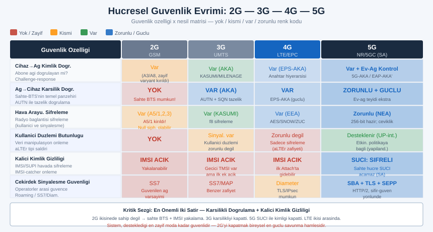
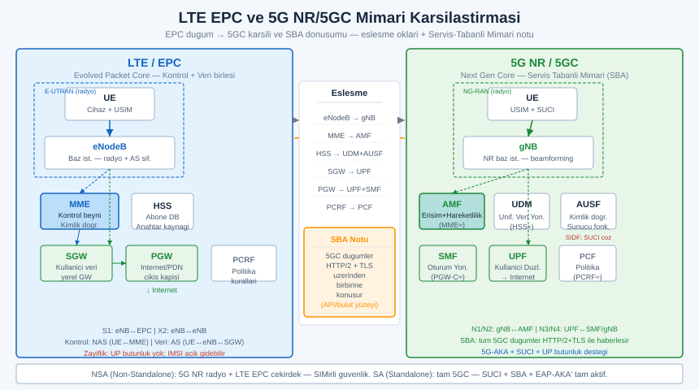
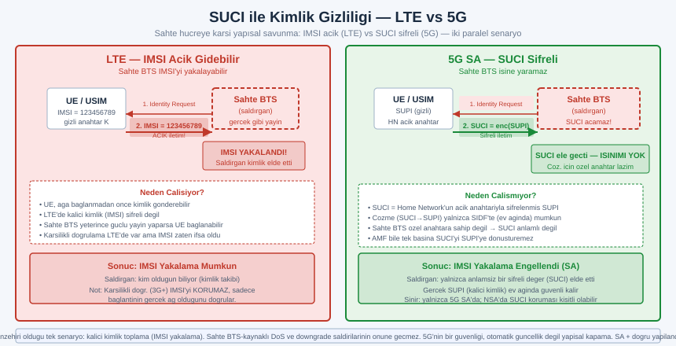
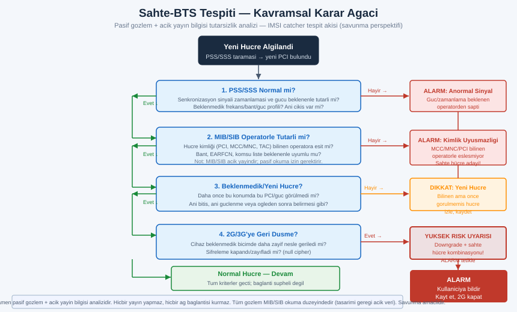

# SIGINT EL KİTABI — BÖLÜM 20: İLERİ HÜCRESEL GÜVENLİK

## 4G/LTE ve 5G NR Derinlemesine — Mimari, Kimlik Doğrulama, Zafiyet Sınıfları ve Savunma

> Amaç: Bu serinin 5. bölümü hücresel mimarinin temelini (2G/3G/4G/5G özet, prensip düzeyinde) verdi; 6. bölüm sahte baz istasyonu (IMSI catcher), SS7 ve genel telekom saldırı yüzeyini kavram düzeyinde tanıttı. Bu bölüm o temeli mühendislik derinliğine taşır: LTE/EPC ve 5G NR/5GC mimarilerini katman katman açar, kimlik doğrulamanın 2G'den 5G'ye nasıl evrildiğini, hangi nesilde hangi zafiyet sınıfının kapandığını ve hangilerinin hâlâ araştırma konusu olduğunu inceler. Hedef bir operatörlük el kitabı değildir; bir hücresel ağ güvenliği uzmanının zihnindeki haritayı kurmaktır: bir tehdit raporunda "SUCI", "downgrade", "SEPP" ya da "slice izolasyonu" geçtiğinde arkasındaki mimariyi ve risk modelini tanıyabilmen.

> Yasal çerçeve: Bu bölüm tasarımı gereği prensip, mimari ve savunma odaklıdır. Hücresel ağlar lisanslı spektrumda çalışan, kritik altyapı sınıfında sistemlerdir; canlı bir şebekeye herhangi bir biçimde müdahale (yayın yapma, sahte hücre kurma, abone trafiğini yakalama veya çözme, sinyalleşmeye enjeksiyon), istisnasız olarak ağır suçtur ve doğrudan can güvenliğini tehdit eder. Bu metinde hiçbir yerde bir saldırı reçetesi, parametre seti veya adım listesi verilmez. Anlatılan zafiyetler akademik literatürde kamuya açık biçimde tartışılmış kavramlardır ve burada yalnızca savunma ve risk anlama amacıyla, mekanizma düzeyinde ele alınır. Pratik çalışma yalnızca kendine ait, izole (Faraday/kablolu) bir test ortamında, lisanslı donanımla ve yalnızca kendi sinyallerinle yapılabilir. Mevzuat ülkeden ülkeye değişir; Türkiye'de TCK 132–140 ve BTK telsiz/elektronik haberleşme mevzuatı geçerlidir. Kendi ülkenin ve güncel sürümün kurallarını teyit et.

---

## İÇİNDEKİLER

1. [Hücresel Mimari Evrimi: 2G'den 5G'ye Güvenlik Çizgisi](#1)
2. [Kimlik Doğrulama Evrimi: Tek Yönlüden Karşılıklıya, 5G Geliştirmelerine](#2)
3. [LTE/4G Mimarisi: EPC, eNodeB ve Çekirdek Düğümler](#3)
4. [LTE Hava Arayüzü: OFDMA/SC-FDMA, PRB, EARFCN, Hücre Arama](#4)
5. [LTE Yayın Bilgisi ve Kimlikler: MIB/SIB, IMSI/GUTI](#5)
6. [LTE Protokol Yığını ve Güvenlik: NAS/AS, EEA/EIA](#6)
7. [LTE Bilinen Zafiyet Sınıfları (Akademik, Savunma Bakışı)](#7)
8. [5G NR Mimarisi: SA/NSA, gNB, 5GC ve Servis-Tabanlı Mimari](#8)
9. [5G Yeni Radyo: FR1/FR2, Beamforming, Massive MIMO](#9)
10. [5G Güvenlik Geliştirmeleri: SUPI/SUCI, 5G-AKA, Home-Network Kontrolü](#10)
11. [5G'de Hâlâ Açık Alanlar (Araştırma Konuları)](#11)
12. [Telekom Çekirdek Güvenliği: SS7/Diameter'dan SBA/HTTP-2'ye](#12)
13. [Roaming ve İnter-Operatör Güvenliği: SEPP](#13)
14. [Open RAN (ORAN) Güvenlik Yüzeyi](#14)
15. [Yasal Araştırma Ortamı: Kendi Test Hücresi (srsRAN/Open5GS, Faraday)](#15)
16. [Bireysel ve Kurumsal Savunma](#16)
17. [Alıştırmalar (Yasal, Pasif, Kendi Ortamın)](#17)
18. [Hızlı Referans ve Diğer Bölümler](#18)

---

<a id="1"></a>
## 1. Hücresel Mimari Evrimi: 2G'den 5G'ye Güvenlik Çizgisi

Hücresel haberleşmenin her nesli, bir öncekinin güvenlik derslerini içine sindirerek tasarlanmıştır. Bu nedenle nesilleri yan yana koyup "neyin değiştiğini" izlemek, tek tek protokolleri ezberlemekten çok daha öğreticidir; çünkü güvenlik özelliklerinin evrimi, saldırı yüzeyinin nasıl daraldığını (ve nereye kaydığını) doğrudan gösterir. Bu bölümün geri kalanını anlamlandıran çerçeve budur.

İlk soruyla başlayalım: neden her nesil daha güvenli? Üç temel itki vardır. Birincisi, kimlik doğrulamanın tek yönlüden karşılıklıya evrilmesidir; cihazın ağı doğrulayamadığı bir dünyada sahte baz istasyonu kaçınılmazdır, bu yüzden karşılıklı doğrulama temel bir kırılma noktasıdır. İkincisi, kalıcı abone kimliğinin (IMSI/SUPI) havada açık dolaşmasının giderek engellenmesidir; kimliğin şifrelenmesi, pasif takibi ve yakalamayı doğrudan zorlaştırır. Üçüncüsü, şifreleme ve bütünlük korumasının zayıf/iptal edilebilir olmaktan zorunlu ve güçlü olmaya doğru ilerlemesidir.

Aşağıdaki tablo, nesil × güvenlik özelliği eksenini özetler. Burada amaç bir "puan tablosu" değil, hangi özelliğin hangi nesilde devreye girdiğini görerek sonraki bölümlerdeki tartışmaları yerli yerine oturtmaktır.

| Güvenlik özelliği | 2G (GSM) | 3G (UMTS) | 4G (LTE) | 5G (NR) |
|---|---|---|---|---|
| Cihaz→ağ kimlik doğrulama | Var (zayıf) | Var | Var | Var |
| Ağ→cihaz (karşılıklı) doğrulama | Yok | Var (AKA) | Var (EPS-AKA) | Var (5G-AKA/EAP-AKA') |
| Hava arayüzü şifreleme | Var (A5, kırılmış varyantlar) | Var (KASUMI/f8) | Var (EEA, AES vb.) | Var (NEA, 256-bit'e hazır) |
| Sinyalleşme bütünlük koruması | Çok sınırlı | Sinyalleşmede var | Sinyalleşmede var | Sinyalleşme + opsiyonel kullanıcı düzlemi |
| Kalıcı kimliğin (IMSI/SUPI) gizliliği | Açık iletilebilir | Açık iletilebilir | Açık iletilebilir (ilk ek) | Şifreli (SUCI) |
| Home-network'ün doğrulamaya katılımı | Düşük | Orta | Orta | Yüksek (ev ağı kontrolü) |
| Çekirdek ağ arası güven modeli | Kapalı/güvenilen | SS7/MAP | Diameter | SBA + TLS, roaming'de SEPP |



> Mühendislik sezgisi: Tablodaki en kritik iki satır "karşılıklı doğrulama" ve "kalıcı kimlik gizliliği"dir. 2G'nin iki kanonik zafiyeti tam olarak bunların yokluğundan doğar: cihaz ağı doğrulayamadığı için sahte baz istasyonu mümkündür, ve IMSI açık gittiği için yakalanabilir. 3G karşılıklı doğrulamayı getirerek birincisini büyük ölçüde kapadı; 5G ise SUCI ile ikincisini hedef aldı. LTE bu ikisinin arasında durur: karşılıklı doğrulaması güçlüdür ama ilk ek (attach) sırasında kalıcı kimlik hâlâ açık gidebilir. Bu tek cümle, 7. ve 10. bölümlerin neredeyse tamamını çerçeveler.

### Neslin ötesinde: "geriye uyumluluk" güvenlik borcudur

Her nesil daha güvenli olsa da, hiçbir nesil önceki nesli bir gecede silmez. Şebekeler yıllarca çok-nesilli (multi-RAT) çalışır; bir 5G telefonu kapsama dışı kaldığında 4G'ye, o da yoksa 3G/2G'ye düşebilir. Bu geriye uyumluluk operasyonel bir zorunluluktur ama aynı zamanda bir güvenlik borcudur: bir saldırgan, cihazı kasten zayıf nesle düşürmeye (downgrade) çalışabilir, çünkü en zayıf desteklenen nesil, tüm zincirin güvenlik tavanını belirler. Bu yüzden modern savunmanın merkezinde "gereksiz eski nesli kapatmak" (özellikle 2G'yi devre dışı bırakmak) yatar; bunu 16. bölümde somutlaştıracağız. Akılda tutulacak ilke: bir sistem, desteklediği en zayıf moda kadar güvenlidir.

---

<a id="2"></a>
## 2. Kimlik Doğrulama Evrimi: Tek Yönlüden Karşılıklıya, 5G Geliştirmelerine

Hücresel güvenliğin omurgası kimlik doğrulamadır; çünkü diğer her şey (şifreleme anahtarları, oturum güvenliği, gizlilik) buradan türetilir. Evrimi izlemek, neslin neden daha güvenli olduğunu en net gösteren tek anlatıdır.

### 2G: yalnızca ağ aboneyi doğrular

GSM'de mantık tek yönlüdür. Ağ, aboneye rastgele bir sayı (RAND) gönderir; SIM kart, içindeki gizli anahtar (Ki) ile bir yanıt (SRES) üretir ve geri yollar. Ağ aynı hesabı yaparak yanıtı doğrular. Sorun açıktır: cihaz, kendisine bağlanan ağın gerçek olup olmadığını hiçbir biçimde doğrulayamaz. Bu tek yönlülük, sahte baz istasyonunun (Bölüm 6) temel olanağıdır; sahte hücre, aboneyi doğrulamak zorunda bile değildir, sadece "bana bağlan" der ve cihaz bağlanır. Üstelik 2G şifrelemesi ağ tarafından kapatılabilir (null cipher) ya da zayıf bir varyanta zorlanabilir.

### 3G: karşılıklı doğrulama (AKA) ve tazelik

UMTS, bu kırılmayı düzeltmek için AKA (Authentication and Key Agreement) protokolünü getirdi. Artık ağ da kendini kanıtlar: home network, abonenin anahtarıyla bir kimlik doğrulama jetonu (AUTN) üretir; cihaz, bu jetonu ve içindeki tazelik bilgisini (sequence number, SQN) doğrulayarak ağın gerçek ve "taze" olduğunu (eski bir mesajın tekrarı olmadığını) teyit eder. Böylece sahte baz istasyonu, geçerli bir AUTN üretemediği için kolayca reddedilir. AKA, sonraki tüm nesillerin kimlik doğrulama iskeletidir.

```
 AKA'nın özü (kavramsal, yön ve doğrulama):

   HOME NETWORK (gizli anahtar K burada)        CİHAZ / SIM (aynı K burada)
        │                                              │
        │  ── kimlik doğrulama vektörü üret ──         │
        │     (RAND, AUTN, beklenen yanıt, anahtarlar) │
        │                                              │
        │ ───────── RAND, AUTN ──────────────────────► │  AUTN'i doğrula:
        │                                              │   ağ gerçek mi? taze mi?
        │                                              │   (evetse → ağı kabul et)
        │ ◄───────── yanıt (RES) ─────────────────────  │  yanıt üret
        │  RES = beklenen mi? (evetse → cihazı kabul)   │
        │                                              │
        └──── her iki taraf aynı oturum anahtarlarını türetir ────┘
```

### 4G: EPS-AKA, ayrı anahtar hiyerarşisi

LTE, AKA'yı EPS-AKA olarak taşır ve üzerine daha katı bir anahtar hiyerarşisi kurar (Bölüm 6). Karşılıklı doğrulama korunur; farklı katmanlar (NAS sinyalleşmesi, AS/radyo) için ayrı anahtarlar türetilir, böylece bir katmandaki anahtarın açığa çıkması diğerini doğrudan çökertmez. Bu, "anahtar ayrımı" (key separation) ilkesinin olgunlaşmasıdır.

### 5G: home-network kontrolü ve kimlik gizliliği

5G iki büyük geliştirme getirir. Birincisi 5G-AKA ile home network'ün doğrulama kararına daha güçlü dahil olmasıdır: ziyaret edilen (serving) ağ, abonenin gerçekten doğrulandığını home network'ten teyit alır; bu, roaming senaryosunda sahte "doğrulandı" iddialarını zorlaştırır. İkincisi ve daha görünür olanı, kalıcı kimliğin (artık SUPI deniyor) havada asla açık gitmemesidir; cihaz, home network'ün açık anahtarıyla kimliğini şifreleyerek SUCI üretir (Bölüm 10). Ayrıca 5G, EAP-AKA' gibi EAP çerçevesine oturan kimlik doğrulama yöntemlerini standartlaştırır, bu da kurumsal/özel ağlarda esneklik sağlar.

| Nesil | Kimlik doğrulama yönü | Protokol | Kilit yenilik |
|---|---|---|---|
| 2G | Yalnızca ağ→abone | GSM challenge-response | (Zayıf; karşılıklı yok) |
| 3G | Karşılıklı | UMTS-AKA | Ağ doğrulanır (AUTN, SQN ile tazelik) |
| 4G | Karşılıklı | EPS-AKA | Katmanlı anahtar hiyerarşisi, anahtar ayrımı |
| 5G | Karşılıklı + ev ağı kontrolü | 5G-AKA / EAP-AKA' | SUCI (kimlik şifreleme), home-network teyidi, 256-bit'e hazır |

> Not: AKA ailesinin tam protokol akışları, anahtar türetme fonksiyonları ve alan adlandırmaları 3GPP teknik şartnamelerinde (örneğin TS 33.401 LTE güvenlik, TS 33.501 5G güvenlik) ayrıntılı tanımlıdır. Buradaki anlatım kavramsal yönü ve güvenlik amacını verir; kesin alanlar, bit uzunlukları ve fonksiyon tanımları için ilgili 3GPP sürümünden teyit edilmeli.

---

<a id="3"></a>
## 3. LTE/4G Mimarisi: EPC, eNodeB ve Çekirdek Düğümler

LTE'yi anlamanın en hızlı yolu, ağı iki büyük parçaya bölmektir: radyo erişim ağı (E-UTRAN) ve çekirdek ağ (EPC, Evolved Packet Core). Radyo tarafı tek bir tür baz istasyonundan oluşur: eNodeB. Çekirdek taraf ise birkaç uzmanlaşmış düğümün iş bölümüdür. Bu iş bölümünü tanımak, hem zafiyet tartışmasını hem de 5G'ye geçişte neyin değiştiğini anlamak için zorunludur.

```
            E-UTRAN (radyo)                         EPC (çekirdek)
   ┌───────────────────────────┐      ┌───────────────────────────────────────────┐
   │                           │      │                                           │
   │   ((•))   eNodeB          │      │    ┌─────┐        ┌─────┐      ┌─────┐     │
   │    │                      │      │    │ MME │◄──────►│ HSS │      │ PCRF│     │
   │  [UE] cihaz ── radyo ─────┼──────┼───►│     │        └─────┘      └─────┘     │
   │                           │ S1   │    └──┬──┘ (kontrol düzlemi)               │
   │   ((•))   eNodeB          │      │       │                                   │
   │      └─── X2 (komşu) ──────┘      │       │ kullanıcı düzlemi                 │
   │                                  │    ┌──▼──┐        ┌─────┐                  │
   │                                  │    │ SGW │───────►│ PGW │───► İnternet/PDN  │
   │                                  │    └─────┘        └─────┘                  │
   └──────────────────────────────────┴───────────────────────────────────────────┘
```

| Düğüm | Açılım | Görevi | Güvenlik açısından önemi |
|---|---|---|---|
| UE | User Equipment | Abone cihazı (telefon + USIM) | Kimlik doğrulamanın bir ucu; SIM gizli anahtarı burada |
| eNodeB | Evolved Node B | Baz istasyonu; radyo + zamanlama + AS şifreleme uç noktası | Hava arayüzü güvenliğinin ağ tarafı; sahte-eNodeB tehdidi buna öykünür |
| MME | Mobility Management Entity | Kontrol düzlemi beyni: ek, kimlik doğrulama, hareketlilik, NAS güvenliği | Kimlik doğrulamayı yürütür; NAS şifreleme/bütünlük burada başlar |
| HSS | Home Subscriber Server | Abone veritabanı + kimlik doğrulama vektörü üreticisi | Gizli anahtarların ve abonelik bilgisinin kaynağı |
| SGW | Serving Gateway | Kullanıcı verisini taşıyan yerel ağ geçidi (hareketlilik tutturucu) | Kullanıcı düzlemi taşıma; konum/oturum bağlamı |
| PGW | Packet Data Network Gateway | Dış ağa (İnternet) çıkış, IP tahsisi, politika uygulama | Dış dünyaya kapı; politika/filtre noktası |
| PCRF | Policy and Charging Rules Function | Politika ve ücretlendirme kuralları | Hizmet kalitesi ve politika kontrolü |

Mühendislik için kritik ayrım, kontrol düzlemi ile kullanıcı düzlemi ayrımıdır. Kontrol düzlemi (UE↔MME, NAS sinyalleşmesi) "kimsin, doğrulandın mı, nereye gidiyorsun" sorularını yönetir; kullanıcı düzlemi (UE↔eNodeB↔SGW↔PGW) gerçek veriyi (İnternet trafiğini) taşır. Güvenlik mekanizmaları bu iki düzleme farklı uygulanır: NAS sinyalleşmesi LTE'de zorunlu olarak bütünlük korumalıdır, ama kullanıcı düzlemi verisinin bütünlüğü LTE'de zorunlu değildir (yalnızca şifrelenir). Bu ince ayrım, 7. bölümdeki bazı araştırma sınıflarının (kullanıcı düzlemi bütünlük eksikliğinden yararlanan akademik çalışmalar) kökünü oluşturur.

> Mühendislik sezgisi: EPC'yi bir havalimanı gibi düşün. eNodeB kapıdaki turnikedir (radyo erişimi). MME pasaport kontrolüdür (kimsin, içeri girebilir misin). HSS pasaportları doğrulayan merkezi kayıttır. SGW/PGW ise bagaj ve çıkış kapısıdır (verinin akışı). Bir sahte baz istasyonu, sahte bir turnike kurmaya çalışır; karşılıklı doğrulama (Bölüm 2) tam da pasaport kontrolünün cihaz tarafından da yapılması demektir — sahte turnikenin geçerli bir pasaport mührü olmadığı için cihaz onu reddetmelidir.

---

<a id="4"></a>
## 4. LTE Hava Arayüzü: OFDMA/SC-FDMA, PRB, EARFCN, Hücre Arama

Hücresel güvenliği konuşmadan önce hava arayüzünün fiziğini bilmek gerekir; çünkü bir sinyali pasif gözlemleyip "bu bir LTE hücresi" demek ya da bir tehdit raporundaki frekans/kapasite tartışmasını anlamak, bu kavramları gerektirir. Bölüm 1'deki OFDM ve IQ temelleri burada hücresel bağlama oturur.

LTE, aşağı bağda (ağ→cihaz, downlink) OFDMA, yukarı bağda (cihaz→ağ, uplink) SC-FDMA kullanır. OFDMA, geniş bandı çok sayıda dar ortogonal alt taşıyıcıya böler ve farklı kullanıcılara farklı alt taşıyıcı/zaman bloklarını tahsis eder; bu, çok kullanıcılı verimlilik ve çok-yol dayanıklılığı sağlar (Bölüm 1, OFDM mantığı). Yukarı bağda SC-FDMA tercih edilir çünkü tepe-ortalama güç oranı (PAPR) daha düşüktür; bu, cihazın güç yükseltecini daha verimli ve daha az ısınarak çalıştırması, dolayısıyla pil ve menzil avantajı demektir.

| Kavram | Açılım | Ne anlatır |
|---|---|---|
| OFDMA | Orthogonal Frequency Division Multiple Access | Aşağı bağ çoklu erişim; alt taşıyıcı/zaman tahsisi |
| SC-FDMA | Single Carrier FDMA | Yukarı bağ; düşük PAPR (pil/menzil avantajı) |
| PRB | Physical Resource Block | En küçük tahsis birimi (zaman×frekans kaynağı) |
| Alt taşıyıcı aralığı | — | LTE'de tipik 15 kHz (sabit) |
| EARFCN | E-UTRA Absolute Radio Frequency Channel Number | Taşıyıcı frekansını gösteren tam sayı kanal numarası |
| Bant genişliği | — | 1.4 / 3 / 5 / 10 / 15 / 20 MHz (taşıyıcı başına) |

Fiziksel kaynak bloğu (PRB), LTE'nin temel para birimidir: zaman ve frekansta tanımlı en küçük tahsis birimidir. Bir hücrenin kapasitesini ve bir kullanıcının aldığı hız payını PRB sayısıyla düşünebilirsin. EARFCN ise frekansı insana okunur tam sayıyla ifade eder; bir analist "bu hücre şu EARFCN'de" dediğinde aslında belirli bir taşıyıcı frekansını kasteder. EARFCN↔frekans dönüşümü banda bağlı sabit formüllerle yapılır; pratikte tablolardan/araçlardan okunur.

### Hücre arama: PSS ve SSS

Bir cihaz açıldığında ya da yeni bir hücre ararken, önce zamanlama ve hücre kimliği için iki özel senkronizasyon sinyalini arar: PSS (Primary Synchronization Signal) ve SSS (Secondary Synchronization Signal). Bunlar her hücrenin düzenli yaydığı, içeriği önceden bilinen referans sinyalleridir; cihaz bunları yakalayarak sembol/çerçeve zamanlamasını kilitler ve fiziksel hücre kimliğini (PCI, Physical Cell Identity) çözer. PSS/SSS açık ve standart olduğundan, bir hücrenin varlığını pasif gözlemle tespit etmenin temelidir; bu, savunma tarafında "ortamda hangi hücreler var, beklenmedik bir hücre belirdi mi" sorusunun fiziksel zeminidir.

```
 Hücre arama akışı (cihaz açılışı, kavramsal):

  güç ver ──► bandı tara ──► PSS bul ──► sembol/yarı-çerçeve zamanlaması
                               │
                               ▼
                            SSS bul ──► tam çerçeve zamanlaması + PCI (hücre kimliği)
                               │
                               ▼
                       yayın kanalını oku (MIB → Bölüm 5)
                               │
                               ▼
                       sistem bilgilerini oku (SIB'ler → Bölüm 5)
                               │
                               ▼
                    hücreye kamp kur / ek (attach) süreci
```

> Mühendislik sezgisi: PSS/SSS, bir hücrenin "ben buradayım ve saatim şu" diyen açık bir el sallayışıdır. Bu sinyalleri okumak yayın yapmayı gerektirmez (tamamen pasif) ve standart olduğu için yasal/açık gözlemin sınırları içindedir. Sahte baz istasyonu tespitinin (Bölüm 16) fiziksel başlangıç noktası, tam da bu açık yayın bilgilerinin (PSS/SSS, ardından MIB/SIB) beklenenle tutarlı olup olmadığını izlemektir.

---

<a id="5"></a>
## 5. LTE Yayın Bilgisi ve Kimlikler: MIB/SIB, IMSI/GUTI

Hücre arama zamanlamayı kilitledikten sonra cihaz, hücrenin kendini tarif eden yayın bilgilerini okur. Bu bilgiler tasarımı gereği açıktır (şifrelenmemiştir), çünkü cihazın ağa daha bağlanmadan, kimliği doğrulanmadan önce bunları okuyabilmesi gerekir. Bu açıklık hem pasif gözlemin temelidir hem de bazı zafiyet sınıflarının (Bölüm 7) zeminidir; çünkü "kimlik doğrulamadan önce okunan/gönderilen mesaj" kategorisi, doğası gereği korunamayan bir yüzeydir.

### MIB ve SIB: hücrenin açık kartviziti

Yayın bilgisi iki katmanda gelir. MIB (Master Information Block) en temel, en sık yayılan bloktur; bant genişliği gibi en kritik birkaç parametreyi taşır ve cihazın geri kalanını okuyabilmesi için gereken minimum bilgiyi verir. SIB'ler (System Information Block, SIB1, SIB2, ...) daha ayrıntılı sistem bilgilerini taşır: hücre seçim parametreleri, komşu hücre listeleri, erişim kontrol bilgileri, hangi başka frekansların/RAT'ların mevcut olduğu gibi.

| Blok | Taşıdığı bilgi (örnek) | Neden açık | Güvenlik notu |
|---|---|---|---|
| MIB | En temel hücre parametreleri (örn. bant genişliği, çerçeve numarası bilgisi) | Cihaz her şeyden önce bunu okumalı | İçeriği açık; pasif gözlemle okunur |
| SIB1 | Hücre kimlik/erişim bilgisi, planlama | Bağlanmadan önce gerekli | Açık; hücre seçimini yönlendirir |
| SIB2+ | Radyo kaynak yapılandırması, komşu listeleri, diğer RAT'lar | Hücre seçimi/yeniden seçimi için | Açık; downgrade tartışmasıyla (Bölüm 7) ilişkili |

Buradaki kavramsal kritik nokta: yayın bilgileri açık olduğu için bir gözlemci bunları okuyabilir, ama daha önemlisi, cihaz bu açık bilgilere kimlik doğrulamadan önce güvenmek zorundadır. Bu "doğrulamadan önce güven" penceresi, hücresel güvenliğin en kalıcı zayıf noktasıdır ve hem 4G hem 5G'de tümüyle kapatılamamıştır (Bölüm 11). Savunma tarafında bu, "yayılan sistem bilgileri beklenen operatör profiliyle tutarlı mı" izlemesinin neden değerli olduğunu açıklar.

### Kimlikler: IMSI, GUTI ve neden ikisi var

Bir aboneyi tanımlayan iki tür kimlik vardır ve aralarındaki fark doğrudan gizlilikle ilgilidir.

| Kimlik | Açılım | Doğası | Gizlilik özelliği |
|---|---|---|---|
| IMSI | International Mobile Subscriber Identity | Kalıcı, abonenin gerçek/sabit kimliği (SIM'e bağlı) | En hassas; havada açık görünürse abone takip edilebilir |
| GUTI | Globally Unique Temporary Identity | Geçici, ağ tarafından atanan takma kimlik | Periyodik değişir; IMSI'yi havada gizlemek için kullanılır |
| TMSI | (eski/2G-3G karşılığı) Temporary Mobile Subscriber Identity | Geçici kimlik | Aynı amaç: kalıcı kimliği örtmek |

Tasarım niyeti şudur: cihaz ağa kaydolduktan sonra ağ ona bir geçici kimlik (GUTI) verir ve sonraki etkileşimlerde mümkün olduğunca bu geçici kimlik kullanılır; böylece kalıcı IMSI havada nadiren görünür. Bu, pasif takibi zorlaştıran bir gizlilik önlemidir. Ancak LTE'de bir kritik kalıntı vardır: belirli durumlarda (örneğin ağın aboneyi geçici kimlikten tanıyamadığı, ilk ek anları ya da kimlik talebi senaryoları) kalıcı IMSI yine de açık iletilebilir. İşte bu kalıntı, IMSI'nin havada yakalanabildiği akademik senaryoların (Bölüm 7) ve 5G'nin SUCI çözümünün (Bölüm 10) çıkış noktasıdır.

```
 Geçici kimlik mantığı (gizlilik niyeti):

  İlk kayıt:   cihaz ──(bazı durumlarda kalıcı IMSI açık)──► ağ
                                                              │
                          ağ geçici kimlik atar (GUTI) ◄──────┘
  Sonrası:     cihaz ◄────► ağ   (mümkün oldukça GUTI ile; IMSI gizli)
                                  GUTI periyodik yenilenir → takip zorlaşır

  Kalıntı risk: GUTI yeterince sık yenilenmezse ya da IMSI talebi
                tetiklenirse, kalıcı kimlik açığa çıkabilir → 5G bunu SUCI ile kapatır
```

> Not: IMSI'nin hangi tam koşullarda açık iletilebileceği, GUTI yenileme sıklığı ve kimlik talebi (identity request) prosedürünün ayrıntıları 3GPP NAS şartnamelerinde tanımlıdır ve sürüm/uygulama farklılıkları gösterir. Buradaki anlatım gizlilik mantığını verir; kesin tetikleyici koşullar için 3GPP'den teyit edilmeli.

---

<a id="6"></a>
## 6. LTE Protokol Yığını ve Güvenlik: NAS/AS, EEA/EIA

LTE güvenliğini doğru konumlandırmak için iki katmanı ayırmak şarttır: NAS (Non-Access Stratum) ve AS (Access Stratum). Bu ayrım, "hangi mesaj nerede ve hangi anahtarla korunuyor" sorusunun cevabıdır ve neredeyse tüm LTE zafiyet tartışmaları bu ikiliyle çerçevelenir.

NAS, cihaz (UE) ile çekirdek ağ (MME) arasındaki, radyodan bağımsız üst katman sinyalleşmesidir: ek (attach), kimlik doğrulama, hareketlilik yönetimi, oturum kurma gibi mesajlar buradadır. AS ise cihaz ile baz istasyonu (eNodeB) arasındaki radyo-bağlantı katmanı sinyalleşmesi ve kullanıcı verisinin taşınmasıdır; RRC (Radio Resource Control) bu katmanın kontrol protokolüdür.

```
 LTE katmanlı güvenlik (kim-kiminle, hangi koruma):

   ┌──────────────────────────────────────────────────────────┐
   │ NAS  (UE ↔ MME)   : ek, kimlik doğrulama, hareketlilik    │
   │   koruma: NAS şifreleme + NAS bütünlük (zorunlu bütünlük)  │
   ├──────────────────────────────────────────────────────────┤
   │ AS / RRC  (UE ↔ eNodeB) : radyo kontrol sinyalleşmesi      │
   │   koruma: RRC şifreleme + RRC bütünlük                     │
   ├──────────────────────────────────────────────────────────┤
   │ AS / Kullanıcı düzlemi (UE ↔ eNodeB) : gerçek veri (IP)    │
   │   koruma: şifreleme VAR; bütünlük LTE'de ZORUNLU DEĞİL     │
   └──────────────────────────────────────────────────────────┘
            ▲
            └── Anahtarlar, kimlik doğrulama sonrası türetilen
                hiyerarşiden gelir (katman başına ayrı anahtar = anahtar ayrımı)
```

Bu tablodaki en önemli satır en alttakidir: LTE'de sinyalleşme (NAS ve RRC) bütünlük korumalıdır, ama kullanıcı düzlemi verisinin bütünlüğü zorunlu değildir (yalnızca şifrelenir). Bütünlük koruması, bir mesajın yolda değiştirilmediğini garanti eder; onun yokluğu, teorik olarak şifreli veriye yönelik belirli manipülasyon sınıflarına kapı aralar. Akademik literatürdeki bazı LTE çalışmaları (Bölüm 7) tam olarak bu "kullanıcı düzlemi bütünlük eksikliğini" inceler. 5G, bu boşluğu kapatmak için kullanıcı düzlemi bütünlük korumasını opsiyonel olarak ekler (Bölüm 10).

### Şifreleme ve bütünlük algoritma aileleri: EEA ve EIA

LTE, şifreleme ve bütünlük için numaralandırılmış algoritma aileleri tanımlar:

| Aile | Açılım | İşlev | Temel aldığı yapı (örnek) |
|---|---|---|---|
| EEA0 | EPS Encryption Algorithm 0 | Şifreleme YOK (null) | (Yalnızca özel/acil durumlar) |
| EEA1 | — | Şifreleme | Akış şifre (SNOW 3G tabanlı) |
| EEA2 | — | Şifreleme | AES tabanlı |
| EEA3 | — | Şifreleme | ZUC tabanlı |
| EIA0 | EPS Integrity Algorithm 0 | Bütünlük YOK (null) | (Sınırlı/özel durumlar) |
| EIA1/2/3 | — | Bütünlük (MAC) | SNOW 3G / AES / ZUC tabanlı |

Burada iki güvenlik dersi vardır. Birincisi, "null" varyantların (EEA0/EIA0) varlığıdır; bunlar standartta belirli (örneğin acil çağrı) durumlar için bulunur ama bir saldırı yüzeyi kavramı olarak önemlidir: eğer bir saldırgan tarafları null algoritmaya zorlayabilseydi koruma çökerdi. Pratikte ağ politikası ve karşılıklı doğrulama bunu engellemeyi hedefler; yine de "en zayıf moda zorlama" (downgrade) endişesinin algoritma düzeyindeki karşılığı budur. İkincisi, birden çok güçlü aile (AES, SNOW 3G, ZUC) sunulmasının kriptografik çeviklik (agility) sağlamasıdır: bir aile zayıflarsa diğerine geçilebilir.

> Mühendislik sezgisi: LTE güvenliğini iki cümlede tut. Bir: kimlik doğrulama (EPS-AKA) sağlamdır ve karşılıklıdır, yani sahte baz istasyonu kimlik doğrulamayı geçemez. İki: korumanın asimetrisi (sinyalleşme bütünlüklü, kullanıcı düzlemi değil) ve "doğrulamadan önceki açık mesajlar" (yayın bilgisi, ilk ek) ince ama gerçek bir yüzey bırakır. 5G'nin güvenlik geliştirmelerinin çoğu (Bölüm 10) tam olarak bu ikinci cümleyi hedefler.

---

<a id="7"></a>
## 7. LTE Bilinen Zafiyet Sınıfları (Akademik, Savunma Bakışı)

Bu bölüm bilinçli olarak sınıf düzeyinde ve savunma bakışıyla yazılmıştır. Her başlık, akademik literatürde kamuya açık biçimde tartışılmış bir zafiyet ailesinin mekanizmasını ve ona karşı savunma ilkesini verir; hiçbiri uygulanabilir bir reçete, parametre seti veya araç kullanımı içermez. Amaç, bir tehdit modelinde "LTE'ye karşı hangi sınıf riskler var ve nasıl azaltılır" sorusunu mühendislik diliyle yanıtlayabilmektir. Bu sınıfların pratiği yalnızca izole bir test ortamında (Bölüm 15) ve yalnızca kendi ağında düşünülebilir; canlı şebekeye uygulanması suçtur.

### Zafiyet × savunma tablosu

| Zafiyet sınıfı (kavram) | Kök neden | Etki (kavramsal) | Savunma ilkesi |
|---|---|---|---|
| Kalıcı kimlik (IMSI) açığa çıkması | İlk ek/kimlik talebinde IMSI açık iletilebilir | Pasif abone takibi/varlık tespiti | 5G SUCI; operatör tarafı GUTI yenileme disiplini |
| Sahte baz istasyonu cazibesi | Yayın bilgisi doğrulamadan önce açık; cihaz güçlü hücreye yönelir | Cihazı sahte hücreye çekme denemesi (ama karşılıklı doğrulama geçilemez) | Karşılıklı doğrulama (zaten var); sahte-BTS tespit (Bölüm 16) |
| Downgrade (4G→2G/3G) baskısı | Geriye uyumluluk; en zayıf nesil tavanı belirler | Cihazı zayıf nesle düşürüp o neslin zafiyetine maruz bırakma | 2G'yi kapatma; "yalnızca 4G/5G" politikası |
| Kullanıcı düzlemi bütünlük eksikliği | LTE'de kullanıcı düzlemi bütünlüğü zorunlu değil | Şifreli veriye yönelik belirli manipülasyon sınıfları (araştırma) | 5G kullanıcı düzlemi bütünlüğü; uygulama-katmanı TLS |
| RRC/sinyalleşme tabanlı DoS | Bazı erken bağlantı/RRC mesajları doğrulamadan önce işlenir | Cihaz/hücre düzeyinde hizmet engelleme denemeleri | Standart sertleştirmeleri; tespit/izleme |
| Konum/varlık sızıntısı | Çağrı (paging), ölçüm ve sinyalleşme yan kanalları | Abonenin kabaca varlığı/konumu çıkarımı | Gizlilik geliştirmeleri; gereksiz sinyalleşme azaltma |

Şimdi en çok yanlış anlaşılan birkaç sınıfı kavram düzeyinde açalım, çünkü bunlar tehdit raporlarında sık geçer ve mekanizmasını bilmek savunma için gereklidir.

### IMSI yakalama (eski/kalıntı sınıfı)

Sahte baz istasyonunun klasik amacı, cihazı kalıcı kimliğini açık göndermeye yönlendirmektir. 2G'de bu kolaydı (karşılıklı doğrulama yoktu). LTE'de karşılıklı doğrulama sahte hücrenin tam bir oturum kurmasını engeller, ama "doğrulamadan önce" pencerede kalıcı kimliğin açığa çıkabildiği kalıntı senaryolar akademik olarak tartışılmıştır. Savunma çizgisi nettir: 5G'nin SUCI'si bu pencereyi kapatmayı hedefler (Bölüm 10), ve operatör tarafında geçici kimlik (GUTI) disiplini riski azaltır. Bu sınıf, "neden 5G kimliği şifreliyor" sorusunun tarihsel cevabıdır.

### aLTEr / yeniden yönlendirme türü araştırmalar

Akademik literatürde, LTE'nin kullanıcı düzlemi bütünlük eksikliğinden yararlanarak belirli koşullarda trafiği etkilemeye (örneğin DNS düzeyinde yönlendirme manipülasyonu) yönelik kavram kanıtı çalışmalar yayınlanmıştır. Bunlar laboratuvar koşullarında, özel ekipmanla gösterilmiş, dar koşullu sonuçlardır ve "her LTE bağlantısı kolayca yönlendirilir" anlamına gelmez. Buradaki ders mekanizmadır: kullanıcı düzleminde bütünlük olmaması, şifreli olsa bile içeriğin belirli yapısal manipülasyonlarına teorik kapı aralar. Savunma iki katmanlıdır: (1) 5G bu boşluğu kullanıcı düzlemi bütünlüğüyle kapatır; (2) bağlantı katmanından bağımsız olarak uygulama katmanında uçtan uca şifreleme (HTTPS/TLS, güvenli DNS) kullanmak, alt katman manipülasyonlarını büyük ölçüde etkisiz kılar. Bu, "alt katmana güvenme, kendi ucunu şifrele" ilkesinin somut gerekçesidir.

### Downgrade (nesil düşürme) baskısı

Bir saldırganın en pratik kaldıracı, güçlü 4G/5G'yi kırmaya çalışmak yerine cihazı zayıf 2G'ye düşürmeye çalışmaktır; çünkü en zayıf desteklenen nesil tüm güvenliğin tavanını belirler (Bölüm 1). Mekanizma, cihazın hücre seçim/yeniden seçim mantığını zayıf nesle yönelmeye itmektir. Savunma doğrudan ve etkilidir: cihazda mümkünse 2G'yi tümüyle kapatmak (Bölüm 16), kurumsal cihaz profillerinde "yalnızca 4G/5G" politikası uygulamak. Bu, bireysel kullanıcının elindeki en güçlü tek savunma hamlelerinden biridir.

### RRC tabanlı hizmet engelleme (DoS) ve konum sızıntısı

Bağlantının çok erken aşamasındaki bazı sinyalleşme mesajları, doğası gereği kimlik doğrulamadan önce işlenir; akademik çalışmalar bu erken pencereyi hedef alan hizmet engelleme (cihazın bağlanamaması/düşmesi) senaryolarını ve çağrı (paging)/ölçüm yan kanallarından abonenin kabaca varlığını çıkarma sınıflarını incelemiştir. Bunlar büyük ölçüde "doğrulamadan önceki yüzey" temasının çeşitlemeleridir. Savunma tarafında standart gövdesi (3GPP) sürümler arası sertleştirmeler ekler; kullanıcı tarafında doğrudan azaltım sınırlıdır, ama tehdidi tanımak (anormal bağlantı düşmeleri, beklenmedik hücre davranışı) tespit için değerlidir.

> Uyarı: Bu başlıkların her biri belirli akademik makalelere ve belirli sürüm/koşullara dayanır; etkileri laboratuvar gösterimleridir ve "vahşi doğada herkese kolayca uygulanır" değildir. Buradaki anlatım kasıtlı olarak mekanizma ve savunma düzeyindedir; sayısal etki iddiaları, hangi sürümlerin etkilendiği ve düzeltme durumu ilgili kaynaklardan ve güncel 3GPP düzeltmelerinden teyit edilmeli. Hiçbir reçete verilmemiştir ve canlı şebekeye uygulama suçtur.

---

<a id="8"></a>
## 8. 5G NR Mimarisi: SA/NSA, gNB, 5GC ve Servis-Tabanlı Mimari

5G, LTE'nin doğrudan evrimi olmakla birlikte mimari felsefede iki kökten yenilik getirir: çekirdeğin servis-tabanlı (bulut-yerli) yeniden tasarımı ve radyonun yeni frekanslara/beamforming'e açılması. Güvenlik açısından en önemli kısım çekirdektir; çünkü hem yeni koruma mekanizmaları (SUCI, SEPP) hem de yeni saldırı yüzeyi (servisler arası API'ler) oradadır.

### SA ve NSA: iki konuşlandırma modeli

İlk ayrım operasyoneldir ama güvenlik sonuçları taşır. 5G iki temel modda konuşlandırılır:

| Model | Açılım | Radyo | Çekirdek | Güvenlik sonucu |
|---|---|---|---|---|
| NSA | Non-Standalone | 5G NR radyosu, ama kontrol için mevcut LTE'ye dayanır | 4G EPC (LTE çekirdeği) | 5G radyo hızı, ama güvenlik büyük ölçüde LTE seviyesinde; SUCI gibi 5GC özellikleri tam gelmez |
| SA | Standalone | 5G NR radyosu | 5GC (tam 5G çekirdek) | Tam 5G güvenliği: SUCI, gelişmiş kimlik doğrulama, SBA güvenliği |

Bu ayrım kritiktir: "5G" etiketli bir bağlantı, eğer NSA ise güvenlik avantajlarının (özellikle SUCI ile kimlik gizliliği) çoğunu henüz taşımıyor olabilir; çünkü kontrol düzlemi ve çekirdek hâlâ LTE'dir. Gerçek 5G güvenlik kazanımları SA konuşlandırmasıyla gelir. Bir savunma değerlendirmesinde "bu şebeke SA mı NSA mı" sorusu, beklenen güvenlik seviyesini doğrudan belirler.

### gNB ve 5GC düğümleri



Radyo tarafında baz istasyonu artık gNB'dir (Next Generation Node B; LTE'deki eNodeB'nin 5G karşılığı). Çekirdek tarafında ise LTE'nin tek-amaçlı düğümleri (MME, HSS, ...), servis-tabanlı bir mimaride yeniden adlandırılmış ve bölünmüş ağ fonksiyonlarına (NF) dönüşür.

| 5GC fonksiyonu | Açılım | LTE'deki kabaca karşılığı | Görevi |
|---|---|---|---|
| AMF | Access and Mobility Management Function | MME (kısmen) | Erişim, hareketlilik, kayıt, NAS güvenliği uç noktası |
| SMF | Session Management Function | MME/SGW (oturum kısmı) | Oturum (PDU) kurma/yönetme |
| UPF | User Plane Function | SGW/PGW | Kullanıcı verisinin taşınması/çıkışı |
| AUSF | Authentication Server Function | HSS (kimlik doğrulama kısmı) | Kimlik doğrulama sunucusu |
| UDM | Unified Data Management | HSS (abone veri kısmı) | Abone verisi, anahtar/kimlik bilgisi yönetimi |
| SIDF | Subscription Identifier De-concealing Function | (yeni) | SUCI'yi SUPI'ye çözen ev-ağı fonksiyonu (Bölüm 10) |
| SEPP | Security Edge Protection Proxy | (yeni) | Operatörler arası (roaming) güvenlik sınırı (Bölüm 13) |

```
            5G NR (radyo)                         5GC (servis-tabanlı çekirdek)
   ┌───────────────────────────┐   ┌──────────────────────────────────────────────────┐
   │                           │   │   Servis Veri Yolu (SBA: HTTP/2 + TLS üzerinden)   │
   │   ((•))   gNB             │   │  ════╦════════╦════════╦════════╦════════╦════════ │
   │    │                      │   │      ║        ║        ║        ║        ║          │
   │  [UE] cihaz ── radyo ──────┼───┼──► ┌─▼─┐    ┌─▼─┐    ┌─▼──┐   ┌─▼──┐   ┌─▼──┐       │
   │      (USIM, SUCI üretir)   │   │    │AMF│    │SMF│    │AUSF│   │UDM │   │... │       │
   │                           │   │    └─┬─┘    └─┬─┘    └────┘   └─┬──┘   └────┘       │
   │   ((•))   gNB             │   │      │        │  kullanıcı     │ (UDM içinde/yanında │
   │                           │   │      │     ┌──▼──┐  düzlemi     │  SIDF: SUCI→SUPI)  │
   │                           │   │      │     │ UPF │──► Veri Ağı  │                    │
   └───────────────────────────┘   │      │     └─────┘  (İnternet)  │                    │
                                   │      └──── kontrol düzlemi ──────┘                    │
                                   └──────────────────────────────────────────────────────┘
```

### Servis-Tabanlı Mimari (SBA): en büyük felsefi değişim

LTE'de düğümler sabit, noktadan-noktaya arayüzlerle (S1, X2 gibi) konuşurdu. 5GC ise bir servis-tabanlı mimariye (SBA, Service-Based Architecture) geçer: ağ fonksiyonları, birbirlerine web servisleri gibi, standart API'ler üzerinden (HTTP/2, JSON, TLS ile) hizmet sunar ve tüketir. Bu, bulut-yerli (cloud-native) bir tasarımdır; fonksiyonlar konteynerlerde çalışabilir, esnekçe ölçeklenebilir.

Bu değişimin güvenlik sonucu çift yönlüdür. Olumlu tarafta: BT dünyasının olgun güvenlik araçları (TLS, OAuth tabanlı yetkilendirme, API ağ geçitleri) artık telekom çekirdeğine uygulanabilir; fonksiyonlar arası iletişim TLS ile şifreli ve kimlik doğrulamalı olabilir. Olumsuz/yeni tarafta: telekom çekirdeği artık tanıdık BT saldırı yüzeyini (API güvenliği, yanlış yapılandırma, yetkilendirme hataları, konteyner güvenliği) miras alır. Yani 5G çekirdeğini korumak, geleneksel telekom bilgisi kadar modern bulut/API güvenliği bilgisi de gerektirir. Bu, 12. bölümde SS7/Diameter'dan SBA'ya geçişi tartışırken merkezî tema olacaktır.

### Ağ dilimleme (network slicing) ve kenar (MEC)

5G'nin iki ileri kavramı güvenlik tartışmasına yeni boyut ekler. Ağ dilimleme (network slicing), tek bir fiziksel altyapı üzerinde mantıksal olarak izole, amaca özel sanal ağlar kurmaktır: örneğin biri yüksek hızlı mobil geniş bant, biri düşük gecikmeli endüstriyel kontrol, biri devasa IoT için. Her dilim kendi performans ve güvenlik profiline sahip olabilir. Güvenlik sorusu doğrudandır: dilimler birbirinden ne kadar izole? Bir dilimdeki sorun (ya da kötü niyetli kiracı) başka dilime sızabilir mi? Dilim izolasyonu, 11. bölümde "açık araştırma alanı" olarak ele alacağımız konulardan biridir.

Çoklu erişim kenar hesaplama (MEC, Multi-access Edge Computing), hesaplamayı çekirdekten çıkarıp kullanıcıya yakın "kenara" taşımaktır (düşük gecikme için). Güvenlik açısından kenar, fiziksel olarak daha dağıtık ve potansiyel olarak daha az korunan konumlarda hassas işlevler çalıştırmak demektir; saldırı yüzeyi merkezden kenara doğru yayılır. Hem dilimleme hem MEC, "tek kale" yerine "dağıtık, çok-kiracılı, yazılım-tanımlı" bir güvenlik modeli gerektirir.

> Mühendislik sezgisi: LTE çekirdeği bir bina içindeki kapalı bir telekom santraliyse, 5G çekirdeği bir bulut veri merkezidir. Bu, güvenliğin hem zenginleştiği (TLS, modern kimlik doğrulama, izolasyon araçları) hem de genişlediği (artık API'ler, konteynerler, çok-kiracılık, kenar düğümleri de korunmalı) anlamına gelir. "5G daha güvenli mi" sorusunun dürüst cevabı: temel kriptografi ve kimlik gizliliği kesinlikle ileri; ama saldırı yüzeyi daha büyük ve daha tanıdık (BT-benzeri), dolayısıyla güvenlik artık doğru yapılandırmaya ve operasyonel olgunluğa daha bağımlı.

---

<a id="9"></a>
## 9. 5G Yeni Radyo: FR1/FR2, Beamforming, Massive MIMO

5G NR (New Radio) hava arayüzü, LTE'nin OFDM temelini korur ama frekans aralığını ve anten teknolojisini köklü biçimde genişletir. Bu, güvenlikten çok kapasite/menzil konusu olsa da, bir savunma analistinin "bu sinyal nerede, nasıl yayılıyor, ne kadar yönlü" sorularını yanıtlaması için gereklidir; ayrıca beamforming'in dolaylı bir gizlilik/zorluk etkisi vardır.

### İki frekans aralığı: FR1 ve FR2

| Aralık | Adı | Kabaca frekans | Karakter | Tipik kullanım |
|---|---|---|---|---|
| FR1 | Sub-6 GHz | ~410 MHz – ~7 GHz | Daha iyi kapsama/duvar geçişi, orta hız | Yaygın kapsama, çoğu ticari 5G |
| FR2 | mmWave (milimetre dalga) | ~24 GHz – ~52 GHz (ve üstü) | Çok yüksek hız, çok kısa menzil, zayıf engel geçişi | Yoğun alanlar, sabit kablosuz, kısa mesafe |

FR1, LTE'ye benzer biçimde davranır ve çoğu ticari 5G burada çalışır. FR2 (mmWave) ise yeni bir rejimdir: muazzam bant genişliği (dolayısıyla hız) sunar ama dalgalar çok kısa menzilli, çok yönlü ve engellere (duvar, yağmur, hatta el) son derece duyarlıdır. Bu fiziksel kısıtlar, FR2'nin neredeyse zorunlu olarak beamforming kullanmasının nedenidir.

### Beamforming ve Massive MIMO

Massive MIMO (çok sayıda anten elemanı) ve beamforming (hüzme yönlendirme), 5G'nin enerjiyi her yöne yaymak yerine belirli bir kullanıcıya doğru dar bir hüzme olarak odaklamasını sağlar (Bölüm 3'teki anten dizisi/faz mantığının ileri uygulaması). Avantaj kapasite ve menzildir: aynı güç, hedeflenen yöne yoğunlaştığında daha uzağa ve daha az girişimle ulaşır.

```
 Geleneksel hücre (her yöne yayım):     5G beamforming (yönlü hüzme):

        ░░░░░░░                              gNB ───────►  [hedef UE]
      ░░░░░░░░░░░                                 ╲ (dar hüzme, hedefe odaklı)
     ░░░ ((•)) ░░░     enerji her yöne          ((•))╲
      ░░░░░░░░░░░      eşit dağılır                    ╲░  yan yönlere çok az enerji
        ░░░░░░░                                         (yandan gözlem zorlaşır)
```

Beamforming'in dolaylı bir güvenlik/gizlilik etkisi vardır ve bunu doğru çerçevelemek gerekir: enerji yalnızca hedeflenen yöne yoğunlaştığında, hedefin yanındaki bir konumdan yapılan pasif gözlem daha az sinyal yakalar. Bu, bir LPI/LPD (düşük tespit/kesişme olasılığı; Bölüm 7'nin SIGINT serisi karşılığı) benzeri bir etkidir. Ancak bu bir güvenlik özelliği olarak tasarlanmamıştır ve ona güvenmek yanlıştır: beamforming kapasite içindir, gizlilik için değil; yan-loblar (side lobes) ve yansımalar enerji sızdırabilir, ve hedef yönündeki bir gözlemci tam sinyali alır. Doğru çerçeve: beamforming gözlemi zorlaştırabilen bir yan etki sağlar, ama hiçbir koşulda şifreleme/kimlik doğrulamanın yerini tutmaz.

> Not: FR1/FR2 sınırları, kanal bant genişlikleri ve sayısal düzenler (numerology) 3GPP NR şartnamelerinde sürümlere göre tanımlanır ve genişlemektedir (örneğin FR2 üst sınırı ve yeni aralıklar gelişmektedir). Buradaki sayısal aralıklar yaklaşıktır ve güncel 3GPP sürümünden teyit edilmeli.

---

<a id="10"></a>
## 10. 5G Güvenlik Geliştirmeleri: SUPI/SUCI, 5G-AKA, Home-Network Kontrolü

5G'nin güvenlik hikâyesinin merkezinde, LTE'nin 7. bölümde sıraladığımız zayıf noktalarını adres alan birkaç somut geliştirme vardır. Bunların en önemlisi ve en sık anılan, kalıcı kimliğin şifrelenmesidir.

### SUPI ve SUCI: kalıcı kimliğin havada şifrelenmesi

5G'de kalıcı abone kimliğinin adı artık SUPI'dir (Subscription Permanent Identifier; LTE'deki IMSI'nin karşılığı). Kritik yenilik şudur: SUPI havada asla açık iletilmez. Cihaz, kimliğini göndermesi gerektiğinde, home network'ün açık anahtarıyla (USIM'de saklı) SUPI'yi şifreleyerek SUCI'yi (Subscription Concealed Identifier) üretir ve havada yalnızca bu şifreli biçimi gönderir. SUCI'yi tekrar açık SUPI'ye çözebilen tek taraf, karşılık gelen özel anahtara sahip home network'tür (bu çözme işlevini SIDF, Subscription Identifier De-concealing Function yürütür).

```
 SUCI ile kimlik gizliliği (sahte-BTS'ye karşı temel savunma):

   CİHAZ (USIM: home network açık anahtarı içeride)
        │
        │  SUPI'yi (kalıcı kimlik) home-network açık anahtarıyla şifrele
        │              │
        │              ▼
        │           SUCI (şifreli kimlik)  ─── havada YALNIZCA bu gider ──►  gNB → AMF
        │                                                                     │
        │                                          AMF tek başına çözemez ────┘
        │                                                     │
        │                                                     ▼
        │                                   HOME NETWORK (SIDF, özel anahtar)
        │                                   SUCI ─► SUPI (yalnızca burada çözülür)
        │
   Sonuç: havadaki bir pasif dinleyici (veya sahte hücre) kalıcı kimliği OKUYAMAZ
```



Bu tasarımın doğrudan etkisi: 7. bölümdeki "IMSI yakalama" sınıfı, 5G SA'da kökünden zayıflar; çünkü sahte bir hücre cihazı kimliğini göndermeye ikna etse bile, eline yalnızca şifreli SUCI geçer ve onu çözecek özel anahtara sahip değildir. Bu, sahte baz istasyonunun en temel amacına (kalıcı kimlik toplama) karşı yapısal bir savunmadır. (Açık anahtar şifrelemesinin temelleri için Bölüm 1/genel kriptografi; burada önemli olan ilkedir: kimlik, yalnızca ev ağının çözebileceği biçimde şifrelenir.)

### 256-bit'e hazır kriptografi ve algoritma çevikliği

5G güvenlik mimarisi, daha uzun anahtarlara (256-bit) doğru ölçeklenebilecek biçimde tasarlanmıştır ve birden çok şifreleme/bütünlük ailesini (NEA/NIA aileleri; LTE'deki EEA/EIA'nın 5G karşılığı, SNOW/AES/ZUC tabanlı) destekler. Bu kriptografik çeviklik, gelecekte bir algoritma zayıflarsa geçiş yapabilmeyi sağlar; uzun anahtar hazırlığı ise daha uzun vadeli (ve gelecekteki hesaplama gücüne karşı) dayanıklılık hedefler.

### Kullanıcı düzlemi bütünlük koruması

7. bölümde LTE'nin kullanıcı düzlemi verisinde bütünlük korumasının zorunlu olmamasını bir zayıflık olarak işaretledik. 5G, kullanıcı düzlemi bütünlük korumasını (UP integrity) destekler ve etkinleştirilebilir kılar; bu, aLTEr türü manipülasyon sınıflarının (Bölüm 7) önünü kapatmayı hedefler. Pratikte etkinleştirilmesi politika ve performans dengelerine bağlıdır (bütünlük koruması işlem maliyeti ekler), bu yüzden her zaman/her yerde açık olduğu varsayılamaz; ama yetenek standartta artık vardır.

### Home-network kontrolü ve roaming güveni

5G-AKA, home network'ün abonenin doğrulandığını teyit etmesini güçlendirir. Roaming durumunda (abone başka operatörün ağındayken), ziyaret edilen ağın "bu aboneyi doğruladım" iddiasının home network tarafından kontrol edilebilmesi, sahte doğrulama iddialarını zorlaştırır. Bu, operatörler arası güvenin (Bölüm 13, SEPP) kimlik doğrulama düzeyindeki karşılığıdır.

| LTE zayıflığı (Bölüm 7) | 5G geliştirmesi | Kalan kayıt |
|---|---|---|
| IMSI açığa çıkabilir | SUPI asla açık gitmez; SUCI ile şifreli | Yalnızca SA'da tam; NSA'da sınırlı |
| Kullanıcı düzlemi bütünlüğü yok | UP bütünlük koruması desteklenir | Etkinleştirilmesi politikaya bağlı |
| Roaming güveni zayıf | Home-network kontrolü güçlenir; SEPP | Operatör yapılandırmasına bağlı |
| Sabit/eski kriptografi | 256-bit hazırlığı, algoritma çevikliği | Konuşlandırma ve sürüm bağımlı |

> Mühendislik sezgisi: 5G güvenliğinin "tek cümlelik" özeti şudur: 5G, LTE'nin kimlik gizliliği ve kullanıcı-düzlemi bütünlük boşluklarını kapatmak için yapısal araçlar (SUCI, UP bütünlük, home-network kontrolü) getirir; ama bu araçların gerçek koruma sağlaması SA konuşlandırmasına, doğru yapılandırmaya ve etkinleştirmeye bağlıdır. Yani 5G "potansiyel olarak çok daha güvenli", "her dağıtımda otomatik olarak güvenli" değil. Bu nüans, abartılı "5G hackproof" ya da tersine "5G aynı eski zafiyetler" söylemlerinin ikisini de düzeltir.

---

<a id="11"></a>
## 11. 5G'de Hâlâ Açık Alanlar (Araştırma Konuları)

5G'nin geliştirmeleri gerçektir ama "her sorunu çözdü" demek yanlış olur. Akademik ve endüstriyel güvenlik araştırması, birkaç alanın hâlâ aktif inceleme altında olduğunu gösterir. Bunları savunma bakışıyla, kavram düzeyinde sıralamak, "5G var, artık güvendeyiz" yanılgısını düzeltir ve tehdit modelinin gerçekçi kalmasını sağlar.

| Açık alan | Neden hâlâ açık | Savunma/araştırma yönü |
|---|---|---|
| Dilim (slice) izolasyonu | Çok-kiracılı paylaşılan altyapıda mantıksal izolasyonun gücü uygulamaya bağlı | İzolasyon doğrulama, kiracılar arası erişim kontrolü |
| Kayıt öncesi / doğrulamadan önceki mesajlar | Bazı erken sinyalleşme hâlâ kimlik doğrulamadan önce işlenir | Bu pencereyi daraltma; tespit |
| Downgrade (5G→4G→2G) | Geriye uyumluluk devam ediyor; en zayıf nesil tavan | Eski nesli kapatma; "sadece 5G/4G" politikası |
| Sahte-BTS kalıntı riski | SUCI kimliği korur ama bağlantı-yönlendirme/DoS denemeleri kalabilir | Sahte-BTS tespiti (Bölüm 16); standart sertleştirme |
| SBA/API saldırı yüzeyi | Çekirdek artık BT-benzeri; yanlış yapılandırma/yetkilendirme riski | API güvenliği, TLS, denetim, sıfır-güven |
| MEC/kenar güvenliği | Dağıtık, fiziksel olarak daha açık konumlar | Kenar sertleştirme, izole çalışma zamanı |

### Doğrulamadan önceki mesajlar: kalıcı tema

Bu serinin LTE bölümlerinde gördüğümüz "doğrulamadan önce işlenen mesaj" sorunu, 5G'de tümüyle yok olmaz. Cihaz bir hücreye ilk yaklaştığında, kimlik doğrulama tamamlanmadan önce bazı sistem bilgileri ve erken sinyalleşme alışverişi olması fiziksel bir zorunluluktur (cihazın ağa nasıl bağlanacağını öğrenmesi için). SUCI bu pencerede kalıcı kimliği korur, ama bu pencerenin tümüyle güvenli kılınması (özellikle hizmet engelleme ve belirli yönlendirme denemelerine karşı) hâlâ araştırma ve standart iyileştirme konusudur. Mühendislik dersi: kimlik doğrulamadan önceki an, mimaride en kalıcı yumuşak noktadır ve hiçbir nesil onu sıfırlayamamıştır; sadece daraltmıştır.

### Dilim izolasyonu ve SBA: yeni mimarinin yeni soruları

5G'nin getirdiği güç (dilimleme, servis-tabanlı çekirdek) aynı zamanda yeni soruları getirir. Paylaşılan fiziksel altyapı üzerinde mantıksal izolasyonun ne kadar sağlam olduğu, büyük ölçüde operatörün uygulamasına ve yapılandırmasına bağlıdır; standart izolasyonu mümkün kılar ama garanti etmez. Benzer biçimde, SBA'nın API tabanlı doğası, telekoma BT dünyasının tüm API güvenliği derslerini (yetkilendirme hataları, aşırı yetki, enjeksiyon, yanlış yapılandırma) miras bırakır. Bu yüzden 5G güvenliği giderek bir "doğru yapılandırma ve operasyonel olgunluk" problemine dönüşür; kriptografi sağlamken, zayıflık çoğunlukla uygulama ve yapılandırma katmanında aranır.

> Uyarı: Bu açık alanların güncel durumu hızla değişir; 3GPP sürümleri ve endüstri (örneğin GSMA) düzenli olarak yeni sertleştirmeler yayınlar. Burada listelenen konuların hangilerinin ne ölçüde çözüldüğü, güncel literatürden ve 3GPP/GSMA yayınlarından teyit edilmeli. Hiçbir başlık bir saldırı yönergesi değildir; hepsi savunma ve risk-farkındalığı çerçevesindedir.

---

<a id="12"></a>
## 12. Telekom Çekirdek Güvenliği: SS7/Diameter'dan SBA/HTTP-2'ye

Şimdiye kadar büyük ölçüde radyo arayüzünü ve cihaz-ağ etkileşimini konuştuk. Ama hücresel güvenliğin en az görünür, en çok hafife alınan katmanı, operatörlerin kendi aralarındaki ve çekirdek içindeki sinyalleşmedir. Bölüm 6 SS7'yi kavram olarak tanıttı; burada o temeli, nesiller arası evrimle birlikte derinleştiriyoruz.

### SS7: eski dünyanın "güvenilen ağ" varsayımı

SS7 (Signaling System No. 7), onlarca yıllık, telefon şebekelerinin temel sinyalleşme protokolüdür: arama kurma, kısa mesaj yönlendirme, dolaşım (roaming) gibi işlemleri operatörler arasında taşır. Tasarlandığı dönemde temel varsayım, ağa erişebilen herkesin "güvenilen bir operatör" olduğuydu; dolayısıyla SS7 mesajları büyük ölçüde kimlik doğrulamasız ve şifrelemesizdir. Bu varsayım, telekomun kapalı bir kulüp olduğu çağda makuldü.

Sorun, bu kapalı kulübün zamanla genişlemesi ve SS7 erişiminin (çeşitli yollarla) "güvenilmeyen" taraflara da ulaşabilmesidir. SS7'ye erişebilen bir taraf, kavramsal olarak, abonenin kabaca konumunu sorgulama, belirli koşullarda çağrı/SMS yönlendirme ya da SMS yakalama gibi işlemleri deneyebilir; bu, özellikle SMS tabanlı iki-faktörlü doğrulamanın (2FA) neden zayıf bir ikinci faktör olduğunun temel nedenidir. Bu metinde bu işlemlerin nasıl yapıldığına dair hiçbir ayrıntı verilmez; önemli olan ders, "güvenilen ağ" varsayımının çağ dışı kaldığı ve çekirdek sinyalleşmenin başlı başına bir saldırı yüzeyi olduğudur.

### Diameter: 4G'nin SS7'si, benzer dersler

LTE, çekirdek/roaming sinyalleşmesi için SS7 yerine Diameter protokolünü kullanır. Diameter daha modern olsa ve güvenlik mekanizmalarına (TLS/IPsec ile taşıma koruması) izin verse de, pratikte SS7'ye benzer sınıf riskler (yetersiz uçtan-uca koruma, operatörler arası güven sorunları, belirli sinyalleşme suistimalleri) akademik ve endüstriyel olarak tartışılmıştır. Yani protokol değişti ama "operatörler arası güven ve sinyalleşme suistimali" teması değişmedi; sadece taşındı.

### SBA/HTTP-2: 5G'nin yaklaşımı ve yeni saldırı yüzeyi

5G, çekirdek sinyalleşmeyi servis-tabanlı mimariye (SBA; Bölüm 8) taşıyarak köklü bir değişiklik yapar: fonksiyonlar arası iletişim HTTP/2 üzerinde, TLS ile şifreli ve kimlik doğrulamalı olarak tasarlanır. Bu, SS7/Diameter'ın "açık ve güvenilen" varsayımına doğrudan bir cevaptır; artık çekirdek içi mesajlar modern taşıma güvenliğiyle korunabilir.

Ama bu çözüm, yeni bir saldırı yüzeyini de beraberinde getirir; çünkü HTTP/2 + JSON + API dünyası, kendi zafiyet sınıflarını (API yetkilendirme hataları, token suistimali, ayrıştırma/enjeksiyon, hizmet keşfi suistimali, yanlış yapılandırma) taşır. Yani 5G çekirdeği, SS7'nin "kapalı kulüp" zafiyetlerinden uzaklaşırken, bulut/API dünyasının tanıdık zafiyetlerine yaklaşır.

| Katman | Protokol | Tasarım dönemi varsayımı | Birincil zafiyet teması | Koruma yönü |
|---|---|---|---|---|
| 2G/3G çekirdek-roaming | SS7/MAP | Ağa erişen herkes güvenilir | Kimlik doğrulamasız sinyalleşme suistimali | Filtreleme (SS7 firewall), GSMA önerileri |
| 4G çekirdek-roaming | Diameter | Daha modern ama benzer güven sorunu | Yetersiz uçtan-uca koruma, suistimal | TLS/IPsec, Diameter firewall |
| 5G çekirdek (SBA) | HTTP/2 + TLS | Sıfır-güvene daha yakın | API/bulut zafiyetleri, yapılandırma | TLS, OAuth-benzeri yetkilendirme, SEPP, API güvenliği |

> Mühendislik sezgisi: Çekirdek sinyalleşmenin evrimi, "kapalı ve güvenilen ağ" varsayımının yavaş ölümünün hikâyesidir. SS7 bu varsayıma tümüyle yaslanır (ve bu yüzden bugün risklidir); Diameter onu kısmen sorgular; 5G SBA ise açıkça reddedip modern taşıma güvenliğine geçer. Ancak her geçişte saldırı yüzeyi yok olmaz, biçim değiştirir: telefon-çağı suistimalinden bulut-çağı API zafiyetine. Savunmacı için ders, "hangi nesil" değil, "bu katmanda güven nasıl kuruluyor ve nerede varsayılıyor" sorusudur.

---

<a id="13"></a>
## 13. Roaming ve İnter-Operatör Güvenliği: SEPP

Hücresel ağların en hassas güven sınırı, iki farklı operatörün birbirine bağlandığı yerdir: roaming. Abone yabancı bir ağdayken, ev operatörü ile ziyaret edilen operatör arasında sürekli sinyalleşme akar (kimlik doğrulama, abonelik bilgisi, oturum yönetimi). Bu inter-operatör sınırı, tarihsel olarak telekom güvenliğinin en zayıf halkalarından biridir; çünkü bir operatör, bağlandığı diğer operatörün iç güvenliğini doğrudan kontrol edemez.

### Sorun: operatörler arası körü körüne güven

SS7/Diameter çağında, operatörler arası bağlantı büyük ölçüde karşılıklı güvene dayanırdı. Eğer bir taraf (ya da o tarafa sızan biri) kötü niyetliyse, gönderdiği sinyalleşme diğer tarafça yeterince doğrulanmadan işlenebilirdi. Bölüm 12'deki SS7/Diameter suistimallerinin çoğu, tam olarak bu inter-operatör sınırının zayıflığından beslenir.

### 5G çözümü: SEPP (Security Edge Protection Proxy)

5G, bu sorunu adreslemek için SEPP'i (Security Edge Protection Proxy) getirir. SEPP, her operatörün ağının kenarında duran, roaming sinyalleşmesinin geçtiği güvenlik ara sunucusudur; iki operatörün SEPP'leri birbiriyle güvenli (kimlik doğrulamalı, bütünlük korumalı) bir kanal kurar ve aralarından geçen mesajları korur/denetler.

```
 5G roaming güven sınırı (SEPP ile):

   EV OPERATÖRÜ (HPLMN)                          ZİYARET EDİLEN OPERATÖR (VPLMN)
   ┌─────────────────────┐                       ┌─────────────────────┐
   │  5GC fonksiyonları   │                       │  5GC fonksiyonları   │
   │   (AUSF, UDM, ...)   │                       │   (AMF, SMF, ...)    │
   │         │           │                       │         │           │
   │      ┌──▼───┐        │   güvenli kanal       │      ┌──▼───┐        │
   │      │ SEPP │◄═══════╪═══════════════════════╪═════►│ SEPP │        │
   │      └──────┘        │  (kimlik doğrulamalı,  │      └──────┘        │
   │   (ev kenarı)        │   bütünlük korumalı,   │   (ziyaret kenarı)   │
   │                     │    denetlenen mesajlar)│                     │
   └─────────────────────┘                       └─────────────────────┘
        ▲                                                   ▲
        └── her operatör YALNIZCA kendi SEPP'ine güvenir; ham, ────┘
            doğrulanmamış sinyalleşme doğrudan içeri girmez
```

SEPP'in getirdiği temel fikir, "operatörler arası sinyalleşme artık körü körüne güvenilmez, denetlenir" ilkesidir. SEPP, geçen mesajları doğrular, belirli alanları koruyabilir (uçtan uca bütünlük/şifreleme), ve beklenmeyen/kötü biçimli sinyalleşmeyi filtreleyebilir. Bu, SS7/Diameter çağının "açık kapı" inter-operatör modelinden, kontrollü ve denetlenen bir sınıra geçiştir. GSMA, SEPP ve roaming güvenliği için ayrıntılı çerçeveler (örneğin güvenli inter-PLMN yönergeleri) yayınlar.

> Not: SEPP'in tam işlevleri, koruma politikaları (örneğin hangi alanların uçtan uca korunduğu) ve aracı (IPX) senaryolarındaki davranışı 3GPP ve GSMA şartnamelerinde tanımlıdır ve gelişmektedir. Buradaki anlatım kavramsal güven-sınırı mantığını verir; kesin koruma kapsamı için ilgili 3GPP/GSMA sürümünden teyit edilmeli.

---

<a id="14"></a>
## 14. Open RAN (ORAN) Güvenlik Yüzeyi

Güncel bir tartışma konusu olarak Open RAN'ı (ORAN) eklemek, hücresel güvenliğin nereye gittiğini görmek için önemlidir. Geleneksel olarak radyo erişim ağı (RAN) donanım ve yazılımı, tek bir satıcının kapalı, tümleşik ürünüydü. Open RAN, bu yığını açık arayüzlerle parçalara böler: farklı satıcıların bileşenleri (radyo birimi, dağıtık birim, merkezi birim ve kontrol/zekâ katmanları) standart arayüzler üzerinden birlikte çalışabilir.

### Vaadi ve güvenlik ödünleşimi

Open RAN'ın vaadi rekabet, esneklik ve satıcı bağımsızlığıdır. Güvenlik açısından ise iki yönlü bir ödünleşim getirir.

| Boyut | Open RAN'ın etkisi | Güvenlik sonucu |
|---|---|---|
| Açık arayüzler | Bileşenler arası standart, görünür arayüzler | Daha çok ara nokta = daha çok saldırı yüzeyi; ama görünürlük denetimi de kolaylaştırır |
| Çok-satıcılı yığın | Farklı satıcıların parçaları bir arada | Sorumluluk dağılır; uçtan uca güvenlik koordinasyonu zorlaşır |
| Yazılım/bulut-yerli | Sanallaştırılmış, konteynerli bileşenler | BT/bulut güvenliği dersleri (yapılandırma, tedarik zinciri) RAN'a taşınır |
| RIC (akıllı kontrol) | Programlanabilir kontrol/zekâ katmanı (xApps/rApps) | Üçüncü-taraf uygulama riski; yetkilendirme ve izolasyon kritik |
| Tedarik zinciri | Çok kaynaklı bileşen | Tedarik zinciri güvenliği ve bileşen bütünlüğü önem kazanır |

Open RAN'ın güvenlik tartışması olgun ve dengeli yürütülmelidir. Açık arayüzler bir yandan saldırı yüzeyini görünür kılar (kapalı kutu yerine denetlenebilir arayüzler), öte yandan her arayüz potansiyel bir giriş noktasıdır. RIC (RAN Intelligent Controller) gibi yeni, programlanabilir kontrol katmanları üçüncü-taraf uygulamalara (xApps/rApps) izin verdiği için, bunların yetkilendirilmesi ve izolasyonu yeni ve kritik bir güvenlik sorusudur. Endüstri (örneğin O-RAN Alliance ve ulusal güvenlik kurumları) Open RAN güvenliği için aktif olarak çerçeveler ve tehdit modelleri geliştirmektedir.

> Mühendislik sezgisi: Open RAN, "kapalı ama opak" ile "açık ama geniş yüzeyli" arasındaki klasik güvenlik ödünleşiminin telekom-RAN'daki güncel görünümüdür. Doğru çerçeve şudur: açıklık doğası gereği ne güvenli ne güvensizdir; güvenliği belirleyen, açık arayüzlerin nasıl tasarlandığı, doğrulandığı ve izlendiğidir. Open RAN güvenliği, bir "satın al ve güven" değil, "tasarla, doğrula, sürekli izle" problemidir.

---

<a id="15"></a>
## 15. Yasal Araştırma Ortamı: Kendi Test Hücresi (srsRAN/Open5GS, Faraday)

Hücresel güvenliği gerçekten anlamak isteyen bir araştırmacının yasal tek yolu, kendi izole test hücresini kurmaktır. Bu bölüm, bunun kavramsal çerçevesini ve katı yasal/teknik sınırlarını verir; hiçbir saldırı senaryosu içermez. Vurgu nettir: bu, yalnızca tümüyle kendine ait, dış dünyaya hiçbir RF sızdırmayan bir ortamda, kendi cihazların ve kendi sinyallerinle yapılabilir. Canlı şebekeye en küçük bir müdahale (yayın, sahte hücre, abone trafiği) suçtur.

### Açık kaynak hücresel yığın: ne işe yarar

Açık kaynak projeler, tam bir hücresel ağın (radyo + çekirdek) yazılımını sağlar ve araştırma/eğitim için kullanılır:

| Bileşen | Örnek projeler | Rolü |
|---|---|---|
| Radyo erişim (RAN) | srsRAN (eski adıyla srsLTE) ve benzeri açık RAN yığınları | eNodeB/gNB ve UE yazılımı (SDR ile radyo) |
| Çekirdek ağ | Open5GS, ve benzeri açık çekirdek projeleri | EPC/5GC fonksiyonlarının yazılım uygulaması |
| Radyo donanımı | Lisanslı/uygun SDR (örneğin uygun TX-yetenekli SDR'ler) | Yazılım yığınını gerçek RF'e bağlar |

Bu yığınla, kendi izole ortamında, kendi test SIM'lerinle uçtan uca bir hücresel ağ kurup protokol akışlarını (ek, kimlik doğrulama, sistem bilgisi yayını) gözlemleyebilirsin. Bu, kitabın anlattığı her şeyi (MIB/SIB, NAS/AS, kimlik doğrulama) soyut olmaktan çıkarıp gözlemlenebilir kılar.

### Mutlak sınır: RF izolasyonu ve yasallık

Burada uzlaşma kabul etmeyen üç kural vardır:

```
 KENDİ TEST HÜCRESİ — UZLAŞMASIZ SINIRLAR

  1) RF SIZINTISI = SIFIR
     Test, dış dünyaya hiçbir radyo sinyali sızdırmamalı.
     → Faraday kafesi/ekranlı oda VEYA tümüyle kablolu (RF kablosu + zayıflatıcı)
       bağlantı; havadan yayın YOK. Komşu bir telefonu bile çekmemeli.

  2) YALNIZCA KENDİ CİHAZLARIN VE KENDİ SIM'LERİN
     Sadece sahibi olduğun test cihazları ve test SIM kartları.
     Başka kimsenin cihazı/aboneliği ASLA dahil edilmez.

  3) CANLI ŞEBEKEYE TEMAS YOK
     Test ağın gerçek operatör frekanslarında havaya yayın yapamaz;
     gerçek abonelere/şebekeye hiçbir biçimde bağlanamaz/etkileşemez.
```

Bu üç kural, "araştırma" ile "suç" arasındaki çizgidir. Faraday/kablolu izolasyon yalnızca yasal bir gereklilik değil, aynı zamanda teknik bir gerekliliktir: izole ortam, ölçümlerini dış girişimden de korur. Lisanslı/uygun SDR kullanımı ve yayın yapılmaması, ilgili telsiz mevzuatına uyumun temelidir. Şüphe varsa, yapma ve önce yetkili/lisans danış.

> Uyarı: Bazı ülkelerde TX-yetenekli SDR'lerin belirli kullanımları ek izinlere tabidir; ayrıca "izole ortamda bile olsa" yerel mevzuat farklılık gösterebilir. Kurulum öncesi kendi ülkenin telsiz/elektronik haberleşme mevzuatını teyit et. Bu bölüm bir kurulum reçetesi değil, yasal ve teknik çerçeve sunar; amaç, araştırmanın yalnızca tümüyle izole ve kendine ait bir ortamda meşru olduğunu netleştirmektir.

---

<a id="16"></a>
## 16. Bireysel ve Kurumsal Savunma

Tüm bu mimari ve zafiyet bilgisinin pratik karşılığı, somut savunma hamleleridir. Bireysel kullanıcıdan kurumsal güvenlik ekibine kadar uygulanabilir, reçete-olmayan (yani genel ilke düzeyinde) savunmaları toplayalım. Bunların hiçbiri yetkisiz bir işlem gerektirmez; hepsi kendi cihazın/kurumunun güvenlik duruşunu iyileştirmeye yöneliktir.

### Bireysel savunma

| Savunma | Hangi tehdide karşı (Bölüm) | İlke |
|---|---|---|
| 2G'yi kapatma | Downgrade (Bölüm 7, 11), 2G zafiyetleri | En zayıf nesil tavanı kaldırır; mümkünse "yalnızca 4G/5G" |
| Uygulama-katmanı şifreleme | Kullanıcı düzlemi/alt katman manipülasyonu (Bölüm 7) | Alt katmana güvenme; uçtan uca TLS/HTTPS, güvenli DNS |
| SMS 2FA yerine uygulama-tabanlı 2FA | SS7/SMS suistimali (Bölüm 12) | İkinci faktör SMS'e değil, uygulama/donanım anahtarına dayansın |
| Hassas iletişimde güvenli mesajlaşma | Trafik/içerik gizliliği | Uçtan uca şifreli uygulama (sinyalleşme SMS'i yerine) |
| Sahte-BTS belirtilerine dikkat | Sahte baz istasyonu (Bölüm 7, 11) | Ani 2G'ye düşme, şifrelemenin kalkması, anormal hücre davranışı belirtileri |
| Cihaz/OS güncel tutma | Bilinen zafiyet düzeltmeleri | Baseband ve OS güncellemeleri zafiyet penceresini kapatır |

Buradaki en güçlü iki bireysel hamle şudur. Birincisi, mümkünse 2G'yi cihazda tümüyle kapatmaktır; bu, downgrade tabanlı tehdit sınıfının çoğunu doğrudan ortadan kaldırır, çünkü cihaz artık en zayıf nesle düşürülemez. İkincisi, alt katmana (hücresel şifrelemeye) güvenmeyip her şeyi uygulama katmanında uçtan uca şifrelemektir (HTTPS/TLS, güvenli DNS, uçtan uca mesajlaşma); bu, alt katmanda ne olursa olsun (downgrade, manipülasyon, yakalama) içeriğin gizli ve bütün kalmasını sağlar. Bu iki ilke birlikte, bireysel kullanıcının elindeki savunmanın belkemiğidir.

### Sahte-BTS tespiti (kavramsal)



Sahte baz istasyonu tespiti, bir reçete değil bir izleme ilkesidir: ortamdaki hücrelerin açık yayın bilgileri (PSS/SSS, MIB/SIB; Bölüm 4-5) ve davranışları, beklenen operatör profiliyle tutarlı mı? Tutarsızlıklar (beklenmedik bir hücrenin ani belirmesi, anormal güçte yayın, şifrelemenin beklenmedik biçimde kalkması, cihazın açıklanamaz biçimde 2G'ye düşmesi) bir uyarı işaretidir. Bu izleme pasiftir (yalnızca açık yayını gözlemler) ve yayın gerektirmez; bireysel ve kurumsal sahte-BTS farkındalığının temelidir. (Bölüm 6'daki sahte baz istasyonu kavramı, buranın tehdit zeminidir.)

### Kurumsal savunma

| Savunma | İlke |
|---|---|
| Cihaz politikası: tercih edilen ağ tipi | Kurumsal cihazlarda "yalnızca 4G/5G", gereksiz 2G/3G devre dışı |
| Kurumsal VPN zorunluluğu | Hücresel bağlantı üzerinden tüm trafiği uçtan uca tünelle |
| Özel ağ (private 5G) güvenliği | Kurumsal özel 5G kuruluyorsa SBA/API güvenliği, dilim izolasyonu, doğru kimlik doğrulama |
| Roaming/seyahat politikası | Yüksek riskli bölgelerde cihaz/iletişim sertleştirmesi, ayrı cihazlar |
| Tehdit izleme ve farkındalık | Sahte-BTS tespit araçları, anomali izleme, çalışan eğitimi |
| Tedarik zinciri ve yapılandırma denetimi | Özel ağ/Open RAN kuruluyorsa bileşen bütünlüğü ve yapılandırma denetimi |

> Mühendislik sezgisi: Hücresel savunmanın altın kuralı, "ağa değil, kendi ucuna güven"dir. Hücresel katmanın güvenliği nesilden nesle iyileşse de, kullanıcı onu doğrudan kontrol edemez ve en zayıf desteklenen mod tavanı belirler. Bu yüzden en sağlam savunma iki katmanlıdır: (1) erişilebildiğince zayıf nesli kapat (özellikle 2G) ki taban yükselsin; (2) her şeyi uygulama katmanında uçtan uca şifrele ki alt katmanda ne olursa olsun içerik korunsun. Geri kalan her şey (sahte-BTS tespiti, 2FA seçimi, güncel tutma) bu iki ilkenin etrafındaki sertleştirmelerdir.

---

<a id="17"></a>
## 17. Alıştırmalar (Yasal, Pasif, Kendi Ortamın)

> Bu alıştırmalar yalnızca pasif gözlem, kâğıt-kalem analiz ve kendi cihaz/ortamın içindir. Hiçbiri yayın, sahte hücre, abone trafiği yakalama ya da canlı şebekeye müdahale içermez ve içeremez. Hücresel bandlarda yayın yapmak, başkasının haberleşmesine erişmek suçtur. Aşağıdakilerin tamamı ya tamamen kavramsaldır ya da yalnızca açık/yasal yayın bilgisinin pasif gözlemine dayanır. Şüphedeysen yapma.

### A) LTE açık yayın bilgilerini (MIB/SIB) kavramsal olarak haritalamak

Bir SDR ve uygun açık kaynak LTE analiz yazılımıyla (Bölüm 2, 4), yalnızca pasif olarak, çevrendeki bir LTE hücresinin açık yayın bilgilerini (hücre kimliği, bant genişliği gibi MIB/SIB içeriği) gözlemle. Burada amaç içerik çözmek değil; bu bilgilerin tasarımı gereği açık olduğunu (Bölüm 5) somut görmektir. Şu soruları yanıtla:

1. Bu bilgiler neden şifreli değil — cihazın kimlik doğrulamadan önce bunlara neden ihtiyacı var?
2. Bir gözlemci bu açık bilgilerden hangi "doğrulamadan önce" yüzeyini görür (Bölüm 5, 7, 11)?
3. Bu açık yayın, sahte-BTS tespitinin (Bölüm 16) zeminini nasıl oluşturur?

Not: Bu gözlem yalnızca açık sistem bilgilerinin okunmasıdır; hiçbir abone trafiği, kimlik ya da içerik hedeflenmez ve hedeflenemez. Kendi ülkenin mevzuatında pasif gözlemin sınırlarını teyit et.

### B) Kendi cihazının desteklediği nesilleri ve "2G kapatma" etkisini düşünmek

Kendi telefonunda ağ tipi ayarlarına bak (genellikle "tercih edilen ağ tipi" gibi bir ayar vardır). Şu kavramsal egzersizi yap:

| Soru | Yanıtla |
|---|---|
| Cihazın hangi nesilleri destekliyor (2G/3G/4G/5G)? | ? |
| "Yalnızca 4G/5G" seçeneği var mı? | ? |
| Bunu seçmek hangi tehdit sınıfını (Bölüm 7, 11) azaltır? | ? |
| Hangi durumlarda (kapsama) bu seçim sorun çıkarabilir? | ? |

Amaç: "En zayıf nesil tavanı belirler" (Bölüm 1) ilkesini kendi cihazında somutlaştırmak ve downgrade savunmasının (Bölüm 16) neden bireysel kullanıcının en güçlü hamlesi olduğunu görmek. (Bu yalnızca kendi cihazının ayarına bakmaktır; hiçbir ağ işlemi gerektirmez.)

### C) 4G ve 5G mimarisini yan yana çizmek (kavram pekiştirme)

Kâğıt üzerinde, Bölüm 3 ve 8'deki diyagramlara bakmadan, EPC (MME/HSS/SGW/PGW) ve 5GC (AMF/SMF/UPF/AUSF/UDM) düğümlerini eşleştirerek çiz. Her 5GC fonksiyonunun LTE'deki kabaca karşılığını ok ile bağla. Sonra şu soruyu yanıtla: Servis-tabanlı mimari (SBA), bu düğümlerin birbiriyle konuşma biçimini nasıl değiştirir ve bu hangi yeni saldırı yüzeyini (Bölüm 12) getirir?

Amaç: Mimariyi ezberden değil, "neyin neye dönüştüğü ve neden" mantığıyla içselleştirmek.

### D) SUCI'nin sahte-BTS'ye karşı neden işe yaradığını kanıtlamak (düşünce deneyi)

Kâğıt üzerinde: Bir sahte hücre düşün ki cihazı kimliğini göndermeye ikna etmeyi başarsın. LTE'de (IMSI açık gidebildiği senaryoda) sahte hücre ne elde eder? 5G'de (SUCI ile) aynı sahte hücre ne elde eder ve neden bu işine yaramaz? Cevabını "şifreleme yönü" ve "özel anahtar kimde" (Bölüm 10) üzerinden gerekçelendir.

Amaç: 5G'nin en önemli kimlik-gizliliği geliştirmesinin (SUCI) tam olarak hangi tehdidi (IMSI yakalama, Bölüm 7) ve nasıl kapattığını mekanizma düzeyinde kavramak.

### E) Kendi hücresel-bağlantılı trafiğinin savunma profilini değerlendirmek (OPSEC refleksi)

İletim/yakalama olmadan, yalnızca kavramsal: Telefonunun hücresel veri üzerinden yaptığı trafiği bir savunmacı gözüyle değerlendir. Şu soruları yanıtla:

1. Hangi uygulamaların trafiği uygulama katmanında uçtan uca şifreli (HTTPS/TLS), hangileri belki değil?
2. Hücresel alt katman bir biçimde tehlikeye girse (downgrade/manipülasyon), hangi içerik yine de korunur, hangisi sızabilir?
3. Bu profili güçlendirmenin yolları neler (uygulama-katmanı şifreleme, güvenli DNS, VPN, 2G kapatma)?

Amaç: Bölüm 16'nın "ağa değil kendi ucuna güven" ilkesini kendi cihazına uygulamak; savunmanın hücresel katmandan bağımsız, uygulama-katmanı bir disiplin gerektirdiğini içselleştirmek. (Bu Bölüm 7/SIGINT serisindeki "kendi telegram trafiğin nasıl görünür" refleksinin hücresel karşılığıdır.)

---

<a id="18"></a>
## 18. Hızlı Referans ve Diğer Bölümler

### Kavram kartı

| Kavram | Bir cümlelik öz |
|---|---|
| Karşılıklı doğrulama | 3G'den itibaren cihaz da ağı doğrular; sahte-BTS'nin temel panzehiri |
| EPC (4G çekirdek) | MME (kontrol) + HSS (abone/anahtar) + SGW/PGW (kullanıcı verisi) |
| 5GC (5G çekirdek) | AMF/SMF/UPF/AUSF/UDM; servis-tabanlı (SBA), bulut-yerli |
| NAS vs AS | NAS: UE↔çekirdek (kimlik/hareketlilik); AS: UE↔baz istasyonu (radyo) |
| MIB/SIB | Hücrenin açık yayın bilgisi; doğrulamadan önce okunur (kalıcı yumuşak nokta) |
| IMSI/GUTI → SUPI/SUCI | Kalıcı kimlik (IMSI/SUPI) vs geçici (GUTI); 5G kalıcıyı SUCI ile şifreler |
| Kullanıcı düzlemi bütünlüğü | LTE'de zorunlu değil (zayıflık); 5G'de desteklenir |
| SA vs NSA | NSA: 5G radyo + LTE çekirdek (sınırlı güvenlik); SA: tam 5GC (tam güvenlik) |
| Downgrade | En zayıf nesle düşürme baskısı; 2G kapatma ile savunulur |
| SUCI | Home-network açık anahtarıyla şifreli kimlik; IMSI yakalamaya yapısal cevap |
| SS7/Diameter | Eski çekirdek/roaming sinyalleşmesi; "güvenilen ağ" varsayımı = risk |
| SBA / HTTP-2+TLS | 5G çekirdek iletişimi; modern koruma ama API/bulut saldırı yüzeyi |
| SEPP | Operatörler arası (roaming) güvenlik sınırı; körü körüne güveni bitirir |
| Open RAN | Açık arayüzlü çok-satıcılı RAN; görünürlük + geniş yüzey ödünleşimi |
| Beamforming | Yönlü hüzme; kapasite içindir, gizlilik yan etkisine güvenilmez |

### Ezber sezgiler

- Her nesil daha güvenlidir çünkü kimlik doğrulama (tek yön→karşılıklı→ev-ağı kontrolü) ve kimlik gizliliği (açık IMSI→şifreli SUCI) olgunlaşır.
- Bir sistem, desteklediği en zayıf moda kadar güvenlidir; bu yüzden 2G'yi kapatmak bireysel en güçlü hamledir.
- LTE'nin iki yumuşak noktası: kullanıcı düzlemi bütünlük eksikliği ve doğrulamadan önceki açık mesajlar; 5G ikisini de hedefler (UP bütünlük, SUCI) ama tümüyle kapatamaz.
- 5G "potansiyel olarak çok daha güvenli", "otomatik olarak güvenli" değil; SA, doğru yapılandırma ve etkinleştirme şarttır.
- SUCI, sahte hücre kimliği toplasa bile yalnızca şifreli kimlik ele geçirebilmesini sağlar; IMSI yakalamaya yapısal cevaptır.
- Çekirdek sinyalleşme evrimi, "güvenilen ağ" varsayımının ölümüdür: SS7 ona yaslanır, 5G SBA onu reddeder; ama saldırı yüzeyi yok olmaz, BT/API biçimine dönüşür.
- Roaming en zayıf güven sınırıdır; SEPP onu körü körüne güvenden denetlenen sınıra çevirir.
- Ağa değil kendi ucuna güven: uygulama-katmanı uçtan uca şifreleme, alt katmanda ne olursa olsun içeriği korur.

### Ve daima: yasal sınır ve perspektif

Bu bölümdeki tüm içerik prensip, mimari ve savunma odaklıdır. Hiçbir yerde bir saldırı reçetesi, parametre seti ya da canlı şebekeye müdahale yönergesi verilmemiştir; anlatılan zafiyetler akademik literatürde kamuya açık biçimde tartışılmış kavramlardır ve yalnızca risk anlama ve savunma için, mekanizma düzeyinde ele alınmıştır. Hücresel ağlar kritik altyapıdır; canlı bir şebekeye herhangi bir müdahale (yayın, sahte hücre, trafik yakalama, sinyalleşme enjeksiyonu) ağır suçtur ve can güvenliğini tehdit eder. Araştırma yalnızca tümüyle izole (Faraday/kablolu), kendine ait bir ortamda, lisanslı donanımla ve kendi sinyallerinle yasaldır. Bandını, ülkeni ve güncel mevzuatı teyit et; bu kitap anlama ve savunma içindir.

---

> Kapanış: Hücresel ağ güvenliği, bir "kırma" hikâyesi değil, bir güven mimarisi hikâyesidir. Her nesil, bir öncekinin güven varsayımlarını sorgulayarak ilerledi: 2G'nin tek yönlü güveni 3G'de karşılıklı oldu, 4G'nin açık kimliği 5G'de SUCI ile şifrelendi, çekirdeğin "güvenilen ağ" varsayımı SBA ve SEPP ile denetlenen sınıra dönüştü. Ama hiçbir nesil mükemmel değildir: en zayıf mod tavanı belirler, doğrulamadan önceki an kalıcı bir yumuşak noktadır ve yeni mimariler (SBA, dilimleme, Open RAN) güçle birlikte yeni yüzeyler getirir. Bir hücresel güvenlik uzmanının olgunluğu, "5G güvenli mi" sorusuna ne "evet" ne "hayır" demekte; "hangi konuşlandırmada, hangi yapılandırmayla, hangi tehdide karşı" diye sormaktadır. Ve her durumda, kullanıcının elindeki en sağlam iki savunma değişmez: zayıf nesli kapat, kendi ucunu uçtan uca şifrele.
>
---

Bu bölüm, Kanije Kalesi SIGINT El Kitabı'nın parçasıdır. Tüm bölümler ve önerilen okuma sırası için indekse bakın: [SIGINT_00 — Başlangıç ve İndeks](SIGINT_00_BASLANGIC_INDEX_VE_YASAL.md).

Doğrudan ilgili bölümler:
- [SIGINT_01 — RF Fiziği ve Modülasyon](SIGINT_01_TEMELLER_RF_VE_MODULASYON.md): OFDM, IQ ve LTE/NR hava arayüzünün fiziksel zemini.
- [SIGINT_05 — Protokoller ve Sinyal Çözümleme](SIGINT_05_PROTOKOLLER_VE_SINYAL_COZUMLEME.md): 2G/3G/4G/5G mimari ve prensip giriş düzeyi.
- [SIGINT_06 — Güvenlik, Açıklar ve Savunma](SIGINT_06_GUVENLIK_ACIKLAR_VE_SAVUNMA.md): sahte BTS/IMSI catcher, SS7 ve telekom saldırı yüzeyi kavramları.
- [SIGINT_24 — Güncel Zafiyet Manzarası](SIGINT_24_GUNCEL_ZAFIYET_MANZARASI.md): A5, IMSI catcher, aLTeR, ToRPEDO, SS7/Diameter güncel kataloğu.
- [SIGINT_27 — Anten Dizileri, Beamforming ve Massive MIMO](SIGINT_27_ANTEN_DIZILERI_VE_BEAMFORMING.md): 5G beamforming/Massive MIMO'nun anten-dizisi temeli.

İlgili kale rehberleri: `WINDOWS11_HARDENING_KALE.md`, `LINUX_HARDENING_KALE.md`, `VERACRYPT_USTALIK_REHBERI.md`.
