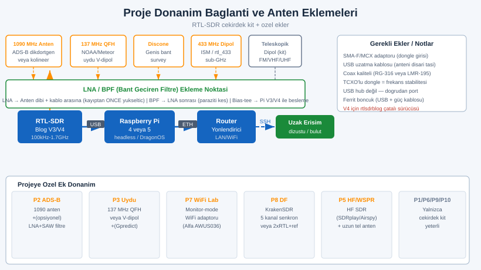
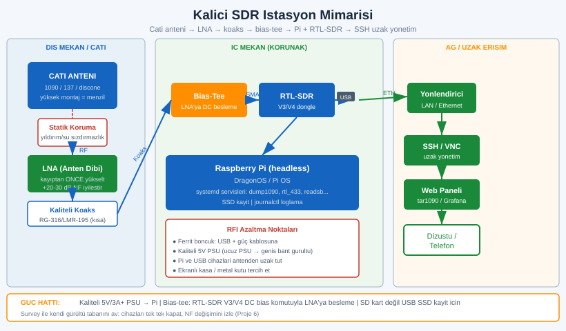
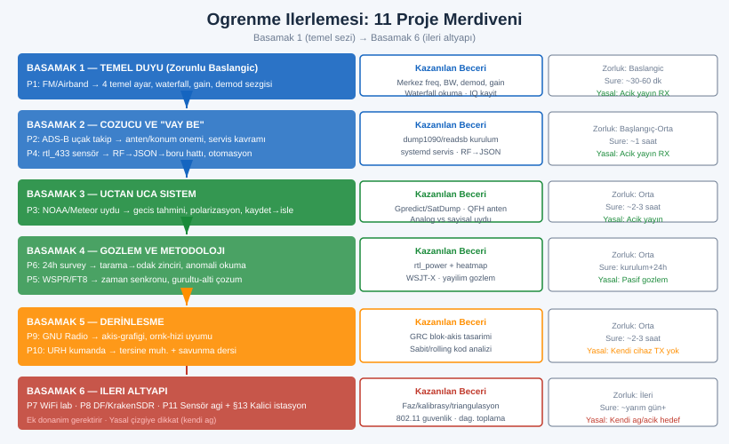

# SIGINT EL KİTABI — BÖLÜM 26: PRATİK PROJE REHBERLERİ

## Uçtan Uca, Yasal Laboratuvar — Tek Sinyalden Kalıcı İstasyona

> Amaç: Önceki bölümler RF fiziğini, SDR donanımını, anteni, demodülasyonu, protokol çözümlemeyi, yön bulmayı ve araç ekosistemini kavramsal ve fiili olarak verdi. Bu bölüm bambaşka bir şey yapar: o bilgiyi *bir araya getiren* tam projeler kurar. Burada hiçbir konu yalıtık değildir; her proje anten + donanım + yazılım + çözücü + yorum zincirinin tamamını tek bir somut çıktıda birleştirir. Bu, "balık ver" değil "balık tutmayı öğret" bölümüdür: bittiğinde elinde çalışan istasyonlar, üzerinde düşündüğün gerçek veri ve bir sonraki projeyi kendi başına kurabilecek bir kafa olur.

> Yasal çerçeve: Bu bölümdeki *her* proje bilinçli olarak yasal/açık yayınlar (ADS-B, NOAA/Meteor hava uyduları, WSPR/FT8 amatör, açık spektrum gözlemi) veya **kendi cihazların** (kendi WiFi yönlendiricin, kendi garaj/oyuncak kumandan, kendi IoT sensörlerin, kendi test vericin) üzerine kuruludur. Hiçbir proje başkasının haberleşmesini çözmeyi, içerik kaydını veya herhangi bir yetkisiz yayını (TX) içermez. Yön bulma ve WiFi projeleri özellikle "yalnızca kendi sinyalin/kendi ağın" çizgisindedir. Alıcı (RX) tarafı geniştir; ama yakaladığın içeriğin kaydı, çözümü veya paylaşımı ülkene göre suç olabilir. "Teknik olarak çalıştırabiliyor olmak" yasal olduğu anlamına gelmez; kendi ülkenin mevzuatını teyit et. Bu kitap hukuki danışmanlık değildir.

---

## İÇİNDEKİLER

1. [Bu Bölümü Nasıl Kullanmalı: Proje Anatomisi ve Ortak Donanım](#1)
2. [Proje 1 — İlk Sinyal: RTL-SDR + GQRX ile FM ve Airband](#2)
3. [Proje 2 — ADS-B Uçak Takip İstasyonu (dump1090/readsb)](#3)
4. [Proje 3 — NOAA/Meteor Hava Durumu Uydu İstasyonu (SatDump)](#4)
5. [Proje 4 — rtl_433 Ev Sensör Monitörü ve Home Assistant](#5)
6. [Proje 5 — WSPR/FT8 Alıcı İstasyonu: Yayılım Gözlemi](#6)
7. [Proje 6 — Spektrum Gözlem İstasyonu: 24 Saat Bant Survey](#7)
8. [Proje 7 — Kendi WiFi Güvenlik Laboratuvarın](#8)
9. [Proje 8 — Pasif Yön Bulma Denemesi (KrakenSDR / Çift-RTL)](#9)
10. [Proje 9 — GNU Radio ile Kendi Alıcı Akışını Yaz](#10)
11. [Proje 10 — Kendi Uzaktan Kumanda Analizin (URH)](#11)
12. [Proje 11 — Mini Sensör Ağı: Çok Düğümlü Toplama](#12)
13. [Kalıcı İstasyon Kurulumu: Raspberry Pi, Anten, Güç, RFI](#13)
14. [Öğrenme Progresyonu: Hangi Proje Hangi Sırayla](#14)
15. [Proje Özet Matrisi ve Diğer Bölümler](#15)

---

<a id="1"></a>
## 1. Bu Bölümü Nasıl Kullanmalı: Proje Anatomisi ve Ortak Donanım

Bir projeyi "yaptım" demek ile onu *anlamak* arasında fark vardır. Bu yüzden buradaki her proje aynı sekiz başlıkla yazılır ve seni bilinçli olarak hem yapmaya hem düşünmeye zorlar:

```
   PROJE ANATOMİSİ (her projede aynı sekiz başlık)
   ───────────────────────────────────────────────
   1) Amaç              → ne öğreneceksin, hangi soruyu cevaplayacaksın
   2) Gerekli donanım   → tam liste; neyin neden gerektiği
   3) Adım adım yapılış → numaralı, gerçek komutlu yönergeler
   4) Beklenen sonuç    → "doğru yaptıysan şunu görürsün"
   5) Sorun giderme     → tipik üç-beş duvar ve kökü
   6) Öğrenilen kavram  → projenin altındaki fikir (asıl ders)
   7) İleri varyasyon   → bir sonraki adım, derinleşme
   8) Maliyet/zorluk/süre/yasal → planlama ve sınır
```

Bu yapı kasıtlıdır: "Beklenen sonuç" sana hedefi verir, "Sorun giderme" seni saatlerce yanlış yerde aratmaktan kurtarır, "Öğrenilen kavram" ise projeyi reçeteden mühendislik sezgisine çevirir. Bir projeyi tamamladığında "ne gördüm" değil "neden öyle gördüm" sorusuna cevap verebiliyor olmalısın.

### Zorluk ve süre ölçeği

Her projede üç eksen üzerinden bir tahmin veriyoruz. Bunlar mutlak değil, sıralayıcıdır:

| Zorluk | Anlamı | Tipik ön koşul |
|---|---|---|
| Başlangıç | Tek cihaz, tek komut zinciri, hata payı yüksek | Sıfır SDR deneyimi |
| Orta | Birkaç araç + anten/konum + parametre ayarı | Bir-iki başlangıç projesi bitmiş |
| İleri | Çoklu cihaz/düğüm, kalibrasyon, kalıcı kurulum | Orta projeler oturmuş |

Süre tahminleri "ilk başarılı çıktıya kadar" geçen *aktif* süredir; öğrenme/okuma ayrı. Maliyetler kaba aralıktır ve donanımın ikinci-el/yeni oluşuna, bölgene göre değişir — kesin fiyat için güncel piyasayı teyit et.

### Ortak donanım çekirdeği

Projelerin büyük kısmı tek bir minimal çekirdek üzerine kurulur. Bunu bir kez edinirsen Proje 1-6 ve 9-10'u doğrudan yapabilirsin:

```
   ÇEKİRDEK KİT (Proje 1-6, 9-10 için yeterli)
   ────────────────────────────────────────────
   - RTL-SDR Blog V3 veya V4 dongle (TCXO'lu — saat kararlı)         [zorunlu]
   - Anten seti (dongle ile gelen teleskopik dipol + taban)          [zorunlu]
   - USB uzatma kablosu (donglu pencereye/çatıya taşımak için)       [çok önerilir]
   - Bir bilgisayar: dizüstü (Linux/DragonOS) VEYA Raspberry Pi 4/5  [zorunlu]
   - SMA → uygun konnektör adaptörleri (antene göre)                 [duruma göre]

   PROJEYE ÖZEL EKLER (ilgili projede listelenir)
   ────────────────────────────────────────────
   - ADS-B: 1090 MHz anten + (opsiyonel) LNA/SAW filtre              [Proje 2]
   - Uydu: 137 MHz V-dipol veya QFH anten                            [Proje 3]
   - WiFi lab: monitor-mode destekli WiFi adaptör + ayrı test cihazı [Proje 7]
   - DF: KrakenSDR (5 kanal) VEYA 2× senkron RTL + faz ref.          [Proje 8]
```



> Donanım seçim derinliği Bölüm 2'dedir (RTL-SDR V3 vs V4, TCXO neden önemli, HackRF/Airspy/KrakenSDR farkları). Anten seçimi, empedans, LNA, filtre Bölüm 3'tedir. Yazılım/OS/sürücü kurulumu (DragonOS, Zadig, blacklist, udev) Bölüm 4'tedir. Bu bölüm o üç katmanın "kurulu ve çalışır" olduğunu varsayar; takılırsan ilgili bölüme dön.

### Komut blokları hakkında bir uyarı

Aşağıdaki komutlar gerçek ve çalışır niteliktedir, ama frekanslar, band adları, uydu/istasyon kimlikleri ve uygulama sürümleri zamanla ve bölgeye göre değişir. "Teyit edilmeli" notu gördüğün her yerde değeri kendi bölgen/güncel kaynak için doğrula. Özellikle: hava uydularının aktif olup olmadığı, amatör band frekansları, bölgesel ISM bandı (433 mi 868 mi 915 mi), ve APRS frekansı (bölgeye göre) mutlaka teyit gerektirir.

---

<a id="2"></a>
## 2. Proje 1 — İlk Sinyal: RTL-SDR + GQRX ile FM ve Airband

### Amaç

İlk hedefin teknik bir başarı değil, bir *eşik geçmek*: SDR'ı ilk kez çalıştırıp gerçek bir sinyali ekranda görmek ve duymak. Bu proje seni "dongle takılı ama ekranda bir şey yok" duvarından geçirir; waterfall okumayı, kazanç ayarlamayı ve demodülatör seçmeyi öğretir. Bittiğinde, sonraki tüm projelerin altında yatan dört temel ayara (merkez frekans, bant genişliği, demod, gain) sezgisel olarak hâkim olursun.

### Gerekli donanım

```
   - RTL-SDR Blog V3/V4 dongle                      [zorunlu]
   - Dongle ile gelen teleskopik dipol anten        [zorunlu]
   - USB uzatma kablosu (anteni pencereye taşı)     [önerilir]
   - GQRX kurulu bir bilgisayar (DragonOS hazır)    [zorunlu]
```

FM yayını her yerde güçlüdür; özel anten gerekmez, basit dipol fazlasıyla yeter. Airband (havacılık AM, ~118-137 MHz) için anteni dikey kullan ve mümkünse pencereye/açık alana yaklaştır.

### Adım adım yapılış

```
1) Donanımı doğrula (her projenin ilk adımı budur):
      SoapySDRUtil --find        # dongle listeleniyor mu?
      rtl_test -s 2400000        # örnek düşmesi var mı? "lost ... bytes" çok ise USB sorunu
   Cihaz görünmüyorsa sorun yazılım/sürücüdür (Bölüm 4), donanım en son ihtimal.

2) GQRX'i aç → "Configure I/O devices":
      - Device:     SoapySDR üzerinden RTL-SDR'ı seç (veya 'rtl=0' string'i)
      - Input rate: 2400000  (2.4 MS/s — RTL-SDR için güvenli)

3) İlk hedef: güçlü bir yerel FM istasyonu.
      - Merkez frekans:  100.500 MHz  (bölgendeki güçlü bir FM kanalı; teyit et)
      - Mode (demod):    WFM (geniş bant FM — yayın radyosu)
      - "Play" (Play) bas.

4) Waterfall'ı oku:
      - Yatay eksen = frekans, dikey eksen = zaman (aşağı akar).
      - FM kanalı ~200 kHz geniş, parlak bir dikey şerit olarak görünür.
      - Şeridin tam ortasına tıkla → ses gelir.

5) Kazancı ayarla (kritik beceri):
      - Gain'i düşükten başlat, yavaşça artır.
      - Çok düşük: sinyal gürültüye gömülü, ses cılız.
      - Çok yüksek: spektrum "yanar", her yerde hayalet tepeler (intermod).
      - Doğru gain: ilgi sinyali net, gürültü tabanı temiz.

6) Airband'e geç (AM demodülasyonu öğren):
      - Merkez frekans: yerel havaalanı kule frekansı (~118-137 MHz; teyit et)
      - Mode: AM        (havacılık AM kullanır — FM DEĞİL!)
      - Squelch'i biraz aç ki sürekli gürültü değil yalnızca konuşma duyulsun.
      - Trafik aralıklıdır; sabırla bekle.

7) İlk IQ kaydını al (sonraki projelerin temeli):
      - GQRX'te "Rec baseband" → ham IQ dosyaya yazılır.
      - Bu dosyayı sonra başka araçla tekrar tekrar işleyebilirsin.
```

### Beklenen sonuç

FM'de: net, anlaşılır müzik/konuşma ve waterfall'da merkez frekansta belirgin parlak şerit. Airband'de: aralıklı, "kısa ve resmî" pilot-kule konuşmaları (AM'in tipik karıncalı tınısıyla). Eğer FM net geliyorsa donanım-anten-yazılım zincirinin tamamı çalışıyor demektir; bu projenin asıl onayı budur.

### Sorun giderme

```
   BELİRTİ                          OLASI KÖK                         ÇÖZÜM
   ──────────────────────────────  ───────────────────────────────  ─────────────────────────
   Ses yok ama waterfall akıyor     Squelch çok yüksek               Squelch'i kıs
   Ses yok, mod yanlış              FM yayını AM'de dinleniyor        Mode = WFM yap
   Hiç sinyal yok                   Yanlış frekans / zayıf anten     Bilinen güçlü FM'e git
   Her yer tepe dolu                Gain çok yüksek (doyma)          Gain'i düşür
   Cihaz açılmıyor                  Başka uygulama dongle'ı tutmuş   Diğer SDR pencerelerini kapat
   Ses kesik kesik                  Örnek düşmesi (USB/güç)          USB hub'sız port, kaliteli kablo
```

> Airband'de hiç trafik duymamak normaldir; havaalanı sakinse veya frekans yanlışsa sessizlik olur. Önce FM ile zincirin çalıştığını doğrula, sonra airband'e geç — böylece "ses yok" sorununun anten mi yoksa sadece trafik yokluğu mu olduğunu ayırt edebilirsin.

### Öğrenilen kavram

Bu projenin asıl dersi dört temel ayarın (Bölüm 12'deki "ortak zihinsel model") fiilen ne yaptığıdır: merkez frekans nereye baktığın, bant genişliği ne kadar geniş gördüğün, demodülatör sinyali nasıl çözdüğün, gain ne kadar yükselttiğin. Bir de waterfall okuma sezgisi: sürekli şerit (yayın) ile aralıklı burst (konuşma/sensör) arasındaki görsel fark, sonraki tüm projelerde sinyal sınıflandırmanın temelidir (Bölüm 7).

### İleri varyasyon

- Aynı dongleyle DAB (sayısal radyo), denizcilik VHF (dinleme, ~156-162 MHz), NOAA hava radyosu (bölgesel) gibi farklı modları dene.
- FM yayınının içindeki RDS verisini (istasyon adı, şarkı bilgisi) çözen bir eklenti/araç ekle — bu, "ses içinde gizli veri" kavramına ilk adımdır.
- GQRX yerine SDR++ ve SDRangel'i de aç; aynı istasyonu üç arayüzde dinleyip hangisinin sana oturduğunu gör (Bölüm 12, alıcı karşılaştırması).

### Maliyet / zorluk / süre / yasal

| Eksen | Değer |
|---|---|
| Maliyet | Yalnızca çekirdek kit (dongle + anten); ek maliyet yok |
| Zorluk | Başlangıç |
| Süre | İlk sinyale ~30-60 dk (kurulum dahil) |
| Yasal | RX serbest; FM/airband açık yayın. İçerik kaydı/paylaşımı için bölgeni teyit et |

---

<a id="3"></a>
## 3. Proje 2 — ADS-B Uçak Takip İstasyonu (dump1090/readsb)

### Amaç

İlk "vay be" projesi: uçakların 1090 MHz'te kendi yayınladığı konum, irtifa, hız ve kuyruk numarasını çözüp gerçek zamanlı bir haritada görmek. Bu proje sana üç şey öğretir: yüksek frekansta (1090 MHz) anten ve konumun ne kadar belirleyici olduğu, bir SDR aracının kendi web ön yüzüyle nasıl bir "servis" haline geldiği, ve isteğe bağlı olarak bir küresel besleme ağına nasıl katkı verebileceğin.

### Gerekli donanım

```
   - RTL-SDR dongle (çekirdek kit)                              [zorunlu]
   - 1090 MHz için ayarlı anten:
       * Basit: dongle dipolünü ~6.9 cm bacak boyuna ayarla     [başlangıç]
       * İyi:   adanmış 1090 MHz kolinear/anten + LNA           [önerilir]
   - (Opsiyonel) 1090 MHz SAW band-geçiren filtre + LNA         [zayıf alanda fark yaratır]
   - Görüş hattı olan bir konum: pencere kenarı / çatı           [kritik]
   - Raspberry Pi (kalıcı istasyon için ideal) veya dizüstü     [zorunlu]
```

1090 MHz çok yüksek frekanstır; görüş hattı (line of sight) ister. Anteni ne kadar yükseğe ve açığa koyarsan o kadar çok uçak görürsün — bu projede *konum*, yazılımdan daha belirleyicidir.

### Adım adım yapılış

```
1) Donanımı doğrula:
      SoapySDRUtil --find
      rtl_test

2) dump1090 (FlightAware çatalı yaygın) ile canlı uçak tablosu:
      dump1090-fa --interactive
   Terminalde uçak listesi (hex ID, çağrı, irtifa, hız) belirir.

3) Web haritası + ağ portlarını aç:
      dump1090-fa --net
      # SBS/BaseStation: 30003, Beast: 30005 portları açılır.
   Tarayıcıda:  http://localhost:8080   (web bileşeni kuruluysa)
   → Uçaklar gerçek zamanlı haritada konumlarıyla görünür.

4) (Alternatif modern çözücü) readsb:
      # readsb benzer mantıkla --net ile besleme/harita portları açar.
      # Kalıcı istasyonlarda readsb + tar1090 web arayüzü yaygın bir kombinasyondur.

5) Ham mesaj akışını başka araca besle (boru-hattı kavramı):
      nc localhost 30003       # SBS (CSV) akışını oku; loglama/işleme için

6) Anteni iyileştir ve farkı ölç:
      - Önce dipolle uçak sayısını/menzili not et.
      - Anteni pencere kenarına/çatıya taşı, tekrar ölç.
      - LNA/filtre ekleyince (varsa) menzildeki değişimi karşılaştır.
```

### İsteğe bağlı: besleme ağına katılım

ADS-B verini bir küresel toplama ağına besleyerek kapsama haritasına katkı verebilir, karşılığında genelde premium istatistik/erişim alırsın. Bu tamamen gönüllü ve yasaldır (açık yayını yeniden ilet):

```
   - FlightAware (PiAware): kendi feeder yazılımını kurarsın, istasyonun haritaya eklenir.
   - ADS-B Exchange: filtrelenmemiş veriyi toplayan, açık-veri odaklı topluluk ağı.
   - Her ikisi de RTL-SDR + Pi ile "kur ve unut" bir feeder paketi sunar (kurulum
     talimatları ilgili projenin kendi sayfasında; sürümler teyit edilmeli).
```

> Not: Besleme tamamen senin tercihindir; istasyonu yalnızca kendin için de çalıştırabilirsin. Beslersen yaydığın şey zaten açık olan ADS-B verisidir; içerik gizliliği sorunu yoktur.

### Beklenen sonuç

Web haritasında, istasyonunun çevresinde gerçek zamanlı hareket eden uçaklar; her birinin yüksekliği, hızı, rotası. İyi bir çatı anteniyle 200-400 km menzil olağandır (coğrafya/engel bağımlı). Bir uçağa tıklayınca kuyruk numarası ve uçuş bilgisini görürsün.

### Sorun giderme

```
   BELİRTİ                         OLASI KÖK                          ÇÖZÜM
   ─────────────────────────────  ─────────────────────────────────  ──────────────────────────
   Çok az / hiç uçak               Anten/konum kötü (görüş yok)       Anteni yükselt, açığa al
   Yakın uçak var, uzak yok        Anten kazancı/menzil düşük         Adanmış 1090 anten + LNA
   Bazen kayboluyor                Doyma veya güçlü yakın verici      LNA'dan önce SAW filtre
   Web haritası açılmıyor          Web bileşeni kurulmamış            tar1090/dump1090 web paketi
   Hiç mesaj yok                   Yanlış kazanç / cihaz başkasında   Gain ayarla, diğer SDR'ı kapat
```

> 1090 MHz'te "az uçak" sorununun cevabı neredeyse her zaman anten/konumdur, yazılım değil. Önce anteni pencereden çatıya taşımayı dene; tek bir taşıma menzili katlayabilir (Bölüm 3, anten yüksekliği ve görüş hattı).

### Öğrenilen kavram

Üç ders: (1) Frekans yükseldikçe görüş hattının ve anten konumunun belirleyiciliği artar — 1090 MHz bunun çıplak kanıtıdır. (2) Bir SDR aracı, kendi web sunucusu + ağ portlarıyla bir "servis" haline gelir; ham mesaj (port 30003/30005) ile insan arayüzü (harita) iki ayrı katmandır. (3) Açık yayını toplayıp bir ağa katkı vermek (crowdsourced sensing) kavramı — Proje 11'in (mini sensör ağı) habercisi. ADS-B protokolünün kendisi Bölüm 5'tedir.

### İleri varyasyon

- 978 MHz UAT (dump978) ekle — bölgeye özgü ADS-B alt sistemi; bölgende kullanılıyorsa ikinci bir dongle ile aynı anda çöz.
- MLAT (multilateration): birden çok istasyonun zaman farkıyla, konum yayınlamayan uçakların yerini kestirme kavramı — Proje 8 (DF/TDOA) ile doğrudan akraba.
- Kendi uçuş geçmişi veritabanını kur: port 30003 akışını bir dosyaya/veritabanına yazıp gün içi trafik desenini analiz et (Proje 6 ile birleştir).

### Maliyet / zorluk / süre / yasal

| Eksen | Değer |
|---|---|
| Maliyet | Çekirdek kit; adanmış 1090 anten + LNA orta ek maliyet (opsiyonel) |
| Zorluk | Başlangıç-Orta (kurulum kolay, anten optimizasyonu orta) |
| Süre | İlk uçaklara ~1 saat; anten optimizasyonu günlerce sürebilir |
| Yasal | Açık yayın; besleme gönüllü ve serbest. Bölgeni teyit et |

---

<a id="4"></a>
## 4. Proje 3 — NOAA/Meteor Hava Durumu Uydu İstasyonu (SatDump)

### Amaç

SDR'ın en tatmin edici yasal projesi: uzaydan, alçak yörüngeli bir hava uydusundan doğrudan kendi anteninle bir Dünya görüntüsü almak. Bu proje, uydu geçiş tahminini, doğru anten (polarizasyon!) seçimini, geçiş sırasında IQ kaydını ve kayıttan görüntü işlemeyi uçtan uca öğretir. Bittiğinde elinde, *senin anteninin* yakaladığı gerçek bir bulut/kıta görüntüsü olur.

### Gerekli donanım

```
   - RTL-SDR dongle (çekirdek kit)                              [zorunlu]
   - ~137 MHz için uygun anten (POLARİZASYON kritik):
       * V-dipol (137 MHz'e ayarlı, ~120° açıyla)               [başlangıç-iyi]
       * QFH (quadrifilar helix — dairesel polarize)            [en iyi]
       * Turnike (turnstile) anten                              [iyi]
   - Anteni açık göğe gören bir yer (balkon/çatı/bahçe)         [kritik]
   - (Opsiyonel) 137 MHz LNA — zayıf geçişlerde yardımcı        [duruma göre]
   - SatDump + (geçiş tahmini için) Gpredict kurulu bilgisayar  [zorunlu]
```

> Neden polarizasyon? Uydu sinyali dairesel polarizedir; düz bir dipol bunun yarısını kaçırır ve geçiş boyunca derin sönümlenmeler (fading) yaşarsın. QFH/turnike dairesel alır ve gökyüzünü daha eşit görür. V-dipol ucuz ve şaşırtıcı derecede iyi bir başlangıçtır (Bölüm 3, anten polarizasyonu).

### Adım adım yapılış

```
ADIM 1 — Geçiş zamanını bul (Gpredict ile):
   1) Gpredict'i aç, konumunu (enlem/boylam) gir.
   2) NOAA-15/18/19 (aktiflik teyit edilmeli) TLE'lerini güncelle (internetten).
   3) Yaklaşan geçişleri listele; YÜKSELİŞ AÇISI YÜKSEK (40°+) geçiş seç.
      Düşük açılı (ufka yakın) geçişler zayıf ve parazitlidir.
   4) Geçişin başlangıç/bitiş saatini ve maksimum yükseliş anını not et.

ADIM 2 — Geçiş sırasında ham IQ kaydet (Kip 2: kayıttan işleme):
      rtl_sdr -f 137100000 -s 250000 -g 45 -p <ppm> noaa_pass.iq
      #  -f  : ilgili NOAA uydusunun APT frekansı (137.1 / 137.9125 / 137.62 vb.; teyit et)
      #  -s  : 250 kS/s — APT için fazlasıyla yeterli
      #  -g  : başlangıç kazancı ~45; doyma görürsen düşür
      #  -p  : ölçtüğün ppm (TCXO'lu dongle'da ~0 olabilir)
   Geçiş süresince (yaklaşık 10-15 dk) kaydı çalıştır, sonra Ctrl+C.

ADIM 3 — SatDump ile kayıttan işle:
   1) SatDump GUI → "Offline processing".
   2) Input: noaa_pass.iq ; sample format ve sample rate'i KAYITLA AYNI gir.
   3) Pipeline: "NOAA APT" seç.
   4) Start → SatDump demodüle eder, senkronlar, görüntüyü kurar.

ADIM 4 — Çıktıyı incele:
   - Ham APT: iki kanal yan yana (görünür ışık + kızılötesi).
   - SatDump ek işlemler sunar: yağmur/sıcaklık paletleri, coğrafi referanslama (haritaya bindirme).
```

### Meteor LRPT (sayısal, daha keskin) varyasyonu

```
   Akış aynı: yüksek açılı geçişte ~137 MHz civarı IQ kaydet
   → SatDump'ta "Meteor LRPT" pipeline seç (Meteor-M serisi; aktiflik teyit edilmeli).
   SatDump senkronizasyonu ve hata düzeltmeyi (Viterbi/Reed-Solomon) kendi yapar.
   Sonuç: APT'den daha keskin, renkli görüntü.
   TUZAK: LRPT sayısaldır → "ya tutar ya tutmaz" eşiği keskin. Sinyal yetersizse
          görüntü HİÇ çıkmaz (analog APT zayıfta "karlı" da olsa bir şey verir).
          Bu, sayısal vs analog farkının (Bölüm 1) görsel kanıtıdır.
```

### Beklenen sonuç

NOAA APT'de: tanınır bir Dünya yüzeyi — kıta hatları, bulut sistemleri, iki kanal (görünür + IR). İlk denemende basit dipolle gürültülü/çizgili çıkması normaldir. Meteor LRPT'de: yeterince güçlü geçişte keskin, renkli görüntü; zayıf geçişte hiçbir şey. Asıl onay: görüntüde *tanıdığın* bir coğrafyayı (kendi bölgenin kıta/deniz hattını) görebilmen.

### Sorun giderme

```
   BELİRTİ                          OLASI KÖK                          ÇÖZÜM
   ──────────────────────────────  ─────────────────────────────────  ──────────────────────────
   Görüntü çok gürültülü/çizgili    Düz dipol + dairesel sinyal        QFH/turnike anten kullan
   Görüntünün ortası iyi, kenar kötü Düşük yükseliş açısı (ufuk)        40°+ geçiş seç
   Hiç senkron olmuyor (APT)        Yanlış frekans / büyük ppm         Frekansı ve -p ppm'i düzelt
   Meteor'da hiç görüntü            Sayısal eşik altı sinyal           LNA ekle, daha yüksek geçiş bekle
   Görüntü eğri/kayık               Doppler/zaman senkron sorunu       SatDump'ın doppler düzeltmesini aç
   IQ dosyası işlenmiyor            SatDump'ta yanlış rate/format      Rate/format'ı kayıtla birebir eşle
```

> En sık iki ders burada gizli: (1) anten polarizasyonu APT kalitesini neredeyse tek başına belirler; (2) Kip 2'nin (kayıttan işleme) gücü — bir geçişi kaydedince aynı kaydı farklı parametrelerle defalarca deneyebilirsin, oysa canlı işlemede geçiş biter ve görüntü kaçar (Bölüm 12, SatDump iki kipi).

### Öğrenilen kavram

Bu proje dört kavramı birleştirir: (1) yörünge mekaniği ve geçiş tahmini (Gpredict, TLE, yükseliş açısı), (2) polarizasyon — neden dairesel anten düz dipolü yener, (3) "kaydet → kayıttan işle" deseninin geçiş-kaçırmaz üstünlüğü, (4) analog (APT) vs sayısal (LRPT) sinyalin bozulma altında farklı davranışı. Uydu prensibi Bölüm 5/11'de, anten Bölüm 3'tedir.

### İleri varyasyon

- GOES HRIT (jeostatik, ~1.69 GHz L-band): yönlü anten/dish + L-band LNA ister; anteni bir kez azimut/elevasyona kilitlersin, geçiş beklemek yok. Sürekli full-disk Dünya görüntüsü. Önerilen sıra: NOAA APT → Meteor LRPT → GOES HRIT (Bölüm 11/12).
- Otomatik istasyon: Gpredict + rotator/sabit anten + zamanlanmış kayıt + otomatik SatDump işleme ile "uyurken görüntü toplayan" bir Pi istasyonu kur (Bölüm 13 ile birleştir).
- Aynı geçişi V-dipol ve QFH ile arka arkaya kaydedip görüntüleri yan yana koy — polarizasyon farkını gözünle kanıtla.

### Maliyet / zorluk / süre / yasal

| Eksen | Değer |
|---|---|
| Maliyet | Çekirdek kit + anten (V-dipol ucuz; QFH orta). GOES varyasyonu ileri maliyet |
| Zorluk | Orta (geçiş tahmini + anten + işleme zinciri) |
| Süre | İlk görüntüye ~bir geçiş penceresi + işleme (~2-3 saat toplam ilk deneme) |
| Yasal | Açık, şifresiz yayın — tamamen serbest |

---

<a id="5"></a>
## 5. Proje 4 — rtl_433 Ev Sensör Monitörü ve Home Assistant

### Amaç

Kendi evindeki kablosuz sensörleri (hava istasyonu, sıcaklık/nem probu, kapı/pencere sensörü, bazı uzaktan kumandalar) tek bir akışta okuyup yapısal veriye (JSON) çevirmek ve isteğe bağlı olarak bir ev otomasyonu sistemine (Home Assistant) beslemek. Bu proje, "ham RF → JSON → veri boru hattı" zincirini öğretir; SDR'ı bir dinleme aracından bir veri kaynağına dönüştürür. Sınır net: yalnızca kendi cihazlarını okursun.

### Gerekli donanım

```
   - RTL-SDR dongle (çekirdek kit)                              [zorunlu]
   - 433/868/915 MHz için basit anten (dipol yeter)            [zorunlu]
   - Okumak istediğin KENDİ kablosuz sensörlerin               [zorunlu]
   - rtl_433 kurulu bilgisayar/Pi                              [zorunlu]
   - (Opsiyonel) MQTT broker (Mosquitto) + Home Assistant      [otomasyon için]
```

> Bölge uyarısı: ISM bandı bölgeye göre değişir — Avrupa tipik olarak 433.92 ve 868 MHz, Kuzey Amerika 433 ve 915 MHz kullanır. Sensörünün hangi frekansta yayın yaptığını teyit et (kutu/etiket/datasheet). Yanlış banda bakarsan hiçbir şey görmezsin.

### Adım adım yapılış

```
1) Donanımı doğrula:
      SoapySDRUtil --find ; rtl_test

2) Ham keşif: 433.92 MHz'i dinle, tanıdığı her cihazı konsola yaz:
      rtl_433
   Kendi sensörünü tetikle (örn dış prob, kapı sensörü) → satır belirir.
   Görünmüyorsa frekansı değiştir:
      rtl_433 -f 868M       # Avrupa 868 sensörleri
      rtl_433 -f 915M       # Kuzey Amerika 915

3) JSON çıktıya geç (boru hattının temeli):
      rtl_433 -F json

4) Zaman damgalı sürekli loglama (dosyaya akıt):
      rtl_433 -F json -M time:iso > sensorler.jsonl

5) Gürültüyü azalt — yalnızca beklediğin protokolleri aç:
      rtl_433 -R help              # protokol numaralarını listele
      rtl_433 -R 19 -F json        # sadece protokol 19'u çöz (örnek)

6) Tek bir alanı ayıkla (jq ile süzme deseni):
      rtl_433 -F json | jq 'select(.model=="...") | {time, temperature_C, humidity}'

7) (Opsiyonel) MQTT'ye bas → Home Assistant otomatik keşfetsin:
      rtl_433 -F "mqtt://BROKER_IP:1883,events=rtl_433/states"
      # Home Assistant tarafında MQTT entegrasyonu açıkken sensörler
      # otomatik "entity" olarak görünür (HA MQTT discovery; ayrıntı HA dokümanında).
```

### Beklenen sonuç

Konsolda/JSON'da kendi sensörlerinin canlı okumaları: model adı, sıcaklık, nem, batarya durumu, kapı açık/kapalı gibi alanlar. MQTT/HA kurduysan, bu değerler ev otomasyonu panelinde gerçek-zamanlı kartlar olarak belirir ve otomasyon kurallarına (örn "dış sıcaklık < 5°C ise bildir") girdi olur.

### Sorun giderme

```
   BELİRTİ                          OLASI KÖK                          ÇÖZÜM
   ──────────────────────────────  ─────────────────────────────────  ──────────────────────────
   Hiçbir şey görünmüyor            Yanlış band (433/868/915)          Sensörün bandını teyit/değiştir
   Ara sıra kaçırıyor               Sensör periyodik yayınlar          Bekle; çoğu sensör dakikada bir
   Dar sinyali atlıyor              PPM kayması                        rtl_433 -p <ppm> ekle
   Çok fazla "yabancı" cihaz        Komşu/yakın çevre sensörleri       -R ile sadece kendi protokolün
   Seviye düşük                     Zayıf anten/uzaklık                rtl_433 -F json -M level ile ölç
   MQTT'de görünmüyor               Broker IP/topic/HA discovery       Broker erişimi + HA MQTT ayarı
```

> "Hiçbir şey görünmüyor"un bir numaralı sebebi yanlış banttır; ikincisi sabırsızlık (sensör henüz yayın yapmadı). `-M level` ile sinyal seviyesini görmek, "anten mi zayıf yoksa cihaz mı susuyor" ayrımını netleştirir.

### Öğrenilen kavram

Bu projenin dersi, SDR çıktısını bir *veri boru hattına* dönüştürmektir: ham RF → çözücü (rtl_433) → yapısal JSON → süzgeç (jq) → taşıma (MQTT) → tüketici (Home Assistant/veritabanı). Bu "doğrudan-çözücü → JSON → boru" deseni (Bölüm 12, rtl_433) sonraki tüm otomasyon projelerinin (Proje 6, Proje 11) iskeletidir. ISM protokollerinin yapısı Bölüm 5 ve 16'dadır.

### İleri varyasyon

- Çözülen verileri bir zaman-serisi veritabanına (örn InfluxDB) yazıp Grafana ile uzun-dönem grafik çıkar: evinin sıcaklık/nem geçmişi.
- TPMS (lastik basıncı sensörü) okuma: kendi aracının lastiklerini hareket ettirince yayınladıkları basınç/sıcaklık verisini gör (kendi aracın — yasal).
- Birden çok dongleyle 433 ve 868'i aynı anda izleyip tek bir birleşik akış oluştur (Proje 11'e köprü).

### Maliyet / zorluk / süre / yasal

| Eksen | Değer |
|---|---|
| Maliyet | Çekirdek kit; MQTT/HA yazılımı ücretsiz |
| Zorluk | Başlangıç (rtl_433 tek komut); HA entegrasyonu orta |
| Süre | İlk JSON'a ~30 dk; HA entegrasyonu +1-2 saat |
| Yasal | Yalnızca kendi cihazların. Komşu cihazlarını loglama/paylaşma — bölgeni teyit et |

---

<a id="6"></a>
## 6. Proje 5 — WSPR/FT8 Alıcı İstasyonu: Yayılım Gözlemi

### Amaç

Gürültünün *altındaki* sinyalleri çözen sayısal modlarla (WSPR, FT8) bir yayılım (propagation) gözlem istasyonu kurmak ve "şu an dünyanın hangi köşesini duyabiliyorum" sorusunu canlı bir haritada görmek. Bu proje, ileri hata düzeltme + dar bant + zaman senkronizasyonunun gücünü (kulağın hiçbir şey duymadığı seviyede istasyon çözmek) ve HF yayılımının gün/gece, güneş aktivitesiyle nasıl nefes aldığını öğretir. Tamamen alıcı (RX) — yayın yok, lisans gerekmez.

### Gerekli donanım

```
   - HF alabilen bir SDR:
       * RTL-SDR Blog V3/V4 + direct sampling (HF modu) VEYA upconverter   [ekonomik]
       * Airspy HF+ / diğer adanmış HF SDR                                  [çok daha iyi]
   - HF anteni:
       * Basit: uzun tel (long-wire) + topraklama/dengeleyici               [başlangıç]
       * İyi:   banda ayarlı dipol veya mıknatıs-loop                       [önerilir]
   - DOĞRU SAATLİ bilgisayar (NTP ile senkron — KRİTİK)                     [zorunlu]
   - WSJT-X (FT8/WSPR çözer) kurulu bilgisayar                              [zorunlu]
   - SDR sesini WSJT-X'e taşıyan sanal ses yolu (PulseAudio loopback/VB-Cable) [zorunlu]
```

> HF (kısa dalga) için RTL-SDR V3/V4'ün "direct sampling" modu çalışır ama gürültülüdür; ciddi yayılım gözlemi için Airspy HF+ gibi adanmış bir HF alıcı belirgin fark yaratır (Bölüm 2). Anten HF'te belirleyicidir; en basiti dengeli bir uzun teldir.

### Adım adım yapılış

```
1) Zamanı senkronla (FT8/WSPR için EN KRİTİK adım):
      # Bilgisayar saatin NTP ile ~1 saniyeden iyi senkron olmalı.
      # Linux'ta sistem NTP servisinin (chrony/systemd-timesyncd) çalıştığını doğrula.
      # Saat birkaç saniye kaymışsa FT8 HİÇBİR ŞEY çözmez.

2) SDR'ı bir FT8 bandına ayarla:
      # 20m bandı FT8 frekansı yaygın bir başlangıçtır (band/frekans teyit edilmeli).
      # SDR alıcısını (GQRX/SDR++) USB modunda o frekansa kur.

3) SDR sesini WSJT-X'e yönlendir (sanal ses yolu):
      # GQRX/SDR++ ses çıkışını → sanal kablo → WSJT-X ses girişine bağla.
      # Linux: PulseAudio/PipeWire loopback; Windows: VB-Cable.
      # Bu adım yeni başlayanı en çok uğraştıran kısımdır — sabırlı ol.

4) WSJT-X'i ayarla:
      - Mode: FT8
      - Band/frekans: SDR ile aynı band
      - Ses giriş aygıtı: sanal kablonun çıkış ucu (SDR'ın sesi)
      - İstasyon bilgisi: kendi grid kareni gir (harita/raporlama için)

5) Çözülenleri izle:
      - WSJT-X her 15 saniyede "Band Activity" panelinde çözülen istasyonları listeler:
        çağrı işareti, grid kare, SNR (genelde negatif dB — gürültü altı!).

6) WSPR varyasyonu (saf yayılım beacon'ı):
      - Mode: WSPR (WSJT-X içinde).
      - WSPR çok dar, çok yavaş, çok zayıf-sinyal bir beacon modudur; yayılım
        ölçümü için tasarlanmıştır.

7) (Opsiyonel) Çözümlerini bir yayılım haritası ağına raporla:
      - WSJT-X, çözdüğü spot'ları PSK Reporter gibi bir ağa otomatik gönderebilir.
      - Karşılığında: senin alıcının dünya üzerinde kimi duyduğunu gösteren canlı harita.
      - Bu SADECE RX raporlamasıdır (kimi duyduğun); TX değildir.
```

### Beklenen sonuç

WSJT-X "Band Activity" panelinde, çoğu negatif SNR'li (yani kulağın duyamayacağı seviyede) çözülmüş istasyonlar akar; her birinin çağrı işareti ve grid karesi. PSK Reporter'a raporlarsan, bir dünya haritasında senin istasyonunun bağlandığı noktalar belirir — gün/gece geçişiyle bu haritanın değiştiğini izleyebilirsin. Asıl onay: hiç ses duymadığın halde uzak istasyonların çözülmesi.

### Sorun giderme

```
   BELİRTİ                          OLASI KÖK                          ÇÖZÜM
   ──────────────────────────────  ─────────────────────────────────  ──────────────────────────
   Hiçbir şey çözmüyor              Saat senkronsuz (en sık!)          NTP'yi düzelt, <1 sn senkron
   WSJT-X ses görmüyor              Ses yolu bağlı değil               Sanal kablo giriş/çıkışını eşle
   Çok az çözüm                     Yanlış band/zayıf anten/yayılım   Band değiştir; akşam/gece dene
   Sinyaller var ama çözülmüyor     Yanlış mod (FT8 vs FT4 vs WSPR)    Modu doğru seç
   Spektrum kayık                   PPM / SDR frekans ofseti           SDR'da ppm düzelt
   HF'te aşırı gürültü              Direct sampling + ev RFI'ı         Anteni RFI'dan uzaklaştır (B.13)
```

> İki numaralı kural: çözüm yoksa önce *saate* bak. FT8 15 saniyelik pencerelerde çalışır ve birkaç saniyelik kayma onu tamamen sağır eder (Bölüm 12, WSJT-X zaman senkronu). İkinci en sık sorun ses yoludur — SDR'ın sesi gerçekten WSJT-X'in girişine ulaşıyor mu?

### Öğrenilen kavram

Üç ders: (1) İleri hata düzeltme + dar bant + senkronizasyon, sinyali gürültü tabanının *altında* çözülebilir kılar (Bölüm 1, Shannon sezgisi) — FT8'in -20 dB SNR'da çalışması bunun somut kanıtıdır. (2) Zamanlama bir RF parametresi kadar belirleyici olabilir (FT8 saate hassas). (3) HF yayılımı statik değildir; iyonosfer gün/gece ve güneş aktivitesiyle değişir, bu yüzden "kimi duyduğun" saatlik değişir. WSPR/FT8 protokol tarafı Bölüm 5'tedir.

### İleri varyasyon

- WSPR ile uzun-dönem yayılım günlüğü tut: hangi banttan, hangi saatte, nereyi duyduğunu günlerce kaydedip iyonosfer-saat ilişkisini kendi verinden çıkar.
- Birden çok bandı aynı anda izle (band-hopping veya çok-VFO) — günün hangi saatinde hangi bandın "açıldığını" gör.
- Aynı anteni bir gündüz ve bir gece çalıştırıp çözülen istasyon haritalarını karşılaştır — D-katmanı sönümlemesi ve gece açılan düşük bantları gözlemle.

### Maliyet / zorluk / süre / yasal

| Eksen | Değer |
|---|---|
| Maliyet | RTL-SDR + uzun tel ekonomik; Airspy HF+ orta-yüksek ek maliyet |
| Zorluk | Orta (ses yolu + zaman senkronu + HF anten) |
| Süre | İlk çözüme ~1-2 saat (ses yolu kurulumu çoğu zamanı yer) |
| Yasal | RX serbest. TX (FT8/WSPR yayını) amatör lisansı gerektirir — bu projede TX YOK |

---

<a id="7"></a>
## 7. Proje 6 — Spektrum Gözlem İstasyonu: 24 Saat Bant Survey

### Amaç

Bir frekans bandının zaman içinde nasıl "nefes aldığını" tek bir resimde görmek: 24 saat boyunca bir bandı tarayıp ısı haritası (heatmap) çıkarmak, hangi frekansın ne zaman aktif olduğunu okumak, periyodik (sensör) ile sürekli (yayın) sinyalleri ayırmak ve yeni/anormal bir yayıcı belirdiğinde fark etmek. Bu, bir SIGINT analistinin temel refleksidir: önce geniş tara, sonra ilgi çekene odaklan.

### Gerekli donanım

```
   - RTL-SDR dongle (çekirdek kit)                              [zorunlu]
   - Geniş bantlı bir anten (discone ideal; dipol de olur)     [önerilir]
   - rtl_power + bir heatmap betiği kurulu bilgisayar/Pi       [zorunlu]
   - (Opsiyonel) soapy_power / QSpectrumAnalyzer (donanım-bağımsız tarama) [alternatif]
   - Uzun süre çalışacak bir kurulum (tercihen kalıcı Pi)      [24h survey için]
```

> rtl_power "anlık" değil, *adım adım süpürerek* geniş bir bandı kapsar: bandı küçük dilimlere böler, her dilimde kısa süre kalır, gücü ölçer ve bir CSV satırına yazar. Bu yüzden anlık olayları kaçırabilir ama uzun-dönem aktivite desenini mükemmel yakalar.

### Adım adım yapılış

```
1) Donanımı doğrula:
      SoapySDRUtil --find ; rtl_test

2) Dar/yüksek-çözünürlük survey (örn ISM bandı yakından):
      rtl_power -f 433M:435M:1k -i 30 -e 24h ism.csv
      #  -f baş:son:bin  : 433-435 MHz arası, 1 kHz çözünürlük
      #  -i 30           : 30 saniyede bir örnek (zaman çözünürlüğü)
      #  -e 24h          : 24 saat çalış, sonra dur

3) Geniş/kaba survey (tüm RTL menzilini gör):
      rtl_power -f 24M:1700M:1M -i 10 -e 24h survey.csv
      #  Geniş kapsama, kaba çözünürlük — "nerede ne var" haritası

4) Isı haritası üret:
      python3 heatmap.py ism.csv ism.png
      # (heatmap.py rtl_power ile gelen/yaygın bir betik; CSV → PNG ısı haritası)

5) Resmi oku:
      - Yatay eksen: frekans. Dikey eksen: zaman (24 saat). Renk: güç.
      - Sürekli dikey şerit  → kalıcı yayın (örn FM, bir baz/röle).
      - Aralıklı noktalar    → periyodik yayıncı (örn sensör her N dakikada).
      - Yeni beliren şerit    → daha önce olmayan bir yayıcı (anomali).

6) Odaklan (survey → çözüm zinciri):
      - Haritada ilginç/bilinmeyen bir aktif frekans bul.
      - GQRX ile o frekansa git, sinyali dinle/çöz (Proje 1 + Bölüm 5).
      - ISM'de ise rtl_433'e ver (Proje 4); bilinmiyorsa URH'ye (Proje 10).
```

### Beklenen sonuç

`ism.png` veya `survey.png`'de, zaman-frekans düzleminde renkli aktivite desenleri: bilinen yayınlar net sürekli şeritler, sensörler aralıklı noktalar olarak. 24 saatlik survey'de gün/gece farkını (örn bazı bantların geceleri sakinleşmesi) gözle görebilirsin. Asıl onay: en az birkaç frekansta belirgin aktivite şeritlerini ayırt edip "bu sürekli, şu periyodik" diyebilmen.

### Sorun giderme

```
   BELİRTİ                          OLASI KÖK                          ÇÖZÜM
   ──────────────────────────────  ─────────────────────────────────  ──────────────────────────
   Heatmap boş/düz                  Yanlış band / kazanç düşük         Bilinen aktif banda bak, gain↑
   Her yer aynı renk (kırmızı)      Gain çok yüksek (doyma)            Gain'i düşür
   Çözünürlük çok kaba              bin çok büyük                      bin'i küçült (1k yerine 100)
   Tarama çok yavaş                 Çok geniş aralık + küçük bin       Aralığı daralt veya bin'i büyüt
   CSV var, PNG çıkmıyor            heatmap betiği eksik/yanlış        Doğru betik + python bağımlılığı
   Periyodik şey kaçıyor            -i adımı olaydan uzun              -i'yi küçült (daha sık örnek)
```

> Temel gerilim: geniş kapsama vs çözünürlük vs hız üçgeni. Tüm spektrumu ince çözünürlükle taramak istersen tarama yavaşlar ve kısa olayları kaçırırsın; dar bandı ince tararsan hızlı ve detaylı olur ama az yer görürsün. Önce geniş-kaba survey ile "nerede aktivite var" bul, sonra o bölgeyi dar-ince tara.

### Öğrenilen kavram

Bu proje SIGINT'in temel iş akışını öğretir: tarama = adım adım süpürme (anlık fotoğraf değil), heatmap'te aktivite örüntüsü okuma, ve "geniş survey → odak → çözüm" zincirinin ilk halkası (Bölüm 7, ayıklama-sınıflandırma; Bölüm 8, band planı — şeritleri "ne nereye ait" diye okuma). Anomali tespiti (yeni yayıcı) kavramı, daha ileri otomatik gözlem ve tehdit izlemenin (Bölüm 13/14) tohumudur.

### İleri varyasyon

- Otomatik günlük survey: cron ile her gece aynı bandı tarat, çıkan heatmap'leri arşivle, gün-gün karşılaştırarak "yeni beliren yayıcı" alarmı kur (Bölüm 13).
- Baz çizgisi (baseline) farkı: bir "normal gün" heatmap'ini referans al, sonraki günleri ondan çıkararak yalnızca *değişimi* görselleştir — anomali tespitinin özü budur.
- soapy_power'a geç ve aynı survey'i HackRF/Airspy gibi daha geniş bantlı cihazla yap (donanım-bağımsız tarama, Bölüm 12).

### Maliyet / zorluk / süre / yasal

| Eksen | Değer |
|---|---|
| Maliyet | Çekirdek kit; discone anten orta ek maliyet (opsiyonel) |
| Zorluk | Başlangıç-Orta (komut basit, yorumlama beceri ister) |
| Süre | Kurulum ~30 dk; survey 24 saat (pasif bekleme) |
| Yasal | Pasif gözlem — güç ölçümü, içerik yok. Serbest |

---

<a id="8"></a>
## 8. Proje 7 — Kendi WiFi Güvenlik Laboratuvarın

### Amaç

Tamamen *kendine ait* ve *izole* bir WiFi laboratuvarında, kendi yönlendiricine kendi test cihazınla bağlanırken kendi 4-yönlü el sıkışmanı (handshake) yakalamak, bunun üzerinden güçlü parolanın neden kaba-kuvvete dayandığını göstermek ve modern korumaları (WPA3, PMF) test etmek. Bu proje 802.11'in güvenlik anatomisini *savunmacı gözüyle* öğretir. Sınır mutlaktır: yalnızca senin sahip olduğun ağ, senin cihazların, kendi izinli ortamın.

> KRİTİK YASAL ÇİZGİ: Başkasının WiFi ağına yönelik herhangi bir yakalama, deauth, veya parola kırma girişimi — kullanmasan bile — birçok ülkede ağır suçtur. Bu proje YALNIZCA kendi yönlendiricin + kendi test cihazın + kendine ait ortam içindir. Buradaki amaç saldırı değil, kendi ağının ne kadar dayanıklı olduğunu ölçmek ve doğru savunmayı (güçlü parola, WPA3, PMF) kanıtlamaktır (Bölüm 15).

### Gerekli donanım

```
   - Monitor mode + paket enjeksiyon destekli WiFi adaptörü     [zorunlu]
       (yaygın chipset'ler için Bölüm 15'e bak; her adaptör monitor mode desteklemez)
   - KENDİ yönlendiricin (test için ayrı/yedek bir AP ideal)    [zorunlu]
   - Ayrı bir test istemci cihazı (eski telefon/dizüstü)        [zorunlu]
   - Linux laboratuvar (DragonOS / Kali türevi araç seti)       [zorunlu]
   - (İsteğe bağlı) güçlü GPU — hashcat demosu için             [parola gösterimi]
```

Not: Bu projede RTL-SDR kullanılmaz; WiFi 2.4/5 GHz'tir ve standart SDR menzili dışındadır. Burada araç bir WiFi adaptörünün monitor modudur (Bölüm 15).

### Adım adım yapılış

```
1) Test ortamını izole et:
      - Test için ayrı bir yönlendirici/SSID kur (mümkünse ana ağından bağımsız).
      - Yalnızca KENDİ test istemcini bu ağa bağla.
      - Bu, "yanlışlıkla başka cihazı etkileme" riskini sıfırlar.

2) WiFi adaptörünü monitor moduna al:
      sudo airmon-ng check kill          # çakışan servisleri durdur
      sudo airmon-ng start wlan0         # monitor arayüzü (örn wlan0mon) oluşur

3) Kendi AP'ni gözlemle:
      sudo airodump-ng wlan0mon          # çevredeki AP'leri listele
      # Kendi SSID'inin BSSID'ini ve kanalını not et.

4) Kendi handshake'ini yakalamaya hazırlan (yalnızca kendi AP'in kanalında):
      sudo airodump-ng -c <KANAL> --bssid <KENDİ_BSSID> -w kendi_hs wlan0mon

5) Kendi istemcini yeniden bağlat (handshake'i tetikle):
      - En temiz yol: kendi test cihazının WiFi'ını kapat-aç → yeniden bağlanırken
        4-yönlü handshake havadan geçer ve airodump yakalar.
      - (Alternatif, yalnızca kendi cihazına) kontrollü deauth ile yeniden bağlanmaya zorla.
      - airodump üst köşede "WPA handshake: <BSSID>" yazınca yakaladın demektir.

6) Güçlü parola dersini göster (hashcat):
      - Yakalanan handshake'i hashcat formatına dönüştür.
      - ZAYIF parola (örn sözlükte olan) → hashcat saniyeler/dakikalar içinde kırar.
      - GÜÇLÜ parola (uzun, rastgele) → pratikte kırılamaz (yıllar/imkânsız).
      - Asıl ders: yakalama kolaydır, KIRMAK parolanın gücüne bağlıdır.

7) Modern korumaları test et:
      - WPA3-SAE: el sıkışması (Dragonfly) çevrimdışı sözlük saldırısına dayanıklıdır.
      - PMF (Protected Management Frames, 802.11w): deauth çerçevelerini korur →
        klasik deauth ile handshake zorlama çalışmaz. Kendi AP'inde PMF'i aç ve
        adım 5'teki deauth'un artık işe yaramadığını gözle (Bölüm 15).
```

### Beklenen sonuç

Adım 4-5'te kendi handshake'ini yakaladığını gösteren "WPA handshake" bildirimi. Adım 6'da: zayıf parolayla kırma saniyeler sürerken, güçlü parolayla aynı saldırının pratikte sonuçsuz kalması — güçlü parolanın değerinin çıplak kanıtı. Adım 7'de: WPA3/PMF açıkken klasik deauth/handshake-zorlama saldırısının başarısız olması.

### Sorun giderme

```
   BELİRTİ                          OLASI KÖK                          ÇÖZÜM
   ──────────────────────────────  ─────────────────────────────────  ──────────────────────────
   Monitor mode açılmıyor           Adaptör desteklemiyor/sürücü       Uyumlu chipset (Bölüm 15)
   airodump AP görmüyor             Yanlış arayüz / servis çakışması   airmon-ng check kill, doğru iface
   Handshake yakalanmıyor           Yanlış kanal / istemci bağlanmadı  Doğru -c kanal; cihazı yeniden bağla
   Enjeksiyon çalışmıyor            Adaptör injection desteklemiyor    Test: aireplay-ng --test
   WPA3'te handshake "kırılmıyor"   Beklenen davranış (SAE dayanıklı)  Bu BAŞARIDIR — savunma çalışıyor
   PMF açıkken deauth etkisiz       Beklenen davranış (802.11w)        Bu BAŞARIDIR — koruma çalışıyor
```

> "Çalışmadı" sandığın bazı sonuçlar aslında *başarıdır*: WPA3/PMF'in saldırını boşa çıkarması, savunmanın çalıştığının kanıtıdır. Bu projenin amacı bir ağı kırmak değil, hangi yapılandırmanın dayanıklı olduğunu kendi gözünle görmektir.

### Öğrenilen kavram

802.11 güvenlik anatomisi: 4-yönlü handshake'in ne olduğu, neden yakalanabildiği ama parola güçlüyse neden kırılamadığı (kaba-kuvvetin matematiği), deauth çerçevelerinin korumasızlığı (eski WPA2) ve WPA3-SAE + PMF'in bunları nasıl kapattığı. Asıl savunma dersi: "yakalanmak" kaçınılmazdır, güvenlik *parolanın entropisinde* ve *protokol korumalarındadır* (Bölüm 15, uçtan uca).

### İleri varyasyon

- WPA2 vs WPA3 yan-yana: iki test AP'i kurup aynı saldırıyı ikisine de uygula; farkı somut ölç.
- PMF açık/kapalı karşılaştırması: tek bir AP'de PMF'i aç-kapa yaparak deauth'un etkisinin nasıl değiştiğini gözle.
- WPS zafiyeti kavramı: kendi AP'inde WPS varsa neden ek bir saldırı yüzeyi olduğunu (ve kapatman gerektiğini) incele (Bölüm 15).
- Kurumsal/savunma açısı: kendi ağın için bir "sağlamlaştırma kontrol listesi" çıkar (WPA3, PMF zorunlu, WPS kapalı, güçlü parola, yönetim arayüzü izole).

### Maliyet / zorluk / süre / yasal

| Eksen | Değer |
|---|---|
| Maliyet | Monitor-mode WiFi adaptörü düşük-orta; yedek AP ve eski cihaz çoğu evde mevcut |
| Zorluk | Orta-İleri (izolasyon disiplini + araç zinciri + doğru yorum) |
| Süre | İlk handshake'e ~1 saat; WPA3/PMF testleri +1-2 saat |
| Yasal | YALNIZCA kendi ağın + kendi cihazların + izole ortam. Başka ağ = ağır suç |

---

<a id="9"></a>
## 9. Proje 8 — Pasif Yön Bulma Denemesi (KrakenSDR / Çift-RTL)

### Amaç

Bir vericinin *konumunu* yalnızca sinyalinden kestirmenin (yön bulma, DF) temel pratiğini, kendi test vericin veya bilinen bir açık yayın (örn yerel FM istasyonu) üzerinde denemek: çok-kanallı faz-tutarlı bir alıcıyla geliş açısını (DOA) ölçmek, sistemi kalibre etmek ve birden çok ölçümle bir kesişim (triangülasyon) elde etmek. Bu, faz, anten dizisi geometrisi ve kalibrasyonun neden bu kadar kritik olduğunu fiilen öğretir.

> Yasal çizgi: Hedef olarak yalnızca KENDİ test vericini (kendi laboratuvar sinyalin) veya açık/bilinen bir yayını (yerel FM istasyonu gibi) kullan. DF pasiftir (yalnızca dinler) ama hedefin meşru olmalı; başkasının özel haberleşmesinin yönünü bulmaya çalışmak izinsiz takip olur. FM istasyonunun yönünü doğrulamak güvenli ve öğreticidir — konumu zaten bilinir, böylece sonucunu kontrol edebilirsin (Bölüm 9).

### Gerekli donanım

```
   - Faz-tutarlı çok-kanallı alıcı:
       * KrakenSDR (5 kanal, DF için tasarlandı)                [önerilen, en kolay]
       * VEYA 2× RTL-SDR + ortak saat (clock) + faz referansı   [ileri, elle senkron]
   - Anten dizisi:
       * KrakenSDR için: 5 anten, dairesel (UCA) veya doğrusal dizilim, EŞİT kablo boyu [kritik]
   - Bilinen bir hedef: kendi test vericin VEYA yerel FM istasyonu (konumu bilinen)  [zorunlu]
   - KrakenSDR DOA yazılımı kurulu bilgisayar/Pi               [zorunlu]
   - (Mobil DF için) GPS + pusula, bir araç/taşınabilir kurulum [triangülasyon için]
```

> Neden faz-tutarlılık? DF, antenler arasındaki *faz farkını* ölçer; bunun için tüm kanalların aynı saatten beslenmesi ve kablo uzunluklarının eşit olması şarttır. KrakenSDR bunu donanımda çözer; çift-RTL ile elle yapmak (ortak clock + her açılışta faz kalibrasyonu) ileri seviyedir (Bölüm 2, KrakenSDR; Bölüm 9, faz ve dizi geometrisi).

### Adım adım yapılış

```
1) Diziyi kur (geometri kritik):
      - KrakenSDR'ın 5 antenini önerilen geometride (dairesel UCA tipik) yerleştir.
      - TÜM anten kablolarının uzunluğu EŞİT olmalı (faz tutarlılığı).
      - Antenleri metal/yansıtıcı yüzeylerden uzak, simetrik konumla.

2) Sistemi kalibre et:
      - KrakenSDR DOA yazılığı açılışta otomatik faz kalibrasyonu yapar
        (dahili gürültü kaynağıyla kanallar arası fazı eşitler).
      - Kalibrasyonu doğrula: yazılım "calibrated" / faz uyumu raporunu göstermeli.
      - Kalibrasyon başarısızsa DF sonucu anlamsızdır — önce bunu düzelt.

3) Hedef frekansı ayarla (bilinen FM istasyonu ile başla):
      - DOA yazılımında merkez frekansı yerel, güçlü, KONUMU BİLİNEN bir FM istasyonuna kur.
      - Bilinen hedef seçmenin amacı: sonucu (ölçülen yön) gerçek yönle karşılaştırıp
        sistemin doğru çalıştığını DOĞRULAMAK.

4) Geliş açısını (DOA) oku:
      - Yazılım gerçek zamanlı bir pusula/polar grafikte tahmini geliş yönünü gösterir.
      - Kararlı, tek bir tepe → temiz DOA. Dağınık/çoklu tepe → çok-yol (multipath) veya
        kalibrasyon sorunu.
      - Ölçülen yönü, FM istasyonunun bilinen yönüyle karşılaştır (ne kadar yakın?).

5) Triangülasyon (birden çok noktadan kesişim):
      - Sistemi farklı bir konuma taşı, aynı hedefin DOA'sını tekrar ölç.
      - Her ölçüm bir "yön çizgisi"dir (bearing line). İki-üç farklı konumdan çizgiler
        çizilince kesişim noktası → tahmini verici konumu.
      - Mobil DF'te GPS + pusula ile her ölçümün konum/yönelimini kaydet.

6) (İleri) Kendi test vericinle kontrollü deney:
      - Kendi laboratuvar vericini (yasal güç/band, kendi cihazın) bilinen bir noktaya koy.
      - DF sistemiyle yönünü bul, gerçek konumla kıyasla → hata payını ölç.
```

### Beklenen sonuç

DOA yazılımında, bilinen FM istasyonunun gerçek yönüyle makul ölçüde örtüşen kararlı bir geliş açısı tepesi. Triangülasyonda: iki-üç farklı konumdan alınan yön çizgilerinin, hedefin gerçek konumu civarında kesişmesi. Asıl onay: bilinen-konumlu bir hedefin yönünü, kabul edilebilir bir hata payıyla doğru bulabilmen.

### Sorun giderme

```
   BELİRTİ                          OLASI KÖK                          ÇÖZÜM
   ──────────────────────────────  ─────────────────────────────────  ──────────────────────────
   DOA dağınık/gürültülü            Kalibrasyon başarısız               Yeniden kalibre et, doğrula
   Yön sürekli kayıyor              Eşit olmayan kablo boyları          Tüm kabloları eşitle
   Sonuç gerçek yöne uymuyor        Çok-yol (bina/yansıma)             Açık alanda, simetrik dizi
   Tepe çok geniş                   Düşük SNR / zayıf hedef            Güçlü/yakın bir hedef seç
   Kanallar senkron değil (çift-RTL) Ortak clock/faz ref yok           KrakenSDR'a geç ya da clock paylaş
   Triangülasyon kesişmiyor         Ölçüm konumu/yönelim hatası        GPS+pusula ile her ölçümü kaydet
```

> DF'te bir numaralı düşman çok-yol (multipath) ve kötü kalibrasyondur. Bilinen-konumlu bir hedefle başlamanın bütün amacı: sonucun "doğru mu" olduğunu kontrol edebilmek. Yön gerçek yöne uymuyorsa, hedefi suçlamadan önce kalibrasyon ve dizi geometrisini gözden geçir (Bölüm 9).

### Öğrenilen kavram

Yön bulmanın özü: çok kanal arasındaki faz farkı + bilinen anten geometrisi → geliş açısı. Kalibrasyon (kanallar arası faz eşitleme) ve eşit kablo boyu, sonucun anlamlı olmasının ön koşuludur. Triangülasyon, tek bir yön çizgisinden konuma geçişin yoludur. Çok-yol neden DF'i bozar — yansımalar yanlış yön üretir (Bölüm 9, geolocation ve DF; Bölüm 3, anten/faz). Bu, Proje 2'deki MLAT kavramının (zaman tabanlı konumlama) açı-tabanlı kardeşidir.

### İleri varyasyon

- TDOA (zaman farkı) yaklaşımı: birden çok senkron alıcının sinyali alma zamanı farkından konum kestirimi — DF'in açı yerine zamana dayalı alternatifi.
- Hareketli hedef izleme: kendi test vericini yavaşça hareket ettirip DOA'nın gerçek zamanlı değişimini izle.
- Hassasiyet haritası: aynı hedefi farklı dizi geometrileri/konumlarıyla ölçüp hangi düzenin daha kararlı sonuç verdiğini karşılaştır.

### Maliyet / zorluk / süre / yasal

| Eksen | Değer |
|---|---|
| Maliyet | KrakenSDR + 5 anten yüksek ek maliyet; çift-RTL daha ucuz ama daha zor |
| Zorluk | İleri (kalibrasyon, geometri, çok-yol yönetimi) |
| Süre | İlk kararlı DOA'ya ~yarım gün; triangülasyon pratiği günler |
| Yasal | Pasif. Hedef yalnızca kendi vericin veya bilinen açık yayın (FM). İzinsiz takip yok |

---

<a id="10"></a>
## 10. Proje 9 — GNU Radio ile Kendi Alıcı Akışını Yaz

### Amaç

Hazır bir alıcı (GQRX vb.) kullanmak yerine, bir FM alıcısını *sıfırdan bloklardan* kurmak; sonra basit bir sayısal demodülatöre geçmek. "Kendi radyonu yaz" projesi: bir kez sinyal akışını kendi elinle kurduğunda, tüm SDR araçlarının altında ne döndüğünü (kaynak → filtre → demod → sink, örnek hızı uyumu, throttle) gerçekten anlarsın. Bu, reçeteden mühendisliğe geçişin en somut adımıdır.

### Gerekli donanım

```
   - RTL-SDR dongle (çekirdek kit)                              [zorunlu]
   - Basit dipol anten                                         [zorunlu]
   - GNU Radio + GNU Radio Companion (GRC) kurulu (DragonOS hazır) [zorunlu]
   - Hedef sinyaller: güçlü yerel FM (analog), sonra kendi/açık bir sayısal sinyal [zorunlu]
```

### Adım adım yapılış: WFM alıcısı (analog)

```
1) GRC'yi aç. Options bloğunda "Generate Options" = QT GUI.
   Bir Variable bloğu: samp_rate = 2400000.

2) Blok zincirini kur (Bölüm 12'deki çalışan FM akışı):

   ┌──────────────┐  ┌──────────────┐  ┌──────────────┐  ┌───────────┐  ┌────────────┐
   │ SoapySDR     │  │ Low Pass     │  │ WBFM Receive │  │ Rational  │  │ Audio Sink │
   │ Source       │─Play│ Filter       │─Play│ (demod)      │─Play│ Resampler │─Play│ (48 kHz)   │
   │ 100.5 MHz    │  │ decim 10     │  │ quad=240k    │  │ →48 kHz   │  │            │
   │ 2.4 MS/s     │  │ cutoff 100k  │  │ audio decim5 │  │           │  │            │
   └──────┬───────┘  └──────────────┘  └──────────────┘  └───────────┘  └────────────┘
          └────────────────────────────────────Play QT GUI Frequency Sink  (spektrumu gör)

3) Blok parametreleri:
   - SoapySDR Source: driver=rtlsdr, samp_rate, Center=100500000, Gain~30 (doyarsa düşür)
   - Low Pass Filter: Decimation=10 (2.4M/10=240k), Cutoff=100000, Transition=50000
   - WBFM Receive:    Quadrature Rate=240000 (LPF çıkışıyla AYNI!), Audio Decimation=5 (→48k)
   - Rational Resampler: WBFM çıkışını tam 48 kHz'e oturt
   - Audio Sink:      Sample Rate=48000

4) "Execute the flow graph" (Play) → ses gelir, spektrum akar.

5) Örnek hızı zincirini doğrula (akışın kalbi):
      2.4 MS/s → (decim 10) → 240 kS/s → (audio decim 5) → 48 kS/s → ses kartı
   Bu zincir tutarsızsa ya ses gelmez ya bozulur.

6) Generate (kod üret düğmesi) -> çalıştırılabilir Python üretilir:
      python3 my_fm_receiver.py
   Bunu elle düzenleyebilir, başsız (GUI'siz) çalıştırabilir, otomasyona bağlayabilirsin.
```

### Sayısal demodülasyona geçiş (varyasyon)

```
   - Basit bir sayısal sinyal seç (örn kendi ürettiğin bir FSK/OOK test sinyali, ya da
     açık bir sayısal yayın — band/yasal teyit et).
   - Zinciri değiştir: WBFM Receive yerine bir Quadrature Demod (FSK için) veya
     bir AM/zarf (envelope) + eşik (OOK için) ekle.
   - Sonra: Clock Recovery (sembol senkronu) → Binary Slicer → bit akışı → File Sink.
   - Ders: analog demod "ses" üretir; sayısal demod "bit" üretir. Sembol senkronu
     (clock recovery) sayısalın can damarıdır.
```

### Beklenen sonuç

Analog WFM'de: GQRX'le aldığın aynı net FM sesi, ama bu kez *senin kurduğun* bloklardan; QT GUI Freq Sink'te merkez frekansta tepe. Sayısal varyasyonda: File Sink'e yazılan, sonra inceleyebileceğin bir bit akışı. Asıl onay: akışı kendin kurup, parametre uyumunu (özellikle WBFM quadrature rate = LPF çıkışı) sağlayarak ses/bit üretebilmen.

### Sorun giderme

```
   BELİRTİ                          OLASI KÖK                          ÇÖZÜM
   ──────────────────────────────  ─────────────────────────────────  ──────────────────────────
   Ses yok / bozuk                  WBFM quad rate ≠ LPF çıkışı        Quadrature Rate'i 240k yap
   Akış kilitleniyor / CPU patlıyor Donanım kaynağına Throttle eklenmiş Throttle'ı KALDIR (donanım var)
   Ses kart hatası                  Audio Sink rate desteklenmiyor     48000 kullan
   Hiç sinyal                       Yanlış/zayıf istasyon, düşük gain   Güçlü FM + gain artır
   Sayısalda bit anlamsız           Sembol hızı/clock recovery yanlış  Doğru sps + clock recovery ayarı
```

> Yeni başlayanın bir numaralı tuzağı: "donanım varsa Throttle KOYMA, simülasyonda (File/Signal Source) Throttle KOY". Donanım kaynağıyla Throttle çakışır ve örnek-düşmesi/tampon sorunu üretir. İkinci tuzak her zaman örnek hızı uyumudur — özellikle WBFM'in quadrature rate'i kendine giren akışın hızıyla aynı olmalı (Bölüm 12, GNU Radio).

### Öğrenilen kavram

GNU Radio'nun akış-grafiği paradigması: kaynak → işlem → sink, ve aralarındaki *örnek hızı uyumu* her şeyi belirler. Throttle'ın ne zaman gerektiği (simülasyon) ne zaman zararlı olduğu (donanım). "GUI ile çiz → Python olarak üret → koda in → otomasyona bağla" zinciri (Bölüm 12, GRC→Python; Bölüm 1, modülasyon fiziği). Bir kez bunu kurduğunda hazır alıcıların "kara kutusu" şeffaflaşır.

### İleri varyasyon

- Kendi akışını başsız (headless) çalıştırıp komut-satırı argümanı (frekans, gain) ekle — Bölüm 12'deki "kaydet → toplu çöz" otomasyonuna köprü.
- Squelch, AGC, stereo FM (pilot ton + alt taşıyıcı) gibi blokları ekleyerek akışını "gerçek radyo" seviyesine yaklaştır.
- Aynı akışı bir File Source (önceki projelerden IQ kaydı) ile besle — bu kez Throttle ekleyerek; canlı vs kayıttan farkını yaşa.

### Maliyet / zorluk / süre / yasal

| Eksen | Değer |
|---|---|
| Maliyet | Çekirdek kit; tüm yazılım ücretsiz |
| Zorluk | Orta (kavramsal sıçrama; blok mantığı oturunca kolaylaşır) |
| Süre | İlk çalışan akışa ~2-3 saat; sayısal varyasyon +yarım gün |
| Yasal | RX serbest (FM açık yayın). Sayısal varyasyonda kendi/açık sinyal seç |

---

<a id="11"></a>
## 11. Proje 10 — Kendi Uzaktan Kumanda Analizin (URH)

### Amaç

*Kendi* 433 MHz uzaktan kumandanı (garaj kapısı, kapı zili, oyuncak araba, kendi alarm fobun) sıfırdan tersine çözmek: sinyali kaydet, modülasyonu ve sembol hızını çöz, bitlere indir, kodlamayı kır, çerçeve alanlarını etiketle. Sonra en önemli kısım — savunma dersi: kumandanın sabit-kod mu yoksa rolling-code mu kullandığını anlamak ve bunun replay saldırısına karşı ne ifade ettiğini görmek. Sınır mutlak: yalnızca kendi cihazın.

> KRİTİK YASAL ÇİZGİ: Bu işi YALNIZCA sahibi olduğun cihazla yap. Başkasının kumandasını/sistemini analiz etmek izinsizdir. Ayrıca: yakaladığın sinyali antenle GERİ YAYINLAMAK (replay) kendi cihazın dışında her hedefte suçtur — bu projede TX/replay YOK, yalnızca *anlama* (RX/analiz) var. Rolling-code dersi savunma amaçlıdır: kendi sisteminin ne kadar dayanıklı olduğunu anlamak (Bölüm 5, sinyal yapısı; Bölüm 6, replay saldırısı).

### Gerekli donanım

```
   - RTL-SDR dongle (çekirdek kit)                              [zorunlu]
   - 433/315 MHz için basit anten                              [zorunlu]
   - KENDİ uzaktan kumandan (garaj/kapı zili/oyuncak/alarm fob) [zorunlu]
   - URH (Universal Radio Hacker) + (opsiyonel) Inspectrum     [zorunlu]
```

### Adım adım yapılış

```
ADIM 1 — KAYDET (Record):
   URH → "Record signal"
   - Cihaz: SoapySDR/RTL-SDR
   - Frekans: 433.92 MHz (kumandanın bandı; bazıları 315 MHz — teyit et)
   - Örnek hızı: ~1-2 MS/s
   - Kumandanın düğmesine birkaç kez bas → kısa burst'ler kaydedilir.

ADIM 2 — GÖRSELLEŞTİR & DEMODÜLE ET (Interpretation):
   - Kaydı aç; URH otomatik modülasyon tahmini yapar (çoğu ucuz kumanda OOK/ASK).
   - "Samples per Symbol" (sembol başına örnek) ayarını doğrula/düzelt — bu, ham
     dalgayı doğru bit dizisine çevirmenin anahtarıdır.
   - Tıkanırsan: Inspectrum'da bir sembol süresini imleçle ölç, baud hesapla, URH'ye gir.

ADIM 3 — BİTLERE İN (Demodulated):
   - URH ham dalgayı bit dizisine çevirir.
   - Birden çok basışı yan yana koy: ortak (preamble + sabit) kısmı gör.

ADIM 4 — KODLAMAYI ÇÖZ (Decoding):
   - Manchester / Differential gibi kodlamaları dene.
   - Doğru çözücüyle bitler "düzleşir" (anlamlı, tekrar eden yapı belirir).

ADIM 5 — ALANLARI ETİKETLE (Analysis):
   - Birden çok mesajı hizala; değişen/sabit alanları işaretle:
     preamble, cihaz ID, komut (hangi düğme), CRC.
   - Farklı düğmelerin hangi bitleri değiştirdiğini gör.

ADIM 6 — SABİT vs ROLLING KOD AYRIMI (savunma dersi):
   - Aynı düğmeye arka arkaya bas, her basışın bit dizisini KARŞILAŞTIR.
   - SABİT KOD: her basışta AYNI dizi → replay'e açık (eski sistemler, ucuz oyuncaklar).
   - ROLLING KOD: her basışta DEĞİŞEN dizi (sayaç/şifreli) → basit replay işe yaramaz
     (modern garaj kapıları). Bu farkı kendi cihazında gözle.
```

### Beklenen sonuç

URH'de kumandanın ham dalgasının düzgün bit dizisine çözülmesi ve çerçeve alanlarının (preamble, ID, komut) etiketlenmesi. En önemlisi adım 6: aynı düğmenin arka arkaya basışlarında bit dizisinin sabit mi (her seferinde aynı) yoksa değişken mi (rolling) olduğunu açıkça görebilmen. Asıl onay: "hangi düğme hangi biti değiştiriyor" ve "bu kumanda sabit mi rolling mi" sorularına kendi verinle cevap verebilmen.

### Sorun giderme

```
   BELİRTİ                          OLASI KÖK                          ÇÖZÜM
   ──────────────────────────────  ─────────────────────────────────  ──────────────────────────
   Hiç sinyal yakalanmıyor          Yanlış band (433 vs 315)           Bandı teyit et/değiştir
   Modülasyon yanlış tahmin         Otomatik tahmin şaşırdı            Elle ASK/OOK seç
   Bitler tutarsız                  Samples-per-symbol yanlış          Inspectrum'da baud ölç, gir
   Kodlama çözülmüyor               Yanlış kodlama (Manchester?)       Farklı decoder dene
   Mesajlar hizalanmıyor            Farklı uzunluk/gürültü             Temiz burst seç, tekrar kaydet
   "Rolling" sandığın aslında gürültü Düşük SNR / kötü hizalama        Yakından, temiz kayıt al
```

> URH ile Inspectrum bir takımdır: URH bütünleşik zinciri (kayıt→bit→kod→alan) verirken, sembol hızında tıkandığında Inspectrum'un imleçle-süre-ölçme keskinliği seni kurtarır (Bölüm 12, URH/Inspectrum). "Bitler tutarsız" sorununun bir numaralı sebebi neredeyse her zaman yanlış samples-per-symbol'dür.

### Öğrenilen kavram

Tersine mühendislik zinciri: ham dalga → modülasyon tanıma → sembol hızı → bit → kodlama çözme → çerçeve alanları. Ve savunma dersi: sabit-kod (replay'e açık) vs rolling-code (sayaç/kripto ile replay'e dayanıklı) farkı, neden modern sistemlerin rolling-code kullandığını ve basit bir "kaydet-tekrarla" saldırısının neden onlarda çalışmadığını somutlaştırır (Bölüm 5, sinyal yapısı; Bölüm 6, replay ve savunma; Bölüm 16, kısa menzil kablosuz).

### İleri varyasyon

- Kendi 433 MHz IoT sensörünü (Proje 4'tekiyle aynı cihaz) URH'de aç ve rtl_433'ün otomatik çözdüğü protokolü *elle* doğrula — "araç ne yapıyor" şeffaflaşır.
- CRC tersine çözme: etiketlediğin CRC alanının hangi algoritma/polinom olduğunu kendi mesajlarınla deneyerek bul.
- Savunma denetimi: evindeki kablosuz cihazları (kendi kumandaların) sabit/rolling diye sınıfla; sabit-kodlu olanları (eski garaj, ucuz zil) bir risk listesine al ve mümkünse rolling-code'lu modellerle değiştirmeyi değerlendir.

### Maliyet / zorluk / süre / yasal

| Eksen | Değer |
|---|---|
| Maliyet | Çekirdek kit; URH/Inspectrum ücretsiz |
| Zorluk | Orta (sembol hızı + kodlama çözme sezgi ister) |
| Süre | İlk çözüme ~2-3 saat; sabit/rolling ayrımı +1 saat |
| Yasal | YALNIZCA kendi cihazın. TX/replay YOK (analiz amaçlı RX). Bölgeni teyit et |

---

<a id="12"></a>
## 12. Proje 11 — Mini Sensör Ağı: Çok Düğümlü Toplama

### Amaç

Önceki projelerden öğrendiğin tek-istasyon kurmayı *ölçeklendirmek*: birden çok küçük SDR düğümünü (örn iki-üç Raspberry Pi + RTL-SDR) farklı konumlara yerleştirip verilerini merkezi bir noktada toplamak. ADS-B kapsama birleştirme veya çok-noktalı spektrum survey ile, "tek sensör vs sensör ağı" farkını ve dağıtık toplamanın gücünü (daha geniş kapsama, çapraz-doğrulama, MLAT/TDOA potansiyeli) fiilen görürsün. Bu, bir hobiden bir *altyapıya* geçişin kavramsal adımıdır.

### Gerekli donanım

```
   - 2-3 düğüm, her biri:
       * Raspberry Pi (3/4/5) + RTL-SDR + uygun anten          [düğüm başına]
       * Güç (kaliteli PSU) + microSD + ağ (Ethernet/WiFi)     [düğüm başına]
   - Merkezi toplama noktası: bir sunucu/Pi/dizüstü            [zorunlu]
   - Ağ bağlantısı: tüm düğümler merkeze ulaşabilmeli (LAN/VPN) [zorunlu]
   - Düğümlerin fiziksel olarak FARKLI konumları (kapsama/MLAT için) [kritik fikir]
```

> Mimari fikir: her düğüm "kenarda" (edge) çözer (ham IQ taşımak pahalı), yalnızca *sonucu* (JSON/mesaj akışı) merkeze gönderir. Bu, Proje 2'nin ADS-B servisini ve Proje 4'ün rtl_433→JSON→MQTT borusunu çok-düğüme genişletmektir.

### Adım adım yapılış

```
1) Her düğümü tek başına çalışır hale getir (önce tekil doğrula):
   - Düğüm = Proje 2 (ADS-B) veya Proje 4/6 (rtl_433/survey) kurulumu.
   - Her düğümde çözücü çalışsın ve ağ portu/JSON üretsin (örn dump1090 --net,
     veya rtl_433 -F "mqtt://...").

2) Merkezi toplama katmanını kur:
   - ADS-B için: düğümlerin Beast/SBS akışlarını merkeze besle; merkezde tek bir
     birleştirici (örn readsb'in çok-girişli toplama, ya da bir agregatör) tüm
     düğümleri tek haritada birleştirir.
   - rtl_433 için: tüm düğümler aynı MQTT broker'ına yayınlasın (merkezdeki Mosquitto);
     merkez tek akıştan tüm sensörleri görür.

3) Düğüm kimliği ve zaman:
   - Her düğüme benzersiz bir ad/konum etiketi ver (hangi veri nereden).
   - Tüm düğümleri NTP ile senkronla — özellikle zaman-tabanlı birleştirme (MLAT/TDOA)
     için ortak saat şarttır.

4) Birleştir ve karşılaştır:
   - ADS-B: tek düğüm vs üç düğümün BİRLEŞİK kapsamasını karşılaştır — örtüşme ve
     boşluklar; bir uçağı kaç düğümün aynı anda gördüğü (MLAT'ın ön koşulu).
   - Survey: aynı bandı üç farklı konumdan tarayıp bir yayıcının her düğümdeki
     seviyesini kıyasla → kaba bir "hangi düğüme yakın" çıkarımı.

5) Dayanıklılık ve bakım (altyapı düşüncesi):
   - Düğümler "kur ve unut" olmalı: yeniden başlatınca servisler otomatik kalksın
     (systemd servisi olarak çalıştır — Bölüm 13).
   - Merkez, bir düğüm düşse de çalışmaya devam etmeli (tek düğüm = tek nokta değil).
```

### Beklenen sonuç

Merkezi arayüzde, birden çok düğümün birleşik çıktısı: ADS-B'de tek bir düğümün göremeyeceği kadar geniş/sağlam kapsama (boşlukları başka düğüm doldurur) ve aynı uçağı birden çok düğümün görmesi; survey'de aynı yayıcının farklı düğümlerdeki farklı seviyeleri. Asıl onay: "tek sensör vs ağ" farkını somut olarak gösterebilmen — ağın neyi tek düğümün yapamadığını yapabildiği.

### Sorun giderme

```
   BELİRTİ                          OLASI KÖK                          ÇÖZÜM
   ──────────────────────────────  ─────────────────────────────────  ──────────────────────────
   Düğüm merkeze ulaşamıyor         Ağ/port/güvenlik duvarı            Bağlantı + port + firewall kontrol
   Veriler karışıyor (hangi düğüm?) Düğüm kimliği yok                  Her düğüme benzersiz etiket
   MLAT/zaman-birleştirme tutmuyor  Düğümler NTP-senkron değil         Tüm düğümleri NTP'ye bağla
   Bir düğüm tüm ağı düşürüyor      Merkez tek-düğüme bağımlı          Hata-toleranslı toplama tasarla
   Düğüm reboot'ta gelmiyor         Servis otomatik başlamıyor         systemd servisi yap (Bölüm 13)
   Bant genişliği patlıyor          Ham IQ taşınıyor                   Kenarda çöz, sadece sonucu yolla
```

> Dağıtık sistemin bir numaralı dersi: ham veriyi değil *sonucu* taşı (kenarda çöz), ve her düğümü kimliklendir + senkronla. İkinci ders: merkez, tek bir düğümün düşmesine dayanmalı — gerçek bir ağda düğümler arıza yapar, ağ bunu tolere etmeli.

### Öğrenilen kavram

Dağıtık/kalabalık-kaynak (crowdsourced) algılama: tek bir sensörün ufku sınırlıdır; coğrafi olarak dağılmış düğümler birleşince kapsama, dayanıklılık ve çapraz-doğrulama kazanılır. Kenar-işleme (edge processing) mimarisi (ham IQ değil sonuç taşı), zaman senkronizasyonunun zaman-tabanlı konumlamadaki (MLAT/TDOA) rolü, ve "tek nokta arıza" tasarım kaygısı. Bu, Proje 2'nin (ADS-B) ve Proje 8'in (DF/TDOA) doğal ölçeklendirmesidir; ileri istihbarat/izleme altyapısının (Bölüm 14) minyatür modelidir.

### İleri varyasyon

- Gerçek MLAT: yeterli sayıda zaman-senkron düğümle, konum yayınlamayan (Mode S) uçakların yerini düğümler-arası zaman farkından kestir.
- Merkezi gösterge paneli: tüm düğümlerin durumunu (canlı mı, kaç sinyal, seviye) tek bir Grafana/web panelinde topla.
- Coğrafi optimizasyon: düğümleri farklı yönlere/yüksekliklere koyup hangi yerleşimin kapsama boşluğunu en aza indirdiğini deneysel olarak bul.

### Maliyet / zorluk / süre / yasal

| Eksen | Değer |
|---|---|
| Maliyet | Düğüm başına Pi+RTL+anten; 2-3 düğüm orta-yüksek toplam |
| Zorluk | İleri (ağ + dağıtık toplama + dayanıklılık) |
| Süre | İlk birleşik çıktıya ~bir gün; olgun ağ günler/haftalar |
| Yasal | Düğümler yalnızca açık yayın (ADS-B) / kendi cihazların / pasif survey toplar |

---

<a id="13"></a>
## 13. Kalıcı İstasyon Kurulumu: Raspberry Pi, Anten, Güç, RFI



Yukarıdaki projelerin çoğu dizüstünde "açtım-denedim-kapattım" şeklinde yapılabilir. Ama gerçek değer, bir istasyonu *kalıcı* hale getirip onu unutmakta yatar: ADS-B 7/24 besler, survey her gece çalışır, uydu geçişlerini sen uyurken kaydeder. Bu bölüm, bir hobiden bir istasyona geçişin altyapı katmanıdır.

### Topoloji: kalıcı bir istasyon neye benzer

```
        ÇATI / DIŞ                          İÇ MEKÂN                         AĞ
   ─────────────────────            ──────────────────────────         ─────────────────
   ┌──────────┐                     ┌──────────────────────┐
   │  ANTEN   │  koaks (kısa,       │  Raspberry Pi (headless) │  Ethernet  ┌──────────┐
   │ (1090/   │──kaliteli)────┐     │  + RTL-SDR (USB)         │───────────Play│  Yönlendi-│
   │  137/    │               │     │  + (varsa) LNA besleme   │            │   rici    │
   │  disc.)  │   ┌────────┐  └────Play│  + SSD/USB (kayıt/arşiv) │            └────┬─────┘
   └──────────┘   │  LNA   │        │  + kaliteli 5V PSU       │                 │
        ▲         │ (anten │        └──────────────────────────┘                 ▼
        │         │  dibi) │              │ ferrit + shield               (SSH/VNC ile
   yıldırım/      └────────┘              │ (RFI azaltma)                   uzaktan yönet)
   statik koruma                          ▼
   (gerekiyorsa)                    güç hattı (temiz, ayrı)
```

Anahtar fikir: **gürültü kaynağını antenden uzak tut, sinyali kayıptan koru**. LNA mümkünse *anten dibine* konur (kablo kaybından önce yükselt); Pi ve anahtarlamalı güç kaynakları antenden uzak ve ekranlı tutulur.

### Raspberry Pi'yi headless (ekransız) kurmak

```
1) İşletim sistemini hazırla:
   - microSD'ye Pi OS (veya DragonOS Pi hattı) yaz.
   - Yazma aşamasında: SSH'ı etkinleştir, hostname ve (WiFi kullanacaksan) ağ bilgisi gir.
   - Böylece Pi'yi ekran/klavye bağlamadan, doğrudan ağ üzerinden yönetirsin.

2) İlk bağlantı:
      ssh kullanici@PI_IP_ADRESI       # ağdaki Pi'ye uzaktan gir
   - Sistem güncelle, RTL-SDR sürücülerini ve gerekli araçları kur (Bölüm 4).
   - DVB-T çekirdek modülünü kara listeye al (dvb_usb_rtl28xxu) — yoksa dongle "kapılır".

3) Sürekli çalışan servis yap (kur ve unut):
   - İstasyon yazılımını (dump1090/readsb, rtl_433, vb.) bir systemd servisi olarak tanımla:
     açılışta otomatik başlasın, çökerse yeniden kalksın.
        sudo systemctl enable --now <servis_adi>
        systemctl status <servis_adi>    # çalışıyor mu?
   - Böylece elektrik kesilip gelse bile istasyon kendi kendine geri döner.

4) Uzaktan izleme:
   - SSH ile günlükleri (journalctl) izle; gerekiyorsa hafif bir web paneli (tar1090,
     Grafana) ile durumu uzaktan gör.
   - Pi'yi "baş ucu" bilgisayar gibi değil, bir sunucu gibi düşün: ekrana ihtiyacı yok.
```

### Anten yerleşimi

```
   - YÜKSEKLİK her şeydir (özellikle VHF/UHF — ADS-B, uydu): görüş hattı = menzil.
     Çatı > balkon > pencere kenarı > masa üstü.
   - KOAKS kısa ve kaliteli olsun: uzun/ucuz kablo, kazandığın sinyali yutar.
     Kayıp kaçınılmazsa LNA'yı anten dibine koy (kayıptan ÖNCE yükselt).
   - Antenler arası ayrım: birden çok anten varsa (ADS-B + uydu) birbirine ve gürültü
     kaynaklarına mesafe bırak.
   - Hava/yıldırım: dış antende su sızdırmazlığı (konnektörleri yalıt) ve gerekiyorsa
     statik boşaltma/yıldırım koruması düşün (bina/yerel kural; teyit edilmeli).
   - Anten tipini işe göre seç: ADS-B→1090 dikey/kolinear, uydu→137 QFH/V-dipol,
     genel survey→discone (Bölüm 3).
```

### Güç ve gürültü (RFI azaltma)

RFI (radyo frekans paraziti), kalıcı istasyonun en sinsi düşmanıdır: kendi kurulumun (Pi, USB, anahtarlamalı güç kaynağı, ekranlar, şarj cihazları) sinyalini boğabilir.

```
   - TEMİZ GÜÇ: kaliteli, yeterli akımlı 5V PSU kullan. Ucuz/yetersiz PSU hem Pi'yi
     dengesizleştirir (düşük voltaj uyarısı) hem geniş-bant gürültü yayar.
   - FERRİT boncuklar: USB ve güç kablolarına ferrit klips tak → iletilen gürültüyü kısar.
   - EKRANLAMA ve MESAFE: gürültülü cihazları (Pi, hub, telefon şarjı) antenden uzaklaştır;
     metal kasa ekranlama sağlar.
   - USB HUB'sız: dongleyi mümkünse doğrudan Pi'ye tak; pasif hub gürültü/güç sorunu üretir.
   - GÜRÜLTÜ AVI: bir survey (Proje 6) çalıştırıp kendi cihazlarını tek tek kapatarak
     hangi cihazın spektrumu kirlettiğini bul ("benim gürültü tabanım neden yüksek").
   - DC bias-tee: LNA'ya besleme dongle üzerinden gidiyorsa (RTL-SDR V3/V4 bias-tee),
     doğru komutla aç ve güç bütçesini düşün.
```

> Pratikte: Yeni başlayanların "neden hep gürültü tabanım yüksek" sorusunun cevabı çoğu zaman *kendi kurulumudur* — ucuz PSU, ferritsiz USB, antene yapışık Pi. Bir survey ile kendi gürültünü avlamak (cihazları teker teker kapatıp tabanı izlemek) bu bölümün en pratik egzersizidir (Bölüm 3, RFI; Bölüm 17, emanasyon perspektifi).

### Kayıt, arşiv ve disk

```
   - SD KART YORULUR: sürekli yazma (loglar, IQ) microSD'yi yıpratır. Kayıt/arşiv için
     USB SSD/HDD kullan; SD'yi yalnızca OS için bırak.
   - LOG DÖNDÜRME: sürekli üretilen JSON/CSV/log dosyalarını döndür (logrotate) ki disk
     dolup istasyonu durdurmasın.
   - ARŞİV STRATEJİSİ: neyi saklayacağına karar ver — ham IQ büyüktür (saatte gigabaytlar),
     çözülmüş JSON küçüktür. Genelde: IQ'yu kısa süre tut, JSON/sonuçları uzun sakla.
   - YEDEK: istasyon yapılandırmasını (config, systemd servisleri) ayrı yedekle ki SD
     ölürse istasyonu dakikalar içinde yeniden kurabilesin.
   - ZAMAN DAMGASI: her kayda ISO zaman damgası koy (rtl_433 -M time:iso gibi) — sonradan
     korelasyon/analiz için kritik.
```

Bu katman, "açıp denedim" ile "ay boyunca veri toplayan istasyonum var" arasındaki farktır. Bir kez kurulduğunda projeler artık tek seferlik denemeler değil, sürekli veri kaynaklarıdır.

---

<a id="14"></a>
## 14. Öğrenme Progresyonu: Hangi Proje Hangi Sırayla



Projeleri rastgele yapmak işe yarar ama *sıralı* yapmak her projeyi bir öncekinin üstüne koyar. Aşağıdaki progresyon, her adımın bir öncekinin kazandırdığı beceriyi pekiştirip yenisini eklediği bir yoldur.

```
   ÖĞRENME MERDİVENİ
   ─────────────────
   Basamak 1 — TEMEL DUYU (zorunlu başlangıç)
      Proje 1 (FM/airband)
      → 4 temel ayar, waterfall okuma, gain, demod. Her şeyin altındaki sezgi.

   Basamak 2 — ÇÖZÜCÜLER VE "VAY BE" (motivasyon + boru hattı)
      Proje 2 (ADS-B)  →  Proje 4 (rtl_433)
      → Anten/konumun önemi, servis kavramı, ham RF → JSON → boru hattı.

   Basamak 3 — UÇTAN UCA SİSTEM (kayıt + işleme + anten ustalığı)
      Proje 3 (NOAA/Meteor uydu)
      → Geçiş tahmini, polarizasyon, kaydet→işle deseni, analog vs sayısal.

   Basamak 4 — GÖZLEM VE METODOLOJİ (geniş→odak refleksi)
      Proje 6 (24h survey)  →  Proje 5 (WSPR/FT8)
      → Tarama→odak zinciri, anomali okuma; zaman senkronu, gürültü-altı çözüm.

   Basamak 5 — DERİNLEŞME (radyonun içini açmak)
      Proje 9 (GNU Radio kendi akışın)  →  Proje 10 (URH kendi kumandan)
      → Araçların altındaki akış-grafiği; tersine mühendislik + savunma dersi.

   Basamak 6 — İLERİ (donanım + dağıtık + kalibrasyon)
      Proje 7 (WiFi lab)  •  Proje 8 (DF)  •  Proje 11 (sensör ağı)
      → Kendi ağ güvenliği; faz/kalibrasyon/triangülasyon; ölçekleme/altyapı.
```

### Neyi pekiştirir: beceri haritası

| Proje | Yeni kazandırdığı | Pekiştirdiği önceki beceri |
|---|---|---|
| 1 FM/airband | 4 temel ayar, waterfall, demod | — (başlangıç) |
| 2 ADS-B | Anten/konum, servis, ağ portu | P1 gain/frekans |
| 4 rtl_433 | RF→JSON→boru, otomasyon | P1 demod; P2 servis |
| 3 Uydu | Geçiş tahmini, polarizasyon, kaydet→işle | P1 frekans; anten bilinci |
| 6 Survey | Tarama→odak, anomali okuma | P1 waterfall; P2 anten |
| 5 WSPR/FT8 | Zaman senkronu, gürültü-altı, yayılım | P1 demod; ses-yolu |
| 9 GNU Radio | Akış-grafiği, örnek-hızı uyumu | P1 demod (içini açar) |
| 10 URH | Tersine mühendislik, sabit/rolling | P4 ISM; P6 sinyal bulma |
| 7 WiFi lab | 802.11 güvenlik, handshake, WPA3 | (ayrı donanım) savunma bakışı |
| 8 DF | Faz, kalibrasyon, triangülasyon | P1 frekans; anten/faz |
| 11 Sensör ağı | Dağıtık toplama, edge, dayanıklılık | P2 servis; P4 boru; P13 kalıcılık |

> Pedagojik mantık: Önce *sezgi* (P1), sonra *tatmin ve boru hattı* (P2/P4), sonra *uçtan uca sistem* (P3), sonra *metodoloji* (P6/P5), sonra *derinlik* (P9/P10), en sonda *ileri altyapı/güvenlik* (P7/P8/P11). Her basamak bir öncekini varsayar; atlamak mümkündür ama merdiveni izlemek "neden çalışmıyor" duvarlarını en aza indirir.

### İki paralel iz

Bazı okuyucular *donanım/sinyal* tarafına, bazıları *güvenlik/savunma* tarafına ilgi duyar. İki iz de aynı temele oturur ama farklı vurgulanır:

```
   SİNYAL/DONANIM İZİ:   P1 → P2 → P3 → P6 → P5 → P9 → P8 → P11
   GÜVENLİK/SAVUNMA İZİ: P1 → P4 → P6 → P10 → P7  (+ Bölüm 6/15/16 yoğun)
```

İki iz de P1 ile başlar (sezgi olmadan hiçbiri yürümez) ve ikisi de kalıcı istasyon (§13) ile taçlanır. İdealde her iki izi de yap — savunmacı sinyali, sinyalci de savunmayı bilmelidir (Bölüm 6 felsefesi).

---

<a id="15"></a>
## 15. Proje Özet Matrisi ve Diğer Bölümler

### Proje seçim matrisi

Tek bakışta tüm projeler: ne istediğine göre nereden başlayacağını seç.

| # | Proje | Birincil donanım | Ana araç | Zorluk | İlk-çıktı süresi | Yasal çizgi |
|---|---|---|---|---|---|---|
| 1 | FM/airband ilk sinyal | RTL-SDR + dipol | GQRX | Başlangıç | ~30-60 dk | Açık yayın (RX) |
| 2 | ADS-B uçak takip | RTL-SDR + 1090 anten | dump1090/readsb | Başlangıç-Orta | ~1 saat | Açık yayın; besleme gönüllü |
| 3 | NOAA/Meteor uydu | RTL-SDR + 137 QFH/V-dipol | SatDump (+Gpredict) | Orta | ~2-3 saat | Açık, şifresiz yayın |
| 4 | rtl_433 sensör monitör | RTL-SDR + ISM anten | rtl_433 (+MQTT/HA) | Başlangıç | ~30 dk | Yalnızca kendi cihazların |
| 5 | WSPR/FT8 yayılım RX | HF SDR + HF anten | WSJT-X | Orta | ~1-2 saat | RX serbest; TX=lisans (yok) |
| 6 | 24h spektrum survey | RTL-SDR + discone | rtl_power + heatmap | Başlangıç-Orta | kurulum 30 dk + 24h | Pasif gözlem |
| 7 | Kendi WiFi lab | Monitor-mode WiFi + ayrı AP | airmon/airodump (+hashcat) | Orta-İleri | ~1 saat | YALNIZCA kendi ağ + izole |
| 8 | Pasif yön bulma (DF) | KrakenSDR / çift-RTL | KrakenSDR DOA | İleri | ~yarım gün | Pasif; kendi/açık hedef |
| 9 | GNU Radio kendi akışın | RTL-SDR + dipol | GNU Radio Companion | Orta | ~2-3 saat | Açık yayın (RX) |
| 10 | URH kendi kumandan | RTL-SDR + 433 anten | URH (+Inspectrum) | Orta | ~2-3 saat | YALNIZCA kendi cihaz; TX yok |
| 11 | Mini sensör ağı | 2-3× Pi+RTL+anten | düğüm araçları + toplama | İleri | ~bir gün | Açık yayın / kendi cihaz |

> Matrisin okunuşu: Yeni başlıyorsan P1→P2→P4 üçlüsü hızlı tatmin verir. Bir hafta sonun varsa P3 (uydu) en ödüllendiricidir. Güvenlik ilgilisysen P10 ve P7'ye git. Altyapı/ölçek istiyorsan P6→P11 ve §13 (kalıcı istasyon) yolundasın. Tüm projeler yasal/kendi-cihaz/açık-yayın çizgisindedir.

### Maliyet kademe özeti

```
   KADEME 0 (sıfır ek): P1, P9 — yalnızca çekirdek kit (dongle + dipol)
   KADEME 1 (düşük ek): P4, P6, P10 — basit anten + ücretsiz yazılım
   KADEME 2 (orta ek):  P2 (1090 anten/LNA), P3 (QFH), P5 (HF SDR/anten), P7 (WiFi adaptör)
   KADEME 3 (yüksek):   P8 (KrakenSDR), P11 (çok düğüm), GOES varyasyonu, kalıcı çatı kurulumu
```

### Bu bölümün diğer bölümlerle bağı

Tüm bölümler ve önerilen okuma sırası için indekse bakın: [SIGINT_00 — Başlangıç ve İndeks](SIGINT_00_BASLANGIC_INDEX_VE_YASAL.md).

Doğrudan ilgili bölümler:
- [SIGINT_04 — Yazılım, İşletim Sistemi ve Kurulum](SIGINT_04_YAZILIM_OS_VE_KURULUM.md): tüm projelerin ön koşulu (DragonOS, sürücü, blacklist).
- [SIGINT_12 — DragonOS ve Araç Ekosistemi](SIGINT_12_DRAGONOS_VE_ARAC_EKOSISTEMI.md): projelerin araçları ve fiili komut/iş akışı.
- [SIGINT_05 — Protokoller ve Sinyal Çözümleme](SIGINT_05_PROTOKOLLER_VE_SINYAL_COZUMLEME.md): ADS-B/NOAA/FT8/ISM çözümlemenin protokol tarafı.
- [SIGINT_28 — İzole Laboratuvar Kılavuzu ve TX Güvenliği](SIGINT_28_IZOLE_LAB_VE_TX_GUVENLIGI.md): bu RX projelerinin izole TX kardeşi.
- [SIGINT_25 — Açık Kaynak Araç ve Kaynak Dizini](SIGINT_25_ACIK_KAYNAK_ARAC_DIZINI_GITHUB.md): projelerde kullanılan araçların dizini.

> Kapanış: Bu bölüm, kitabın geri kalanını *birleştiren* katmandı. Diğer bölümler tek tek katmanları (fizik, donanım, anten, yazılım, protokol, güvenlik, araç) öğretti; bu bölüm onları gerçek, çalışan, yasal projelerde bir araya getirdi. Bir projeyi tamamladığında yalnızca bir çıktı (uçak haritası, uydu görüntüsü, bit dizisi) elde etmedin — o çıktıya götüren *zinciri* anladın ve bir sonrakini kendi başına kurabilecek sezgiyi kazandın. "Balık tutmayı öğret" buydu: artık reçete değil, mühendislik refleksi.

> Son yasal hatırlatma: Buradaki her proje bilinçle yasal/açık yayınlar veya kendi cihazların üzerine kuruludur. Alıcı tarafı geniştir ama içerik çözme/kayıt/paylaşma ve her türlü yetkisiz yayın (TX, replay, deauth, başka ağa müdahale) ülkene göre suç olabilir; bazıları her yerde ağır suçtur. Yön bulma ve WiFi projeleri *yalnızca kendi sinyalin/kendi ağın* içindir. Şüphedeysen yapma; kendi ülkenin güncel mevzuatını teyit et. Bu kitap hukuki danışmanlık değildir.
