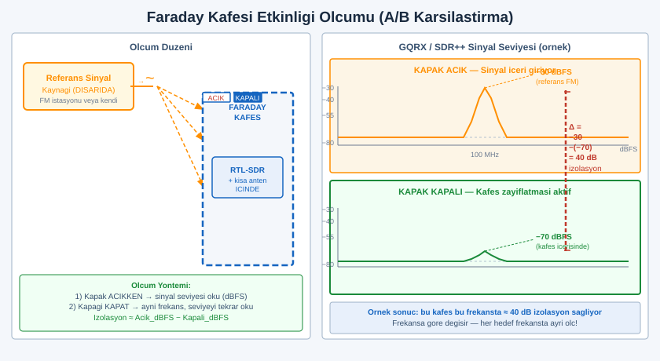
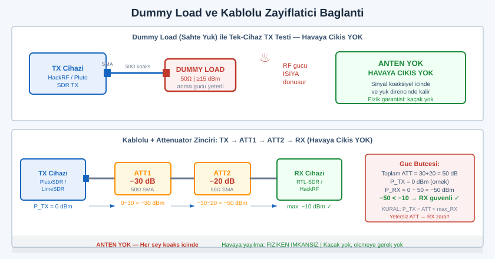
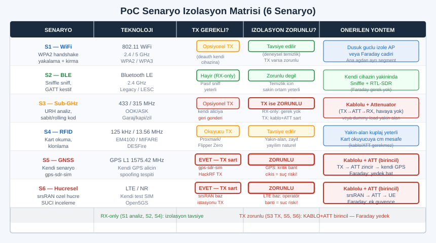

# SIGINT EL KİTABI — BÖLÜM 28: İZOLE LABORATUVAR VE TX GÜVENLİĞİ

## Uygulamalı, Yasal, Uçtan Uca — Saldırı Tekniklerini Kendi İzole Laboratuvarında Öğrenmek

> Amaç: Önceki bölümler tek tek teknolojileri (WiFi — Bölüm 15, kısa menzilli/IoT — Bölüm 16, GNSS — Bölüm 10, hücresel — Bölüm 20), saldırı taksonomisini (Bölüm 23) ve pratik istasyon projelerini (Bölüm 26) verdi. Bu bölüm bambaşka bir şey yapar: o bilginin tehlikeli ucunu — gerçek bir saldırının uçtan uca nasıl çalıştığını — sana **kendi izole laboratuvarında, kendi cihazlarına karşı, yasal olarak** uygulatır. Bu, bir OSCP/CTF tarzı eğitimdir: hücum tekniğini *anlamak* için onu güvenli bir kutuda baştan sona çalıştırırsın, gördüğünü ölçersin, sonra aynı saldırının doğru savunma karşısında nasıl çöktüğünü kendi gözünle görürsün. Bir saldırıyı yalnızca anlatımdan okumak ile onu izole bir ortamda kurup kendi handshake'ini yakalamak, kendi GPS alıcını kendi senaryona kilitlemek ve sonra WPA3/PMF'in onu nasıl boşa çıkardığını izlemek arasında dağlar kadar fark vardır. Bu bölüm o farkı kapatmak için yazıldı.

> Yasal ve etik çerçeve (mutlak): Bu bölümdeki *her* senaryo üç şartla bağlıdır ve istisnası yoktur: (1) hedef yalnızca **senin sahip olduğun** ekipmandır — kendi yönlendiricin, kendi BLE kartın, kendi garaj kumandan, kendi erişim kartın, kendi GPS alıcın, kendi test SIM'in; (2) ortam **izole**dir — Faraday, kablolu+zayıflatıcı veya dummy-load ile yayının dışarı kaçmadığı bir kutu; (3) sen **yetkilisin** — kendi malına kendi laboratuvarında. Canlı bir şebekeye, başkasının cihazına, açık spektruma yönelik operasyonel bir reçete bu bölümde **yoktur**. Geri-alınamaz fiziksel zarar veren bir tasarım (çalışan bir jammer'ın tasarımı/optimizasyonu) **yoktur**; Kısım C'deki korunan-frekans listesi yalnızca *kaçınma* (asla dokunmama) içindir. "Teknik olarak çalıştırabiliyor olmak" yasal olduğu anlamına gelmez. Başkasının haberleşmesine izinsiz girmek, kaynağını tüketmek, karıştırmak veya kritik bir banda yayın yapmak Türkiye'de TCK 243/244, elektronik haberleşme mevzuatı (BTK) ve uluslararası düzeyde ITU Telsiz Tüzüğü kapsamında ağır suçtur; kritik bantta ek olarak doğrudan can güvenliği riski doğurur. Komutlar gerçek ve çalışır niteliktedir; ancak sürümler, band adları ve bölgesel kurallar değişir — "teyit edilmeli" notunu gördüğün her yerde kendi sürümün ve kendi ülkenin mevzuatını doğrula. Bu kitap hukuki danışmanlık değildir.

---

## İÇİNDEKİLER

### KISIM A — İzole Laboratuvar Kurulumu

1. [Neden İzolasyon: İki Yönlü Sınır ve Laboratuvar Felsefesi](#1)
2. [İzolasyon Yöntemleri: Faraday, Dummy Load, Kablolu+Zayıflatıcı, Ekranlı Oda](#2)
3. [Faraday Kafesi/Çadır/Torba: Yapım, Etkinlik Ölçümü, Kaçak](#3)
4. [Dummy Load ve Kablolu Zayıflatıcı Bağlantı: Antensiz TX Testi](#4)
5. [RF Maruziyet Güvenliği: Yakın-Alan, SAR, Yanık Riski, Düşük-Güç İlkesi](#5)
6. [Test Cihazı İzolasyonu: Air-Gap, Ayrı Ağ, Sanal Makine, Snapshot](#6)
7. [Laboratuvar Envanteri: Tam Donanım Listesi](#7)

### KISIM B — Uçtan Uca PoC Senaryoları (kendi cihaz / izole / yasal)

8. [Senaryo 1 — WiFi: Kendi Handshake'ini Yakala, Kır, WPA3+PMF'e Geç](#8)
9. [Senaryo 2 — BLE: Kendi Cihazını Sniffle ile İncele, GATT Keşfi, LESC Savunması](#9)
10. [Senaryo 3 — Sub-GHz: Kendi Kumandanı URH ile Çöz, Sabit vs Rolling Kod](#10)
11. [Senaryo 4 — RFID: Kendi Kartını Oku, Klonla, DESFire Savunması](#11)
12. [Senaryo 5 — GNSS: Kendi Senaryonu Üret, İzole Besle, Spoofing Tespiti](#12)
13. [Senaryo 6 — Hücresel: Kendi Özel Test Hücreni Kur, SUCI'yi İncele](#13)

### KISIM C — TX Güvenliği ve Kazara Zarardan Kaçınma

14. [TX-Yetenekli Cihazla Sorumluluk: Kazara Zarar ve Sahiplik](#14)
15. [Korunan/Kritik Frekanslar — Asla Yayın Yapma Tablosu](#15)
16. [Teknik Kaçınma: Dummy Load, Filtre, Yazılım Sınırı, Harmonik Farkındalığı](#16)
17. [TX Öncesi Kontrol Listesi ve RX-Only Çalışma Disiplini](#17)
18. [Yasal Çerçeve: Lisanssız TX, Girişim, Jamming](#18)
19. [Alıştırmalar (Yasal, Lab)](#19)
20. [Hızlı Referans ve Diğer Bölümler](#20)

---

# KISIM A — İZOLE LABORATUVAR KURULUMU

<a id="1"></a>
## 1. Neden İzolasyon: İki Yönlü Sınır ve Laboratuvar Felsefesi

Bir RF güvenlik laboratuvarında izolasyon süslü bir tercih değil, çalışmanın *ön koşuludur*. İzolasyon iki yönlü bir duvardır ve her iki yönü de ayrı ayrı kritiktir.

Birinci yön — içeriden dışarı (yasal zorunluluk). TX-yetenekli bir cihazla (HackRF, LimeSDR, PlutoSDR, bladeRF) ürettiğin sinyal, izole değilse antenden dışarı yayılır ve o anda artık "laboratuvar deneyi" olmaktan çıkıp gerçek bir telsiz yayını olur. Bu yayın bir komşunun cihazını, bir kablosuz sensörü, hatta hiç beklemediğin bir kritik servisi etkileyebilir; lisanssızsa ve/veya bir başkasının haberleşmesine girişim yapıyorsa doğrudan suçtur (Bölüm 18). İzolasyon, "kendi cihazıma kendi sinyalimi gönderdim" cümlesinin fiziksel garantisidir: sinyalin Faraday kutusunun, koaksiyel kablonun ya da dummy load'ın dışına çıkmadığını bilirsin.

İkinci yön — dışarıdan içeri (deneysel temizlik). Açık havada her band kirlidir: FM yayınları, cep telefonu bazları, WiFi'lar, komşunun sensörleri, kendi ev RFI'ın (Bölüm 13). Bir saldırı/savunma deneyini bu gürültünün içinde yaparsan, gördüğün sonucun *senin deneyinden mi* yoksa dış bir kaynaktan mı geldiğini ayırt edemezsin. İzole ortam, deneyi "tek değişkenli" yapar: kutuda yalnızca senin verdiğin sinyal vardır, dolayısıyla gözlemlediğin her şey senin eyleminin sonucudur. Bu, bilimsel deneyin kontrol değişkeni ile aynı fikirdir.

```
   İZOLASYONUN İKİ YÖNÜ
   ─────────────────────────────────────────────────────────
   İÇERİDEN DIŞARI   →  yayının kaçmaması        →  YASAL zorunluluk
   (TX kaçağı yok)       (komşu/kritik servis        (lisanssız TX,
                          etkilenmez)                  girişim = suç)

   DIŞARIDAN İÇERİ   →  dış girişimin             →  DENEYSEL temizlik
   (RX kirlenmesi yok)   laboratuvarı kirletmemesi   (tek değişkenli,
                          (FM/baz/WiFi/komşu)          tekrarlanabilir)
```

> Laboratuvar felsefesi: Bu bölüm boyunca tek bir cümleyi tekrar edeceğiz — *kendi cihazın, izole ortam, yetkili sen*. Bu üçlü sağlanmadıkça hiçbir senaryoya başlanmaz. İzolasyon bu üçlünün ortadaki ayağıdır ve onsuz diğer ikisi yeterli değildir: kendi cihazına kendi sinyalini "açık havada" göndermek bile, kaçak yayın yoluyla başkasını etkileyebilir ve suç oluşturabilir.

### İzolasyon ne zaman ne kadar gerekir?

Her deney aynı seviyede izolasyon istemez. İlke şudur: **yaptığın iş TX içeriyorsa izolasyon zorunludur; yalnızca RX (dinleme) ise izolasyon deneysel temizlik için iyidir ama yasal zorunluluk değildir.** Bu bölümdeki senaryoların çoğu (1 WiFi-yakalama, 2 BLE-sniff, 3 sub-GHz analiz, 4 RFID-okuma) ağırlıkla RX/pasiftir; gerçek TX gerektiren ve dolayısıyla izolasyonu *zorunlu* kılan senaryolar 5 (GNSS spoofing-besleme) ve 6 (özel hücre) ile Senaryo 3'ün opsiyonel "kendi alıcına geri gönderme" adımıdır. Hangi senaryoda hangi izolasyonun şart olduğunu her senaryonun başında ayrıca belirteceğiz.

---

<a id="2"></a>
## 2. İzolasyon Yöntemleri: Faraday, Dummy Load, Kablolu+Zayıflatıcı, Ekranlı Oda

Dört temel izolasyon yöntemi vardır. Hiçbiri "en iyi" değildir; her biri farklı bir deney sınıfına uyar. Doğru seçim, deneyinin *anten gerektirip gerektirmediğine* ve kaç cihaz arasında olduğuna bağlıdır.

```
   İZOLASYON YÖNTEMLERİ — KARŞILAŞTIRMA
   ────────────────────────────────────────────────────────────────────────────
   YÖNTEM              ANTEN?   İZOLASYON   NE ZAMAN KULLAN
   ────────────────────────────────────────────────────────────────────────────
   Dummy load          HAYIR    ~mükemmel   Tek cihazda TX'i test et; gücü
   (sahte yük)                  (yük ısıya  ölç; sinyal havaya HİÇ çıkmasın.
                                 çevirir)    Antene gerek yok, en güvenli TX testi.

   Kablolu + zayıflatıcı HAYIR  çok yüksek  İki cihaz arası DOĞRUDAN bağlantı
   (attenuator)                 (koaks içi) (TX → attenuator → RX), havaya
                                            çıkmadan "kablodan" deney.

   Faraday kafes/çadır  EVET    iyi-çok iyi Antenli, havadan deney ama kutu
   /torba                       (kaçak var) içinde. RX/TX kutu içinde kalır.
                                            Kaçak ölçülmeli; mükemmel değil.

   Ekranlı oda          EVET    en iyi      Profesyonel; pahalı. Büyük/çok
   (shielded room)              (oda boyu)  cihazlı deney; lab kuruluysa ideal.
                                            Bireysel için genelde erişilemez.
```

Mantık şudur: eğer deneyin **anten gerektirmiyorsa** (cihazdan cihaza doğrudan, ya da tek cihazda güç/çıkış testi), kablolu çözümler (dummy load, attenuator) hem en güvenli hem en temizdir — sinyal hiçbir zaman havaya çıkmaz, dolayısıyla kaçak sorunu *yoktur*. Eğer deneyin **havadan yayılma gerektiriyorsa** (bir antenin gerçekten yayması, bir alıcının havadan alması gereken bir senaryo), o zaman Faraday veya ekranlı oda gerekir; ama bunların kaçağı sıfır değildir ve ölçülmelidir.

> Pratik öncelik sırası (birey için): Çoğu senaryoda **önce kablolu/dummy-load** düşün. Faraday'ı yalnızca havadan-yayılma şart olduğunda kullan. Sebep: kablolu yöntemler hem daha ucuz, hem daha güvenli (kaçak yok), hem de daha tekrarlanabilirdir (zayıflatma değeri bilinir). Faraday çadır/torba kaçak yapar ve bu kaçağı NanoVNA/RX ile ölçmek ayrı bir iştir (Kısım 3). srsRAN özel hücre (Senaryo 6) ve GNSS besleme (Senaryo 5) gibi gerçekten havadan-yayılma isteyen senaryolarda bile, mümkünse kablolu+attenuator tercih edilir; Faraday yedek plandır.

### Yöntemlerin birleşimi

Gerçek laboratuvarda yöntemler sık sık birleşir. En güçlü ve en güvenli kombinasyon genellikle **kablolu + attenuator + (yedek olarak) Faraday** üçlüsüdür: TX cihazından çıkışı bir attenuator zinciriyle zayıflatıp RX cihazına koaksiyel kabloyla verirsin (ana izolasyon), tüm düzeneği bir Faraday çadırına koyarsın (kablo/konnektör kaçaklarına karşı ikinci hat) ve gücü düşük tutarsın (üçüncü hat). Bu "katmanlı izolasyon", tek bir katmanın yetmediği durumlarda bile sinyali içeride tutar.

---

<a id="3"></a>
## 3. Faraday Kafesi/Çadır/Torba: Yapım, Etkinlik Ölçümü, Kaçak

Faraday kafesi, içine giren/çıkan elektromanyetik alanı iletken bir kabukla zayıflatan bir muhafazadır. Prensip basittir: iletken yüzeye çarpan EM dalga, yüzeyde karşıt akımlar indükler ve bu akımlar dalgayı büyük ölçüde yansıtır/söndürür. Pratikte "mükemmel kafes" yoktur; her gerçek kafesin bir **kaçağı** (leakage) vardır ve en zayıf nokta neredeyse her zaman *delikler ve dikiş/kapak hatlarıdır*, malzemenin kendisi değil.

```
   FARADAY SEÇENEKLERİ — birey laboratuvarı için
   ──────────────────────────────────────────────────────────────────
   SEÇENEK          TİPİK İZOLASYON*   ARTI / EKSİ
   ──────────────────────────────────────────────────────────────────
   RF-ekranlama     orta (telefon-     Ucuz, hazır; küçük (telefon/fob
   torbası          boyu cihaz için)   boyu). Kapak/fermuar kaçar.
   (shielding bag)                     Küçük cihaz testine uygun.

   Faraday çadırı   orta-iyi           Daha büyük (Pi+SDR+anten sığar).
   (test tent)                         Dikiş/fermuar kaçağı var. Taşınır.

   Ev-yapımı kafes  değişken           Ucuz; etkinliği TAMAMEN yapım
   (iletken kumaş/   (iyi de olabilir   kalitesine bağlı. Delik/dikiş
   ızgara/teneke)    kötü de)           kritik. MUTLAKA ölçülmeli.

   Ticari ekranlı   yüksek-çok yüksek  Pahalı; pencere/conta kalitesi
   kutu (RF box)                       belirleyici. Tekrarlanabilir.
   ──────────────────────────────────────────────────────────────────
   * Gerçek izolasyon değeri frekansa ve yapım/conta kalitesine göre
     onlarca dB değişir; tek bir sayı vermek yanıltıcıdır — ÖLÇ.
```

### Ev-yapımı kafes için ilkeler

Eğer kendi kafesini yapıyorsan, etkinliği belirleyen birkaç fiziksel kural vardır:

1. **Süreklilik.** Kabuk elektriksel olarak sürekli olmalı; iletken parçalar birbirine iyi temas etmeli (boyalı/oksitli yüzeyler temas direncini artırır). Bir kutunun kapağı gövdesine yalnızca birkaç noktadan değiyorsa, aradaki açıklıklar antenleşir.

2. **Delik boyutu dalga boyuna göredir.** Bir delik, ilgilendiğin frekansın dalga boyuna kıyasla küçükse zayıf sızdırır; dalga boyuna yaklaştıkça yarık-anten gibi davranıp ciddi kaçak yapar. Yüksek frekans (kısa dalga boyu) çalışıyorsan küçük delikler bile sorun olur. Havalandırma için ızgara/petek kullanılır (delik küçük, toplam alan büyük).

3. **Kablo geçişleri en zayıf halkadır.** Güç ve veri kablosu kutuya girerken, kablonun dış kılıfı/blendajı kutu duvarına 360° temas etmeli (besleme-geçiş/feedthrough konnektör). Aksi halde kablo, içerideki sinyali dışarı taşıyan bir anten olur. Mümkünse içerideki cihazı bataryayla besle ve hiç kablo geçirme; veri için fiber veya filtrelenmiş geçiş kullan.

### Etkinliği ölçmek (kritik adım — "kutu var" yeterli değil)

Bir kafesi yaptıktan/aldıktan sonra ne kadar izole ettiğini **ölçmeden** ona güvenmek tehlikelidir. İki pratik ölçüm yöntemi:

```
   YÖNTEM 1 — RX ile A/B kaçak ölçümü (en pratik)
   ───────────────────────────────────────────────
   1) Bilinen, sürekli bir referans sinyal seç:
        - Güçlü bir yerel FM istasyonu, VEYA
        - Kutu DIŞINA koyduğun kendi düşük-güçlü test kaynağın
          (kendi cihazın, çok düşük güç, dummy-load yakınında).
   2) RX cihazını (RTL-SDR + anten) kutu İÇİNE koy.
   3) Kapak AÇIKKEN sinyal seviyesini (dBFS/güç) GQRX/SDR++'ta ölç, not et.
   4) Kapağı KAPAT, aynı sinyalin seviyesini tekrar ölç.
   5) Fark (açık - kapalı) = kafesin o frekanstaki yaklaşık zayıflatması.
      Örn açıkken -30 dB, kapalıyken -70 dB ise ~40 dB izolasyon.
   6) Birkaç farklı frekansta tekrarla — izolasyon frekansa göre değişir.

   YÖNTEM 2 — İçeride TX, dışarıda RX (yalnızca düşük güç, dikkatli)
   ───────────────────────────────────────────────
   - Kutu İÇİNE çok düşük güçlü kendi test kaynağını koy.
   - Kutu DIŞINA RX koy; kapak açık/kapalı seviye farkını ölç.
   - UYARI: Bu yöntemde kaçak ölçüyorsun demektir — yani bir miktar
     sinyal dışarı çıkıyor. Gücü mümkün olan EN DÜŞÜK seviyede tut,
     korunan frekanslardan uzak dur (Kısım 15), kısa süre çalıştır.
```



> Doğru zihniyet: Faraday kutusu "ya izole eder ya etmez" değil, "şu frekansta şu kadar dB zayıflatır" diye düşünülür. 100 MHz'te harika olan ev-yapımı bir kutu, 2.4 GHz'te zayıf olabilir (delik/conta dalga boyuna göre büyür). Bu yüzden hangi senaryo için kullanacaksan, o senaryonun frekansında ölçersin. Ölçülmemiş bir kafese "izole" demek, kilitlenmemiş bir kapıya "güvenli" demek gibidir.

### Faraday'ın sınırı ve dürüst uyarı

Tüketici-sınıfı Faraday çadır/torbalar, *düşük güçlü* bir cihazı *makul ölçüde* içeride tutar; ama yüksek güçlü bir TX için tek başına yeterli güvence değildir. Bu yüzden bu bölümde Faraday'ı her zaman **düşük güç + (mümkünse) kablolu/dummy-load** ile birlikte kullanırız. Tek başına bir çadıra güvenip yüksek güçle TX yapmak, kaçak yoluyla dışarı yayın riskini taşır. Kural: izolasyon katmanlarını topla, güce değil yöntemlerin çokluğuna güven.

---

<a id="4"></a>
## 4. Dummy Load ve Kablolu Zayıflatıcı Bağlantı: Antensiz TX Testi

Bu, bireysel laboratuvarın *en güvenli ve en çok kullanılması gereken* izolasyon biçimidir: sinyal hiçbir zaman havaya çıkmaz, koaksiyel kablonun ve direnç elemanlarının içinde kalır.

### Dummy load (sahte yük) nedir, ne işe yarar?

Dummy load, bir antenin yerine geçen, vericinin gücünü havaya yaymak yerine **ısıya çeviren** bir empedans-uyumlu (tipik 50 Ω) sonlandırıcı dirençtir. Vericiye anten gibi görünür (uyumlu yük), ama yaydığı RF enerjisi neredeyse sıfırdır. TX-yetenekli bir cihazın çıkışını test etmek, gücünü ölçmek, bir yazılım zincirinin gerçekten TX yapıp yapmadığını doğrulamak için idealdir — *çünkü hiçbir şey yayınlanmaz*.

```
   DUMMY LOAD ile TEK-CİHAZ TX TESTİ (havaya hiç çıkış yok)
   ─────────────────────────────────────────────────────────

     ┌─────────────┐   koaks    ┌──────────────┐
     │  TX cihazı  │═══════════►│  DUMMY LOAD   │
     │ (HackRF/    │            │  (50 Ω, güç   │──► güç ISIYA döner
     │  Pluto/...) │            │   anma değeri │    (RF dışarı YAYILMAZ)
     └─────────────┘            │   yeterli!)   │
                                └──────────────┘

   - Anten YOK → havaya yayın YOK.
   - Dummy load'un GÜÇ ANMA DEĞERİ (watt) cihazının çıkışından
     büyük olmalı; küçük SDR'lar (HackRF ~10-15 dBm) için küçük
     dummy load yeter, ama değeri teyit et.
   - TX'in gerçekten çıktığını doğrulamak için: yakına (kablosuz)
     bir RX koyup dummy load'tan SIZAN çok zayıf seviyeyi gör;
     yine de bu kasıtlı yayın değil, sızıntı seviyesindedir.
```

### Kablolu + zayıflatıcı (attenuator) ile cihazdan cihaza

İki cihaz arasında (TX → RX) havadan deney yapmak istediğin ama havaya çıkmasını istemediğin senaryolarda, ikisini koaksiyel kabloyla doğrudan bağlar, araya bir **zayıflatıcı (attenuator)** koyarsın. Attenuator, sinyali bilinen bir miktarda (örn 30 dB, 40 dB) zayıflatan pasif bir elemandır; iki amaca hizmet eder:

1. **Alıcıyı korur.** TX çıkışı doğrudan RX girişine verilirse, RX'in ön-ucu (LNA/ADC) doyabilir hatta hasar görebilir. Attenuator gücü RX'in güvenli aralığına indirir.
2. **Gerçekçi seviye kurar.** Açık havada sinyal mesafeyle zayıflar; attenuator bu "yol kaybını" laboratuvarda taklit eder, böylece RX makul bir seviyede sinyal görür.

```
   KABLOLU + ATTENUATOR: CİHAZDAN CİHAZA (havaya çıkış YOK)
   ─────────────────────────────────────────────────────────────

   ┌──────────┐  koaks  ┌────────────┐  koaks  ┌────────────┐  koaks ┌──────────┐
   │ TX cihazı│════════►│ ATTENUATOR │════════►│ ATTENUATOR │═══════►│ RX cihazı│
   │ (Pluto/  │         │  (örn 30dB)│         │  (örn 20dB)│        │ (RTL-SDR/│
   │  Lime/   │         │            │         │ (zincirle  │        │  HackRF) │
   │  HackRF) │         │            │         │  toplam↑)  │        │          │
   └──────────┘         └────────────┘         └────────────┘        └──────────┘
        │                                                                  │
        └── Anten YOK, her şey koaks içinde ── havaya yayın YOK ───────────┘

   - Toplam zayıflatma = attenuatorların dB toplamı (30+20 = 50 dB).
   - DİKKAT: TX gücü - toplam attenuator, RX'in HASAR eşiğinin ALTINDA
     ve doyma eşiğinin altında olmalı. Yetersiz attenuator RX'i yakabilir.
   - Konnektör/kablo uyumu (SMA vs N, 50 Ω) doğru olmalı; uyumsuzluk
     yansıma ve seviye hatası üretir.
```



> Neden bu yöntem bu kadar değerli: Bir saldırı/savunma deneyini (örn kendi sub-GHz kumandanın sinyalini kendi alıcına göndermek, Senaryo 3) attenuator'lü kabloyla yaparsan, sinyalin havaya çıkmadığını *fizik garanti eder* — kaçak ölçmene bile gerek kalmaz. Bu, Faraday'a kıyasla hem daha güvenli hem daha kesindir. Bu bölümün altın kuralı: **TX gerektiren bir deneyi mümkün olduğunca kabloyla yap; antene/havaya yalnızca gerçekten gerektiğinde geç.**

### Attenuator zincirleme ve güç bütçesi

Attenuator değerleri toplanır (dB cinsinden). 30 dB + 20 dB + 10 dB = 60 dB toplam zayıflatma. Bir deney kurarken kaba bir "güç bütçesi" çıkar: TX çıkış gücü (dBm) eksi toplam attenuator (dB) eşittir RX'e ulaşan güç (dBm). Bu değeri hem RX'in *hasar eşiğinin* (genelde datasheet'te "maximum input") hem de *doyma eşiğinin* altında tut. Emin değilsen daha fazla attenuator koy: fazla zayıflatma en kötü "sinyal zayıf" demektir, yetersiz zayıflatma ise RX'i kalıcı bozabilir.

---

<a id="5"></a>
## 5. RF Maruziyet Güvenliği: Yakın-Alan, SAR, Yanık Riski, Düşük-Güç İlkesi

İzolasyon yayını *dışarıdan* korur; bu bölüm seni *kendinden* korur. RF enerjisi yeterince yüksek güçte ve yeterince yakın mesafede insan dokusuna zarar verebilir. Bireysel SDR laboratuvarında kullanılan cihazların güçleri genellikle çok düşüktür (HackRF tipik olarak birkaç on miliwatt seviyesinde — teyit edilmeli), bu yüzden akut tehlike düşüktür; ama doğru alışkanlıkları baştan oturtmak, ileride güç yükselticisi (PA) ile çalışacaksan hayati olur.

```
   RF MARUZİYET — TEMEL KAVRAMLAR
   ──────────────────────────────────────────────────────────────
   YAKIN ALAN     Antenin hemen yanında (yaklaşık < birkaç dalga
   (near field)   boyu) alan yapısı karmaşıktır ve enerji yoğunluğu
                  yüksek olabilir. Tehlike mesafeyle HIZLA azalır.
                  → Anten ucunda durma; mesafe en iyi korunmadır.

   SAR            Specific Absorption Rate — dokunun birim kütlesi
                  başına soğurduğu RF gücü (W/kg). Telefon
                  standartlarının dayandığı ölçü. Yüksek güç +
                  yakın mesafe = yüksek SAR.

   ISIL ETKİ      Yeterince yüksek güçte RF, dokuyu ısıtır. Yüksek
   (yanık)        güçlü vericilerde anten/besleme hattına dokunmak
                  RF yanığına yol açabilir (özellikle metal uçlar).
                  → Yayın sırasında antene/konnektöre dokunma.

   GÖZ/HASSAS     Göz ve bazı dokular ısı atımında daha zayıftır;
   DOKU           yüksek güçlü kaynaklarda ek dikkat gerektirir.
```

### Düşük-güç ilkesi (bu laboratuvarın temel kuralı)

En sağlam korunma, gücü baştan düşük tutmaktır. Bir deney için gereken en düşük gücü kullan; "daha fazla güç daha iyi sonuç" sezgisi bu laboratuvarda yanlıştır — izole ortamda sinyaller zaten çok yakındır, yüksek güç hem RX'i doyurur hem de kaçak/maruziyet riskini artırır. Pratik kurallar:

1. **TX gücünü yazılımda mümkün olan en düşük değere ayarla** (Senaryo 5/6'da gps-sdr-sim/srsRAN çıkış kazancını minimumda tut; Kısım 16).
2. **Mesafe = bedava güvenlik.** Antene/dummy-load'a/yükselticiye yakın durma; yayın sırasında ellerini uzakta tut.
3. **Yayın yaparken antene/konnektöre dokunma.** Özellikle güç yükseltici (PA) eklediysen.
4. **Güç yükseltici (PA) ile çalışmak ayrı bir sorumluluk seviyesidir.** SDR'ın çıplak çıkışı düşük güçlüdür; bir PA eklemek hem maruziyet hem de kaçak/girişim riskini büyütür ve bu bölümün kapsamı dışındadır. PA gerekiyorsa profesyonel rehberlik ve uygun ortam (ekranlı oda) şarttır.

> Orantı duygusu: Çıplak bir HackRF'in birkaç on miliwatt çıkışı, bir cep telefonunun anlık tepe gücünden bile düşüktür; akut sağlık riski düşüktür. Tehlike, *yükseltici eklediğinde* ve *anten ucunda uzun süre durduğunda* ortaya çıkar. Bu bölüm seni çıplak-SDR seviyesinde tutar ve "düşük güç + mesafe" alışkanlığını şimdiden oturtur — çünkü doğru refleks, gücün düşük olduğu zaman değil, yüksek olduğu zaman seni korur.

---

<a id="6"></a>
## 6. Test Cihazı İzolasyonu: Air-Gap, Ayrı Ağ, Sanal Makine, Snapshot

RF izolasyonu sinyali izole eder; bu bölüm *bilişim* tarafını izole eder. Saldırı/savunma deneylerinde sıklıkla bilinmeyen firmware, yakalanmış trafik, kendi ürettiğin ama hatalı olabilecek paketler ve (ileri senaryolarda) potansiyel olarak kötü amaçlı veri ile çalışırsın. Bu, Malware analizi mantığının (ayrı, geri-alınabilir, ağdan yalıtık ortam) RF laboratuvarına taşınmasıdır.

```
   TEST CİHAZI İZOLASYON KATMANLARI
   ──────────────────────────────────────────────────────────────
   AIR-GAP           Analiz/lab makinesi internete BAĞLI DEĞİL.
   (havadan yalıtık)  Bilinmeyen firmware/veri ile çalışırken dış
                      sızıntıyı/komuta-kontrolü engeller. Veri
                      taşıma: kontrollü, tek-yön (örn salt-okunur).

   AYRI AĞ            Lab cihazları (test AP, test telefon, IoT)
   (segment/VLAN)     kendi izole ağ segmentinde; ana ev/iş ağına
                      ERİŞEMEZ. Yanlışlıkla yayılmayı sınırlar.

   SANAL MAKİNE       Araçları (Kali/DragonOS) bir VM'de çalıştır;
   (VM)               ana işletim sistemini kirletmez. USB SDR'ı
                      VM'e geçir (passthrough).

   SNAPSHOT           Deney öncesi VM/sistem anlık görüntüsü al;
   (anlık görüntü)    deney sonrası bozulursa/kirlenirse SANİYELER
                      içinde temiz duruma geri dön.
```

### Pratik kurulum önerisi

1. **Ayrı bir lab makinesi veya en azından ayrı bir VM.** Günlük kişisel makineni saldırı/savunma deneyleri için kullanma. DragonOS/Kali türevi bir araç setini (Bölüm 4, Bölüm 12) ayrı bir disk/VM'de tut.
2. **Snapshot disiplini.** Her büyük deneyden önce VM snapshot al. Deney sonunda ya snapshot'a dön ya da yeni bir snapshot kaydet. Bu, "deney sırasında sistemim bozuldu, baştan kuruyorum" kaybını ortadan kaldırır.
3. **Lab ağını ayır.** Test AP'in (Senaryo 1) ve test cihazların ana ağına bağlı olmamalı. En basit hali: test AP'i internetsiz/ayrı bir cihaz olarak kur; test telefonu yalnızca ona bağlansın.
4. **Air-gap, riskli iş için.** Bilinmeyen firmware'i incelerken veya potansiyel kötü amaçlı veriyle çalışırken analiz makinesini internetten tamamen kes. Veri taşırken yönü kontrol et (içeri tek-yön, dışarı kontrollü).

> Neden bu kadar dikkat: RF laboratuvarında "kötü" veri yalnızca dışarıdan gelmez; kendi ürettiğin hatalı bir paket, kendi test cihazını beklenmedik bir duruma sokabilir. Snapshot ve ayrı ağ, bu deneyleri "geri-alınabilir" yapar — tıpkı malware kum havuzunun (sandbox) örneği patlatıp temiz duruma dönmesi gibi (Bölüm 12, izole analiz ortamı; Bölüm 4, sanal makine/USB passthrough).

---

<a id="7"></a>
## 7. Laboratuvar Envanteri: Tam Donanım Listesi

Aşağıdaki envanter, Kısım B'deki altı senaryonun tamamını kendi izole ortamında çalıştırmak için gereken donanımı kapsar. Her satırın *neden* gerektiğini ve hangi senaryoya hizmet ettiğini belirttik. Hepsini bir anda almak gerekmez; senaryo bazında ekle.

```
   İZOLE LABORATUVAR ENVANTERİ
   ════════════════════════════════════════════════════════════════════════
   KATEGORİ          ÖĞE                              NEDEN / HANGİ SENARYO
   ────────────────────────────────────────────────────────────────────────
   ALICI (RX)        RTL-SDR Blog V3/V4 (TCXO)        Genel RX; tüm senaryolar
                                                       (sniff, analiz, ölçüm)

   TX-YETENEKLİ      HackRF One / LimeSDR /           TX gereken senaryolar
   SDR               PlutoSDR / bladeRF                (5 GNSS, 6 hücresel,
                     (yarı-çift/tam-çift teyit)        3 opsiyonel geri-gönderim)

   ─── İZOLASYON ─────────────────────────────────────────────────────────
   Dummy load        50 Ω, uygun güç anma değeri      Antensiz TX testi;
                     (SDR çıkışından büyük)            havaya çıkış yok (Kısım 4)
   Attenuator seti   30/20/10/6 dB, 50 Ω,             Cihazdan cihaza kablolu;
                     uygun frekans aralığı             RX koruma + yol kaybı taklidi
   Koaks kablo+      SMA/N, 50 Ω, kaliteli, çeşitli   Kablolu bağlantı omurgası
   adaptörler        boy; SMA↔N, M↔F adaptörleri
   Faraday çadır/    Pi+SDR+anten sığacak boy;        Havadan-yayılma şart olan
   ekranlı kutu      conta/kapak kaliteli              senaryolarda (yedek hat)

   ─── ÖLÇÜM ─────────────────────────────────────────────────────────────
   NanoVNA           Anten/yük/kablo ölçümü;          Faraday kaçak/anten
                     (kalibrasyon kitiyle)             rezonans/yük doğrulama (Kısım 19)
   (RX olarak ölçüm) RTL-SDR + GQRX/SDR++             Kaçak A/B ölçümü; harmonik
                                                       gözlem (Kısım 3, 16, 19)

   ─── SENARYOYA ÖZEL HEDEF CİHAZLAR (HEPSİ KENDİ MALIN) ──────────────────
   Test AP/router    Ayrı/yedek bir yönlendirici      Senaryo 1 (WiFi); ana ağdan
                     (WPA2 + WPA3 destekli ideal)      ayrı, izole
   Monitor-mode      Uyumlu chipset WiFi adaptörü     Senaryo 1; monitor+injection
   WiFi adaptör      (Bölüm 15)                        (RTL-SDR DEĞİL)
   Test istemci      Eski telefon/dizüstü             Senaryo 1; sadece test AP'ine
   BLE sniffer       nRF52840 dongle (Sniffle) veya   Senaryo 2; BLE yakalama
                     uyumlu donanım                    (Bölüm 16)
   Kendi BLE cihazı  Geliştirme kartı / akıllı priz   Senaryo 2; kendi GATT'ın
   Kendi sub-GHz     Garaj/oyuncak/kapı-zili kumandan Senaryo 3; OOK/ASK analizi
   kumandan          (kendi malın, 433/315 MHz)
   RFID okuyucu      Proxmark3 / Flipper Zero         Senaryo 4; kart okuma/klonlama
   Kendi kart+boş    Kendi erişim kartın + boş        Senaryo 4; kendi karta klon
   kart              uyumlu kart (kendi malın)
   Kendi GPS alıcı   Kendi test telefonu / GPS modülü Senaryo 5; spoof-besleme hedefi
   srsRAN+Open5GS    Yazılım (kendi makinende)        Senaryo 6; özel test hücresi
   Test SIM          Programlanabilir test SIM/USIM   Senaryo 6; kendi ağına bağlan
                     (kendi test kartın)

   ─── ALTYAPI ───────────────────────────────────────────────────────────
   Lab makinesi/VM   DragonOS/Kali (ayrı disk/VM)     Tüm senaryolar; snapshot'lı
   Raspberry Pi      3/4/5 (opsiyonel düğüm)          Kalıcı/ayrı düğüm (Bölüm 26)
   Ayrı ağ donanımı  İzole switch/AP                  Test ağı segmentasyonu
```



> Maliyet notu: Bu envanterin tamamı ciddi bir yatırımdır; ama çoğu senaryoya RTL-SDR + tek bir TX-SDR (HackRF) + dummy load + attenuator seti + kendi mevcut cihazların (eski telefon, kendi kumandan, kendi kart) ile başlayabilirsin. NanoVNA ve Faraday çadırı kaçak/anten ölçümü içindir; kablolu+attenuator çalışırsan ikisi de "sonra" alınabilir. Donanım seçim derinliği Bölüm 2'de (SDR'lar), Bölüm 3'te (anten/yük/filtre/NanoVNA), araç kurulumu Bölüm 4 ve 12'dedir.

---

# KISIM B — UÇTAN UCA PoC SENARYOLARI

> Senaryo anatomisi: Kısım B'deki altı senaryonun her biri aynı altı başlıkla yazıldı ve bilinçli olarak hem yapmaya hem savunmayı öğrenmeye zorlar: (1) **Amaç ve sınır** — ne öğreneceksin ve hangi izolasyon zorunlu; (2) **Kurulum** — kendi cihazların ve izole düzenek; (3) **Adım adım** — gerçek, çalışır komutlar; (4) **Beklenen gözlem** — "doğru yaptıysan şunu görürsün"; (5) **Savunma dersi** — saldırıyı boşa çıkaran doğru yapılandırma ve onu *kendi gözünle çökerken* görme; (6) **Yasal hatırlatma + bölüm bağı**. Saldırının kendisi asla nihai hedef değildir; her senaryo bir savunmayı kanıtlamak için kurulur. Her senaryonun başında "Bunu canlıda/başkasında yapmak suçtur" hatırlatması vardır ve bu cümle süs değil, senaryonun ön koşuludur.

<a id="8"></a>
## 8. Senaryo 1 — WiFi: Kendi Handshake'ini Yakala, Kır, WPA3+PMF'e Geç

### Amaç ve sınır

Tamamen *kendine ait ve izole* bir WiFi laboratuvarında, kendi yönlendiricine kendi test cihazınla bağlanırken kendi 4-yönlü el sıkışmanı (WPA2) yakalamak, bunun üzerinden parola gücünün neden tek savunma olduğunu hashcat ile *kendi sözlüğünle* göstermek ve sonra WPA3-SAE + PMF açıp aynı saldırının çöktüğünü kendi gözünle görmek. Bu, 802.11 güvenliğini savunmacı gözüyle öğrenmenin en somut yoludur (Bölüm 15 derinleştirme).

> KRİTİK YASAL ÇİZGİ: Başkasının WiFi ağına yönelik herhangi bir yakalama, deauth veya parola kırma girişimi — kullanmasan bile — Türkiye'de TCK 243/244 kapsamında ağır suçtur. Bu senaryo YALNIZCA kendi yönlendiricin + kendi test cihazın + kendine ait izole ortam içindir. WiFi 2.4/5 GHz havadan yayılır; bu deneyde izolasyon (mümkünse ayrı/düşük güçlü test AP veya Faraday) hem yasal hem deneysel temizlik içindir. RTL-SDR kullanılmaz; araç bir WiFi adaptörünün monitor modudur.

### Kurulum (kendi cihaz / izole)

```
   - Monitor + injection destekli WiFi adaptörü (uyumlu chipset — Bölüm 15)
   - KENDİ test yönlendiricin: ayrı/yedek bir AP; WPA2 VE WPA3 destekleyen ideal
   - Ayrı test istemcisi: eski telefon/dizüstü, SADECE bu test AP'ine bağlı
   - Lab makinesi/VM: DragonOS/Kali araç seti (airmon/airodump/aireplay/hashcat)
   - İzolasyon: test AP düşük güçte + ana ağdan ayrı; mümkünse Faraday içinde
   - (Opsiyonel) GPU: hashcat hız gösterimi için
```

### Adım adım

```
1) Test ortamını izole et (saldırıdan ÖNCE):
      - Ayrı bir SSID/AP kur; ana ağından bağımsız, internetsiz olabilir.
      - SADECE kendi test istemcini bu AP'e bağla.
      - Bilinçli olarak ZAYIF bir parola koy (örn sözlükte bulunan bir kelime)
        — bunu sırf "kırılabilirliği göstermek" için yapıyorsun; ders bu.

2) Adaptörü monitor moduna al:
      sudo airmon-ng check kill          # çakışan ağ servislerini durdur
      sudo airmon-ng start wlan0         # wlan0mon arayüzü oluşur

3) Kendi AP'ini bul, BSSID + kanal not et:
      sudo airodump-ng wlan0mon          # kendi SSID'ini bul
      # BSSID (MAC) ve CH (kanal) değerlerini kaydet.

4) Kendi AP'inin kanalında handshake yakalamaya başla:
      sudo airodump-ng -c <KANAL> --bssid <KENDI_BSSID> -w kendi_hs wlan0mon
      # Üst köşede "WPA handshake: <BSSID>" çıkana kadar bekle.

5) Kendi istemcini yeniden bağlat (handshake'i tetikle):
      # EN TEMİZ yol: kendi test cihazının WiFi'ını kapat-aç → yeniden
      # bağlanırken 4-yönlü handshake havadan geçer, airodump yakalar.
      # (Alternatif, SADECE kendi cihazına) kontrollü deauth ile zorlama:
      sudo aireplay-ng --deauth 3 -a <KENDI_BSSID> -c <KENDI_ISTEMCI_MAC> wlan0mon
      # NOT: deauth yalnızca KENDİ istemcine; başkasının cihazına ASLA.

6) PMKID alternatifi (istemci yeniden bağlanmadan, kendi AP'inden):
      sudo hcxdumptool -i wlan0mon --enable_status=1 -o kendi.pcapng
      # Bazı AP'ler PMKID sızdırır; bunu hashcat'e verilebilir formata çevir.
      # Yine SADECE kendi AP'inde.

7) Kendi sözlüğünle kır (parola gücü dersi — hashcat):
      # Yakalanan handshake'i hashcat formatına dönüştür (hcxpcapngtool /
      # aircrack→hccapx zinciri; sürüm/araç adı teyit edilmeli).
      hashcat -m 22000 kendi.hc22000 kendi_sozluk.txt
      #  -m 22000 : WPA-PBKDF2-PMKID/EAPOL modu (güncel hashcat; teyit et)
      # ZAYIF parola (sözlükte) → saniyeler/dakikalar içinde "Cracked".
      # GÜÇLÜ parola (uzun+rastgele) → sözlükte yok → pratikte kırılamaz.
```

### Beklenen gözlem

Adım 4-5'te "WPA handshake: <BSSID>" bildirimi — kendi el sıkışmanı yakaladın. Adım 7'de: zayıf parola hashcat'te hızla "Cracked" olur; aynı handshake güçlü/rastgele bir parolayla aynı sözlüğe karşı *asla* çözülmez. Bu, çıplak kanıttır: **yakalamak kolaydır, kırmak yalnızca parola zayıfsa mümkündür.**

### Savunma dersi (saldırıyı çökerken gör)

```
1) Kendi AP'inde WPA3-SAE'ye geç (mümkünse WPA3-only veya WPA2/3 geçiş):
      - WPA3 "Dragonfly" (SAE) el sıkışması, çevrimdışı sözlük saldırısına
        DAYANIKLIDIR: yakaladığın materyalden parola brute-force edilemez.
      - Aynı yakalama-kır zincirini tekrar dene → hashcat'e verecek
        kullanışlı bir materyal ELDE EDEMEZSİN. Saldırı kaynağında çöker.

2) PMF'i (Protected Management Frames, 802.11w) aç:
      - Adım 5'teki deauth artık yönetim çerçevelerini koruduğu için
        istemciyi DÜŞÜREMEZSİN → handshake'i deauth ile zorlayamazsın.
      - Kendi AP'inde PMF'i aç, adım 5 deauth'unu tekrar dene → ETKİSİZ.

3) "Çalışmadı" = BAŞARI:
      - WPA3'te kıramaman ve PMF'te deauth edememen, savunmanın
        çalıştığının KANITIDIR. Bu senaryonun asıl çıktısı budur.
```

> Bu senaryonun savunma özeti bir sağlamlaştırma listesidir: WPA3-SAE (veya en az çok güçlü WPA2 parolası), PMF zorunlu, WPS kapalı, yönetim arayüzü izole. "Yakalanmak" kaçınılmazdır; güvenlik parolanın entropisinde ve protokol korumalarındadır (Bölüm 15, uçtan uca; Bölüm 23, deauth/erişim sınıfı).

---

<a id="9"></a>
## 9. Senaryo 2 — BLE: Kendi Cihazını Sniffle ile İncele, GATT Keşfi, LESC Savunması

### Amaç ve sınır

*Kendi* BLE cihazını (geliştirme kartı, akıllı priz, kendi fitness bandın) Sniffle/nRF tabanlı bir sniffer ile dinlemek: reklam (advertising) paketlerini görmek, bağlantıyı (connection) izlemek, GATT servis/karakteristik yapısını keşfetmek ve eşleşmeyi (pairing) gözlemlemek. Sonra savunma: eski "Legacy Pairing" ile modern LESC (LE Secure Connections) arasındaki farkı ve neden LESC'in pasif dinleyiciye karşı anahtarı koruduğunu anlamak (Bölüm 16 derinleştirme).

> YASAL ÇİZGİ: Yalnızca SAHİP OLDUĞUN BLE cihazını dinle/analiz et. Başkasının BLE cihazını (akıllı kilit, sağlık cihazı, kulaklık) dinlemek izinsiz haberleşme dinlemedir ve suçtur. BLE düşük güçlüdür ve kısa menzillidir; bu senaryo ağırlıkla pasif (RX/sniff) olduğundan izolasyon zorunlu değildir ama deneysel temizlik için yakın/sakin bir ortam iyidir. TX/aktif müdahale (sahte reklam, MitM) bu senaryoda YOK — yalnızca anlama.

### Kurulum (kendi cihaz)

```
   - BLE sniffer: nRF52840 dongle (Sniffle firmware) veya uyumlu donanım
   - KENDİ BLE cihazın: geliştirme kartı / akıllı priz / kendi bandın
   - Lab makinesi: Sniffle host yazılımı + Wireshark (BLE dissector)
   - (Keşif için) nRF Connect (telefon/masaüstü) — GATT'ı görselleştirir
```

### Adım adım

```
1) Sniffer'ı hazırla:
      - nRF52840 dongle'a Sniffle firmware'i yükle (proje talimatı; sürüm teyit).
      - Sniffle host betiğini çalıştır; Wireshark'a aktarımı kur (named pipe /
        extcap — Sniffle dokümanına göre).

2) Reklam paketlerini yakala (kendi cihazın reklamını gör):
      python3 sniff_receiver.py -o kendi_ble.pcap     # (Sniffle host; ad/yol teyit)
      # Kendi BLE cihazını aç → periyodik ADV_IND paketleri akar.
      # Wireshark'ta: cihazın adresi, ADV verisi, servis UUID'leri görünür.

3) Bir bağlantıyı izle (connection following):
      - Kendi telefonun/uygulaman kendi cihazına bağlanırken Sniffle bağlantıyı
        takip eder (kanal atlama dahil) → veri paketleri akar.
      - Reklamdan bağlantıya geçişi (CONNECT_IND) Wireshark'ta gözle.

4) GATT keşfi (kendi servis/karakteristiklerini haritala):
      - nRF Connect ile kendi cihazına bağlan → servisleri, karakteristikleri,
        okuma/yazma/notify özelliklerini listele.
      - Bu, cihazının "veri haritası"dır: hangi UUID ne işe yarıyor.

5) Eşleşmeyi (pairing) gözlemle:
      - Kendi cihazınla telefonu (ilk kez) eşleştir; Sniffle eşleşme akışını
        (pairing request/response, anahtar değişimi) yakalar.
      - Legacy vs LESC farkı burada ortaya çıkar (aşağıda).
```

### Beklenen gözlem

Wireshark'ta kendi cihazının reklam paketleri (adres, servis UUID'leri), bağlantıya geçiş ve veri akışı; nRF Connect'te kendi GATT ağacın (servisler → karakteristikler → özellikler). Eşleşme sırasında, kullanılan eşleşme yöntemine göre anahtar değişiminin yakalanabilir olup olmadığı.

### Savunma dersi (LESC neden kazanır)

```
   LEGACY PAIRING (eski)        →  Eşleşme sırasında kullanılan TK/STK türetimi
                                   zayıftır; pasif bir dinleyici eşleşmeyi baştan
                                   yakaladıysa oturum anahtarını çözebilir
                                   (özellikle "Just Works" + yakalanmış eşleşme).

   LESC (LE Secure Connections) →  ECDH (P-256) anahtar değişimi kullanır; pasif
                                   dinleyici eşleşmeyi baştan yakalasa bile
                                   paylaşılan sırrı türetemez. Modern, doğru seçim.

   GÖZLEM:  Kendi cihazın LESC destekliyorsa, eşleşmeyi sniff etsen bile
            oturum anahtarını ELDE EDEMEZSİN → trafik şifreli kalır.
            Legacy'de (eski cihaz) eşleşmeyi baştan yakalamak çözmeyi
            mümkün kılabilir. Farkı kendi (eski vs yeni) cihazlarınla gözle.
```

> Savunma özeti: BLE cihazı seçer/yaparken LESC zorunlu, "Just Works" yerine mümkünse kimlik-doğrulamalı eşleşme (passkey/numeric comparison), ve gizlilik için adres rastgeleleştirme (privacy / resolvable private address). Bunlar pasif dinleyiciyi hem anahtardan hem de uzun-dönem takipten mahrum eder (Bölüm 16, BLE güvenliği).

---

<a id="10"></a>
## 10. Senaryo 3 — Sub-GHz: Kendi Kumandanı URH ile Çöz, Sabit vs Rolling Kod

### Amaç ve sınır

*Kendi* sub-GHz uzaktan kumandanı (garaj kapısı, kapı zili, oyuncak, kendi alarm fobun) URH ile uçtan uca tersine çözmek: kaydet → demodüle et → sembol hızı/kodlama çıkar → bit/çerçeve alanlarını etiketle. Sonra opsiyonel olarak, *yalnızca kablolu/dummy-load ile kendi alıcına*, sabit-kod ile rolling-kod arasındaki replay farkını gözlemlemek. Savunma dersi: kendi sisteminin sabit mi rolling mi olduğunu ve bunun replay'e karşı ne ifade ettiğini anlamak (Bölüm 16 derinleştirme).

> KRİTİK YASAL ÇİZGİ: Bu işi YALNIZCA sahibi olduğun cihazla yap. Analiz kısmı pasiftir (RX). Opsiyonel "geri gönderme" adımı bir TX'tir ve SADECE kendi alıcına, SADECE kablolu+attenuator veya dummy-load yakın-alanında, havaya çıkmadan yapılır — açık havaya replay her hedefte suçtur. Bu senaryoda havaya replay YOK. Rolling-kod dersi savunma amaçlıdır.

### Kurulum (kendi cihaz / TX adımı için kablolu)

```
   - RX: RTL-SDR + 433/315 MHz uygun anten (kayıt/analiz)
   - KENDİ kumandan: garaj/zil/oyuncak/alarm fob (kendi malın)
   - URH (Universal Radio Hacker) + (opsiyonel) Inspectrum
   - (Opsiyonel TX adımı) HackRF/Pluto + KENDİ alıcı cihazın
     + KABLOLU bağlantı (attenuator) veya dummy-load yakın-alan
```

### Adım adım

```
ADIM 1 — KAYDET (URH → Record signal):
   - Cihaz: SoapySDR/RTL-SDR; Frekans: 433.92 MHz (bazıları 315 MHz — teyit et)
   - Örnek hızı: ~1-2 MS/s
   - Kumandanın düğmesine birkaç kez bas → kısa burst'ler kaydedilir.

ADIM 2 — DEMODÜLE ET (Interpretation):
   - URH otomatik modülasyon tahmini yapar (çoğu ucuz kumanda OOK/ASK).
   - "Samples per Symbol"ı doğrula/düzelt — ham dalgayı doğru bite çevirmenin anahtarı.
   - Tıkanırsan Inspectrum'da bir sembol süresini imleçle ölç, baud hesapla, URH'ye gir.

ADIM 3 — BİTLERE İN + KODLAMA (Demodulated / Decoding):
   - URH ham dalgayı bit dizisine çevirir.
   - Manchester/Differential gibi kodlamaları dene; doğru çözücüde bitler "düzleşir".

ADIM 4 — ALANLARI ETİKETLE (Analysis):
   - Birden çok mesajı hizala; preamble, cihaz ID, komut (düğme), CRC alanlarını işaretle.
   - Farklı düğmelerin hangi bitleri değiştirdiğini gör.

ADIM 5 — SABİT vs ROLLING AYRIMI (savunma dersi):
   - Aynı düğmeye arka arkaya bas; her basışın bit dizisini KARŞILAŞTIR.
   - SABİT KOD: her basışta AYNI dizi → replay'e açık (eski/ucuz cihazlar).
   - ROLLING KOD: her basışta DEĞİŞEN dizi (sayaç/şifreli) → basit replay işe yaramaz.

ADIM 6 (OPSİYONEL, KABLOLU/DUMMY-LOAD) — Kendi alıcına replay denemesi:
   - SADECE kendi alıcı cihazına, SADECE attenuator'lü kablo veya dummy-load
     yakın-alanında. URH'nin "Send" özelliğiyle kaydettiğin SABİT-kod sinyalini
     kendi alıcına geri ver → kendi alıcın tetiklenir (sabit-kodda).
   - ROLLING-kod kumandada aynı kayıt İKİNCİ kez çalışmaz (sayaç ilerledi).
   - Bu farkı KENDİ cihazlarınla, havaya çıkmadan gözle. Havaya replay YOK.
```

### Beklenen gözlem

URH'de kumandanın ham dalgasının düzgün bit dizisine çözülmesi ve alanların (preamble/ID/komut/CRC) etiketlenmesi. Adım 5'te aynı düğmenin tekrar basışlarında bit dizisinin sabit mi (hep aynı) yoksa rolling mi (her seferinde değişen) olduğu. Opsiyonel adım 6'da: sabit-kodlu kendi alıcının kablolu replay ile tetiklenmesi; rolling-kodun aynı kaydı reddetmesi.

### Savunma dersi

```
   SABİT KOD     →  Aynı sinyal her seferinde geçerli → bir kez yakalanırsa
                    sonsuza dek replay edilebilir. Eski garaj/zil/oyuncak.
                    Risk: yüksek. → Mümkünse rolling-kodlu modelle değiştir.

   ROLLING KOD   →  Her basışta sayaç/kripto ile değişen kod; alıcı eski kodu
                    reddeder → basit "kaydet-tekrarla" çalışmaz. Modern garaj.
                    (KeeLoq vb. ailelerin kendi zayıflıkları olabilir; ama basit
                     replay'e dayanıklıdır — savunma için doğru sınıf budur.)

   DENETİM:  Evindeki kendi kablosuz cihazlarını sabit/rolling diye sınıfla;
             sabit-kodluları (eski garaj, ucuz zil) bir risk listesine al.
```

> Savunma özeti: Sabit-kod = replay'e açık; rolling-kod basit replay'i kapatır. Bu, "kaydet → çöz → (kendi cihazında) anla → savun" zincirinin sub-GHz karşılığıdır (Bölüm 16, kısa menzil; Bölüm 5, sinyal yapısı; Bölüm 23, replay sınıfı). Önemli olan saldırı değil, kendi sisteminin hangi sınıfta olduğunu bilmek ve zayıfı değiştirmektir.

---

<a id="11"></a>
## 11. Senaryo 4 — RFID: Kendi Kartını Oku, Klonla, DESFire Savunması

### Amaç ve sınır

*Kendi* erişim kartını (apartman/iş kartın — kendi malın) Proxmark3 veya Flipper Zero ile okumak, türünü/teknolojisini belirlemek, *kendi boş kartına kendi kartını* klonlamak ve sonra savunma dersini görmek: neden eski/zayıf kart türleri (örn klasik düşük-güvenlikli) klonlanabilirken modern kriptografik kartlar (DESFire EV2/EV3) bu basit klonlamaya kapalıdır (Bölüm 16 derinleştirme).

> KRİTİK YASAL ÇİZGİ: Yalnızca SANA AİT kartı oku ve YALNIZCA kendi boş kartına klonla. Başkasının erişim kartını okumak/klonlamak veya bir erişim sistemini yetkisiz geçmek hırsızlık/yetkisiz erişim kapsamında suçtur. RFID/NFC çok kısa menzillidir; izolasyon gerektirmez. Bu senaryo kendi kartının kendi kopyasını üretmekle sınırlıdır (örn yedek kart) — bir erişim sistemini kandırma reçetesi değildir.

### Kurulum (kendi kart / kendi boş kart)

```
   - Okuyucu/yazıcı: Proxmark3 (RRG/Iceman firmware) veya Flipper Zero
   - KENDİ erişim kartın (kendi malın)
   - Uyumlu BOŞ/yazılabilir kart (kendi malın; doğru tip — aşağıda)
   - Lab makinesi: Proxmark client (pm3) veya Flipper uygulaması
```

### Adım adım

```
1) Kartın TÜRÜNÜ belirle (LF mi HF mi, hangi teknoloji):
      # Proxmark client:
      pm3 --> hw status            # cihaz hazır mı
      pm3 --> auto                 # otomatik LF+HF tarama; kart tipini söyler
      # veya elle:
      pm3 --> lf search            # 125 kHz LF kart? (EM410x, HID Prox vb.)
      pm3 --> hf search            # 13.56 MHz HF kart? (MIFARE Classic/DESFire vb.)
      # Flipper: "NFC" / "125 kHz RFID" menüsünden "Read" → tipi gösterir.

2) Kartı OKU (kendi kartın):
      # LF örnek (EM410x):
      pm3 --> lf em 410x reader
      # HF örnek (MIFARE Classic — zayıf tip; aşağıda savunma dersi):
      pm3 --> hf mf info           # UID, tip, sektör bilgisi
      # Flipper: "Read" → kart verisini saved olarak kaydet.

3) Tipe göre KLONLAMA YAPILABİLİRLİĞİ (savunma dersinin merkezi):
      - DÜŞÜK GÜVENLİKLİ (örn EM410x salt-UID, eski MIFARE Classic): UID/veri
        okunabilir ve uyumlu boş karta yazılabilir → basit klon mümkün.
      - YÜKSEK GÜVENLİKLİ (DESFire EV1/2/3, kriptografik karşılıklı doğrulama):
        kart sırrı çıkarılamaz → basit klon YAPILAMAZ (savunma çalışıyor).

4) Kendi kartını kendi BOŞ kartına yaz (yalnızca klonlanabilir tipte):
      # Örn UID-yazılabilir uyumlu boş karta kendi kartının UID/verisini yaz
      # (komut kart tipine ve boş kart türüne göre değişir — pm3/Flipper
      #  dokümanından KENDİ tipin için doğru yazma komutunu teyit et).
      # Sonuç: kendi kartının çalışan bir YEDEĞİ (kendi malın).

5) Doğrula:
      - Klon kartı kendi okuyucunla oku; orijinalle aynı UID/veriyi gösteriyor mu?
```

### Beklenen gözlem

Adım 1'de kartının türü/teknolojisi (LF/HF, çip ailesi). Adım 2'de UID ve okunabilir veri. Adım 3-4'te: kart düşük-güvenlikliyse kendi yedeğini başarıyla ürettiğini; kart DESFire gibi kriptografikse okunan bilgiyle basit klon ÜRETEMEDİĞİNİ görürsün — savunma çalışıyor.

### Savunma dersi (DESFire neden kazanır)

```
   EM410x / salt-UID    →  Kartta yalnızca okunabilir bir kimlik var; "doğrulama"
                           UID eşitliğine dayanıyorsa, UID kopyalanınca klon geçer.
                           → Zayıf; yalnızca UID'e güvenen sistemler kırılgandır.

   Eski MIFARE Classic  →  Zayıf/eski şifreleme; bilinen zafiyetlerle anahtarlar
                           çıkarılabilir → klonlanabilir. Modern dağıtımlarda
                           kullanımdan kaldırılması önerilir.

   DESFire EV2/EV3      →  Kriptografik karşılıklı kimlik doğrulama (AES); kartın
                           sırrı dışarı çıkmaz, salt okumayla klonlanamaz. Doğru,
                           modern seçim. Sistem UID'e değil, kripto-doğrulamaya dayanır.

   DERS:  Güvenlik kartın "okunamaması"nda değil; sırrın çıkarılamaması ve
          sistemin UID yerine KRİPTOGRAFİK doğrulamaya dayanmasındadır.
```

> Savunma özeti: Erişim sistemleri salt-UID veya eski MIFARE Classic yerine DESFire EV2/EV3 gibi kriptografik kartlar kullanmalı; doğrulama UID eşitliğine değil karşılıklı kripto-kimlik doğrulamaya dayanmalıdır. Kendi kartının türünü öğrenmek, hangi sınıfta olduğunu ve değiştirilmesi gerekip gerekmediğini söyler (Bölüm 16, RFID/NFC güvenliği).

---

<a id="12"></a>
## 12. Senaryo 5 — GNSS: Kendi Senaryonu Üret, İzole Besle, Spoofing Tespiti

### Amaç ve sınır

gps-sdr-sim ile *kendi* GNSS senaryonu (belirli bir konum/zaman) üretmek ve bunu **SADECE kablolu+attenuator veya Faraday içinde, kendi GPS alıcına/telefonuna** besleyerek alıcının sahte konuma kilitlendiğini gözlemlemek; sonra asıl ders olarak spoofing **tespit** göstergelerini (anormal SNR/AGC, ani konum/zaman sıçraması, tutarsız uydu geometrisi) incelemek. Amaç saldırı değil, spoofing'in nasıl göründüğünü ve nasıl *tespit edildiğini* öğrenmektir (Bölüm 10 derinleştirme).

> KRİTİK YASAL ÇİZGİ — EN SERT İZOLASYON: GPS/GNSS spoofing AÇIK HAVADA ASLA yapılmaz. GPS L1 (1575.42 MHz) ve diğer GNSS frekansları kritik/korunan bantlardır (Kısım 15); açık-hava yayını navigasyon, zamanlama, havacılık ve acil servisleri etkileyebilir, ağır suç ve doğrudan can güvenliği riskidir. Bu senaryo YALNIZCA TAM İZOLE ortamda — tercihen TX-SDR → attenuator → kablo → kendi alıcı, ya da Faraday içinde çok düşük güç — yapılır. Sinyalin kutu/kablo dışına çıkmadığını FİZİKSEL olarak garanti et. Gücü mümkün olan en düşük seviyede tut.

### Kurulum (TAM İZOLE — kablolu tercih)

```
   - TX-SDR: HackRF/bladeRF/Pluto (gps-sdr-sim çıkışını oynatır; uygunluk teyit)
   - KENDİ GPS alıcın: test telefonu (geliştirici GPS göstergeli uygulama) veya
     ayrı bir GPS modülü/alıcı (NMEA çıkışlı)
   - İZOLASYON (zorunlu): TX-SDR → attenuator zinciri → koaks → alıcı anten girişi
     (kablolu, en güvenli), VEYA Faraday kutusu içinde çok düşük güç
   - gps-sdr-sim + (RINEX efemeris için) bir ephemeris dosyası
   - (Tespit incelemesi için) alıcının SNR/AGC/uydu listesini gösteren bir araç
```

### Adım adım

```
1) Efemeris (uydu yörünge) verisini hazırla:
      # gps-sdr-sim, bir RINEX navigasyon (brdc/efemeris) dosyası ister.
      # İlgili güne ait broadcast ephemeris dosyasını edin (kaynak/format teyit edilmeli).

2) Kendi senaryonu (sahte konum + zaman) üret:
      gps-sdr-sim -e brdc_dosyasi.YYn -l <ENLEM>,<BOYLAM>,<YUKSEKLIK> -b 8 -o gps_lab.bin
      #  -e  : efemeris (RINEX nav) dosyası
      #  -l  : ÜRETMEK İSTEDİĞİN sahte konum (enlem,boylam,irtifa)
      #  -b 8: 8-bit örnek (oynatıcına göre; -b 16 da olabilir — teyit et)
      #  -o  : üretilen IQ taban-bant dosyası

3) İZOLASYONU DOĞRULA (oynatmadan ÖNCE — kritik):
      - Kablolu: TX-SDR çıkışı → attenuator → kabloyla DOĞRUDAN alıcı girişine.
        Anten BAĞLI DEĞİL. Havaya çıkış yok.
      - Faraday: tüm düzenek kutu içinde, kapak kapalı, kaçak ölçülmüş (Kısım 3).
      - Güç: oynatma kazancını MİNİMUMDA tut.

4) Senaryoyu oynat (kendi alıcına, izole):
      hackrf_transfer -t gps_lab.bin -f 1575420000 -s 2600000 -a 1 -x <DUSUK_TXVGA>
      #  -f 1575420000 : GPS L1 (1575.42 MHz)
      #  -s            : üretilen dosyanın örnek hızıyla EŞLEŞMELİ (teyit et)
      #  -x            : TX kazancı — MÜMKÜN OLAN EN DÜŞÜK değerden başla
      # (bladeRF/Pluto için eşdeğer oynatma komutu; sürüm/araç teyit edilmeli)

5) Alıcının kilitlenmesini gözle:
      - Birkaç dakika içinde kendi alıcın/telefonun sahte konuma (adım 2'deki
        enlem/boylam) "kilitlenir" → harita seni o noktada gösterir.
      - Bu, spoofing'in alıcı üzerindeki etkisinin İZOLE kanıtıdır.

6) ASIL DERS — Spoofing TESPİT göstergelerini incele:
      - SNR/C/N0: spoof sinyalleri sıklıkla anormal derecede TÜRDEŞ ve güçlü görünür
        (gerçek uydular farklı yükseliş açılarında farklı SNR'a sahip).
      - AGC: alıcının otomatik kazanç kontrolünde ani değişim (güçlü yapay sinyal).
      - Ani sıçrama: konumun/zamanın fiziksel olarak imkânsız biçimde sıçraması.
      - Uydu geometrisi: tüm "uyduların" aynı yönden/aynı güçte gelmesi (gerçek
        takımyıldız dağınıktır) → tutarsızlık tespit ipucu.
```

### Beklenen gözlem

Adım 5'te kendi alıcının/telefonunun *senin ürettiğin* sahte konuma kilitlenmesi (izole ortamda). Adım 6'da: bu kilidin "çok temiz/çok türdeş" görünmesi, gerçek bir gökyüzü çözümünden farklı SNR/AGC imzası — yani spoofing'in *tespit edilebilir* izleri.

### Savunma dersi (spoofing nasıl tespit/azaltılır)

```
   TESPİT GÖSTERGELERİ          →  Türdeş/aşırı güçlü SNR, ani AGC değişimi, fiziksel
                                   olarak imkânsız konum/zaman sıçraması, tek-yönden
                                   gelen takımyıldız. Bir alıcı bunları izleyerek
                                   "muhtemelen spoof" alarmı üretebilir.

   AZALTMA (kavramsal)          →  Çok-takımyıldız/çok-frekans (GPS+Galileo+...),
                                   alıcı oto-bütünlük (RAIM benzeri), atomik/INS ile
                                   çapraz-kontrol, ve modern kimlik-doğrulamalı
                                   sinyaller (örn Galileo OSNMA — navigasyon mesajı
                                   imzalama) spoofing'i zorlaştırır.

   DERS:  Spoofing alıcıyı kandırabilir AMA iz bırakır. Savunma, tek bir kaynağa
          körü körüne güvenmek yerine TUTARSIZLIĞI izlemektir.
```

> Bu senaryonun ruhu tamamen savunmacıdır: spoofing'i *üretmeyi* değil, onun nasıl göründüğünü ve nasıl *yakalandığını* öğrenirsin. Açık-hava yayını asla yapılmaz; tüm deney kendi alıcına izole beslemedir (Bölüm 10, GNSS güvenliği ve spoofing tespiti; Bölüm 13, spoofing/jamming karşı önlemleri).

---

<a id="13"></a>
## 13. Senaryo 6 — Hücresel: Kendi Özel Test Hücreni Kur, SUCI'yi İncele

### Amaç ve sınır

srsRAN (RAN) + Open5GS (çekirdek ağ) ile **kendi özel, izole test hücreni** kurmak, *kendi test SIM'inle* ona bağlanmak ve hücresel kayıt akışını kendi ağında uçtan uca gözlemlemek: yayın bilgileri (MIB/SIB), bağlanma/kayıt (attach/registration) prosedürü ve kimlik gizliliği — özellikle 5G'nin SUCI (Subscription Concealed Identifier) ile IMSI/SUPI'yi nasıl gizlediği. Amaç, hücresel iç işleyişini *kendi ağında* anlamaktır (Bölüm 20 derinleştirme).

> KRİTİK YASAL ÇİZGİ: Canlı bir operatör şebekesine ASLA dokunma. Operatör bantlarında yayın yapmak (Kısım 15), sahte baz istasyonu (IMSI catcher) kurmak veya başkasının cihazını çekmek ağır suçtur. Bu senaryo YALNIZCA kendi özel ağın + kendi test SIM'in + TAM İZOLE ortam (Faraday veya kablolu+attenuator) içindir. Kendi test hücren havaya yayın yapmamalı; sinyal izole kutuda/kabloda kalmalı. Kullanacağın band/güç, kendi ülkende lisanssız/deneysel olarak izinli olmalı — teyit edilmeli.

### Kurulum (TAM İZOLE — kendi ağ / kendi SIM)

```
   - SDR: srsRAN ile uyumlu TX/RX SDR (USRP B-serisi tipik; LimeSDR vb. — uyumluluk teyit)
   - srsRAN Project (gNodeB/eNodeB) + Open5GS (5GC/EPC) kurulu lab makinesi
   - KENDİ test SIM'in: programlanabilir test SIM/USIM (kendi IMSI/anahtarınla yazılı)
   - KENDİ test telefonu/modem (bu özel ağa bağlanacak — kendi cihazın)
   - İZOLASYON (zorunlu): kablolu+attenuator (SDR↔telefon RF, mümkünse) veya Faraday
   - Wireshark + srsRAN/Open5GS logları (akışı görmek için)
```

### Adım adım

```
1) Çekirdek ağı (Open5GS) kur ve abone tanımla:
      - Open5GS'i kur; WebUI'den KENDİ test aboneni ekle:
        IMSI, anahtar (Ki/K), OPc, APN — bunlar SIM'inle EŞLEŞMELİ.
      - (5G için SUCI/SUPI ve ilgili anahtar alanlarını test profiline göre gir.)

2) Test SIM'ini programla (kendi kartın):
      - Programlanabilir SIM'e Open5GS'te tanımladığın IMSI/Ki/OPc'yi yaz
        (SIM yazma aracı; adım/araç teyit edilmeli). SIM = kendi malın.

3) RAN'ı (srsRAN) yapılandır ve başlat (İZOLE, düşük güç):
      - srsRAN gNodeB/eNodeB config: band, ARFCN, hücre kimliği, TX kazancı.
      - TX kazancını MİNİMUMDA tut; band kendi ülkende deneysel izinli olmalı (teyit).
      - İzolasyonu doğrula: kablolu+attenuator veya Faraday; havaya çıkış yok.
      - srsRAN'ı başlat → hücre yayına (izole) başlar; loglarda MIB/SIB yayını görünür.

4) Kendi telefonunu bağla ve kaydı gözle:
      - Kendi test telefonunu (kendi SIM'inle) bu özel ağa yönlendir.
      - Loglarda/Wireshark'ta kayıt akışını izle:
        * MIB/SIB okuma (hücre yayın bilgileri)
        * RACH (rastgele erişim) → RRC bağlantı kurulumu
        * Registration/Attach → kimlik doğrulama (AKA) → bağlam kurulumu
      - Telefon "kayıtlı" duruma gelir; veri (kuruluysa) akabilir.

5) ASIL İNCELEME — Kimlik gizliliği (IMSI vs SUCI):
      - 4G/eski akışta IMSI bazı durumlarda açık görülebilir (IMSI catcher
        riskinin kökü).
      - 5G'de SUCI: kalıcı kimlik (SUPI/IMSI) ağın açık anahtarıyla ŞİFRELENİP
        SUCI olarak gönderilir → havadan yakalayan kalıcı kimliği GÖREMEZ.
      - Kendi ağının loglarında/Wireshark'ta SUCI'nin şifreli yapısını incele;
        SUPI'nin açık gitmediğini gözle. Bu, 5G mahremiyet iyileştirmesinin kanıtı.
```

### Beklenen gözlem

srsRAN/Open5GS loglarında ve Wireshark'ta kendi telefonunun kendi özel hücrene kayıt akışı: MIB/SIB, RACH/RRC, registration/AKA. 5G profilinde, kalıcı kimliğin açık IMSI yerine şifreli SUCI olarak taşındığını — yani havadan dinleyenin kalıcı aboneyi belirleyemeyeceğini görürsün.

### Savunma dersi (SUCI ve sahte-baz savunması)

```
   IMSI (eski/açık)     →  Kalıcı kimlik bazı akışlarda açık gidebilir → IMSI
                           catcher kalıcı aboneyi izleyebilir/eşleyebilir. 4G ve
                           öncesinin bilinen mahremiyet zayıflığı.

   SUCI (5G)            →  Kalıcı kimlik (SUPI) ağ açık anahtarıyla şifrelenip SUCI
                           olarak gönderilir → pasif dinleyici kalıcı kimliği
                           çıkaramaz. Her bağlanışta farklı SUCI → izlemeyi zorlaştırır.

   EK SAVUNMA           →  Karşılıklı kimlik doğrulama (5G-AKA), sahte-baz
                           tespiti (anormal hücre parametreleri/komşu listesi),
                           ve cihaz tarafı "downgrade" (2G'ye düşürme) farkındalığı.

   DERS:  5G'nin SUCI'si, eski şebekelerin en büyük mahremiyet açığını (açık IMSI)
          kapatır. Kendi ağında bunu görmek, savunmanın somut kanıtıdır.
```

> Bu senaryo hücreselin "kara kutusunu" kendi izole ağında şeffaflaştırır: kayıt akışını adım adım görür, IMSI→SUCI mahremiyet sıçramasını kendi gözünle gözlersin. Canlı şebekeye asla dokunulmaz; her şey kendi özel/izole hücrendedir (Bölüm 20, 4G/5G güvenlik ve SUCI; Bölüm 23, hücresel saldırı yüzeyi). srsRAN/Open5GS kurulum ayrıntıları için Bölüm 12 ve ilgili proje dokümanları — sürümler teyit edilmeli.

---

# KISIM C — TX GÜVENLİĞİ VE KAZARA ZARARDAN KAÇINMA

<a id="14"></a>
## 14. TX-Yetenekli Cihazla Sorumluluk: Kazara Zarar ve Sahiplik

RX-only bir RTL-SDR ile yalnızca dinlersin; yaptığın hiçbir şey dış dünyaya enerji yaymaz, dolayısıyla kazara zarar verme riskin pratikte sıfırdır. TX-yetenekli bir cihaz (HackRF, LimeSDR, PlutoSDR, bladeRF) eline geçtiği an denklem değişir: artık enerji *yayabilen* bir vericinin sahibisin ve verdiğin her TX komutu, izole değilse, gerçek bir telsiz yayınıdır. Bu, teknik bir özellik değil, bir *sorumluluktur*.

```
   RX-ONLY  vs  TX-YETENEKLİ — SORUMLULUK FARKI
   ──────────────────────────────────────────────────────────────
   RX-ONLY (RTL-SDR)     →  Yalnızca dinler. Dış dünyaya enerji vermez.
                            Kazara zarar riski ~yok. Yanlış frekansa
                            "bakmak" zararsızdır.

   TX-YETENEKLİ          →  Enerji YAYAR. İzole değilse her TX gerçek bir
   (HackRF/Lime/Pluto/      yayındır. Yanlış frekansa, yanlış güçle, yanlış
    bladeRF)                konfigürasyonla yayın → kazara girişim, kazara
                            kritik banda düşme, kazara suç. SORUMLULUK ağır.
```

Kazara zararın üç tipik yolu vardır ve üçü de Kısım A'daki izolasyon ve Kısım C'deki kaçınma ile önlenir:

1. **Yanlış frekansa yayın.** Bir config hatası, bir kopyala-yapıştır yanlışı veya bir birim karışıklığı (Hz vs MHz) seni istemediğin bir banda yayın yaparken bulabilir. İzole ortam (kablolu/Faraday) bunun dış dünyaya ulaşmasını engeller.
2. **Harmonik/yan-ışıma ile kritik banda düşme.** Ucuz SDR'lar ürettiğin temel frekansın katlarında (harmonik) ve yanında (spurious) istemeden enerji yayar; bu yan-ürünler, hiç hedeflemediğin bir banda — örneğin bir GPS veya havacılık bandına — düşebilir (Kısım 16).
3. **Aşırı güç + yakın mesafe.** Bir güç yükseltici ekleyip antene yakın durmak, hem maruziyet (Kısım 5) hem de girişim riskini büyütür.

> Tek cümlelik ilke: TX-yetenekli bir cihazı, kendini "yayın yapan bir telsiz istasyonunun sorumlu işletmecisi" gibi görerek kullan. Bu zihniyet, izolasyonu, düşük gücü, dummy-load'u ve aşağıdaki korunan-frekans kaçınmasını "isteğe bağlı iyi fikirler" olmaktan çıkarıp zorunlu alışkanlıklara çevirir.

---

<a id="15"></a>
## 15. Korunan/Kritik Frekanslar — Asla Yayın Yapma Tablosu

Aşağıdaki tablo bir **kaçınma** aracıdır: bu bantlara *asla* yayın yapılmaz. Buradaki amaç sana "nereye yayın yapacağını" değil, **nereye asla dokunmayacağını** öğretmektir. Bu frekansların ortak özelliği, üzerlerinde insan hayatının ve kritik altyapının doğrudan bağlı olmasıdır; bir karıştırma veya sahte yayın, ölümcül sonuçlar doğurabilir ve dünyanın her yerinde en ağır yaptırımlara tabidir. Bu bantlar TX laboratuvarında bile yalnızca *tam izole* (kablolu/dummy-load) ve *çok özel* tespit/savunma çalışmalarında, asla havaya çıkmadan ele alınır (bkz. Senaryo 5'in GNSS izolasyonu).

```
   KORUNAN / KRİTİK FREKANSLAR — ASLA HAVAYA YAYIN YAPMA
   ═══════════════════════════════════════════════════════════════════════════════
   FREKANS / BAND            KİM KULLANIR              NEDEN HAYATİ / SONUÇ
   ───────────────────────────────────────────────────────────────────────────────
   108–117.975 MHz           Havacılık seyrüsefer      Uçak iniş/yön sistemleri (ILS/
   (VOR/ILS)                 (uçuş güvenliği)          VOR). Girişim → iniş hatası.
                                                       Ölümcül + uluslararası suç.

   118–137 MHz               Havacılık ATC (kule,      Pilot-kule sesli haberleşmesi.
   (Airband, AM)             yaklaşma, yol)            Girişim → çarpışma riski. AĞIR suç.

   121.5 MHz                 Havacılık ACİL            Uluslararası tehlike/acil çağrı
                             (international distress)   frekansı. Dokunmak = hayat riski.

   156.8 MHz (VHF Kanal 16)  Denizcilik ACİL/çağrı     Gemi tehlike çağrısı (SOLAS).
                                                       Girişim → can kaybı riski. AĞIR suç.

   2182 kHz                  Denizcilik HF ACİL        HF tehlike/çağrı. Aynı gerekçe.

   243 MHz                   Askeri hava ACİL          Askeri tehlike/kurtarma. Dokunmak
                             (military distress)        ulusal güvenlik + can riski.

   406 MHz (EPIRB/ELT/PLB,   COSPAS-SARSAT acil        Uydu tabanlı arama-kurtarma far
   COSPAS-SARSAT)            konum farları             yayını. Girişim → kurtarma
                                                       başarısızlığı → ÖLÜM. En ağır sınıf.

   GPS L1   1575.42 MHz      GNSS (konum + ZAMAN)      Navigasyon, zamanlama, finans/şebeke
   GPS L2   1227.60 MHz      (sivil + kritik altyapı)   senkronizasyonu. Spoof/jam → geniş
   GPS L5   1176.45 MHz                                 çaplı kritik altyapı arızası.
   (+ Galileo/GLONASS/                                  AÇIK HAVADA ASLA (Senaryo 5).
    BeiDou komşu bantlar)

   Hücresel operatör         Mobil şebeke operatörleri Milyonlarca aboneyi + 112/acil
   bantları (lisanslı)       (lisanslı)                erişimi etkiler. Yayın = sahte baz
                                                       (IMSI catcher) + girişim. AĞIR suç.

   112 / acil hizmet         İtfaiye/ambulans/polis/    Acil müdahale telsizleri. Girişim →
   telsiz bantları           afet haberleşmesi          müdahale gecikmesi → can kaybı.

   Radyo astronomi           Bilimsel gözlem            ITU ile korunan "sessiz" bantlar;
   korunan bantları          (korunan bantlar)          çok hassas. Girişim bilimsel zarar +
                                                       düzenleyici ihlal.
   ═══════════════════════════════════════════════════════════════════════════════
   NOT: Tam sınırlar ve ek korunan bantlar ülkeye/ITU bölgesine göre değişir ve
        zamanla güncellenir. Bu tablo KAÇINMA içindir; kesin band planı için kendi
        ülkenin düzenleyicisini (TR: BTK) ve ITU Telsiz Tüzüğü'nü teyit et (Bölüm 8).
```

> Bu tabloyu okuma biçimin kritik: bu bir "hedef listesi" değil, bir **dokunma-yasağı haritasıdır**. Her satırın "neden hayati" sütunu, o frekansın arkasındaki insan hayatını hatırlatmak içindir. Bir TX deneyi planlarken refleksin "acaba bu frekans veya harmonikleri bu bantlardan birine düşer mi?" olmalıdır. Şüphe varsa: yayın yapma, kablolu/dummy-load'a geç, frekansı değiştir, filtre ekle.

---

<a id="16"></a>
## 16. Teknik Kaçınma: Dummy Load, Filtre, Yazılım Sınırı, Harmonik Farkındalığı

Korunan bantlara kazara düşmeyi önlemenin teknik araçları vardır. Bunlar katmanlıdır; tek bir önleme güvenmek yerine birkaçını üst üste koyarsın.

### 1) Dummy load ile havaya hiç çıkmama

En kesin kaçınma, sinyalin havaya hiç çıkmamasıdır. TX testlerini (gücün, zincirin, config'in doğruluğu) dummy load'a yaparsan, yanlış frekans bile olsa kimseye ulaşmaz (Kısım 4). "Önce dummy-load'da doğrula, sonra (gerekiyorsa) izole havaya geç" altın kuralıdır.

### 2) Çıkış bant-geçiren filtresi (harmonik/spurious bastırma)

Ucuz SDR'lar temiz bir taşıyıcı üretmez; temel frekansın katlarında (2f, 3f...) **harmonikler** ve çevresinde **yan-ışıma (spurious)** yayar. Çıkışa, yalnızca çalıştığın bandı geçiren bir **bant-geçiren filtre (BPF)** koymak, bu yan-ürünleri zayıflatır ve onların korunan bir banda düşme riskini azaltır.

```
   HARMONİK TEHLİKESİ — somut örnek (neden filtre gerek)
   ──────────────────────────────────────────────────────────────
   Temel TX: f = 525.14 MHz (varsayımsal bir deney frekansı)
       2. harmonik = 1050.28 MHz
       3. harmonik = 1575.42 MHz  ◄── DİKKAT: GPS L1 ile çakışıyor!
   → Filtresiz ucuz bir SDR, 525 MHz'te yayın yaparken 3. harmonikten
     GPS bandına istemeden enerji sızdırabilir.
   → Çözüm: çalıştığın bandı geçiren BPF + düşük güç + (test ise) dummy-load.
   (Sayılar örnektir; kendi deney frekansının harmoniklerini HESAPLA ve
    korunan bantlara denk gelip gelmediğini kontrol et.)
```

> Bu örnek tablonun ezberlenecek tarafı sayılar değil, *yöntemdir*: bir TX deneyi planlarken temel frekansının 2., 3., 4. harmoniklerini hesapla ve Kısım 15 tablosundaki bantlardan birine düşüp düşmediğine bak. Düşüyorsa filtre + düşük güç + (mümkünse) kablolu çalış.

### 3) Yazılımda frekans/güç sınırı ve config kontrolü

İnsan hatası en sık zarar yoludur. Yazılım tarafında basit korkuluklar koy:

```
   - Frekans birimi netliği: Hz mi MHz mi? (1575420000 ile 1575.42 karışmasın.)
   - Config'i yayın ÖNCESİ oku: frekans, örnek hızı, kazanç değerlerini gözle doğrula.
   - Güç (kazanç) varsayılanını DÜŞÜK tut; her deneye en düşük güçten başla.
   - Mümkünse bir "izinli frekans" beyaz listesi / "korunan frekans" kara listesi
     kontrolü ekle (Alıştırma 4): script TX'ten önce frekansı listeyle karşılaştırsın.
   - Tek seferlik test komutunu, döngüde tekrarlanan komuttan ayır (kazara sürekli
     yayın riskini azaltır).
```

### 4) Kazara TX'i önleme ve RX-only alışkanlığı

```
   - Varsayılan çalışma kipin RX olsun; TX'i yalnızca bilinçli, hazırlıklı bir
     deney için aç. "Her zaman dinler, nadiren yayar" alışkanlığı en güçlü korumadır.
   - TX-SDR'a anteni yalnızca havaya-yayılma gerçekten gerektiğinde tak; aksi
     halde dummy-load veya kablolu bağlı kalsın (antensiz cihaz kazara yayın yapmaz).
   - TX deneyini bitirince cihazı RX'e/kapalıya al; "açık unutulmuş TX" riskini sıfırla.
```

> Katmanlı kaçınma özeti: (1) dummy-load → havaya çıkma, (2) BPF → harmonik bastır, (3) yazılım sınırı/config kontrolü → insan hatası yakala, (4) RX-only varsayılan → kazara TX'i en baştan önle. Hiçbiri tek başına yeterli değildir; üst üste konunca kazara zarar pratikte ortadan kalkar (Bölüm 3, filtre/çıkış katı; Bölüm 13, girişim).

---

<a id="17"></a>
## 17. TX Öncesi Kontrol Listesi ve RX-Only Çalışma Disiplini

Aşağıdaki kontrol listesini her TX deneyinden önce *fiilen* gözden geçir. Bunu bir alışkanlığa çevirmek (örneğin laboratuvar duvarına asmak), kazara zararın büyük kısmını önler.

```
   ┌───────────────────────────────────────────────────────────────────────┐
   │  TX ÖNCESİ KONTROL LİSTESİ  (her TX deneyinden önce — hepsi EVET olmalı) │
   ├───────────────────────────────────────────────────────────────────────┤
   │  SAHİPLİK / YETKİ                                                        │
   │   [ ] Hedef yalnızca KENDİ cihazım/ağım mı? (başkası YOK)                │
   │   [ ] Bu deney için yetkili miyim? (kendi malım, kendi lab)              │
   │                                                                         │
   │  İZOLASYON                                                              │
   │   [ ] Sinyal havaya çıkmıyor mu? (dummy-load / kablolu+attenuator)       │
   │   [ ] Faraday kullanıyorsam kaçağı ölçtüm mü? (Kısım 3)                  │
   │   [ ] Anten BAĞLI DEĞİL (havaya-yayılma gerçekten gerekmiyorsa)          │
   │                                                                         │
   │  FREKANS / GÜÇ                                                          │
   │   [ ] Frekans doğru mu? (birim: Hz/MHz karışmadı)                        │
   │   [ ] Frekans korunan bir banda denk gelmiyor mu? (Kısım 15)            │
   │   [ ] 2./3./4. harmonikler korunan banda düşmüyor mu? (Kısım 16)        │
   │   [ ] Çıkış gücü/kazanç MÜMKÜN OLAN EN DÜŞÜK seviyede mi?                │
   │   [ ] Harmonik riski varsa BPF takılı mı?                               │
   │                                                                         │
   │  CONFIG / İNSAN HATASI                                                  │
   │   [ ] Örnek hızı, frekans, kazanç değerlerini gözle doğruladım mı?       │
   │   [ ] Bu tek seferlik bir test mi, yoksa sürekli döngü mü? (bilinçli mi) │
   │                                                                         │
   │  GÜVENLİK (insan)                                                       │
   │   [ ] Antene/konnektöre/yükselticiye dokunmuyorum mu? (Kısım 5)          │
   │                                                                         │
   │  SONRASI                                                                │
   │   [ ] Deney bitince cihazı RX'e/kapalıya alacağım mı?                    │
   └───────────────────────────────────────────────────────────────────────┘
```

### RX-only çalışma disiplini

Bu laboratuvarın temel duruşu "her zaman dinle, nadiren ve bilinçli yayınla"dır. Pratik kurallar:

1. **Varsayılan kip RX.** Günlük çalışmanın %95'i dinlemedir (Bölüm 26'daki projelerin çoğu saf RX'tir). TX'i yalnızca Senaryo 5/6 gibi bilinçli, hazırlıklı bir deney için aç.
2. **TX'i ayrı bir "mod" gibi düşün.** TX deneyine başlamadan kontrol listesini geç; bitince cihazı RX'e döndür.
3. **Antensiz dur.** TX-SDR'a anteni yalnızca havaya-yayılma şartsa tak; aksi halde dummy-load/kablolu bağlı tut. Antensiz cihaz kazara yayın yapamaz.
4. **TX-yetenekli cihaz ≠ sürekli TX cihazı.** Bir HackRF'in TX yapabiliyor olması, onu çoğunlukla bir RX cihazı olarak kullanmana engel değildir.

---

<a id="18"></a>
## 18. Yasal Çerçeve: Lisanssız TX, Girişim, Jamming

Teknik kaçınma kadar yasal çerçeveyi de net bilmek gerekir; çünkü TX tarafındaki ihlaller idari para cezasından ağır ceza yaptırımına ve can güvenliği suçlarına kadar uzanır.

```
   TX TARAFI — YASAL SINIFLAR (kabaca, ağırlaşan sırayla)
   ──────────────────────────────────────────────────────────────────────
   LİSANSSIZ TX          Lisans/izin gerektiren bir bantta yetkisiz yayın.
                         İdari yaptırım + cihaza el koyma. (ITU/ulusal düzenleme;
                         TR'de BTK yetki alanı.)

   GİRİŞİM (interference) Başkasının meşru haberleşmesini bozan yayın. Daha ağır;
                         kritik banda girişim çok daha ağır (aşağı).

   KRİTİK BANDA GİRİŞİM   Havacılık/denizcilik/acil/GNSS/operatör bantlarına
                         girişim → can güvenliği riski → en ağır sınıf (Kısım 15).

   JAMMING (karıştırma)   Bir bandı kasten kullanılamaz kılmak. Pek çok ülkede
                         başlı başına suç; kritik bantta felç edici sonuç +
                         ağır ceza. (Bu kitap çalışan jammer tasarımı VERMEZ.)

   YETKİSİZ ERİŞİM /     Başkasının ağına izinsiz girmek, kaynağını tüketmek,
   GİZLİLİK İHLALİ        haberleşmesini dinlemek → TR'de TCK 243/244 + elektronik
                         haberleşme gizliliği ihlali (Bölüm 23).
```

Türkiye özelinde anahtar referanslar: yetkisiz erişim ve sistemi engelleme için TCK 243 ve 244; telsiz/elektronik haberleşme düzenlemesi ve spektrum yetkisi için BTK (Bilgi Teknolojileri ve İletişim Kurumu) mevzuatı; uluslararası düzeyde ITU Telsiz Tüzüğü ve band tahsis tabloları (Bölüm 8). Kesin madde, eşik ve güncel yaptırımlar için bu kaynakları teyit et; bu kitap hukuki danışmanlık değildir.

> Özet ilke: TX'in yasallığı üç soruyla özetlenir — (1) bu bantta yayın yapma yetkim/lisansım var mı? (2) başkasının haberleşmesine girişim yapıyor muyum? (3) hedef kritik/can-güvenliği bandı mı? Bu üç sorunun güvenli cevabı bireysel laboratuvarda neredeyse her zaman aynıdır: **havaya çıkma, izole kal (dummy-load/kablolu), kendi cihazınla sınırlı kal.** Bu çerçeve, bu bölümün altı senaryosunun neden hep izole/kendi-cihaz olduğunu açıklar.

---

<a id="19"></a>
## 19. Alıştırmalar (Yasal, Lab)

Aşağıdaki alıştırmalar Kısım A-B-C'yi pekiştirir; hepsi kendi cihazın/izole/yasaldır ve TX gerektirenler tam izolasyon ister.

```
   ALIŞTIRMA 1 — Faraday/dummy-load ortamı kur ve KAÇAĞI ÖLÇ
   ─────────────────────────────────────────────────────────────
   1) Bir Faraday seçeneği (torba/çadır/ev-yapımı kutu) edin/yap.
   2) Kısım 3'teki "RX ile A/B kaçak ölçümü"nü uygula:
      - Bilinen referans (güçlü FM) → RX kutu içinde → kapak açık/kapalı
        seviye farkını GQRX/SDR++'ta ölç.
   3) En az 3 farklı frekansta (örn FM ~100 MHz, ~433 MHz, ~2.4 GHz) tekrarla.
   4) Sonucu yaz: "Kutum 100 MHz'te ~X dB, 2.4 GHz'te ~Y dB izole ediyor."
   ÇIKTI: Kafesinin frekansa göre izolasyon profilini ÖLÇÜLMÜŞ olarak bilmek.

   ALIŞTIRMA 2 — NanoVNA ile dummy-load ve kablo doğrulama
   ─────────────────────────────────────────────────────────────
   1) NanoVNA'yı kalibre et (open/short/load — kit ile).
   2) Dummy-load'unu ölç: ilgilendiğin frekanslarda iyi bir 50 Ω yük mü?
      (geri-dönüş kaybı / SWR makul mü — datasheet'le karşılaştır).
   3) Koaks kablo/adaptörlerini ölç: beklenmedik kayıp/yansıma var mı?
   ÇIKTI: TX zincirinin (yük + kablo) sağlam olduğunu ÖLÇEREK doğrulamak.

   ALIŞTIRMA 3 — Kendi cihazının HARMONİK ışımasını kendi RX'inle gözle
   ─────────────────────────────────────────────────────────────
   1) TAM İZOLE düzenek: TX-SDR → attenuator → kablo → RX-SDR (havaya çıkış YOK).
      (veya TX dummy-load + yakına RX; sızıntı seviyesinde gözlem.)
   2) TX-SDR'dan ÇOK DÜŞÜK güçte, korunan banttan UZAK bir test frekansı yay.
   3) RX-SDR'da geniş bir spektrumu izle: temel frekansın yanında 2f, 3f
      civarında zayıf harmonik tepeleri görebiliyor musun?
   4) Gözlemini kaydet: ucuz SDR'ların neden filtre istediğini KENDİ gözünle gör.
   ÇIKTI: "Harmonik gerçek" — neden BPF + düşük güç + kablolu çalışmak gerektiğini
          somut olarak kavramak (Kısım 16). UYARI: kablolu/izole + düşük güç şart.

   ALIŞTIRMA 4 — Korunan-frekans KAÇINMA config'i yaz
   ─────────────────────────────────────────────────────────────
   1) Kısım 15 tablosundan korunan bantları bir "kara liste" (frekans aralıkları)
      olarak bir config/script'e gir.
   2) Bir TX deneyi başlatmadan önce, hedef frekansı VE ilk birkaç harmoniğini
      (2f, 3f, 4f) bu kara listeyle karşılaştıran küçük bir kontrol yaz:
      - Hedef veya harmonik korunan banda düşüyorsa → "DUR, yayın yapma" uyar.
   3) Kendi deney frekanslarınla test et: bilerek harmoniği GPS L1'e denk gelen
      bir temel frekans gir → script seni durduruyor mu?
   ÇIKTI: İnsan hatasını yakalayan otomatik bir korkuluk (Kısım 16/17).

   ALIŞTIRMA 5 — TX öncesi kontrol listesi hazırla ve uygula
   ─────────────────────────────────────────────────────────────
   1) Kısım 17'deki kontrol listesini kendi laboratuvarına uyarla, yazdır/as.
   2) Senaryo 5 veya 3'ün TX adımını yaparken listeyi MADDE MADDE geç;
      her maddeyi fiilen işaretle.
   ÇIKTI: TX'i "rutin" değil "kontrol listeli bir işlem" haline getiren disiplin.
```

> Alıştırma sırası: 1-2 (izolasyon/ölçüm) ve 4-5 (kaçınma/disiplin) TX gerektirmez; en güvenli başlangıçtır. 3 (harmonik gözlemi) gerçek TX ister — yalnızca kablolu/izole + çok düşük güç + korunan banttan uzak frekansla, kontrol listesini geçtikten sonra yap.

---

<a id="20"></a>
## 20. Hızlı Referans ve Diğer Bölümler

```
   İZOLASYON SEÇİMİ — HIZLI KARAR
   ──────────────────────────────────────────────────────────────
   Deney anten gerektirmiyor mu?      → Dummy-load (tek cihaz) veya
                                         kablolu+attenuator (cihazdan cihaza).
                                         EN GÜVENLİ, havaya çıkış yok.
   Havadan yayılma şart mı?           → Faraday/ekranlı oda + DÜŞÜK güç +
                                         kaçak ölçülmüş. (Yine de mümkünse
                                         önce kablolu düşün.)
   Yalnızca dinleme (RX) mi?          → İzolasyon yasal zorunluluk değil;
                                         deneysel temizlik için iyi.
```

```
   SENARYO → İZOLASYON ZORUNLULUĞU (özet)
   ──────────────────────────────────────────────────────────────
   1 WiFi (yakalama/kır)   → RX ağırlıklı; deauth kendi istemcine. İzole AP iyi.
   2 BLE (sniff/GATT)      → Pasif RX. İzolasyon gerekmez.
   3 Sub-GHz (URH)         → Analiz RX. Opsiyonel replay = KABLOLU/dummy-load şart.
   4 RFID (oku/klonla)     → Çok kısa menzil. İzolasyon gerekmez.
   5 GNSS (spoof-besleme)  → TAM İZOLE ZORUNLU (kablolu/Faraday); havaya ASLA.
   6 Hücresel (özel hücre) → TAM İZOLE ZORUNLU (kablolu/Faraday); canlıya ASLA.
```

```
   KAZARA ZARARDAN KAÇINMA — 5 ALTIN KURAL
   ──────────────────────────────────────────────────────────────
   1) Önce dummy-load'da doğrula, sonra (gerekiyorsa) izole havaya geç.
   2) Korunan bantlara ASLA yayın yapma (Kısım 15) — harmonikleri de hesapla.
   3) Gücü mümkün olan en düşük seviyede tut; antene/konnektöre dokunma.
   4) Varsayılan kip RX; TX'i bilinçli, kontrol listeli aç (Kısım 17).
   5) Kendi cihazın, izole ortam, yetkili sen — üçü yoksa başlama.
```

> Kapanış: Bu bölümün tek bir cümlesini hatırlarsan, şu olsun — *gerçek operasyonel beceri, izole ve yasal bir kutuda kazanılır.* Bir saldırıyı kendi cihazına, kendi laboratuvarında, kaçak yapmayan bir ortamda uçtan uca kurup sonra onu doğru savunma karşısında çökerken izlemek; aynı saldırıyı canlıda denemekten hem çok daha öğretici hem de tek meşru yoldur. Beceriyi al, sınırı asla aşma.

---

Bu bölüm, Kanije Kalesi SIGINT El Kitabı'nın parçasıdır. Tüm bölümler ve önerilen okuma sırası için indekse bakın: [SIGINT_00 — Başlangıç ve İndeks](SIGINT_00_BASLANGIC_INDEX_VE_YASAL.md).

Doğrudan ilgili bölümler:
- [SIGINT_02 — SDR Cihazları Derinlemesine](SIGINT_02_SDR_CIHAZLARI_DERINLEMESINE.md): TX-yetenekli cihazlar (HackRF/LimeSDR/Pluto/bladeRF); TX donanım temeli.
- [SIGINT_03 — Antenler, Donanım ve Devre Tasarımı](SIGINT_03_ANTEN_DONANIM_VE_DEVRE_TASARIMI.md): dummy-load, attenuator, BPF ve NanoVNA ölçümü.
- [SIGINT_13 — RF Tehdit Manzarası ve Karşı-Önlemler](SIGINT_13_RF_TEHDIT_VE_KARSI_ONLEMLER.md): jamming/spoofing savunması; TX-güvenliğinin savunma tarafı.
- [SIGINT_23 — Kablosuz Saldırı Vektörleri ve DoS](SIGINT_23_SALDIRI_VEKTORLERI_VE_DOS.md): senaryoların hangi saldırı sınıfına oturduğu.
- [SIGINT_26 — Pratik Proje Rehberleri](SIGINT_26_PRATIK_PROJE_REHBERLERI.md): bu bölümün RX/istasyon kardeşi.

