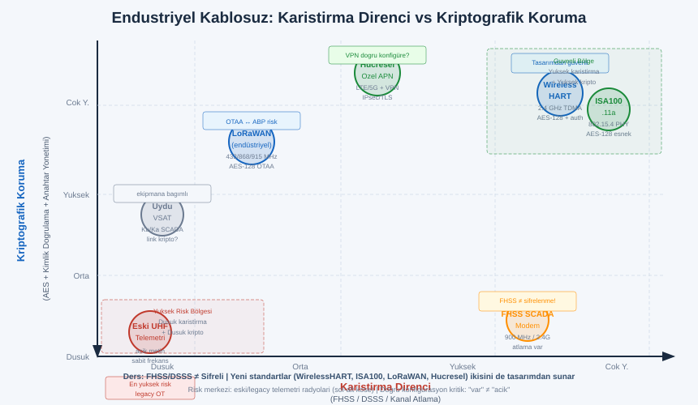
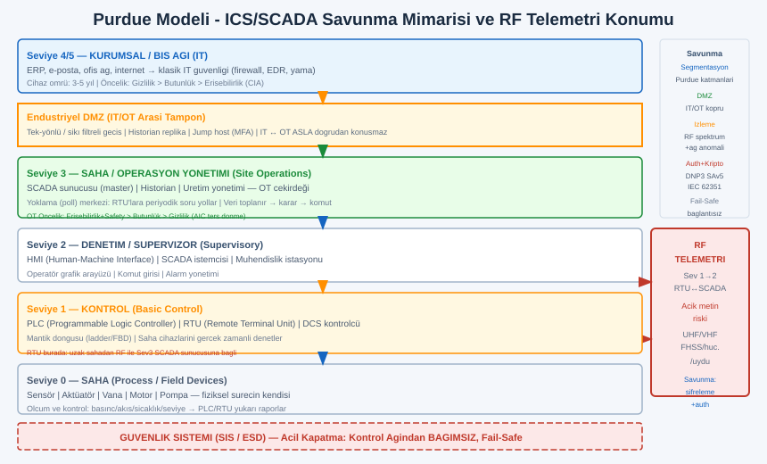
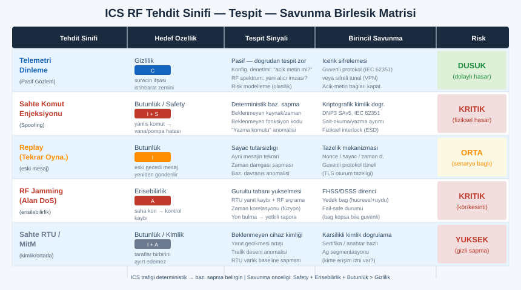

# SIGINT EL KİTABI — BÖLÜM 31: SCADA, ENDÜSTRİYEL KONTROL SİSTEMLERİ VE TELEMETRİ RF'İ

## Kritik Altyapının Görünmez Omurgası — Endüstriyel Kablosuz, Telemetri Protokolleri, Saldırı Yüzeyi ve Derinlemesine Savunma

> Amaç: Önceki bölümler RF'in fiziğini (Bölüm 1), donanımını (Bölüm 2), yön bulmayı (Bölüm 3), demodülasyonu (Bölüm 4), kısa menzilli/IoT spektrumunu (Bölüm 16), GNSS'i (Bölüm 10), uydu haberleşmesini (Bölüm 11), aktif RF tehditlerini ve karşı-önlemleri (Bölüm 13), saldırı taksonomisini (Bölüm 23) ve güncel zafiyet manzarasını (Bölüm 24) işledi. Bu bölüm bunların hepsinin en yüksek bahisli buluşma noktasını ele alır: kritik altyapının ve endüstriyel kontrol sistemlerinin (ICS/SCADA) RF omurgası. Bir su arıtma tesisinin uzak pompa istasyonu, bir doğalgaz boru hattının kilometrelerce ötedeki vana telemetrisi, bir enerji şebekesinin saha RTU'su veya bir akıllı sayaç ağı — bunların büyük kısmı, görünmez bir radyo bağı üzerinden konuşur. Bu bölümün hedefi bir saldırganın icra reçetesi değil; bir ICS/OT güvenlik uzmanının, kritik altyapı koruma analistinin ve savunma mühendisinin bu omurgayı tanıması, risklerini modellemesi, tehdidi tespit etmesi ve dayanıklı bir mimari kurmasıdır.

> Yasal ve etik çerçeve (bu bölümün tamamı için bağlayıcı): Kritik altyapıya ve endüstriyel kontrol sistemlerine yönelik herhangi bir yetkisiz müdahale, dünyanın hemen her ülkesinde en ağır suç kategorilerindendir; çünkü sonucu yalnızca veri kaybı değil, doğrudan can güvenliği, çevre felaketi ve toplumsal hizmet kesintisidir. Bir su şebekesinin, bir enerji sisteminin, bir boru hattının veya bir demiryolu sinyalizasyonunun telemetri/kontrol bağına izinsiz erişmek, sahte komut göndermek, dinlemek veya karıştırmak Türkiye'de TCK 243 (bilişim sistemine yetkisiz erişim), TCK 244 (sistemi engelleme/bozma, veriyi değiştirme), elektronik haberleşme mevzuatı (BTK) ve kritik altyapı koruma düzenlemeleri kapsamında ağır yaptırımlara tabidir; uluslararası düzeyde ITU Telsiz Tüzüğü ve sektörel düzenlemelerle de örtüşür. Bu metin bilinçli olarak **hiçbir** operasyonel saldırı reçetesi vermez: hiçbir sahte komut enjeksiyon adımı, hiçbir protokol istismar parametresi, hiçbir karıştırıcı yapımı, hiçbir RTU/PLC ele geçirme talimatı. Anlatılan saldırı yüzeyi yalnızca **kavramsal taksonomi + tespit + savunma** düzeyindedir; amaç savunmacının tehdidi tanıyıp karşısına doğru kontrolü koymasıdır. Tüm alıştırmalar yalnızca kendi/eğitim ortamında, kendi cihazlarında veya yazılı yetkili bir test kapsamında yapılmalıdır. Belirli protokol davranışları, frekans tahsisleri ve yasal sınırların güncel hali kendi sürümünüzden ve ulusal mevzuattan **teyit edilmelidir**; bu kitap hukuki danışmanlık değildir.

---

## İÇİNDEKİLER

1. [SCADA/ICS Nedir: PLC, RTU, HMI, DCS ve İzolasyon Varsayımının Tarihi](#1)
2. [IT ve OT Farkı: Neden Endüstriyel Güvenlik Bambaşka Bir Disiplindir](#2)
3. [RF'in ICS'teki Rolü: Uzak Saha Telemetrisi ve İzole RTU Haberleşmesi](#3)
4. [Endüstriyel Kablosuz Teknolojiler: Frekans, Kullanım, Güvenlik Durumu](#4)
   - 4.1 [Lisanslı/Lisanssız Telemetri Radyoları (UHF/VHF, 900 MHz, 2.4 GHz)](#4-1)
   - 4.2 [WirelessHART ve ISA100.11a (Süreç Otomasyonu)](#4-2)
   - 4.3 [Endüstriyel Zigbee / IEEE 802.15.4](#4-3)
   - 4.4 [Özel SCADA Radyo Modemleri ve FHSS Telemetri](#4-4)
   - 4.5 [Mikrodalga Nokta-Nokta Link](#4-5)
   - 4.6 [Uydu SCADA (VSAT) ve Hücresel Endüstriyel (Özel APN, NB-IoT/LTE-M)](#4-6)
   - 4.7 [Endüstriyel LoRaWAN](#4-7)
5. [Endüstriyel Protokoller (RF Taşıma Üzerinde): Modbus, DNP3, IEC 60870-5](#5)
6. [Sektörel Kullanım: Enerji, Su, Petrol-Gaz, Demiryolu, Bina, AMI](#6)
7. [Saldırı Yüzeyi ve Risk (Prensip + Tespit + Savunma)](#7)
8. [Gerçek-Dünya Olay Sınıfları (Kavramsal)](#8)
9. [Savunma Mimarisi: Purdue Modeli, Segmentasyon ve Derinlemesine Savunma](#9)
10. [RF Spektrum İzleme ve Anomali/Davranış Tespiti (ICS Bağlamı)](#10)
11. [Standartlar ve Çerçeveler: IEC 62443, NIST SP 800-82](#11)
12. [Tehdit → Tespit → Savunma Birleşik Matrisi](#12)
13. [Alıştırmalar (Yasal, Kendi/Eğitim Ortamı)](#13)
14. [Kapanış: ICS Savunmacı Zihniyeti, Etik ve Çapraz Referans](#14)

---

<a id="1"></a>
## 1. SCADA/ICS Nedir: PLC, RTU, HMI, DCS ve İzolasyon Varsayımının Tarihi

Endüstriyel kontrol sistemleri (ICS, Industrial Control Systems), fiziksel bir süreci — bir vanayı açıp kapamak, bir pompanın hızını ayarlamak, bir trafonun yükünü dengelemek, bir tren makasını çevirmek — ölçüp denetleyen bilgisayar ve haberleşme sistemlerinin tümüne verilen şemsiye addır. SCADA (Supervisory Control and Data Acquisition, Denetleyici Kontrol ve Veri Toplama) bu şemsiyenin en yaygın mimarilerinden biridir ve özellikle **coğrafi olarak dağıtık** süreçlerde (boru hatları, su şebekeleri, elektrik dağıtımı) baskındır. ICS'i doğru savunmak için önce onun yapı taşlarını ve — en kritiği — hangi tarihsel varsayımla tasarlandığını anlamak gerekir.

### Temel bileşenler

| Bileşen | Açılım | İşlevi | RF ile ilişkisi |
|---|---|---|---|
| PLC | Programmable Logic Controller | Saha cihazlarını gerçek zamanlı denetleyen endüstriyel bilgisayar; mantık döngüsünü (ladder/FBD) çalıştırır | Genellikle tesis içi kablolu; uzak sahada bazen RF telemetri üzerinden bağlı |
| RTU | Remote Terminal Unit | Uzak/izole sahadaki sensör-aktüatörü toplayıp merkeze ileten birim | Sıklıkla RF (telsiz modem, hücresel, uydu) üzerinden konuşur — bu bölümün kalbi |
| HMI | Human-Machine Interface | Operatörün süreci izleyip komut verdiği grafik arayüz | Kontrol merkezinde; saha bağı RF olabilir |
| DCS | Distributed Control System | Tek bir tesis içinde (rafineri, santral) yoğun, sürekli süreç kontrolü | Çoğunlukla kablolu fieldbus; kablosuz saha cihazları eklenir |
| Historian | — | Süreç verisini zaman serisi olarak arşivleyen veritabanı | Telemetriden beslenir; analiz/anomali tabanı |
| Master/SCADA sunucusu | — | Tüm RTU'ları "yoklayan" (poll) ve veri toplayan merkez | Saha bağının diğer ucu |

SCADA mimarisinin klasik topolojisi bir **master-uzak** ilişkisidir: merkezdeki SCADA sunucusu (master) periyodik olarak sahadaki RTU'ları yoklar, durum verisini toplar ve gerektiğinde kontrol komutu gönderir. Aradaki taşıma katmanı çoğu zaman bir RF bağıdır.

```
   KLASİK SCADA TOPOLOJİSİ (master-uzak, RF taşımalı)

   ┌──────────────────────┐
   │   KONTROL MERKEZİ     │
   │  ┌────────┐ ┌──────┐  │
   │  │ SCADA  │ │ HMI  │  │
   │  │ master │ │      │  │
   │  └───┬────┘ └──────┘  │
   │      │ Historian      │
   └──────┼─────────────────┘
          │  (yoklama / poll)
     ╔════╧════╗  RF taşıma (telsiz modem / hücresel / uydu / mikrodalga)
     ║  RADYO  ║
     ╚════╤════╝
   ┌──────┼───────────┬───────────────┐
   │      │           │               │
 ░░▼░░  ░░▼░░       ░░▼░░           ░░▼░░
 RTU-1  RTU-2       RTU-3           RTU-N
  │       │           │               │
 vana   pompa       trafo           sayaç/sensör
 (saha) (saha)      (saha)          (saha)
```

### İzolasyon varsayımının tarihi: neden eski sistemler güvensiz "doğdu"

ICS güvenliğinin en kritik tarihsel gerçeği şudur: bu sistemlerin büyük kısmı, **fiziksel izolasyon varsayımıyla** tasarlandı. 1970'ler-1990'lar arasında SCADA/DCS mimarileri kurulurken hâkim düşünce şuydu: "Bu sistem dış dünyaya bağlı değil; özel bir telsiz bağı veya kapalı bir seri hat üzerinden çalışıyor; kimse buraya erişemez, o halde haberleşmeyi güvenli kılmaya (şifreleme, kimlik doğrulama) gerek yok." Bu varsayım, mühendislik açısından makuldü çünkü o dönemde:

- Saha bağları gerçekten özel (proprietary) telsiz protokolleriydi; "güvenlik belirsizlikten gelir" (security through obscurity) işe yarar görünüyordu.
- Protokoller (Modbus, DNP3'ün erken sürümleri, IEC 60870-5) **performans, güvenilirlik ve gerçek zamanlılık** için optimize edildi — gecikmesi düşük, basit, deterministik olmaları öncelikliydi; şifreleme ek yük ve gecikme demekti.
- Saldırgan modeli yok denecek kadar dardı: tehdit "doğal arıza" ve "operatör hatası" idi, "uzaktan kötü niyetli aktör" değil.

Bu tasarım mirası bugün ICS güvenliğinin **temel açığıdır**: pek çok eski (legacy) saha cihazı ve protokolü, açık metin (cleartext) konuşur, kimlik doğrulaması yoktur veya çok zayıftır, ve onlarca yıl ömür biçilerek kurulduğu için hâlâ sahadadır. Bir kurumsal IT sunucusu 5 yılda değişirken, bir saha RTU'su veya PLC'si 20-30 yıl hizmet verebilir. Dolayısıyla "izolasyon varsayımıyla doğmuş" bir sistem, izolasyon ortadan kalktığında (uzaktan erişim, hücresel modem, IT/OT yakınsaması ile) **çıplak** kalır.

> Mühendislik sezgisi: ICS güvenliğinin kökü tek cümlede toplanır — "bu sistemler güvensiz değil, izole varsayılarak güvenliği hiç tasarlanmamış sistemlerdir; ve izolasyon artık çoğu yerde bir efsanedir." Savunmacının ilk işi, bu varsayımın hangi noktalarda çöktüğünü (her uzaktan erişim, her hücresel modem, her IT/OT köprüsü) haritalamaktır.

Çapraz referans: Protokollerin neden açık metin tasarlandığı ve kimlik doğrulama eksikliğinin yarattığı sınıf, Bölüm 24'teki (güncel zafiyet manzarası) "tasarım kararı kaynaklı zafiyet" ve Bölüm 13'teki (RF tehdit) "tekrar edilebilen ve doğrulanmayan şey güvenli değildir" dersinin endüstriyel kardeşidir.

---

<a id="2"></a>
## 2. IT ve OT Farkı: Neden Endüstriyel Güvenlik Bambaşka Bir Disiplindir

ICS'i savunmaya çalışan birçok analist, klasik IT (bilgi teknolojisi) güvenliği reflekslerini doğrudan uygulamaya çalışır ve başarısız olur. Çünkü operasyonel teknoloji (OT, Operational Technology) dünyası, IT'den hem öncelik sıralaması hem de fiziksel sonuçları açısından temelden farklıdır. Bu farkı içselleştirmeden RF telemetri savunması da doğru kurulamaz.

### Önceliklerin tersine dönmesi: CIA vs AIC

IT güvenliğinde klasik öncelik sırası **gizlilik → bütünlük → erişilebilirlik** (Confidentiality, Integrity, Availability — CIA) şeklindedir; en değerli şey veridir. OT'de bu sıra çoğu zaman **tersine döner**: erişilebilirlik ve güvenlik (safety) önce gelir, çünkü sistemin durması veya yanlış davranması fiziksel zarar doğurur.

| Boyut | IT (klasik) | OT/ICS |
|---|---|---|
| Birincil öncelik | Gizlilik (veri sızmasın) | Güvenlik (safety) + erişilebilirlik (süreç durmasın) |
| "Kötü gün" tanımı | Veri ihlali, fidye | Patlama, taşkın, elektrik kesintisi, can kaybı |
| Yama döngüsü | Sık, hızlı (haftalar) | Nadir, planlı duruş gerektirir (aylar/yıllar); "çalışan sisteme dokunma" |
| Cihaz ömrü | 3-5 yıl | 15-30 yıl (legacy norm) |
| Yeniden başlatma | Kabul edilebilir | Çoğu zaman kabul edilemez (süreç kesintisi) |
| Gerçek zamanlılık | Esnek | Katı (deterministik, ms düzeyi gecikme kritik) |
| Anti-virüs/EDR | Standart | Sık sık desteklenmez/yasak (üretici sertifikasyonu, gerçek zaman riski) |
| Trafik karakteri | Değişken, insan kaynaklı | Tekrarlayan, deterministik, makineden makineye (M2M) |

### Bunun savunma için pratik sonuçları

1. **"Hemen yama" çoğu zaman mümkün değildir.** Bir kurumsal sunucuyu gece yeniden başlatmak normaldir; bir su pompası kontrolcüsünü kritik bir anda yeniden başlatmak taşkına yol açabilir. Bu yüzden ICS savunması, yamaya ek olarak **telafi edici kontrollere** (segmentasyon, izleme, erişim kısıtı) ağır yaslanır.

2. **Tarama bile tehlikeli olabilir.** Klasik IT'de agresif bir port taraması zararsızdır; hassas bir eski PLC'de aynı tarama, cihazı kilitleyebilir veya süreci bozabilir. ICS'te aktif tarama yerine **pasif gözlem** (trafik dinleme, RF spektrum izleme) tercih edilir — bu, bu kitabın savunma duruşuyla doğal olarak örtüşür.

3. **Trafiğin deterministik oluşu bir hediyedir.** OT trafiği insan değil makine kaynaklı olduğundan son derece düzenli ve tahmin edilebilirdir: aynı master, aynı RTU'ları, aynı periyotla yoklar; mesaj boyları ve fonksiyon kodları dar bir kümeye sığar. Bu, anomali tespitini IT'ye göre **çok daha etkili** kılar — bir "baseline" kurmak görece kolaydır ve sapmalar belirgindir (Bölüm 10).

4. **Fiziksel sonuç, tehdit modelini değiştirir.** Bir RF telemetri olayının sonucu "bir paket kayboldu" değil, "bir vana yanlış konumda kaldı" olabilir. Bu yüzden ICS'te **güvenli durum (fail-safe / fail-secure)** tasarımı, salt bir BT konusu değil, mühendislik güvenliği (safety engineering) konusudur.

> Mühendislik sezgisi: IT'de "veriyi koru" düşünürsün; OT'de "süreci ve insanı koru, sonra veriyi" düşünürsün. RF telemetri savunmasında bu, şu önceliğe çevrilir: bağ kesilse bile sistem güvenli kalmalı (erişilebilirlik+safety), komut sahtelenememeli (bütünlük), ve ancak bundan sonra içerik gizlenmeli (gizlilik). Bölüm 13'teki dayanıklılık merdivenini ICS'e taşırken sıralama bilinçli olarak değişir.

Çapraz referans: CIA üçlüsünün kablosuz saldırı yüzeyine eşlenmesi Bölüm 23'te detaylıdır; ICS'te bu üçlünün **AIC**'ye dönmesi, oradaki taksonominin endüstriyel uyarlamasıdır.

---

<a id="3"></a>
## 3. RF'in ICS'teki Rolü: Uzak Saha Telemetrisi ve İzole RTU Haberleşmesi

ICS'in büyük kısmı tesis içinde kablolu konuşur (Ethernet/IP, seri fieldbus, optik). RF, devreye **kablonun ekonomik veya fiziksel olarak imkânsız** olduğu yerde girer. RF'in ICS'teki rolünü anlamak, neden bu kadar yaygın ve neden bir saldırı yüzeyi olduğunu açıklar.

RF telemetrinin tipik kullanım gerekçeleri:

- **Coğrafi dağıtıklık:** Bir su şebekesinin pompa istasyonları, bir doğalgaz hattının vana odaları veya bir elektrik dağıtım ağının trafoları onlarca/yüzlerce kilometreye yayılmıştır. Her birine kablo çekmek pratik değildir; bir telsiz modem veya hücresel bağ çok daha ucuzdur.
- **Erişilemez/hareketli sahalar:** Dağ başındaki bir tekrarlayıcı (repeater), açık denizdeki bir platform, hareketli bir demiryolu aracı — kablo mümkün değil.
- **Geçici/yedek bağ:** Kablolu bağın yedeği olarak veya geçici kurulumlarda RF hızlı çözümdür.

```
   RF'in ICS'teki TİPİK rolleri

   (a) NOKTA-NOKTA: merkez ── RF ── tek uzak RTU
       (boru hattı vana odası gibi)

   (b) NOKTA-ÇOK NOKTA: merkez ── RF ──┬── RTU-1
                                       ├── RTU-2
                                       └── RTU-N   (su şebekesi tipik)

   (c) AĞ/MESH: tekrarlayıcılarla menzil uzatma
       merkez ── RF ── repeater ── RF ── uzak RTU kümesi
       (geniş coğrafya, dağ/engel arkası)

   (d) AMI (sayaç): yoğun çok-nokta toplama
       binlerce sayaç ── RF ── toplayıcı(DCU) ── omurga ── merkez
```

RF bağının bir ICS'te taşıdığı iki tür yük vardır ve ikisinin de risk profili farklıdır:

1. **Telemetri (izleme/durum):** Sahadan merkeze akan ölçüm verisi (basınç, akış, sıcaklık, durum). Bunun ifşası (dinleme) bir gizlilik/istihbarat riskidir — saldırgan sürecin nasıl çalıştığını öğrenir.
2. **Kontrol (komut):** Merkezden sahaya akan komutlar (vanayı aç, pompayı durdur, ayar değerini değiştir). Bunun sahtelenmesi (spoofing) veya bozulması (jamming) doğrudan fiziksel/güvenlik riskidir — en yüksek bahis budur.

İzole RTU haberleşmesinin kritik özelliği, çoğu zaman bu RTU'nun **fiziksel olarak korumasız** bir sahada (kilitli ama uzak bir kabin, bir saha dolabı) bulunmasıdır. Bu, hem fiziksel erişim riskini hem de RF bağının "kimse dinlemiyor/karıştırmıyor" varsayımının zayıflığını gündeme getirir.

> Mühendislik sezgisi: RF, ICS'e "kabloyu götüremediğin yere ulaş" özgürlüğü verir; ama aynı anda "izolasyon varsayımını" fiziksel olarak yıkar. Çünkü bir radyo bağı, tanımı gereği havadadır ve dinlenebilir, karıştırılabilir, taklit edilebilir (Bölüm 13). Savunmacı her RF telemetri bağını "tesisin dışına uzanan, izlenmesi gereken bir kapı" olarak görmelidir.

---

<a id="4"></a>
## 4. Endüstriyel Kablosuz Teknolojiler: Frekans, Kullanım, Güvenlik Durumu



ICS sahasında karşılaşılan kablosuz teknolojiler geniş bir yelpazedir. Aşağıdaki büyük tablo hepsini tek bakışta konumlandırır; ardından her aile ayrı ele alınır. Frekanslar **bölgeye göre değişir** ve ulusal tahsis planından (Bölüm 8) teyit edilmelidir; "tipik" değerler verilmiştir.

| Teknoloji | Tipik frekans/bant | Birincil ICS kullanımı | Tipik güvenlik durumu (savunmacı notu) |
|---|---|---|---|
| Lisanslı UHF/VHF telemetri | 138-174, 400-470 MHz (bölgesel) | Uzun menzilli SCADA telemetri, RTU yoklama | Eski kurulumlarda sık şifresiz; lisanslı bant girişimi azaltır ama kriptoyu sağlamaz |
| Lisanssız ISM telemetri | 433/868/915 MHz, 2.4 GHz | Kısa-orta menzil saha bağı | Modele göre değişir; ucuz modemler zayıf/şifresiz olabilir |
| 169 MHz (Avrupa sayaç) | 169 MHz | AMI/uzak okuma (bölgesel) | Standart bağımlı; teyit edilmeli |
| WirelessHART | 2.4 GHz (IEEE 802.15.4 PHY) | Süreç otomasyonu saha sensörleri | Tasarımdan AES-128 + ağ anahtarı; görece olgun güvenlik |
| ISA100.11a | 2.4 GHz (802.15.4 PHY) | Süreç otomasyonu (esnek) | Tasarımdan AES-128; güvenlik özellikleri yapılandırmaya bağlı |
| Endüstriyel Zigbee | 2.4 GHz (+ bazı sub-GHz) | Sensör ağları, bina/altyapı | AES-128 var ama anahtar yönetimi/varsayılan anahtar zafiyeti tarihsel sorun |
| Özel SCADA radyo modemi (FHSS) | 900 MHz / 2.4 GHz ISM (sık) | Çok-nokta telemetri, repeater ağları | FHSS girişim/karıştırmaya direnç verir; şifreleme ürüne göre değişir |
| Mikrodalga nokta-nokta | 6-80 GHz lisanslı/lisanssız | Yüksek bant genişliği omurga (SCADA backhaul) | Yönlü/dar hüzme; fiziksel müdahale zor ama şifreleme link ekipmanına bağlı |
| Uydu SCADA (VSAT) | Ku/Ka/C bandı | Çok uzak/izole saha (boru hattı, deniz) | Bölüm 11; link şifreleme ekipmana bağlı, gecikme yüksek |
| Hücresel endüstriyel (özel APN) | LTE/5G bantları | Geniş alan RTU/uzak izleme | Özel APN + VPN ile güçlü olabilir; yanlış yapılandırma açık bırakır |
| NB-IoT / LTE-M | LTE bantları | Düşük güç, çok sayıda sensör/sayaç | Operatör güvenliği + uygulama katmanı şifreleme şart |
| Endüstriyel LoRaWAN | 433/868/915 MHz | Düşük güç geniş alan telemetri | AES-128 var; anahtar provizyonu (OTAA) doğru yapılmalı |

### Genel savunmacı okuması

Bu tablodan üç yapısal gerçek çıkar. **Birincisi:** "yeni" tasarlanmış endüstriyel kablosuz standartları (WirelessHART, ISA100.11a, LoRaWAN, çağdaş hücresel) güvenliği **tasarımdan** (by design) içerir — genellikle AES-128 şifreleme ve bir kimlik doğrulama mekanizması. **İkincisi:** asıl risk, on yıllar önce kurulmuş **eski telemetri radyolarında** ve onların taşıdığı açık-metin protokollerdedir (Bölüm 5). **Üçüncüsü:** güvenlik özelliği "var olması" ile "doğru yapılandırılması" aynı şey değildir — varsayılan anahtarlar, zayıf provizyon ve yanlış APN/VPN yapılandırması, tasarımdan güvenli bir teknolojiyi bile açık bırakabilir.

<a id="4-1"></a>
### 4.1 Lisanslı/Lisanssız Telemetri Radyoları (UHF/VHF, 900 MHz, 2.4 GHz)

Endüstriyel telemetri radyosu, SCADA'nın en klasik RF aracıdır. İki büyük kategoriye ayrılır:

- **Lisanslı bant telemetri (tipik UHF/VHF):** Operatör, düzenleyiciden bir frekans tahsisi alır ve o frekansta yayın yapar. Avantajı, bandın "temiz" olması (yetkisiz girişim yasal olarak yasak, dolayısıyla pratikte daha az kalabalık) ve uzun menzildir. **Güvenlik açısından kritik nokta:** lisanslı olmak, bandın **girişimden** korunmasına yardımcı olur ama **kriptografik güvenlik sağlamaz** — yani sinyal hâlâ dinlenebilir ve eski protokollerde açık metindir. Lisans, "bu frekansta sadece ben yayın yapmalıyım" hukuki hakkıdır; "kimse beni dinleyemez/taklit edemez" garantisi değildir.

- **Lisanssız ISM telemetri (433/868/915 MHz, 2.4 GHz):** Lisans gerektirmez, ucuz ve hızlı kurulur; ama band paylaşımlıdır (girişim ve doğal yoğunluk olasıdır) ve güç/görev döngüsü sınırlamalarına tabidir. Güvenlik tamamen ekipmana bağlıdır; ucuz modemler tarihsel olarak zayıf veya hiç şifreleme sunmamıştır.

Savunmacı için telemetri radyolarının üç zayıflık ekseni: (1) **açık metin** taşıma (protokol şifrelenmemişse içerik ve komut görünür), (2) **kimlik doğrulama yokluğu** (sahte verici "ben RTU'yum/master'ım" diyebilir), (3) **karıştırmaya açıklık** (özellikle sabit frekanslı, FHSS olmayan modemler — Bölüm 13 J/S mantığı).

<a id="4-2"></a>
### 4.2 WirelessHART ve ISA100.11a (Süreç Otomasyonu)

Süreç endüstrisi (rafineri, kimya, su) için iki büyük endüstriyel kablosuz standart geliştirilmiştir ve ikisi de güvenliği ciddiye alarak tasarlanmıştır:

- **WirelessHART (IEC 62591):** HART saha cihazı protokolünün kablosuz uzantısıdır; 2.4 GHz'de IEEE 802.15.4 fiziksel katmanı üzerine kurulu, **TDMA tabanlı, kanal atlamalı (channel hopping)** bir mesh ağdır. Güvenlik tasarımdan gelir: **AES-128** şifreleme, ağ anahtarı (network key) ve birleşim (join) anahtarı ile katmanlı kimlik doğrulama, ve mesaj bütünlüğü. Kanal atlama, hem girişime hem de dar bantlı karıştırmaya yapısal direnç verir (Bölüm 13 FHSS savunması).

- **ISA100.11a (IEC 62734):** Benzer biçimde 802.15.4 PHY üzerine kurulu, daha esnek/yapılandırılabilir bir endüstriyel kablosuz standardı. Yine **AES-128** tabanlı şifreleme ve kimlik doğrulama içerir; güvenlik seviyesi yapılandırmaya bağlı olarak ayarlanabilir.

Savunmacı notu: Bu standartlar, "endüstriyel kablosuzun güvensiz olması zorunlu değildir" tezinin kanıtıdır. Doğru yapılandırıldıklarında (anahtarların güvenli provizyonu, varsayılanların değiştirilmesi) güçlü bir taban sunarlar. Risk, **yanlış yapılandırma**, **anahtar yönetimi hataları** ve **eski/yamalanmamış cihaz yazılımları**ndan gelir.

<a id="4-3"></a>
### 4.3 Endüstriyel Zigbee / IEEE 802.15.4

Zigbee (802.15.4 üzerine kurulu mesh), endüstriyel ve bina otomasyonunda sensör ağları için kullanılır. **AES-128 şifreleme yeteneği vardır**, ancak Zigbee'nin tarihsel güvenlik sorunları büyük ölçüde **anahtar yönetiminden** kaynaklanır: bazı eski profillerde/cihazlarda varsayılan (well-known) ağ anahtarları, birleşim sırasında anahtarın zayıf korunması veya cihazların fabrika varsayılan anahtarlarla sahaya çıkması raporlanmıştır. Detaylı zafiyet bağlamı Bölüm 16 (kısa menzilli/IoT) ve Bölüm 24'tedir (zafiyet manzarası).

Savunmacı için ders: Zigbee'de "şifreleme var mı" değil, "**hangi anahtar, nasıl provizyonlandı, varsayılan mı**" sorusu belirleyicidir — bu, Bölüm 13'teki "rolling etiketi koruma garantisi değildir, koruma kriptografik kalitede ve doğru anahtar yönetimindedir" dersinin endüstriyel kardeşidir.

<a id="4-4"></a>
### 4.4 Özel SCADA Radyo Modemleri ve FHSS Telemetri

Pek çok SCADA kurulumu, üreticiye özel (proprietary) radyo modemleri kullanır. Bunların önemli bir kısmı **frekans atlamalı yayılı spektrum (FHSS)** çalışır — özellikle 900 MHz ve 2.4 GHz ISM bantlarında. FHSS'in iki faydası vardır: (1) paylaşımlı bantta girişime direnç, (2) Bölüm 13'te anlatıldığı gibi dar bantlı karıştırmaya yapısal direnç (saldırgan tek frekansı tutamaz).

Ancak savunmacının iki kritik noktayı ayırması gerekir:

- **FHSS bir karıştırma-direnci mekanizmasıdır, bir şifreleme mekanizması değildir.** Atlama dizisi (hopping sequence) gizli olsa bile, bu "veri gizliliği" sağlamaz; bazı eski özel modemler atlamalı ama **açık metin** taşır. Yani FHSS, içeriği değil, bağın kesintisizliğini korur.
- **"Özel/proprietary" güvenlik garantisi değildir.** Belirsizlikten gelen güvenlik (security through obscurity) ICS'te tarihsel olarak çok kez kırılmıştır; bir protokol "özel" diye dinlenemez/anlaşılamaz değildir.

Savunmacı notu: Bir SCADA modeminin gerçek güvenlik durumunu değerlendirirken iki ayrı soru sorulmalı: (a) bağ **karıştırmaya** ne kadar dirençli (FHSS/DSSS var mı)? (b) içerik ve komut **kriptografik olarak** korunuyor mu (şifreleme + kimlik doğrulama)? İkisi farklı eksenlerdir ve biri diğerini ima etmez.

<a id="4-5"></a>
### 4.5 Mikrodalga Nokta-Nokta Link

Mikrodalga nokta-nokta linkler (tipik 6-80 GHz), SCADA omurgasında (backhaul) yüksek bant genişliği taşımak için kullanılır — örneğin uzak bir kontrol merkezini bir şebeke düğümüne bağlamak. Yönlü, dar hüzmeli antenler kullanırlar; bu, **fiziksel müdahaleyi zorlaştıran** bir özelliktir: hüzmenin dışından dinlemek veya araya girmek, geniş açılı sistemlere göre çok daha zordur (hüzmenin tam yoluna fiziksel erişim gerekir). Yine de "yönlülük şifreleme yerine geçmez" — link ekipmanının kendi şifrelemesi (varsa) ayrı bir konudur ve doğrulanmalıdır.

Savunmacı notu: Mikrodalga linkler ayrıca **erişilebilirlik** açısından hava koşullarına (yağmur sönümlemesi, özellikle yüksek frekanslarda) ve fiziksel hizalama bozulmasına duyarlıdır; bu, bir saldırı vektöründen çok bir **dayanıklılık/yedeklilik** tasarım konusudur.

<a id="4-6"></a>
### 4.6 Uydu SCADA (VSAT) ve Hücresel Endüstriyel (Özel APN, NB-IoT/LTE-M)

**Uydu SCADA (VSAT):** Çok uzak, izole veya hareketli sahalar (uzun boru hatları, açık deniz platformları, uzak madenler) için uydu bağı kullanılır. Bölüm 11'de uydu haberleşmesinin geniş bağlamı verilmiştir. ICS açısından kritik noktalar: uydu bağı **geniş bir coğrafyaya yayılan footprint** nedeniyle dinleme açısından geniş bir alanda erişilebilir olabilir; link şifrelemesi tamamen ekipmana/operatöre bağlıdır; ve yüksek gecikme (özellikle GEO uydularda) gerçek zamanlı kontrol için bir tasarım kısıtıdır. Tarihsel olarak bazı VSAT/uydu SCADA kurulumlarının güvenlik zayıflıkları akademik literatürde tartışılmıştır (içerik şifrelemesi eksikliği gibi); somut kayıtlar Bölüm 11 ve 24'ten **teyit edilmeli**.

**Hücresel endüstriyel (özel APN):** Modern SCADA'nın en yaygın geniş-alan çözümlerinden biri, hücresel modemlerdir. Doğru kurulduğunda güçlüdür: operatörle anlaşılan **özel/kapalı APN** (Access Point Name) ile RTU'lar genel internete çıkmadan, izole bir özel ağ üzerinden merkeze bağlanır; üzerine **VPN/IPsec** eklenir. Yanlış kurulduğunda ise — örneğin RTU modemi genel internete açık, yönetim arayüzü varsayılan parolayla erişilebilir, ya da APN izolasyonu yoksa — ciddi bir uzaktan erişim yüzeyi açılır. Hücresel çekirdek tarafı zafiyetleri (SS7/Diameter vb.) Bölüm 20 ve 24'tedir.

**NB-IoT / LTE-M:** Çok sayıda düşük güçlü sensör/sayaç için optimize edilmiş hücresel teknolojilerdir (geniş kapsama, düşük veri hızı, uzun pil ömrü). Güvenlik açısından: operatör katmanı kimlik doğrulaması vardır, ancak **uygulama katmanı uçtan-uca şifreleme** ayrıca sağlanmalıdır — cihazdan uygulama sunucusuna kadar veri korunmazsa, ara noktalarda ifşa riski kalır.

<a id="4-7"></a>
### 4.7 Endüstriyel LoRaWAN

LoRaWAN, düşük güçlü geniş alan ağı (LPWAN) olarak endüstriyel telemetride (uzak sensör, sayaç, çevresel izleme) yaygınlaşmıştır; tipik olarak 433/868/915 MHz bölgesel ISM bantlarında çalışır. Güvenlik **tasarımdan AES-128** içerir: iki anahtar hiyerarşisi (ağ oturum anahtarı ve uygulama oturum anahtarı) ile hem ağ hem uygulama katmanı korunur. Kritik nokta **provizyon yöntemidir**: OTAA (Over-The-Air Activation) dinamik anahtar üretimiyle ABP'ye (Activation By Personalization, statik anahtar) göre daha güvenli kabul edilir. LoRaWAN'ın bilinen zayıflık bağlamı (anahtar yönetimi, eski sürüm sorunları) Bölüm 16 ve 24'tedir.

Savunmacı notu: LoRaWAN, doğru provizyonla (OTAA, benzersiz anahtarlar, güncel sürüm) güçlüdür; risk yine **statik/varsayılan anahtarlar** ve **zayıf provizyon**dan gelir — endüstriyel kablosuzun tekrarlayan dersi.

> Mühendislik sezgisi: Endüstriyel kablosuz teknolojileri iki eksende sınıfla — (1) **karıştırma-direnci** (FHSS/DSSS/kanal-atlama var mı?), (2) **kriptografik koruma** (şifreleme + kimlik doğrulama + doğru anahtar yönetimi var mı?). Yeni standartlar (WirelessHART, ISA100, LoRaWAN, çağdaş hücresel) ikisini de tasarımdan sunar; eski telemetri radyoları çoğu zaman ikisinden de yoksundur. Riskin merkezi her zaman eski/legacy katmandadır.

---

<a id="5"></a>
## 5. Endüstriyel Protokoller (RF Taşıma Üzerinde): Modbus, DNP3, IEC 60870-5

RF bağı sadece bir **taşıma katmanıdır**; üzerinde taşınan asıl içerik endüstriyel protokollerdir. Bu protokollerin güvenlik karakteri, ICS RF güvenliğinin kalbidir — çünkü çoğu, izolasyon varsayımıyla (Bölüm 1) ve **performans/güvenilirlik öncelikli** olarak tasarlandığından, **şifreleme ve kimlik doğrulamadan yoksun** doğmuştur.

| Protokol | Köken/kullanım | Tarihsel güvenlik durumu | Güvenli varyant / savunma |
|---|---|---|---|
| Modbus (RTU/ASCII/TCP) | En yaygın, basit master-slave; PLC/RTU | **Açık metin, kimlik doğrulama yok, oturum yok** — tasarımdan güvensiz | Modbus/TCP Security (TLS tabanlı) varyantı; ağ segmentasyonu; salt-okuma ayrımı |
| DNP3 | Kuzey Amerika enerji/su SCADA; master-outstation | Erken sürümler açık metin; daha sağlam veri modeli ama kimlik doğrulama yoktu | **DNP3 Secure Authentication (SAv5, IEC 62351-5)** kimlik doğrulama ekler |
| IEC 60870-5 (101/104) | Avrupa enerji/altyapı SCADA telekontrol | Temel sürümler açık metin/kimlik doğrulamasız | **IEC 62351** ailesi (TLS, kimlik doğrulama) ile güvenlik katmanı |
| IEC 61850 (MMS/GOOSE/SV) | Modern trafo merkezi otomasyonu | GOOSE/SV gerçek-zaman, tasarımda kimlik doğrulama sınırlı | IEC 62351 ile imza/kimlik doğrulama; segmentasyon kritik |
| Özel/proprietary telemetri | Üreticiye özel SCADA modem protokolleri | Çoğu açık metin; "obscurity" güvenlik sanılır | Üretici güvenli sürümü; üstte VPN/şifreli tünel |

### Neden bu protokoller tarihsel olarak güvensiz

Üç yapısal sebep, ICS protokol güvensizliğinin kökünü açıklar:

1. **Şifreleme yok (gizlilik):** Modbus, DNP3'ün ve IEC 60870-5'in temel sürümleri veriyi açık metin taşır. Bağı dinleyen biri, register değerlerini, fonksiyon kodlarını ve komutları okuyabilir — sürecin nasıl çalıştığına dair istihbarat elde eder.
2. **Kimlik doğrulama yok (bütünlük/kaynak):** Protokol, bir mesajın "gerçekten yetkili master'dan mı geldiğini" doğrulamaz. İlkesel olarak, bağa erişebilen herhangi bir aktörün gönderdiği "geçerli formatlı" bir komut, cihaz tarafından meşru kabul edilebilir. (Bu, **prensip** düzeyinde bir gerçektir; bu metin hiçbir enjeksiyon adımı/parametresi vermez.)
3. **Tazelik/oturum yok (replay):** Çoğu temel sürümde nonce/sayaç/zaman damgası yoktur; bu, kavramsal olarak replay tarzı tekrarları engelleyecek bir mekanizmanın bulunmadığı anlamına gelir (Bölüm 13 replay dersi).

```
   ESKİ ICS PROTOKOLÜ vs GÜVENLİ VARYANT (kavramsal)

   ESKİ (örn. temel Modbus/DNP3/IEC101)      GÜVENLİ (62351/SAv5/Security)
   ┌───────────────────────────┐            ┌───────────────────────────┐
   │ açık metin payload         │            │ TLS / şifreli tünel        │
   │ kimlik doğrulama YOK       │            │ kriptografik kimlik doğr.  │
   │ tazelik (nonce) YOK        │            │ tazelik + bütünlük (MAC)   │
   │ "format doğruysa kabul"    │            │ "kaynak+tazelik doğruysa"  │
   └───────────────────────────┘            └───────────────────────────┘
   dinleme: içerik görünür                   dinleme: içerik gizli
   spoofing: ilkesel olarak açık             spoofing: kimlikle engellenir
   replay: ilkesel olarak açık               replay: tazelikle engellenir
```

### Savunmacının protokol stratejisi

Önemli bir gerçek: eski protokolleri sahadan bir gecede sökmek mümkün değildir (Bölüm 2, OT yama gerçeği). Bu yüzden savunma çok katmanlıdır:

- **Mümkünse güvenli varyanta geç:** DNP3 SAv5, IEC 62351, Modbus/TCP Security — protokolün kendi güvenli sürümü.
- **Değilse, sarmala (wrap):** Eski protokolü değiştiremiyorsan, onu şifreli bir tünelin (VPN/IPsec/TLS) içinden taşı; açık metin protokol, şifreli zarfın içinde gider.
- **Her durumda segmentle ve izle:** Protokolü güçlendiremesen bile, ona kimin ulaşabileceğini ağ segmentasyonuyla sınırla (Bölüm 9) ve trafiği izle (Bölüm 10) — OT trafiğinin deterministik olması, anomaliyi belirgin kılar.
- **Salt-okuma/yaz ayrımı:** Telemetri (okuma) ile kontrol (yazma) yollarını mümkünse ayır; izleme verisi akarken kontrol komutu yolunu en sıkı denetlenen, mümkünse tek yönlü diyot/sıkı filtreli bir kanala koy.

> Mühendislik sezgisi: ICS protokol güvenliğinin özü — "eski protokol açık konuşur; onu ya güvenli sürümüyle değiştir, ya şifreli bir zarfa koy, ama her hâlükârda kim ulaşabilir diye segmentle ve sürekli dinle." Protokolü değiştiremediğin yerde bile, ona giden yolu daraltabilir ve izleyebilirsin.

Çapraz referans: Açık metin/kimlik doğrulama yokluğunun yarattığı saldırı sınıfları Bölüm 23 (taksonomi) ve Bölüm 13'te (replay/spoofing prensibi); güvenli varyantların kriptografik temeli Bölüm 6'dadır.

---

<a id="6"></a>
## 6. Sektörel Kullanım: Enerji, Su, Petrol-Gaz, Demiryolu, Bina, AMI

ICS RF'i her kritik altyapı sektöründe farklı şekilde görünür. Savunmacının sektörel bağlamı bilmesi, riskin nerede yoğunlaştığını ve hangi düzenlemenin geçerli olduğunu anlamasını sağlar.

| Sektör | Tipik RF kullanımı | Yüksek-bahis varlık | Sektörel savunma notu |
|---|---|---|---|
| Enerji (şebeke) | RTU telemetri, FAN (Field Area Network), DA/DMS, PMU zaman (GNSS) | Trafo koruması, kesici kontrolü, şebeke senkronu | GNSS zaman bağımlılığı (Bölüm 10/13); IEC 61850/62351; yedek zaman |
| Su / atıksu | Pompa/vana RTU, depo seviyesi, kalite sensörü telemetrisi | İçme suyu kalitesi, taşkın/taşma kontrolü | Açık metin telemetri sık; fiziksel saha güvenliği; fail-safe vana |
| Petrol-gaz boru hattı | Uzun mesafe RTU, vana odası, kaçak tespiti; uydu/hücresel | Basınç/akış kontrolü, acil kapatma (ESD) | ESD bağımsızlığı kritik; uydu/hücresel + yedek; çevre/yangın riski |
| Demiryolu sinyalizasyonu | GSM-R / FRMCS, ETCS (Avrupa tren kontrol) | Tren ayrımı, makas, sinyal | GSM-R kapanıyor → FRMCS (5G tabanlı) geçişi; safety-kritik |
| Bina yönetim sistemi (BMS/BACS) | Kablosuz HVAC, aydınlatma, erişim sensörleri | Konfor, enerji, bazen güvenlik sistemleri | BACnet/Modbus sık; IT/OT yakınsama riski; segmentasyon |
| Akıllı sayaç (AMI) | Mesh/LPWAN/hücresel sayaç ağı, DCU toplama | Faturalama bütünlüğü, uzaktan kesme yeteneği | Geniş ölçek; uzaktan kesme = yüksek bahis; AES + provizyon |

### Sektörel vurgular

- **Enerji:** En kritik RF bağımlılığı çoğu zaman **konum değil, zamandır**. Faz ölçüm birimleri (PMU), koruma röleleri ve olay sıralaması GNSS zaman damgasına dayanabilir; GNSS karıştırma/sahteleme (Bölüm 10/13), yanlış olay sıralamasına ve koruma hatasına yol açabilir. Savunma: yerel holdover osilatör (atomik/OCXO), ağ tabanlı zaman (PTP/IEEE 1588), çoklu GNSS takımyıldızı.

- **Su/atıksu:** Sıklıkla **en az bütçeli ve en eski** ICS kurulumlarına sahiptir; uzak pompa istasyonları açık-metin telemetri ve fiziksel olarak korumasız kabinler içerebilir. Yüksek bahis, içme suyu kalitesi ve taşkın kontrolüdür. Tarihsel olarak su sektörü olayları (genellikle zayıf uzaktan erişim ve fiziksel/parola hijyeni kaynaklı) kavramsal ders kaynağıdır (Bölüm 8).

- **Petrol-gaz boru hattı:** Çok uzun mesafeler nedeniyle uydu ve hücresel ağırlıklıdır. Kritik tasarım ilkesi, **acil kapatma sisteminin (ESD)** SCADA telemetrisinden **bağımsız ve fail-safe** olmasıdır — telemetri kesilse bile güvenlik fonksiyonu çalışmalıdır.

- **Demiryolu sinyalizasyonu:** Avrupa'da **GSM-R** (demiryoluna özel GSM) uzun yıllar ETCS tren kontrolünün taşıma katmanı oldu; GSM-R artık ömrünü tamamlıyor ve yerine **FRMCS (Future Railway Mobile Communication System, 5G tabanlı)** geçiyor. Bu safety-kritik bir alandır; bağ bütünlüğü ve erişilebilirliği doğrudan tren güvenliğiyle ilgilidir. Güncel geçiş takvimi ve teknik detaylar **teyit edilmelidir**.

- **Akıllı sayaç altyapısı (AMI):** Ölçeği nedeniyle (milyonlarca uç) ayrı bir kategoridir. En yüksek bahis, **uzaktan kesme (remote disconnect)** yeteneğidir — bir saldırgan kavramsal olarak buna erişebilseydi, geniş ölçekli hizmet kesintisi riski doğardı. Bu yüzden AMI'de AES şifreleme, güçlü anahtar provizyonu ve kesme komutunun ekstra korunması kritiktir.

> Mühendislik sezgisi: Her sektörde "en yüksek bahisli RF bağımlılığını" tek soruyla bul — "bu bağ kesilirse veya sahtelenirse, fiziksel dünyada en kötü ne olur?" Enerjide bu çoğu zaman zaman senkronu, suda kalite/taşkın, boru hattında basınç/ESD, demiryolunda tren ayrımı, AMI'de kitlesel kesmedir. Savunma önceliği bu cevaba göre dizilir.

---

<a id="7"></a>
## 7. Saldırı Yüzeyi ve Risk (Prensip + Tespit + Savunma)

Bu başlık, ICS RF bağına yönelik tehdit sınıflarını ele alır. **Mutlak sınır:** her sınıf yalnızca **prensip (neden mümkün) + tespit (nasıl görülür) + savunma (nasıl önlenir)** üçlüsünde işlenir. Bu metin hiçbir operasyonel adım, parametre, araç komutu veya icra reçetesi vermez. Amaç, savunmacının bir anomaliyi gördüğünde "bu hangi sınıfa benziyor ve karşısına ne koyarım" diyebilmesidir.

### 7.1 Telemetri dinleme (komut/durum ifşası)

- **Prensip:** Açık-metin telemetri (Bölüm 5) bir RF bağında taşınıyorsa, pasif bir alıcı içeriği okuyabilir — register değerleri, fonksiyon kodları, süreç durumu ve komutlar görünür hale gelir. Bu doğrudan bir hasar vermez ama saldırgana **süreç istihbaratı** sağlar: sistemin nasıl çalıştığını, hangi komutların ne yaptığını öğrenmek, sonraki adımların ön koşuludur.
- **Tespit:** Saf dinleme pasiftir ve doğrudan tespiti zordur; ancak savunmacı bunu **risk** olarak modeller — "bu bağda açık metin akıyor mu?" sorusu, bir konfigürasyon denetimiyle (kendi sisteminde) cevaplanır. Ayrıca RF spektrum izleme (Bölüm 10) ile beklenmedik yeni alıcı/anten varlığı dolaylı işaret olabilir.
- **Savunma:** İçerik şifrelemesi (güvenli protokol varyantı veya şifreli tünel), açık-metin bağların önceliklendirilmiş kapatılması.

### 7.2 Sahte komut enjeksiyonu (spoofing)

- **Prensip:** Kimlik doğrulamasız bir protokolde (Bölüm 5), bir cihaz "format olarak geçerli" bir komutun kaynağını doğrulayamaz. İlkesel olarak bu, bağa erişebilen yetkisiz bir aktörün gönderdiği komutun meşru sanılabileceği anlamına gelir. **Bu, tasarımsal bir prensip ifadesidir; bu metin nasıl yapılacağına dair hiçbir adım/parametre vermez.** Fiziksel sonucu en ağır sınıftır (vananın yanlış konumu, pompanın yanlış durumu).
- **Tespit:** OT trafiğinin deterministik oluşu burada güçlü bir avantajdır (Bölüm 2/10): beklenmeyen bir kaynaktan, beklenmeyen bir zamanda, beklenmeyen bir fonksiyon kodu/yazma komutu, baseline'dan sapar ve anomali tespitiyle yakalanabilir. "Yazma komutlarının" izlenmesi özellikle değerlidir.
- **Savunma:** Kriptografik kimlik doğrulama (DNP3 SAv5, IEC 62351), ağ segmentasyonu (kim ulaşabilir), salt-okuma/yazma ayrımı, ve kritik komutlar için sahada bağımsız doğrulama/kilitleme (fiziksel interlock).

### 7.3 Replay (tekrar oynatma)

- **Prensip:** Tazelik mekanizması (nonce/sayaç/zaman damgası) olmayan bir protokolde, kavramsal olarak daha önce gözlemlenmiş geçerli bir mesaj tekrar geçerli olabilir (Bölüm 13 replay dersi). Eski ICS protokollerinin çoğu bu mekanizmadan yoksundur.
- **Tespit:** Aynı mesajın beklenmedik tekrarı, sayaç/zaman tutarsızlığı; deterministik baseline'dan sapma.
- **Savunma:** Tazelik (nonce/sayaç/zaman damgası) içeren güvenli protokol varyantı; şifreli oturum (tünel) tazelik de sağlar.

### 7.4 RF jamming ile saha-DoS (erişilebilirlik saldırısı)

- **Prensip:** Bir RF telemetri bağı, Bölüm 13'teki J/S fiziğine tabidir: alıcıya yapay enerji basılarak bağ bozulabilir. ICS'te bunun sonucu "internet yavaşladı" değil, **sahanın körleşmesi** veya **kontrol kaybı**dır — merkez RTU'yu yoklayamaz, RTU komut alamaz. Bu, kritik altyapı **erişilebilirliğine** yönelik en doğrudan RF tehdididir.
- **Tespit:** Bölüm 13'teki karıştırma tespiti tam olarak burada uygulanır — gürültü tabanı izleme, spektral anomali, sistem-tarafı çapraz doğrulama (RTU bağlantı kaybıyla RF gürültü yükselişinin zaman korelasyonu), ve kaynak için yön bulma. ICS bağlamında "telemetri kesintisiyle eşzamanlı RF gürültü sıçraması" güçlü bir karıştırma işaretidir.
- **Savunma:** FHSS/DSSS telemetri (karıştırma direnci), **yedek bağ** (örneğin birincil hücresel + yedek uydu veya farklı frekans), ve en kritiği **bağ-kaybı güvenli durumu** (fail-safe): bağ kesilince sistem "son değeri körü körüne kullanmak" yerine tanımlı güvenli bir duruma geçer.

### 7.5 Sahte RTU / Ortadaki-adam (MitM)

- **Prensip:** Kimlik doğrulaması zayıf bir bağda, bir aktör kavramsal olarak "ben RTU'yum" veya "ben master'ım" konumuna geçmeyi (impersonation) veya iki taraf arasına girmeyi (MitM) deneyebilir; kimlik doğrulanmadığı için taraflar karşıdakini ayırt edemeyebilir. Detaylı MitM taksonomisi Bölüm 23'tedir.
- **Tespit:** Beklenmeyen cihaz kimliği/adresi, beklenmeyen yanıt gecikmesi (MitM ek gecikme ekleyebilir), trafik deseni anomalisi.
- **Savunma:** Karşılıklı (mutual) kriptografik kimlik doğrulama, sertifika/anahtar tabanlı kimlik, segmentasyon.

```
   ICS RF SALDIRI YÜZEYİ — SINIF × HEDEF × SAVUNMA (özet)

   sınıf                | hedeflediği     | birincil savunma
   ---------------------|-----------------|---------------------------
   telemetri dinleme    | gizlilik        | içerik şifreleme
   sahte komut (spoof)  | bütünlük/safety | kriptografik kimlik doğr.
   replay               | bütünlük        | tazelik (nonce/sayaç/zaman)
   RF jamming (DoS)     | erişilebilirlik | FHSS + yedek bağ + fail-safe
   sahte RTU / MitM     | bütünlük/kimlik | karşılıklı kimlik doğr.
```

> Mühendislik sezgisi: ICS RF tehditlerini, korudukları güvenlik özelliğine göre rafla — dinleme gizliliği, spoofing/replay/MitM bütünlüğü ve kimliği, jamming erişilebilirliği hedefler. Her birinin savunması Bölüm 13'teki dayanıklılık merdiveninden gelir; ICS'te sıralama "önce safety/erişilebilirlik+bütünlük, sonra gizlilik" olarak okunur.

Yasal uyarı: Yukarıdaki sınıfların hiçbiri icra için anlatılmamıştır. Kritik altyapıya yönelik dinleme, sahte komut, replay, jamming veya MitM **ağır suçtur ve doğrudan can/çevre güvenliği tehdididir**. Savunmacının alanı: kendi sisteminde bu sınıflara karşı dayanıklılık tasarlamak, pasif tespit kurmak ve yetkili makama raporlamaktır.

---

<a id="8"></a>
## 8. Gerçek-Dünya Olay Sınıfları (Kavramsal)

Kritik altyapıya yönelik gerçek olaylar, savunmacı için ders kaynağıdır — ama **bu metin hiçbir olayın teknik icra detayını vermez**; yalnızca **olay sınıflarını ve onlardan çıkan savunma derslerini** kavramsal düzeyde ele alır. Amaç, "bu kategori gerçektir, o halde şu savunmayı ciddiye al" demektir.

| Olay sınıfı (kavramsal) | Tipik kök neden teması | Savunmacı dersi |
|---|---|---|
| Uzaktan erişim suistimali | Zayıf/açık uzaktan erişim (VPN/RDP/modem), zayıf parola, çok faktör yokluğu | Uzaktan erişimi sıkılaştır (MFA, en az ayrıcalık, denetim); IT/OT köprüsünü daralt |
| Kontrol arayüzü manipülasyonu | Kimlik doğrulamasız/zayıf HMI veya protokol erişimi | Segmentasyon + kimlik doğrulama + yazma yolu sıkı denetimi |
| Şebeke kesintisi (RF/ağ bağı) | Bağ kaybı/karıştırma veya ağ saldırısı sonucu körlük | Yedek bağ + fail-safe + spektrum izleme |
| Tedarik zinciri / kötü yazılım | Güncelleme/yazılım zincirinden bulaşma | Yazılım bütünlüğü, imzalı güncelleme, ağ izolasyonu |
| Fiziksel saha ihlali | Korumasız uzak kabin/RTU'ya fiziksel erişim | Fiziksel güvenlik + kurcalama tespiti (tamper) + yerel kimlik |

### Kavramsal olay derslerinin ortak çekirdeği

Kritik altyapı olaylarının kamuya açık analizlerinden çıkan **tutarlı** ders şudur: çoğu olayın kökü, egzotik bir "RF büyüsü" değil, **temel hijyen eksiklikleridir** — zayıf veya paylaşılan parolalar, internete açık bırakılmış uzaktan erişim arayüzleri, çok faktörlü kimlik doğrulamanın yokluğu, segmente edilmemiş düz ağlar ve fiziksel olarak korumasız sahalar. RF tarafı, bu zincirde genellikle bir **erişilebilirlik tehdidi** (karıştırma/bağ kaybı) veya açık-metin protokolün yarattığı **ifşa/spoofing zemini** olarak rol oynar.

ICS güvenliği topluluğunda olayların yapısını ve taktiklerini sınıflandırmak için **MITRE ATT&CK for ICS** çerçevesi kullanılır; bu çerçeve, taktik ve teknikleri (keşif, ilk erişim, icra, etki vb.) ICS bağlamında haritalandırır ve savunmacının tehdit modellemesi için ortak bir dil sağlar. Bunun kullanımı ve genel CTI bağlamı Bölüm 23/24'te ve serinin CTI rehberlerindedir (somut taktik eşlemeleri için kaynaktan **teyit edilmeli**).

> Mühendislik sezgisi: Kritik altyapı olaylarından çıkan en sağlam ders egzotik değil, sıkıcıdır — "olayların çoğu temel hijyenden (parola, uzaktan erişim, segmentasyon, fiziksel güvenlik) sızar; RF genellikle erişilebilirlik tehdidi veya açık-metin zemini olarak devreye girer." Önce temeli sağlamlaştır, sonra RF'e özgü kontrolleri ekle.

Yasal/kaynak notu: Belirli olayların adları, atıfları ve teknik detayları için bu metin bilinçli olarak spesifik iddia vermez; doğru, atıflı bilgi için ICS-CERT/CISA advisory'leri, üretici bültenleri ve akademik analizler **teyit edilmeli**. Bu bölüm asla uydurma olay/atıf üretmez; şüpheyi açıkça yazar.

---

<a id="9"></a>
## 9. Savunma Mimarisi: Purdue Modeli, Segmentasyon ve Derinlemesine Savunma



ICS savunmasının omurgası, **mimaridir** — tek tek kontroller değil, sistemin nasıl katmanlara bölündüğü. Bu mimarinin referans çerçevesi, on yıllardır endüstride standart olan **Purdue Modeli** (Purdue Enterprise Reference Architecture'dan türeyen ISA-95 katman modeli) ve onun üzerine kurulan **derinlemesine savunma** (defense-in-depth) yaklaşımıdır.

### Purdue Modeli: katmanlı ICS mimarisi

Purdue modeli, bir endüstriyel tesisi fiziksel sürece yakınlıklarına göre seviyelere ayırır. Temel fikir: en kritik (fiziksel sürece en yakın) katmanlar, kurumsal IT'den **kademeli olarak izole** edilmeli; her katman arası geçiş denetlenmeli.

```
   PURDUE MODELİ (ISA-95 katmanları) — ICS SEGMENTASYON REFERANSI

   ┌──────────────────────────────────────────────────────────────┐
   │ Seviye 5/4 — KURUMSAL / İŞ AĞI (IT)                            │
   │  ERP, e-posta, internet, ofis  ──  klasik IT güvenliği         │
   ├──────────────────────────────────────────────────────────────┤
   │   ░░░░░░░░░  DMZ (Endüstriyel DMZ — IT/OT arası tampon) ░░░░░  │
   │   tek yönlü/sıkı filtreli geçiş; Historian replica, jump host  │
   ├──────────────────────────────────────────────────────────────┤
   │ Seviye 3 — SAHA/OPERASYON YÖNETİMİ (Site Operations)          │
   │  SCADA sunucu, Historian, üretim yönetimi  ── OT çekirdeği     │
   ├──────────────────────────────────────────────────────────────┤
   │ Seviye 2 — DENETİM/SÜPERVİZÖR (Supervisory)                   │
   │  HMI, SCADA istemci, mühendislik istasyonu                     │
   ├──────────────────────────────────────────────────────────────┤
   │ Seviye 1 — KONTROL (Basic Control)                            │
   │  PLC, RTU, DCS kontrolcü  ── mantık döngüsü                    │
   ├──────────────────────────────────────────────────────────────┤
   │ Seviye 0 — SAHA (Process)                                     │
   │  sensör, aktüatör, vana, motor  ── fiziksel süreç              │
   ├──────────────────────────────────────────────────────────────┤
   │ ===  GÜVENLİK (SAFETY) SİSTEMİ — SIS  ===                     │
   │  Acil kapatma (ESD); MUMKUNSE kontrol ağından BAĞIMSIZ        │
   └──────────────────────────────────────────────────────────────┘

   RF telemetri bağları tipik olarak Seviye 1-2'deki RTU/PLC ile
   Seviye 3'teki SCADA arasında, ya da uzak Seviye 0/1 sahalarını
   merkeze bağlamak için devreye girer — yani izlenecek "kapı" burada.
```

### Endüstriyel DMZ: IT/OT köprüsünün kalbi

Modern ICS güvenliğinin en önemli tek yapısal kontrolü, IT ile OT arasına yerleştirilen **endüstriyel DMZ**'dir (demilitarized zone). Amaç: kurumsal IT ile OT çekirdeğinin **asla doğrudan** konuşmaması. Veri (örneğin Historian raporları) DMZ'deki bir aracı/replika üzerinden, sıkı filtrelenmiş ve mümkünse tek yönlü akar. Uzaktan erişim, DMZ'deki sıkı denetimli bir atlama sunucusu (jump host) üzerinden, çok faktörlü kimlik doğrulamayla yapılır. Bu, Bölüm 8'deki olay derslerinin (uzaktan erişim suistimali) doğrudan yapısal cevabıdır.

### RF telemetrinin Purdue modelindeki yeri

RF telemetri bağları, savunma açısından **modelin dış sınırına uzanan kollardır**. Bir uzak RTU (Seviye 0/1) RF üzerinden merkeze (Seviye 3) bağlandığında, bu bağ fiziksel olarak tesisin güvenli perimetresinin **dışına** çıkar. Savunmacı bu bağı şöyle ele almalı:

- Bağı kendi başına bir **güvenilmeyen segment** olarak modelle; üzerine kriptografik koruma (şifreli tünel/güvenli protokol) ekle.
- RF bağının uçlarındaki cihazları (RTU, saha modemi) Seviye 1 kontrol cihazları gibi sıkı yönet; varsayılan parolaları değiştir, yönetim arayüzünü sınırla.
- Bağı **izle** (Bölüm 10): hem ağ trafiği anomalisi hem RF spektrum tarafı.

### Derinlemesine savunma katmanları (ICS RF bağlamı)

```
   ICS RF DERİNLEMESİNE SAVUNMA (dıştan içe)

   ┌────────────────────────────────────────────────────────┐
   │ 6. FİZİKSEL GÜVENLİK (saha kabini, tamper, erişim)        │
   │  ┌──────────────────────────────────────────────────┐  │
   │  │ 5. AĞ SEGMENTASYONU (Purdue, DMZ, en-az-ayrıcalık)│  │
   │  │  ┌────────────────────────────────────────────┐  │  │
   │  │  │ 4. İZLEME/TESPİT (ağ anomali + RF spektrum) │  │  │
   │  │  │  ┌──────────────────────────────────────┐  │  │  │
   │  │  │  │ 3. KİMLİK DOĞR.+BÜTÜNLÜK (auth/MAC)  │  │  │  │
   │  │  │  │  ┌────────────────────────────────┐  │  │  │  │
   │  │  │  │  │ 2. ŞİFRELEME (tünel/güvenli proto)│ │  │  │  │
   │  │  │  │  │  ┌──────────────────────────┐  │  │  │  │  │
   │  │  │  │  │  │ 1. RF DAYANIKLILIK        │  │  │  │  │  │
   │  │  │  │  │  │  (FHSS/DSSS + yedek bağ + │  │  │  │  │  │
   │  │  │  │  │  │   fail-safe durum)        │  │  │  │  │  │
   │  │  │  │  │  └──────────────────────────┘  │  │  │  │  │
   │  │  │  │  └────────────────────────────────┘  │  │  │  │
   │  │  │  └──────────────────────────────────────┘  │  │  │
   │  │  └────────────────────────────────────────────┘  │  │
   │  └──────────────────────────────────────────────────┘  │
   └────────────────────────────────────────────────────────┘
        (hiçbir tek katman yeterli değil; güç katmanların birlikteliğinde)
```

| Katman | Mekanizma | Hangi tehdidi azaltır |
|---|---|---|
| RF dayanıklılık | FHSS/DSSS, yedek bağ, fail-safe durum | Jamming/DoS, bağ kaybı |
| Şifreleme | Güvenli protokol varyantı veya şifreli tünel | Telemetri dinleme (ifşa) |
| Kimlik doğrulama + bütünlük | DNP3 SAv5, IEC 62351, karşılıklı kimlik | Spoofing, replay, MitM |
| İzleme/tespit | Ağ anomali (pasif) + RF spektrum izleme | Tüm sınıflar (erken görü) |
| Ağ segmentasyonu | Purdue katmanları, endüstriyel DMZ, en az ayrıcalık | Yanal hareket, uzaktan erişim suistimali |
| Fiziksel güvenlik | Saha kabini kilidi, tamper sensörü, yerel kimlik | Fiziksel saha ihlali |

### Yedeklilik (redundancy) — erişilebilirliğin temeli

OT'de erişilebilirlik birincil önceliklerden biri olduğundan (Bölüm 2), yedeklilik bir savunma kadar bir güvenlik (safety) gereğidir:

- **Bağ yedekliliği:** Birincil RF bağına alternatif (farklı frekans, farklı teknoloji — örn. hücresel + uydu yedek).
- **Zaman yedekliliği:** GNSS zamanına yerel holdover (atomik/OCXO) ve ağ zamanı (PTP) yedeği (Bölüm 10/13).
- **Kontrol yedekliliği:** Kritik fonksiyonların (özellikle güvenlik/ESD) telemetriden bağımsız, yerel ve fail-safe çalışması.

> Mühendislik sezgisi: ICS savunma mimarisinin özü — "fiziksel sürece yaklaştıkça izolasyonu artır (Purdue), IT ile OT'yi asla doğrudan konuşturma (DMZ), her RF bağını tesis sınırının dışına uzanan güvenilmeyen bir kol olarak ele al, ve hiçbir varoluşsal/güvenlik fonksiyonunu tek bir bağa bağlama (yedeklilik + fail-safe)." Katmanlar tek tek değil, birlikte korur.

Çapraz referans: Segmentasyon ve en-az-ayrıcalık ilkesinin genel taksonomisi Bölüm 23'te; RF dayanıklılık (FHSS/DSSS/yedeklilik/fail-safe) Bölüm 13'te; GNSS zaman yedekliliği Bölüm 10'da derinlemesine işlenmiştir.

---

<a id="10"></a>
## 10. RF Spektrum İzleme ve Anomali/Davranış Tespiti (ICS Bağlamı)

Savunmanın gözü tespittir (Bölüm 13'teki ES fonksiyonu). ICS RF bağlamında tespit iki tamamlayıcı cepheden gelir ve ikisi de **pasiftir** — yalnızca dinler, hiçbir şey yaymaz; bu da onları yasal ve sürekli işletilebilir kılar.

### 10.1 RF spektrum gözlemi (fiziksel katman)

ICS sahalarında RF spektrum izleme, bir karıştırma/girişim olayını veya kaçak/anomali yayıcıyı erken yakalamanın temelidir. Bölüm 13'teki karıştırma tespiti tam olarak burada uygulanır; ICS'e özgü vurgular:

- **Baseline kurma:** Tesisin ilgili telemetri bantlarının (örn. lisanslı UHF telemetri frekansı, 900 MHz/2.4 GHz ISM) **normal** gürültü tabanı ve kullanım profili, uzun süreli pasif gözlemle çıkarılır. OT trafiğinin deterministik olması (Bölüm 2) bu baseline'ı belirgin ve kararlı kılar.
- **Kaçak/anomali yayıcı tespiti:** Beklenmeyen bir frekansta sürekli enerji, beklenmeyen bir yeni yayıcı imzası veya tahsisli bir bantta beklenmeyen davranış, anomali olarak işaretlenir (Bölüm 8'deki "beklenmedik bantta enerji = anomali" mantığı).
- **Karıştırma tespiti:** Gürültü tabanı yükselişi + spektral imza (barrage/spot/sweep — Bölüm 13) + **sistem-tarafı çapraz doğrulama** (RTU bağlantı kaybıyla RF gürültü sıçramasının zaman korelasyonu). ICS'te bu çapraz doğrulama özellikle güçlüdür: "saat X'te N RTU aynı anda yoklamaya yanıt vermedi VE aynı anda telemetri bandında gürültü tabanı sıçradı" güçlü bir karıştırma teşhisidir.
- **Yön bulma (DF):** Karıştırma/kaçak yayıcı doğrulandıktan sonra kaynağı yön bulmayla (Bölüm 3) konumlamak, **yetkili makama raporlama** için kritiktir. Savunmacının rolü tespit + raporlamadır; kaynağa müdahale yetki ister.

```
   ICS RF KARIŞTIRMA TESPİTİ — ÇOK KATMANLI FÜZYON

   (1) RF spektrum tarafı:  gürültü tabanı yükseldi mi? imza hangi aile?
            │
   (2) Sistem tarafı:       RTU'lar yanıt veremiyor mu? bağ kaybı var mı?
            │
            └──► ZAMAN KORELASYONU ──► "karıştırma adayı" güçlü teşhis
                        │
   (3) Yön bulma:       kaynağı konumla ──► YETKİLİ MAKAMA raporla
```

### 10.2 Ağ/davranış anomali tespiti (protokol katmanı)

ICS'te pasif ağ izleme (network monitoring), IT'ye göre **daha güçlü** çalışır çünkü trafik deterministiktir (Bölüm 2). Bir ICS-aware pasif izleme sistemi (üretici-bağımsız terimle "OT görünürlük/anomali tespiti") şunları yakalar:

| İzlenen davranış | Normal (baseline) | Anomali işareti |
|---|---|---|
| Yoklama (poll) periyodu | Sabit, deterministik | Beklenmeyen sıklık/zamanlama |
| Konuşan cihazlar (varlık keşfi) | Sabit master-RTU kümesi | Yeni/beklenmeyen cihaz veya adres |
| Fonksiyon kodları | Dar küme (çoğunlukla okuma) | Beklenmeyen yazma/kontrol komutu |
| Mesaj boyu/içerik | Dar dağılım | Beklenmeyen boy/değer aralığı |
| Yanıt gecikmesi | Tutarlı | Ani artış (olası MitM/araya girme) |

Kritik vurgu: ICS ağ izlemesi **pasif** olmalıdır. Aktif tarama (Bölüm 2) hassas eski cihazları bozabilir; bu yüzden ICS görünürlüğü, ağ trafiğini bir kopya port (SPAN/TAP) üzerinden **dinleyerek** kurulur — bu kitabın savunma duruşuyla doğal olarak örtüşür.

### 10.3 İki cephenin füzyonu

ICS RF güvenliğinde en güçlü tespit, **fiziksel katman (RF spektrum)** ile **protokol katmanı (ağ anomali)** gözlemlerinin füzyonudur. Bir örnek korelasyon: telemetri bandında gürültü tabanı sıçraması (RF) + aynı anda RTU yoklama yanıtlarının kesilmesi (ağ) = yüksek güvenilirlikli karıştırma teşhisi. Ya da: beklenmedik bir yazma komutu (ağ) + o anda beklenmedik bir yeni RF yayıcı imzası (RF) = sahte cihaz/enjeksiyon şüphesi. Tek başına her sinyal "şüphe", füzyonda "teşhis" düzeyine çıkar.

> Mühendislik sezgisi: ICS RF tespitinin gücü iki cephenin füzyonundadır — "RF spektrumda ne oluyor?" + "ağ protokolünde ne oluyor?" Deterministik OT trafiği, baseline'ı kararlı kılar; sapmalar belirgindir. Her iki cephe de pasif olmalı: dinle, korelele, yetkiliye raporla — asla aktif tarama veya karşı yayın yapma.

Çapraz referans: Karıştırma tespitinin fiziksel temeli ve yön bulma Bölüm 13 ve Bölüm 3'te; gürültü tabanı/waterfall okuma becerisi Bölüm 2'de; trafik analizi/anomali mantığı Bölüm 23/24'tedir.

---

<a id="11"></a>
## 11. Standartlar ve Çerçeveler: IEC 62443, NIST SP 800-82

ICS güvenliği olgun bir disiplindir ve onlarca yıllık birikim, iki büyük referans çerçevesinde toplanır. Savunmacı bu çerçeveleri "uyulacak bir liste" olarak değil, **olgunluğu yapılandıran bir harita** olarak kullanır.

### IEC 62443 (endüstriyel otomasyon ve kontrol sistemleri güvenliği)

IEC 62443, ICS/IACS (Industrial Automation and Control Systems) güvenliği için en kapsamlı uluslararası standart ailesidir (ISA/IEC ortak çalışması). Temel kavramları savunma mimarisini doğrudan şekillendirir:

- **Zone ve Conduit (bölge ve kanal):** Sistem, güvenlik gereksinimleri benzer varlıkların gruplandığı **bölgelere** (zone) ayrılır; bölgeler arası tüm haberleşme tanımlı **kanallar** (conduit) üzerinden geçer ve denetlenir. Bu, Purdue segmentasyonunun (Bölüm 9) standartlaştırılmış halidir. **Bir RF telemetri bağı, tipik olarak bir conduit'tir** — yani bölgeler arası denetlenmesi gereken bir geçiş.
- **Security Level (SL, güvenlik seviyesi):** Her bölge/kanal için, korunması gereken tehdit yetkinliğine göre bir güvenlik seviyesi hedeflenir (kabaca: SL1 tesadüfi, SL2 basit kasıtlı, SL3 gelişmiş, SL4 ileri/kaynaklı saldırgan). Bu, "her şeyi en üst seviyede koru" yerine **risk-temelli** önceliklendirme sağlar.
- **Roller:** Standart, varlık sahibi (asset owner), entegratör (integrator) ve ürün tedarikçisi (product supplier) için ayrı gereksinimler tanımlar — güvenlik tek bir tarafın değil, zincirin sorumluluğudur.

### NIST SP 800-82 (ICS güvenliği rehberi)

NIST SP 800-82 (Guide to Operational Technology Security; güncel sürümler OT'yi kapsayacak biçimde genişlemiştir), özellikle ABD bağlamında ama küresel olarak yaygın kullanılan, **pratik** bir ICS/OT güvenlik rehberidir. ICS'in IT'den farklarını (Bölüm 2), risk yönetimini, ağ mimarisini (segmentasyon, DMZ), ve NIST güvenlik kontrol kataloğunun (SP 800-53) ICS'e uyarlanmasını ele alır. NIST Siber Güvenlik Çerçevesi (CSF) ile birlikte, "tanı-koru-tespit-yanıtla-kurtar" (Identify-Protect-Detect-Respond-Recover) fonksiyonlarını ICS'e taşır.

| Çerçeve | Odak | Savunmacı için değeri |
|---|---|---|
| IEC 62443 | IACS güvenliği (uçtan uca, roller dahil) | Zone/conduit segmentasyonu, SL ile risk-temelli önceliklendirme |
| NIST SP 800-82 | OT güvenliği pratik rehberi | IT/OT farkı, mimari, kontrol uyarlaması |
| NIST CSF | Genel siber güvenlik fonksiyonları | Tanı-koru-tespit-yanıtla-kurtar çatısı |
| MITRE ATT&CK for ICS | Saldırgan taktik/teknik haritası | Tehdit modelleme ortak dili (Bölüm 8/23/24) |

Sektörel düzenlemeler de vardır ve bölgeye göre değişir (örneğin enerji sektöründe Kuzey Amerika'da NERC CIP; AB'de ağ ve bilgi sistemleri güvenliği düzenlemeleri/NIS2; ülkeye özgü kritik altyapı koruma mevzuatı). Hangi düzenlemenin bağlayıcı olduğu sektöre ve ülkeye göre değişir ve **teyit edilmelidir**.

> Mühendislik sezgisi: ICS standartlarını "uyum için doldurulan form" değil, "olgunluğu yapılandıran harita" olarak kullan — IEC 62443'ün zone/conduit'i sana her RF bağını bir denetlenecek kanal olarak gösterir; SL sana neyi ne kadar koruyacağını risk-temelli söyler; NIST SP 800-82 sana IT reflekslerini OT'ye nasıl uyarlayacağını öğretir. Çerçeveler, dağınık kontrolleri tutarlı bir mimariye bağlar.

Çapraz referans: Risk-temelli önceliklendirme ve tehdit modelleme dili Bölüm 23/24'te (taksonomi ve zafiyet manzarası) ve serinin CTI/MITRE rehberlerinde derinlemesine ele alınır.

---

<a id="12"></a>
## 12. Tehdit → Tespit → Savunma Birleşik Matrisi



Aşağıdaki birleşik matris, bölümün tüm ICS RF tehditlerini tek bir savunmacı referansında toplar. Her satır: tehdit (kavram), fiziksel/mantıksal temel, pasif tespit (ES), tasarımsal savunma (EP/mimari), ve yasal not. Bu tablo, bir olayla karşılaştığında hızlı yönlendirme içindir; hiçbir satırda savunmacının doğru cevabı "karşı saldırı" değildir.

| Tehdit (kavram) | Temel | Tespit (pasif) | Savunma (tasarım/mimari) | Yasal |
|---|---|---|---|---|
| Telemetri dinleme | Açık-metin protokol | Konfig denetimi; dolaylı RF gözlem | İçerik şifreleme (güvenli proto/tünel) | Yetkisiz dinleme suç |
| Sahte komut (spoof) | Kimlik doğrulama yok | Ağ anomali (beklenmeyen yazma/kaynak) | Kriptografik kimlik (SAv5/62351) + segmentasyon | Yetkisiz = ağır suç |
| Replay | Tazelik yok | Tekrar/sayaç tutarsızlığı | Tazelik (nonce/sayaç/zaman) | Yetkisiz = ağır suç |
| RF jamming (saha-DoS) | J/S fiziği (Bölüm 13) | Gürültü tabanı + bağ kaybı korelasyonu | FHSS/DSSS + yedek bağ + fail-safe | Karıştırma = suç + can riski |
| Sahte RTU / MitM | Zayıf/karşılıksız kimlik | Beklenmeyen cihaz/gecikme | Karşılıklı kimlik doğrulama | Yetkisiz = ağır suç |
| GNSS zaman saldırısı | Zayıf GNSS sinyali | C/N0 düşüşü + zaman tutarsızlığı | Holdover + PTP + çoklu GNSS (Bölüm 10) | Karıştırma/sahteleme = suç |
| Uzaktan erişim suistimali | Zayıf/açık erişim | Erişim/oturum anomali izleme | MFA + DMZ + en az ayrıcalık | Yetkisiz erişim = suç (TCK 243) |
| Fiziksel saha ihlali | Korumasız uzak RTU | Tamper sensörü, fiziksel denetim | Fiziksel güvenlik + yerel kimlik | İzinsiz erişim = suç |

### Manipülasyona açıklık hızlı ayrımı (ICS RF)

| Sistem profili | Açıklık | Belirleyici özellik |
|---|---|---|
| Eski açık-metin telemetri (Modbus/IEC101, kimlik doğrulama yok, sabit frekans) | Yüksek | Şifreleme/kimlik/karıştırma-direnci yok |
| FHSS modem ama açık-metin payload | Orta | Karıştırmaya dirençli ama içerik/komut korumasız |
| Güvenli varyant (DNP3 SAv5 / IEC 62351) + segmentasyon | Düşük | Kimlik + tazelik + bütünlük + denetimli kanal |
| WirelessHART/ISA100/çağdaş hücresel (özel APN+VPN) + izleme | Düşük | Tasarımdan kripto + doğru yapılandırma + görünürlük |

> Mühendislik sezgisi: Bu matris bir "ne yapayım" cetvelidir. Soldan sağa oku: tehdidi tanı → pasif olarak tespit et (RF + ağ füzyonu) → tasarımsal/mimari dayanıklılıkla savun (kripto + segmentasyon + yedeklilik + fail-safe + fiziksel) → yasal sınırı hatırla. ICS'te en yüksek bahis erişilebilirlik ve güvenliktir (safety); bu yüzden fail-safe ve yedeklilik her satırın gizli ortağıdır.

---

<a id="13"></a>
## 13. Alıştırmalar (Yasal, Kendi/Eğitim Ortamı)

Aşağıdaki alıştırmalar tamamen **yasal, pasif ve savunma odaklıdır**; yalnızca kendi cihazların, açık/yasal sinyaller ve kendi kurduğun bir eğitim/test ortamıyla sınırlıdır. Hiçbiri canlı bir kritik altyapıya, başkasının sistemine, yayın/karıştırmaya veya yetkisiz erişime izin vermez. Her birinde yasal sınır hatırlatılmıştır.

### A) Kendi çevrendeki telemetri-tarzı imzaları rtl_433 ile gözlemlemek (pasif)

Amaç: Kendi evindeki/çevrendeki düşük güçlü 433/868/900 MHz telemetri-tarzı yayıcıların (kendi akıllı sayaç okuma sinyalin — yasalsa, kendi kablosuz hava istasyonun, kendi sıcaklık/nem sensörlerin, kendi tire-pressure/sensör cihazların) imzasını tanımak ve "endüstriyel telemetri böyle bir şeydir" sezgisini kazanmak.

Adımlar (kavramsal, yalnızca dinleme):
1. Bir RTL-SDR ile (Bölüm 2) rtl_433 aracını çalıştırıp çevredeki yasal/açık ISM yayıcılarının çözümlenen mesajlarını gözle (sensör tipi, ID, değer).
2. Hangi cihazların **açık metin** yayın yaptığını (rtl_433 çözebiliyorsa içerik açıktır) gözlemle; bu, "endüstriyel telemetrinin neden ifşaya açık olabileceği" dersini somutlaştırır.
3. Bir cihazın yayın **periyodunu** ve imzasının kararlılığını not et — bu, deterministik telemetri baseline kavramının (Bölüm 10) elle deneyimidir.

Yasal sınır: Yalnızca açık/yasal yayınların **pasif gözlemi** ve yalnızca kendine ait cihazların analizi. Başkasının sayaç/sensör verisini hedefli toplamak, kaydını saklayıp ilişkilendirmek veya herhangi bir yayın/müdahale bu alıştırmanın dışındadır.

### B) Bir SCADA test ortamı (kendi PLC/simülatör) kurup savunma mimarisi tasarlamak

Amaç: Bölüm 9'daki savunma mimarisini soyuttan somuta indirmek; kendi izole eğitim ortamında bir SCADA mini-topolojisi kurup üzerine derinlemesine savunma tasarlamak.

Adımlar (kendi/izole ortam):
1. **Simülatör/kendi donanımın:** Açık kaynak bir PLC simülatörü veya kendi eğitim PLC'n/Raspberry Pi tabanlı bir RTU simülasyonu kur; bir Modbus/TCP simülatörü (master + slave) ile basit bir "tank seviyesi → pompa" döngüsü modelle. Her şey **kendi izole ağında** kalmalı.
2. **Önce güvensiz hali gözle:** Açık-metin Modbus trafiğini kendi ağında pasif olarak (kendi makinende, kendi trafiğini) izleyip register/fonksiyon kodlarının görünür olduğunu kendi gözünle gör — "neden açık metin risktir" dersi.
3. **Savunmayı tasarla ve uygula:** (a) trafiği bir VPN/TLS tüneline al (şifreleme katmanı), (b) ağı segmentlere böl (en azından mantıksal olarak master/saha ayrımı), (c) bir pasif izleme kur (kendi trafiğinde anomali baseline'ı), (d) bir "bağ-kaybı fail-safe" mantığı yaz (bağ kesilince pompa güvenli duruma geçsin).
4. **Test et:** Tüneli açıp kapatarak trafiğin gizlenip gizlenmediğini, bağı keserek fail-safe'in tetiklenip tetiklenmediğini gözle.

Yasal sınır: Tamamen kendi cihazların ve kendi izole ağın. Hiçbir adım canlı bir SCADA'ya, başkasının cihazına veya açık spektruma yönelik değildir. Bu bir **savunma tasarımı** egzersizidir; saldırı simülasyonu değil.

### C) Purdue modeli segmentasyon egzersizi (kâğıt üstü/diyagram)

Amaç: Bölüm 9'daki Purdue modelini ve IEC 62443 zone/conduit kavramını (Bölüm 11) gerçek bir senaryoya uygulama refleksi kazanmak.

Adımlar:
1. Hayali (veya kendi eğitim) bir tesis seç (örn. küçük bir su pompa istasyonu ağı: merkez + 3 uzak RTU, biri hücresel biri lisanssız telemetri).
2. Tüm varlıkları Purdue seviyelerine (0-3 + DMZ + kurumsal) yerleştir; her RF bağını bir **conduit** olarak işaretle.
3. Her conduit için sor: hangi yöne veri akmalı? hangi protokol? şifreli mi? kimlik doğrulamalı mı? hangi güvenlik seviyesini (SL) hedefliyorum? Eksikleri kırmızıyla işaretle.
4. Bir endüstriyel DMZ ekle ve "kurumsal IT ile OT çekirdeği asla doğrudan konuşmamalı" kuralını diyagramda uygula; uzaktan erişimi DMZ'deki bir jump host + MFA üzerinden çiz.
5. Çıktı: her RF bağının güvenlik durumunu ve eksik kontrolleri gösteren bir **savunma haritası**.

Amaç: Savunmanın tekil bir kontrol değil, **mimari bir disiplin** olduğunu içselleştirmek; her RF bağını "tesis sınırının dışına uzanan, denetlenecek bir kanal" olarak görme alışkanlığı kazanmak.

### D) Dayanıklılık denetimi: bir RF telemetri bağını Bölüm 13 merdiveniyle değerlendirmek

Amaç: Bölüm 13'teki dayanıklılık merdivenini (auth → tazelik → bütünlük → mesafe → yayma → yedeklilik) bir ICS RF bağına uygulamak.

Adımlar:
1. Bir RF telemetri senaryosu seç (kendi test ortamından veya kâğıt üstü tipik bir kurulum).
2. Sırayla sor: bağ **kimlik doğrulamalı** mı? **tazelik** (nonce/sayaç) var mı? **bütünlük** (MAC) korunuyor mu? **karıştırma direnci** (FHSS/DSSS) var mı? **yedek bağ + fail-safe** var mı?
3. Eksik basamakları ve "hangi tehdide açık" sütununu doldur; ICS önceliklerine göre (önce erişilebilirlik/safety + bütünlük) sırala.
4. Çıktı: bağın bir "dayanıklılık karnesi" ve önceliklendirilmiş iyileştirme listesi.

Amaç: ICS RF savunmasının "şifreleme var mı" tek sorusundan ibaret olmadığını; katmanlı, öncelik-sıralı bir denetim listesi olduğunu içselleştirmek.

> Tüm alıştırmalar için ortak sınır: kendi cihazların, kendi izole/eğitim ortamın, yalnızca pasif gözlem ve savunma tasarımı. Canlı kritik altyapıya, başkasının sistemine veya açık spektruma yönelik hiçbir aktif eylem — dinleme dahil hedefli toplama, yayın, karıştırma, erişim — bu alıştırmaların kapsamı dışındadır ve suçtur.

---

<a id="14"></a>
## 14. Kapanış: ICS Savunmacı Zihniyeti, Etik ve Çapraz Referans

### Kavram kartı

| Kavram | Bir cümlelik öz |
|---|---|
| SCADA/ICS | Fiziksel süreci ölçüp denetleyen sistemler; PLC/RTU/HMI/DCS yapı taşları |
| İzolasyon varsayımı | Eski ICS, "kimse erişemez" varsayımıyla güvenliği hiç tasarlanmadan doğdu; izolasyon artık çoğu yerde efsane |
| IT vs OT | IT'de gizlilik önce; OT'de güvenlik (safety) + erişilebilirlik önce; yama nadir, cihaz ömrü uzun |
| RF'in rolü | Kablonun ulaşmadığı yere uzanır ama izolasyon varsayımını fiziksel olarak yıkar |
| Endüstriyel kablosuz | İki eksen: karıştırma-direnci (FHSS/DSSS) ve kripto (şifreleme+kimlik); yeni standartlar ikisini sunar, eski radyolar yoksun |
| Endüstriyel protokoller | Modbus/DNP3/IEC 60870-5 tarihsel olarak açık metin/kimlik doğrulamasız; güvenli varyantlar (SAv5, 62351) var |
| Saldırı yüzeyi | Dinleme (gizlilik), spoof/replay/MitM (bütünlük), jamming (erişilebilirlik); hepsi prensip+tespit+savunma |
| Tespit | RF spektrum (fiziksel) + ağ anomali (protokol) füzyonu; pasif; deterministik OT trafiği baseline'ı kararlı kılar |
| Purdue modeli | Fiziksel sürece yaklaştıkça izolasyonu artıran katmanlı mimari; RF bağı = denetlenecek conduit |
| Endüstriyel DMZ | IT ile OT çekirdeği asla doğrudan konuşmamalı; tampon bölge |
| IEC 62443 / NIST 800-82 | ICS güvenliğini yapılandıran çerçeveler; zone/conduit + SL + risk-temelli |
| Yedeklilik + fail-safe | Hiçbir varoluşsal/güvenlik fonksiyonu tek RF bağına bağlı olmamalı; bağ kaybında güvenli durum |

### Ezber sezgiler

- Eski ICS güvensiz değil, "izole varsayılarak güvenliği hiç tasarlanmamış"tır; izolasyon artık çoğu yerde efsanedir.
- OT'de öncelik tersine döner: önce güvenlik (safety) ve erişilebilirlik, sonra bütünlük, en son gizlilik.
- "Yamala" çoğu zaman mümkün değildir; ICS savunması telafi edici kontrollere (segmentasyon, izleme, fiziksel) yaslanır.
- Aktif tarama eski cihazları bozabilir; ICS'te tespit **pasiftir** — dinle, korelele, raporla.
- Endüstriyel kablosuzu iki eksende sınıfla: karıştırma-direnci (FHSS/DSSS) ve kripto (şifreleme+kimlik); biri diğerini ima etmez.
- FHSS içeriği değil, bağın kesintisizliğini korur; "özel/proprietary" güvenlik garantisi değildir.
- Eski protokolü değiştiremiyorsan şifreli bir zarfa koy; her hâlükârda segmentle ve sürekli dinle.
- Her RF telemetri bağını "tesis sınırının dışına uzanan, güvenilmeyen, denetlenecek bir kanal (conduit)" olarak gör.
- IT ile OT çekirdeği asla doğrudan konuşmamalı; aralarına endüstriyel DMZ koy, uzaktan erişimi MFA+jump host'a sıkıştır.
- En güçlü ICS RF tespiti, fiziksel (RF spektrum) ve protokol (ağ anomali) cephelerinin füzyonudur; deterministik OT trafiği bunu kolaylaştırır.
- Kritik altyapı olaylarının çoğu egzotik değil, temel hijyenden (parola, uzaktan erişim, segmentasyon, fiziksel) sızar; önce temeli sağlamlaştır.
- Hiçbir varoluşsal/güvenlik fonksiyonunu tek bir RF bağına bağlama; yedeklilik + fail-safe şarttır (özellikle GNSS zaman ve ESD).
- Savunmacının doğru cevabı asla "karşı saldırı/karşı yayın" değildir; her zaman dayanıklı tasarım + pasif tespit + yetkiliye raporlamadır.

### Etik ve yasal sınır (bölümün özü)

Bu bölüm baştan sona tek bir ayrımı korudu: tehdidi tanımak ile onu icra etmek arasındaki çizgi. Bir ICS/OT güvenlik uzmanı, bir telemetri bağının neden dinlenebileceğini, açık-metin bir protokolün neden sahte komuta açık olabileceğini, bir RF bağının neden karıştırılabileceğini bilmek zorundadır — aksi halde karşısına doğru kontrolü koyamaz. Ama bu bilgi yalnızca **tanıma, tespit ve savunma** içindir. Bu metin bilinçli olarak hiçbir sahte komut enjeksiyon adımı, hiçbir protokol istismar parametresi, hiçbir karıştırıcı yapımı ve hiçbir RTU/PLC ele geçirme reçetesi vermedi ve vermez.

Yasal gerçek nettir ve tekrar edilmeyi hak eder: Kritik altyapıya ve endüstriyel kontrol sistemlerine yönelik yetkisiz erişim, sahte komut, dinleme, replay, karıştırma ve MitM, dünyanın hemen her yerinde **en ağır suç kategorilerindendir**; çünkü sonucu yalnızca veri kaybı değil, doğrudan **can güvenliği, çevre felaketi ve toplumsal hizmet kesintisidir**. Türkiye bağlamında TCK 243/244, elektronik haberleşme mevzuatı (BTK) ve kritik altyapı koruma düzenlemeleri uygulanır; uluslararası düzeyde ITU Telsiz Tüzüğü ve sektörel düzenlemeler eklenir. Pasif tespit, dayanıklı/segmentli tasarım ve yetkiliye raporlama yasaldır ve teşvik edilir; aktif müdahale (özellikle herhangi bir yayın veya yetkisiz erişim) yetki ister ve genellikle yalnızca yetkili kurumların ve sistem sahibinin alanıdır. Belirli protokol davranışları, frekans tahsisleri, olay atıfları ve yasal sınırların güncel hali kendi sürümünden ve ulusal mevzuattan **teyit edilmelidir**.

> Kapanış: Kritik altyapının RF omurgası görünmezdir ama savunmasız değildir. Her açık-metin bağ bir denetim sorusuna takılır, her karıştırma bir gürültü tabanı yükseltir ve bir bağ kaybıyla korele olur, her sahte komut deterministik bir baseline'dan sapar. ICS savunmacısının işi bu izleri tanımak, fiziksel ve protokol cephelerini birlikte pasif olarak izlemek, sistemi katmanlı ve yedekli tasarlamak (Purdue + DMZ + kripto + fail-safe), ve sınırı geçmeden — yetkiliyle ve sistem sahibiyle birlikte — yanıt vermektir. Kritik altyapıyı en iyi, ona dokunabileceğini gösteren değil, onu tanıyıp etrafına doğru kalkanı kuran kişi korur.
>
> Bu doküman Kanije Kalesi güvenlik/teknik rehberleri koleksiyonunun SIGINT serisinin 31. bölümüdür. Tehdidi tanıma + savunma + yasal sınır üçlüsü, serinin omurgasıdır; bu bölüm onu kritik altyapının en yüksek bahisli alanına — ICS/SCADA RF'ine — taşır.

---

> Bu bölüm, serinin kritik altyapı yüzünü ICS/OT güvenlik uzmanı perspektifinden ele alır: SCADA/ICS mimarisi, IT/OT farkı, endüstriyel kablosuz teknolojiler, telemetri protokolleri, saldırı yüzeyi ve derinlemesine savunma — hepsi prensip + tespit + savunma + yasal çerçevede, hiçbir operasyonel saldırı reçetesi olmadan. İlgili kale rehberleri: `WINDOWS11_HARDENING_KALE.md`, `LINUX_HARDENING_KALE.md`.

---

Bu bölüm, Kanije Kalesi SIGINT El Kitabı'nın parçasıdır. Tüm bölümler ve önerilen okuma sırası için indekse bakın: [SIGINT_00 — Başlangıç ve İndeks](SIGINT_00_BASLANGIC_INDEX_VE_YASAL.md).

Doğrudan ilgili bölümler:
- [SIGINT_13 — RF Tehdit Manzarası ve Karşı-Önlemler](SIGINT_13_RF_TEHDIT_VE_KARSI_ONLEMLER.md): J/S, karıştırma türleri/savunması ve dayanıklılık merdiveni — RF tehdit çekirdeği.
- [SIGINT_10 — GNSS/GPS Sistemleri](SIGINT_10_GNSS_GPS_SISTEMLERI.md): enerji şebekesi zaman senkronu ve GNSS karıştırma/sahteleme savunması.
- [SIGINT_16 — Kısa Menzilli Kablosuz ve IoT](SIGINT_16_KISA_MENZIL_KABLOSUZ_VE_IOT.md): endüstriyel Zigbee/LoRaWAN/sub-GHz zafiyet bağlamı.
- [SIGINT_20 — İleri Hücresel: 4G/5G Güvenlik](SIGINT_20_ILERI_HUCRESEL_4G_5G_GUVENLIK.md): özel APN, NB-IoT/LTE-M ve çekirdek ağ zafiyetleri.
- [SIGINT_24 — Güncel Zafiyet Manzarası](SIGINT_24_GUNCEL_ZAFIYET_MANZARASI.md): endüstriyel/IoT protokol ve cihaz zafiyetlerinin atıflı kataloğu.
